# Agent Flow — AMI → pAMI Forecastability Analysis

This document describes the multi-agent workflow. The **orchestrator** is the top-level coordinator; all implementation, review, analysis, and writing is delegated to specialist subagents. Subagents never communicate with each other directly — all coordination flows through the orchestrator.

---

## Agent Roster

### Core maintained roles

| Agent | Role | User-Invocable | File |
|---|---|---|---|
| `orchestrator` | Coordinates the full lifecycle; delegates, reviews, enforces stage gates | ✅ Yes | `agents/orchestrator.agent.md` |
| `coder` | Implements all Python source, tests, and configs | ✅ Yes | `agents/coder.agent.md` |
| `tester` | Runs lint, type-check, and tests; reports actionable failures | ✅ Yes | `agents/tester.agent.md` |
| `statistician` | Audits metric implementations, surrogates, rolling-origin logic, hypotheses | ❌ Subagent only | `agents/statistician.agent.md` |
| `software_architect` | Reviews generic code quality, modularity, and architecture evolution plans | ✅ Yes | `agents/software_architect.agent.md` |
| `analyst` | Runs scripts, verifies outputs, answers interpretive questions | ✅ Yes | `agents/analyst.agent.md` |
| `documenter` | Authors `docs/`, Mermaid diagrams, ADRs, MkDocs config | ✅ Yes | `agents/documenter.agent.md` |
| `reporter` | Writes `outputs/reports/` markdown files | ❌ Subagent only | `agents/reporter.agent.md` |

### Optional roles (activate when entry criteria are met)

| Agent | Entry criterion | Owns |
|---|---|---|
| `devops` | First service-like adapter (FastAPI, MCP) reaches production or CI/CD needs a dedicated owner | `.github/workflows/`, packaging, runtime config, local service health |
| `agent_engineer` | PydanticAI adapter requires sustained prompt/tool/eval maintenance beyond routine coding | `adapters/pydantic_ai_agent.py`, prompt templates, eval harness |

### Ownership table

| File / Directory | Primary owner | Secondary owner |
|---|---|---|
| `src/forecastability/` (domain) | `coder` | `statistician` (audit), `software_architect` (review) |
| `src/forecastability/adapters/` | `coder` | `software_architect` (boundary checks) |
| `src/forecastability/triage/` | `coder` | `software_architect` |
| `tests/` | `tester` | `coder` (writes tests) |
| `docs/` | `documenter` | `software_architect` (architecture docs) |
| `outputs/reports/` | `reporter` | `analyst` |
| `outputs/figures/` | `analyst` | — |
| `configs/` | `coder` | `statistician` |
| `.github/` | `orchestrator` | `documenter` |
| `.codex/` | `orchestrator` | — |

---

## Full Workflow Diagram

```mermaid
flowchart TD
    User(["👤 User Request"])
    User --> Orch

    subgraph S1["Stage 1–3 — Foundation + Metrics + Pipeline"]
        Orch["🎯 orchestrator"]
        Coder1["🐍 coder\nvalidation · config · types\nmetrics · surrogates\ndatasets · pipeline · plots · reporting"]
        Stat1["📐 statistician\naudit metrics.py + surrogates.py"]
        Tester1["🧪 tester\nruff · ty · pytest"]
        Orch -->|"delegate"| Coder1
        Coder1 -->|"summary"| Orch
        Orch -->|"delegate audit"| Stat1
        Stat1 -->|"pass ✅ / issues ❌"| Orch
        Orch -->|"re-delegate fixes 🔁"| Coder1
        Orch -->|"gate check"| Tester1
        Tester1 -->|"pass ✅ / failures ❌"| Orch
    end

    subgraph S2["Stage 4 — Interpretation"]
        Coder2["🐍 coder\naggregation · interpretation\nrun_canonical_examples.py"]
        Stat2["📐 statistician\nverify pattern A–E + directness_ratio bounds"]
        Tester2["🧪 tester\nruff · ty · pytest"]
        Orch -->|"delegate"| Coder2
        Coder2 -->|"summary"| Orch
        Orch -->|"delegate audit"| Stat2
        Stat2 -->|"pass ✅ / issues ❌"| Orch
        Orch -->|"re-delegate fixes 🔁"| Coder2
        Orch -->|"gate check"| Tester2
        Tester2 -->|"pass ✅ / failures ❌"| Orch
    end

    subgraph S3["Stage 5 — Benchmark"]
        Coder3["🐍 coder\nrolling_origin · models\nrun_benchmark_panel.py"]
        Stat3["📐 statistician\nverify train/test separation"]
        Tester3["🧪 tester\nruff · ty · pytest"]
        Orch -->|"delegate"| Coder3
        Coder3 -->|"summary"| Orch
        Orch -->|"delegate audit"| Stat3
        Stat3 -->|"pass ✅ / issues ❌"| Orch
        Orch -->|"re-delegate fixes 🔁"| Coder3
        Orch -->|"gate check"| Tester3
        Tester3 -->|"pass ✅ / failures ❌"| Orch
    end

    subgraph S4["Stage 6 — Outputs"]
        Analyst["🔬 analyst\nrun all 3 scripts\nverify checklists\nanswer 6 questions × 4 series"]
        Coder4["🐍 coder\nbuild_report_artifacts.py"]
        Reporter["✍️ reporter\nami_to_pami_report.md\nlinkedin_post.md"]
        Documenter["📄 documenter\ndocs/ · Mermaid diagrams\nADRs · architecture.md"]
        Orch -->|"delegate"| Analyst
        Analyst -->|"verification summary"| Orch
        Orch -->|"delegate"| Coder4
        Coder4 -->|"summary"| Orch
        Orch -->|"delegate"| Reporter
        Reporter -->|"sections written"| Orch
        Orch -->|"delegate docs"| Documenter
        Documenter -->|"docs written"| Orch
    end

    Done(["✅ Complete"])
    Orch -->|"all stage gates pass"| Done
```

---

## Stage Gate — must pass before advancing

- [ ] `uv run pytest` passes
- [ ] `uv run ruff check .` zero errors
- [ ] `uv run ty check` zero errors
- [ ] All outputs required by the stage exist and are non-empty

---

## Artifact Files

| File | Written by | Read by |
|---|---|---|
| `outputs/json/canonical/*.json` | analyst (via scripts) | reporter |
| `outputs/tables/benchmark/*.csv` | analyst (via scripts) | reporter |
| `outputs/figures/**` | analyst (via scripts) | reporter, orchestrator |
| `outputs/reports/ami_to_pami_report.md` | reporter | orchestrator |
| `outputs/reports/linkedin_post.md` | reporter | orchestrator |
