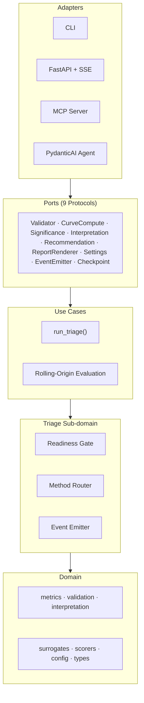
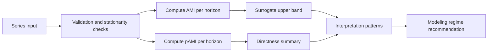

<!-- type: reference -->
# AMI -> pAMI Forecastability Analysis

[](https://github.com/AdamKrysztopa/dependence-forecastability/actions)
[](https://github.com/AdamKrysztopa/dependence-forecastability/releases)
[](https://github.com/AdamKrysztopa/dependence-forecastability/tree/main/docs)
[](https://python.org)
[](https://doi.org/10.48550/arXiv.2601.10006)

## Value proposition

This package reproduces the paper's horizon-specific AMI workflow and extends it with pAMI and deterministic triage tooling so you can quickly assess whether dependence is strong, direct, and likely useful before costly model search.

## Quickstart ladder (recommended)

Start with one deterministic signal and move from CLI to notebook, Python API,
HTTP API, then optional agent/MCP surfaces:

- [docs/quickstart.md](docs/quickstart.md)

## Who this is for

- Forecasting practitioners who need a pre-model diagnostic for lag usefulness.
- Data scientists comparing direct vs mediated dependence across horizons.
- Teams building production triage flows (CLI, API, or notebooks) around deterministic metrics.

## Fastest quickstart (single executable path)

```bash
uv sync && MPLBACKEND=Agg uv run python scripts/run_canonical_examples.py
```

## What result you get

- Canonical AMI and pAMI JSON outputs in `outputs/json/canonical/`.
- Canonical diagnostic figures in `outputs/figures/canonical/`.
- Deterministic A-E pattern classification plus lag recommendations per series.

## Where to go next

- Benchmark panel evaluation: `MPLBACKEND=Agg uv run python scripts/run_benchmark_panel.py`
- Exogenous driver analysis: `MPLBACKEND=Agg uv run python scripts/run_exog_analysis.py`
- Component selection guide: [docs/why_use_this.md](docs/why_use_this.md)
- Industrial scenario guide: [docs/use_cases_industrial.md](docs/use_cases_industrial.md)
- Results summary (evidence-first): [docs/results_summary.md](docs/results_summary.md)
- Agentic walkthrough notebook: [notebooks/03_agentic_triage.ipynb](notebooks/03_agentic_triage.ipynb)
- Full docs index: [docs/README.md](docs/README.md)

## Visual architecture summary



The package follows hexagonal (ports-and-adapters) architecture. Domain code has no dependency on adapters; adapters wire concrete implementations at the edge.

## Common use cases

- Signal triage: quickly classify whether a series is likely forecastable at useful horizons.
- Lookback/horizon screening: identify lag ranges where AMI and pAMI remain informative.
- Exogenous driver screening: rank candidate external drivers with CrossAMI and pCrossAMI.
- Industrial/PdM context: prioritize sensors or telemetry channels before full model pipelines.

## Versioning and stability

- Release history: [CHANGELOG.md](CHANGELOG.md)
- Policy and stability matrix: [docs/versioning.md](docs/versioning.md)

Current snapshot: core domain APIs are stable; CLI and HTTP API adapters are beta; MCP and agent layers are experimental.

## Production readiness

- Contract: [docs/production_readiness.md](docs/production_readiness.md)
- Safe default path: run deterministic `run_triage()` first; treat LLM narration as optional.

## What this project adds beyond the paper

The paper validates AMI as a frequency-conditional triage signal for model selection. This project adds diagnostics and infrastructure the paper does not provide:

| Extension | What it adds |
|---|---|
| **pAMI** (partial AMI) | Separates direct lag links from mediated lag chains via linear residualisation |
| **`directness_ratio`** | `AUC(pAMI) / AUC(AMI)` — summarises how much total dependence remains direct |
| **Exogenous analysis** | `ForecastabilityAnalyzerExog` computes CrossAMI + pCrossAMI between target and driver series |
| **Scorer registry** | Method-independent pipeline: MI, Pearson, Spearman, Kendall, Distance Correlation — extensible via `DependenceScorer` protocol |
| **Triage pipeline** | `run_triage()` — readiness gate → method routing → compute → interpretation → recommendation |
| **Agentic interpretation** | PydanticAI agent narrates deterministic numeric results in plain language — never invents numbers |
| **MCP server** | Model Context Protocol integration for IDE-integrated assistants |
| **CLI** | `forecastability triage`, `forecastability list-scorers` |
| **HTTP API** | FastAPI endpoints + SSE streaming for stage progress |
| **Pattern classification** | Deterministic A–E modeling regime assignment |

> [!IMPORTANT]
> All extensions are clearly separated from the paper baseline.
> Domain code follows hexagonal architecture — adapters (CLI, API, MCP, Agent) never leak into core forecastability logic.

## Features

| Feature | Description |
|---|---|
| AMI curves | Horizon-specific mutual information with kNN estimator |
| pAMI curves | Partial AMI via linear residualisation — direct lag links |
| Surrogate significance | Phase-randomised FFT surrogates (\(n \ge 99\)) with 95% bands |
| Directness ratio | `AUC(pAMI) / AUC(AMI)` — how much dependence is direct |
| Exogenous analysis | CrossAMI + pCrossAMI between target and driver series |
| Scorer registry | 5 built-in scorers (MI, Pearson, Spearman, Kendall, dCor); extensible via `DependenceScorer` protocol |
| Triage pipeline | `run_triage()` — readiness → routing → compute → interpretation |
| Pattern classification | Deterministic A–E modeling regime assignment |
| Rolling-origin evaluation | Expanding-window backtest with train-only diagnostics |
| Agentic interpretation | PydanticAI agent that narrates deterministic results (optional `agent` extra) |
| CLI | `forecastability triage`, `forecastability list-scorers` |
| HTTP API | FastAPI endpoints + SSE streaming (`transport` extra) |
| MCP server | Model Context Protocol tools for IDE-integrated assistants (`transport` extra) |

## Core workflow



## Quality and invariants

Project invariants:
- AMI/pAMI are horizon-specific.
- Rolling-origin diagnostics are train-window only.
- Surrogate runs require `n_surrogates >= 99`.
- Integrals use `np.trapezoid` (not `np.trapz`).
- `directness_ratio > 1.0` is treated as an ARCH/estimation warning, not direct evidence.

## Installation matrix

| Profile | Install command | Includes |
|---|---|---|
| Core | `uv sync` | Base package dependencies |
| Transport | `uv sync --extra transport` | FastAPI, Uvicorn, and MCP transport adapters |
| Agent | `uv sync --extra agent` | PydanticAI narration adapter |
| Dev | `uv sync --group dev` | Test, lint, and type-check toolchain |
| Notebook (optional) | `uv sync --group notebook` | Jupyter and notebook execution tooling |

Python compatibility notes:
- Project metadata declares `requires-python = ">=3.11,<3.13"`.
- Use Python 3.11 or 3.12 for supported installs.
- Python 3.13+ is intentionally excluded until compatibility is validated.

## Run

```bash
uv sync
uv run pytest -q -ra
uv run ruff check .
uv run ty check
```

## Agent quickstart

The agentic triage layer wraps the deterministic `run_triage()` pipeline with
an LLM adapter that explains results in plain language.  All numbers come from
deterministic tools — the agent never invents numeric values.

### Prerequisites

```bash
uv sync --extra agent  # installs pydantic-ai
```

Configure in `.env` (see `.env.example`):

```ini
OPENAI_API_KEY=sk-...
OPENAI_MODEL=gpt-4o            # or gpt-4o-mini, gpt-4.1, etc.
```

### Minimal usage (deterministic only — no LLM)

```python
import numpy as np
from forecastability.triage import run_triage, TriageRequest

rng = np.random.default_rng(42)
ts = np.array([0.85 ** i + rng.standard_normal() * 0.1 for i in range(300)])

result = run_triage(TriageRequest(series=ts, goal="univariate", random_state=42))
print(result.interpretation.forecastability_class)  # "high"
print(result.recommendation)
```

### With LLM explanation (requires `agent` extra)

```python
import asyncio
import numpy as np
from forecastability.adapters.pydantic_ai_agent import run_triage_agent

async def main():
    rng = np.random.default_rng(42)
    ts = np.array([0.85 ** i + rng.standard_normal() * 0.1 for i in range(300)])
    explanation = await run_triage_agent(ts, max_lag=30, random_state=42)
    print(explanation.narrative)
    print(explanation.caveats)

asyncio.run(main())
```

### Provider selection

The agent defaults to the model configured in `OPENAI_MODEL` (settings layer).
Override per call:

```python
from forecastability.adapters.pydantic_ai_agent import create_triage_agent
agent = create_triage_agent(model="openai:gpt-4o-mini")
```

Any PydanticAI-compatible provider string works (e.g. `"anthropic:claude-3-5-sonnet-latest"`).

> [!IMPORTANT]
> The agent only narrates deterministic results.  It does not generate numeric
> values.  `TriageResult.narrative` is always `None` for plain `run_triage()` calls.

See [notebooks/03_agentic_triage.ipynb](notebooks/03_agentic_triage.ipynb) for a
full interactive walkthrough.

## Interactive Notebooks

Four self-contained Jupyter notebooks are provided in `notebooks/`.
Install extras and register the kernel once:

```bash
uv sync --group notebook
uv run python -m ipykernel install --user --name forecastability
```

| Notebook | File | Description |
|---|---|---|
| 1 · Canonical Forecastability Cases — AMI vs pAMI + Full Report | [`notebooks/01_canonical_forecastability.ipynb`](notebooks/01_canonical_forecastability.ipynb) | End-to-end walk-through on five synthetic/real series (White Noise, AR(1), Logistic Map, Sine+Noise, Hénon Map).  Computes AMI and pAMI curves, surrogate bands, directness ratios, pattern interpretation, and generates a full Markdown report. |
| 2 · Exogenous Analysis — CrossAMI + pCrossAMI + Full Report | [`notebooks/02_exogenous_analysis.ipynb`](notebooks/02_exogenous_analysis.ipynb) | Multivariate lead-lag diagnosis across seven benchmark pairs (bike-sharing, AAPL/SPY, BTC/ETH, plus noise controls).  Demonstrates `ForecastabilityAnalyzerExog`, rolling-origin evaluation, heatmaps, directness-ratio triage, and driver ranking. |
| 3 · Agentic Triage — AMI · pAMI · CrossAMI · PydanticAI | [`notebooks/03_agentic_triage.ipynb`](notebooks/03_agentic_triage.ipynb) | One-cell `run_triage()` entry point, readiness gate demo, univariate triage across five canonical series, exogenous CrossAMI triage, event emission and timing, curve visualisation, and optional PydanticAI agent narration. |
| 4 · Agentic Feature Screening — Which Drivers Matter? | [`notebooks/04_agentic_screening.ipynb`](notebooks/04_agentic_screening.ipynb) | Feature screening via deterministic triage vs agentic interpretation. Manual per-feature CrossAMI/pCrossAMI computation compared with single-prompt agent-driven ranked recommendations. Uses bike-sharing hourly data (temp, humidity, windspeed → cnt). |

## Documentation map

Full documentation index: [docs/README.md](docs/README.md)

| Area | Key Documents |
|---|---|
| **Architecture** | [docs/architecture.md](docs/architecture.md) |
| **Theory** | [docs/theory/foundations.md](docs/theory/foundations.md) · [docs/theory/interpretation_patterns.md](docs/theory/interpretation_patterns.md) |
| **Code reference** | [docs/code/module_map.md](docs/code/module_map.md) · [docs/code/exog_analyzer.md](docs/code/exog_analyzer.md) |
| **Planning** | [docs/plan/README.md](docs/plan/README.md) · [docs/plan/acceptance_criteria.md](docs/plan/acceptance_criteria.md) |
| **Archive** | [docs/archive/](docs/archive/) (27 historical build-phase documents) |

## Paper baseline (what we are based on)

Source paper:
- Peter Maurice Catt, *The Knowable Future: Mapping the Decay of Past-Future Mutual Information Across Forecast Horizons*, arXiv:2601.10006 (January 2026; v3 February 2026)
- PDF: https://arxiv.org/pdf/2601.10006
- DOI: https://doi.org/10.48550/arXiv.2601.10006

Paper setup reproduced here:
- M4 frequencies: Yearly, Quarterly, Monthly, Weekly, Daily, Hourly
- Horizon caps by frequency (paper Section 3.1): 6, 8, 18, 13, 14, 48 respectively
- Rolling-origin protocol with train-only diagnostics and post-origin forecast scoring
- Surrogate significance logic with \(n_{surrogates} \ge 99\) and 95% bands

Paper finding used as anchor:
- AMI is a frequency-conditional triage signal for model selection.
- Strongest negative AMI-sMAPE rank association appears in higher-information regimes (Hourly/Weekly/Quarterly/Yearly), weaker for Daily and moderate for Monthly.

## Time-series applicability (paper + implementation)

From the paper:
- Very short, sparse, or degenerate series can make MI estimates unstable.
- Hourly/Weekly/Quarterly/Yearly showed clearer AMI-error discrimination than Daily.
- Frequency-specific horizon caps are required to avoid infeasible or noisy long-horizon evaluation.

From this implementation:
- AMI minimum length constraint:
    \[
    N \ge \texttt{max\_lag} + \texttt{min\_pairs\_ami} + 1
    \]
- pAMI minimum length constraint (linear residual backend):
    \[
    N \ge \max\left(\texttt{max\_lag} + \texttt{min\_pairs\_pami} + 1,\ 2\,\texttt{max\_lag}\right)
    \]
- Defaults (`max_lag=100`, `min_pairs_ami=30`, `min_pairs_pami=50`) imply:
    - AMI: \(N \ge 131\)
    - pAMI: \(N \ge 201\)

Operational guidance:
- Detrend or difference before AMI/pAMI when strong trend exists.
- Avoid interpreting sparse intermittent-demand series with many structural zeros as if they were dense continuous processes.
- Keep lags modest for short yearly/quarterly histories.

## Extension disclosure

AMI is paper-native (arXiv:2601.10006). The following are project extensions not present in the original paper: pAMI, exogenous cross-dependence (CrossAMI/pCrossAMI), scorer-registry generalization, deterministic triage pipeline (`run_triage()`), agentic interpretation layer (PydanticAI), CLI, HTTP API (FastAPI + SSE), and MCP server.
