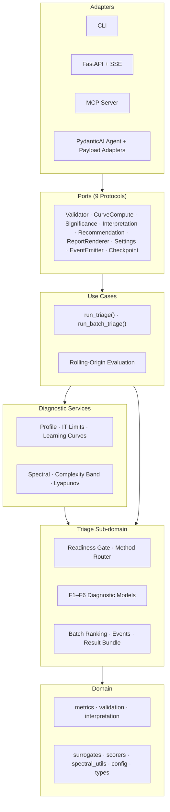
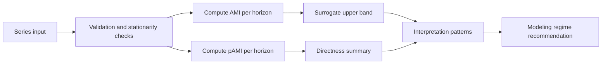

<!-- type: reference -->
# Forecastability Triage Toolkit

> A deterministic pre-model triage toolkit for time series.
> Assess whether dependence is strong, direct, and exploitable *before* costly model search.

[](https://github.com/AdamKrysztopa/dependence-forecastability/actions)
[](https://github.com/AdamKrysztopa/dependence-forecastability/releases)
[](https://github.com/AdamKrysztopa/dependence-forecastability/tree/main/docs)
[](https://python.org)
[](https://doi.org/10.48550/arXiv.2601.10006)

## What it does

Built on AMI (Catt 2026) as the paper-aligned foundation, extended with pAMI and **nine diagnostic families** drawn from multiple papers — forecastability profiles, information-theoretic ceilings, predictive-information learning curves, spectral predictability, Lyapunov stability, entropy-based complexity, batch multi-signal ranking, and exogenous screening — all behind a single `run_triage()` / `run_batch_triage()` entry point.

> [!NOTE]
> AMI is the paper-aligned core. pAMI and all F1–F9 diagnostics are project extensions.
> See [docs/wording_policy.md](docs/wording_policy.md) for the canonical product description.

## Quickstart ladder (recommended)

Start with one deterministic signal and move from CLI to notebook, Python API,
HTTP API, then optional agent/MCP surfaces:

- [docs/quickstart.md](docs/quickstart.md)

## Who this is for

- Forecasting practitioners who need a pre-model diagnostic for lag usefulness.
- Data scientists comparing direct vs mediated dependence across horizons.
- Teams building production triage flows (CLI, API, or notebooks) around deterministic metrics.

## Fastest quickstart (single executable path)

```bash
uv sync && MPLBACKEND=Agg uv run python scripts/run_canonical_examples.py
```

## What result you get

- Canonical AMI and pAMI JSON outputs in `outputs/json/canonical/`.
- Canonical diagnostic figures in `outputs/figures/canonical/`.
- Deterministic A-E pattern classification plus lag recommendations per series.

## Where to go next

- Executive one-page overview: [docs/executive_summary.md](docs/executive_summary.md)
- Benchmark panel evaluation: `MPLBACKEND=Agg uv run python scripts/run_benchmark_panel.py`
- Exogenous driver analysis: `MPLBACKEND=Agg uv run python scripts/run_exog_analysis.py`
- Component selection guide: [docs/why_use_this.md](docs/why_use_this.md)
- Industrial scenario guide: [docs/use_cases_industrial.md](docs/use_cases_industrial.md)
- HTTP API contract reference: [docs/api_contract.md](docs/api_contract.md)
- Observability and auditability guide: [docs/observability.md](docs/observability.md)
- Agent layer contract (deterministic-first): [docs/agent_layer.md](docs/agent_layer.md)
- Results summary (evidence-first): [docs/results_summary.md](docs/results_summary.md)
- Durable notebook narratives (primary docs layer): [docs/notebooks/README.md](docs/notebooks/README.md)
- Agentic walkthrough notebook: [notebooks/walkthroughs/03_triage_end_to_end.ipynb](notebooks/walkthroughs/03_triage_end_to_end.ipynb)
- Deterministic payload/serializer deep dive notebook: [notebooks/triage/06_agent_ready_triage_interpretation.ipynb](notebooks/triage/06_agent_ready_triage_interpretation.ipynb)
- Full docs index: [docs/README.md](docs/README.md)

## Visual architecture summary



The package follows hexagonal (ports-and-adapters) architecture. Domain code has no dependency on adapters; adapters wire concrete implementations at the edge.

## Common use cases

- **Signal triage** — classify whether a series is likely forecastable at useful horizons.
- **Lookback / horizon screening** — identify lag ranges where AMI and pAMI remain informative.
- **Forecastability profiling** — compute the horizon-wise $h \to F(h)$ profile, peak horizon, and informative horizon set (F1).
- **Compression / ceiling detection** — check whether theoretical MI limits are violated or nearly saturated (F2).
- **Lookback selection** — use predictive-information learning curves to pick optimal embedding dimension (F3).
- **Spectral vs MI divergence** — compare spectral predictability $\Omega$ with AMI to flag nonlinearity (F4).
- **Complexity screening** — classify signals into low / medium / high complexity bands via permutation + spectral entropy (F6).
- **Batch diagnostic ranking** — rank 50+ signals on all diagnostics in one call (F7).
- **Exogenous driver screening** — rank candidate external drivers with CrossAMI/pCrossAMI plus FDR correction (F8).
- **Industrial / PdM context** — prioritize sensors or telemetry channels before full model pipelines.

## Versioning and stability

- Release history: [CHANGELOG.md](CHANGELOG.md)
- Policy and stability matrix: [docs/versioning.md](docs/versioning.md)

Current snapshot: core domain APIs are stable; CLI and HTTP API adapters are beta; MCP and agent layers are experimental.

## Production readiness

- Contract: [docs/production_readiness.md](docs/production_readiness.md)
- Safe default path: run deterministic `run_triage()` first; treat LLM narration as optional.

## What this project adds beyond the paper

The original paper validates AMI as a frequency-conditional triage signal for model selection. This project adds diagnostics drawn from multiple papers and infrastructure the original paper does not provide:

| Extension | What it adds | Paper basis |
|---|---|---|
| **pAMI** (partial AMI) | Separates direct lag links from mediated lag chains via linear residualisation | Project extension |
| **`directness_ratio`** | `AUC(pAMI) / AUC(AMI)` — how much total dependence remains direct | Project extension |
| **F1 — Forecastability Profile** | Horizon-wise $h \to F(h)$ curve, peak horizon, informative horizon set, non-monotonicity detection | Catt (2026), [arXiv:2603.27074](https://arxiv.org/abs/2603.27074) |
| **F2 — IT Limit Diagnostics** | Theoretical MI ceiling under log loss, compression / DPI warnings | Catt (2026), [arXiv:2603.27074](https://arxiv.org/abs/2603.27074) |
| **F3 — Predictive Info Learning Curves** | EvoRate-inspired lookback analysis via kNN MI in embedding dim $k$, plateau detection, recommended lookback | Morawski et al. (2025), [arXiv:2510.10744](https://arxiv.org/abs/2510.10744) |
| **F4 — Spectral Predictability** | Welch PSD → spectral entropy → normalised predictability $\Omega$; divergence with AMI signals nonlinearity | Wang et al. (2025), [arXiv:2507.13556](https://arxiv.org/abs/2507.13556) |
| **F5 — Largest Lyapunov Exponent** | Experimental Rosenstein LLE via delay embedding; gated behind `experimental: true` | Wang et al. (2025), [arXiv:2507.13556](https://arxiv.org/abs/2507.13556) |
| **F6 — Entropy-Based Complexity** | Permutation entropy + spectral entropy → complexity band (low / medium / high) | Ponce-Flores et al. (2020); Bandt & Pompe (2002) |
| **F7 — Batch Multi-Signal Ranking** | `run_batch_triage()` with all diagnostics; handles 50+ signals | Project extension |
| **F8 — Enhanced Exogenous Screening** | Inter-driver redundancy penalty + Benjamini-Hochberg FDR correction | Project extension |
| **F9 — Benchmark & Reproducibility** | Full diagnostic regression fixtures for F1–F6, batch and exogenous regression, rebuild / verify scripts | Project extension |
| **Exogenous analysis** | `ForecastabilityAnalyzerExog` — CrossAMI + pCrossAMI between target and driver series | Project extension |
| **Scorer registry** | MI, Pearson, Spearman, Kendall, dCor — extensible via `DependenceScorer` protocol | Project extension |
| **Triage pipeline** | `run_triage()` — readiness gate → method routing → compute → interpretation → recommendation | Project extension |
| **Agent adapters** | Structured Pydantic payloads for all diagnostics (`triage_agent_payload_models`, `triage_summary_serializer`, `triage_agent_interpretation_adapter`) | Project extension |
| **Agentic interpretation** | PydanticAI agent narrates deterministic numeric results — never invents numbers | Project extension |
| **MCP server** | Model Context Protocol integration for IDE-integrated assistants | Project extension |
| **CLI** | `forecastability triage`, `forecastability list-scorers` | Project extension |
| **HTTP API** | FastAPI endpoints + SSE streaming for stage progress | Project extension |
| **Pattern classification** | Deterministic A–E modeling regime assignment | Project extension |

> [!IMPORTANT]
> All extensions are clearly separated from the paper baseline.
> Domain code follows hexagonal architecture — adapters (CLI, API, MCP, Agent) never leak into core forecastability logic.

## Features

| Feature | Description |
|---|---|
| AMI curves | Horizon-specific mutual information with kNN estimator |
| pAMI curves | Partial AMI via linear residualisation — direct lag links |
| Surrogate significance | Phase-randomised FFT surrogates ($n \ge 99$) with 95% bands |
| Directness ratio | `AUC(pAMI) / AUC(AMI)` — how much dependence is direct |
| Forecastability profile (F1) | Horizon-wise $h \to F(h)$ profile, peak horizon, informative horizon set, non-monotonicity flag |
| IT limit diagnostics (F2) | Theoretical MI ceiling, compression / DPI warnings, exploitation ratio |
| Predictive info learning curves (F3) | kNN MI vs embedding dim $k$, plateau detection, recommended lookback, small-$n$ warnings |
| Spectral predictability (F4) | Welch PSD → spectral entropy → normalised predictability $\Omega$ |
| Largest Lyapunov exponent (F5) | Experimental Rosenstein LLE via delay embedding (gated: `experimental: true`) |
| Entropy-based complexity (F6) | Permutation entropy + spectral entropy → complexity band (low / medium / high) |
| Batch multi-signal ranking (F7) | `run_batch_triage()` with all diagnostic columns; handles 50+ signals |
| Exogenous screening (F8) | CrossAMI + pCrossAMI with redundancy penalty and Benjamini-Hochberg FDR correction |
| Benchmark & reproducibility (F9) | Diagnostic regression fixtures for F1–F6, rebuild and verify scripts |
| Exogenous analysis | CrossAMI + pCrossAMI between target and driver series |
| Scorer registry | 5 built-in scorers (MI, Pearson, Spearman, Kendall, dCor); extensible via `DependenceScorer` protocol |
| Triage pipeline | `run_triage()` — readiness → routing → compute → interpretation |
| Pattern classification | Deterministic A–E modeling regime assignment |
| Rolling-origin evaluation | Expanding-window backtest with train-only diagnostics |
| Agent adapters | Structured Pydantic payloads for all diagnostics (payload models, serializer, interpretation adapter) |
| Agentic interpretation | PydanticAI agent that narrates deterministic results (optional `agent` extra) |
| CLI | `forecastability triage`, `forecastability list-scorers` |
| HTTP API | FastAPI endpoints + SSE streaming (`transport` extra) |
| MCP server | Model Context Protocol tools for IDE-integrated assistants (`transport` extra) |

## Core workflow



## Quality and invariants

Project invariants:
- AMI/pAMI are horizon-specific.
- Rolling-origin diagnostics are train-window only.
- Surrogate runs require `n_surrogates >= 99`.
- Integrals use `np.trapezoid` (not `np.trapz`).
- `directness_ratio > 1.0` is treated as an ARCH/estimation warning, not direct evidence.

## Installation matrix

| Profile | Install command | Includes |
|---|---|---|
| Core | `uv sync` | Base package dependencies |
| Transport | `uv sync --extra transport` | FastAPI, Uvicorn, and MCP transport adapters |
| Agent | `uv sync --extra agent` | PydanticAI narration adapter |
| Dev | `uv sync --group dev` | Test, lint, and type-check toolchain |
| Notebook (optional) | `uv sync --group notebook` | Jupyter and notebook execution tooling |

Python compatibility notes:
- Project metadata declares `requires-python = ">=3.11,<3.13"`.
- Use Python 3.11 or 3.12 for supported installs.
- Python 3.13+ is intentionally excluded until compatibility is validated.

## Run

```bash
uv sync
uv run pytest -q -ra
uv run ruff check .
uv run ty check
```

## Agent quickstart

The agentic triage layer wraps the deterministic `run_triage()` pipeline with
an LLM adapter that explains results in plain language.  All numbers come from
deterministic tools — the agent never invents numeric values.

### Prerequisites

```bash
uv sync --extra agent  # installs pydantic-ai
```

Configure in `.env` (see `.env.example`):

```ini
OPENAI_API_KEY=sk-...
OPENAI_MODEL=gpt-4o            # or gpt-4o-mini, gpt-4.1, etc.
```

### Minimal usage (deterministic only — no LLM)

```python
import numpy as np
from forecastability.triage import run_triage, TriageRequest

rng = np.random.default_rng(42)
ts = np.array([0.85 ** i + rng.standard_normal() * 0.1 for i in range(300)])

result = run_triage(TriageRequest(series=ts, goal="univariate", random_state=42))
print(result.interpretation.forecastability_class)  # "high"
print(result.recommendation)
```

### With LLM explanation (requires `agent` extra)

```python
import asyncio
import numpy as np
from forecastability.adapters.pydantic_ai_agent import run_triage_agent

async def main():
    rng = np.random.default_rng(42)
    ts = np.array([0.85 ** i + rng.standard_normal() * 0.1 for i in range(300)])
    explanation = await run_triage_agent(ts, max_lag=30, random_state=42)
    print(explanation.narrative)
    print(explanation.caveats)

asyncio.run(main())
```

### Provider selection

The agent defaults to the model configured in `OPENAI_MODEL` (settings layer).
Override per call:

```python
from forecastability.adapters.pydantic_ai_agent import create_triage_agent
agent = create_triage_agent(model="openai:gpt-4o-mini")
```

Any PydanticAI-compatible provider string works (e.g. `"anthropic:claude-3-5-sonnet-latest"`).

> [!IMPORTANT]
> The agent only narrates deterministic results.  It does not generate numeric
> values.  `TriageResult.narrative` is always `None` for plain `run_triage()` calls.

See [notebooks/walkthroughs/03_triage_end_to_end.ipynb](notebooks/walkthroughs/03_triage_end_to_end.ipynb) for a
full interactive walkthrough.

## Interactive Notebooks

Install extras and register the kernel once:

```bash
uv sync --group notebook
uv run python -m ipykernel install --user --name forecastability
```

Notebook taxonomy is frozen to exactly two long-lived families:

- `notebooks/walkthroughs/` — curated end-to-end user and maintainer surfaces.
- `notebooks/triage/` — deterministic deep dives for specific diagnostic methods.

Ownership and architecture discipline:

- Notebooks are consumer and demonstrator surfaces, not runtime implementation surfaces.
- Runtime logic must live in `src/forecastability/` and follow hexagonal boundaries (`adapters -> use_cases -> domain`) with SOLID responsibilities.
- Notebook cells may orchestrate examples and visual explanations, but they must not become authoritative runtime paths.

Deprecation policy for root-level notebooks:

- No new long-lived notebooks may be added under `notebooks/` root.
- Root-level notebook files are redirect shims pointing to the corresponding `notebooks/walkthroughs/` notebooks.

Notebook taxonomy (final):

| Surface | Path(s) | Role |
|---|---|---|
| Long-lived family | `notebooks/triage/` | Deterministic deep-dive track (active). |
| Long-lived family | `notebooks/walkthroughs/` | Curated walkthrough track (active). |

Durable narrative pages for walkthrough surfaces:

- [docs/notebooks/canonical_forecastability.md](docs/notebooks/canonical_forecastability.md)
- [docs/notebooks/exogenous_analysis.md](docs/notebooks/exogenous_analysis.md)
- [docs/notebooks/agentic_triage.md](docs/notebooks/agentic_triage.md)

## Documentation map

Full documentation index: [docs/README.md](docs/README.md)

| Area | Key Documents |
|---|---|
| **Executive overview** | [docs/executive_summary.md](docs/executive_summary.md) |
| **Architecture** | [docs/architecture.md](docs/architecture.md) |
| **Theory — foundations** | [docs/theory/foundations.md](docs/theory/foundations.md) · [docs/theory/interpretation_patterns.md](docs/theory/interpretation_patterns.md) · [docs/theory/pami_residual_backends.md](docs/theory/pami_residual_backends.md) |
| **Theory — triage diagnostics** | [docs/theory/forecastability_profile.md](docs/theory/forecastability_profile.md) · [docs/theory/spectral_predictability.md](docs/theory/spectral_predictability.md) · [docs/theory/entropy_based_complexity.md](docs/theory/entropy_based_complexity.md) |
| **Triage methods** | [docs/triage_methods/predictive_information_learning_curves.md](docs/triage_methods/predictive_information_learning_curves.md) · [docs/triage_methods/largest_lyapunov_exponent.md](docs/triage_methods/largest_lyapunov_exponent.md) |
| **Code reference** | [docs/code/module_map.md](docs/code/module_map.md) · [docs/code/exog_analyzer.md](docs/code/exog_analyzer.md) |
| **Examples** | [examples/triage/](examples/triage/) — 12 standalone scripts covering F1–F8 features and agent adapter demos |
| **Planning** | [docs/plan/README.md](docs/plan/README.md) · [docs/plan/acceptance_criteria.md](docs/plan/acceptance_criteria.md) |
| **Archive** | [docs/archive/](docs/archive/) (27 historical build-phase documents) |

## Paper baseline (what we are based on)

### Primary paper (AMI triage signal)

- Peter Maurice Catt, *The Knowable Future: Mapping the Decay of Past-Future Mutual Information Across Forecast Horizons*, [arXiv:2601.10006](https://doi.org/10.48550/arXiv.2601.10006) (January 2026; v3 February 2026)

Paper setup reproduced here:
- M4 frequencies: Yearly, Quarterly, Monthly, Weekly, Daily, Hourly
- Horizon caps by frequency (paper Section 3.1): 6, 8, 18, 13, 14, 48 respectively
- Rolling-origin protocol with train-only diagnostics and post-origin forecast scoring
- Surrogate significance logic with $n_{\text{surrogates}} \ge 99$ and 95% bands

Paper finding used as anchor:
- AMI is a frequency-conditional triage signal for model selection.
- Strongest negative AMI-sMAPE rank association appears in higher-information regimes (Hourly/Weekly/Quarterly/Yearly), weaker for Daily and moderate for Monthly.

### Extended paper references (triage diagnostics F1–F6)

| Feature | Paper | Reference |
|---|---|---|
| F1 — Forecastability Profile | Catt (2026) | [arXiv:2603.27074](https://arxiv.org/abs/2603.27074) |
| F2 — IT Limit Diagnostics | Catt (2026) | [arXiv:2603.27074](https://arxiv.org/abs/2603.27074) |
| F3 — Predictive Info Learning Curves | Morawski et al. (2025) | [arXiv:2510.10744](https://arxiv.org/abs/2510.10744) |
| F4 — Spectral Predictability | Wang et al. (2025) | [arXiv:2507.13556](https://arxiv.org/abs/2507.13556) |
| F5 — Largest Lyapunov Exponent | Wang et al. (2025) | [arXiv:2507.13556](https://arxiv.org/abs/2507.13556) |
| F6 — Entropy-Based Complexity | Ponce-Flores et al. (2020); Bandt & Pompe (2002) | — |
| F7 — Batch Ranking | Goerg (2013) — ForeCA inspiration | — |

## Time-series applicability (paper + implementation)

From the paper:
- Very short, sparse, or degenerate series can make MI estimates unstable.
- Hourly/Weekly/Quarterly/Yearly showed clearer AMI-error discrimination than Daily.
- Frequency-specific horizon caps are required to avoid infeasible or noisy long-horizon evaluation.

From this implementation:
- AMI minimum length constraint:
    $$N \ge \texttt{max\_lag} + \texttt{min\_pairs\_ami} + 1$$
- pAMI minimum length constraint (linear residual backend):
    $$N \ge \max\left(\texttt{max\_lag} + \texttt{min\_pairs\_pami} + 1,\ 2\,\texttt{max\_lag}\right)$$
- Defaults (`max_lag=100`, `min_pairs_ami=30`, `min_pairs_pami=50`) imply:
    - AMI: $N \ge 131$
    - pAMI: $N \ge 201$

Operational guidance:
- Detrend or difference before AMI/pAMI when strong trend exists.
- Avoid interpreting sparse intermittent-demand series with many structural zeros as if they were dense continuous processes.
- Keep lags modest for short yearly/quarterly histories.

## Extension disclosure

AMI is paper-native ([arXiv:2601.10006](https://doi.org/10.48550/arXiv.2601.10006)). The following are **project extensions** not present in the original paper:

- **pAMI**, exogenous cross-dependence (CrossAMI / pCrossAMI), scorer-registry generalisation
- **F1–F2** (forecastability profile, IT limits) — based on [arXiv:2603.27074](https://arxiv.org/abs/2603.27074)
- **F3** (predictive info learning curves) — based on [arXiv:2510.10744](https://arxiv.org/abs/2510.10744)
- **F4–F5** (spectral predictability, Lyapunov exponent) — based on [arXiv:2507.13556](https://arxiv.org/abs/2507.13556)
- **F6** (entropy-based complexity) — based on Ponce-Flores et al. (2020) and Bandt & Pompe (2002)
- **F7** (batch multi-signal ranking), **F8** (enhanced exogenous screening), **F9** (benchmark & reproducibility)
- Deterministic triage pipeline (`run_triage()`, `run_batch_triage()`)
- Agent adapters (payload models, summary serialiser, interpretation adapter)
- Agentic interpretation layer (PydanticAI), CLI, HTTP API (FastAPI + SSE), MCP server
