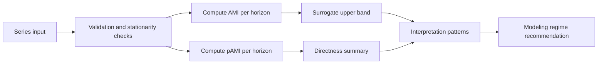

<!-- type: reference -->
# AMI -> pAMI Forecastability Analysis

[](https://python.org)
[](https://doi.org/10.48550/arXiv.2601.10006)

## What this repository does

This project reproduces the paper's horizon-specific AMI workflow and extends it with pAMI for direct-vs-mediated lag structure analysis.

- Paper-native metric: AMI, \(I_h = I(X_t; X_{t+h})\)
- Project extension: pAMI, \(\tilde{I}_h = I(X_t; X_{t+h} \mid X_{t+1},\ldots,X_{t+h-1})\)
- Scope extension: exogenous cross-dependence and a scorer registry

## Paper baseline (what we are based on)

Source paper:
- Peter Maurice Catt, *The Knowable Future: Mapping the Decay of Past-Future Mutual Information Across Forecast Horizons*, arXiv:2601.10006 (January 2026; v3 February 2026)
- PDF: https://arxiv.org/pdf/2601.10006
- DOI: https://doi.org/10.48550/arXiv.2601.10006

Paper setup reproduced here:
- M4 frequencies: Yearly, Quarterly, Monthly, Weekly, Daily, Hourly
- Horizon caps by frequency (paper Section 3.1): 6, 8, 18, 13, 14, 48 respectively
- Rolling-origin protocol with train-only diagnostics and post-origin forecast scoring
- Surrogate significance logic with \(n_{surrogates} \ge 99\) and 95% bands

Paper finding used as anchor:
- AMI is a frequency-conditional triage signal for model selection.
- Strongest negative AMI-sMAPE rank association appears in higher-information regimes (Hourly/Weekly/Quarterly/Yearly), weaker for Daily and moderate for Monthly.

## Time-series applicability (paper + implementation)

From the paper:
- Very short, sparse, or degenerate series can make MI estimates unstable.
- Hourly/Weekly/Quarterly/Yearly showed clearer AMI-error discrimination than Daily.
- Frequency-specific horizon caps are required to avoid infeasible or noisy long-horizon evaluation.

From this implementation:
- AMI minimum length constraint:
  \[
  N \ge \texttt{max\_lag} + \texttt{min\_pairs\_ami} + 1
  \]
- pAMI minimum length constraint (linear residual backend):
  \[
  N \ge \max\left(\texttt{max\_lag} + \texttt{min\_pairs\_pami} + 1,\ 2\,\texttt{max\_lag}\right)
  \]
- Defaults (`max_lag=100`, `min_pairs_ami=30`, `min_pairs_pami=50`) imply:
  - AMI: \(N \ge 131\)
  - pAMI: \(N \ge 201\)

Operational guidance:
- Detrend or difference before AMI/pAMI when strong trend exists.
- Avoid interpreting sparse intermittent-demand series with many structural zeros as if they were dense continuous processes.
- Keep lags modest for short yearly/quarterly histories.

## Why this project extends the paper

The paper validates AMI for forecastability triage. This project adds diagnostics the paper does not provide:

- pAMI (project extension): separates direct lag links from mediated lag chains.
- `directness_ratio = AUC(pAMI) / AUC(AMI)`: summarizes how much total dependence remains direct.
- Exogenous extension (`ForecastabilityAnalyzerExog`): raw and partial cross-dependence curves.
- Method-independent scorer registry: same horizon-specific pipeline for MI, linear, rank, and distance scorers.

Value added:
- Better lag-feature design decisions (direct vs mediated dependence).
- Better interpretation of why high total dependence may still be hard to exploit.
- Reusable dependence-analysis pipeline beyond a single metric.

## Core workflow



## Quality and invariants

Project invariants:
- AMI/pAMI are horizon-specific.
- Rolling-origin diagnostics are train-window only.
- Surrogate runs require `n_surrogates >= 99`.
- Integrals use `np.trapezoid` (not `np.trapz`).
- `directness_ratio > 1.0` is treated as an ARCH/estimation warning, not direct evidence.

## Run

```bash
uv sync
uv run pytest -q -ra
uv run ruff check .
uv run ty check
```

## Interactive Notebooks

Two self-contained Jupyter notebooks are provided in `notebooks/`.
Install extras and register the kernel once:

```bash
uv sync --group notebook
uv run python -m ipykernel install --user --name forecastability
```

| Notebook | File | Description |
|---|---|---|
| 1 · Canonical Forecastability Cases — AMI vs pAMI + Full Report | [`notebooks/01_canonical_forecastability.ipynb`](notebooks/01_canonical_forecastability.ipynb) | End-to-end walk-through on five synthetic/real series (White Noise, AR(1), Logistic Map, Sine+Noise, Hénon Map).  Computes AMI and pAMI curves, surrogate bands, directness ratios, pattern interpretation, and generates a full Markdown report. |
| 2 · Exogenous Analysis — CrossAMI + pCrossAMI + Full Report | [`notebooks/02_exogenous_analysis.ipynb`](notebooks/02_exogenous_analysis.ipynb) | Multivariate lead-lag diagnosis across seven benchmark pairs (bike-sharing, AAPL/SPY, BTC/ETH, plus noise controls).  Demonstrates `ForecastabilityAnalyzerExog`, rolling-origin evaluation, heatmaps, directness-ratio triage, and driver ranking. |

## Documentation map

- [docs/theory/README.md](docs/theory/README.md)
- [docs/theory/foundations.md](docs/theory/foundations.md)
- [docs/plan/README.md](docs/plan/README.md)
- [docs/plan/acceptance_criteria.md](docs/plan/acceptance_criteria.md)
- [docs/plan/must_have.md](docs/plan/must_have.md)
- [docs/plan/should_have.md](docs/plan/should_have.md)
- [docs/plan/could_have.md](docs/plan/could_have.md)
- [docs/plan/wont_have.md](docs/plan/wont_have.md)

## Extension disclosure

AMI is paper-native (arXiv:2601.10006). pAMI, exogenous cross-dependence, and scorer-registry generalization are project extensions.
