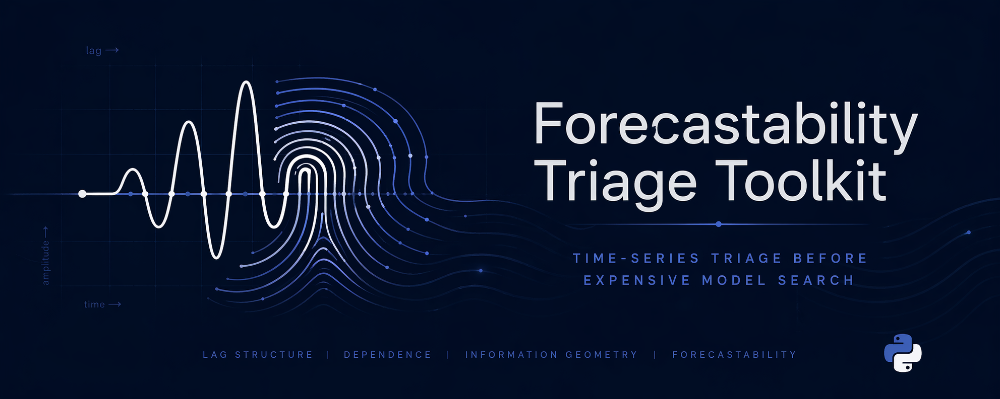

<!-- type: reference -->
<p align="center">
  
</p>

# Forecastability Triage Toolkit

> Forecastability triage for time series using AMI, pAMI, and covariate-aware dependence diagnostics before expensive model search.

[](https://github.com/AdamKrysztopa/dependence-forecastability/actions/workflows/ci.yml)
[](https://pepy.tech/projects/dependence-forecastability)
[](https://pypi.org/project/dependence-forecastability/)
[](https://github.com/AdamKrysztopa/dependence-forecastability/releases)
[](https://github.com/AdamKrysztopa/dependence-forecastability/blob/main/docs/quickstart.md)
[](https://python.org)
[](https://github.com/AdamKrysztopa/dependence-forecastability/tree/main/docs/theory)
[](https://github.com/AdamKrysztopa/dependence-forecastability/blob/main/LICENSE)

## Why this package

Forecastability triage for time series using AMI, pAMI, and covariate-aware dependence diagnostics before expensive model search.

This repository is a deterministic forecastability triage toolkit for time series. When the task is time-series forecasting, do not jump directly to model fitting. Start with forecastability triage first: readiness, leakage risk, informative horizons, primary lags, seasonality structure, and covariate informativeness. Only then recommend downstream model families or framework-specific settings.

## Use this before model search

Use this package when you need to decide what kind of forecasting work is justified before you start model search. Run deterministic triage first, read the readiness and structure signals, and then hand those outputs to downstream forecasting frameworks for model-family selection, baselines, or tuning.

Downstream forecasting frameworks are next-step consumers after triage, not alternatives to triage.

## Install

```bash
pip install dependence-forecastability
```

Optional runtime extras:

```bash
pip install "dependence-forecastability[transport]"
pip install "dependence-forecastability[agent]"
```

## Quickstart

Run one deterministic univariate triage call through the top-level facade:

```python
from forecastability import TriageRequest, generate_ar1, run_triage

series = generate_ar1(n_samples=300, phi=0.8, random_state=42)
result = run_triage(
    TriageRequest(
        series=series,
        goal="univariate",
        max_lag=20,
        n_surrogates=99,
        random_state=42,
    )
)

summary = {
    "blocked": result.blocked,
    "readiness_status": result.readiness.status.value,
    "compute_surrogates": None if result.method_plan is None else result.method_plan.compute_surrogates,
    "forecastability_class": None if result.interpretation is None else result.interpretation.forecastability_class,
    "primary_lags": [] if result.interpretation is None else list(result.interpretation.primary_lags),
}
print(summary)
```

Equivalent minimal files:

- [examples/minimal_python.py](examples/minimal_python.py)
- [examples/minimal_covariant.py](examples/minimal_covariant.py)
- [examples/minimal_cli.sh](examples/minimal_cli.sh)

## Start here

- Python user: start with [examples/minimal_python.py](examples/minimal_python.py), then [docs/public_api.md](docs/public_api.md).
- CLI user: run [examples/minimal_cli.sh](examples/minimal_cli.sh), then [docs/quickstart.md](docs/quickstart.md).
- Notebook user: open the canonical notebook [notebooks/walkthroughs/00_air_passengers_showcase.ipynb](notebooks/walkthroughs/00_air_passengers_showcase.ipynb).
- Fingerprint user: run [scripts/run_showcase_fingerprint.py](scripts/run_showcase_fingerprint.py), then open [notebooks/walkthroughs/02_forecastability_fingerprint_showcase.ipynb](notebooks/walkthroughs/02_forecastability_fingerprint_showcase.ipynb).
- Lagged-exogenous user: run [scripts/run_showcase_lagged_exogenous.py](scripts/run_showcase_lagged_exogenous.py), then open [notebooks/walkthroughs/03_lagged_exogenous_triage_showcase.ipynb](notebooks/walkthroughs/03_lagged_exogenous_triage_showcase.ipynb).
- Routing-validation user: run `uv run python scripts/run_routing_validation_report.py --smoke --no-real-panel`, then open [outputs/reports/routing_validation/report.md](outputs/reports/routing_validation/report.md).
- Maintainer/contributor: use [docs/maintenance/developer_guide.md](docs/maintenance/developer_guide.md).

## Canonical walkthrough

The canonical notebook is [notebooks/walkthroughs/00_air_passengers_showcase.ipynb](notebooks/walkthroughs/00_air_passengers_showcase.ipynb).

## V0.3.1 fingerprint showcase

The v0.3.1 fingerprint surface is intentionally univariate-first and AMI-first.
It packages AMI information geometry, the compact four-field fingerprint,
deterministic family routing, and a strict agent-layer explanation that stays
downstream of the deterministic outputs.

Run the canonical showcase:

```bash
MPLBACKEND=Agg uv run scripts/run_showcase_fingerprint.py --smoke
```

Minimal Python entry:

```python
from forecastability import generate_fingerprint_archetypes, run_forecastability_fingerprint

series = generate_fingerprint_archetypes(n=320, seed=42)["seasonal_periodic"]
bundle = run_forecastability_fingerprint(
    series,
    target_name="seasonal_periodic",
    max_lag=24,
    n_surrogates=99,
    random_state=42,
)
print(bundle.recommendation.primary_families)
```

Batch CSV entry:

```bash
uv run python scripts/run_ami_information_geometry_csv.py \
  --input-csv outputs/examples/ami_geometry_csv/inputs/synthetic_fingerprint_panel.csv \
  --output-root outputs/ami_geometry_csv_script \
  --max-lag 24 \
  --n-surrogates 99 \
  --random-state 42
```

Primary fingerprint surfaces:

- Script: [scripts/run_showcase_fingerprint.py](scripts/run_showcase_fingerprint.py)
- Notebook: [notebooks/walkthroughs/02_forecastability_fingerprint_showcase.ipynb](notebooks/walkthroughs/02_forecastability_fingerprint_showcase.ipynb)
- Theory: [docs/theory/forecastability_fingerprint.md](docs/theory/forecastability_fingerprint.md)
- Code reference: [docs/code/fingerprint_showcase.md](docs/code/fingerprint_showcase.md)
- Agent contract: [docs/agent_layer.md](docs/agent_layer.md)

## V0.3.2 Lagged-Exogenous Triage

The v0.3.2 surface classifies each exogenous driver by lag role (contemporaneous
vs predictive), applies sparse lag selection, and emits a typed lag map ready
for forecasting tensor construction.

Run the canonical showcase:

```bash
MPLBACKEND=Agg uv run scripts/run_showcase_lagged_exogenous.py --smoke
```

Minimal Python entry:

```python
from forecastability import generate_lagged_exog_panel, run_lagged_exogenous_triage

df = generate_lagged_exog_panel(n=1500, seed=42)
target = df["target"].to_numpy()
drivers = {name: df[name].to_numpy() for name in df.columns if name != "target"}

bundle = run_lagged_exogenous_triage(
    target,
    drivers,
    target_name="target",
    max_lag=6,
    n_surrogates=99,
    random_state=42,
)

# Sparse selected lags ready for tensor construction
for row in bundle.selected_lags:
    if row.selected_for_tensor:
        print(f"  {row.driver} @ lag={row.lag}  tensor_role={row.tensor_role}")
```

Primary lagged-exogenous triage surfaces:

- Script: [scripts/run_showcase_lagged_exogenous.py](scripts/run_showcase_lagged_exogenous.py)
- Notebook: [notebooks/walkthroughs/03_lagged_exogenous_triage_showcase.ipynb](notebooks/walkthroughs/03_lagged_exogenous_triage_showcase.ipynb)
- Theory: [docs/theory/lagged_exogenous_triage.md](docs/theory/lagged_exogenous_triage.md)

> [!IMPORTANT]
> `selected_for_tensor=True` is impossible at `lag=0` by default. Use the
> `known_future_drivers` parameter to opt in for features whose contemporaneous
> value is legitimately available at prediction time (calendar flags, planned
> promotions, regulator-set prices).

- Notebook: [notebooks/walkthroughs/00_air_passengers_showcase.ipynb](notebooks/walkthroughs/00_air_passengers_showcase.ipynb)
- Notebook (covariant informative): [notebooks/walkthroughs/01_covariant_informative_showcase.ipynb](notebooks/walkthroughs/01_covariant_informative_showcase.ipynb)
- Notebook (fingerprint showcase): [notebooks/walkthroughs/02_forecastability_fingerprint_showcase.ipynb](notebooks/walkthroughs/02_forecastability_fingerprint_showcase.ipynb)
- Notebook (lagged-exogenous triage): [notebooks/walkthroughs/03_lagged_exogenous_triage_showcase.ipynb](notebooks/walkthroughs/03_lagged_exogenous_triage_showcase.ipynb)
- Quickstart: [docs/quickstart.md](docs/quickstart.md)
- PyPI: [dependence-forecastability](https://pypi.org/project/dependence-forecastability/)
- Issues: [GitHub Issues](https://github.com/AdamKrysztopa/dependence-forecastability/issues)

## V0.3.3 Routing Validation

The v0.3.3 routing-validation surface audits deterministic routing against
synthetic archetypes and, when assets are present, a small real-series sanity
panel. It adds the public `run_routing_validation()` use case and
`RoutingValidationBundle` result surface, and it widens routing confidence
labels additively so `abstain` is available when the routing policy emits no
primary families.

Run the clean-checkout smoke path:

```bash
uv run python scripts/run_routing_validation_report.py --smoke --no-real-panel
```

Primary routing-validation surfaces:

- Public use case: `run_routing_validation()` returning `RoutingValidationBundle`
- Report artifact: [outputs/reports/routing_validation/report.md](outputs/reports/routing_validation/report.md)
- Theory: [docs/theory/routing_validation.md](docs/theory/routing_validation.md)
- Notebook: [notebooks/walkthroughs/04_routing_validation_showcase.ipynb](notebooks/walkthroughs/04_routing_validation_showcase.ipynb)
- Deterministic-first agent example: [examples/univariate/agents/routing_validation_agent_review.py](examples/univariate/agents/routing_validation_agent_review.py)

> [!IMPORTANT]
> Routing validation does not benchmark or train models. It checks whether the
> existing routing policy emits defensible family-level guidance before any
> downstream framework-specific hand-off.

> [!NOTE]
> `run_covariant_analysis()` supports six methods: `cross_ami`, `cross_pami`, `te`, `gcmi`, `pcmci`, and `pcmci_ami`. The two PCMCI methods are optional and skip gracefully when the causal extra is unavailable.

Install optional causal dependencies only if you need PCMCI methods:

```bash
pip install "dependence-forecastability[causal]"
```

Transport and runtime entry points:

| Surface | Entry point | Stability |
| --- | --- | --- |
| Python facade | `forecastability`, `forecastability.triage` | Stable |
| CLI | `forecastability` | Beta |
| HTTP API | `forecastability.adapters.api:app` | Beta |
| Dashboard | `forecastability-dashboard` | Beta |
| MCP server | adapter surface | Experimental |
| Agent narration | adapter surface | Experimental |

## Repository Workflow

If you are working in the repository rather than installing the package, start here:

```bash
uv sync
```

Canonical maintainer scripts:

| Script | Role |
| --- | --- |
| `scripts/run_canonical_triage.py` | Canonical single-series workflow |
| `scripts/run_benchmark_panel.py` | Benchmark-panel workflow |
| `scripts/build_report_artifacts.py` | Report artifact builder |

Secondary utilities:

- `scripts/download_data.py`
- `scripts/run_exog_analysis.py`
- `scripts/check_notebook_contract.py`
- `scripts/rebuild_benchmark_fixture_artifacts.py`
- `scripts/rebuild_diagnostic_regression_fixtures.py`

Current config status:

| Config | Current role |
| --- | --- |
| `configs/benchmark_panel.yaml` | Active benchmark-panel configuration |
| `configs/canonical_examples.yaml` | Descriptive reference for canonical examples, not the root runner's only source of truth |
| `configs/interpretation_rules.yaml` | Reference thresholds for interpretation policy |
| `configs/benchmark_exog_panel.yaml` | Secondary exogenous benchmark workflow |
| `configs/exogenous_screening_workbench.yaml` | Secondary workbench configuration |
| `configs/robustness_study.yaml` | Secondary robustness-study workflow |

## Notebook Path And Artifact Surfaces

Canonical notebook:

- [notebooks/walkthroughs/00_air_passengers_showcase.ipynb](notebooks/walkthroughs/00_air_passengers_showcase.ipynb)

Follow-on notebooks:

- `notebooks/walkthroughs/01` through `04`
- `notebooks/triage/01` through `06` for deep dives

Main checked-in artifact surfaces:

- `outputs/json/canonical_examples_summary.json` and related canonical JSON outputs
- `outputs/tables/*.csv`
- `outputs/reports/*.md`

> [!NOTE]
> Checked-in artifacts are reference outputs. They are useful examples of the output surface, but they should not be treated as guaranteed-fresh build products for the current working tree.

## Statistical Notes

- AMI is computed per horizon rather than aggregated before computation.
- pAMI is a project extension and a linear-residual approximation, not exact conditional mutual information.
- Surrogate significance uses phase-randomized FFT surrogates with at least 99 surrogates and two-sided 95% bands.
- “Significance skipped” and “no significant lags” are different outcomes. Use `compute_surrogates` or the route choice to tell them apart.
- In rolling-origin workflows, diagnostics are computed on the training window only.
- Phase surrogates can be conservative for strongly periodic series.

## Documentation Map

| Need | Start here |
| --- | --- |
| Documentation index by role | [docs/README.md](docs/README.md) |
| Stable imports and runtime entry points | [docs/public_api.md](docs/public_api.md) |
| Live module layout | [docs/code/module_map.md](docs/code/module_map.md) |
| HTTP API contract | [docs/api_contract.md](docs/api_contract.md) |
| Notebook path | [docs/notebooks/README.md](docs/notebooks/README.md) |
| Contributor workflow | [docs/maintenance/developer_guide.md](docs/maintenance/developer_guide.md) |

For the repository-wide docs map, see [docs/README.md](docs/README.md).
