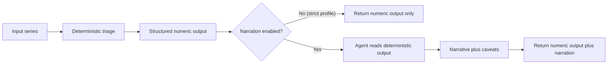

<!-- type: reference -->
# Agent Layer Contract

This page defines the contract for the optional LLM narration layer.
The scientific authority remains the deterministic AMI/pAMI pipeline.

> [!IMPORTANT]
> The agent layer is a usability surface, not a scientific computation layer.
> Deterministic outputs are authoritative; narration is secondary.

## Scope

- In scope: explaining deterministic outputs for faster human interpretation.
- Out of scope: computing, recomputing, or validating scientific metrics.
- Default operational posture: deterministic path first, narration optional.

## Hard Contract (Non-Negotiable)

1. Deterministic numbers come first.
2. Narration comes second.
3. No free-form recomputation by the LLM.

If any narration conflicts with deterministic fields, trust deterministic fields and treat narration as defective.



## Output Contract Examples

The examples below are contract-shape examples intended to show precedence and behavior.

### 1) Deterministic output only

```json
{
  "blocked": false,
  "forecastability_class": "high",
  "directness_class": "medium",
  "modeling_regime": "compact_structured_models",
  "primary_lags": [1, 7],
  "recommendation": "HIGH -> Complex structured models (deep AR, nonlinear, LSTM)",
  "narrative": null
}
```

### 2) Deterministic output plus narration

```json
{
  "blocked": false,
  "forecastability_class": "high",
  "directness_class": "medium",
  "modeling_regime": "compact_structured_models",
  "primary_lags": [1, 7],
  "recommendation": "HIGH -> Complex structured models (deep AR, nonlinear, LSTM)",
  "narrative": "Dependence is strong overall, but directness is moderate, so compact structured models are preferred over very deep lag stacks.",
  "caveats": [
    "Narrative is explanatory only; deterministic fields above are the source of truth."
  ]
}
```

### 3) Narration disabled in strict mode

Strict mode means narration is disabled and only deterministic payloads are returned.

```json
{
  "mode": "strict",
  "include_narrative": false,
  "result": {
    "blocked": false,
    "forecastability_class": "high",
    "directness_class": "medium",
    "modeling_regime": "compact_structured_models",
    "primary_lags": [1, 7],
    "recommendation": "HIGH -> Complex structured models (deep AR, nonlinear, LSTM)",
    "narrative": null
  }
}
```

## Prompt Guidance for Numeric Grounding

Use prompts that force deterministic grounding and ban free-form arithmetic:

- Instruct the model to quote only tool-returned fields.
- Require an explicit refusal behavior when a requested number is missing.
- Require caveats to reference readiness and interpretation warnings.
- Forbid computing new metrics in narration (for example, no ad-hoc percentages, no recomputed ratios).

Recommended prompt clauses:

```text
Use only values returned by deterministic tools.
Do not compute, estimate, or infer new numeric values.
If a numeric value is unavailable, state "not available in deterministic output".
When narrative conflicts with deterministic fields, deterministic fields win.
```

## Testing Guidance for Numeric Grounding

Minimum checks for the agent layer:

1. Baseline preservation test: run deterministic triage, then run narrated mode; assert numeric fields are identical.
2. Strict mode test: assert narration is absent (`narrative == null`) and deterministic fields are still returned.
3. Prompt-injection resistance test: attempt to coerce recomputation; assert no new numeric fields appear.
4. Provider failure test: simulate timeout/outage; assert deterministic result remains available and narration fails explicitly.
5. Regression snapshot test: pin key deterministic fields (`forecastability_class`, `directness_class`, `primary_lags`, recommendation) across adapter updates.

> [!WARNING]
> Do not treat fluent narration as evidence quality. Numeric grounding checks are mandatory.

## Where the Agent Should Not Be Trusted

Do not trust the agent to:

- produce new scientific metrics not present in deterministic output,
- override deterministic classes, lags, or recommendations,
- adjudicate model-risk or production-policy decisions on prose alone,
- compensate for missing data, poor readiness, or invalid experimental design,
- act as a substitute for statistical review.

## Positioning

The agent layer exists to improve communication and workflow usability.
It is intentionally optional and must remain downstream of deterministic analysis.

## Expanded Diagnostic Payloads (A1–A3)

The agent payload adapters now provide structured Pydantic models for **all**
triage extension diagnostics (F1–F8), not just the core triage fields. Three
adapter modules compose the full serialisation pipeline:

| Module | Role |
|---|---|
| `triage_agent_payload_models.py` | 9 typed payload models — one per diagnostic family (F1–F8 + core). |
| `triage_summary_serializer.py` | Serialisation envelope with `schema_version` for forward-compatible agent consumption. |
| `triage_agent_interpretation_adapter.py` | Deterministic interpretation with explicit experimental/warning flags per diagnostic. |

The agent contract still applies: **agents narrate deterministic outputs, never
invent numbers.** Experimental diagnostics (F5 Lyapunov exponent) are
explicitly flagged in payloads so agents can include appropriate caveats.

## Fingerprint Contract (v0.3.1)

The same deterministic-first rules apply to the fingerprint workflow.
Agent-facing fingerprint payloads must mirror geometry, fingerprint, and
routing outputs exactly.

```json
{
  "target_name": "seasonal_periodic",
  "geometry_method": "ksg2_shuffle_surrogate",
  "signal_to_noise": 0.61,
  "geometry_information_horizon": 24,
  "geometry_information_structure": "periodic",
  "information_mass": 0.18,
  "information_horizon": 24,
  "information_structure": "periodic",
  "nonlinear_share": 0.07,
  "directness_ratio": null,
  "primary_families": ["seasonal_naive", "harmonic_regression", "tbats"],
  "secondary_families": ["seasonal_state_space"],
  "confidence_label": "high",
  "caution_flags": [],
  "rationale": [
    "Stable repeated informative peaks indicate seasonal structure."
  ],
  "narrative": null
}
```

For the fingerprint path:

1. `geometry_method`, `signal_to_noise`, geometry horizon, and geometry structure must survive unchanged into A1 payloads.
2. The A3 deterministic interpretation may shorten prose, but it may not alter numeric fields, route families, or confidence labels.
3. Any optional live narration surface must read the deterministic payload or call the same deterministic use case and remain verifiable against it.

### Batch workbench handoff

For portfolio workflows, the deterministic handoff now also includes the batch
forecastability workbench:

1. `run_batch_forecastability_workbench()` decides per-series next-step actions from the same deterministic triage + fingerprint evidence.
2. Batch examples should feed `fingerprint_agent_payload()` and `interpret_fingerprint_batch()` only from `fingerprint_bundle` outputs returned by the workbench.
3. Technical and executive reports are rendering layers only; they must not recompute routing, rewrite caution flags, or invent stakeholder claims that disagree with the deterministic bundle.

### Expanded output shape

With diagnostics enabled, the full agent-ready payload extends the base output:

```json
{
  "schema_version": "0.2.0",
  "blocked": false,
  "forecastability_class": "high",
  "directness_class": "medium",
  "modeling_regime": "compact_structured_models",
  "primary_lags": [1, 7],
  "recommendation": "HIGH -> Complex structured models ...",
  "forecastability_profile": {
    "peak_horizon": 1,
    "informative_horizons": [1, 2, 3],
    "summary": "Strong short-range dependence ..."
  },
  "theoretical_limit_diagnostics": {
    "ceiling_summary": "Predictive ceiling is ...",
    "compression_warning": null,
    "dpi_warning": null
  },
  "complexity_band": {
    "band": "ordered",
    "permutation_entropy": 0.42
  },
  "largest_lyapunov_exponent": {
    "exponent": 0.03,
    "experimental": true
  },
  "warnings": ["Series length < 200 ..."],
  "experimental_flags": ["largest_lyapunov_exponent"]
}
```

> [!NOTE]
> All diagnostic sub-objects are `null` when the series is blocked. Agents
> must handle missing diagnostics gracefully and not hallucinate values.

See also:

- [production_readiness.md](production_readiness.md)
- [quickstart.md](quickstart.md)
- [observability.md](observability.md)
- [versioning.md](versioning.md)
