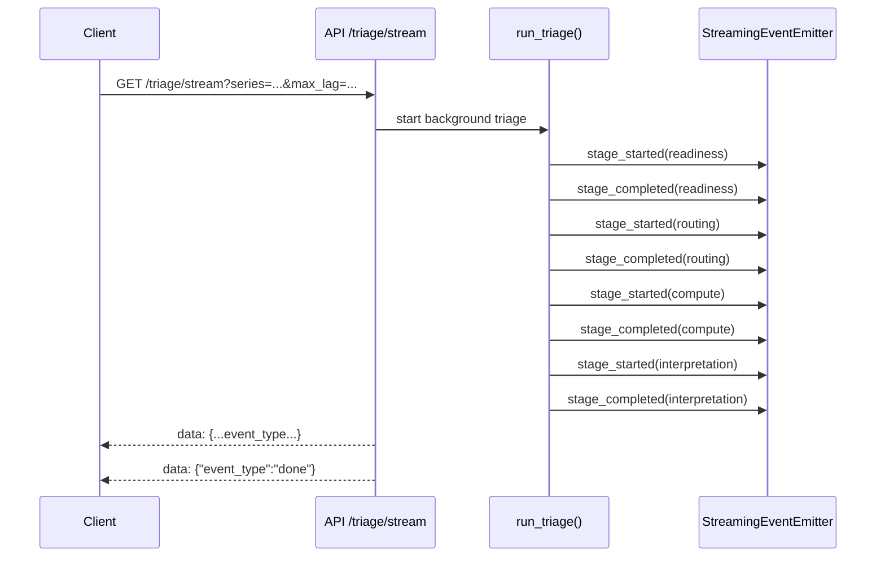

<!-- type: reference -->
# HTTP API Contract (FastAPI + SSE)

Contract reference for the transport adapter in `src/forecastability/adapters/api.py`.

> [!IMPORTANT]
> The HTTP API is deterministic-first. A blocked readiness outcome is returned as a successful HTTP response with `blocked: true`, not as a transport error.

## Source of truth

- Runtime adapter: [src/forecastability/adapters/api.py](../src/forecastability/adapters/api.py)
- Event encoder: [src/forecastability/adapters/event_emitter.py](../src/forecastability/adapters/event_emitter.py)
- Contract tests: [tests/test_api.py](../tests/test_api.py)
- Stability policy: [docs/versioning.md](versioning.md)

## Endpoints

| Method | Path | Purpose | Success code(s) |
|---|---|---|---|
| `GET` | `/health` | Liveness probe | `200` |
| `GET` | `/scorers` | Registered dependence scorers | `200` |
| `POST` | `/triage` | Deterministic triage run | `200` |
| `GET` | `/triage/stream` | SSE stage progress stream | `200` (enabled), `503` (disabled) |

## Request Schema (`POST /triage`)

### JSON shape

```json
{
  "series": [0.12, -0.3, 0.88],
  "exog": [0.01, 0.0, 0.12],
  "goal": "univariate",
  "max_lag": 40,
  "n_surrogates": 99,
  "random_state": 42
}
```

### Field contract

| Field | Type | Required | Default | Notes |
|---|---|---|---|---|
| `series` | `array[number]` | yes | - | Must be non-empty (`422` if empty or missing). |
| `exog` | `array[number] \| null` | no | `null` | Optional exogenous series. Length mismatch is handled by readiness (blocked result), not request parsing. |
| `goal` | `string` | no | `"univariate"` | Allowed: `"univariate"`, `"exogenous"`. Invalid value returns `422`. |
| `max_lag` | `integer` | no | `40` | Passed to deterministic triage routing and compute. |
| `n_surrogates` | `integer` | no | `99` | Must be `>= 1` at HTTP boundary. |
| `random_state` | `integer` | no | `42` | Deterministic seed. |

## Response Schema (`POST /triage`)

```json
{
  "blocked": false,
  "readiness_status": "warning",
  "readiness_warnings": [
    {
      "code": "SIGNIFICANCE_FEASIBILITY",
      "message": "Series length (150) < 200. Surrogate significance bands may be unstable; interpret p-values with caution."
    }
  ],
  "route": "univariate_no_significance",
  "compute_surrogates": false,
  "recommendation": "HIGH -> Complex structured models (deep AR, nonlinear, LSTM)",
  "forecastability_class": "high",
  "directness_class": "medium",
  "modeling_regime": "compact_structured_models",
  "primary_lags": [1],
  "n_sig_raw_lags": 0,
  "n_sig_partial_lags": 0
}
```

### Field semantics

| Field | Type | Semantics |
|---|---|---|
| `blocked` | `boolean` | `true` when readiness gate blocks analysis. |
| `readiness_status` | `"clear" \| "warning" \| "blocked"` | Gate status. |
| `readiness_warnings` | `array[{code: string, message: string}]` | Machine-readable warning list. |
| `route` | `string \| null` | Compute route, `null` when blocked. |
| `compute_surrogates` | `boolean \| null` | Surrogate toggle from routing, `null` when blocked. |
| `recommendation` | `string \| null` | Deterministic recommendation, `null` when blocked. |
| `forecastability_class` | `"high" \| "medium" \| "low" \| null` | Interpretation summary, `null` when blocked. |
| `directness_class` | `string \| null` | Interpretation directness label, `null` when blocked. |
| `modeling_regime` | `string \| null` | Suggested regime, `null` when blocked. |
| `primary_lags` | `array[integer]` | Empty list when blocked or no primary lags. |
| `n_sig_raw_lags` | `integer \| null` | Count of significant raw lags; `null` when blocked. |
| `n_sig_partial_lags` | `integer \| null` | Count of significant partial lags; `null` when blocked. |

## Validation Errors (`422`)

`POST /triage` returns `422` for malformed or invalid request input.

| Condition | Example | Error body shape |
|---|---|---|
| Missing required field | `{"max_lag": 20}` | FastAPI/Pydantic `{"detail": [...]}` list |
| Empty series | `{"series": []}` | FastAPI/Pydantic `{"detail": [...]}` list |
| Invalid `goal` | `{"goal": "bad_goal", ...}` | Custom `{"detail": "Invalid goal ..."}` string |
| Invalid surrogate count | `{"n_surrogates": 0, ...}` | FastAPI/Pydantic `{"detail": [...]}` list |
| Non-JSON body | raw text with JSON content-type | FastAPI/Pydantic `{"detail": [...]}` list |

Example (`series` empty):

```json
{
  "detail": [
    {
      "type": "value_error",
      "loc": ["body", "series"],
      "msg": "Value error, series must not be empty"
    }
  ]
}
```

Example (`goal` invalid):

```json
{
  "detail": "Invalid goal 'bad_goal'. Valid values: ['univariate', 'exogenous']"
}
```

## Readiness-Failed Example (`200` with `blocked: true`)

```json
{
  "blocked": true,
  "readiness_status": "blocked",
  "readiness_warnings": [
    {
      "code": "LAG_FEASIBILITY",
      "message": "max_lag (40) requires at least 91 observations for pAMI (min_pairs=50), but series has 20. Analysis is blocked."
    },
    {
      "code": "SIGNIFICANCE_FEASIBILITY",
      "message": "Series length (20) < 200. Surrogate significance bands may be unstable; interpret p-values with caution."
    }
  ],
  "route": null,
  "compute_surrogates": null,
  "recommendation": null,
  "forecastability_class": null,
  "directness_class": null,
  "modeling_regime": null,
  "primary_lags": [],
  "n_sig_raw_lags": null,
  "n_sig_partial_lags": null
}
```

## Success Example (`200` with `blocked: false`)

```json
{
  "blocked": false,
  "readiness_status": "warning",
  "readiness_warnings": [
    {
      "code": "SIGNIFICANCE_FEASIBILITY",
      "message": "Series length (150) < 200. Surrogate significance bands may be unstable; interpret p-values with caution."
    }
  ],
  "route": "univariate_no_significance",
  "compute_surrogates": false,
  "recommendation": "HIGH -> Complex structured models (deep AR, nonlinear, LSTM)",
  "forecastability_class": "high",
  "directness_class": "medium",
  "modeling_regime": "compact_structured_models",
  "primary_lags": [1],
  "n_sig_raw_lags": 0,
  "n_sig_partial_lags": 0
}
```

## SSE Event Sequence (`GET /triage/stream`)

### Query schema

| Query parameter | Type | Required | Default | Notes |
|---|---|---|---|---|
| `series` | `string` | yes | - | JSON-encoded array of floats (for example `"[1.0,2.0,3.0]"`). |
| `goal` | `string` | no | `"univariate"` | Allowed: `"univariate"`, `"exogenous"`. |
| `max_lag` | `integer` | no | `40` | Passed to deterministic triage. |
| `n_surrogates` | `integer` | no | `99` | Passed to deterministic triage. |
| `random_state` | `integer` | no | `42` | Deterministic seed. |

### Stream envelope

- Media type: `text/event-stream`
- SSE framing: each payload emitted as `data: {...}\n\n`
- Terminal sentinel: `data: {"event_type": "done"}\n\n`

### Event payloads

| `event_type` | Fields |
|---|---|
| `stage_started` | `stage`, `timestamp` |
| `stage_completed` | `stage`, `duration_ms`, `result_summary` |
| `stage_error` | `stage`, `error` |
| `done` | none (terminal event) |

### Nominal sequence (non-error run)



> [!NOTE]
> If any stage raises, `stage_error` is emitted for that stage and the stream still ends with `done`.

## API Error Semantics and Status-Code Philosophy

- `200` means transport success. The request was accepted and deterministic triage completed, even if business outcome is blocked (`blocked: true`).
- `422` means client input could not be accepted as valid request data (schema, value constraints, malformed JSON, invalid `goal`).
- `503` on `/triage/stream` means the feature is intentionally unavailable because streaming is disabled by settings (`triage_enable_streaming=false`).
- `5xx` should be treated as unexpected server failure (not part of normal triage outcomes).

This separation allows clients to distinguish:

1. Transport validity (HTTP status)
2. Scientific/readiness outcome (`blocked`, warnings, interpretation fields)

## Versioning Expectations

HTTP transport is currently classified as **beta** in [docs/versioning.md](versioning.md).

- Changes may occur while the API is below `1.0.0`.
- Breaking changes require explicit migration notes in `CHANGELOG.md`.
- Additive fields are expected over time; clients should ignore unknown response fields.
- Existing readiness and event semantics should be treated as compatibility-sensitive and covered by tests before release.

## Minimal Client Integration Example

```python
import json
import urllib.parse
import urllib.request

BASE_URL = "http://127.0.0.1:8000"

payload = {
    "series": [0.1, -0.3, 0.5, 0.2, -0.1, 0.4] * 30,
    "goal": "univariate",
    "max_lag": 20,
    "n_surrogates": 99,
    "random_state": 42,
}

# POST /triage
request = urllib.request.Request(
    url=f"{BASE_URL}/triage",
    data=json.dumps(payload).encode("utf-8"),
    headers={"Content-Type": "application/json"},
    method="POST",
)
with urllib.request.urlopen(request) as response:
    body = json.loads(response.read().decode("utf-8"))

if body["blocked"]:
    print("Blocked by readiness gate:", body["readiness_warnings"])
else:
    print("Forecastability:", body["forecastability_class"])
    print("Recommendation:", body["recommendation"])

# GET /triage/stream (requires triage_enable_streaming=true)
series_q = urllib.parse.quote(json.dumps(payload["series"]))
stream_url = f"{BASE_URL}/triage/stream?series={series_q}&max_lag=20&n_surrogates=99"
with urllib.request.urlopen(stream_url) as stream_response:
    for raw_line in stream_response:
        line = raw_line.decode("utf-8").strip()
        if not line.startswith("data: "):
            continue
        event = json.loads(line[len("data: ") :])
        print("SSE:", event)
        if event.get("event_type") == "done":
            break
```
