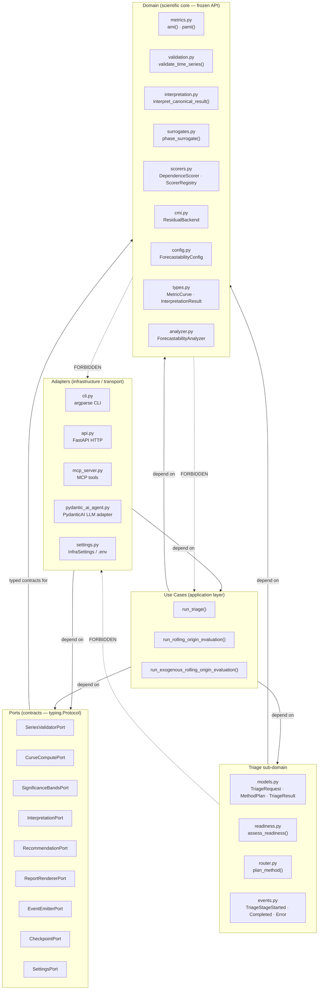
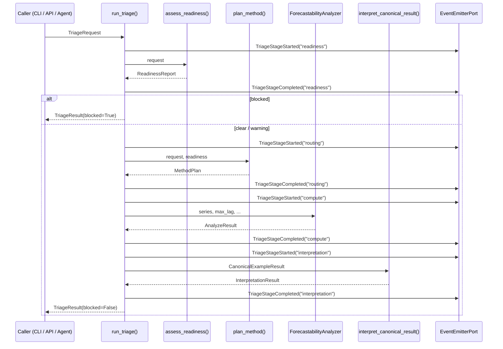

<!-- type: explanation -->
# Architecture Guide — AMI → pAMI Forecastability Analysis

This document describes the hexagonal architecture and SOLID principles that
govern the `forecastability` package.  All contributors must understand these
rules before adding, moving, or modifying code.

> [!IMPORTANT]
> This guide captures decisions that are enforced by automated tests in
> `tests/test_architecture_boundaries.py`.  Violations cause CI failures.

---

## Layer Overview



---

## Allowed vs. Forbidden Dependencies

| From | May depend on | Must NOT depend on |
|---|---|---|
| `adapters/` | `ports/`, `triage/`, `use_cases/`, `domain` | nothing outside the package |
| `use_cases/` | `ports/`, `triage/`, `domain` | `adapters/` (any concrete adapter) |
| `triage/` | `domain` | `adapters/`, `use_cases/` |
| `ports/` | `typing`, `numpy`, `pydantic`, `domain types` | `adapters/`, `framework code` |
| `domain` | `typing`, `numpy`, `pydantic`, `scikit-learn`, `scipy`, `yaml` | `adapters/`, `use_cases/`, `pydantic_ai`, `fastapi`, `mcp`, `httpx`, `click`, `matplotlib` (except `plots.py`) |

> [!WARNING]
> `plots.py` is the sole exception: it may import `matplotlib`.  All other
> domain modules must not.

---

## SOLID Principles Applied

### S — Single Responsibility

Each module has exactly one reason to change.

| Module | Single responsibility |
|---|---|
| `validation.py` | Input sanity checks for time-series arrays |
| `metrics.py` | kNN mutual-information curve computation |
| `surrogates.py` | Phase-randomised FFT surrogate generation |
| `interpretation.py` | Pattern A–E classification and diagnostics |
| `triage/readiness.py` | Readiness gate policy |
| `triage/router.py` | Compute-path selection policy |
| `triage/run_triage.py` | Triage orchestration (single use-case entry point) |
| `adapters/cli.py` | CLI transport wiring |
| `adapters/api.py` | HTTP transport wiring |
| `adapters/mcp_server.py` | MCP tool exposure |
| `adapters/pydantic_ai_agent.py` | LLM orchestration over deterministic core |

### O — Open/Closed

New scorer families → implement `DependenceScorer` protocol and register with
`ScorerRegistry`.  No orchestration code is modified.

New report formats → implement `ReportRendererPort`.  No assembler logic is
modified.

New transport (e.g., gRPC) → add a new file under `adapters/`.  No use-case
code is modified.

### L — Liskov Substitution

Alternative implementations of any port are substitutable:

```python
# inject a test double — no behavior changes in run_triage()
result = run_triage(req, readiness_gate=my_mock_gate, router=my_mock_router)
```

### I — Interface Segregation

Ports are narrow.  The CLI adapter depends only on `SeriesValidatorPort` and
the use-case callable — it does not pull in `SignificanceBandsPort` or any MCP
interface.

### D — Dependency Inversion

`run_triage()` depends on `assess_readiness` and `plan_method` as *callables*
(injected at call time, defaulted to concrete implementations).  The use case
never imports from `adapters/`.

---

## Configuration Ownership

| Config type | Location | Access pattern |
|---|---|---|
| Scientific params (`n_neighbors`, `n_surrogates`, `alpha`, `random_state`) | `configs/*.yaml` | `ForecastabilityConfig` Pydantic model |
| Infrastructure secrets and feature flags | `.env` | `InfraSettings(BaseSettings)` in `adapters/settings.py` |
| Test overrides | — | `InfraSettings(_env_file=None, ...)` in test fixtures |

> [!CAUTION]
> Never read environment variables directly inside domain code.  All `.env`
> access is mediated by `InfraSettings`.

---

## Triage Pipeline Flow



---

## Module Inventory

<details>
<summary>Click to expand: complete module role table</summary>

| Module | Layer | Imports framework? | Public in `__all__`? |
|---|---|---|---|
| `types.py` | domain | no | yes |
| `config.py` | domain | no | yes |
| `validation.py` | domain | no | yes |
| `metrics.py` | domain | no | yes |
| `surrogates.py` | domain | no | yes |
| `cmi.py` | domain | no | yes |
| `scorers.py` | domain | no | yes |
| `interpretation.py` | domain | no | yes |
| `analyzer.py` | domain | matplotlib (legacy `.plot()` method — exempted, AGT-026) | yes |
| `reporting.py` | domain output | no | yes |
| `plots.py` | domain (exception) | matplotlib | yes |
| `recommendation_service.py` | domain service | no | partial |
| `triage/models.py` | triage sub-domain | no | no |
| `triage/readiness.py` | triage sub-domain | no | no |
| `triage/router.py` | triage sub-domain | no | no |
| `triage/events.py` | triage sub-domain | no | no |
| `triage/run_triage.py` | use case | no | no |
| `use_cases/` | use cases | no | partial |
| `ports/__init__.py` | ports | typing + pydantic only | yes |
| `adapters/settings.py` | adapter | pydantic-settings | no |
| `adapters/cli.py` | adapter | argparse | no |
| `adapters/api.py` | adapter | fastapi | no |
| `adapters/mcp_server.py` | adapter | mcp | no |
| `adapters/pydantic_ai_agent.py` | adapter | pydantic_ai | no |

</details>

---

## Adding New Capabilities

### New scorer backend

1. Implement `DependenceScorer` protocol in a new file under `src/forecastability/`.
2. Register via `ScorerRegistry.register()`.
3. No existing orchestration code changes.

### New transport adapter

1. Create `src/forecastability/adapters/<transport>.py`.
2. Import from `ports/`, `triage/`, and `use_cases/` only.
3. Add an entry-point in `pyproject.toml` if needed.

### New port

1. Add a `@runtime_checkable Protocol` to `ports/__init__.py`.
2. Update `tests/test_ports_are_protocols.py` to include the new port.
3. Update this document's module inventory.

---

## Enforcement

Architecture boundaries are tested statically using AST-level import analysis
in `tests/test_architecture_boundaries.py`.  The test file asserts:

- Domain modules do not import `pydantic_ai`, `fastapi`, `mcp`, `httpx`,
  `click`, or `typer`.
- `ports/` modules import only `typing`, `numpy`, `pydantic`, and domain types.
- `use_cases/` do not import concrete adapter modules.

Run `uv run pytest tests/test_architecture_boundaries.py -v` to verify locally.

---

## References

- Backlog and epic status: [docs/plan/agentic_triage_backlog.md](plan/agentic_triage_backlog.md)
- Frozen public contract: [docs/plan/solid_refactor_contract.md](plan/solid_refactor_contract.md)
- Agent workflow: [.github/AGENT_FLOW.md](../.github/AGENT_FLOW.md)

---

## Narrative ownership (AGT-028)

Explanatory prose about triage results belongs to exactly one layer.

| Layer | Owns | Does not own |
|---|---|---|
| `run_triage()` use case | scientific outputs (`analyze_result`, `interpretation`, `recommendation`) | explanatory prose or LLM-written text |
| PydanticAI adapter (`pydantic_ai_agent.py`) | `TriageExplanation.narrative` and `caveats` | numeric values (all numbers come from tool calls) |

**Rule:** `TriageResult.narrative` is always `None` for deterministic `run_triage()` calls.
Only the agent adapter layer may populate it after an LLM interaction.

This separation ensures:
- Deterministic behaviour is testable without any LLM or network call.
- LLM narration can be disabled or replaced without breaking the scientific pipeline.
- Downstream consumers that only need structured outputs can ignore `narrative` entirely.

> [!IMPORTANT]
> Never let a tool, use case, or domain module set `TriageResult.narrative`.
> That field is the agent adapter's responsibility.

---

## Checkpoint semantics (AGT-023)

Checkpoints implement **orchestration-state replay**, not full-artifact resume.

| Checkpoint persists | Checkpoint does NOT persist |
|---|---|
| Readiness report (JSON-friendly dict) | Numpy arrays from compute stage |
| Method plan (JSON-friendly dict) | `AnalyzeResult` objects |
| Stage name (last completed stage) | `InterpretationResult` objects |

On resume, stages up to and including the last committed stage are skipped;
**compute always re-runs from scratch** because numpy arrays are not JSON-safe.

To avoid correctness issues in multi-run contexts, always pass a unique
`checkpoint_key` (e.g. a UUID) to `run_triage()`.  Using the default key
`"default"` when a checkpoint adapter is active emits a :class:`UserWarning`.

---

## Streaming transport (AGT-024)

Stage progress is exposed as Server-Sent Events (SSE) via `GET /triage/stream`.

The transport path is:

```
run_triage() → StreamingEventEmitter.emit() → Queue → SSE generator → HTTP client
```

`StreamingEventEmitter` is an adapter in `adapters/event_emitter.py`.
It is gated by the `triage_enable_streaming` settings flag.

SSE event types emitted in order:

| Event type | Payload |
|---|---|
| `stage_started` | `stage`, `timestamp` |
| `stage_completed` | `stage`, `duration_ms`, `result_summary` |
| `stage_error` | `stage`, `error` |
| `done` | (no payload) |

The endpoint is contract-tested in `tests/test_api.py`.
