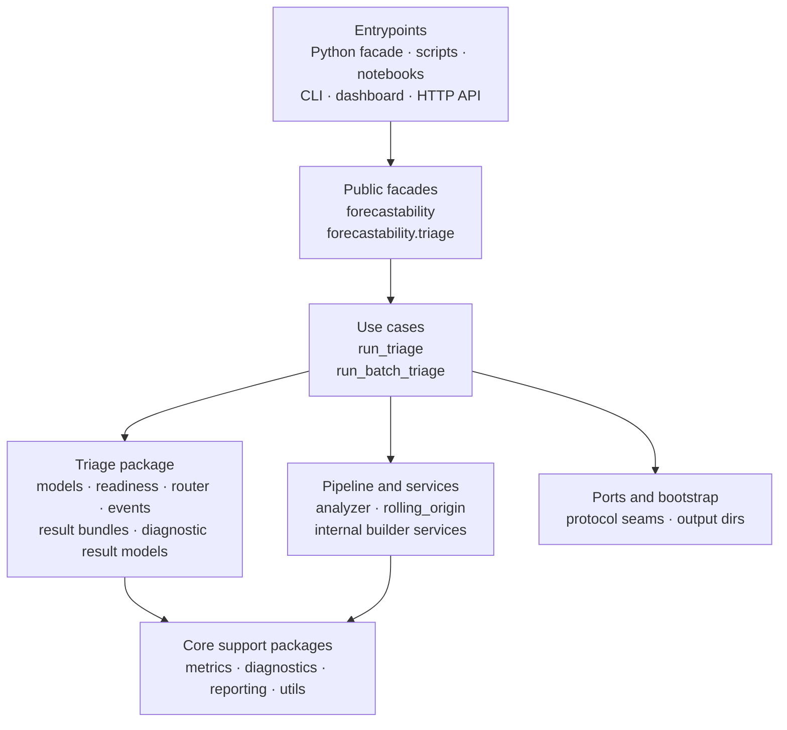

<!-- type: explanation -->
# Architecture

This page describes the current repository architecture and the intended dependency direction for future changes.

_Last verified for release 0.2.0 consolidation on 2026-04-14._

The live repository is layered, but it is also pragmatic: the stable public contract is small, while the internal package tree is deliberately split across triage models, use cases, analyzers, metrics, diagnostics, reporting, utils, adapters, services, ports, and bootstrap helpers.

## Current Architecture Shape

## Public Facades And Entrypoints

These are the surfaces that external users should anchor on.

| Surface | Live location |
| --- | --- |
| Stable package facade | `src/forecastability/__init__.py` |
| Advanced triage namespace | `src/forecastability/triage/__init__.py` |
| CLI command | `forecastability.adapters.cli:main` |
| Dashboard command | `forecastability.adapters.dashboard:main` |
| HTTP API | `forecastability.adapters.api:app` |

Everything else in `src/forecastability/` exists to support those facades and repo workflows.

## Internal Package Roles

| Package | Role |
| --- | --- |
| `triage/` | Triage-domain models, readiness/router logic, diagnostic result types, events, and result bundles |
| `use_cases/` | Main orchestration entry points for deterministic triage and batch triage |
| `pipeline/` | Analyzer facade, canonical workflow helpers, and rolling-origin support |
| `metrics/` | Core AMI/pAMI computation and scorer registry |
| `diagnostics/` | Surrogates, CMI backends, spectral helpers, and regression utilities |
| `reporting/` | Deterministic interpretation and Markdown/report builders |
| `utils/` | Config models, typed containers, datasets, validation, plotting, and repo workflow support |
| `adapters/` | CLI, dashboard, API, MCP, agent, settings, event, checkpoint, and presenter adapters |
| `services/` | Internal builder/orchestration helpers used by analyzers and use cases |
| `ports/` | Protocol-oriented seams for the architecture direction, including causal discovery contracts (`CausalGraphPort`, `CausalGraphFullPort`) |
| `bootstrap/` | Bootstrap helpers such as output directory setup |

## Causal Discovery Port Boundary (V3-AI-02)

The PCMCI and PCMCI-AMI causal-discovery path now uses explicit protocol seams in `ports/`.

| Port | Contract | Primary use |
| --- | --- | --- |
| `CausalGraphPort` | `discover(...) -> CausalGraphResult` | PCMCI+ style graph discovery |
| `CausalGraphFullPort` | `discover(...) -> CausalGraphResult` and `discover_full(...) -> PcmciAmiResult` | PCMCI-AMI full three-phase result path |

> [!IMPORTANT]
> PCMCI-AMI orchestration now follows the inward-only dependency rule: use cases depend on declared ports (protocol contracts), and adapters satisfy those contracts without adapter-to-adapter helper coupling.

## Dependency Direction

The practical dependency direction is:

1. Entrypoints and adapters call the package facades or use cases.
2. Use cases orchestrate triage models, pipeline helpers, and internal services, and depend on causal discovery through declared `ports/` contracts.
3. Triage, pipeline, and services consume metrics, diagnostics, reporting, and utils.
4. Ports and bootstrap remain support seams rather than primary business-logic owners.

> [!IMPORTANT]
> The architecture goal is still inward dependency flow. Adapters should not become a second business-logic layer.

## What Is Stable vs Internal

| Area | Expectation |
| --- | --- |
| `forecastability` and `forecastability.triage` | Stable import contract |
| `adapters/` runtime entry points | Supported runtime surfaces, but transport details may evolve |
| `services/`, `utils/`, `pipeline/`, `metrics/`, `diagnostics/`, `reporting/` | Internal structure that may continue to move during consolidation |

## Design Rules For Contributors

- Add new user-facing imports through `forecastability` or `forecastability.triage` only when you want to commit to compatibility.
- Put transport concerns in `adapters/`, not in use cases or metrics code.
- Keep deterministic orchestration in `use_cases/` and `pipeline/` rather than notebooks or scripts.
- Treat `services/` as internal helpers, not as a third public API layer.
- Use `ports/` for protocol-style seams when a collaborator needs to be substituted or isolated.

## Architectural Caveat

This repository is already substantially layered, but it is not pretending that every historical helper has been perfectly normalized into a textbook hexagon. The important point for current documentation is simpler: the live codebase is not a flat module layout anymore, and the supported public surfaces are the package facades plus the declared runtime entry points.

For the current module-level map, see [code/module_map.md](code/module_map.md). For compatibility scope, see [public_api.md](public_api.md).
