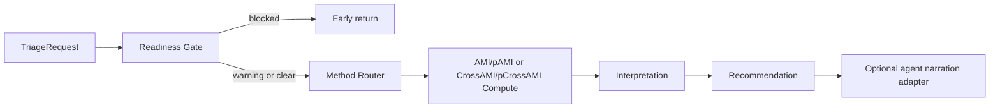

<!-- type: explanation -->
# Agentic Triage Notebook: Durable Summary

## Purpose

Document the triage walkthrough contract in a durable, test-backed form: deterministic readiness and routing first, optional LLM narration second.

Role split:
- `notebooks/walkthroughs/03_triage_end_to_end.ipynb` is the walkthrough consumer surface.
- `notebooks/triage/06_agent_ready_triage_interpretation.ipynb` is the deterministic payload/serializer/interpretation deep dive.

Scope covered:
- run_triage one-entry workflow,
- blocked versus warning versus executable paths,
- deterministic behavior guarantees used by the agent layer.

## Key Figure

Why this figure matters: it separates deterministic scientific outputs from optional narration, which is the core operational contract.

## Key Result

From regression tests:

- [../../tests/test_triage_run.py](../../tests/test_triage_run.py) verifies AR(1) returns high forecastability and white noise returns low forecastability.
- [../../tests/test_triage_regression.py](../../tests/test_triage_regression.py) pins route stability: n = 150 requests follow univariate_no_significance (or exogenous) without surrogate computation.
- [../../tests/test_triage_run.py](../../tests/test_triage_run.py) verifies blocked requests return early with no compute payload.
- [../../tests/test_triage_run.py](../../tests/test_triage_run.py) verifies run_triage never sets narrative, preserving deterministic-first ownership boundaries.

## Takeaways

- Triage outputs are deterministic and regression-tested before any optional narration is applied.
- Readiness gating prevents invalid or leakage-prone requests from entering compute stages.
- Route selection is stable for canonical univariate and exogenous request types.
- Agent narration is an interpretation surface, not a source of numeric truth.

## Notebook For Full Detail

- Full walkthrough: [../../notebooks/walkthroughs/03_triage_end_to_end.ipynb](../../notebooks/walkthroughs/03_triage_end_to_end.ipynb)
- Deterministic payload/adapter deep dive: [../../notebooks/triage/06_agent_ready_triage_interpretation.ipynb](../../notebooks/triage/06_agent_ready_triage_interpretation.ipynb)
