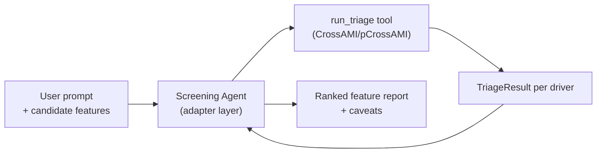

<!-- type: explanation -->
# Screening End-to-End Notebook: Durable Summary

## Purpose

Summarize the agentic feature screening walkthrough: how to move from a target series
and a set of candidate drivers to a ranked, actionable screening report, with optional
LLM-assisted synthesis on top of the deterministic pipeline.

Scope covered:
- deterministic CrossAMI/pCrossAMI screening for each candidate driver,
- multi-step agentic synthesis via `screening_agent.py`,
- SOLID separation between computation (domain/use cases) and interpretation (agent adapter).

## Key Figure

Why this figure matters: the agent calls `run_triage()` autonomously for each
candidate; it never generates numeric values independently, preserving
deterministic-first ownership.

## Key Result

From the notebook's §4 example output (bike ridership, n = 2 000):

- `temperature` is the strongest driver: raw CrossMI ≈ 0.09, conditioned CrossMI ≈ 0.05, action = **include**.
- `humidity` ranks second but directness ratio flags mediated dependence: action = **conditional**.
- `noise_feature` is weak and unstable (multiple directness warnings): action = **drop**.
- The deterministic and agentic pipelines agree on rankings — the agent adds contextual caveats, not different numbers.

## Architecture Note

`screening_agent.py` in `src/forecastability/` is the adapter. `04_screening_end_to_end.ipynb`
is a thin consumer that wires inputs and renders outputs. No business logic lives in the notebook.

> [!IMPORTANT]
> The agentic section (§3) requires `OPENAI_API_KEY` or `ANTHROPIC_API_KEY` in `.env`.
> All deterministic sections (§1, §2) run without an API key.

## Takeaways

- Run deterministic CrossAMI/pCrossAMI screening first; the agentic layer reads those results, it does not replace them.
- Directness warnings on exogenous pairs indicate mediation risk — treat as a conditional rather than a disqualifier.
- SOLID separation is enforced: domain compute in `src/`, narration in the agent adapter, notebook as display surface.
- The same screening pipeline is the foundation for `scripts/archive/run_exogenous_screening_workbench.py`.

## Notebook For Full Detail

- Full walkthrough: [../../notebooks/walkthroughs/04_screening_end_to_end.ipynb](../../notebooks/walkthroughs/04_screening_end_to_end.ipynb)
- Deterministic exogenous screening reference: [triage_05_batch_exogenous.md](triage_05_batch_exogenous.md)
