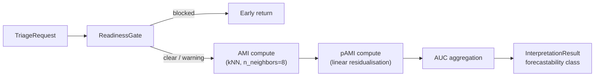

<!-- type: reference -->
# Triage 01 — Forecastability Profile Walkthrough

## Purpose

Demonstrate the **F1 Forecastability Profile** end-to-end: from a raw time series to a
horizon-wise AMI/pAMI map and a final forecastability class (high / medium / low).

Scope covered:
- `TriageRequest` construction and `ReadinessGate` validation,
- horizon-specific AMI $I_h$ and pAMI $\tilde{I}_h$ computation via kNN MI estimator,
- `InterpretationResult` forecastability class and directness regime,
- AUC aggregation for class thresholds.

## Key Figure

## Mathematical Notation

| Symbol | Meaning |
|---|---|
| $I_h$ | AMI at forecast horizon $h$ |
| $\tilde{I}_h$ | pAMI at lag $h$ (linear-residual AMI) |
| $\mathrm{AUC} = \sum_h \tilde{I}_h \Delta h$ | Aggregate predictive information |
| directness\_ratio = $\mathrm{AUC}_{\tilde{I}} / \mathrm{AUC}_{I}$ | Fraction of AMI that is direct (not mediated) |

## Key Concepts

- **High forecastability**: AUC pAMI above the high threshold — strong direct predictive structure.
- **Medium forecastability**: AUC pAMI in the medium band — moderate or partially mediated structure.
- **Low forecastability**: AUC pAMI below the low threshold — near white-noise behaviour.
- **pAMI linear residualisation**: conditioning out AR(1)–AR(h−1) structure before estimating lag-$h$ MI; isolates direct lag information.

> [!NOTE]
> kNN MI estimation uses `n_neighbors=8` with a fixed `random_state` for reproducibility.
> Results are sensitive to series length; the ReadinessGate enforces minimum-length guards.

## Takeaways

- F1 is the primary triage output: a single forecastability class per series.
- The profile shape (decaying vs. oscillating AMI) indicates the dominant process structure.
- High AMI + low directness ratio → mediated dependence → favour compact structured models.
- All F1 outputs are deterministic and regression-pinned.

## Notebook For Full Detail

- [../../notebooks/triage/01_forecastability_profile_walkthrough.ipynb](../../notebooks/triage/01_forecastability_profile_walkthrough.ipynb)
