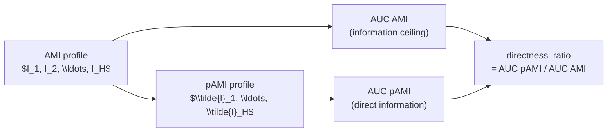

<!-- type: reference -->
# Triage 02 — Information-Theoretic Limits & Compression

## Purpose

Demonstrate the **F2 Information-Theoretic Limit Diagnostics**: the horizon-wise
theoretical ceiling on predictive improvement and the compression ratio that reveals
mediated lag chains.

Scope covered:
- AMI ceiling $I_h$ as the upper bound on predictive information at horizon $h$,
- pAMI $\tilde{I}_h$ as the direct-lag lower bound after linear residualisation,
- AUC compression ratio as a single-number summary of lag-chain mediation,
- practical interpretation: when compression is high, a compact AR-type model can capture most of the predictive structure.

## Key Concept: Compression Ratio

$$\text{directness\_ratio} = \frac{\mathrm{AUC}_{\tilde{I}}}{\mathrm{AUC}_{I}}$$

| directness\_ratio | Interpretation |
|---|---|
| ≈ 1.0 | Nearly all AMI is direct — no significant mediated chains |
| 0.1–0.5 | Moderate mediation — AR-type structure present |
| < 0.1 | Strong mediation — lag chains dominate; compact models preferred |

> [!WARNING]
> The directness ratio is a diagnostic magnitude, not a model selection criterion on its own.
> Combine with forecastability class and visual inspection of the horizon profile.

## Key Figure

## Takeaways

- The AMI ceiling shows the maximum recoverable information; the gap to pAMI reveals how much is mediated.
- A high-AMI, low-directness series benefits most from structured (AR/ARIMA) model families.
- A high-AMI, high-directness series is amenable to nonlinear or horizon-specific forecasters.
- Low AMI at all horizons → near-irreducible noise floor; model complexity is unlikely to help.

## Notebook For Full Detail

- [../../notebooks/triage/02_information_limits_and_compression.ipynb](../../notebooks/triage/02_information_limits_and_compression.ipynb)
- Related: [triage_01_forecastability_profile.md](triage_01_forecastability_profile.md) for AMI/pAMI notation
