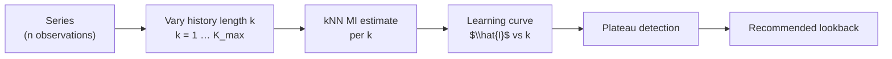

<!-- type: reference -->
# Triage 03 — Predictive Information Learning Curves (N3)

## Purpose

Demonstrate the **N3 Predictive Information Learning Curve** diagnostic: how estimated
AMI changes as a function of training sample size, and how to use the plateau to determine
a recommended lookback length.

Scope covered:
- learning curves for short-memory vs. persistent-memory series,
- plateau detection and recommended-lookback output,
- reliability caveats for finite samples and high-dimensional history windows.

## Key Concept

The learning curve plots $\hat{I}(Y_{t+1}; \mathcal{H}_k)$ as a function of history length $k$
(number of lagged inputs to the kNN estimator). A plateau in the curve suggests that adding
more history no longer recovers additional predictive information.

> [!NOTE]
> The service caps lookback at `k=8` to limit curse-of-dimensionality effects from the kNN estimator.
> For long-memory or seasonal series, the plateau may not be reached within this cap.

## Reliability Caveats

- Shorter series produce unstable kNN estimates for larger history windows.
- Detected plateau is a practical stopping rule, not a proof of finite memory.
- Recommended lookback should be combined with rolling-origin model validation.
- High-dimensional history windows inflate the kNN estimator's variance.

## Takeaways

- Use the N3 learning curve before committing to a model order or architecture.
- A flat curve from $k=1$ suggests no multi-lag benefit — an AR(1) or simple nonlinear model suffices.
- A rising curve capped by `K_max` suggests the series has longer memory than the diagnostic can confirm.
- Combine recommended lookback with F1 forecastability class for model-family selection.

## Notebook For Full Detail

- [../../notebooks/triage/03_predictive_information_learning_curves.ipynb](../../notebooks/triage/03_predictive_information_learning_curves.ipynb)
- Related: [triage_01_forecastability_profile.md](triage_01_forecastability_profile.md) for AMI notation
