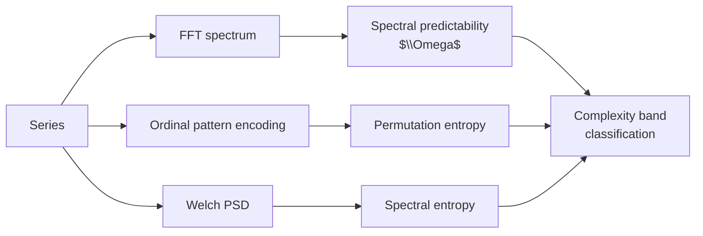

<!-- type: reference -->
# Triage 04 — Spectral and Entropy Diagnostics (N4)

## Purpose

Demonstrate the **N4 Spectral and Entropy Diagnostics**: complementary non-parametric
measures of predictability and complexity that sit alongside AMI/pAMI in the triage suite.

Scope covered:
- spectral predictability score $\Omega$ (variance explained by dominant spectral components),
- permutation entropy and spectral entropy as complexity measures,
- complexity band classification,
- optional Largest Lyapunov Exponent (LLE) with an explicit experimental warning.

## Diagnostic Summary

| Metric | High value means | Low value means |
|---|---|---|
| Spectral predictability $\Omega$ | Strong periodic / cyclical structure | Broadband / noise-like spectrum |
| Permutation entropy | High complexity, irregular ordering | Low complexity, structured dynamics |
| Spectral entropy | Broadband frequency content | Narrow-band / periodic signal |
| Complexity band | Classification: low / medium / high complexity | — |

> [!WARNING]
> The Largest Lyapunov Exponent (LLE) section is **experimental**. LLE is sensitive to
> embedding choices, finite-sample effects, and noise. Do not use it as a standalone
> production decision rule.

## Key Figure

## Takeaways

- $\Omega$ near 1 confirms periodic or quasi-periodic dynamics; combine with F1 class to select seasonal models.
- High permutation entropy with low forecastability confirms near-random dynamics — model complexity is unlikely to help.
- Complexity band classification provides a coarse regime label that complements the F1 forecastability class.
- Always treat N4 metrics as supporting diagnostics, not primary decision criteria.

## Notebook For Full Detail

- [../../notebooks/triage/04_spectral_and_entropy_diagnostics.ipynb](../../notebooks/triage/04_spectral_and_entropy_diagnostics.ipynb)
- Related: [triage_01_forecastability_profile.md](triage_01_forecastability_profile.md) for primary F1 diagnostic
