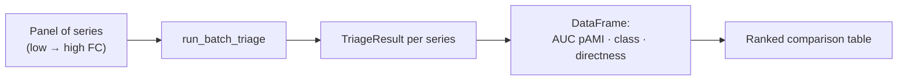
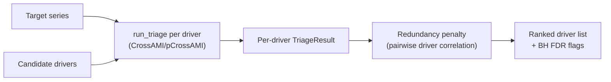

<!-- type: reference -->
# Triage 05 — Batch Ranking and Exogenous Workbench (N5)

## Purpose

Demonstrate two deterministic multi-series workflows: batch triage ranking across a
panel of signals and exogenous driver screening with redundancy penalty and optional
Benjamini-Hochberg (BH) FDR interpretation.

Scope covered:
- `run_batch_triage` across signals spanning the full forecastability range,
- multi-series comparison: ranking by AUC pAMI and diagnostic columns,
- exogenous driver screening with redundancy penalty,
- optional BH FDR correction for multi-driver testing.

## Workflow A: Batch Ranking (F7)

Signals span the full low-to-high forecastability structure. Batch triage returns
deterministic ranks and diagnostic columns that are stable across runs.

## Workflow B: Exogenous Screening

> [!NOTE]
> BH FDR correction is optional and applies to multi-driver hypothesis testing.
> With few drivers (< 5 candidates), FDR correction has limited statistical power.

## Takeaways

- Batch triage is the recommended entry point for panel screening before model selection.
- Redundancy penalty prevents co-linear drivers from dominating the ranking.
- BH FDR flags are informational — they do not block driver inclusion.
- All outputs are deterministic and suitable for regression pinning.

## Notebook For Full Detail

- [../../notebooks/triage/05_batch_and_exogenous_workbench.ipynb](../../notebooks/triage/05_batch_and_exogenous_workbench.ipynb)
- For the agentic extension of exogenous screening: [screening_end_to_end.md](screening_end_to_end.md)
