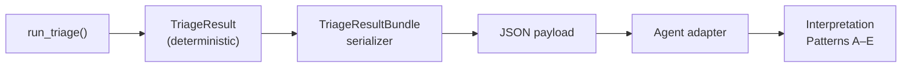

<!-- type: reference -->
# Triage 06 — Agent-Ready Triage Interpretation (Deterministic Deep Dive)

## Purpose

Document the deterministic payload/serializer/interpretation deep dive for the triage
agent boundary. This notebook focuses on how adapter layers transform deterministic
triage outputs into stable, JSON-serialisable structures for downstream consumers.

> [!IMPORTANT]
> This is **not** the end-to-end triage walkthrough. For that, see
> [agentic_triage.md](agentic_triage.md) and `03_triage_end_to_end.ipynb`.

Scope covered:
- `run_triage()` deterministic output and raw `TriageResult` inspection,
- `TriageResultBundle` serialization to JSON-safe structure,
- adapter layer: how `TriageResult` becomes an agent-consumable payload,
- interpretation patterns A–E: the five canonical forecastability narrative patterns.

## Key Figure

## Interpretation Patterns A–E

| Pattern | Condition | Meaning |
|---|---|---|
| A | High FC, high directness | Strong direct signal — flexible model family |
| B | High FC, low directness | Mediated dependence — compact structured models |
| C | Medium FC | Moderate signal — validate with rolling-origin |
| D | Low FC, non-trivial AMI | Weak signal — feature engineering or exogenous drivers |
| E | Low FC, near-zero AMI | No recoverable structure — noise floor |

## Architecture Note

The adapter layer enforces that:
- No narrative or numeric values are generated by the LLM — all numbers come from `TriageResult`.
- `TriageResultBundle` is the stable contract between domain outputs and agent consumers.
- Serialization is lossless: all `TriageResult` fields are preserved in the JSON payload.

> [!NOTE]
> The `narrative` field on `TriageResult` is always `None` after `run_triage()`.
> It is populated only by the optional narration adapter — never by domain code.

## Takeaways

- The agent boundary is the `TriageResultBundle` JSON serialization — deterministic and regression-testable.
- Patterns A–E are deterministic classification outcomes, not LLM-generated labels.
- The serializer/adapter split is the key SOLID boundary in the triage layer.
- This notebook is the reference for building new agent consumers or integration tests.

## Notebook For Full Detail

- [../../notebooks/triage/06_agent_ready_triage_interpretation.ipynb](../../notebooks/triage/06_agent_ready_triage_interpretation.ipynb)
- End-to-end triage walkthrough: [agentic_triage.md](agentic_triage.md)
