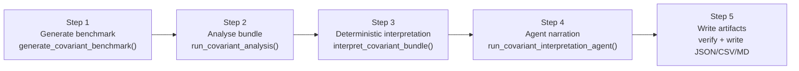

<!-- type: reference -->
# Covariant Showcase — Developer Guide

Developer reference for the V3-F09 covariant analysis showcase script.

_Last verified for V3-F09 on 2026-04-17._

---

## Purpose

`scripts/run_showcase_covariant.py` is the canonical end-to-end integration
exercise for the covariant analysis surface introduced in v0.3.0.  It:

1. Generates a deterministic 8-driver synthetic benchmark.
2. Runs the full `run_covariant_analysis` use-case pipeline.
3. Passes the bundle through the deterministic interpretation service.
4. Optionally invokes the LLM narrative agent.
5. Writes artifacts and a ground-truth verification report.

The script is **not** a research notebook.  It is a regression harness and a
readable demonstration of the public API.  The exit code mirrors test
conventions: `0` = PASS, `1` = FAIL.

---

## Quick Start

```bash
# Fast mode — skip PCMCI+/PCMCI-AMI, runs in ~36 s
uv run scripts/run_showcase_covariant.py --fast

# Full mode — all 6 methods including both PCMCI variants (~5–10 min)
uv run scripts/run_showcase_covariant.py

# Full mode, suppress banner, just see the final status line
uv run scripts/run_showcase_covariant.py --quiet

# Full mode + LLM narrative (requires OPENAI_API_KEY in .env)
uv run scripts/run_showcase_covariant.py --agent

# LLM agent enabled but narrative forced to None (strict/offline test)
uv run scripts/run_showcase_covariant.py --agent --strict
```

---

## CLI Flags

| Flag | Type | Default | Description |
|---|---|---|---|
| `--fast` | bool | `False` | Skip `pcmci` and `pcmci_ami`; run only `cross_ami`, `cross_pami`, `te`, `gcmi`.  Reduces runtime by roughly an order of magnitude.  Triggers triage-mode verification (PCMCI-dependent checks relaxed). |
| `--n` | int | `1500` | Synthetic benchmark length.  Raise to `>= 5000` for reliable detection of weak nonlinear couplings ($\beta \approx 0.35$). |
| `--quiet` | bool | `False` | Suppress all per-stage banners.  Only the final `VERIFICATION: PASS/FAIL` line is printed. |
| `--agent` | bool | `False` | Enable the live LLM narrative agent.  Mutually exclusive with `--no-agent`. |
| `--no-agent` | bool | — | Explicitly disable the agent (default). |
| `--strict` | bool | `False` | Force `narrative=None` even when `--agent` is given.  Useful for offline CI runs that still exercise the agent code path. |
| `--max-lag` | int | `5` | Maximum lag horizon passed to `run_covariant_analysis`. |
| `--n-surrogates` | int | `99` | Number of phase-randomised surrogates.  Values below 99 raise `ValueError` at startup. |
| `--methods` | str | `None` | Comma-separated method subset (e.g. `cross_ami,gcmi`).  Overrides `--fast` when both are given. |
| `--output-root` | str | `outputs` | Root directory for all artifact subtrees. |
| `--random-state` | int | `42` | Reproducibility seed passed to both `generate_covariant_benchmark` and `run_covariant_analysis`. |
| `--no-rolling` | bool | `False` | No-op; present for parity with `run_showcase.py`. |

---

## The 5-Step Pipeline



### Step 1 — Generate benchmark

`generate_covariant_benchmark(n=args.n, seed=args.random_state)` produces a
deterministic DataFrame with one `target` column and eight driver columns:

| Driver | Ground-truth relationship |
|---|---|
| `driver_direct` | Lagged linear causal parent |
| `driver_mediated` | Lagged linear parent, also mediated path |
| `driver_redundant` | Strong covariate, redundant given another parent |
| `driver_noise` | Pure noise, no coupling |
| `driver_contemp` | Contemporaneous (lag-0) coupling only |
| `driver_nonlin_sq` | Nonlinear: squared coupling ($X^2$) |
| `driver_nonlin_abs` | Nonlinear: absolute-value coupling ($|X|$, $\beta \approx 0.35$, weak) |
| *(implicit)* | A second direct driver used internally to create the redundancy condition |

### Step 2 — Analyse bundle

`run_covariant_analysis(target, drivers, ...)` is the public use-case facade.
It returns a `CovariantAnalysisBundle` containing the per-lag summary table,
optional PCMCI+ graph, and optional PCMCI-AMI result.

In `--fast` mode the `methods` argument is fixed to
`("cross_ami", "cross_pami", "te", "gcmi")`.  Neither `pcmci_graph` nor
`pcmci_ami_result` is populated.

### Step 3 — Deterministic interpretation

`interpret_covariant_bundle(bundle)` runs the
[seven-rule role-assignment algorithm](../theory/covariant_role_assignment.md)
and returns an immutable `CovariantInterpretationResult` with:

- `driver_roles` — one `CovariantDriverRole` per driver
- `forecastability_class` / `directness_class`
- `primary_drivers` — drivers with role `direct_driver` or `nonlinear_driver`
- `modeling_regime` — text guidance from the regime lookup table
- `conditioning_disclaimer` — verbatim disclaimer surfaced to consumers

### Step 4 — Agent narration

Without `--agent`, the script builds a narrative-free `CovariantAgentExplanation`
directly via `explanation_from_interpretation(interpretation, narrative=None, ...)`.

With `--agent`, `run_covariant_interpretation_agent` is invoked:

1. Attempts to load `pydantic-ai` and read `OPENAI_API_KEY` from settings.
2. If either is absent, or if `--strict` is set, returns the strict fallback
   with `narrative=None` and caveat `"Narrative disabled (strict/no-network mode)."`.
3. If a live LLM call succeeds, the returned narrative is passed through
   `verify_narrative_against_bundle()` before the explanation is returned.
   Any hallucination violation drops the narrative and adds violation caveats.

> [!IMPORTANT]
> The agent is **experimental**.  It narrates the deterministic findings; it does
> not compute or validate any science.  See [wording_policy.md](../maintenance/wording_policy.md).

### Step 5 — Write artifacts

All five artifact files are written unconditionally, including on verification
failure.  The verification report always reflects the actual run outcome.

---

## Artifact Locations and Formats

| Artifact | Path | Format |
|---|---|---|
| Raw bundle | `outputs/json/covariant_bundle.json` | JSON, `CovariantAnalysisBundle.model_dump(mode="json")` |
| Deterministic interpretation | `outputs/json/covariant_interpretation.json` | JSON, `CovariantInterpretationResult.model_dump(mode="json")` |
| Agent explanation | `outputs/json/covariant_agent_explanation.json` | JSON, `CovariantAgentExplanation.model_dump(mode="json")` |
| Summary table | `outputs/tables/covariant_summary.csv` | CSV, one row per (driver, lag) |
| Verification report | `outputs/reports/showcase_covariant/verification.md` | Markdown |

### CSV columns

```
target, driver, lag, cross_ami, cross_pami, transfer_entropy, gcmi,
pcmci_link, pcmci_ami_parent, significance, rank, interpretation_tag
```

### Verification report structure

The Markdown report records:

- Bundle metadata: target name, forecastability class, directness class,
  primary drivers, modeling regime, and PASS/FAIL status.
- A driver-role table (driver | role | best_lag).
- A violation list, or "none" when all checks pass.

---

## Ground-Truth Verifier Logic

`_verify_against_ground_truth(bundle, interpretation)` compares each driver
role against the `_EXPECTED_ROLES` dictionary:

```python
_EXPECTED_ROLES = {
    "driver_direct":       {"direct_driver"},
    "driver_mediated":     {"direct_driver", "mediated_driver"},
    "driver_redundant":    {"redundant", "mediated_driver"},
    "driver_noise":        {"noise_or_weak", "inconclusive"},
    "driver_contemp":      {"contemporaneous", "direct_driver", "noise_or_weak"},
    "driver_nonlin_sq":    {"nonlinear_driver", "direct_driver"},
    "driver_nonlin_abs":   {"nonlinear_driver", "direct_driver", "noise_or_weak", "inconclusive"},
}
```

Additional structural checks:

- `driver_direct` must appear in `primary_drivers` when it earns a role from
  its expected set (full mode only).
- `driver_nonlin_sq` and `driver_nonlin_abs` must appear in `primary_drivers`
  when they earn `nonlinear_driver` or `direct_driver`.
- `driver_noise` must **never** appear in `primary_drivers`.
- When `pcmci_ami_result` is present, `driver_redundant` must **not** appear
  as a PCMCI-AMI parent of the target (redundant drivers are excluded by the
  role assignment before causal graph construction).

### Triage-mode relaxation

When `bundle.pcmci_graph is None` and `bundle.pcmci_ami_result is None`
(`--fast` mode), the verifier sets `has_causal=False` and expands every
driver's accepted set with `"inconclusive"`.  Structural checks that require
causal graph evidence (e.g. `driver_direct` in `primary_drivers`) are skipped.

This is correct: without causal methods, drivers that would be `direct_driver`
in full mode cannot be confirmed and land on `inconclusive`.

---

## How to Extend

### Swapping the synthetic benchmark

Replace `generate_covariant_benchmark` with any function that returns a
`pandas.DataFrame` with a `target` column and one column per driver:

```python
df = my_benchmark(n=args.n, seed=args.random_state)
target = df["target"].to_numpy()
drivers = {name: df[name].to_numpy() for name in df.columns if name != "target"}
```

Update `_EXPECTED_ROLES` to reflect your benchmark's ground-truth topology.

### Plugging in a different LLM

`run_covariant_interpretation_agent` accepts an optional `model` argument in
`"provider:model-name"` format (e.g. `"anthropic:claude-3-5-sonnet-latest"`).
Pass it from `main()` after adding a `--model` argument to `_parse_args`.  The
underlying PydanticAI agent passes the string directly to the pydantic-ai
model resolver, so any provider supported by pydantic-ai can be used without
modifying the agent logic.

> [!NOTE]
> PydanticAI is an optional dependency.  Install it with:
> ```
> uv sync --extra agent
> ```

### Running in CI without an API key

```bash
uv run scripts/run_showcase_covariant.py --fast --agent --strict --quiet
```

`--strict` forces `narrative=None` and returns the strict fallback
immediately, exercising the agent code path without any network call.
The exit code is still `0` / `1` based on deterministic verification.

---

## Source References

- Script: [scripts/run_showcase_covariant.py](../../scripts/run_showcase_covariant.py)
- Interpretation service: [src/forecastability/services/covariant_interpretation_service.py](../../src/forecastability/services/covariant_interpretation_service.py)
- Agent adapter: [src/forecastability/adapters/llm/covariant_interpretation_agent.py](../../src/forecastability/adapters/llm/covariant_interpretation_agent.py)
- Payload models: [src/forecastability/adapters/agents/covariant_agent_payload_models.py](../../src/forecastability/adapters/agents/covariant_agent_payload_models.py)
- Role assignment theory: [../theory/covariant_role_assignment.md](../theory/covariant_role_assignment.md)
- Tests: [tests/test_covariant_interpretation_service.py](../../tests/test_covariant_interpretation_service.py), [tests/test_covariant_interpretation_agent.py](../../tests/test_covariant_interpretation_agent.py)
