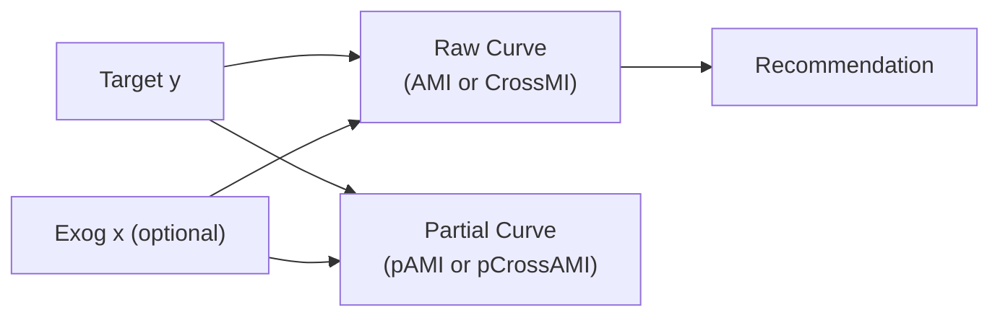
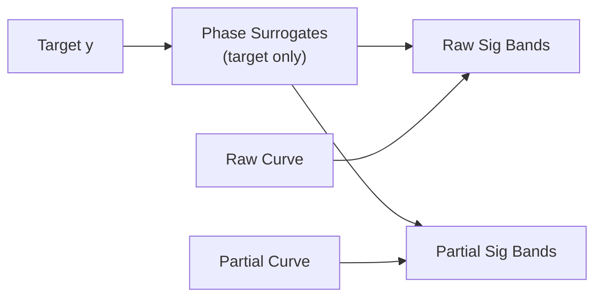

<!-- type: how-to -->
# 42. ForecastabilityAnalyzerExog — User Manual v1.0

> Plan status: **complete**. Documentation lives inline in this file.

## Deliverables

- [x] Quick-start import and analyzer construction
- [x] Core terminology: AMI / pAMI (univariate) vs CrossMI / pCrossAMI (cross series)
- [x] Operating modes documented
- [x] Synthetic data generator with known ground truth
- [x] Complete runnable test script
- [x] Interpretation guidance for univariate vs cross mode
- [x] Scorer-selection table and troubleshooting notes

---

## 1. Quick Setup

```bash
uv sync
```

```python
from forecastability.analyzer import ForecastabilityAnalyzerExog

analyzer = ForecastabilityAnalyzerExog(n_surrogates=99, random_state=42)
```

`ForecastabilityAnalyzerExog` extends `ForecastabilityAnalyzer` with an optional `exog`
parameter. When `exog` is omitted the behavior is identical to the base class (AMI / pAMI).
When `exog` is supplied the analyzer switches to **cross mode** and computes
**CrossMI** and **pCrossAMI**.

---

## 2. Terminology — AMI vs CrossMI

The naming convention follows the ACF / CCF analogy:

| Correlation family | MI family | Mode | What is measured |
|---|---|---|---|
| ACF (autocorrelation) | **AMI** — auto mutual information | `exog=None` (univariate) | $I(\text{target}_{t-h};\, \text{target}_t)$ — self-dependence |
| Partial ACF | **pAMI** — partial AMI | `exog=None` (univariate) | Direct-lag AMI after conditioning on shorter target lags |
| **CCF** (cross-correlation) | **CrossMI** — cross mutual information | `exog=<array>` (cross) | $I(\text{exog}_{t-h};\, \text{target}_t)$ — lagged predictive association |
| Partial CCF | **pCrossAMI** — partial CrossMI | `exog=<array>` (cross) | Direct-lag CrossMI after conditioning on shorter exog lags |

> [!IMPORTANT]
> CrossMI is **not** AMI. AMI measures a series' self-predictability (one series).
> CrossMI measures how much information a *different* variable carries about the target
> at lag $h$ (two series). The naming mirrors ACF vs CCF.

> [!NOTE]
> **Lag-0 exclusion:** Both AMI and CrossMI are computed for $h \geq 1$ only
> (`range(1, max_lag+1)`). Lag 0 is excluded because a contemporaneous exogenous value
> is unavailable at forecast time. CrossMI therefore measures *lagged predictive
> association*, not same-time correlation.

---

## 3. Operating Modes

| `exog` argument | Mode | Curves produced | Analogy |
|---|---|---|---|
| `None` (default) | Univariate | AMI curve + pAMI curve | ACF / PACF |
| `np.ndarray` | Cross (CCF-style) | CrossMI curve + pCrossAMI curve | CCF / partial CCF |



When surrogates are enabled (`compute_surrogates=True`):



> [!NOTE]
> **Surrogates are opt-in** (`compute_surrogates=False` by default). Surrogates are a
> project extension, not paper-native (arXiv:2601.10006). When enabled, phase-randomisation
> is applied to the *target* series only; the exogenous series is held fixed across all runs.

---

## 4. Synthetic Test Data (known ground truth)

Use the generator below for controlled validation before running real data.
With known ground truth you can verify that the analyzer correctly distinguishes
meaningful from useless exogenous inputs.

```python
import numpy as np


def generate_test_data(n: int = 2000, seed: int = 42):
    """Return (target y, exog_meaningful, exog_useless).

    Ground truth:
        - exog_meaningful drives target with a one-step lag (CrossMI should peak at h=1).
        - exog_useless is independent white noise (CrossMI should be near zero).
    """
    np.random.seed(seed)
    t = np.arange(n)
    noise = np.random.normal(0, 0.3, n)

    exog_meaningful = np.sin(2 * np.pi * t / 50) + np.random.normal(0, 0.2, n)

    y = np.zeros(n)
    y[0] = noise[0]
    for i in range(1, n):
        lag1_exog = exog_meaningful[i - 1]
        y[i] = (
            0.5 * lag1_exog
            + 0.6 * y[i - 1]
            + 0.4 * np.sin(2 * np.pi * t[i] / 30)
            + noise[i]
        )

    exog_useless = np.random.normal(0, 1.0, n)
    return y, exog_meaningful, exog_useless
```

Expected outcomes:

| Run | Expected recommendation | Expected CrossMI profile |
|---|---|---|
| `exog_meaningful` | `HIGH` | Peaks at $h=1$, decays at longer lags |
| `exog_useless` | `LOW` | Flat, near-zero across all lags |
| Univariate `y` | `MEDIUM` to `HIGH` | AR + seasonal structure |

> [!TIP]
> Run the synthetic test before any real-data experiment. If `exog_meaningful` does not
> produce `HIGH` or `exog_useless` produces significant lags, something is misconfigured.

---

## 5. Complete Test Script

```python
import numpy as np
from forecastability.analyzer import ForecastabilityAnalyzerExog

# generate_test_data defined in §4 above — paste here if running standalone
y, exog_good, exog_bad = generate_test_data(n=2000)
analyzer = ForecastabilityAnalyzerExog(n_surrogates=99, random_state=42)

print("=== 1. UNIVARIATE (AMI) ===")
res_uni = analyzer.analyze(y, max_lag=60, method="mi")
print("Recommendation:", res_uni.recommendation)
print("Significant AMI lags:", res_uni.sig_raw_lags.tolist()[:10], "...")
analyzer.plot(show=True)

print("\n=== 2. MEANINGFUL EXOG (CrossMI) ===")
res_good = analyzer.analyze(y, exog=exog_good, max_lag=60, method="mi")
print("Recommendation:", res_good.recommendation)
print("Significant CrossMI lags:", res_good.sig_raw_lags.tolist()[:10], "...")
analyzer.plot(show=True)

print("\n=== 3. USELESS EXOG (CrossMI — noise control) ===")
res_bad = analyzer.analyze(y, exog=exog_bad, max_lag=60, method="mi")
print("Recommendation:", res_bad.recommendation)
print("Significant CrossMI lags:", res_bad.sig_raw_lags.tolist())
analyzer.plot(show=True)
```

---

## 6. Interpreting Results

### Univariate mode (AMI / pAMI)

| Field | Name | Meaning |
|---|---|---|
| `sig_raw_lags` | Significant AMI lags | $I(\text{target}_{t-h}; \text{target}_t)$ exceeds surrogate band |
| `sig_partial_lags` | Significant pAMI lags | Direct-lag AMI remains significant after conditioning |
| `mean_raw_20` | Mean AMI over $h=1..20$ | Summary forecastability score |
| `recommendation` | `HIGH` / `MEDIUM` / `LOW` | Triage label |

### Cross mode (CrossMI / pCrossAMI)

| Field | Name | Meaning |
|---|---|---|
| `sig_raw_lags` | Significant CrossMI lags | $I(\text{exog}_{t-h}; \text{target}_t)$ exceeds surrogate band |
| `sig_partial_lags` | Significant pCrossAMI lags | Direct-lag CrossMI remains significant after conditioning |
| `mean_raw_20` | Mean CrossMI over $h=1..20$ | Summary exogenous predictive association score |
| `recommendation` | `HIGH` / `MEDIUM` / `LOW` | Same thresholds as univariate |

| Recommendation | Meaning | Action |
|---|---|---|
| `HIGH` | Strong lagged exog→target association | Include exog in models; use pCrossAMI to identify direct lags |
| `MEDIUM` | Moderate lagged association | Keep; test model-level lift |
| `LOW` | Weak lagged association | Drop, or investigate transforms / alternate lags |

> [!WARNING]
> **Partial curve limitation:** Residualisation is OLS-based (linear). Only *linear* mediation
> through intermediate lags is removed. For nonlinear scorers (`mi`, `distance`), nonlinear
> indirect dependence may persist in pCrossAMI. A non-zero pCrossAMI value means
> "unexplained residual dependence," not definitively a direct causal path.

---

## 7. Scorer Selection

| `method` | Family | What it captures | `HIGH` threshold | `MEDIUM` threshold |
|---|---|---|---|---|
| `mi` | `nonlinear` | Linear + nonlinear dependence (default) | ≥ 0.80 | ≥ 0.30 |
| `distance` | `bounded_nonlinear` | Robust, normalised-style dependence | ≥ 0.50 | ≥ 0.20 |
| `pearson` | `linear` | Linear dependence only | ≥ 0.50 | ≥ 0.20 |
| `spearman` | `rank` | Rank dependence, outlier-robust | ≥ 0.50 | ≥ 0.20 |
| `kendall` | `rank` | Rank dependence, outlier-robust | ≥ 0.50 | ≥ 0.20 |

> [!IMPORTANT]
> AMI / CrossMI recommendations are **not directly comparable** across different scorer
> families. Use the same `method` for all series in a comparative study.

---

## 8. Advanced API Notes

### Supported exogenous entry points

| Method | `exog` supported | Notes |
|---|---|---|
| `analyze(..., exog=...)` | ✓ | Primary API — preferred for all use cases |
| `compute_raw(..., exog=...)` | ✓ | Low-level CrossMI raw curve |
| `compute_partial(..., exog=...)` | ✓ | Low-level pCrossAMI curve |
| `compute_significance_generic(..., exog=...)` | ✓ | CrossMI significance bands (requires `compute_surrogates=True`) |
| `compute_ami(..., exog=...)` | ✗ | Raises `ValueError` — AMI is univariate only |
| `compute_pami(..., exog=...)` | ✗ | Raises `ValueError` — pAMI is univariate only |

### Constraints

- `exog` length must **exactly** match `ts` length — `ValidationError` if not.
- `n_surrogates` must be ≥ 99 — `ValueError` if lower.
- Custom scorer registration: `register_scorer(name, fn, family)`.
- Configuration is Pydantic-validated; results returned as `AnalyzeResult` dataclasses.

---

## 9. Troubleshooting

| Symptom | Cause | Fix |
|---|---|---|
| `ValidationError: lengths differ` | `exog` and `ts` have different lengths | Align arrays before `analyze` |
| `ValueError: n_surrogates` | `n_surrogates < 99` | Increase to ≥ 99 |
| `ValueError: exog not supported` | Called `compute_ami` / `compute_pami` with `exog` | Use `compute_raw` / `compute_partial` instead |
| Series too short | `ts.shape[0] < max_lag + min_pairs + 1` | Reduce `max_lag` or acquire more data |
| All CrossMI lags at noise floor | Exog has no lagged association with target | Expected — use noise control as baseline; drop variable |

