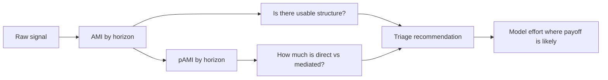

<!-- type: explanation -->
# Executive Summary

One-page overview of what this toolkit does, why it matters, and what is ready now.

> [!IMPORTANT]
> AMI in this project is paper-aligned with the referenced method.
> pAMI is a project extension that adds a direct-lag diagnostic via linear residualisation.

## What problem this solves

Teams often spend time building forecasting models on signals that are weak, unstable, or mostly indirect.

This toolkit helps you answer one practical question early:

**Is this signal worth deeper modeling, and if yes, which lags are most actionable?**

That means less trial-and-error, faster prioritization, and clearer handoff from analysis to model development.

## What is novel here

| Standard approach | This project adds | Why it helps in practice |
|---|---|---|
| Forecast first, diagnose later | Dependence triage before full model search | Reduces wasted modeling cycles |
| One dependence view | Two views: AMI (total structure) and pAMI (direct structure) | Separates broad predictability from truly direct lag signal |
| Notebook-only interpretation | Deterministic triage pipeline with optional narration layer | Keeps numbers auditable while still supporting plain-language summaries |
| Point analysis only | Horizon-aware diagnostics and significance context | Supports lookback and horizon decisions, not just a single score |

## Why AMI/pAMI triage matters

Simple decision view:

| Triage outcome | Plain-language meaning | Typical next move |
|---|---|---|
| High AMI + High pAMI | Strong and direct lag structure | Try richer lag-aware models |
| High AMI + Lower pAMI | Structure exists but much is indirect | Start with compact or regularized models |
| Medium AMI | Signal is borderline or context-sensitive | Run cautious experiments; watch horizon drop-off |
| Low AMI + Low pAMI | Little usable dependence signal | Prefer baseline methods or deprioritize |

> [!NOTE]
> In rolling-origin evaluation, diagnostics are computed on training windows only to avoid data leakage.

## What is ready today

| Capability | Status today | Notes |
|---|---|---|
| AMI baseline workflow | Stable | Paper-aligned horizon-specific AMI diagnostics |
| pAMI extension and directness ratio | Stable | Project extension for direct-vs-mediated lag structure |
| Deterministic triage (`run_triage`) | Stable | Reproducible readiness, routing, interpretation, recommendation |
| CLI and HTTP API adapters | Beta | Good for integration, still marked adapter-level beta |
| MCP and agent narration layer | Experimental | Optional usability layer over deterministic outputs |

## What comes next

Current backlog direction focuses on selective expansion after packaging and trust foundations:

- Optional lightweight dashboard adapter for operational demos.
- Evaluation of additional pAMI residual backends beyond the current linear baseline.
- New transport adapters only when user demand is concrete.

## Start here

- [quickstart.md](quickstart.md)
- [results_summary.md](results_summary.md)
- [production_readiness.md](production_readiness.md)
- [why_use_this.md](why_use_this.md)
