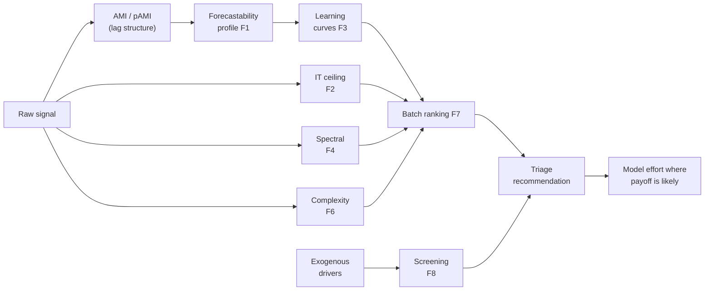

<!-- type: explanation -->
# Executive Summary

One-page overview of what this toolkit does, why it matters, and what is ready now.

> [!IMPORTANT]
> **AMI** is paper-aligned with the referenced method (Catt 2026a).
> **pAMI** and all diagnostic extensions (F1–F9) are project additions that broaden the toolkit into a full deterministic triage surface.

## What problem this solves

Teams spend time building forecasting models on signals that are weak, unstable, or mostly indirect.

This toolkit answers a family of practical questions **before** full model search:

**Is this signal worth deeper modeling? Which lags matter? Is the structure linear or nonlinear? What is the information-theoretic ceiling? Are exogenous drivers adding real value?**

Less trial-and-error, faster prioritization, clearer handoff from analysis to model development.

## What is novel here

### AMI / pAMI baseline

| Standard approach | This project adds | Why it helps |
|---|---|---|
| Forecast first, diagnose later | Dependence triage before model search | Reduces wasted modeling cycles |
| One dependence view | AMI (total) + pAMI (direct) | Separates broad predictability from direct lag signal |
| Notebook-only interpretation | Deterministic triage pipeline with optional narration | Auditable numbers with plain-language summaries |

### Triage extensions (F1–F8, experimental F5)

| Diagnostic family | Code | What it adds |
|---|---|---|
| Forecastability profiles with informative horizon sets | F1 | Horizon-resolved profile with significance-gated lag sets |
| Information-theoretic ceiling diagnostics | F2 | Upper bounds on predictable information at each horizon |
| Predictive information learning curves | F3 | Lookback selection via diminishing-returns curves |
| Spectral predictability (linear vs nonlinear) | F4 | Wiener–Granger spectral ratio; flags nonlinear divergence |
| Largest Lyapunov exponent | F5 | Chaos-regime sensitivity estimate (**experimental**, gated) |
| Entropy-based complexity triage | F6 | Permutation entropy + statistical complexity plane |
| Batch multi-signal diagnostic ranking | F7 | Cross-signal ranking table from any diagnostic surface |
| Exogenous driver screening with redundancy penalty and FDR | F8 | Identifies non-redundant exogenous drivers under false-discovery control |

## Why deterministic triage matters

### Diagnostic surface — what each family tells you

| Diagnostic | Question it answers | Typical next move |
|---|---|---|
| AMI + pAMI | Is there usable structure? Direct or mediated? | Choose model complexity |
| F1 Profile | Which horizons carry significant information? | Set forecast horizon range |
| F2 IT ceiling | How much can any model recover? | Calibrate accuracy expectations |
| F3 Learning curves | How much lookback is enough? | Fix window length |
| F4 Spectral | Is the structure mostly linear? | Choose linear vs nonlinear model family |
| F6 Complexity | Where does the signal sit on the order–chaos spectrum? | Flag chaotic or trivially regular regimes |
| F7 Batch ranking | Which signals deserve attention first? | Prioritise modeling queue |
| F8 Exogenous screening | Which external drivers add non-redundant information? | Select exogenous features |

> [!NOTE]
> All diagnostics are computed on training windows only (rolling-origin protocol) to avoid data leakage.

## What is ready today

| Capability | Status | Notes |
|---|---|---|
| AMI baseline workflow | Stable | Paper-aligned horizon-specific AMI diagnostics |
| pAMI extension and directness ratio | Stable | Direct-vs-mediated lag structure |
| Deterministic triage (`run_triage`) | Stable | Reproducible readiness, routing, interpretation |
| Forecastability profile (F1) | Stable | Horizon-resolved profile with informative horizon sets |
| IT limit diagnostics (F2) | Stable | Information ceiling and compression ratio |
| Predictive info learning curves (F3) | Stable | Lookback selection; reliability warnings included |
| Spectral predictability (F4) | Stable | Linear/nonlinear divergence ratio |
| Entropy-based complexity (F6) | Stable | Permutation entropy + statistical complexity |
| Batch diagnostic ranking (F7) | Stable | Multi-signal ranking from any diagnostic surface |
| Exogenous screening with FDR (F8) | Stable | Redundancy-penalised driver selection |
| Largest Lyapunov exponent (F5) | Experimental | Gated behind explicit opt-in |
| Agent payload adapters (A1–A3) | Stable | Deterministic payloads for all diagnostics |
| CLI and HTTP API adapters | Beta | Integration adapters |

## What comes next

- **F9 benchmark fixture verification in CI** — automated regression checks for all diagnostic outputs.
- **PyPI packaging and release** — first public distribution of the triage toolkit.
- **Community feedback on diagnostic surface coverage** — identify gaps in the F1–F8 surface.
- **ForeCA projection mode** — deferred from F7; depends on demand and licensing clarity.

## Paper references

The baseline AMI method follows Catt (2026a). The triage extensions draw on:

- Catt (2026b) — forecastability profiles, IT ceiling diagnostics (F1, F2)
- Morawski et al. (2025) — predictive information learning curves (F3)
- Wang et al. (2025) — spectral predictability, Lyapunov exponent (F4, F5)
- Ponce-Flores et al. (2020) — time-series complexity and forecasting (F6)
- Bandt & Pompe (2002) — permutation entropy (F6)

## Start here

- [quickstart.md](quickstart.md)
- [results_summary.md](results_summary.md)
- [production_readiness.md](production_readiness.md)
- [why_use_this.md](why_use_this.md)
