# Stop Feeding Forecasting Models Blindly: A Forecastability Triage Workflow for Time Series

*A deterministic, information-theoretic workflow for diagnosing target memory, exogenous signal retention, lag legality, sparse feature selection, and downstream model hand-off before expensive forecasting begins.*

> **v0.5.0 erratum (2026-05-25):** This article was written against v0.4.3.
> v0.5.0 introduces breaking changes: the default AMI estimator is now KSG-II
> (pass `estimator='ksg1_sklearn'` to reproduce v0.4.3 numerics),
> `compute_transfer_entropy` has been removed in favour of
> `compute_transfer_entropy_ksg` and `compute_predictive_information_gain`,
> significance correction now defaults to Romano-Wolf FWER, and
> `signal_to_noise` has been renamed to `informative_mass_fraction`.
> See the full migration guide:
> [`docs/migration/v0.4.x_to_v0.5.0.md`](../migration/v0.4.x_to_v0.5.0.md).

## Most Forecasting Work Starts Too Late

Most forecasting work starts too late.

The usual story is familiar. Pick a forecasting library. Generate lag features. Add every covariate that looks plausible. Run a leaderboard. Then discover the target has weak memory, the horizon is mismatched to the signal, the best covariates are unsafe at prediction time, or the strongest lags would leak future information.

At that point, the leaderboard is not wrong exactly. It is answering a question the project should not have asked yet.

`dependence-forecastability` is an open-source pre-modeling toolkit for that earlier question. It does not train forecasting models. It asks what a model should be allowed to see: which target lags carry memory, which covariates retain incremental signal, which lagged features are legal for the forecast horizon, and what evidence should travel into downstream model configuration.

This is for data scientists, ML engineers, reliability engineers, energy forecasters, hydrologists, demand planners, and anyone else who has seen a forecasting project spend days tuning models before checking whether the information was forecast-safe in the first place.

## The Mental Model

- **AMI** asks how much information the target's own past contains about its future at each lag.
- **pAMI** asks how much extra lag information remains after closer target history is linearly residualized. It is a practical residual diagnostic, not exact nonlinear conditional mutual information and not causal proof.
- **CrossAMI** asks how much information a covariate lag has about the target, ignoring the target's own history.
- **CrosspAMI** asks how much covariate signal remains after accounting for target history. It is also a linear-residual approximation.
- **Lag-Aware ModMRMR** selects sparse covariate lags that are informative, non-redundant against already selected features, and legal for the forecast horizon.
- **ForecastPrepContract** is the typed hand-off: target lags, seasonal hints, covariate roles, caution flags, and advisory routing labels for downstream modeling code.
- **`directness_ratio`** compares corrected pAMI mass with raw AMI mass. It is useful for triage, but unstable when raw information mass is tiny.

The workflow is intentionally conservative. It does not say, "fit this winner." It says, "here is the evidence; here are the legal inputs; here is where model search can begin without pretending the data are cleaner than they are."

## A Runnable Notebook Path

The fastest way to learn the workflow is to open the notebook that matches your immediate question. These notebooks live in the sibling `forecastability-examples` repository. The core `dependence-forecastability` package remains framework-agnostic.

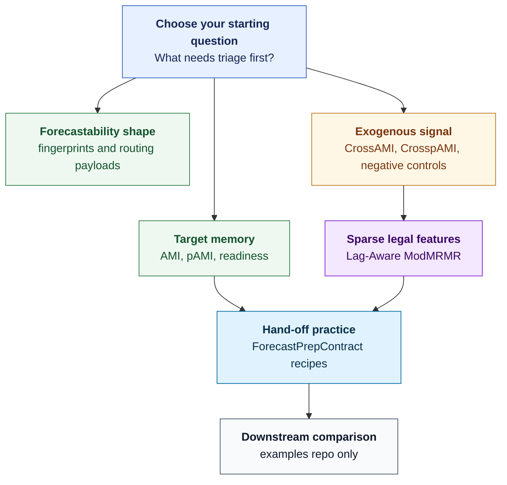

| Goal | Notebook path in `forecastability-examples` |
|---|---|
| First target-memory walkthrough | [`walkthroughs/00_air_passengers_showcase.ipynb`](https://github.com/AdamKrysztopa/forecastability-examples/blob/main/walkthroughs/00_air_passengers_showcase.ipynb) |
| Forecastability fingerprint showcase | [`walkthroughs/02_forecastability_fingerprint_showcase.ipynb`](https://github.com/AdamKrysztopa/forecastability-examples/blob/main/walkthroughs/02_forecastability_fingerprint_showcase.ipynb) |
| Lagged-exogenous triage | [`walkthroughs/03_lagged_exogenous_triage_showcase.ipynb`](https://github.com/AdamKrysztopa/forecastability-examples/blob/main/walkthroughs/03_lagged_exogenous_triage_showcase.ipynb) |
| End-to-end triage | [`walkthroughs/03_triage_end_to_end.ipynb`](https://github.com/AdamKrysztopa/forecastability-examples/blob/main/walkthroughs/03_triage_end_to_end.ipynb) |
| ForecastPrep hand-off to models | [`walkthroughs/05_forecast_prep_to_models.ipynb`](https://github.com/AdamKrysztopa/forecastability-examples/blob/main/walkthroughs/05_forecast_prep_to_models.ipynb) |
| Triage-driven vs naive M4 sanity check | [`walkthroughs/06_triage_driven_vs_naive_on_m4.ipynb`](https://github.com/AdamKrysztopa/forecastability-examples/blob/main/walkthroughs/06_triage_driven_vs_naive_on_m4.ipynb) |
| CausalRivers lag and feature selection | [`walkthroughs/07_causal_rivers_lag_and_feature_selection.ipynb`](https://github.com/AdamKrysztopa/forecastability-examples/blob/main/walkthroughs/07_causal_rivers_lag_and_feature_selection.ipynb) |
| Lag-Aware ModMRMR showcase | [`walkthroughs/09_lag_aware_mod_mrmr_showcase.ipynb`](https://github.com/AdamKrysztopa/forecastability-examples/blob/main/walkthroughs/09_lag_aware_mod_mrmr_showcase.ipynb) |
| Catt-scored Lag-Aware ModMRMR | [`walkthroughs/10_lag_aware_catt_scored_mod_mrmr.ipynb`](https://github.com/AdamKrysztopa/forecastability-examples/blob/main/walkthroughs/10_lag_aware_catt_scored_mod_mrmr.ipynb) |
| Contract serialization roundtrip | [`recipes/contract_roundtrip.ipynb`](https://github.com/AdamKrysztopa/forecastability-examples/blob/main/recipes/contract_roundtrip.ipynb) |
| Lag-Aware ModMRMR to ForecastPrepContract | [`recipes/lag_aware_mod_mrmr_to_forecast_prep_contract.ipynb`](https://github.com/AdamKrysztopa/forecastability-examples/blob/main/recipes/lag_aware_mod_mrmr_to_forecast_prep_contract.ipynb) |

Start here: If you open only one notebook, open [`walkthroughs/07_causal_rivers_lag_and_feature_selection.ipynb`](https://github.com/AdamKrysztopa/forecastability-examples/blob/main/walkthroughs/07_causal_rivers_lag_and_feature_selection.ipynb). It combines graph-positive drivers, negative controls, lag screening, sparse selection, and downstream hand-off pressure.

## Run It Locally

Install the package from the published package, or use the GitHub fallback if package resolution is not available:

```bash
pip install dependence-forecastability
pip install git+https://github.com/AdamKrysztopa/dependence-forecastability.git
```

The package name is `dependence-forecastability`; the public import path is `forecastability`.

To run the notebook workflow, clone the examples repository:

```bash
git clone https://github.com/AdamKrysztopa/forecastability-examples.git
cd forecastability-examples
uv sync --all-extras
uv run jupyter lab
```

Framework extras live in the examples project, not in the core runtime dependencies. The core package keeps deterministic triage separate from downstream model libraries.

The core `forecastability` package has no import-time or runtime dependencies on Darts, MLForecast, StatsForecast, Nixtla, or similar forecasting libraries; any such extras and comparisons are optional and live in the separate `forecastability-examples` repository. That split is intentional: the core package produces deterministic evidence; the examples repository shows how to translate that evidence into framework-specific modeling recipes.

Minimal target triage:

```python
from forecastability import TriageRequest, generate_ar1, run_triage


def main() -> None:
    series = generate_ar1(n_samples=300, phi=0.8, random_state=42)
    result = run_triage(
        TriageRequest(
            series=series,
            goal="univariate",
            max_lag=20,
            n_surrogates=99,
            random_state=42,
        )
    )

    summary = {
        "blocked": result.blocked,
        "readiness_status": result.readiness.status.value,
        "forecastability_class": (
            None
            if result.interpretation is None
            else result.interpretation.forecastability_class
        ),
        "primary_lags": (
            []
            if result.interpretation is None
            else list(result.interpretation.primary_lags)
        ),
    }
    print(summary)


if __name__ == "__main__":
    main()
```

Build and export a forecast-prep contract. Calendar features require a datetime index aligned to the training series:

```python
import pandas as pd

from forecastability import (
    TriageRequest,
    build_forecast_prep_contract,
    forecast_prep_contract_to_lag_table,
    forecast_prep_contract_to_markdown,
    generate_ar1,
    run_triage,
)


def main() -> None:
    series = generate_ar1(n_samples=300, phi=0.8, random_state=42)
    result = run_triage(
        TriageRequest(
            series=series,
            goal="univariate",
            max_lag=20,
            n_surrogates=99,
            random_state=42,
        )
    )

    datetime_index = pd.date_range("2000-01-01", periods=len(series), freq="MS")
    contract = build_forecast_prep_contract(
        result,
        horizon=12,
        target_frequency="MS",
        add_calendar_features=True,
        datetime_index=datetime_index,
    )

    print(contract.model_dump_json(indent=2))
    print(forecast_prep_contract_to_markdown(contract))

    lag_rows = forecast_prep_contract_to_lag_table(contract)
    for row in lag_rows:
        print(row)


if __name__ == "__main__":
    main()
```

`build_forecast_prep_contract()` returns a `ForecastPrepContract` directly in the current public API.

## CausalRivers Before Model Search

If this repository needs a practical proof point, CausalRivers is it.

River forecasting is exactly where blind model search gets expensive fast. Nearby gauges look useful. Upstream stations look useful. Seasonal flow, shared weather systems, regime shifts, and catchment structure can all make a driver look predictive before it is actually safe or incremental. A leaderboard can hide that mess. Triage makes it visible before the first model is fitted.

The CausalRivers walkthrough starts with the question practitioners usually skip: which station drivers deserve to reach model search at all? The workflow screens graph-positive drivers and negative controls across lags, separates raw pairwise dependence from signal that remains after target history is accounted for, applies forecast-legality constraints, and then hands off a sparse feature surface.

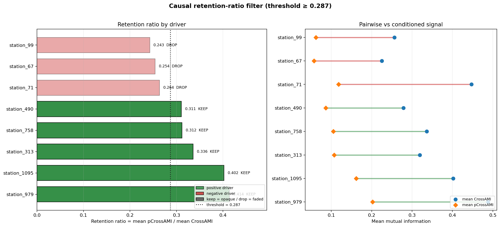

The retention view is the first punchline. A driver that keeps most of its pairwise signal after conditioning pressure is a better candidate for downstream use; a driver that collapses is probably borrowing strength from target memory, common forcing, seasonality, or shared regime. That distinction is the difference between "this feature lights up in a heatmap" and "this feature still deserves a seat at the table."

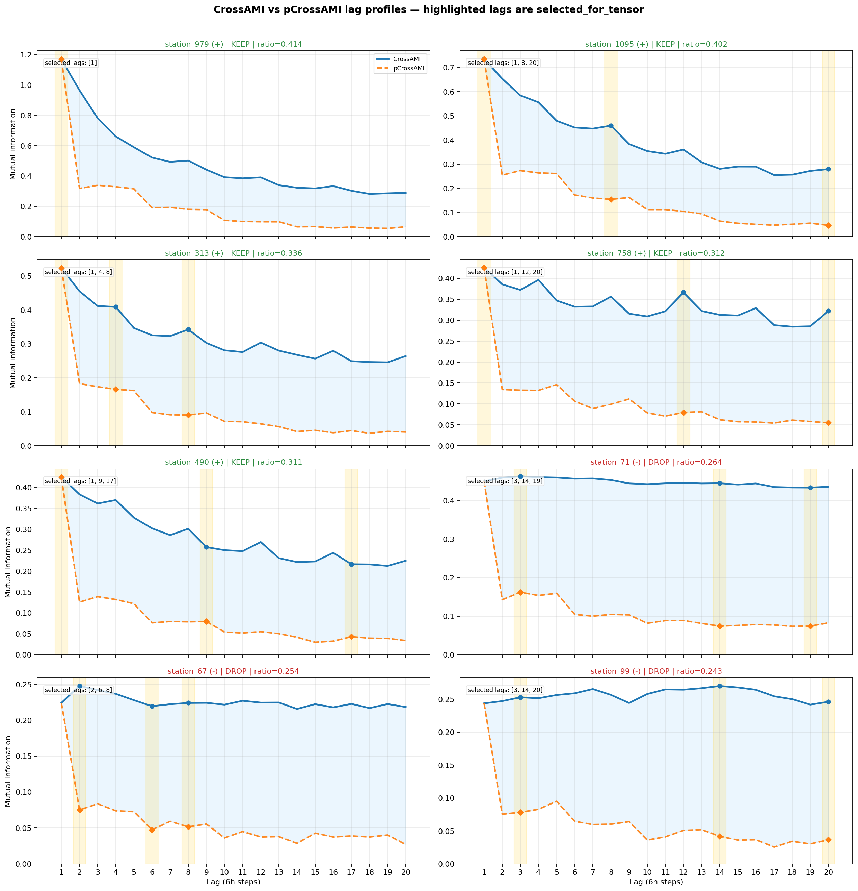

The lag decision view turns that screen into something a modeling pipeline can use. CrossAMI says where the raw relationship appears. CrosspAMI asks whether the relationship survives the target-history adjustment. Forecast-legality rules remove lags that would not be available at prediction time. What remains is not a fitted model. It is the evidence-backed short list you want before fitting anything.

Negative controls are the pressure test. If a weak or unrelated driver survives only on pairwise signal, treat it as a warning flare: common forcing, seasonality, or a shared regime may be making unrelated stations move together. It is not a green light. It is the exact kind of false confidence this workflow is designed to catch.

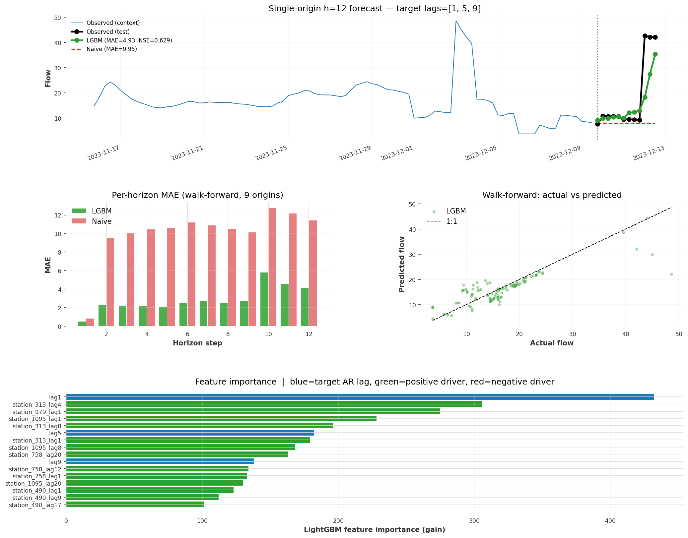

The downstream MLForecast LightGBM deep dive shows where the boundary sits. The core `forecastability` package produces deterministic pre-model triage and a hand-off surface: selected lags, retained drivers, cautions, and configuration evidence. The MLForecast fitting code lives in `forecastability-examples` by design, because this repository is not a model-search catalog and not a training toolkit. It gives model search a cleaner starting line.

## Forecastability Triage Before Model Search

Forecastability triage is a gate in front of model search, not a decorative report after tuning.

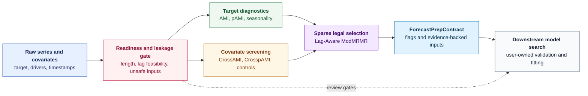

Warnings and leakage or low-confidence cautions gate downstream decisions. When a contract is emitted, those cautions travel as flags and notes, not as permission to train.

## Target Memory: AMI and pAMI

AMI, or auto-mutual information, estimates how much information the target at time `t - h` carries about the target at time `t`. It is useful because it does not assume a linear relationship. A lag can matter even when autocorrelation under-sells it.

pAMI, or partial AMI in this project, is the next question: after closer lags have been linearly residualized, does this lag still add information? If AMI says "there is memory here," pAMI asks whether the lag is mostly direct, mostly redundant with nearer lags, or mostly a clue about a broader structure.

That caveat is important. The pAMI implementation is a linear-residual approximation. It is useful for screening and interpretation. It is not exact conditional mutual information. It is not causal proof.

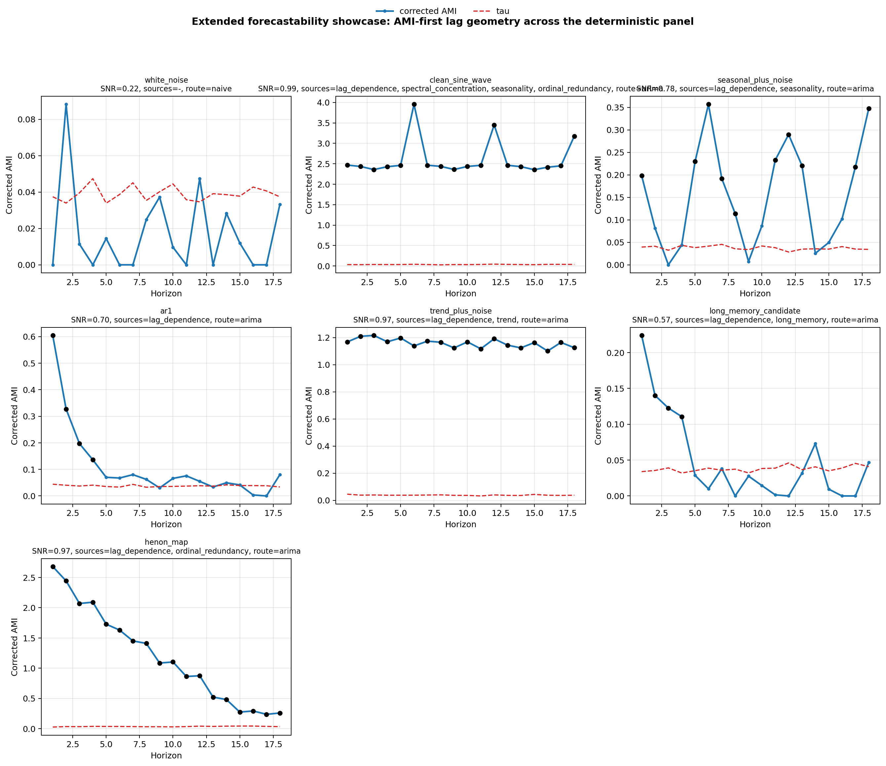

Extended AMI profiles compare target-memory shapes across archetypes, showing why raw lag strength and corrected lag novelty should be read together.

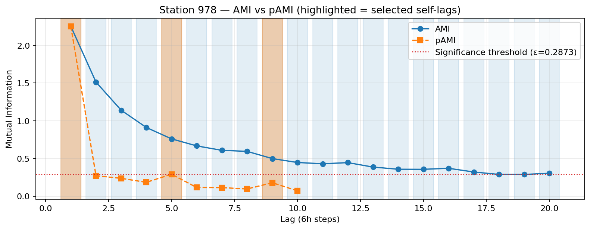

This station-level AMI/pAMI profile makes the target-memory question visible before any model family is chosen.

The `directness_ratio` is useful only when read conservatively. The implementation guards against division by zero; when raw AMI mass is tiny, the ratio can become unstable, so out-of-range values are caution flags rather than routing evidence. Interpretation and reporting treat anomalous `directness_ratio > 1.0` as a numerical anomaly to skip or flag. Downstream fingerprint and routing builders require a finite ratio within [0, 1]. It is not proof of volatility and not routing evidence.

## From Curves to Fingerprints

Single curves are helpful; fingerprints make them comparable. The forecastability fingerprint compresses target-memory shape into a compact packet: information mass, horizon, directness, signal-to-noise, structural labels, and advisory routing metadata.

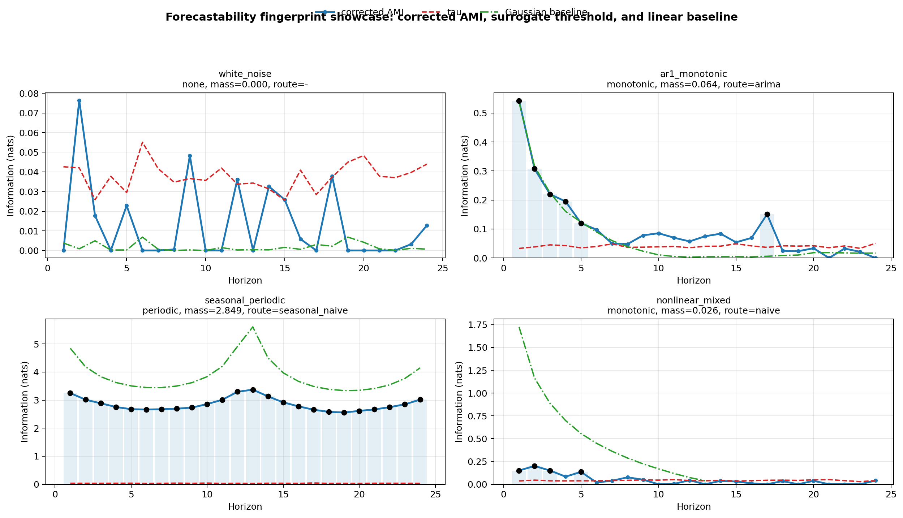

Fingerprint profiles show how archetypal time-series structures separate before model fitting.

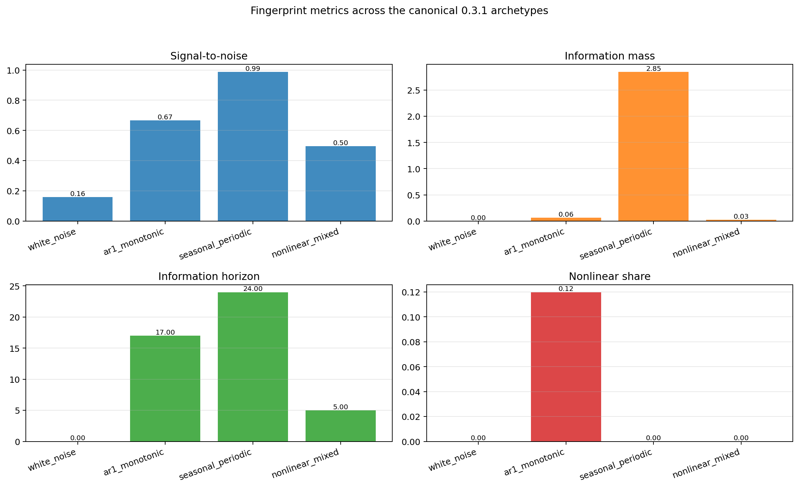

Fingerprint metrics turn AMI and pAMI geometry into compact, comparable diagnostic fields.

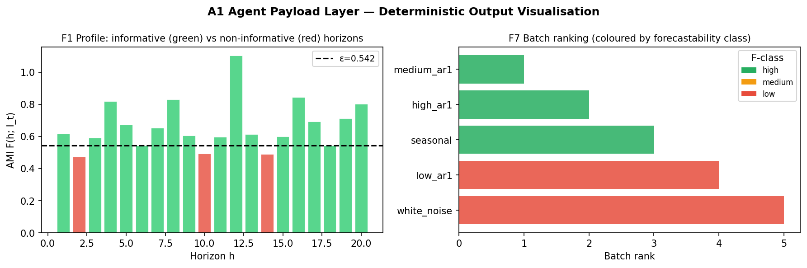

The agent payload is a deterministic evidence packet, not a license for free-form model claims.

The AMI/KSG-style foundation and the univariate information-geometry intuition connect to Dr. Catt's recent arXiv work. The project-specific implementation and extensions in `dependence-forecastability` are mine: pAMI-style residual diagnostics, covariate screening, lagged-exogenous triage, sparse forecast-safe selection, routing validation, and the ForecastPrepContract hand-off.

When `nonlinear_mixed`-style profiles or low-information-mass cases sit near thresholds, treat the fingerprint as a descriptive warning packet. Low mass can make ratios and routing labels fragile, so the right next step is usually simpler baselines, shorter horizons, more data, or explicit holdout validation.

## Covariate Risk: CrossAMI and CrosspAMI

Covariates are where forecasting projects often get into trouble. A driver can look strong because it shares seasonality with the target, because both respond to the same external forcing, because it is effectively a proxy for the target's own history, or because its future value is not actually known at prediction time.

CrossAMI is the first screen: does a driver lag have pairwise information about the target? CrosspAMI is the stricter screen: does that driver lag retain incremental information after target history is accounted for?

Older examples may use `pCrossAMI` wording. In the current naming, the diagnostic surfaces are `cross_ami` and `cross_pami`, usually read as CrossAMI and CrosspAMI.

The broader exogenous API also includes optional methods such as transfer entropy, GCMI, and PCMCI-style screens, but the workflow here focuses on the AMI-family diagnostics because they are the clearest bridge from target memory to covariate retention.

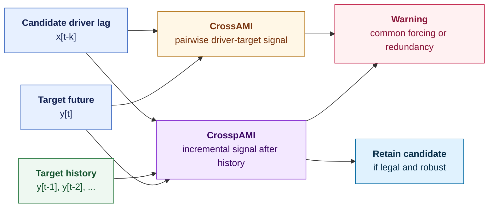

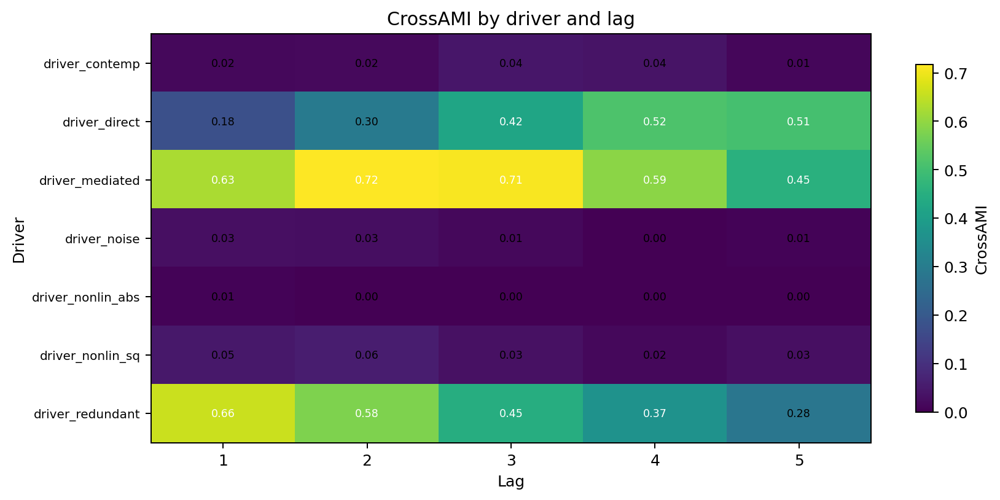

CrossAMI highlights pairwise driver-target dependence, including signals that may later prove redundant or unsafe.

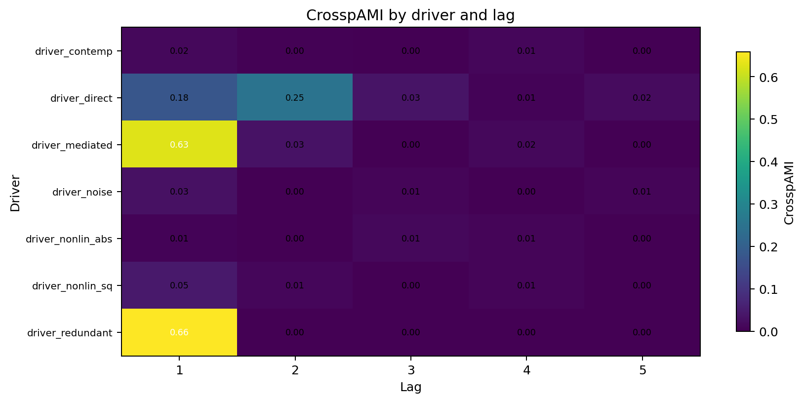

CrosspAMI asks which driver lags retain incremental signal after target-history structure is considered.

High CrossAMI with low CrosspAMI is often the most valuable warning in the packet. It says, "this driver is associated with the target, but it may not add much beyond what the target already tells you."

## CausalRivers as a Practical Stress Test

CausalRivers is useful because it looks like the messy middle of real forecasting work. There are graph-positive drivers that should be detectable as associated under the benchmark assumptions, nearby or upstream stations that may carry lagged signal, and unrelated negative controls that should not survive the full screening path. This is association evidence, not causal proof.

The workflow does not claim causal proof. It says:

- graph positives should show stronger and more coherent lag evidence than controls;
- negative controls are stress tests and should be rejected or dropped when they fail CrosspAMI, legality, or sparse-selection checks;
- nonzero pairwise dependence in a negative control is a warning about common forcing, shared seasonality, or sampling artifacts;
- downstream forecast comparisons are sanity checks, not proof that the screening detected causality.

This is why the earlier CausalRivers figures matter. They show the pre-modeling evidence changing what is allowed into the model search space.

## Sparse Legal Selection with Lag-Aware ModMRMR

After screening, you still need a sparse feature set. Adding every surviving covariate lag is rarely wise. Some lags duplicate each other. Some are dominated by already selected features. Some are simply illegal because they would not be available at forecast time.

Lag-Aware ModMRMR is the project-specific selector for that step.

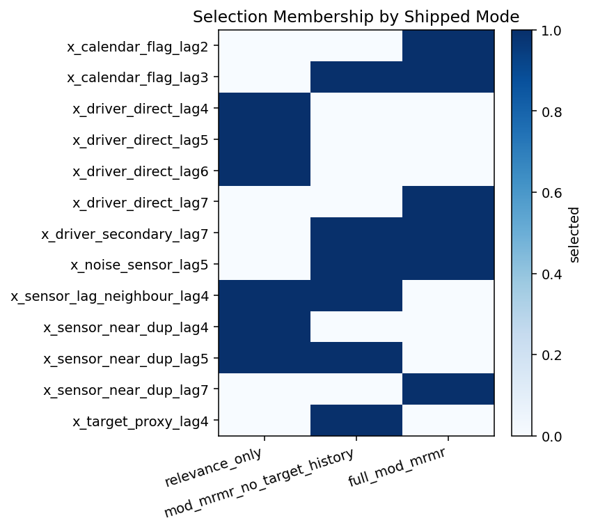

Selection-mode heatmaps show how lag-aware relevance, redundancy, and legality interact before hand-off.

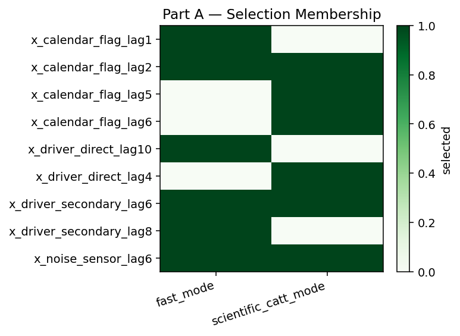

Catt-scored mode membership illustrates one scorer configuration for sparse lag selection in the examples project.

This is not a claim that mRMR itself is new, and it is not causal discovery. The contribution is practical and forecast-specific: a forecast-legality-aware selector, nearest-selected redundancy suppression, an optional target-history novelty mode, typed selected/rejected/blocked rows, and direct hand-off into the ForecastPrepContract.

Forecast legality is the quiet but essential part.

## ForecastPrepContract as the Hand-Off Boundary

The product surface is not a fitted model. It is a contract.

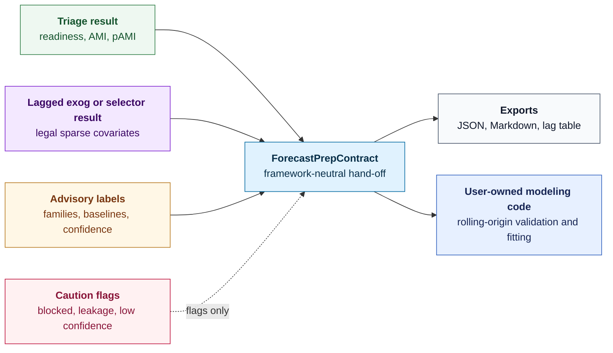

The contract is metadata only: no serialized models, no framework-specific configuration objects, and no functions that auto-configure or call downstream forecasting libraries.

The contract can carry:

- target lags;
- seasonal lag hints;
- past covariates;
- known-future covariates;
- calendar features;
- rejected covariates;
- model-family recommendations as advisory routing labels;
- baseline families as advisory routing labels;
- confidence labels;
- caution flags;
- downstream notes;
- other optional schema fields documented in the reference contract page, where supported.

See [docs/public_api.md](https://github.com/AdamKrysztopa/dependence-forecastability/blob/main/docs/public_api.md) and [docs/reference/forecast_prep_contract.md](https://github.com/AdamKrysztopa/dependence-forecastability/blob/main/docs/reference/forecast_prep_contract.md) for the supported surface and full schema.

The contract is evidence-backed configuration guidance. It does not import downstream forecasting libraries, fit models, choose a winner, or replace validation.

## How to Read the Triage Packet

| Output | What it means | Practical action |
|---|---|---|
| `blocked=True` | Readiness or legality failed. | Do not start model search until the block is understood. |
| Weak information mass | The target has limited measurable memory under the current lag range, estimator settings, and sample window. | Prefer simple baselines, shorter horizons, or more data before complex models. |
| Short information horizon | Signal decays quickly with lag. | Align forecast horizon to the usable memory window. |
| Seasonal lag hints | Specific seasonal offsets look informative. | Consider seasonal lags or seasonal baseline families. |
| High CrossAMI but low CrosspAMI | A driver is associated with the target but may add little beyond target history. | Treat as redundancy or common-forcing warning. |
| Selected legal covariate lags | A sparse lagged driver set survived screening and legality. | Use only those lags as candidate past covariates. |
| Blocked lag rows | A candidate lag would be unavailable or unsafe at prediction time. | Exclude it, even if pairwise signal is high. |
| Caution flags | The packet detected low confidence, leakage risk, blocked readiness, or numeric instability. | Make the flag part of validation and review. |
| `ForecastPrepContract` | Typed, framework-neutral configuration guidance. | Translate into downstream code and validate with rolling-origin splits. |

## Common Mistakes and Triage Responses

| Common mistake | Triage response |
|---|---|
| Add every plausible covariate | Screen drivers with CrossAMI/CrosspAMI before selection. |
| Trust contemporaneous correlation | Check lag legality for the forecast horizon. |
| Tune long horizons blindly | Inspect information horizon first. |
| Promote redundant sensors | Penalize nearest-selected redundancy with Lag-Aware ModMRMR. |
| Treat routing as a benchmark result | Use routing as advisory guidance before rolling-origin validation. |
| Hide leakage decisions in feature code | Preserve blocked/rejected rows in the contract trail. |

## Routing as Guidance, Not Proof

The examples project includes a small M4 proof-of-concept comparing triage-driven choices against naive alternatives on a cached or downloaded monthly subset. It is useful because it tests whether the packet can change practical decisions without claiming a final benchmark result.

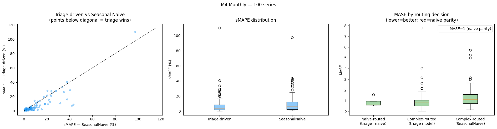

The M4 proof-of-concept is a small routing sanity check, not a final benchmark claim. Reproduce it from the M4 monthly walkthrough in `forecastability-examples`.

Read this conservatively. The subset is not a full benchmark. Outlier diagnostics may be needed. Model-family recommendations and baseline families are advisory routing labels, not automated training or fitting actions. Real deployment still needs rolling-origin validation, residual checks, and domain review.

## What This Tool Deliberately Does Not Do

- It is not AutoML.
- It is not causal proof.
- It is not production approval.
- It is not a forecasting library.
- It is not a replacement for Darts, MLForecast, StatsForecast, Nixtla, Prophet, statsmodels, sklearn, or custom model code.
- It is not a replacement for holdout validation.
- It is not a replacement for domain review.

It is also not a framework war. The core preserves deterministic evidence. The examples translate that evidence into downstream recipes.

## Future Work

Volatility structure is a future direction, not implemented routing. Current summaries can flag ARCH-like or volatility-suspected cases as heuristic numeric warnings, especially around anomalous `directness_ratio > 1.0`. They do not prove volatility, fit GARCH-family models, or route to volatility-specific model families.

A possible next step is to fingerprint volatility proxies such as absolute residuals, squared residuals, or log-squared residuals after removing basic mean/seasonal structure. That would still be triage, not a GARCH fitting engine.

The same is true for benchmark coverage. The right long-term test is not one perfect demo. It is broader panels, clearer negative controls, richer examples, and repeated evidence that triage changes what downstream validation has to consider.

## Start With Evidence

Model comparison should not be the first serious question in a forecasting project. The first question is what information is available, where it comes from, whether it survives conditioning on the target's own history, and whether the model is legally allowed to use it at prediction time.

Model search should start with evidence, not appetite.

For a practical first pass, start with the [CausalRivers notebook](https://github.com/AdamKrysztopa/forecastability-examples/blob/main/walkthroughs/07_causal_rivers_lag_and_feature_selection.ipynb) in the examples repository. It puts the whole workflow under pressure: graph-positive drivers, negative controls, lag screening, sparse selection, and a downstream comparison that remains outside the core package.

Repositories:

- [dependence-forecastability](https://github.com/AdamKrysztopa/dependence-forecastability)
- [forecastability-examples](https://github.com/AdamKrysztopa/forecastability-examples)

## References and Acknowledgements

Dr. Peter Catt deserves generous and precise credit for the AMI/KSG-style foundation and the univariate information-geometry intuition that motivated this work. See Dr. Catt's recent arXiv work, including arXiv:2601.10006 and arXiv:2603.27074.

The project-specific implementation and extensions in `dependence-forecastability` are mine: pAMI-style residual diagnostics, CrossAMI/CrosspAMI screening, lagged-exogenous triage, Lag-Aware ModMRMR, routing validation, and the ForecastPrepContract hand-off surface.

Any mistakes in the package, interpretation, examples, or extensions are mine.

## Reproducibility Note

The article figures are prepared from the walkthrough notebooks in `forecastability-examples`. Some examples, especially CausalRivers and M4, require downloaded or cached data and optional example dependencies. The core package remains framework-agnostic; downstream fitting examples live in the examples repository.
