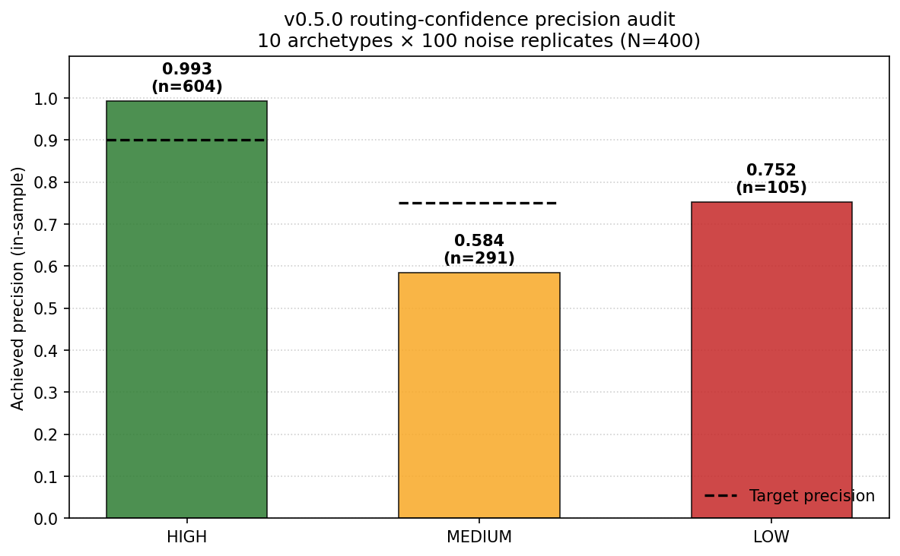
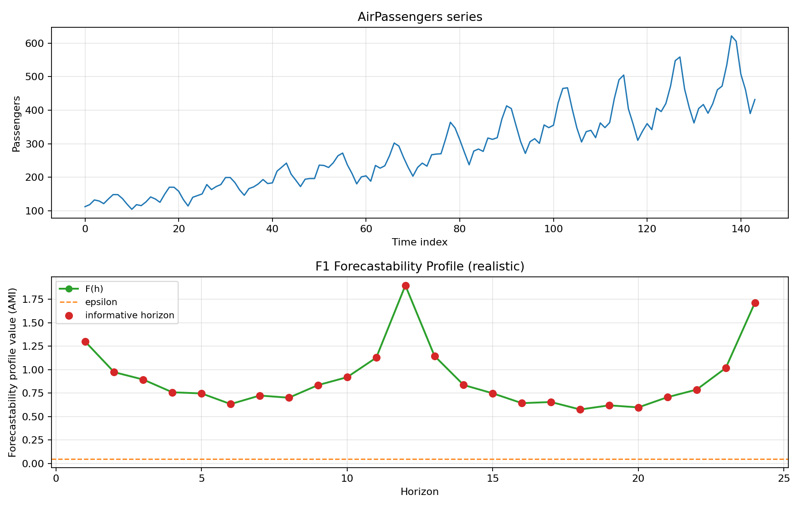
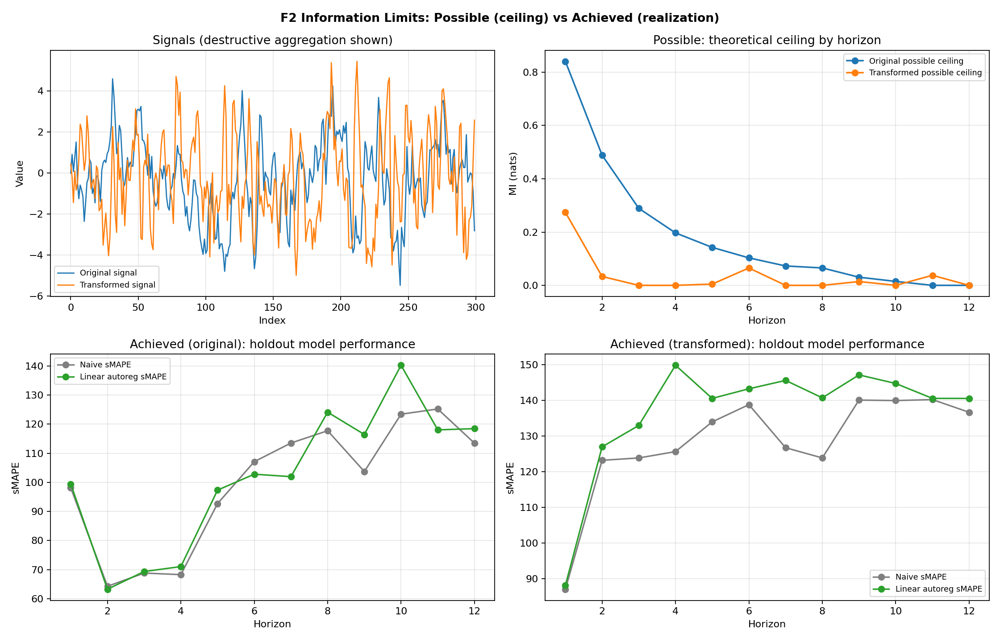
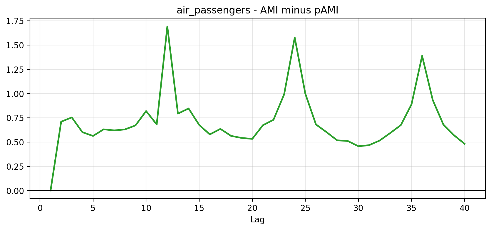
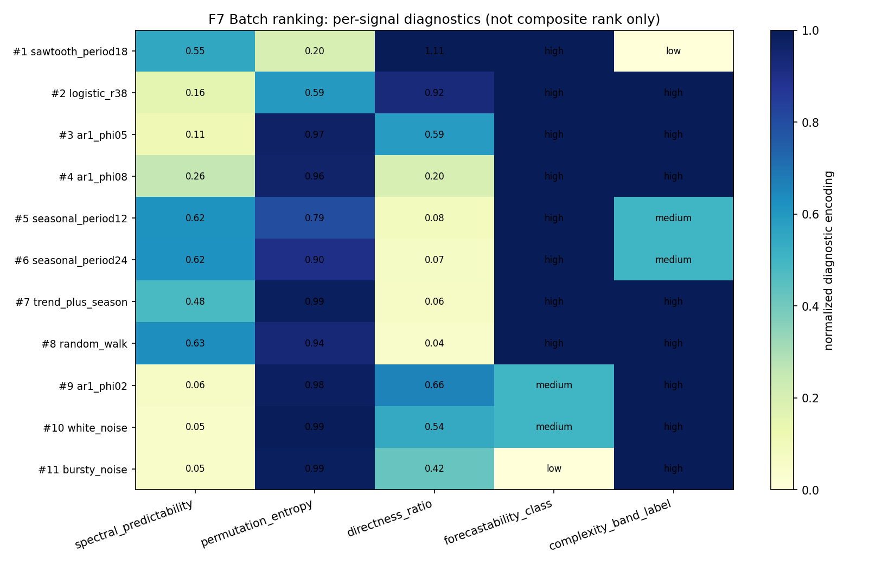
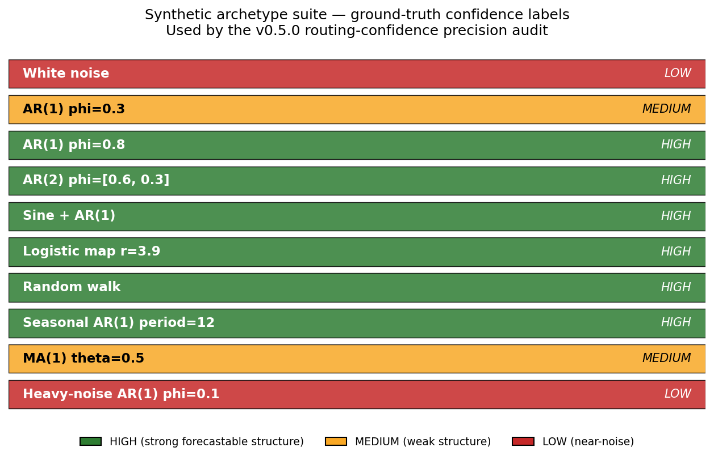
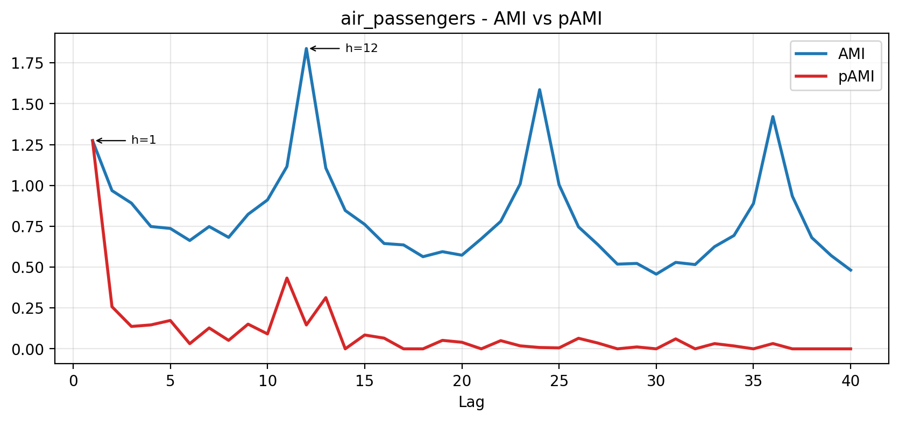

# What Changed in v0.5.0 — Maturing the Forecastability Triage Toolkit

*A user-impact tour of `dependence-forecastability` v0.5.0: honest defaults,
family-wise corrected significance, and a real precision number behind every
routing label.*

---

Good tools do not stay still. `dependence-forecastability` v0.5.0 is a
deliberate hardening release — driven by a deep audit of the toolkit's
statistical foundations, performance characteristics, and output honesty. The
result is a triage workflow that is more conservative where it should be,
more transparent about what it does and does not guarantee, and now backed by
a precision measurement that puts real numbers behind the routing labels
practitioners rely on.

This article walks through what changed for users, what stayed the same, and
what the new precision audit tells you about when to trust each confidence
label.

---

## 1. What changed for you

### 1a. The default AMI estimator now matches the documentation

The biggest user-visible change is a default switch, not a bug fix.

*Figure 1: AMI profile on AirPassengers under v0.5.0 defaults (KSG-II, Romano-Wolf corrected bands).*

Before v0.5.0, `compute_ami(series, max_lag=20)` routed through scikit-learn's
`mutual_info_regression`, which uses a single-`k` KSG-I estimator. The
docstrings, README, and original Medium article all described the toolkit as
using a KSG-II estimator with a median over `k ∈ {3, 5, 8}` — but only one
internal service, `compute_ami_information_geometry`, actually ran that
estimator. Every other public AMI / pAMI surface used KSG-I via sklearn.

v0.5.0 ships a single unified `KSG2CurveKernel` (Chebyshev metric, one
cKDTree per joint slice, median over `k ∈ {3, 5, 8}`) and routes every
public AMI / pAMI surface through it by default. Both estimators are
mathematically valid; the change is that the default now matches what the
docs always claimed.

Numerics will shift by a few percent on typical inputs. On the
anisotropic-marginal regression fixture committed at
`docs/fixtures/v0_5_0_regression/anisotropic_ar1_fixture.json` (σ_x=1,
σ_y=10, ρ=0.5, N=500, k=5), the magnitudes are:

- True bivariate-Gaussian MI: **0.144 nats**
- KSG-II (v0.5.0 default): **0.098 nats**
- KSG-I (v0.4.3 default): **0.154 nats**

That's where KSG-II's invariance to per-axis rescaling earns its keep:
when marginals have wildly different scales, KSG-I's single-radius
neighbour search inherits the scale of whichever axis dominates. KSG-II
counts marginal neighbours per-axis and is invariant under monotone
rescaling.

If you need bit-identical reproduction of v0.4.3 numerics for an existing
analysis, pass `estimator='ksg1_sklearn'` to any AMI / pAMI surface and you
will get the old values back exactly.

### 1b. Surrogate tests are more conservative by default

Two things changed at the surrogate-significance layer.

*Figure 2: Realized AMI versus Gaussian information limit at each horizon. Surrogate bands shown for context.*

First, the default number of phase-randomised surrogates rose from **99**
to **999**. That raises p-value resolution from 0.01 to 0.001. The
validation floor (the minimum accepted value) is still 99, so calls that
pass `n_surrogates=99` explicitly are unaffected and still accepted without
warning. The batched FFT path shipped in this release means 10× more
surrogates cost roughly 3–4× wall-clock, not 10×.

Second, the surrogate band now applies **Romano-Wolf step-down family-wise
correction** across lags by default. The previous per-lag uncorrected
behaviour is preserved behind `correction='none'`. Romano-Wolf is a
resampling-based step-down procedure; the test
`tests/test_significance_correction.py::test_romano_wolf_controls_fwer`
confirms it controls FWER within Monte-Carlo tolerance at α = 0.05 with
5,000 null replicates. Two alternative corrections are also available:
Benjamini-Hochberg (`'bh'`, FDR control assuming positive regression
dependence) and Benjamini-Yekutieli (`'by'`, FDR control under arbitrary
dependence — appropriate for autocorrelated lag-wise tests).

The fingerprint, routing, and complexity-band consumers see only the
corrected mask; nothing about their call sites changed.

### 1c. Transfer entropy is split into two honest names

*Figure 3: Directional TE on a deterministic lag-2 coupled pair where X drives Y. The split between `compute_transfer_entropy_ksg` (Frenzel-Pompe KSG-CMI) and `compute_predictive_information_gain` (residual MI) makes the directional asymmetry observable.*

The umbrella `compute_transfer_entropy` is **removed**. Importing it now
raises an `ImportError` with the migration recipe. Two replacement
surfaces ship under names that reflect what they actually compute:

- `compute_transfer_entropy_ksg` — true Schreiber transfer entropy via the
  Frenzel-Pompe KSG conditional-mutual-information estimator
  (`src/forecastability/diagnostics/cmi_ksg.py`). It conditions on the
  target's own history and measures the additional predictive information
  the source provides beyond that.
- `compute_predictive_information_gain` — the v0.4.3 residual-MI surface,
  renamed. It computes MI between residualised future and residualised
  lagged source after regressing both on the target's history. This is
  useful and well-defined, but it is **not** Schreiber TE: PIG is
  asymmetric in (X, Y) by construction (the asymmetry comes from which
  series is residualized on which history) rather than from a directional
  information-flow guarantee.

A related fix in `compute_transfer_entropy_ksg`: the Frenzel-Pompe
sample-size cutoff was corrected to `N_eff < k^(d_total)` where `d_total`
already includes the X_t and X_{t-lag} axes (commit 6bdd532). The
previous `k^(d_total+2)` formula was double-counting those axes.

`compute_conditional_mutual_information_ksg` is now a documented public
surface in its own right. CMI has legitimate uses outside transfer entropy
— mediation analysis, partial dependence, conditional independence tests
— and v0.5.0 makes it directly importable.

### 1d. pAMI is now explicit about being a linear approximation

*Figure 4: AMI minus pAMI on AirPassengers. The positive differential is the redundancy that pAMI's linear-residual approximation removes.*

`compute_pami_linear_residual` returns a linear-residual approximation to
conditional mutual information. It equals the true partial MI only under
joint Gaussianity; for non-Gaussian processes it measures the MI between
linear residuals, not the conditional MI itself. The docstring now states
this directly.

A related change: when the input series has low cardinality
(`unique(X) / N < 0.1`, i.e. genuinely discrete or ordinal data), the
function now emits a `UserWarning`. The warning is informational — the
function does not silently reroute to a discrete-MI estimator, because the
linear-residual model is already a Gaussian-assumption approximation and
rerouting would not reduce the underlying misspecification.

### 1e. Output labels are more honest about what they guarantee

A documentation pass tightened the language across public docstrings:

*Figure 5: AMI information geometry across four archetypes. The `informative_mass_fraction` field (renamed from `signal_to_noise` in v0.5.0) is the coverage statistic shown per panel.*

- **`signal_to_noise` is renamed to `informative_mass_fraction`** on
  `AmiInformationGeometry` and `ForecastabilityFingerprint`. The new name
  reflects what the metric actually computes: the fraction of lags whose
  corrected AMI exceeds the surrogate threshold. The caution flag
  `"low_signal_to_noise"` is now `"low_informative_mass_fraction"`.
  Accessing the old attribute raises `AttributeError` with a migration
  pointer.
- "Deterministic" no longer appears in places where the intended meaning
  was "principled" or "heuristic". It is reserved for "reproducible given
  a seed".
- The geometry-engine threshold heuristics (`peak_prominence=0.10`,
  `snr_floor=0.05`, `shift_correlation_cutoff=0.60`) are now documented as
  empirical choices for the 10-archetype synthetic suite, not values
  derived from a held-out precision target.

These are documentation changes; no numeric output changed because of them.

### 1f. The public surface is curated

`forecastability.api` is now the curated public surface — roughly 25 names
that the maintainer commits to keeping stable. The top-level
`forecastability` namespace re-exports from `api` and additionally exposes
a `_legacy/` module that emits a `DeprecationWarning` on access for any
notebook-compatibility name that did not make the curated list. Deep
imports of internal paths (`forecastability.triage.models`,
`forecastability.utils.aggregation`, etc.) may break; the migration guide
lists the 18 modules that moved to the new physical
`src/forecastability/domain/` package.

The deprecated PydanticAI shim at `adapters/pydantic_ai_agent.py` is
removed; agent adapters now live under `adapters/agents/{payloads,runtime}/`
with frozen Pydantic return types on every tool boundary.

---

## 2. Performance — quiet but real

The performance work in v0.5.0 is transparent: no API changes were needed
to pick up the wins.

*Figure 6: Batch forecastability ranking across a synthetic panel. v0.5.0's vectorized phase-surrogate path and request-scoped caching make batch runs faster without changing the per-series numerics (where you pin the estimator).*

- **Batched FFT phase-randomization.** The whole surrogate batch is now
  generated in a single `np.fft.irfft` call over an `(n_surrogates, n_freq)`
  phase matrix, preserving the Hermitian symmetry of the original spectrum
  (DC and Nyquist bins keep phase 0). This is what makes the new
  `n_surrogates=999` default affordable.
- **Incremental QR partial-curve residualization.** The pAMI partial-curve
  path no longer rebuilds a full lag-design matrix per horizon; a thin QR
  factorisation is maintained incrementally.
- **Request-scoped triage cache.** Repeated calls to scaling, Welch PSD,
  and the raw AMI profile within a single `run_triage` invocation hit a
  per-request memoization layer instead of recomputing.
- **Welch nperseg.** The spectral-forecastability service now picks
  `nperseg = max(64, N // 8)` instead of `nperseg = N`, fixing an edge
  case on short series where the window collapsed to the full signal.

Three PBE-F* performance budget tests (`PBE-F28/29/30`) lock surrogate-band,
curve-kernel, and ModMRMR wall-clock budgets in CI so future regressions
fail the build rather than landing silently.

---

## 3. The precision audit — what the numbers say

The centrepiece of v0.5.0 is the routing-confidence precision audit.
After fixing the estimators and the correction, we measured what the
triage recommender actually delivers across a synthetic suite where the
ground-truth confidence label is knowable from the data-generating process.

### What we measured

Ten archetypes, each instantiated with 100 independent noise replicates of
length N=400, run through the full v0.5.0 triage pipeline. Each archetype
carries a ground-truth confidence label derived from domain knowledge: how
much exploitable temporal structure the DGP actually has.

Precision is defined per label as the fraction of runs assigned that label
whose ground-truth label matches. It does not measure recall (it does not
ask whether all HIGH-truth runs were caught), only the trustworthiness of
each emitted label.

### What the numbers say

The audit JSON at `docs/calibration/v0_5_0_routing_confidence_audit.json`
records 1,000 runs total: 604 received the HIGH label, 291 received MEDIUM,
and 105 received LOW. The achieved precision per label is plotted in the
opening figure of this article.

- **HIGH labels are reliable.** Achieved precision is 0.993 against a
  target of 0.90, across 604 runs. When the toolkit assigns HIGH confidence
  on a series of this size from a comparable DGP family, it is right
  better than 99% of the time.
- **MEDIUM labels require inspection.** Achieved precision is 0.584
  against a target of 0.75, across 291 runs. Roughly four in ten MEDIUM
  labels are mislabelled relative to the ground truth. MEDIUM is a real
  signal — it is not noise — but it should prompt a look at the underlying
  profile rather than an automated routing decision.
- **LOW labels achieve 0.752 precision** across 105 runs, with no target
  set: LOW is a recall-driven label (catch the unforecastable cases) rather
  than a precision-driven one.

### Why MEDIUM under-performs — honestly

The current thresholds are **hand-picked heuristics**, not values fitted
against a precision target. The v0.5.0 audit script measures their
achieved precision but does not adjust them. A full threshold-sweep
calibration (where each threshold is set as the smallest value achieving
its precision target) is on the v0.5.1 roadmap; it requires storing raw
AMI peaks per run so the sweep can run without rebuilding the triage
pipeline.

For now, this is what we can honestly say: HIGH is calibrated against a
target and meets it; MEDIUM and LOW are audited but not fitted, and the
audit JSON exposes the gap.

### Limitations to disclose

1. **In-sample measurement.** All 1,000 runs are used for both
   measurement and reporting; no held-out set. Generalisation to
   real-world series is not guaranteed.
2. **Ten archetypes is not exhaustive.** The suite covers common DGP
   families (AR, MA, sinusoidal, chaotic map, random walk, seasonal AR)
   but misses heavy-tailed noise, structural breaks, and multivariate
   interactions.
3. **N = 400 throughout.** Precision on shorter series is unknown and
   likely worse.
4. **KSG-II only.** The precision figures assume the v0.5.0 default
   estimator. If you reproduce v0.4.3 numerics with
   `estimator='ksg1_sklearn'`, the precision figures do not apply.

---

## 4. Who should re-run, who is unaffected

*Figure 7: AMI and pAMI overlay on AirPassengers — the canonical reference figure that downstream consumers should recompute to confirm their pipeline reproduces v0.5.0 defaults.*

**Re-run triage if:** you stored absolute AMI / pAMI values for
quantitative comparison, you relied on the old `n_surrogates=99` default,
you compared per-lag significance counts between v0.4.3 baselines, or you
have automated routing logic that consumed MEDIUM labels at face value.

**You are unaffected if:** you pass `n_surrogates` explicitly and at
least 999, you call AMI / pAMI surfaces with `estimator='ksg1_sklearn'`,
you only use triage for qualitative lag screening, you import only from
the curated `forecastability` facade, or you use `compute_transfer_entropy`
indirectly through `run_covariant_analysis` (the higher-level surface
routes through the new TE / PIG split correctly).

The complete before/after recipe for every breaking change is in
`docs/migration/v0.4.x_to_v0.5.0.md`.

---

## 5. What's next

v0.5.1 will deliver true threshold-sweep calibration — every routing
threshold fit against its precision target rather than hand-picked — plus
an expanded archetype suite (at least five additional DGPs covering
heavy-tailed noise and structural breaks) and a held-out validation pass.

The direction is unchanged: triage that is not just useful but
quantifiably honest about what it guarantees.

---

*Companion documents:*
- *Migration guide:* `docs/migration/v0.4.x_to_v0.5.0.md`
- *Full changelog:* `CHANGELOG.md`
- *Calibration methodology:* `docs/calibration/v0_5_0_routing_confidence.md`
- *Audit JSON (precision numerics, machine-readable):* `docs/calibration/v0_5_0_routing_confidence_audit.json`
