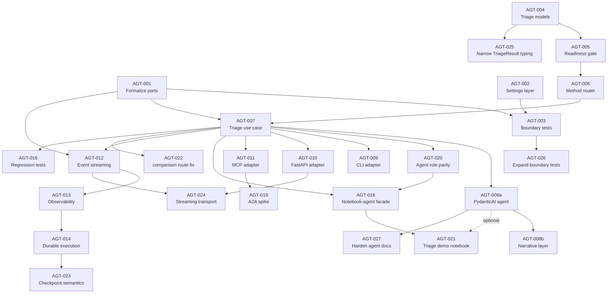

<!-- type: reference -->
# Agentic Triage Backlog

Status: proposed → **revised** → **in progress** → **E9 complete**  
Owner: Adam Krysztopa  
Area: `docs/plan/`  
Planning style: MoSCoW-aligned backlog  
Primary target: agentic triage around deterministic forecastability analysis  
Last revised: 2026-04-12 (E9 added — review hardening)

---

## Epic / Status Overview

| # | Epic | Items | Status |
|---|------|-------|--------|
| E1 | **Complete hexagonal foundation** — formalize ports, enforce boundaries, settings layer | AGT-001, AGT-002, AGT-003 | ✅ done |
| E2 | **Triage domain and policies** — readiness gate, method router, triage models | AGT-004, AGT-005, AGT-006 | ✅ done |
| E3 | **Triage orchestration use case** — deterministic pipeline wiring | AGT-007 | ✅ done |
| E4 | **PydanticAI adapter** — LLM-orchestrated triage over deterministic core | AGT-008a, AGT-008b | ✅ done |
| E5 | **Transport adapters** — CLI, FastAPI, MCP | AGT-009, AGT-010, AGT-011 | ✅ done |
| E6 | **Operational maturity** — streaming, observability, durability | AGT-012, AGT-013, AGT-014 | ✅ done |
| E7 | **Quality gates, agent workflow, and regression** — architecture docs, role parity, benchmark regression | AGT-015, AGT-016, AGT-020 | ✅ done |
| E8 | **User enablement and extensions** — scorer comparison, notebook-agent facade, triage notebook, A2A spike | AGT-017, AGT-018, AGT-021, AGT-019 | ✅ done |
| E9 | **Review hardening** — contract mismatch, checkpoint semantics, streaming UX, typing, boundary coverage, agent docs, narrative ownership | AGT-022, AGT-023, AGT-024, AGT-025, AGT-026, AGT-027, AGT-028 | ✅ done |

---

## Purpose

This backlog adds an **agentic triage layer** to `forecastability` without
contaminating the scientific core.

The current repository already implements:

- `validation.py` — series length, NaN/inf, constant-series checks
- `metrics.py` / `services/` — AMI, pAMI, exogenous cross-MI computation
- `surrogates.py` / `significance_service.py` — phase-surrogate significance bands
- `interpretation.py` — deterministic pattern classification (A–E) with diagnostics
- `recommendation_service.py` — regime triage (`HIGH` / `MEDIUM` / `LOW`)
- `reporting.py` / `assemblers/` — Markdown and JSON report assembly
- `scorers.py` — `DependenceScorer` Protocol, `ScorerRegistryProtocol`, `ScorerRegistry`
- `cmi.py` — `ResidualBackend` Protocol with linear and random-forest backends
- `use_cases/` — `run_rolling_origin_evaluation`, `run_exogenous_rolling_origin_evaluation`
- `ports/` — empty placeholder directory (no interfaces formalized yet)

The agent layer must sit **around** this workflow, not rebuild it.

> [!IMPORTANT]
> Every item below must respect the frozen public contract in
> `docs/plan/solid_refactor_contract.md`. No item may rename, remove, or
> re-type any symbol in `__all__`. Notebooks must remain byte-for-byte unchanged.

---

## Architecture rules

### Rule A — scientific core remains deterministic

- AMI, pAMI, exogenous analysis, scorer execution, surrogate computation, and
  numerical summaries remain plain Python library code.
- Agents may orchestrate, validate, route, interpret, and report.
- Agents must never silently alter scientific defaults.
- Any method choice made by an agent must be emitted as structured metadata.

### Rule B — SOLID is mandatory

| Principle | Constraint |
|---|---|
| **S — SRP** | Each module has one reason to change. Validation, routing, compute, interpretation, reporting, and transport are isolated. |
| **O — OCP** | New scorer families, report formats, and transports are added by extension, not by modifying orchestration. |
| **L — LSP** | Alternative scorer backends, transport adapters, and execution providers are substitutable without breaking contracts. |
| **I — ISP** | Ports are narrow. A CLI adapter must not depend on web-specific interfaces. |
| **D — DIP** | Application layer depends on ports and domain contracts, never on PydanticAI, MCP, FastAPI, or concrete storage. |

### Rule C — Hexagonal Architecture is mandatory

```
┌─────────────────────────────────────────────────────────────┐
│  Adapters (PydanticAI, CLI, FastAPI, MCP, filesystem, .env) │
│       │              │                │                     │
│       ▼              ▼                ▼                     │
│  ┌─────────────────────────────────────────────┐            │
│  │  Ports (protocols / ABCs)                   │            │
│  │       │                                     │            │
│  │       ▼                                     │            │
│  │  ┌──────────────────────────────────┐       │            │
│  │  │  Application / Use Cases         │       │            │
│  │  │       │                          │       │            │
│  │  │       ▼                          │       │            │
│  │  │  ┌────────────────────────┐      │       │            │
│  │  │  │  Domain                │      │       │            │
│  │  │  │  (existing scientific  │      │       │            │
│  │  │  │   core — frozen API)   │      │       │            │
│  │  │  └────────────────────────┘      │       │            │
│  │  └──────────────────────────────────┘       │            │
│  └─────────────────────────────────────────────┘            │
└─────────────────────────────────────────────────────────────┘
```

**Allowed dependency direction:**

- `adapters → ports`, `adapters → domain`
- `use_cases → ports`, `use_cases → domain`
- entrypoints → `use_cases`, entrypoints → `adapters`

**Forbidden:**

- `domain → adapters`, `domain → use_cases`, `domain → entrypoints`, `domain → framework code`
- `use_cases → concrete adapters`

### Rule D — configuration and secrets

- Runtime keys from `.env` only. Never hardcoded.
- Typed `pydantic-settings` model for infrastructure configuration.
- Scientific parameters stay in `configs/*.yaml` via existing Pydantic config models.

---

## Technology position

| Technology | Role | When |
|---|---|---|
| **PydanticAI** | LLM orchestration adapter over deterministic services | After E3 (deterministic triage works standalone) |
| **MCP** | Tool-server exposure for IDE / assistant interop | After E4 (PydanticAI adapter works) |
| **A2A** | Remote multi-agent collaboration | Deferred — spike only after MCP is stable |

---

## Post-E3 rebaseline

E3 proves the triage workflow works without any LLM. After that milestone, the
next priority is not “add more agents” in the abstract. The priority is to make
the deterministic core easier to consume without violating SOLID or hexagonal
boundaries.

- `tester` becomes a core workflow role. `.codex` already has it; `.github`
  must gain parity before agent-assisted delivery is considered production-ready.
- `devops` is justified when E5/E6 create runtime ownership for CI, packaging,
  FastAPI, MCP, streaming, or service health. Until then, infrastructure work
  stays under existing roles and remains adapter-scoped.
- `agent_engineer` is justified only when E4 starts and prompt/tool/eval work
  becomes a real maintenance surface. It is not a second `coder`.
- Notebook preparation in this phase means notebook-safe facades, smoke
  contracts, and how-to documentation only. The frozen contract forbids
  `.ipynb` edits.
- New specialist roles require explicit file ownership and stage-gate
  responsibility; otherwise they add coordination noise rather than leverage.

---

# E1 — Complete Hexagonal Foundation

> [!NOTE]
> The codebase already has `ports/`, `use_cases/`, `services/`, `assemblers/`,
> `bootstrap/` directories. `ScorerRegistryProtocol` and `ResidualBackend` are
> the only formalized port interfaces. This epic fills the remaining gaps.

## AGT-001 — Formalize port interfaces

**Priority:** Must Have · **Points:** 5 · **Labels:** `hexagon`, `ports`, `must-have`

### Goal

Define the `Protocol` / `ABC` interfaces in `src/forecastability/ports/` that
use cases and the triage orchestrator depend on.

### Scope

Extract or define ports for capabilities that currently have no abstract contract:

| Port | Wraps | Current concrete location |
|---|---|---|
| `SeriesValidatorPort` | Input validation | `validation.validate_time_series()` |
| `CurveComputePort` | Raw / partial curve computation | `services/raw_curve_service`, `partial_curve_service` |
| `SignificanceBandsPort` | Surrogate bands | `services/significance_service` |
| `InterpretationPort` | Pattern classification + diagnostics | `interpretation.interpret_canonical_result()` |
| `RecommendationPort` | Regime triage | `services/recommendation_service._triage_recommendation()` |
| `ReportRendererPort` | JSON / Markdown rendering | `reporting.py`, `assemblers/` |
| `SettingsPort` | Runtime infrastructure config | (does not exist yet — created in AGT-002) |

### Tasks

- Add `Protocol` definitions in `ports/` with typed signatures.
- Each port is a single-method or narrow multi-method interface (ISP).
- Existing `ScorerRegistryProtocol` and `ResidualBackend` remain where they are (already correct).
- Add `test_ports_are_protocols.py` verifying each port is `runtime_checkable`.

### Acceptance criteria

- Every port is a `typing.Protocol` with `@runtime_checkable`.
- No port imports concrete adapters or infrastructure packages.
- Existing code continues to pass all tests unchanged.

### Dependencies

None.

---

## AGT-002 — Create settings and `.env` configuration layer

**Priority:** Must Have · **Points:** 3 · **Labels:** `config`, `env`, `must-have`

### Goal

Add a typed `pydantic-settings` model for infrastructure configuration, loaded
from `.env`.

### Scope

- `src/forecastability/adapters/settings.py` containing `InfraSettings(BaseSettings)`.
- Fields: `openai_api_key`, `openai_model`, `triage_enable_streaming`, `triage_default_significance_mode`, `mcp_host`, `mcp_port`.
- Scientific parameters (`n_neighbors`, `n_surrogates`, `alpha`, `random_state`) stay in `configs/` YAML — they are domain, not infrastructure.
- `.env.example` with non-secret placeholders.

### Tasks

- Add `pydantic-settings` to `pyproject.toml` dependencies.
- Create `InfraSettings` with `model_config = SettingsConfigDict(env_file=".env")`.
- Document variable ownership in `.env.example`.

### Acceptance criteria

- Missing required keys fail fast with readable messages.
- Tests instantiate with `_env_file=None` for determinism.
- No infrastructure secrets leak into domain code.

### Dependencies

None.

---

## AGT-003 — Architecture boundary tests

**Priority:** Must Have · **Points:** 3 · **Labels:** `hexagon`, `testing`, `must-have`

### Goal

Make import boundaries enforceable via automated tests.

### Tasks

- Add `tests/test_architecture_boundaries.py`.
- Assert: modules under `domain-like` packages (`metrics`, `validation`, `interpretation`,
  `types`, `config`, `scorers`, `cmi`, `surrogates`) do not import `pydantic_ai`,
  `fastapi`, `mcp`, `httpx`, `matplotlib` (except `plots.py`), `click`, `typer`.
- Assert: `ports/` modules import only `typing`, `numpy`, `pydantic`, and domain types.
- Assert: `use_cases/` do not import concrete adapter modules.

### Acceptance criteria

- Boundary violations fail in `uv run pytest`.
- Test is fast (AST-level or importlib-based, no runtime import of heavy packages).

### Dependencies

- AGT-001.

---

# E2 — Triage Domain and Policies

> [!NOTE]
> The existing `interpretation.py` (patterns A–E), `recommendation_service.py`,
> and `validation.py` already cover most of the domain logic below. This epic
> wraps them in a cohesive triage model, adds a **readiness gate** (richer
> validation), and adds a **method router** (new deterministic policy).

## AGT-004 — Define triage domain models

**Priority:** Must Have · **Points:** 3 · **Labels:** `domain`, `pydantic`, `must-have`

### Goal

Create typed Pydantic models for the end-to-end triage contract.

### Scope

New module: `src/forecastability/triage/models.py`.

| Model | Role | Reuses from |
|---|---|---|
| `TriageRequest` | Inbound request (series, optional exog, goal, config overrides) | — |
| `ReadinessReport` | Gate decision: blocked / warning / clear | extends `validation.py` checks |
| `MethodPlan` | Which compute path to run and why | new (routing output) |
| `TriageResult` | Full composite: readiness + compute + interpretation + recommendation | wraps `InterpretationResult`, `AnalyzeResult` |

Enums: `AnalysisGoal` (`univariate`, `exogenous`, `comparison`), `ReadinessStatus` (`blocked`, `warning`, `clear`).

### Tasks

- Create `src/forecastability/triage/__init__.py` and `models.py`.
- Models are frozen Pydantic, no infrastructure imports.
- Add schema round-trip tests.

### Acceptance criteria

- Models serialize/deserialize cleanly.
- Invalid combinations fail with explicit validation errors.
- No transport or framework fields.

### Dependencies

None.

---

## AGT-005 — Build readiness gate policy

**Priority:** Must Have · **Points:** 3 · **Labels:** `validation`, `must-have`

### Goal

Extend existing validation into a structured readiness gate with richer feedback.

### Scope

New function in `src/forecastability/triage/readiness.py`:

```python
def assess_readiness(
    request: TriageRequest,
) -> ReadinessReport:
```

Checks (extending `validate_time_series`):

| Check | Existing? | Action |
|---|---|---|
| min length vs requested max_lag | yes (`validate_time_series`) | reuse |
| NaN / inf / constant | yes | reuse |
| lag feasibility (`max_lag < len - 50` for pAMI) | **no** | new |
| significance feasibility (`n >= 200` for `n_surrogates >= 99`) | **no** | new |
| near-constant variance (degenerate) | **no** | new |
| daily frequency confidence note | **no** | new |

### Tasks

- Import and call existing `validate_time_series` for base checks.
- Add lag-feasibility and significance-feasibility rules.
- Return `ReadinessReport` with structured `warnings` list and `status`.
- Add tests: short series → blocked, trending → warning, adequate → clear.

### Acceptance criteria

- Blocked requests prevent downstream compute.
- All new checks are deterministic with explicit thresholds.
- Existing `validate_time_series` behavior is untouched.

### Dependencies

- AGT-004.

---

## AGT-006 — Build method router policy

**Priority:** Must Have · **Points:** 3 · **Labels:** `routing`, `must-have`

### Goal

Deterministic policy that selects the compute path based on request properties.

### Scope

New function in `src/forecastability/triage/router.py`:

```python
def plan_method(
    request: TriageRequest,
    readiness: ReadinessReport,
) -> MethodPlan:
```

Routing rules (deterministic — no LLM):

| Condition | Route |
|---|---|
| `request.exog is not None` | exogenous path (`compute_raw` + `compute_partial` with exog) |
| `request.goal == "comparison"` | multi-scorer comparison path |
| `readiness.status == "warning"` and significance infeasible | AMI + pAMI, no surrogates |
| default | AMI + pAMI + significance |

### Tasks

- Implement routing table as pure function.
- Emit `MethodPlan` including `assumptions` list and `rationale` string.
- Add regression tests checking canonical inputs produce expected routes.

### Acceptance criteria

- Same input always produces same route (deterministic).
- No LLM dependency.
- Route output is auditable.

### Dependencies

- AGT-004, AGT-005.

---

# E3 — Triage Orchestration Use Case

## AGT-007 — Implement triage orchestration use case ✅

**Priority:** Must Have · **Points:** 5 · **Labels:** `use-case`, `must-have`

### Goal

A single deterministic use case that runs the full triage pipeline — callable
from any adapter (CLI, API, notebook, PydanticAI) without an LLM.

### Scope

New module: `src/forecastability/triage/run_triage.py`.

```python
def run_triage(
    request: TriageRequest,
    *,
    readiness_gate: Callable[[TriageRequest], ReadinessReport] = assess_readiness,
    router: Callable[[TriageRequest, ReadinessReport], MethodPlan] = plan_method,
) -> TriageResult:
```

Steps:
1. `assess_readiness(request)` → `ReadinessReport` — return early if blocked.
2. `plan_method(request, readiness)` → `MethodPlan`.
3. Execute compute via existing `ForecastabilityAnalyzer.analyze()` or
   `ForecastabilityAnalyzerExog.analyze()` depending on route.
4. `interpret_canonical_result(result)` → `InterpretationResult` (existing).
5. `_triage_recommendation(...)` → recommendation string (existing).
6. Assemble `TriageResult`.

### Key design choice

This use case is **pure Python with constructor-injected collaborators** (readiness
gate and router are replaceable callables). No PydanticAI, no LLM, no network.
It proves the triage pipeline works deterministically before any agent adapter
is wired.

### Tasks

- Implement `run_triage()` with injection points.
- Add end-to-end test using canonical AR(1) and white-noise series.
- Verify output types match `TriageResult`.

### Acceptance criteria

- `run_triage()` is callable without any LLM or agent runtime.
- All scientific compute delegates to existing library functions.
- Output is a single typed `TriageResult`.

### Dependencies

- AGT-005, AGT-006.

---

# E4 — PydanticAI Adapter

## AGT-008a — PydanticAI agent with tool bindings ✅

**Priority:** Must Have · **Points:** 5 · **Labels:** `pydanticai`, `adapter`, `must-have`

### Goal

Create a PydanticAI agent adapter that wraps `run_triage()` and exposes
deterministic capabilities as agent tools.

### Scope

New module: `src/forecastability/adapters/pydantic_ai_agent.py`.

- Define PydanticAI agent with typed `TriageRequest` input and `TriageResult` output.
- Bind tools: `validate_series`, `plan_method`, `run_analysis`, `interpret`, `recommend`.
- Each tool is a thin wrapper calling existing library functions through ports.
- Prompts focus on orchestration and explanation — no numeric invention.

### Tasks

- Add `pydantic-ai` to `pyproject.toml` optional dependencies.
- Create agent definition with system prompt enforcing deterministic behavior.
- Add integration test (mocked LLM) proving tool dispatch works.

### Acceptance criteria

- Agent tools only call existing deterministic code.
- Agent never generates numbers — only interprets and explains.
- PydanticAI import is confined to `adapters/` (boundary test from AGT-003 enforces this).

### Dependencies

- AGT-007.

---

## AGT-008b — PydanticAI narrative and explainability layer ✅

**Priority:** Should Have · **Points:** 3 · **Labels:** `pydanticai`, `narrative`, `should-have`

### Goal

Add LLM-generated narrative summaries that wrap deterministic results.

### Scope

- After `run_triage()` returns, the agent generates a natural-language explanation
  of the interpretation pattern, recommendations, and caveats.
- Narrative is stored in `TriageResult.narrative` (optional field, default `None`).
- Caveat templates from `interpretation.py` are passed to the LLM as constraints.

### Tasks

- Add `narrative` optional field to `TriageResult`.
- Create narration prompt template referencing interpretation patterns A–E.
- Add test verifying narrative includes required caveats.

### Acceptance criteria

- Narrative never contradicts deterministic interpretation.
- Fallback: `TriageResult` is complete even when narrative is `None`.

### Dependencies

- AGT-008a.

---

# E5 — Transport Adapters

## AGT-009 — CLI adapter ✅

**Priority:** Should Have · **Points:** 3 · **Labels:** `cli`, `adapter`, `should-have`

### Goal

Lightweight CLI entry point for local triage.

### Scope

`src/forecastability/adapters/cli.py` using `argparse` (no extra dependency).

Commands:
- `triage` — run triage on a CSV series
- `list-scorers` — list registered scorers

Output: JSON or Markdown to stdout.

### Acceptance criteria

- CLI imports from `use_cases/` and `ports/`, not from `adapters/`.
- `--format json|markdown` flag supported.

### Dependencies

- AGT-007.

---

## AGT-010 — FastAPI adapter ✅

**Priority:** Should Have · **Points:** 5 · **Labels:** `api`, `adapter`, `should-have`

### Goal

HTTP API exposing triage.

### Scope

`src/forecastability/adapters/api.py`.

Endpoints: `POST /triage`, `GET /scorers`, `GET /health`.

### Acceptance criteria

- FastAPI import confined to `adapters/`.
- Request/response models are Pydantic (reuse triage models).
- Streaming endpoint (optional, if AGT-012 done).

### Dependencies

- AGT-007. Optional: AGT-012.

---

## AGT-011 — MCP server adapter ✅

**Priority:** Should Have · **Points:** 5 · **Labels:** `mcp`, `adapter`, `should-have`

### Goal

Expose deterministic tools as MCP tools.

### Scope

`src/forecastability/adapters/mcp_server.py`.

Tools: `validate_series`, `run_triage`, `list_scorers`.  
Resources: scorer catalog, example request schema.

### Acceptance criteria

- MCP import confined to `adapters/`.
- External MCP client can call tools.
- Domain layer untouched.

### Dependencies

- AGT-007.

---

# E6 — Operational Maturity

## AGT-012 — Event streaming contract

**Priority:** Should Have · **Points:** 3 · **Labels:** `streaming`, `should-have`

### Goal

Define typed event shapes so adapters can stream triage progress.

### Scope

`src/forecastability/triage/events.py` — pure domain models:
- `TriageStageStarted(stage: str, timestamp: datetime)`
- `TriageStageCompleted(stage: str, duration_ms: float, result_summary: str)`
- `TriageError(stage: str, error: str)`

Port: `EventEmitterPort` protocol in `ports/`.  
Adapters: `LoggingEventEmitter` (default), `StreamingEventEmitter` (SSE/WebSocket — later).

### Acceptance criteria

- Events are framework-free Pydantic models.
- Default emitter is a no-op/logging adapter.

### Dependencies

- AGT-001, AGT-007.

---

## AGT-013 — Observability and timing instrumentation

**Priority:** Should Have · **Points:** 3 · **Labels:** `observability`, `should-have`

### Goal

Instrument `run_triage()` stages with timing and error classification.

### Tasks

- Wrap each stage call in `run_triage()` with start/end timestamps.
- Emit events via `EventEmitterPort`.
- No external tracing dependency — plain dict/Pydantic accumulation.

### Acceptance criteria

- A single triage run produces a timing breakdown.
- Slow stages are identifiable.

### Dependencies

- AGT-012.

---

## AGT-014 — Durable execution for long significance runs

**Priority:** Could Have · **Points:** 5 · **Labels:** `durability`, `could-have`

### Goal

Persist intermediate triage state so interrupted significance-heavy runs can resume.

### Tasks

- Serialize `TriageResult` partial state to JSON after each stage.
- Detect existing partial state on startup and resume.

### Acceptance criteria

- Interrupted run resumes from last completed stage.
- Partial state is human-readable JSON.

### Dependencies

- AGT-012, AGT-013.

---

# E7 — Quality Gates, Agent Workflow, and Regression

## AGT-015 — Architecture enforcement documentation ✅

**Priority:** Must Have · **Points:** 2 · **Labels:** `docs`, `must-have`

### Goal

Document SOLID and hexagonal rules so contributors know the vocabulary.

### Tasks

- Add `docs/architecture.md` with layer diagram, dependency rules, and examples.
- Reference from `CONTRIBUTING.md` or `README.md`.

### Acceptance criteria

- New contributors can find architecture rules in `docs/`.

### Dependencies

None.

---

## AGT-016 — Benchmark regression tests for triage routing ✅

**Priority:** Should Have · **Points:** 3 · **Labels:** `testing`, `regression`, `should-have`

### Goal

Prevent routing or interpretation drift using canonical series.

### Tasks

- Add `tests/test_triage_regression.py`.
- Test canonical AR(1), white noise, trend+seasonal, and exog cases.
- Assert expected `MethodPlan.route` and `InterpretationResult.pattern_class`.

### Acceptance criteria

- Routing drift fails CI.
- Interpretation regressions are caught.

### Dependencies

- AGT-007.

---

## AGT-020 — Agent roster parity and ownership map ✅

**Priority:** Must Have · **Points:** 3 · **Labels:** `agents`, `dx`, `must-have`

### Goal

Make agent-assisted delivery predictable by aligning the supported role set
across `.github` and `.codex`, defining what each role owns, and preventing
workflow drift.

### Scope

- Document the canonical agent roster and ownership map.
- Close current parity gaps such as `.codex` having `tester` while `.github`
  does not.
- Decide whether `devops` and `agent_engineer` are needed now, later, or not at
  all.
- Keep every role bounded to adapters, docs, verification, or architecture
  concerns; domain logic stays in code, not in prompts.

### Tasks

- Add or update the canonical roster in `.github/AGENT_FLOW.md` and related
  instruction files.
- Define the core maintained roles:
  `orchestrator`, `coder`, `tester`, `documenter`, `analyst`,
  `software_architect`, `statistician`, `reporter`.
- Add an ownership table for optional roles:
  - `devops` — `.github/workflows/`, packaging, runtime config, local service
    bootstrapping, deployment docs
  - `agent_engineer` — PydanticAI prompts, tool bindings, eval fixtures,
    guardrails, agent-usage examples
- Add explicit entry criteria:
  - introduce `devops` when the first service-like adapter or CI/release
    workflow becomes a maintenance burden
  - introduce `agent_engineer` when E4 starts and prompt/eval work stops being
    incidental

### Acceptance criteria

- Supported roles are documented once and referenced from both `.github` and
  `.codex`.
- No maintained workflow depends on a role that exists in only one agent system.
- Every added role has a concrete file/service ownership boundary and a
  stage-gate responsibility.

### Dependencies

- AGT-007.

---

# E8 — User Enablement and Extensions

## AGT-017 — Scorer-comparison triage mode

**Priority:** Could Have · **Points:** 3 · **Labels:** `scorers`, `could-have`

### Goal

Let `TriageRequest(goal="comparison")` trigger multi-scorer execution.

### Acceptance criteria

- Report highlights agreement/disagreement across scorer families.

### Dependencies

- AGT-007.

---

## AGT-018 — Notebook-safe and agent-ready triage facade

**Priority:** Should Have · **Points:** 5 · **Labels:** `notebooks`, `dx`, `should-have`

### Goal

Prepare a notebook-friendly triage path that is easy to use today and
agent-ready later, without editing or adding `.ipynb` files in this phase.

```python
from forecastability.triage import run_triage, TriageRequest
result = run_triage(TriageRequest(series=ts, goal="univariate"))
```

### Scope

- Stable one-cell deterministic usage from `forecastability.triage`.
- Notebook-friendly rendering or serialization helpers so `TriageResult` is easy
  to inspect without bespoke notebook glue code.
- How-to documentation with copy-pasteable Python cells in Markdown, not in
  committed notebook files.
- Phase 2 hook: once E4 exists, the same notebook flow may opt into
  agent-generated explanation without changing the compute path.

### Tasks

- Preserve a minimal import surface for notebook users under
  `forecastability.triage`.
- Add notebook-safe formatting helpers instead of building a second notebook-only
  orchestration layer.
- Add a notebook smoke contract covering imports and a minimal deterministic
  usage example.
- Document a staged UX:
  - stage 1 — deterministic `run_triage()` in one cell
  - stage 2 — optional agent explanation after AGT-008a
- State the non-goal explicitly: no `.ipynb` edits while the compatibility
  contract is in force

### Acceptance criteria

- Facade delegates to `run_triage()`, not a separate orchestration path.
- Existing notebooks remain unchanged.
- No new notebook dependencies.
- A notebook user can execute deterministic triage in one cell and understand
  the next step for agent-assisted explanation.

### Dependencies

- AGT-007.
- AGT-020.
- Optional: AGT-008a.

---

## AGT-021 — Agentic triage demo notebook

**Priority:** Should Have · **Points:** 5 · **Labels:** `notebooks`, `dx`, `should-have`

### Goal

Create `notebooks/03_agentic_triage.ipynb` — a standalone, runnable notebook
that demonstrates the triage pipeline end-to-end.  It teaches the user
`run_triage()` as the single entry point for forecastability analysis and
previews the future agent-assisted explanation path.

### Scope

Unlike AGT-018 (which prepares the facade and helpers without creating notebook
files), this item **creates an actual `.ipynb`**.  The notebook freeze rule
protects existing notebooks 01 and 02; a newly committed notebook becomes
frozen only after its initial merge.

#### Section outline

| # | Type | Title | Purpose |
|---|---|---|---|
| 1 | md | Title + Introduction | What is triage? Single entry point |
| 2 | md/py | Setup & imports | `from forecastability.triage import run_triage, TriageRequest` + datasets |
| 3 | md/py | §1 — One-Cell Triage (AR(1)) | Demonstrate the happy path: clear → univariate_with_significance → high forecastability |
| 4 | md/py | §2 — Readiness Gate | Short series → blocked; medium series → warning with codes |
| 5 | md/py | §3 — Method Routing | White noise (low forecastability), Hénon map (nonlinear), exogenous path |
| 6 | md/py | §4 — Interpretation Deep Dive | Pattern classes A–E table built from results |
| 7 | md/py | §5 — Visualization | Plot AMI/pAMI curves extracted from TriageResult |
| 8 | md/py | §6 — Agent-Assisted Explanation (Preview) | Commented/guarded PydanticAI cell with `try/except ImportError` |
| 9 | md | §7 — Takeaways | Single entry point, deterministic, extensible |

#### Architectural constraints

- **All compute goes through `run_triage()`** — no direct `ForecastabilityAnalyzer` calls.
- **No new dependencies** — only `forecastability`, `numpy`, `matplotlib`.
- **Agent cells are opt-in** — guarded by `try/except ImportError`, graceful when
  PydanticAI is absent.
- **No secrets in cells** — agent cells reference `.env` via the settings layer.
- **Deterministic** — every cell uses `random_state=42`.

### Tasks

- Create `notebooks/03_agentic_triage.ipynb` with the section outline above.
- Add the notebook to `EXPECTED_NOTEBOOKS` in `scripts/check_notebook_contract.py`.
- Add a triage-specific smoke test in `tests/test_notebook_contract.py` verifying
  `from forecastability.triage import run_triage, TriageRequest` resolves.
- If AGT-018 display helpers exist, use them; otherwise inline minimal formatting.
- Ensure `uv run pytest` passes with the new smoke test.

### Acceptance criteria

- Notebook is runnable end-to-end with `uv run jupyter nbconvert --execute`.
- All compute delegates to `run_triage()`.
- Existing notebooks 01 and 02 are byte-for-byte unchanged.
- Agent preview cells degrade gracefully (no crash without PydanticAI).
- Notebook is added to the contract check script (`check_notebook_contract.py`).

### Dependencies

- AGT-007 (done).
- AGT-018 (display helpers — soft dependency, can inline if absent).
- AGT-008a (PydanticAI — optional, only for §6 preview cells).

---

## AGT-019 — A2A feasibility spike

**Priority:** Could Have · **Points:** 2 · **Labels:** `a2a`, `spike`, `could-have`

### Goal

Written decision memo: adopt now / adopt later / reject.

### Questions

- Is there a realistic separate-process agent use case?
- Would A2A reduce coupling or only add network overhead?

### Acceptance criteria

- ADR written under `docs/decisions/`.

### Dependencies

- AGT-011 (MCP stable first).

---

# Won't Have (invariants)

| ID | Decision | Reason |
|---|---|---|
| W-01 | No LLM-generated scientific computation | Numerical core must remain deterministic and testable |
| W-02 | No hardcoded secrets | All runtime keys belong in `.env` and typed settings |
| W-03 | No framework coupling in domain | PydanticAI, FastAPI, MCP belong in adapters only |
| W-04 | No A2A-first design | Remote orchestration is premature |

---

# Implementation order



**Recommended sequence (critical path in bold):**

1. **AGT-001** — Formalize port interfaces
2. **AGT-002** — Settings layer
3. **AGT-004** — Triage domain models
4. **AGT-003** — Architecture boundary tests
5. **AGT-005** — Readiness gate
6. **AGT-006** — Method router
7. AGT-015 — Architecture docs
8. **AGT-007** — Triage orchestration use case ← **first end-to-end milestone**
9. AGT-020 — Agent roster parity and ownership map
10. AGT-018 — Notebook-safe deterministic path and future agent hook
11. **AGT-021** — Agentic triage demo notebook
12. AGT-008a — PydanticAI agent
13. AGT-008b — Narrative layer
14. AGT-009, AGT-010, AGT-011 — transport adapters (parallelizable)
15. AGT-012 — Event streaming
16. AGT-013 — Observability
17. AGT-016 — Regression tests
18. AGT-014, AGT-017, AGT-019 — lower-priority extensions
19. **AGT-022** — Resolve comparison route contract mismatch ← **review-critical**
20. AGT-025 — Narrow `TriageResult` typing
21. AGT-026 — Expand architecture boundary tests
22. AGT-023 — Checkpoint durability semantics
23. AGT-024 — Streaming transport surface
24. AGT-027 — Harden PydanticAI adapter docs
25. AGT-028 — Narrative ownership rule

---

# E9 — Review Hardening

> [!NOTE]
> Items in this epic originate from the static architecture review in
> `docs/review_findings.md`.  They are ordered by review-severity
> (High → Medium → Low) and numbered AGT-022 – AGT-028.

## AGT-022 — Resolve `comparison` route contract mismatch ✅

**Priority:** Must Have · **Points:** 5 · **Labels:** `contract`, `triage`, `must-have`

### Goal

Eliminate the gap between what public surfaces advertise (`comparison` as a
valid `AnalysisGoal`) and what `run_triage()` can actually execute.

### Evidence

- `AnalysisGoal` includes `comparison`
- HTTP request model, MCP schema, and CLI all expose `comparison`
- `run_triage()` raises `NotImplementedError("comparison route is not yet implemented (AGT-017)")`
- Backlog lists E8 / AGT-017 as done

### Scope — choose one path

**Path A — implement the comparison route now**
- Add multi-scorer execution in `_run_compute()` (or a new helper)
- Return a structured comparison result inside `TriageResult`
- Cover route in `tests/test_triage_run.py` and transport contract tests

**Path B — de-scope cleanly**
- Remove `comparison` from `AnalysisGoal` enum exposed to users
- Remove it from API, MCP, and CLI request schemas
- Keep internal scaffolding only if clearly marked `_experimental`
- Reopen AGT-017 in the backlog

### Tasks

- Decide Path A or Path B
- If Path A: implement comparison execution, router branch, interpretation
- If Path B: prune enum + transport schemas, mark AGT-017 as open
- Add route-specific regression tests for the chosen behavior
- Update backlog/epic status to match reality

### Acceptance criteria

- No public surface advertises a route that `run_triage()` cannot execute
- Backlog status and code reality agree
- Dedicated tests cover the chosen route behavior
- `uv run pytest -q -ra` passes

### Dependencies

- AGT-007.

---

## AGT-023 — Clarify and strengthen checkpoint durability semantics ✅

**Priority:** Should Have · **Points:** 3 · **Labels:** `durability`, `checkpoint`, `should-have`

### Goal

Make checkpoint semantics explicit: replay-only or full-artifact resume.

### Evidence

After the compute stage the checkpoint persists only a **summary** dict
(`compute_summary`), not the full `AnalyzeResult`.  Resumed runs will still
re-execute compute — weaker durability than callers may assume.

### Scope

**Option 1 — keep replay semantics (recommended first step)**
- Rename / document clearly that checkpoints are *orchestration-state replay*,
  not full-artifact resume
- Add inline docstring and a note in `docs/architecture.md`

**Option 2 — full compute resume**
- After the compute stage, persist the minimal sufficient artifact
  (raw/partial curves + sig lags) in a versioned JSON-safe format
- On resume, deserialise and skip directly to interpretation

### Tasks

- Document chosen semantics in `run_triage()` docstring and `docs/architecture.md`
- Make `checkpoint_key="default"` emit a warning when `checkpoint` is not `None`
  (prevent accidental collisions in multi-run contexts)
- Add a test that interrupts after compute and verifies expected resume behavior
- If Option 2: add JSON-safe serialiser/deserialiser for `AnalyzeResult`

### Acceptance criteria

- Checkpoint semantics are explicit in docs and tests
- Resume behavior is deterministic and tested for interrupted flows
- Default key collision risk is documented or warned

### Dependencies

- AGT-014.

---

## AGT-024 — Productise user-visible streaming transport ✅

**Priority:** Should Have · **Points:** 5 · **Labels:** `streaming`, `transport`, `should-have`

### Goal

Expose triage progress as a user-visible stream, not just internal events / logs.

### Evidence

The branch has `EventEmitterPort`, typed events, `LoggingEventEmitter`,
`InMemoryCollectorEmitter`, and a settings flag `triage_enable_streaming`.
However no confirmed external transport surface (SSE, WebSocket, MCP progress)
lets an API/MCP client observe stages in real time.

### Scope

- Add an SSE streaming endpoint in `adapters/api.py` (e.g. `GET /triage/stream`)
- Bridge `EventEmitterPort` → SSE via a `StreamingEventEmitter` adapter
- Define payload schema and event ordering contract
- Optionally: add MCP progress/event delivery if client ecosystem benefits

### Tasks

- Implement `StreamingEventEmitter` adapter
- Add `GET /triage/stream` SSE endpoint gated by `triage_enable_streaming`
- Add transport integration test asserting stage ordering and payload shape
- Document streaming capability in `docs/architecture.md`

### Acceptance criteria

- External consumer can observe triage stage progress outside logs / tests
- Streaming output is contract-tested (event names, order, payload schema)
- Settings flag toggles real external behavior, not just internal plumbing
- `uv run pytest -q -ra` passes

### Dependencies

- AGT-012, AGT-010.

---

## AGT-025 — Narrow `TriageResult` typing — eliminate `Any` ✅

**Priority:** Should Have · **Points:** 3 · **Labels:** `typing`, `contract`, `should-have`

### Goal

Replace `Any` on the two most important fields of the central triage result
model.

### Evidence

`TriageResult` currently declares:
```python
analyze_result: Any | None = None  # AnalyzeResult at runtime
interpretation: Any | None = None  # InterpretationResult at runtime
```

Comment explains circular-import avoidance, but this weakens the most important
application contract.

### Scope

Choose one approach:
1. **TYPE_CHECKING guard** — import `AnalyzeResult` / `InterpretationResult`
   under `if TYPE_CHECKING:` and use string annotations (`"AnalyzeResult"`)
2. **Lightweight summary DTOs** — define `TriageComputeSummary` and
   `TriageInterpretationSummary` models with only the fields adapters need
3. **Protocol contracts** — define narrow structural protocols for the required
   fields

### Tasks

- Replace `Any` with the chosen typed contract
- Confirm no circular import at runtime
- Update serialisation logic in adapters if the shape changed
- Verify `uv run ty check` and `uv run pytest -q -ra` pass

### Acceptance criteria

- `TriageResult` exposes narrow typed contracts for downstream use
- Adapter serialisation relies on stable shapes without duck-typing surprises
- Circular import avoidance does *not* require `Any`

### Dependencies

- AGT-004.

---

## AGT-026 — Expand architecture boundary test coverage ✅

**Priority:** Should Have · **Points:** 2 · **Labels:** `testing`, `hexagon`, `should-have`

### Goal

Close the gap between architecture docs and enforced boundary tests.

### Evidence

`_DOMAIN_MODULES` in `tests/test_architecture_boundaries.py` covers:
`metrics`, `validation`, `interpretation`, `types`, `config`, `scorers`, `cmi`,
`surrogates`.

Not yet covered: `analyzer.py`, `aggregation.py`, `reporting.py`, and any other
domain-like modules that should obey the same import constraints.

### Tasks

- Audit `src/forecastability/` for modules that behave as domain-like
- Add missing modules to `_DOMAIN_MODULES` (or justify their exemption)
- For `reporting.py`, decide whether it is domain or adapter and annotate
- Run `uv run pytest tests/test_architecture_boundaries.py -v` to confirm

### Acceptance criteria

- Boundary test inventory matches the architecture intent in `docs/architecture.md`
- All important scientific/core modules are either covered or explicitly exempted
  (with rationale in a code comment)
- No regressions

### Dependencies

- AGT-003.

---

## AGT-027 — Harden PydanticAI adapter and document canonical entry point ✅

**Priority:** Low · **Points:** 2 · **Labels:** `pydanticai`, `docs`, `low`

### Goal

The agent facade already exists — strengthen it rather than recreate it.

### Evidence

`adapters/pydantic_ai_agent.py` exposes `create_triage_agent()` with tool
bindings.  Tests verify the expected tool set.  What is missing: consolidated
documentation, provider-selection guidance, and a smoke/integration test path
for the `agent` extra.

### Tasks

- Document `create_triage_agent()` in root README under an "Agent quickstart"
  section
- Add provider-selection guidance (model, key, fallback)
- Add a smoke test path for `uv sync --extra agent` + agent creation
- Verify explanation output never invents unsupported values

### Acceptance criteria

- One canonical agent facade documented in README and notebook 03
- Tests verify deterministic-tool / narrative separation
- Provider configuration is explicit

### Dependencies

- AGT-008a.

---

## AGT-028 — Clarify narrative ownership rule ✅

**Priority:** Low · **Points:** 1 · **Labels:** `docs`, `narrative`, `low`

### Goal

Document a single authoritative rule for who owns explanatory prose.

### Evidence

Two narrative concepts exist:
- `TriageResult.narrative` on the deterministic model (default `None`)
- Richer explanation in PydanticAI adapter with its own `narrative`

Both are valid; but without a documented rule, confusion will grow.

### Scope

- Add a "Narrative ownership" section to `docs/architecture.md`
- Establish the rule:
  - `run_triage()` owns scientific outputs and structured recommendation
  - The agent layer owns explanatory prose
  - `TriageResult.narrative` remains `None` for pure deterministic runs unless a
    specific non-LLM renderer is intentionally added
- Add a test asserting `run_triage()` returns `narrative is None` without agent

### Tasks

- Write the ownership rule in `docs/architecture.md`
- Add assertion to `tests/test_triage_run.py`

### Acceptance criteria

- One source of truth for explanatory prose is documented
- Deterministic and agent-generated text are not conflated

### Dependencies

None.

---

# Definition of done

This backlog is complete when:

- [x] `run_triage()` is callable from Python without any LLM or agent runtime
- [x] All scientific computation delegates to existing library code (no duplication)
- [x] Port interfaces formalized in `ports/` with boundary tests enforcing them
- [x] PydanticAI adapter wraps `run_triage()` and never generates numbers
- [x] `.env` is the documented home for runtime keys; typed settings model validates them
- [ ] Supported agent roles and ownership are aligned across `.github` and `.codex`
- [ ] At least one transport adapter (CLI, API, or MCP) works end-to-end
- [ ] Architecture rules documented in `docs/architecture.md`
- [ ] Notebook users have a documented, notebook-safe triage path that reuses `run_triage()`
- [ ] `notebooks/03_agentic_triage.ipynb` demonstrates the triage pipeline end-to-end
- [ ] All items pass `uv run pytest -q -ra`, `uv run ruff check .`, `uv run ty check`
- [ ] Notebooks 01 and 02 remain byte-for-byte unchanged
- [ ] A2A remains deferred unless a concrete distributed use case justifies it
- [x] No public surface advertises a route `run_triage()` cannot execute (AGT-022)
- [x] Checkpoint semantics explicit in docs and tested for resume behavior (AGT-023)
- [x] User-visible streaming transport surface contract-tested (AGT-024)
- [x] `TriageResult` uses narrow typed contracts instead of `Any` (AGT-025)
- [x] Architecture boundary tests cover all domain-like modules (AGT-026)
- [x] Canonical agent entry point documented in README (AGT-027)
- [x] Narrative ownership rule documented; deterministic vs agent text not conflated (AGT-028)
