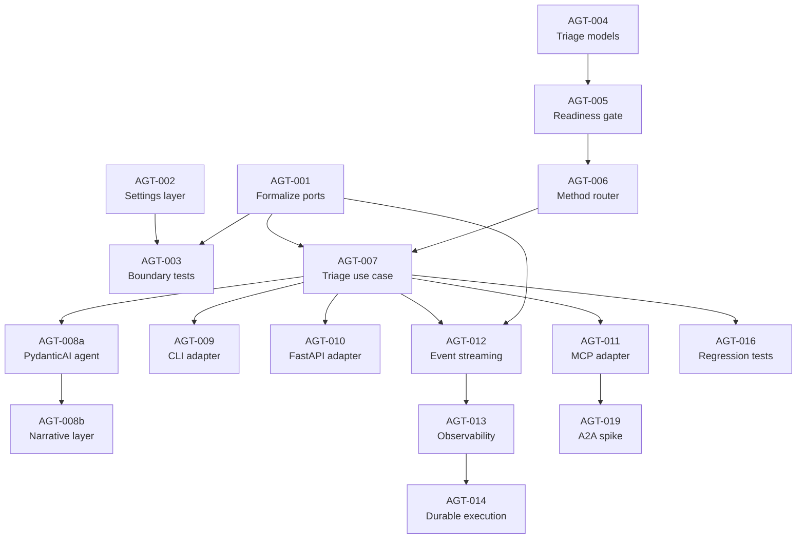

# Agentic Triage Backlog

Status: proposed → **revised**  
Owner: Adam Krysztopa  
Area: `docs/plan/`  
Planning style: MoSCoW-aligned backlog  
Primary target: agentic triage around deterministic forecastability analysis  
Last revised: 2025-04-11

---

## Epic / Status Overview

| # | Epic | Items | Status |
|---|------|-------|--------|
| E1 | **Complete hexagonal foundation** — formalize ports, enforce boundaries, settings layer | AGT-001, AGT-002, AGT-003 | not started |
| E2 | **Triage domain and policies** — readiness gate, method router, triage models | AGT-004, AGT-005, AGT-006 | not started |
| E3 | **Triage orchestration use case** — deterministic pipeline wiring | AGT-007 | not started |
| E4 | **PydanticAI adapter** — LLM-orchestrated triage over deterministic core | AGT-008a, AGT-008b | not started |
| E5 | **Transport adapters** — CLI, FastAPI, MCP | AGT-009, AGT-010, AGT-011 | not started |
| E6 | **Operational maturity** — streaming, observability, durability | AGT-012, AGT-013, AGT-014 | not started |
| E7 | **Quality gates and regression** — architecture tests, benchmark regression | AGT-015, AGT-016 | not started |
| E8 | **Extensions** — scorer comparison, notebook facade, A2A spike | AGT-017, AGT-018, AGT-019 | not started |

---

## Purpose

This backlog adds an **agentic triage layer** to `forecastability` without
contaminating the scientific core.

The current repository already implements:

- `validation.py` — series length, NaN/inf, constant-series checks
- `metrics.py` / `services/` — AMI, pAMI, exogenous cross-MI computation
- `surrogates.py` / `significance_service.py` — phase-surrogate significance bands
- `interpretation.py` — deterministic pattern classification (A–E) with diagnostics
- `recommendation_service.py` — regime triage (`HIGH` / `MEDIUM` / `LOW`)
- `reporting.py` / `assemblers/` — Markdown and JSON report assembly
- `scorers.py` — `DependenceScorer` Protocol, `ScorerRegistryProtocol`, `ScorerRegistry`
- `cmi.py` — `ResidualBackend` Protocol with linear and random-forest backends
- `use_cases/` — `run_rolling_origin_evaluation`, `run_exogenous_rolling_origin_evaluation`
- `ports/` — empty placeholder directory (no interfaces formalized yet)

The agent layer must sit **around** this workflow, not rebuild it.

> [!IMPORTANT]
> Every item below must respect the frozen public contract in
> `docs/plan/solid_refactor_contract.md`. No item may rename, remove, or
> re-type any symbol in `__all__`. Notebooks must remain byte-for-byte unchanged.

---

## Architecture rules

### Rule A — scientific core remains deterministic

- AMI, pAMI, exogenous analysis, scorer execution, surrogate computation, and
  numerical summaries remain plain Python library code.
- Agents may orchestrate, validate, route, interpret, and report.
- Agents must never silently alter scientific defaults.
- Any method choice made by an agent must be emitted as structured metadata.

### Rule B — SOLID is mandatory

| Principle | Constraint |
|---|---|
| **S — SRP** | Each module has one reason to change. Validation, routing, compute, interpretation, reporting, and transport are isolated. |
| **O — OCP** | New scorer families, report formats, and transports are added by extension, not by modifying orchestration. |
| **L — LSP** | Alternative scorer backends, transport adapters, and execution providers are substitutable without breaking contracts. |
| **I — ISP** | Ports are narrow. A CLI adapter must not depend on web-specific interfaces. |
| **D — DIP** | Application layer depends on ports and domain contracts, never on PydanticAI, MCP, FastAPI, or concrete storage. |

### Rule C — Hexagonal Architecture is mandatory

```
┌─────────────────────────────────────────────────────────────┐
│  Adapters (PydanticAI, CLI, FastAPI, MCP, filesystem, .env) │
│       │              │                │                     │
│       ▼              ▼                ▼                     │
│  ┌─────────────────────────────────────────────┐            │
│  │  Ports (protocols / ABCs)                   │            │
│  │       │                                     │            │
│  │       ▼                                     │            │
│  │  ┌──────────────────────────────────┐       │            │
│  │  │  Application / Use Cases         │       │            │
│  │  │       │                          │       │            │
│  │  │       ▼                          │       │            │
│  │  │  ┌────────────────────────┐      │       │            │
│  │  │  │  Domain                │      │       │            │
│  │  │  │  (existing scientific  │      │       │            │
│  │  │  │   core — frozen API)   │      │       │            │
│  │  │  └────────────────────────┘      │       │            │
│  │  └──────────────────────────────────┘       │            │
│  └─────────────────────────────────────────────┘            │
└─────────────────────────────────────────────────────────────┘
```

**Allowed dependency direction:**

- `adapters → ports`, `adapters → domain`
- `use_cases → ports`, `use_cases → domain`
- entrypoints → `use_cases`, entrypoints → `adapters`

**Forbidden:**

- `domain → adapters`, `domain → use_cases`, `domain → entrypoints`, `domain → framework code`
- `use_cases → concrete adapters`

### Rule D — configuration and secrets

- Runtime keys from `.env` only. Never hardcoded.
- Typed `pydantic-settings` model for infrastructure configuration.
- Scientific parameters stay in `configs/*.yaml` via existing Pydantic config models.

---

## Technology position

| Technology | Role | When |
|---|---|---|
| **PydanticAI** | LLM orchestration adapter over deterministic services | After E3 (deterministic triage works standalone) |
| **MCP** | Tool-server exposure for IDE / assistant interop | After E4 (PydanticAI adapter works) |
| **A2A** | Remote multi-agent collaboration | Deferred — spike only after MCP is stable |

---

# E1 — Complete Hexagonal Foundation

> [!NOTE]
> The codebase already has `ports/`, `use_cases/`, `services/`, `assemblers/`,
> `bootstrap/` directories. `ScorerRegistryProtocol` and `ResidualBackend` are
> the only formalized port interfaces. This epic fills the remaining gaps.

## AGT-001 — Formalize port interfaces

**Priority:** Must Have · **Points:** 5 · **Labels:** `hexagon`, `ports`, `must-have`

### Goal

Define the `Protocol` / `ABC` interfaces in `src/forecastability/ports/` that
use cases and the triage orchestrator depend on.

### Scope

Extract or define ports for capabilities that currently have no abstract contract:

| Port | Wraps | Current concrete location |
|---|---|---|
| `SeriesValidatorPort` | Input validation | `validation.validate_time_series()` |
| `CurveComputePort` | Raw / partial curve computation | `services/raw_curve_service`, `partial_curve_service` |
| `SignificanceBandsPort` | Surrogate bands | `services/significance_service` |
| `InterpretationPort` | Pattern classification + diagnostics | `interpretation.interpret_canonical_result()` |
| `RecommendationPort` | Regime triage | `services/recommendation_service._triage_recommendation()` |
| `ReportRendererPort` | JSON / Markdown rendering | `reporting.py`, `assemblers/` |
| `SettingsPort` | Runtime infrastructure config | (does not exist yet — created in AGT-002) |

### Tasks

- Add `Protocol` definitions in `ports/` with typed signatures.
- Each port is a single-method or narrow multi-method interface (ISP).
- Existing `ScorerRegistryProtocol` and `ResidualBackend` remain where they are (already correct).
- Add `test_ports_are_protocols.py` verifying each port is `runtime_checkable`.

### Acceptance criteria

- Every port is a `typing.Protocol` with `@runtime_checkable`.
- No port imports concrete adapters or infrastructure packages.
- Existing code continues to pass all tests unchanged.

### Dependencies

None.

---

## AGT-002 — Create settings and `.env` configuration layer

**Priority:** Must Have · **Points:** 3 · **Labels:** `config`, `env`, `must-have`

### Goal

Add a typed `pydantic-settings` model for infrastructure configuration, loaded
from `.env`.

### Scope

- `src/forecastability/adapters/settings.py` containing `InfraSettings(BaseSettings)`.
- Fields: `openai_api_key`, `openai_model`, `triage_enable_streaming`, `triage_default_significance_mode`, `mcp_host`, `mcp_port`.
- Scientific parameters (`n_neighbors`, `n_surrogates`, `alpha`, `random_state`) stay in `configs/` YAML — they are domain, not infrastructure.
- `.env.example` with non-secret placeholders.

### Tasks

- Add `pydantic-settings` to `pyproject.toml` dependencies.
- Create `InfraSettings` with `model_config = SettingsConfigDict(env_file=".env")`.
- Document variable ownership in `.env.example`.

### Acceptance criteria

- Missing required keys fail fast with readable messages.
- Tests instantiate with `_env_file=None` for determinism.
- No infrastructure secrets leak into domain code.

### Dependencies

None.

---

## AGT-003 — Architecture boundary tests

**Priority:** Must Have · **Points:** 3 · **Labels:** `hexagon`, `testing`, `must-have`

### Goal

Make import boundaries enforceable via automated tests.

### Tasks

- Add `tests/test_architecture_boundaries.py`.
- Assert: modules under `domain-like` packages (`metrics`, `validation`, `interpretation`,
  `types`, `config`, `scorers`, `cmi`, `surrogates`) do not import `pydantic_ai`,
  `fastapi`, `mcp`, `httpx`, `matplotlib` (except `plots.py`), `click`, `typer`.
- Assert: `ports/` modules import only `typing`, `numpy`, `pydantic`, and domain types.
- Assert: `use_cases/` do not import concrete adapter modules.

### Acceptance criteria

- Boundary violations fail in `uv run pytest`.
- Test is fast (AST-level or importlib-based, no runtime import of heavy packages).

### Dependencies

- AGT-001.

---

# E2 — Triage Domain and Policies

> [!NOTE]
> The existing `interpretation.py` (patterns A–E), `recommendation_service.py`,
> and `validation.py` already cover most of the domain logic below. This epic
> wraps them in a cohesive triage model, adds a **readiness gate** (richer
> validation), and adds a **method router** (new deterministic policy).

## AGT-004 — Define triage domain models

**Priority:** Must Have · **Points:** 3 · **Labels:** `domain`, `pydantic`, `must-have`

### Goal

Create typed Pydantic models for the end-to-end triage contract.

### Scope

New module: `src/forecastability/triage/models.py`.

| Model | Role | Reuses from |
|---|---|---|
| `TriageRequest` | Inbound request (series, optional exog, goal, config overrides) | — |
| `ReadinessReport` | Gate decision: blocked / warning / clear | extends `validation.py` checks |
| `MethodPlan` | Which compute path to run and why | new (routing output) |
| `TriageResult` | Full composite: readiness + compute + interpretation + recommendation | wraps `InterpretationResult`, `AnalyzeResult` |

Enums: `AnalysisGoal` (`univariate`, `exogenous`, `comparison`), `ReadinessStatus` (`blocked`, `warning`, `clear`).

### Tasks

- Create `src/forecastability/triage/__init__.py` and `models.py`.
- Models are frozen Pydantic, no infrastructure imports.
- Add schema round-trip tests.

### Acceptance criteria

- Models serialize/deserialize cleanly.
- Invalid combinations fail with explicit validation errors.
- No transport or framework fields.

### Dependencies

None.

---

## AGT-005 — Build readiness gate policy

**Priority:** Must Have · **Points:** 3 · **Labels:** `validation`, `must-have`

### Goal

Extend existing validation into a structured readiness gate with richer feedback.

### Scope

New function in `src/forecastability/triage/readiness.py`:

```python
def assess_readiness(
    request: TriageRequest,
) -> ReadinessReport:
```

Checks (extending `validate_time_series`):

| Check | Existing? | Action |
|---|---|---|
| min length vs requested max_lag | yes (`validate_time_series`) | reuse |
| NaN / inf / constant | yes | reuse |
| lag feasibility (`max_lag < len - 50` for pAMI) | **no** | new |
| significance feasibility (`n >= 200` for `n_surrogates >= 99`) | **no** | new |
| near-constant variance (degenerate) | **no** | new |
| daily frequency confidence note | **no** | new |

### Tasks

- Import and call existing `validate_time_series` for base checks.
- Add lag-feasibility and significance-feasibility rules.
- Return `ReadinessReport` with structured `warnings` list and `status`.
- Add tests: short series → blocked, trending → warning, adequate → clear.

### Acceptance criteria

- Blocked requests prevent downstream compute.
- All new checks are deterministic with explicit thresholds.
- Existing `validate_time_series` behavior is untouched.

### Dependencies

- AGT-004.

---

## AGT-006 — Build method router policy

**Priority:** Must Have · **Points:** 3 · **Labels:** `routing`, `must-have`

### Goal

Deterministic policy that selects the compute path based on request properties.

### Scope

New function in `src/forecastability/triage/router.py`:

```python
def plan_method(
    request: TriageRequest,
    readiness: ReadinessReport,
) -> MethodPlan:
```

Routing rules (deterministic — no LLM):

| Condition | Route |
|---|---|
| `request.exog is not None` | exogenous path (`compute_raw` + `compute_partial` with exog) |
| `request.goal == "comparison"` | multi-scorer comparison path |
| `readiness.status == "warning"` and significance infeasible | AMI + pAMI, no surrogates |
| default | AMI + pAMI + significance |

### Tasks

- Implement routing table as pure function.
- Emit `MethodPlan` including `assumptions` list and `rationale` string.
- Add regression tests checking canonical inputs produce expected routes.

### Acceptance criteria

- Same input always produces same route (deterministic).
- No LLM dependency.
- Route output is auditable.

### Dependencies

- AGT-004, AGT-005.

---

# E3 — Triage Orchestration Use Case

## AGT-007 — Implement triage orchestration use case

**Priority:** Must Have · **Points:** 5 · **Labels:** `use-case`, `must-have`

### Goal

A single deterministic use case that runs the full triage pipeline — callable
from any adapter (CLI, API, notebook, PydanticAI) without an LLM.

### Scope

New module: `src/forecastability/triage/run_triage.py`.

```python
def run_triage(
    request: TriageRequest,
    *,
    readiness_gate: Callable[[TriageRequest], ReadinessReport] = assess_readiness,
    router: Callable[[TriageRequest, ReadinessReport], MethodPlan] = plan_method,
) -> TriageResult:
```

Steps:
1. `assess_readiness(request)` → `ReadinessReport` — return early if blocked.
2. `plan_method(request, readiness)` → `MethodPlan`.
3. Execute compute via existing `ForecastabilityAnalyzer.analyze()` or
   `ForecastabilityAnalyzerExog.analyze()` depending on route.
4. `interpret_canonical_result(result)` → `InterpretationResult` (existing).
5. `_triage_recommendation(...)` → recommendation string (existing).
6. Assemble `TriageResult`.

### Key design choice

This use case is **pure Python with constructor-injected collaborators** (readiness
gate and router are replaceable callables). No PydanticAI, no LLM, no network.
It proves the triage pipeline works deterministically before any agent adapter
is wired.

### Tasks

- Implement `run_triage()` with injection points.
- Add end-to-end test using canonical AR(1) and white-noise series.
- Verify output types match `TriageResult`.

### Acceptance criteria

- `run_triage()` is callable without any LLM or agent runtime.
- All scientific compute delegates to existing library functions.
- Output is a single typed `TriageResult`.

### Dependencies

- AGT-005, AGT-006.

---

# E4 — PydanticAI Adapter

## AGT-008a — PydanticAI agent with tool bindings

**Priority:** Must Have · **Points:** 5 · **Labels:** `pydanticai`, `adapter`, `must-have`

### Goal

Create a PydanticAI agent adapter that wraps `run_triage()` and exposes
deterministic capabilities as agent tools.

### Scope

New module: `src/forecastability/adapters/pydantic_ai_agent.py`.

- Define PydanticAI agent with typed `TriageRequest` input and `TriageResult` output.
- Bind tools: `validate_series`, `plan_method`, `run_analysis`, `interpret`, `recommend`.
- Each tool is a thin wrapper calling existing library functions through ports.
- Prompts focus on orchestration and explanation — no numeric invention.

### Tasks

- Add `pydantic-ai` to `pyproject.toml` optional dependencies.
- Create agent definition with system prompt enforcing deterministic behavior.
- Add integration test (mocked LLM) proving tool dispatch works.

### Acceptance criteria

- Agent tools only call existing deterministic code.
- Agent never generates numbers — only interprets and explains.
- PydanticAI import is confined to `adapters/` (boundary test from AGT-003 enforces this).

### Dependencies

- AGT-007.

---

## AGT-008b — PydanticAI narrative and explainability layer

**Priority:** Should Have · **Points:** 3 · **Labels:** `pydanticai`, `narrative`, `should-have`

### Goal

Add LLM-generated narrative summaries that wrap deterministic results.

### Scope

- After `run_triage()` returns, the agent generates a natural-language explanation
  of the interpretation pattern, recommendations, and caveats.
- Narrative is stored in `TriageResult.narrative` (optional field, default `None`).
- Caveat templates from `interpretation.py` are passed to the LLM as constraints.

### Tasks

- Add `narrative` optional field to `TriageResult`.
- Create narration prompt template referencing interpretation patterns A–E.
- Add test verifying narrative includes required caveats.

### Acceptance criteria

- Narrative never contradicts deterministic interpretation.
- Fallback: `TriageResult` is complete even when narrative is `None`.

### Dependencies

- AGT-008a.

---

# E5 — Transport Adapters

## AGT-009 — CLI adapter

**Priority:** Should Have · **Points:** 3 · **Labels:** `cli`, `adapter`, `should-have`

### Goal

Lightweight CLI entry point for local triage.

### Scope

`src/forecastability/adapters/cli.py` using `argparse` (no extra dependency).

Commands:
- `triage` — run triage on a CSV series
- `list-scorers` — list registered scorers

Output: JSON or Markdown to stdout.

### Acceptance criteria

- CLI imports from `use_cases/` and `ports/`, not from `adapters/`.
- `--format json|markdown` flag supported.

### Dependencies

- AGT-007.

---

## AGT-010 — FastAPI adapter

**Priority:** Should Have · **Points:** 5 · **Labels:** `api`, `adapter`, `should-have`

### Goal

HTTP API exposing triage.

### Scope

`src/forecastability/adapters/api.py`.

Endpoints: `POST /triage`, `GET /scorers`, `GET /health`.

### Acceptance criteria

- FastAPI import confined to `adapters/`.
- Request/response models are Pydantic (reuse triage models).
- Streaming endpoint (optional, if AGT-012 done).

### Dependencies

- AGT-007. Optional: AGT-012.

---

## AGT-011 — MCP server adapter

**Priority:** Should Have · **Points:** 5 · **Labels:** `mcp`, `adapter`, `should-have`

### Goal

Expose deterministic tools as MCP tools.

### Scope

`src/forecastability/adapters/mcp_server.py`.

Tools: `validate_series`, `run_triage`, `list_scorers`.  
Resources: scorer catalog, example request schema.

### Acceptance criteria

- MCP import confined to `adapters/`.
- External MCP client can call tools.
- Domain layer untouched.

### Dependencies

- AGT-007.

---

# E6 — Operational Maturity

## AGT-012 — Event streaming contract

**Priority:** Should Have · **Points:** 3 · **Labels:** `streaming`, `should-have`

### Goal

Define typed event shapes so adapters can stream triage progress.

### Scope

`src/forecastability/triage/events.py` — pure domain models:
- `TriageStageStarted(stage: str, timestamp: datetime)`
- `TriageStageCompleted(stage: str, duration_ms: float, result_summary: str)`
- `TriageError(stage: str, error: str)`

Port: `EventEmitterPort` protocol in `ports/`.  
Adapters: `LoggingEventEmitter` (default), `StreamingEventEmitter` (SSE/WebSocket — later).

### Acceptance criteria

- Events are framework-free Pydantic models.
- Default emitter is a no-op/logging adapter.

### Dependencies

- AGT-001, AGT-007.

---

## AGT-013 — Observability and timing instrumentation

**Priority:** Should Have · **Points:** 3 · **Labels:** `observability`, `should-have`

### Goal

Instrument `run_triage()` stages with timing and error classification.

### Tasks

- Wrap each stage call in `run_triage()` with start/end timestamps.
- Emit events via `EventEmitterPort`.
- No external tracing dependency — plain dict/Pydantic accumulation.

### Acceptance criteria

- A single triage run produces a timing breakdown.
- Slow stages are identifiable.

### Dependencies

- AGT-012.

---

## AGT-014 — Durable execution for long significance runs

**Priority:** Could Have · **Points:** 5 · **Labels:** `durability`, `could-have`

### Goal

Persist intermediate triage state so interrupted significance-heavy runs can resume.

### Tasks

- Serialize `TriageResult` partial state to JSON after each stage.
- Detect existing partial state on startup and resume.

### Acceptance criteria

- Interrupted run resumes from last completed stage.
- Partial state is human-readable JSON.

### Dependencies

- AGT-012, AGT-013.

---

# E7 — Quality Gates and Regression

## AGT-015 — Architecture enforcement documentation

**Priority:** Must Have · **Points:** 2 · **Labels:** `docs`, `must-have`

### Goal

Document SOLID and hexagonal rules so contributors know the vocabulary.

### Tasks

- Add `docs/architecture.md` with layer diagram, dependency rules, and examples.
- Reference from `CONTRIBUTING.md` or `README.md`.

### Acceptance criteria

- New contributors can find architecture rules in `docs/`.

### Dependencies

None.

---

## AGT-016 — Benchmark regression tests for triage routing

**Priority:** Should Have · **Points:** 3 · **Labels:** `testing`, `regression`, `should-have`

### Goal

Prevent routing or interpretation drift using canonical series.

### Tasks

- Add `tests/test_triage_regression.py`.
- Test canonical AR(1), white noise, trend+seasonal, and exog cases.
- Assert expected `MethodPlan.route` and `InterpretationResult.pattern_class`.

### Acceptance criteria

- Routing drift fails CI.
- Interpretation regressions are caught.

### Dependencies

- AGT-007.

---

# E8 — Extensions

## AGT-017 — Scorer-comparison triage mode

**Priority:** Could Have · **Points:** 3 · **Labels:** `scorers`, `could-have`

### Goal

Let `TriageRequest(goal="comparison")` trigger multi-scorer execution.

### Acceptance criteria

- Report highlights agreement/disagreement across scorer families.

### Dependencies

- AGT-007.

---

## AGT-018 — Notebook triage facade

**Priority:** Could Have · **Points:** 2 · **Labels:** `notebooks`, `could-have`

### Goal

One-liner triage entry point for Jupyter users.

```python
from forecastability.triage import run_triage, TriageRequest
result = run_triage(TriageRequest(series=ts, goal="univariate"))
```

### Acceptance criteria

- Facade delegates to `run_triage()`, not a separate orchestration path.
- No new notebook dependencies.

### Dependencies

- AGT-007.

---

## AGT-019 — A2A feasibility spike

**Priority:** Could Have · **Points:** 2 · **Labels:** `a2a`, `spike`, `could-have`

### Goal

Written decision memo: adopt now / adopt later / reject.

### Questions

- Is there a realistic separate-process agent use case?
- Would A2A reduce coupling or only add network overhead?

### Acceptance criteria

- ADR written under `docs/decisions/`.

### Dependencies

- AGT-011 (MCP stable first).

---

# Won't Have (invariants)

| ID | Decision | Reason |
|---|---|---|
| W-01 | No LLM-generated scientific computation | Numerical core must remain deterministic and testable |
| W-02 | No hardcoded secrets | All runtime keys belong in `.env` and typed settings |
| W-03 | No framework coupling in domain | PydanticAI, FastAPI, MCP belong in adapters only |
| W-04 | No A2A-first design | Remote orchestration is premature |

---

# Implementation order



**Recommended sequence (critical path in bold):**

1. **AGT-001** — Formalize port interfaces
2. **AGT-002** — Settings layer
3. **AGT-004** — Triage domain models
4. **AGT-003** — Architecture boundary tests
5. **AGT-005** — Readiness gate
6. **AGT-006** — Method router
7. AGT-015 — Architecture docs
8. **AGT-007** — Triage orchestration use case ← **first end-to-end milestone**
9. AGT-008a — PydanticAI agent
10. AGT-008b — Narrative layer
11. AGT-009, AGT-010, AGT-011 — transport adapters (parallelizable)
12. AGT-012 — Event streaming
13. AGT-013 — Observability
14. AGT-016 — Regression tests
15. AGT-014, AGT-017, AGT-018, AGT-019 — extensions

---

# Definition of done

This backlog is complete when:

- [ ] `run_triage()` is callable from Python without any LLM or agent runtime
- [ ] All scientific computation delegates to existing library code (no duplication)
- [ ] Port interfaces formalized in `ports/` with boundary tests enforcing them
- [ ] PydanticAI adapter wraps `run_triage()` and never generates numbers
- [ ] `.env` is the documented home for runtime keys; typed settings model validates them
- [ ] At least one transport adapter (CLI, API, or MCP) works end-to-end
- [ ] Architecture rules documented in `docs/architecture.md`
- [ ] All items pass `uv run pytest -q -ra`, `uv run ruff check .`, `uv run ty check`
- [ ] Notebooks remain byte-for-byte unchanged
- [ ] A2A remains deferred unless a concrete distributed use case justifies it
