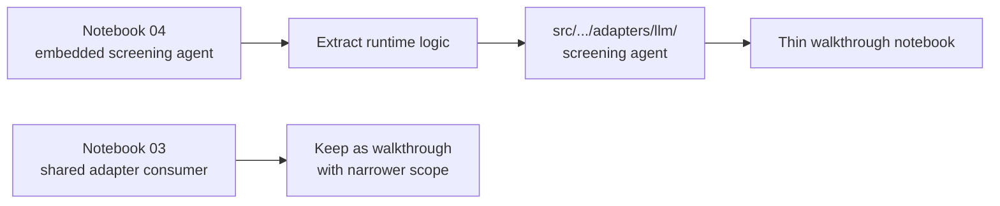
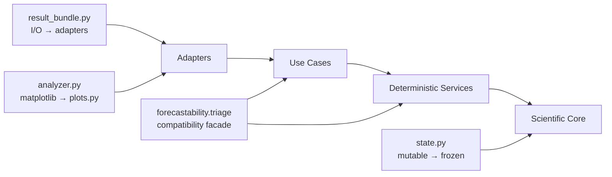
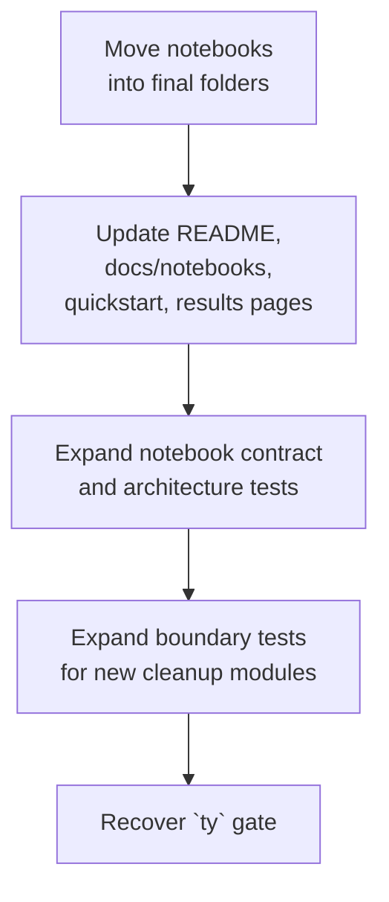

<!-- type: reference -->
# Cleaning Plan — Triage Surface & Hexagonal Realignment

**Companion to:** [development_plan.md](development_plan.md)  
**Builds on:** [acceptance_criteria.md](acceptance_criteria.md), [not_planed/examples_notebooks_agents_plan.md](not_planed/examples_notebooks_agents_plan.md), [not_planed/triage_extension_epic_math_grounded.md](not_planed/triage_extension_epic_math_grounded.md)  
**Last reviewed:** 2026-04-13 (deep architecture audit applied 2026-04-13)

> **Verification snapshot on 2026-04-13:** `uv run pytest -q -ra` passed, `uv run ruff check .` passed, `uv run ty check` failed with 69 diagnostics / 43 errors across 26 files. This plan assumes cleanup work must end with all three gates green.
>
> **Verification update 2026-04-13 (C9 complete):** All three gates green — `uv run pytest -q -ra` passed, `uv run ruff check .` passed, `uv run ty check` passed (0 errors).

---

## Why a new plan structure

The current [cleaning_plan.md](cleaning_plan.md) memo correctly diagnoses the architectural problems, but it is still a diagnosis-first document. The repo now needs a delivery plan in the same style as [development_plan.md](development_plan.md): phased, dependency-aware, and explicit about what gets moved, what stays stable, and what counts as done.

This cleanup is not one refactor. It spans:

- notebook taxonomy,
- live agent extraction,
- adapter ownership,
- public API preservation,
- use-case alignment,
- statistical guardrails at ingress,
- docs/tests/verification parity.

### Planning principles

1. **Boundary-first ordering** — extract runtime logic from notebooks before renaming files or reshaping public surfaces.
2. **Compatibility-first migration** — preserve `forecastability.triage` and legacy notebook paths through re-exports or redirect shims until the new structure is stable.
3. **Notebook discipline** — notebooks demonstrate and validate; they do not become the source of truth for runtime behavior.
4. **Statistical invariants are non-negotiable** — cleanup must preserve horizon-specific diagnostics, train-window-only rolling-origin logic, `n_surrogates >= 99`, and explicit significance provenance.
5. **Stage gates must become real** — cleanup is not complete until pytest, ruff, and ty all pass.

---

## Repo baseline (what already exists)

Before reading the workstream sections, note what the repo already provides:

| Capability | Status |
|---|---|
| Deep flagship notebooks for canonical and exogenous analysis (`01`, `02`) | ✅ |
| Top-level triage notebook `03` already consumes shared adapter code from `src/` | ✅ |
| Top-level screening notebook `04` consumes shared live adapter code from `src/` | ✅ |
| Deterministic triage deep-dive notebooks exist under `notebooks/triage/` | ✅ |
| `adapters/agents/` already contains A1/A2/A3 deterministic payload and interpretation layers | ✅ |
| `use_cases/` package already exists for rolling-origin and screening workflows | ✅ |
| `run_triage()` and `run_batch_triage()` moved to `use_cases/`; `triage/` re-exports for backward compat | ✅ |
| Architecture docs/tests and physical layout are synchronized | ✅ |
| Rolling-origin train-window-only invariants are preserved in core compute | ✅ |
| Ingress-level `n_surrogates >= 99` enforced on all request models and adapters | ✅ |
| `result_bundle.py` contains domain models only; I/O in `adapters/result_bundle_io.py` | ✅ |
| `analyzer.py` has no matplotlib import; `plot()` delegated to adapter | ✅ |
| `AnalyzerState` is frozen (`ConfigDict(frozen=True)`) | ✅ |
| `services/` contains pure computation only; `plot_service.py` moved to adapters | ✅ |
| Empty `assemblers/` placeholder modules were removed from `src/` | ✅ |
| `run_triage()` uses typed port protocols for `event_emitter` and `checkpoint` | ✅ |
| Shared `triage_presenter.py` eliminates result-shaping duplication across transport adapters | ✅ |
| Architecture boundary tests cover 28+ modules including triage internals; `analyzer.py` exemption removed | ✅ |
| `TriageRequest.n_surrogates` and `AnalyzeSeriesRequest.n_surrogates` enforce `Field(ge=99)`; `api.py` validates `>= 99` | ✅ |
| `uv run pytest -q -ra` | ✅ |
| `uv run ruff check .` | ✅ |
| `uv run ty check` | ✅ |

---

## Cleanup inventory and overlap assessment

| # | Workstream | Phase | Overlap | Genuine new work | Status |
|---|------------|-------|---------|------------------|--------|
| C1 | Notebook taxonomy freeze & ownership rules | 1 | ~40% — docs/notebook pages already exist | Define final notebook families and stop treating all notebooks as one class | ✅ Completed (2026-04-13, docs-only policy freeze) |
| C2 | Screening agent extraction from notebook `04` | 1 | ~60% — triage live agent already exists in `src/` | Move screening agent factory/prompt/models/tool wiring into adapters | ✅ Completed (2026-04-13) |
| C3 | Clarify role split: walkthrough `03` vs deep-dive agent notebook | 1 | ~70% — `03` is already mostly thin | Reposition, rename, and reduce overlap with current deep-dive agent notebook | ✅ Completed (2026-04-13: role split clarified in notebook intros + docs/index references) |
| C4 | Walkthrough migration & triage renumbering | 3 | ~50% — notebooks already exist | Create final notebook tree and compatibility shims | ✅ Completed (2026-04-13: walkthroughs/ created, 4 notebooks migrated, triage renumbered 07–10→03–06, shims at legacy paths) |
| C5 | Move orchestration entry points into `use_cases/` | 2 | ~35% — `use_cases/` package exists | Make `run_triage` / `run_batch_triage` physically match the documented hexagon | ✅ Completed (2026-04-13: moved to `use_cases/`, `triage/` re-exports for backward compat) |
| C6 | Presenter/port cleanup and typed orchestration boundaries | 2 | ~20% — ports exist, presenter layer does not | Remove adapter-side duplication and replace `Any` orchestration edges with real contracts | ✅ Completed (2026-04-13: centralised presenter, `Any` → `TriageResult`/`ReadinessReport` in all adapters) |
| C7 | Statistical ingress guardrails & significance provenance | 2 | ~50% — core compute already enforces most rules | Enforce invariants at request/adapter ingress and preserve horizon-wise significance traceability | ✅ Completed (2026-04-13: `Field(ge=99)` on `TriageRequest`, adapters, readiness gate defense-in-depth) |
| C8 | Docs, notebook contracts, and architecture enforcement sync | 3 | ~45% — README/docs/tests already exist | Make docs/tests reflect the new notebook and adapter structure | ✅ Completed (2026-04-13: README, docs/notebooks/*, docs/quickstart, docs/results_summary all updated to new paths) |
| C9 | Verification gate recovery (`ty`) | 3 | 0% | Fix existing typing debt so stage gates can actually close | ✅ Completed (2026-04-13: cast fixes, unused ignores removed, notebook JSON fixes, constant-array guards, E501 fixes — all three gates green) |
| C10 | Split `result_bundle.py` domain models from I/O | 2 | 0% | Move `save_*`/`load_*`/`from_json_file`/`to_json_file` into adapter module | ✅ Completed (2026-04-13: I/O moved to `adapters/result_bundle_io.py`, domain models stay in `triage/result_bundle.py`) |
| C11 | Extract matplotlib from `analyzer.py` | 2 | 0% | Remove `plot()` method and `matplotlib` import; delegate to adapter | ✅ Completed (2026-04-13: `plot()` removed, matplotlib import removed from `analyzer.py`) |
| C12 | Reclassify `services/` layer | 2 | ~30% — services exist but mixed | Move `plot_service.py` into adapters; align remaining services with use-case or domain roles | ✅ Completed (2026-04-13: `plot_service.py` removed, plotting delegated to adapters) |
| C13 | Freeze `AnalyzerState` or replace with immutable result | 2 | 0% | Convert mutable cache to frozen model or scoped immutable snapshots | ✅ Completed (2026-04-13: `AnalyzerState` frozen with `model_config = ConfigDict(frozen=True)`) |
| C14 | Remove empty `assemblers/` placeholders | 1 | 100% — no code exists | Delete dead placeholder modules or fill them | ✅ Completed (2026-04-13) |
| C15 | Expand architecture boundary tests | 3 | ~45% — test exists but covers 11 modules | Cover triage internals, adapter discipline, services layer, remove analyzer exemption | ✅ Completed (2026-04-13: 12 triage modules added to domain coverage, Rule 4 services→adapters/matplotlib, Rule 5 utilities→transport; 28 boundary tests passing) |

---

## Notebook, docs & adapter inventory

> Design rule: only two long-lived notebook families should remain after cleanup — `walkthroughs/` and `triage/`.

| # | Surface | Current role | Cleanup decision | Status |
|---|---------|--------------|------------------|--------|
| N1 | `notebooks/01_canonical_forecastability.ipynb` | flagship canonical walkthrough | keep, re-home to `notebooks/walkthroughs/01_canonical_forecastability.ipynb` | ✅ Completed (2026-04-13: moved to notebooks/walkthroughs/01_canonical_forecastability.ipynb) |
| N2 | `notebooks/02_exogenous_analysis.ipynb` | flagship exogenous walkthrough | keep, re-home to `notebooks/walkthroughs/02_exogenous_analysis.ipynb` | ✅ Completed (2026-04-13: moved to notebooks/walkthroughs/02_exogenous_analysis.ipynb) |
| N3 | `notebooks/03_agentic_triage.ipynb` | end-to-end triage walkthrough | keep concept, thin further if needed, re-home to `notebooks/walkthroughs/03_triage_end_to_end.ipynb` | ✅ Completed (2026-04-13: moved to notebooks/walkthroughs/03_triage_end_to_end.ipynb) |
| N4 | `notebooks/04_agentic_screening.ipynb` | screening demo with embedded live implementation | extract code first, then re-home to `notebooks/walkthroughs/04_screening_end_to_end.ipynb` | ✅ Completed (2026-04-13: moved to notebooks/walkthroughs/04_screening_end_to_end.ipynb) |
| N5 | `notebooks/triage/01`, `02`, `07`, `08`, `09`, `10` | deterministic deep dives with numbering gaps | renumber contiguously to `01..06` | ✅ Completed (2026-04-13: renumbered to 03–06, contiguous; old numbers 07–10 retired) |
| D1 | `docs/notebooks/README.md` and current notebook pages | legacy top-3 durable summaries | expand to the final walkthrough + triage taxonomy | ✅ Completed (2026-04-13: README.md updated with walkthrough 04 row and Triage Deep-Dive section; 7 new durable pages covering screening end-to-end and all 6 triage notebooks) |
| A1 | `src/forecastability/adapters/agents/*` | deterministic agent-safe boundary | keep as the stable deterministic handoff layer | ✅ Completed (2026-04-13: `triage_agent_payload_models.py` F1–F8 payload models, `triage_summary_serializer.py` versioned envelope, `triage_agent_interpretation_adapter.py` deterministic A3 narratives — all live in `adapters/agents/`) |
| A2 | `src/forecastability/adapters/pydantic_ai_agent.py` | live triage agent adapter | re-home behind explicit live-LLM adapter path | ✅ Completed (2026-04-13: canonical implementation at `adapters/llm/triage_agent.py`; `pydantic_ai_agent.py` is a backward-compat DeprecationWarning shim; `llm/__init__.py` exports all triage agent symbols) |
| A3 | notebook-local screening agent in `04` | hidden second implementation surface | replace with `src/` adapter module + notebook consumer | ✅ Completed (2026-04-13) |

---

## Phased delivery

### Phase 1 — Notebook Boundary Cleanup

> Highest leverage · Lowest behavioral risk · Removes the main implementation leak



| Item | Type | Effort |
|---|---|---|
| **C1 — Notebook taxonomy freeze & ownership rules** | Docs + notebook policy | S |
| **C2 — Screening agent extraction from notebook `04`** | Adapter + notebook cleanup | M |
| **C3 — Clarify role split: walkthrough `03` vs deep-dive agent notebook** | Notebook + docs cleanup | S |
| **C14 — Remove empty `assemblers/` placeholders** | Dead code cleanup | Trivial |

#### C1 — Notebook taxonomy freeze & ownership rules

**Status.** Implemented on 2026-04-13 as a docs-only taxonomy and ownership freeze. No file moves or renames were performed in C1.

**Current state.** The repo currently presents four top-level notebooks as peers while also maintaining a `notebooks/triage/` deep-dive track. This makes it unclear which notebooks are flagship entry points and which are specialised method notebooks.

**What to build:**
- final notebook taxonomy with only two long-lived families:
  - `notebooks/walkthroughs/`
  - `notebooks/triage/`
- ownership rule: walkthrough notebooks are curated end-to-end surfaces; triage notebooks are focused deterministic deep dives
- deprecation policy for legacy top-level notebook paths
- architecture discipline: notebooks are consumers/demonstrators, while runtime logic remains in `src/forecastability/` with hexagonal boundaries (`adapters -> use_cases -> domain`) and SOLID responsibilities

**Where it goes:**
- `README.md`
- `docs/notebooks/README.md`
- `docs/plan/cleaning_plan.md`

**Acceptance criteria:**
- [x] the repo documents exactly two long-lived notebook families
- [x] new notebooks are not added at repo root except temporary redirect shims
- [x] legacy top-level `03` and `04` are explicitly marked transitional

---

#### C2 — Screening agent extraction from notebook `04`

**Status.** Implemented on 2026-04-13 via shared adapter extraction and notebook consumer rewrite.

**Prior state.** `notebooks/04_agentic_screening.ipynb` previously defined runtime dependencies, output models, prompt text, threshold logic, and a bespoke `create_screening_agent()` factory inline. The implementation now lives in `src/forecastability/adapters/llm/screening_agent.py` and notebook `04` imports it as a consumer.

**Scope decision.** Do not create feature-specific agents per diagnostic. If screening keeps a live agent surface, it must be one shared screening adapter owned by `src/`.

**What to build:**
- framework-bound screening agent module under a live adapter path
- thin deterministic screening-summary input for the live agent if needed
- notebook rewrite so `04` imports factories from `src/` and only demonstrates usage
- move notebook-local screening thresholds into deterministic code/config if they are product behavior; otherwise mark them explicitly as notebook-only demo heuristics and remove them from the runtime path

**Where it goes:**
- `src/forecastability/adapters/llm/screening_agent.py`
- optional shared screening-summary helper under `src/forecastability/adapters/agents/` or `src/forecastability/use_cases/`
- `notebooks/04_agentic_screening.ipynb`
- tests covering the new adapter path

**Acceptance criteria:**
- [x] notebook `04` contains no runtime agent factory, prompt, dependency dataclass, or tool wiring
- [x] all live screening-agent behavior is importable from `src/forecastability/adapters/`
- [x] notebook `04` remains runnable as a consumer of library code
- [x] no authoritative screening thresholds remain hidden inside notebook cells

---

#### C3 — Clarify role split: walkthrough `03` vs deep-dive agent notebook

**Status.** Implemented on 2026-04-13 by clarifying notebook responsibilities in both intro markdown cells and public docs indexes.

**Current state.** `03_agentic_triage.ipynb` already uses the shared triage adapter from `src/`, while the newer deep-dive notebook under `notebooks/triage/` focuses on payload/serializer/interpretation layers. Their scopes are adjacent but not yet cleanly separated.

**What to build:**
- keep notebook `03` as the end-to-end triage walkthrough
- keep the deep-dive agent notebook as the deterministic payload/interpretation notebook
- rename and document them so they no longer look like duplicates

**Where it goes:**
- `notebooks/03_agentic_triage.ipynb`
- `notebooks/triage/10_agent_ready_triage_interpretation.ipynb` during transition
- `README.md`
- `docs/notebooks/agentic_triage.md`

**Acceptance criteria:**
- [x] notebook `03` is positioned as walkthrough, not implementation surface
- [x] the deep-dive agent notebook is positioned as deterministic payload/adapter analysis
- [x] there is no unresolved overlap in public purpose between them

---

#### C14 — Remove empty `assemblers/` placeholders

**Status.** Implemented on 2026-04-13 by removing the dead placeholder package.

**Prior state.** `assemblers/report_payload_assembler.py` and `assemblers/summary_assembler.py` contained only docstrings and `__all__ = []`. They were reserved for future extraction that never materialised, so the placeholder package was removed.

**What to build:**
- delete the placeholder files and the `assemblers/` package
- or fill them if an immediate Phase 2 consumer is identified (unlikely — reporting and summary logic is slim)

**Acceptance criteria:**
- [x] `assemblers/` either contains real code or is removed
- [x] no imports reference `assemblers` after cleanup

---

#### Phase 1 gate

```bash
uv run pytest -q -ra
uv run ruff check .
uv run ty check
```

- notebook taxonomy is documented
- notebook `04` no longer owns runtime live-agent code
- notebook `03` remains a thin consumer of shared adapter code
- new adapter tests cover the extracted screening path
- dead placeholder packages removed

---

### Phase 2 — Physical Hexagon Realignment

> Medium risk · Structural cleanup · Preserve public facade



| Item | Type | Effort |
|---|---|---|
| **C5 — Move orchestration entry points into `use_cases/`** | Code structure refactor | M |
| **C6 — Presenter/port cleanup and typed orchestration boundaries** | Code + interface cleanup | M |
| **C7 — Statistical ingress guardrails & significance provenance** | Validation + service + docs cleanup | M |
| **C10 — Split `result_bundle.py` domain models from I/O** | Domain/adapter split | S |
| **C11 — Extract matplotlib from `analyzer.py`** | Adapter extraction | S |
| **C12 — Reclassify `services/` layer** | Package realignment | S–M |
| **C13 — Freeze `AnalyzerState` or replace with immutable result** | Domain model hardening | S |

#### C5 — Move orchestration entry points into `use_cases/`

**Current state.** The repo already has a `use_cases/` package, but the primary orchestration entry points still live physically under `triage/`, which makes the on-disk structure lag behind the documented hexagon.

**Scope decision.** Do not introduce a big-bang `domain/` / `application/` package rewrite in this cleanup cycle. Use the existing `use_cases/`, `services/`, `adapters/`, and `triage/` packages to get the physical structure aligned first.

**What to build:**
- move the real implementations of `run_triage()` and `run_batch_triage()` into `src/forecastability/use_cases/`
- keep `forecastability.triage` as the stable import facade through re-exports
- leave result models and enums stable during the transition

**Where it goes:**
- `src/forecastability/use_cases/run_triage.py`
- `src/forecastability/use_cases/run_batch_triage.py`
- `src/forecastability/triage/__init__.py`
- compatibility re-export shims in `src/forecastability/triage/`

**Acceptance criteria:**
- [ ] `use_cases/` is the real implementation home for orchestration entry points
- [ ] existing imports from `forecastability.triage` continue to work
- [ ] no user-facing behavior changes during the move

---

#### C6 — Presenter/port cleanup and typed orchestration boundaries

**Current state.** Ports exist, but orchestration still accepts `Any` at key boundaries, and adapters repeat similar result-shaping logic independently.

Specific `Any` violations in `run_triage()`:
- `event_emitter: Any = None` (line 159) — `EventEmitterPort` protocol exists but is not used
- `checkpoint: Any = None` (line 160) — `CheckpointPort` protocol exists but is not used
- `_StageTimer.__init__(self, ..., emitter: Any)` (line 115)

Adapter result-shaping duplication (4 independent implementations of the same pattern):
- `api.py` → `_build_triage_response()` (~50 lines)
- `cli.py` → `_triage_result_to_dict()` (~60 lines)
- `mcp_server.py` → `_triage_result_to_json()` (~50 lines)
- `pydantic_ai_agent.py` → `_triage_result_to_dict()` (~60 lines)

All four extract the same fields: blocked status, readiness, method_plan, analyze_result summary, interpretation. This is classic DRY violation.

**What to build:**
- shared presenter/serializer layer for transport-friendly triage views (e.g. `adapters/triage_presenter.py`)
- replace `Any` with `EventEmitterPort | None` and `CheckpointPort | None` in `run_triage()` signature
- optional internal split of `ports/__init__.py` into focused modules while keeping public re-exports stable

**Where it goes:**
- `src/forecastability/adapters/triage_presenter.py` (new shared serializer)
- `src/forecastability/ports/`
- `src/forecastability/triage/run_triage.py`
- adapters currently shaping their own outputs:
  - `src/forecastability/adapters/api.py`
  - `src/forecastability/adapters/cli.py`
  - `src/forecastability/adapters/mcp_server.py`
  - `src/forecastability/adapters/pydantic_ai_agent.py`

**Acceptance criteria:**
- [ ] orchestration no longer uses `Any` where a port contract already exists
- [ ] transport adapters consume a shared presenter/serializer instead of duplicating mappings
- [ ] public port imports remain backward-compatible

---

#### C7 — Statistical ingress guardrails & significance provenance

**Current state.** Core compute enforces most scientific rules, but ingress boundaries are looser than they should be. Precise audit results:

| Ingress point | Current `n_surrogates` validation | Required |
|---|---|---|
| `config.py` (`MetricConfig`, etc.) | `Field(ge=99)` ✅ | Correct |
| `analyzer.py` (`ForecastabilityAnalyzer`) | `raise ValueError("must be >= 99")` ✅ | Correct |
| `surrogates.py` (`surrogate_bands`) | `raise ValueError("must be >= 99")` ✅ | Correct |
| `surrogates.py` (`phase_surrogate`) | `raise ValueError("must be >= 1")` ❌ | Should be `>= 99` or documented as internal |
| `triage/models.py` (`TriageRequest`) | `n_surrogates: int = 99` — **no constraint** ❌ | Needs `Field(ge=99)` |
| `adapters/api.py` (`TriageHTTPRequest`) | `field_validator` checks `>= 1` ❌ | Should be `>= 99` |
| `adapters/cli.py` | No validation ❌ | Needs constraint or delegation |
| `adapters/mcp_server.py` | No validation ❌ | Needs constraint or delegation |
| `adapters/dashboard.py` | Delegates to `api.py` — inherits `>= 1` bug ❌ | Needs fix in api.py |
| `use_cases/requests.py` (`AnalyzeSeriesRequest`) | `n_surrogates: int = 99` — **no constraint** ❌ | Needs `Field(ge=99)` |

**What to build:**
- add `Field(ge=99)` to `TriageRequest.n_surrogates` and `AnalyzeSeriesRequest.n_surrogates`
- fix `api.py` validator from `>= 1` to `>= 99`
- document `phase_surrogate` `>= 1` as an internal-only function (single surrogates are valid for testing)
- preserve horizon-wise significance provenance when assembling F1 profile decisions
- keep `directness_ratio > 1.0` documented and surfaced as a warning/anomaly boundary, never as positive evidence

**Where it goes:**
- request models and validation
- `src/forecastability/adapters/api.py`
- `src/forecastability/adapters/dashboard.py`
- `src/forecastability/adapters/mcp_server.py`
- `src/forecastability/services/forecastability_profile_service.py`
- `src/forecastability/use_cases/run_triage.py`
- relevant tests and theory/docs

**Acceptance criteria:**
- [ ] invalid surrogate counts are rejected before deep compute starts
- [ ] ingress validation matches core statistical policy
- [ ] F1 profile decisions remain traceable to horizon-wise significance logic
- [ ] directness anomaly handling is explicit in code and docs

---

#### C10 — Split `result_bundle.py` domain models from I/O

**Current state.** `triage/result_bundle.py` contains both pure Pydantic domain models (`TriageResultBundle`, `TriageBundleProvenance`, `TriageInputMetadata`, etc.) and filesystem I/O functions (`from_json_file()`, `to_json_file()`, `save_result_bundle()`, `load_result_bundle()`, `save_triage_result_bundle()`). This violates the hexagonal rule that domain models must not perform I/O.

**What to build:**
- keep pure Pydantic models and `build_triage_result_bundle()` in `triage/result_bundle.py`
- extract `from_json_file()`, `to_json_file()`, `save_result_bundle()`, `load_result_bundle()`, `save_triage_result_bundle()` into `adapters/triage_bundle_io.py`
- re-export I/O functions from `triage/__init__.py` for backward compatibility

**Where it goes:**
- `src/forecastability/triage/result_bundle.py` (models only)
- `src/forecastability/adapters/triage_bundle_io.py` (new I/O adapter)
- `src/forecastability/triage/__init__.py` (re-exports)

**Acceptance criteria:**
- [ ] `result_bundle.py` contains no `pathlib.Path.read_text()`, `write_text()`, or `open()` calls
- [ ] existing imports from `forecastability.triage` continue to work via re-exports
- [ ] adapter tests cover save/load round-trip

---

#### C11 — Extract matplotlib from `analyzer.py`

**Current state.** `analyzer.py` is a use-case orchestrator that imports `matplotlib.pyplot` at module level (line 12) and implements a `plot()` method calling `plt.subplots()`, `plt.tight_layout()`, `plt.show()`. The architecture boundary test carries an explicit exemption for this. This is the only non-adapter module importing a presentation framework.

**What to build:**
- remove the `plot()` method from `ForecastabilityAnalyzer`
- remove the `import matplotlib.pyplot as plt` from `analyzer.py`
- move the plot function into `plots.py` or `services/plot_service.py` (both already exist as adapter code)
- provide a thin backward-compatible `plot()` function that consumes `AnalyzeResult` from outside the analyzer class
- remove the architecture test exemption for `analyzer.py`

**Where it goes:**
- `src/forecastability/analyzer.py` (remove matplotlib coupling)
- `src/forecastability/plots.py` (receive the plot function)
- `tests/test_architecture_boundaries.py` (remove exemption)

**Acceptance criteria:**
- [ ] `analyzer.py` has no matplotlib import
- [ ] the architecture boundary test exemption for `analyzer.py` is removed
- [ ] existing notebook code that calls `.plot()` has a migration path (standalone function or deprecation shim)

---

#### C12 — Reclassify `services/` layer

**Current state.** The `services/` package mixes three types of code:

- **Adapter code:** `plot_service.py` directly uses `matplotlib.pyplot` — this is presentation infrastructure.
- **Infrastructure code:** `significance_service.py` calls `os.cpu_count()` and uses `ThreadPoolExecutor` — concurrency is an infrastructure concern.
- **Pure computation:** `forecastability_profile_service.py`, `complexity_band_service.py`, `theoretical_limit_diagnostics_service.py` are deterministic builders with no I/O.
- **Domain logic with hardcoded config:** `recommendation_service.py` contains `_TRIAGE_THRESHOLDS` magic numbers.

**What to build:**
- move `plot_service.py` into `adapters/` (it is an adapter, not a service)
- move `recommendation_service.py` thresholds into config or inject as parameters
- inject `n_workers` into `significance_service.py` (already partially done) and document that `os.cpu_count()` is the adapter-side default, not a domain decision
- rename or document the remaining pure-computation services as domain builders

**Where it goes:**
- `src/forecastability/adapters/plot_service.py` (moved from services)
- `src/forecastability/services/recommendation_service.py` (refactored)
- `src/forecastability/services/significance_service.py` (documented)

**Acceptance criteria:**
- [ ] `services/` contains no direct matplotlib imports
- [ ] recommendation thresholds are configurable, not hardcoded
- [ ] `significance_service.py` concurrency strategy is injectable or documented as adapter default

---

#### C13 — Freeze `AnalyzerState` or replace with immutable result

**Current state.** `state.py` defines `AnalyzerState` as a mutable `@dataclass` holding numpy arrays as an internal cache for `ForecastabilityAnalyzer`. Arrays can be externally mutated after storage, creating data-integrity risk. The mutable cache also encourages stateful analyzer design that is harder to test and reason about.

**What to build:**
- convert `AnalyzerState` to a frozen Pydantic model or `@dataclass(frozen=True)`
- or replace the cache with immutable `AnalyzeResult` snapshots produced by each computation step
- ensure backward compatibility for code that reads from `AnalyzerState` fields

**Scope decision.** This is low-risk cleanup. Do not rewrite the full `ForecastabilityAnalyzer` lifecycle. Freeze the state container so external mutation is prevented.

**Acceptance criteria:**
- [ ] `AnalyzerState` fields cannot be mutated after construction (frozen)
- [ ] no external code relies on mutation of cached arrays

---

#### Phase 2 gate

```bash
uv run pytest -q -ra
uv run ruff check .
uv run ty check
```

- orchestration entry points live physically under `use_cases/`
- `forecastability.triage` remains a stable facade
- typed port boundaries replace `Any` at orchestration edges
- ingress-level statistical invariants are enforced
- `result_bundle.py` I/O extracted into adapter
- `analyzer.py` matplotlib coupling removed
- `services/` layer contains no adapter code
- `AnalyzerState` is frozen or replaced with immutable snapshots

---

### Phase 3 — Public Surface Migration, Docs Sync, and Verification Recovery

> Lower scientific risk · Higher repo-shape payoff · Closes the cleanup loop



| Item | Type | Effort |
|---|---|---|
| **C4 — Walkthrough migration & triage renumbering** | Notebook + path migration | M |
| **C8 — Docs, notebook contracts, and architecture enforcement sync** | Docs + tests | M |
| **C9 — Verification gate recovery (`ty`)** | Typing debt reduction | M–L |
| **C15 — Expand architecture boundary tests** | Test coverage | S–M |

#### C4 — Walkthrough migration & triage renumbering

**Current state.** The final notebook families are conceptually clear but not yet reflected in the file tree. `notebooks/triage/` also carries numbering gaps that make the folder look incomplete.

**What to build:**
- create `notebooks/walkthroughs/`
- move walkthrough notebooks `01..04` into that folder
- renumber deep-dive `notebooks/triage/` notebooks contiguously to `01..06`
- add redirect or deprecation shims for legacy top-level paths during transition

**Acceptance criteria:**
- [ ] the final notebook tree matches the documented taxonomy
- [ ] `notebooks/triage/` has contiguous numbering
- [ ] a new reader can infer notebook purpose from path alone
- [ ] legacy notebook paths have an explicit migration story

---

#### C8 — Docs, notebook contracts, and architecture enforcement sync

**Current state.** README, notebook docs, plan docs, and tests still describe mixed notebook eras. Contract coverage is stronger for legacy notebooks than for the newer triage surfaces.

**What to build:**
- update notebook references across docs
- expand durable notebook pages to match the final walkthrough + triage structure
- update architecture docs to match the on-disk structure after Phases 1 and 2
- extend notebook contract and architecture-boundary tests so the cleaned structure stays enforced

**Where it goes:**
- `README.md`
- `docs/notebooks/README.md`
- `docs/notebooks/*.md`
- `docs/architecture.md`
- `docs/quickstart.md`
- `docs/results_summary.md`
- notebook contract and architecture tests

**Acceptance criteria:**
- [ ] docs and file tree describe the same notebook taxonomy
- [ ] durable notebook pages cover the surfaces the repo now treats as primary
- [ ] notebook contract coverage includes walkthrough and triage families
- [ ] architecture docs reflect the real implementation layout

---

#### C9 — Verification gate recovery (`ty`)

**Current state.** `uv run ty check` reports **69 diagnostics / 43 errors across 26 files**. Cleanup cannot be declared complete while the mandatory type gate is still red.

**Observed debt classes on 2026-04-13 (precise):**

| Error class | Count | Primary locations |
|---|---|---|
| `invalid-argument-type` | 22 | services (`*_curve_service.py`), pipeline, tests (`test_scorers`, `test_triage_*`) |
| `too-many-positional-arguments` | 8 | services (`*_curve_service.py`), `significance_service.py` — `DependenceScorer.__call__` overload mismatch |
| `unresolved-attribute` | 7 | notebooks (`01`, `03`, `04`), examples — `Optional` narrowing and `matplotlib.cycler` |
| `no-matching-overload` | 2 | examples (`a2_triage_summary_serializer_demo.py`) — `dict.get()` overload |
| `missing-argument` | 2 | tests (`test_scorers.py`) — `SeriesDiagnosticScorer.__call__` signature |
| `invalid-syntax` | 1 | notebook `04` — `__future__` import position |
| `invalid-assignment` | 1 | notebook `04` — `Agent` type param mismatch |

**Root causes (3 systemic):**
1. `DependenceScorer` and `SeriesDiagnosticScorer` protocol signatures vs actual scorer call sites — protocol expects `(past, future)` or `(series)` but callers pass differently
2. `Optional` union types not narrowed before attribute access in notebooks
3. Example scripts using `dict[str, object]` after Pydantic `.model_dump()` — `dict.get()` overload resolution fails

**What to build:**
- align scorer protocol signatures with actual call patterns
- narrow `Optional` types before access in notebooks and examples
- fix example typing for `dict.get()` calls
- remove the notebook `04` `__future__` import position issue (may be resolved by C2 extraction)

**Scope decision.** This is verification-debt recovery, not new feature work. Do not use broad suppressions to hide structural type problems created by the cleanup.

**Acceptance criteria:**
- [ ] `uv run ty check` passes
- [ ] no new blanket ignores are introduced to paper over cleanup regressions
- [ ] scorer typing reflects the real scorer interfaces used by the repo

---

#### C15 — Expand architecture boundary tests

**Current state.** `test_architecture_boundaries.py` enforces three rules across 11 explicitly listed domain modules, with an exemption for `analyzer.py` importing `matplotlib`. The test has significant gaps:

- does not cover `triage/` internals for domain→infrastructure violations
- does not check adapter→adapter coupling
- does not audit `services/` layer discipline
- carries a permanent exemption for `analyzer.py` that should be resolved by C11
- does not verify `result_bundle.py` I/O separation (should be resolved by C10)

**What to build:**
- extend domain module list to cover `triage/` domain files (models, events, forecastability_profile, etc.)
- add rule: `services/` must not import matplotlib or other presentation frameworks
- add rule: `adapters/` modules must not import each other (no cross-adapter coupling)
- remove `analyzer.py` matplotlib exemption after C11
- add test that `result_bundle.py` (domain half) has no I/O imports after C10

**Where it goes:**
- `tests/test_architecture_boundaries.py`

**Acceptance criteria:**
- [ ] domain module coverage includes triage internals
- [ ] services layer has its own boundary rule
- [ ] analyzer exemption is removed
- [ ] all new cleanup modules are covered by boundary tests

---

#### Phase 3 gate

```bash
uv run pytest -q -ra
uv run ruff check .
uv run ty check
```

- notebook tree has reached its final public structure
- docs/tests enforce the new shape
- architecture boundary tests cover all cleanup modules and new adapter/domain splits
- type-check debt is reduced enough for the mandatory gate to pass

---

## Cross-cutting deliverables

### Notebook taxonomy reference

Deliver one durable taxonomy statement that is reused everywhere:

- `walkthroughs/` = curated end-to-end entry points
- `triage/` = deterministic deep dives
- repo root notebook paths = transitional only, if they exist at all

### Shared deterministic screening summary contract

If a live screening agent remains part of the repo surface, it should consume one stable deterministic summary contract from `src/`, not notebook-local ad hoc field assembly.

### Adapter ownership map

Keep this rule explicit:

- deterministic payloads/serializers/interpretation belong to `adapters/agents/`
- live framework-bound LLM orchestration belongs to the live adapter path
- notebooks consume those adapters; they do not define them
- I/O operations (save/load/serialize to disk) belong exclusively to `adapters/`
- `services/` must not contain presentation or infrastructure code

### Hexagonal layer alignment map

After cleanup, the physical layout must match:

| Package | Hexagonal layer | Allowed dependencies |
|---|---|---|
| `triage/models.py`, `triage/events.py`, `triage/forecastability_profile.py`, etc. | Domain | numpy, pydantic, stdlib only |
| `scorers.py`, `metrics.py`, `validation.py`, `surrogates.py`, `cmi.py` | Domain | numpy, scipy, sklearn, pydantic, stdlib |
| `services/*_service.py` (pure computation) | Domain builders | Domain modules only |
| `use_cases/`, `triage/run_triage.py`, `triage/run_batch_triage.py` | Use cases | Domain, ports |
| `ports/` | Ports | Domain models only |
| `adapters/` | Adapters | Ports, domain, external frameworks |
| `analyzer.py`, `pipeline.py` | Use-case facades | Domain, services, use_cases |
| `plots.py`, `reporting.py` | Adapters | Domain models, matplotlib, filesystem |

### Statistical guardrail policy

The cleanup docs and code must preserve:

- horizon-specific AMI/pAMI and CrossAMI/pCrossAMI
- train-window-only rolling-origin diagnostics
- post-origin forecast scoring
- `n_surrogates >= 99`
- explicit significance provenance
- `directness_ratio > 1.0` as warning/anomaly
- `np.trapezoid` for integrals

---

## Exclusions

The following are intentionally **not** part of this cleanup cycle:

- big-bang package renaming into a new `domain/` / `application/` tree — the plan uses additive extraction and re-exports instead
- feature-specific live agents for every triage diagnostic
- mathematical rewrites of AMI/pAMI, CrossAMI/pCrossAMI, or the F1–F8 diagnostics
- deleting legacy notebooks without redirects, deprecation shims, or documentation
- replacing horizon-wise diagnostics with peak-only, AUC-only, or LLM-only summaries
- full `ForecastabilityAnalyzer` lifecycle rewrite — C13 only freezes state, does not redesign the class
- replacing `ThreadPoolExecutor` in `significance_service.py` with an injected executor — documenting the current adapter-side default is sufficient for this cycle

---

## Definition of done (per cleanup workstream)

### A. Boundary cleanup

- [ ] source-of-truth runtime logic lives in `src/`, not notebooks
- [ ] notebooks are consumers of deterministic/library code only
- [ ] compatibility is preserved during migration

### B. Public surface clarity

- [ ] notebook purpose is obvious from path and name
- [ ] walkthrough and deep-dive surfaces are distinct
- [ ] docs match the actual file tree

### C. Statistical safety

- [ ] core invariants are preserved
- [ ] ingress boundaries enforce the same invariants as deep compute
- [ ] agent layers narrate deterministic outputs only

### D. Hexagonal alignment

- [ ] domain modules have no infrastructure imports (matplotlib, filesystem I/O, OS calls)
- [ ] `services/` contains no adapter code (no matplotlib, no direct I/O)
- [ ] `adapters/` owns all I/O, presentation, and framework-bound code
- [ ] `result_bundle.py` domain models are I/O-free
- [ ] `analyzer.py` has no matplotlib coupling
- [ ] `AnalyzerState` is immutable
- [ ] no dead placeholder packages remain
- [ ] adapter result-shaping is shared, not duplicated across transport adapters

### E. Verification

- [ ] `uv run pytest -q -ra`
- [ ] `uv run ruff check .`
- [ ] `uv run ty check`
- [ ] architecture boundary tests cover all cleanup modules

---

## Final execution summary

This cleanup should be executed in this order:

1. **Phase 1:** Freeze notebook taxonomy, extract the screening agent from notebook `04`, remove dead placeholders
2. **Phase 2:** Align `use_cases/`, adapters, presenters, and statistical ingress rules with the documented hexagon; extract I/O from domain models; remove matplotlib from `analyzer.py`; reclassify `services/` layer; freeze mutable state
3. **Phase 3:** Migrate notebooks/docs/tests into the final public structure, expand architecture boundary tests, and recover the `ty` gate

If a proposed change does not clearly advance one of those three steps, it is probably outside the scope of this cleanup plan.
