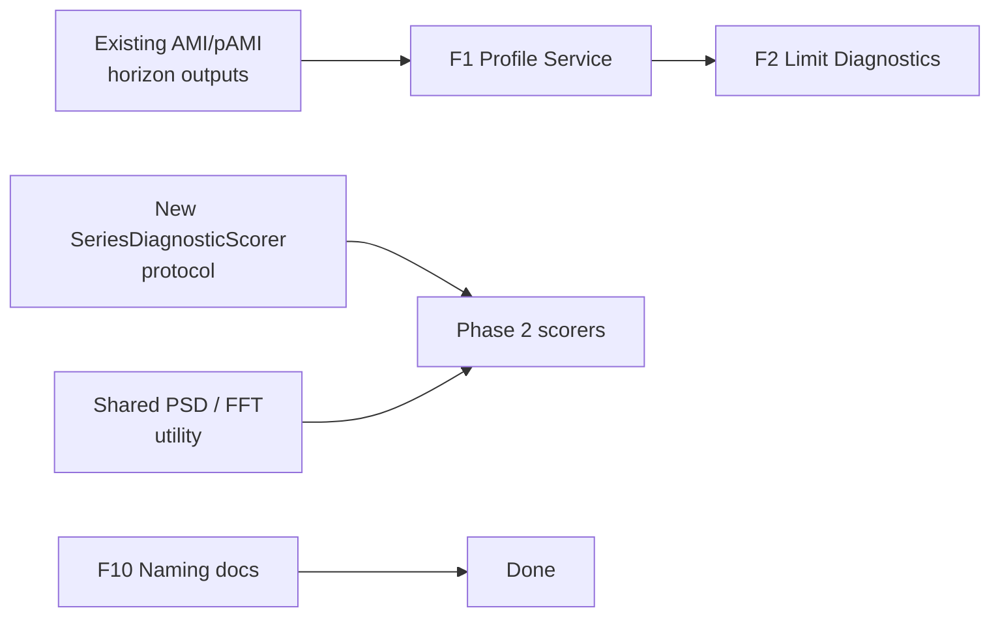
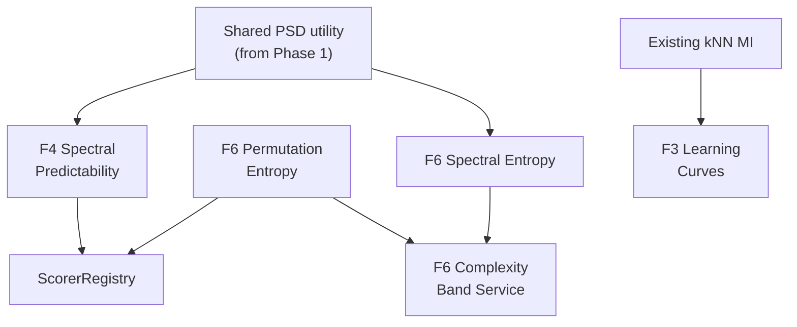
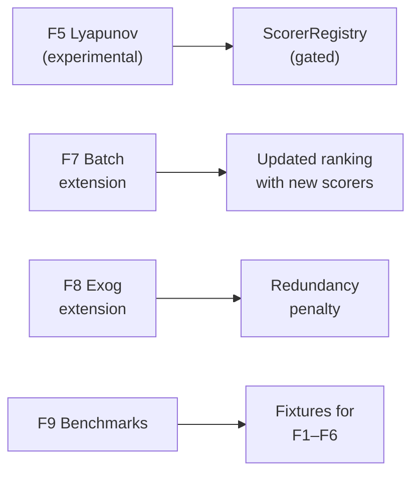

<!-- type: reference -->
# Development Plan — Triage Extension

**Replaces:** MoSCoW plan (removed)
**Source epic:** [`not_planed/triage_extension_epic_math_grounded.md`](not_planed/triage_extension_epic_math_grounded.md)
**Last reviewed:** 2026-04-12 (F1 implemented 2026-04-12)

---

## Why a new plan structure

The MoSCoW categories served the initial baseline delivery well—`must_have` and
`should_have` are now complete. The remaining work is a coordinated extension of the
deterministic triage layer: ten features with shared infrastructure, real code
dependencies between them, and varying statistical risk. A phased dependency-aware
plan is a better fit than loose priority buckets.

### Planning principles

1. **Dependency-first ordering** — features that produce shared infrastructure ship
   before features that consume it.
2. **Risk-gated delivery** — high-risk estimators ship behind explicit experimental
   flags and never auto-influence triage decisions.
3. **Overlap honesty** — features already substantially implemented are scoped as
   incremental enhancements, not new epics.
4. **Stage gates** — each phase ends with a verification gate before the next begins.

---

## Repo baseline (what already exists)

Before reading the per-feature sections, note what the repo already provides:

| Capability | Status |
|---|---|
| 4-stage deterministic triage pipeline (readiness → routing → compute → interpretation) | ✅ |
| Pluggable scorer registry (MI, Pearson, Spearman, Kendall, distance corr.) | ✅ |
| Batch triage with per-series error isolation and composite ranking | ✅ |
| Exogenous screening workbench with keep / review / reject flow | ✅ |
| Result bundles with SHA-256 provenance | ✅ |
| Checkpointing + event emission | ✅ |
| 9 hexagonal port protocols | ✅ |
| 64+ triage-specific tests | ✅ |
| Interpretation: forecastability class, directness class, modelling regime | ✅ |

---

## Feature inventory and overlap assessment

| # | Feature | Phase | Overlap | Genuine new work | Status |
|---|---------|-------|---------|------------------|--------|
| F1 | Forecastability Profile & Informative Horizon Set | 1 | ~20 % — class label exists; formal profile object does not | New domain model + application service | ✅ Done |
| F2 | Information-Theoretic Limit Diagnostics | 1 | ~5 % | New service + DPI / compression warnings | Not started |
| F10 | Permutation-AMI Naming Cleanup | 1 | 100 % — convention already followed | Documentation-only | ✅ Done (convention already followed; theory doc confirms naming) |
| Infra | `SeriesDiagnosticScorer` protocol | 1 | — | New protocol alongside `DependenceScorer` | Not started |
| Infra | Shared PSD / FFT utility | 1 | — | Deterministic PSD helper for F4, F6 | Not started |
| F6 | Entropy-Based Complexity Triage | 2 | 0 % (shares PSD with F4) | New scorer(s) + complexity-band service | Not started |
| F4 | Spectral Predictability | 2 | 0 % | New scorer + shared PSD utility | Not started |
| F3 | Predictive Information Learning Curves | 2 | 0 % | New service, new estimator (multi-dim MI) | Not started |
| F5 | Largest Lyapunov Exponent | 3 | 0 % | New experimental scorer | Not started |
| F7 | Batch Multi-Signal Ranking | 3 | ~85 % — `run_batch_triage()` exists | Incremental: add new-scorer columns | Not started |
| F8 | Enhanced Exogenous Screening | 3 | ~80 % — screening workbench exists | Incremental: add inter-driver redundancy penalty | Not started |
| F9 | Benchmark & Reproducibility Expansion | 3 | Infrastructure exists | Fixture creation for F1–F6 outputs | Not started |

---

## Phased delivery

### Phase 1 — Foundation & Profile Assembly

> Low risk · High value · No new estimators



| Item | Type | Effort |
|---|---|---|
| **F1 — Forecastability Profile** | New domain model `ForecastabilityProfile` + application service | S–M |
| **F2 — IT Limit Diagnostics** | New domain model `TheoreticalLimitDiagnostics` + service; exploitation ratio as `supported: bool = False` placeholder only | S |
| **F10 — Naming cleanup** | Documentation-only | Trivial |
| **Infra: `SeriesDiagnosticScorer` protocol** | New protocol alongside existing `DependenceScorer`; separates univariate diagnostics from bivariate dependence | S |
| **Infra: shared PSD / FFT utility** | Deterministic PSD helper in domain layer, used by F4 and F6 in Phase 2 | S |

#### F1 — Forecastability Profile & Informative Horizon Set

**Paper:** Catt (2026), `arXiv:2603.27074`

**Core math.** For forecast target $Y_{t+h}$ and information set $\mathcal{I}_t$:

$$F(h;\,\mathcal{I}_t) = I(Y_{t+h};\,\mathcal{I}_t) = H(Y_{t+h}) - H(Y_{t+h} \mid \mathcal{I}_t)$$

The **forecastability profile** is the map $h \mapsto F(h;\,\mathcal{I}_t)$ over
$h \in \{1,\dots,H\}$.

The **informative horizon set** is:

$$\mathcal{H}_\varepsilon = \bigl\{h : F(h;\,\mathcal{I}_t) \ge \varepsilon\bigr\}$$

> [!IMPORTANT]
> Define $\varepsilon$ relative to the surrogate upper band, not as an absolute
> constant. An absolute threshold risks admitting noise lags or rejecting useful
> ones.

**What to build:**
- Domain model `ForecastabilityProfile` with fields: `horizons`, `values`, `epsilon`,
  `informative_horizons`, `peak_horizon`, `is_non_monotone`, `summary`.
- Application service `ForecastabilityProfileService` that consumes existing
  horizon-wise MI outputs + config → `ForecastabilityProfile`.
- Recommendation vector: `model_now`, `review_horizons`, `avoid_horizons`.
- Data-processing inequality diagnostic: $F(h;\,T(\mathcal{I}_t)) \le F(h;\,\mathcal{I}_t)$.

**Architectural slot:** New application service + domain model. Not a scorer—output
is a structured profile, not a scalar.

**Where it goes:**
- `src/forecastability/domain/models/forecastability_profile.py`
- `src/forecastability/services/forecastability_profile_service.py`

**Statistical notes:**
- Inherits reliability of existing kNN MI estimator—no new estimation.
- Non-monotone profiles are expected (e.g. seasonal processes); do not treat
  non-monotonicity as an error.

**Example requirements:**
- Synthetic seasonal process (non-monotone profile).
- Simple AR process (smoothly decaying profile).
- Script prints horizons, values, informative set, recommendations.

**Theory-doc deliverable:**
`docs/theory/forecastability_profile.md` — formula, informative horizon set,
DPI warning, estimator reuse note.

**Acceptance criteria:**
- [x] No breaking changes to current AMI/pAMI outputs
- [x] Profile fully derived from deterministic core outputs
- [x] Integrated into `TriageResult` output
- [x] Example runs end-to-end
- [x] Theory doc cites Catt and explains the equations

---

#### F2 — Information-Theoretic Limit Diagnostics

**Paper:** Catt (2026), `arXiv:2603.27074`

**Core math.** Under log loss the maximum predictive improvement from
$\mathcal{I}_t$ is mutual information:

$$\mathbb{E}[-\log q_h(Y_{t+h} \mid \mathcal{I}_t)]
  = H(Y_{t+h} \mid \mathcal{I}_t)
  + \mathbb{E}\bigl[D_{\mathrm{KL}}(p_h^* \parallel q_h)\bigr]$$

The **exploitation ratio** is:

$$\chi_q(h;\,\mathcal{I}_t) = \frac{X_q(h;\,\mathcal{I}_t)}{F(h;\,\mathcal{I}_t)}$$

> [!WARNING]
> The MI ceiling holds strictly under log loss. Mapping to sMAPE or MSE
> requires distributional assumptions. Do not introduce a fake post-model
> metric.

**Scope decision:** This repo is pre-model and deterministic. Implement theoretical
ceiling diagnostics now. Exploitation ratio stays as schema placeholder
(`supported: False`) until a proper model-evaluation layer exists.

**What to build:**
- Domain model `TheoreticalLimitDiagnostics` with fields:
  `forecastability_ceiling_by_horizon`, `ceiling_summary`,
  `compression_warning`, `dpi_warning`, `exploitation_ratio_supported`.
- Service `TheoreticalLimitDiagnosticsService`.
- Warning logic for likely information-destroying transforms
  (aggregation, downsampling, lossy compression).

**Acceptance criteria:**
- [ ] `run_triage()` can output theoretical ceiling wording
- [ ] Exploitation ratio is not implemented (placeholder only)
- [ ] Documentation clearly separates possibility from realisation

---

#### Infra: `SeriesDiagnosticScorer` protocol

The current `DependenceScorer` protocol takes `(past, future, *, random_state) → float`.
Spectral predictability (F4), Lyapunov (F5), and permutation entropy (F6) operate on
a single series, not a (past, future) pair.

**Decision:** Introduce a `SeriesDiagnosticScorer` protocol (ISP compliance) rather
than forcing univariate diagnostics through a bivariate interface. Register both
types in `ScorerRegistry` with a `kind` discriminator.

---

#### Phase 1 gate

```bash
uv run pytest -q -ra
uv run ruff check .
uv run ty check
```

- F1 + F2 integrated into `run_triage()` output
- Profile accessible from `TriageResult`
- Theory docs written for both features
- `SeriesDiagnosticScorer` protocol defined and tested
- PSD utility implemented with unit tests

---

### Phase 2 — New Deterministic Scorers

> Medium risk · Expands diagnostic surface · New computation



| Item | Type | Effort |
|---|---|---|
| **F6 — Entropy-Based Complexity** | New scorer(s) + complexity-band interpretation service | M |
| **F4 — Spectral Predictability** | New scorer using Phase 1 PSD utility | S |
| **F3 — Predictive Info Learning Curves** | New application service (reuses MI estimator) | M |

> [!NOTE]
> F6 is ordered before F4 here because permutation entropy is cheaper,
> more robust, and has higher complementarity with AMI than spectral
> predictability alone. The spectral entropy component of F6 shares PSD
> code with F4.

#### F6 — Entropy-Based Complexity Triage

**Paper:** Ponce-Flores et al. (2020), Bandt & Pompe (2002)

**Core math.** For ordinal patterns of embedding order $m$ with probabilities $p(\pi)$:

$$H_{\mathrm{perm}} = -\sum_{\pi} p(\pi)\,\log p(\pi)$$

Normalised: $H_{\mathrm{perm}}^{\mathrm{norm}} = H_{\mathrm{perm}} / \log(m!)$

The PE + spectral entropy plane separates periodic, chaotic, and stochastic regimes.

**Statistical assessment:**
- **Reliability: High** — distribution-free, robust to outliers, monotone-invariant.
- **Sample-size:** $n \geq 1000$ for $m=5$; $n \geq 100$ for $m=3$ (coarser).
  For $n = 200$, cap at $m \leq 4$.
- **Risk:** Tie-breaking rule must be fixed and documented. PE is amplitude-blind.

**What to build:**
- `PermutationEntropyScorer` implementing `SeriesDiagnosticScorer`.
- Optional `SpectralEntropyScorer` (reuses F4 PSD utility).
- `ComplexityBandService` mapping (PE, spectral entropy) → `low` / `medium` / `high`.

**Acceptance criteria:**
- [ ] Low overhead
- [ ] Clear separation between estimator and interpretation
- [ ] Works as complementary triage—never sole decision-maker
- [ ] Tie-breaking rule documented

---

#### F4 — Spectral Predictability

**Paper:** Wang et al. (2025), `arXiv:2507.13556`

**Core math.** Given normalised PSD weights $p_i$, spectral entropy is:

$$H_a = -\sum_i p_i \log_a p_i$$

Normalised predictability:

$$\Omega(\mathbf{y}) = 1 - \frac{H_a(\mathbf{y})}{\log_a(N_{\mathrm{bins}})}$$

> [!WARNING]
> Normalise by number of frequency bins, not $\log_a(n)$. The latter
> makes the metric sample-size-dependent.

**Statistical assessment:**
- **Reliability: High** — use Welch or multitaper; $n \geq 128$.
- **Complementarity: Moderate** — captures linear predictability. Divergence
  between $\Omega$ and AMI signals nonlinearity.
- **Risk:** Raw periodogram is inconsistent. Non-stationary series need
  detrending / windowing.

**What to build:**
- `SpectralPredictabilityScorer` implementing `SeriesDiagnosticScorer`.
- Document: windowing rule, normalisation rule, zero-power handling.

**Acceptance criteria:**
- [ ] Deterministic across runs
- [ ] White noise scores low, periodic signal scores high
- [ ] Runtime small relative to AMI path

---

#### F3 — Predictive Information Learning Curves

**Paper:** Morawski et al. (2025), `arXiv:2510.10744`

**Core math.** Predictive information between past and future blocks:

$$I_{\mathrm{pred}}(k, k') = I(X_{t:t-k+1};\; X_{t+k':t+1})$$

One-step special case (EvoRate):

$$\mathrm{EvoRate}(k) = I(X_{t:t-k+1};\; X_{t+1})$$

> [!CAUTION]
> The kNN MI estimator with $k_{\mathrm{nn}} = 8$ degrades severely for
> embedding dimension $d > 5$–$8$ (curse of dimensionality). At $n = 200$
> this estimator is **unreliable for $k > 3$**. Cap lookback at $k \leq 8$
> and emit explicit reliability warnings when $n$ is below the convergence
> regime. The curve may flatten from estimator saturation, not from genuine
> information plateau.

**Statistical assessment:**
- **Scientific value: High** — answers "how many lags do I need?", a genuinely
  different question from "is horizon $h$ forecastable?"
- **Reliability: Low / experimental** — MI in dimension $k$ is heavily biased
  downward for $k > 5$ with kNN.
- **Sample-size:** $n > 1000$ for $k = 10$; $n > 5000$ preferred.

**What to build:**
- Domain model `PredictiveInfoLearningCurve` with fields: `window_sizes`,
  `information_values`, `convergence_index`, `recommended_lookback`,
  `plateau_detected`, `reliability_warnings`.
- Service `PredictiveInfoLearningCurveService`.
- Plateau / convergence detection with mandatory bias-floor caveat.

**Acceptance criteria:**
- [ ] Reproducible on tiny fixtures
- [ ] Works as optional specialised analysis path
- [ ] Emits reliability warnings when $n < 1000$ or $k > 8$
- [ ] Does not distort scorer registry abstraction

---

#### Phase 2 gate

- All new scorers registered in `ScorerRegistry`
- Example scripts run end-to-end for F4, F6
- F3 service tested with synthetic finite-memory and long-memory processes
- Benchmark fixtures frozen with tolerances
- Complexity-band service tested
- Theory docs complete for F3, F4, F6

---

### Phase 3 — Experimental Scorer + Workflow Extensions

> Higher risk · Incremental improvements · Completes the surface



| Item | Type | Effort |
|---|---|---|
| **F5 — Largest Lyapunov Exponent** | New experimental scorer (gated behind config flag) | M–L |
| **F7 — Batch ranking extension** | Extend `run_batch_triage` with new scorer columns | S |
| **F8 — Exog screening extension** | Add inter-driver redundancy penalty to workbench | S |
| **F9 — Benchmark & reproducibility expansion** | Fixtures + regression tolerances for all F1–F6 outputs | M |

#### F5 — Largest Lyapunov Exponent

**Paper:** Wang et al. (2025), `arXiv:2507.13556`

**Core math.** Embed series via delay coordinates:

$$\mathbf{x}_t = (y_t,\; y_{t+\tau},\; \dots,\; y_{t+(m-1)\tau})$$

Track divergence:

$$\lambda \approx \frac{1}{\Delta t} \log \frac{\lVert\delta(\Delta t)\rVert}{\delta_0}$$

> [!CAUTION]
> Robust LLE estimation from noisy finite time series is an unsolved problem.
> Results are sensitive to $m$, $\tau$, and $\Delta t$. At $n = 200$–$2000$,
> reliable estimates require $m \leq 2$. Do not use for automated triage
> decisions without expert review and surrogate validation.

**Statistical assessment:**
- **Reliability: Low / experimental.**
- **Sample-size:** $n > 10^m$ (crude). At $m = 5$, need $n > 100\,000$.
- **Key risks:** Noise floor inflates LLE, making stochastic series appear
  chaotic. Requires Theiler window correction. Non-stationarity violates
  attractor assumption.

**Architectural decision:** Place in `experimental_scorers.py`. Gate behind
`experimental: true` in config. Never auto-include in composite triage score.

**Acceptance criteria:**
- [ ] Stable deterministic execution
- [ ] Conservative interpretation text
- [ ] Gated behind explicit experimental flag in config
- [ ] Not merged into composite readiness score
- [ ] Mandatory surrogate validation documented

---

#### F7 — Batch Multi-Signal Ranking (incremental)

**Status:** `run_batch_triage()` already handles per-series triage, composite
ranking by 5 keys, `BatchTriageResponse` with summary/failure tables, and
CSV/JSON export. `comparison_report.py` adds priority scoring.

**Remaining work:**
- Add optional columns for new Phase 2 scorers (spectral predictability,
  permutation entropy, complexity band) to `BatchSummaryRow`.
- Expose individual diagnostic values alongside composite rank (avoids
  Simpson's paradox).
- Optional: ForeCA-inspired projection mode (P2B) as separate experimental
  service—defer to a future cycle.

**Statistical note:** Composite weighting across incommensurable scales
(MI in nats, PE in [0,1], Ω in [0,1]) must be transparent and configurable.
Recommend reporting the full diagnostic vector, not just the rank.

**Acceptance criteria:**
- [ ] New scorer columns appear when those scorers are registered
- [ ] Handles 50+ signals without memory blow-up
- [ ] Composite ranking formula documented and configurable

---

#### F8 — Enhanced Exogenous Screening (incremental)

**Status:** Exogenous screening workbench already implements horizon-specific
usefulness scoring, per-driver keep/review/reject, and pruning with reason codes.

**Remaining work:**
- Add inter-driver redundancy penalty: $U(X_j; h) = I(X_j^{\mathrm{past}}; Y_{t+h}) - \alpha \cdot R(X_j, \mathcal{S})$
  where $R$ penalises redundancy against already-selected drivers.
- Extend `ExogenousScreeningWorkbenchConfig` with `redundancy_alpha`.
- Add Benjamini–Hochberg correction for $p \times H$ tests across drivers
  and horizons.

**Statistical note:** Greedy forward selection (one driver at a time) is safer
than simultaneous conditioning when $d > 5$ drivers at $n < 1000$.

**Acceptance criteria:**
- [ ] Integrates with current exogenous triage flow
- [ ] Deterministic and lightweight
- [ ] BH correction documented and applied

---

#### Phase 3 gate

- F5 tagged as experimental with gated activation
- F7/F8 extensions integrated and tested
- Full regression fixture suite passing for F1–F6 outputs
- Theory docs complete for all methods
- Architect + statistician review completed

---

## Cross-cutting deliverables

These apply across all phases and must be maintained incrementally.

### Theory documentation framework

Each new method requires a page in `docs/theory/` with:
- Paper citation
- Exact formula(s)
- Estimator assumptions
- Interpretation notes
- Limitations and failure modes
- Implementation mapping to code

### Deterministic summary schema

Extend triage result payloads so future agents can narrate:
- Forecastability profile + informative horizons
- Theoretical ceiling
- Lookback recommendation
- Spectral predictability score
- Lyapunov estimate (when experimental flag is on)
- Complexity band
- Exogenous ranking

All fields must be stable, deterministic, and schema-versioned.

### Architecture enforcement

- No adapter imports in domain/application layers
- Plotting and serialisation remain adapter-only
- New domain models added to `triage/__init__.py`
- Root `__init__.py` `__all__` updated only for stable public API

---

## Exclusions (carried from won't-have)

These remain out of scope:

- Replacing per-horizon AMI/pAMI with a single aggregate metric
- Computing diagnostics on post-origin data
- Treating finite-sample pAMI anomalies as direct evidence
- Reopening delivered baseline as unfinished work
- New forecasting models or deep-learning dependencies in the triage core
- Feature-specific agent orchestration for every method
- Literal port of attention-based CATS into the deterministic layer
- GPU dependencies

---

## Definition of done (per feature)

Carried from epic §2 — every feature is complete when:

- [ ] Equation(s) translated into deterministic domain code
- [ ] Input validation and edge-case handling
- [ ] Unit-testable estimator/service implemented
- [ ] Result model with explicit fields and docstrings
- [ ] Integrated into `run_triage()` without breaking existing outputs
- [ ] One synthetic + one realistic example, runnable end-to-end
- [ ] Theory doc with formulas, citations, interpretation, limitations
- [ ] Stable deterministic summary payload exposed
- [ ] `uv run pytest -q -ra` · `uv run ruff check .` · `uv run ty check` all pass
