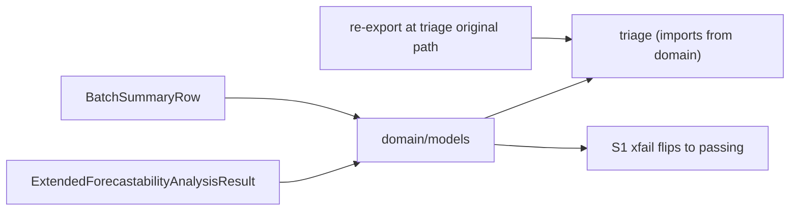
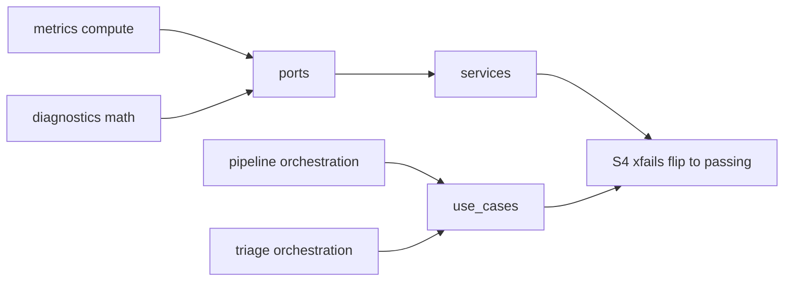

<!-- type: reference -->

# v0.5.1 — Finish the Hexagonal Migration: Strangler-Fig Cycle Removal

**Plan type:** Actionable refactor plan — structural debt paydown, no behaviour change
**Audience:** Maintainer, reviewer, software-architect reviewer, Jr. developer
**Target release:** `0.5.1` (patch) — the maintainer elected to ship this internal-structure refactor as a patch release; additive `DeprecationWarning` shims only, public surface byte-stable
**Current released version:** `0.5.0`
**Branch:** `refactor/finish-hex-migration`
**Status:** Shipped (v0.5.1) — landed on `main` (branch `refactor/finish-hex-migration`); layer graph acyclic, boundary test enforced
**Last reviewed:** 2026-06-17

> [!IMPORTANT]
> **Scope (binding).** This plan ships **import-graph correction only**: it completes the Strangler-Fig hexagonal migration cycle-by-cycle so that `domain/` and `ports/` import only `domain`/`ports` (plus numpy/pandas/pydantic) among first-party packages, the legacy flat packages (`metrics`, `kernels`, `pipeline`, `reporting`, `triage`, `diagnostics`, `utils`) no longer participate in mutual-import cycles with the rings, and `tests/test_architecture_boundaries.py` can actually see first-party leaks and cycles.
>
> It does **not** ship: any math / estimator / numeric change; any public-API name change; any new public symbol; any new release tag; any change to the frozen `api/__init__.py` export set, the `forecastability/__init__.py` re-export shim, or the `_legacy/` `DeprecationWarning` shim. The public surface is **byte-stable** across the whole plan.
>
> Binding driver document: [docs/architecture-review-2026-06-17.md](../../architecture-review-2026-06-17.md).

> [!NOTE]
> **Cross-release ordering.** This is a post-v0.5.0 internal refactor with no chained predecessor or successor *release*. It **consumes** the physical `src/forecastability/domain/` package and the AST boundary test that v0.5.0 shipped (commit `507b64c`, RVH architecture-realignment phase). It **bequeaths** a genuinely isolable core (`domain`/`ports` importable without dragging in `triage`/`services`/`adapters`) and a boundary test that fails on first-party leaks and cycles — so the next feature release inherits a clean layer graph and a guardrail that defends it. The maintainer elected to ship this structural hardening as the **v0.5.1 patch** (additive `DeprecationWarning` shims only; public surface byte-stable), so a version bump, CHANGELOG entry, and PyPI publication *are* produced for this release.

**Companion refs:**

- [docs/architecture-review-2026-06-17.md](../../architecture-review-2026-06-17.md) — review driver document (findings #1, #2, #3)
- [v0.5.0 — Review-Driven Hardening Plan](v0_5_0_review_hardening_ultimate_plan.md) — shipped predecessor; introduced the physical `domain/` package and the current boundary test
- [v0.4.3 — Lag-Aware ModMRMR Plan](v0_4_3_lag_aware_catt_mod_mrmr_plan_template_aligned.md) — most recent template-aligned shipped plan
- [docs/plan/planning_template.md](../planning_template.md) — required style and section ordering
- [docs/plan/acceptance_criteria.md](../acceptance_criteria.md) — non-negotiable invariants

**Builds on:**

- implemented physical `src/forecastability/domain/` package (models, results, scoring_protocols, value_objects) from v0.5.0
- implemented physical `src/forecastability/ports/` package (`kernels.py`, `ksg1_sklearn_kernel.py`, `ksg2_curve_kernel.py`)
- implemented AST boundary test `tests/test_architecture_boundaries.py` (`_DOMAIN_STRUCTURAL_FORBIDDEN`, `_PORTS_FORBIDDEN`, `_get_imports`)
- implemented frozen public facade: `src/forecastability/api/__init__.py`, `src/forecastability/__init__.py` re-export shim, `src/forecastability/_legacy/` deprecation shim
- implemented legacy flat packages `metrics`, `kernels`, `pipeline`, `reporting`, `triage`, `diagnostics`, `utils` (the relocation backlog)

---

## 1. Why this plan exists

The v0.5.0 hardening release (commit `507b64c`) created the physical `domain/` and `ports/` ring folders, but the architecture review of 2026-06-17 found that the **dependency graph is still bidirectional**. The ring taxonomy is hexagonal; the actual edges are not. Inner rings reach outward (`domain/models/*` → `forecastability.triage.*`, `ports/__init__.py` → `metrics`/`triage`/`utils`) while legacy packages reach back inward (`triage` → `domain` ×14, `diagnostics` → `services`/`use_cases`, `pipeline` → `services`, `utils` → `domain` ×3), closing mutual-import cycles: `services ↔ triage`, `services ↔ diagnostics`, `services ↔ metrics`, `domain ↔ triage`, `domain ↔ utils`, `use_cases ↔ pipeline`.

The concrete pain is that **you cannot import `domain` in isolation** — it drags in `triage`, which drags in `services`/`adapters` — so the property hexagonal architecture is supposed to buy (test the core alone, swap an adapter without touching the domain) is not actually realized for ~19k LOC. Worse, the one guardrail meant to catch this (`tests/test_architecture_boundaries.py`) is blind: it forbids only *external* infra (`sklearn`, `scipy`, `matplotlib`, …) inside `domain`/`ports` and says nothing about first-party outward imports, so every cycle above passes CI today. The green check actively masks the debt.

This plan finishes the migration the way a Strangler-Fig is meant to finish: one cycle at a time, with the boundary test extended *first* to document each breach as a strict-`xfail` assertion that flips to passing as its slice lands. There is no redesign and no rewrite — pure compute stays where it is computed, orchestration stays where it orchestrates, and only the *direction* of import edges changes. Because no math, estimator, numeric value, or public name changes, every slice is independently shippable behind a byte-stable public surface, and the work can pause at any green slice boundary without leaving the tree in a half-broken state.

> The release should let a downstream consumer answer two crisp questions:
>
> 1. *"Can I import `forecastability.domain` and `forecastability.ports` without pulling in `triage`, `services`, or `adapters`?"* — Yes, after S4; the layer graph is acyclic and the inner rings depend on nothing first-party outside themselves.
> 2. *"If I introduce a new outward import from `domain`/`ports`, or a new cycle, will CI catch it?"* — Yes, after S0 the boundary test forbids first-party outward imports from `domain`/`ports` and asserts the layer graph is acyclic.

> [!IMPORTANT]
> The single largest semantic risk is a **silent public-surface flip disguised as an internal move.** Relocating `ExtendedForecastabilityAnalysisResult` or `BatchSummaryRow` into `domain/models` must not change a single re-exported symbol, its import path as seen by users, or its frozen-Pydantic field shape. Every slice's stage gate asserts public-surface byte-stability (`api/__init__.py` exports + `__init__.py` shim + `_legacy/` unchanged). A move that changes what `import forecastability` exposes is a release-breaking change wearing a refactor disguise and must be rejected at the slice gate.

### Planning principles

| Principle | Implication |
| --- | --- |
| Strangler-Fig, cycle-by-cycle | Each slice removes exactly one (or one cluster of) mutual-import cycle. The tree is green and shippable at every slice boundary; no slice depends on a later slice to compile or pass tests. |
| Guardrail before fix | The boundary test learns to see a breach *before* the breach is fixed. New red assertions land as `xfail(strict=True)` in S0 and flip to passing in the slice that removes the corresponding cycle. |
| Imports invert, code does not move semantics | Pure compute (`metrics`, `kernels`, diagnostic math) is pulled inward behind `ports`; orchestration (`triage`, `pipeline`) becomes/feeds `use_cases`. No algorithm, estimator, numeric value, or random-state plumbing changes. |
| Public surface is byte-stable | `api/__init__.py` export set, `forecastability/__init__.py` re-export shim, and `_legacy/` deprecation shim are identical before and after every slice. Verified at each gate. |
| No new public names | Symbols may be *relocated* (and re-exported from their old path) but never renamed, added, or removed. This plan ships zero new public API. Renames over shims are explicitly **not** chosen here — the public facade is the one thing the review says to leave alone. |
| Leaf shared-kernel has zero first-party imports | The `utils/` split produces a true leaf (pure types/math helpers, zero first-party imports); anything importing `domain`/`reporting` is relocation backlog, not leaf. |
| Largest churn last | The `services ↔ {diagnostics, metrics, triage}` and `use_cases ↔ pipeline` inversions (the highest import-site count) land in S4, after the cheaper, lower-risk inversions have proven the pattern. |
| Stage gate per slice | Every slice passes the same gate: ruff clean, ty clean, pytest green with the slice's target `xfail` flipped to passing, public surface byte-stable, rubber_duck screen clean. |
| Additive boundary test, then subtractive markers | The boundary test grows assertions in S0 (all relevant ones `xfail`-strict); markers are removed only as their slice lands; S5 removes the last marker and flips cycle-detection green. |

### Architecture rules

- The core package remains **framework-agnostic**: no `darts`, `mlforecast`, `statsforecast`, or `nixtla` imports at any tier (this plan touches no estimator and adds no dependency).
- `domain/` and `ports/` may import, among first-party packages, **only** `domain` and `ports` (plus numpy/pandas/pydantic and stdlib). Enforced by the extended `tests/test_architecture_boundaries.py`.
- The layer-dependency graph over first-party packages is **acyclic**. Enforced by a cycle-detection assertion in `tests/test_architecture_boundaries.py`.
- **No public symbol is added, removed, or renamed.** Relocated symbols keep a re-export at their original import path so user-facing imports are unchanged.
- The frozen `api/__init__.py`, the `forecastability/__init__.py` shim, and the `_legacy/` shim are **not modified** by this plan.
- No new top-level package is introduced. The `utils/` split produces a leaf module/subpackage *within the existing tree* and relocates domain-aware pieces into existing rings (`domain`/`services`).
- No new `# TODO`-style exclusion is added to the boundary test's forbidden sets (anti-pattern from CLAUDE.md). Debt is tracked as `xfail(strict=True)`, not as a silent exclusion.

### Feature inventory

<!-- Phase values: 0 = guardrail/contracts (boundary test + ADR), 1 = first inversion, 2 = utils split, 3 = ports inversions, 4 = largest-churn inversions, 5 = green-flip + marker removal, 6 = docs/close-out. ID prefix HEX-. -->

| ID | Feature | Phase (Slice) | Priority | Status |
| --- | --- | --- | --- | --- |
| HEX-1 | Cycle-by-cycle Strangler-Fig inversion of all mutual-import cycles (review finding #1) | 1–4 (S1–S4) | P0 | Not started |
| HEX-2 | Extend `tests/test_architecture_boundaries.py` with first-party-forbidden set for `domain`/`ports` + layer-graph cycle detection, staged as `xfail(strict=True)` | 0 (S0) | P0 | Not started |
| HEX-3 | Split `utils/` into a zero-first-party-import leaf shared-kernel + relocate domain-aware pieces inward (review finding #3) | 2 (S2) | P0 | Not started |
| HEX-4 | Target-module-map ADR (where each relocated symbol/module lands) committed under `docs/adr/` | 0 (S0) | P0 | Not started |
| HEX-5 | `domain → triage` inversion: relocate `ExtendedForecastabilityAnalysisResult` + `BatchSummaryRow` into `domain/models`, invert `triage` to import from `domain` | 1 (S1) | P0 | Not started |
| HEX-6 | `ports/__init__.py` inversions (lines 14/26/27: `metrics`/`triage`/`utils`) | 3 (S3) | P0 | Not started |
| HEX-7 | `services ↔ {diagnostics, metrics, triage}` and `use_cases ↔ pipeline` inversions (largest churn) | 4 (S4) | P0 | Not started |
| HEX-8 | Cycle-detection assertion flips green; remove all `xfail(strict=True)` markers | 5 (S5) | P0 | Not started |
| HEX-9 | Migration close-out docs: ADR status update, plan move to `implemented/`, README index update | 6 (S6) | P1 | Not started |

---

### Reviewer acceptance block

The migration is successful only if all of the following are visible together:

1. **First-party boundary enforcement exists and is honest**
   - `tests/test_architecture_boundaries.py` defines a `_DOMAIN_PORTS_FIRSTPARTY_ALLOWED = frozenset({"domain", "ports"})` (or equivalent) and asserts no module under `domain/` or `ports/` imports a first-party package outside that set.
   - The forbidden first-party set for `domain`/`ports` includes `triage`, `utils`, `metrics`, `pipeline`, `reporting`, `diagnostics`, `services`, `use_cases`, `adapters`, `api`, `bootstrap`.
   - The assertion is reachable by a named test (e.g. `test_domain_has_no_first_party_outward_imports`, `test_ports_has_no_first_party_outward_imports`) and not silently skipped.

2. **Cycle detection exists and is honest**
   - A named test (e.g. `test_layer_graph_is_acyclic`) builds the first-party import graph via the existing `_get_imports` AST helper and asserts it contains no cycle.
   - The assertion reports the offending cycle path on failure (so a future regression is debuggable).
   - No cycle is excluded via a `# TODO` allowlist entry (CLAUDE.md anti-pattern).

3. **Staged xfail discipline**
   - In S0 every new red assertion (per-cycle and cycle-detection) lands as `@pytest.mark.xfail(strict=True, reason=...)` referencing the slice that will fix it.
   - `uv run pytest -q -ra` is green in S0 with the new assertions xfailing as designed (strict xfail => xpass is a failure).
   - Each subsequent slice flips exactly its target marker(s) from `xfail` to passing; `git log -p tests/test_architecture_boundaries.py` shows one marker removal per slice.

4. **Target-module-map ADR**
   - `docs/adr/NNNN-finish-hex-migration-target-module-map.md` exists, lists every relocated symbol/module and its destination ring, and the inversion direction for each cycle.
   - The ADR is referenced from this plan and from `docs/plan/README.md`.
   - ADR status is `Accepted` at S0 and `Implemented` at S6.

5. **`domain → triage` cycle removed (S1)**
   - `ExtendedForecastabilityAnalysisResult` and `BatchSummaryRow` resolve from `forecastability.domain.models.*`.
   - `triage` imports these from `domain`; `domain/models/*` contains no `import forecastability.triage` statement.
   - The S1 target `xfail` (`domain`-must-not-import-`triage`) flips to passing.

6. **`utils/` split (S2)**
   - The leaf shared-kernel module/subpackage has **zero** first-party imports (verified by an assertion in the boundary test or a dedicated `test_shared_kernel_is_a_leaf`).
   - Every former `utils` symbol resolves from either the leaf or its relocated ring (`domain`/`services`), with re-exports preserving any externally-used import path.
   - `domain ↔ utils` and the `utils`-as-hub cycles no longer appear in the layer graph.

7. **`ports/__init__.py` inversions (S3)**
   - `src/forecastability/ports/__init__.py` no longer imports `metrics`, `triage`, or `utils` (the lines flagged at 14/26/27 in the review).
   - The S3 target `xfail` (`ports`-must-not-import-first-party-outside-`domain`/`ports`) flips to passing.

8. **Largest-churn inversions (S4)**
   - `services ↔ triage`, `services ↔ diagnostics`, `services ↔ metrics`, and `use_cases ↔ pipeline` are no longer cycles in the layer graph.
   - Pure compute is reachable behind `ports`; orchestration is reachable via `use_cases`; no algorithm or numeric output changed (verified by full pytest green, no fixture diff).

9. **Green flip + marker removal (S5)**
   - `test_layer_graph_is_acyclic` passes without `xfail`.
   - `grep -n "xfail" tests/test_architecture_boundaries.py` returns no migration-debt markers (zero matches, or only unrelated pre-existing ones documented in the ADR).
   - `forecastability.domain` and `forecastability.ports` import in isolation (a smoke test imports each subpackage and asserts `sys.modules` contains no `triage`/`services`/`adapters` entry pulled transitively from them).

10. **Public-surface byte-stability (every slice)**
    - For each slice: `api/__init__.py` export set, `forecastability/__init__.py` re-export shim, and `_legacy/` shim are unchanged (verified by `git diff --stat` showing no change to those paths, or by a `check_readme_surface.py` / `check_repo_contract.py` run that compares the public symbol set).
    - `uv run python scripts/check_repo_contract.py` (or the repo's public-surface check) is green at every slice boundary.
    - No new public symbol appears in `docs/public_api.md`.

11. **Per-slice stage gate (the binding acceptance criterion)**
    - Every slice satisfies, before it is considered done: `uv run ruff check .` clean; `uv run ty check` clean; `uv run pytest -q -ra` green with the slice's target `xfail` flipped to passing; public surface byte-stable; `rubber_duck` screen clean (≤ 5 risks, contract/data-model/control-flow/dependency/test-adequacy).
    - No slice merges with a red gate; no slice merges that requires a *later* slice to be green.

12. **No behaviour change**
    - No fixture under `docs/fixtures/` changes (no rebuild required; a rebuild that produces a diff is a defect).
    - No math/estimator/numeric test changes its expected value.
    - No public symbol is added, removed, or renamed across the whole plan.

---

## 2. Theory-to-code map

> [!IMPORTANT]
> Every junior developer MUST read this section before writing any code. This plan is **import-direction surgery**: the risk is not numeric, it is structural — an inversion done in the wrong direction creates a new cycle, and a relocation done carelessly silently changes the public surface.

### 2.1. Notation

Model the package set as a directed graph $G = (V, E)$ over first-party packages.

- $V = \{\texttt{domain}, \texttt{ports}, \texttt{services}, \texttt{use\_cases}, \texttt{api}, \texttt{adapters}, \texttt{bootstrap}, \texttt{metrics}, \texttt{kernels}, \texttt{pipeline}, \texttt{reporting}, \texttt{triage}, \texttt{diagnostics}, \texttt{utils}\}$ — one node per top-level package; maps to subdirectories of `src/forecastability/`.
- $E$ — a directed edge $u \to v$ exists iff some module in package $u$ imports some module in package $v$; computed by `_get_imports` in `tests/test_architecture_boundaries.py`.
- $\text{Inner} = \{\texttt{domain}, \texttt{ports}\}$ — the inner rings that must depend on nothing first-party outside $\text{Inner}$.
- $\text{Legacy} = \{\texttt{metrics}, \texttt{kernels}, \texttt{pipeline}, \texttt{reporting}, \texttt{triage}, \texttt{diagnostics}, \texttt{utils}\}$ — the relocation backlog.

### 2.2. Core algorithm

The migration is a sequence of **edge inversions** that monotonically removes cycles without ever changing node *contents'* observable behaviour. For each targeted cycle $u \leftrightarrow v$:

1. Identify the symbols on the inward-pointing leg (e.g. `domain` importing from `triage`).
2. Relocate those symbols to the inner node (e.g. into `domain/models`), preserving their definition byte-for-byte where possible.
3. Add a re-export at the original path so external import paths are unchanged.
4. Invert the outer node to import from the inner node (e.g. `triage` imports from `domain`).
5. Flip the slice's `xfail(strict=True)` marker to a passing assertion.
6. Run the stage gate.

The order is chosen so each slice leaves $G$ closer to a DAG and never introduces a new edge into $\text{Inner}$.

### 2.3. Mathematical invariants

> [!IMPORTANT]
> **Invariant A — inner rings are first-party-closed.**
> For all $u \in \text{Inner}$ and all edges $u \to v \in E$ with $v$ first-party: $v \in \text{Inner}$.
> Enforced by: `test_domain_has_no_first_party_outward_imports` and `test_ports_has_no_first_party_outward_imports` in `tests/test_architecture_boundaries.py`. Holds with `xfail` until S1/S3, unconditionally after S4.

> [!IMPORTANT]
> **Invariant B — the layer graph is acyclic.**
> $G$ contains no directed cycle: $\nexists\, v \in V$ reachable from itself along $E$.
> Enforced by: `test_layer_graph_is_acyclic`. Holds with `xfail` until S5, unconditionally after S5.

> [!IMPORTANT]
> **Invariant C — the leaf shared-kernel has no first-party imports.**
> For the shared-kernel node $\ell$: $\nexists\, \ell \to v \in E$ with $v$ first-party.
> Enforced by: `test_shared_kernel_is_a_leaf` (added in S2).

> [!IMPORTANT]
> **Invariant D — public surface is byte-stable.**
> The exported-symbol set of `api/__init__.py`, the `forecastability/__init__.py` re-export shim, and the `_legacy/` shim are invariant under every slice.
> Enforced by: per-slice `git diff` check on those paths + `scripts/check_repo_contract.py` (public-surface check) at every stage gate.

---

## 3. Phased delivery

Phases map 1:1 to the approved slice order S0–S6. Each phase's acceptance criteria are the **per-slice stage gate** (ruff clean, ty clean, pytest green with target xfail flipped, public surface byte-stable, rubber_duck clean) plus the slice-specific items below.

### Phase 0 (S0) — Guardrail + ADR (no behaviour change)

**Scope.** Extend `tests/test_architecture_boundaries.py` with (a) a first-party-forbidden set for `domain`/`ports` and (b) a layer-graph cycle-detection assertion, all staged as `@pytest.mark.xfail(strict=True)` keyed to the slice that fixes them. Land the target-module-map ADR. No production source moves.

**Acceptance criteria:**

- `_DOMAIN_PORTS_FIRSTPARTY_ALLOWED` (or equivalent) defined; per-cycle and cycle-detection assertions added.
- Every new red assertion is `xfail(strict=True)` with a `reason` naming its fixing slice (S1/S2/S3/S4/S5).
- `uv run pytest -q -ra` green (new assertions xfail as designed; no xpass).
- `docs/adr/NNNN-finish-hex-migration-target-module-map.md` committed, status `Accepted`, listing every relocation target and inversion direction.
- Public surface byte-stable (no change to `api/`, `__init__.py` shim, `_legacy/`).
- `uv run ruff check .` clean; `uv run ty check` clean; `rubber_duck` screen clean.

### Phase 1 (S1) — `domain → triage` inversion

**Scope.** Move `ExtendedForecastabilityAnalysisResult` and `BatchSummaryRow` into `domain/models/`; invert `triage` to import them from `domain`. Add re-exports at original paths.

**Acceptance criteria:**

- Both symbols resolve from `forecastability.domain.models.*`; no `domain/models/*` imports `forecastability.triage`.
- External import paths unchanged (re-exports in place); public surface byte-stable.
- S1 target `xfail` (`domain`-no-`triage`) flips to passing.
- Stage gate (ruff/ty/pytest/surface/rubber_duck) clean.

### Phase 2 (S2) — `utils/` split

**Scope.** Identify the zero-first-party-import subset of `utils/` (3.2k LOC) and freeze it as the leaf shared-kernel; relocate the `domain`/`pipeline`/`reporting`-importing pieces into `domain`/`services`. Add `test_shared_kernel_is_a_leaf`.

**Acceptance criteria:**

- Leaf shared-kernel has zero first-party imports (Invariant C; named test passes).
- Relocated symbols resolve from `domain`/`services`; re-exports preserve any externally-used path; public surface byte-stable.
- `domain ↔ utils` and `utils`-hub cycles removed from $G$.
- S2 target `xfail`(s) flip to passing; stage gate clean.

### Phase 3 (S3) — `ports/__init__.py` inversions

**Scope.** Remove the `metrics`/`triage`/`utils` imports from `src/forecastability/ports/__init__.py` (review lines 14/26/27); route through inner-ring abstractions instead.

**Acceptance criteria:**

- `ports/__init__.py` imports no first-party package outside `domain`/`ports`.
- S3 target `xfail` (`ports`-first-party-closed) flips to passing; Invariant A holds for `ports`.
- Public surface byte-stable; stage gate clean.

### Phase 4 (S4) — `services ↔ {diagnostics, metrics, triage}` and `use_cases ↔ pipeline` inversions

**Scope.** The largest-churn slice, done last. Pull pure compute (`metrics`, diagnostic math) inward behind `ports`; turn `triage`/`pipeline` orchestration into / behind `use_cases` so the cyclic legs invert.

**Acceptance criteria:**

- `services ↔ triage`, `services ↔ diagnostics`, `services ↔ metrics`, `use_cases ↔ pipeline` are no longer cycles in $G$.
- No algorithm/numeric output changed: full pytest green, zero fixture diff under `docs/fixtures/`.
- S4 target `xfail`(s) flip to passing; public surface byte-stable; stage gate clean.

### Phase 5 (S5) — Cycle-detection green flip + remove all xfail markers

**Scope.** `test_layer_graph_is_acyclic` flips to passing; remove all migration-debt `xfail(strict=True)` markers. Add the isolation smoke test (`import forecastability.domain` / `forecastability.ports` pulls in no `triage`/`services`/`adapters`).

**Acceptance criteria:**

- `test_layer_graph_is_acyclic` passes without `xfail` (Invariant B unconditional).
- `grep -n "xfail" tests/test_architecture_boundaries.py` shows no migration-debt markers.
- Isolation smoke test passes; Invariant A holds unconditionally for `domain` and `ports`.
- Public surface byte-stable; stage gate clean.

### Phase 6 (S6) — Migration close-out

**Scope.** Documentation and lifecycle close-out only. See the Phase-6 checklist below.

**Acceptance criteria:**

- ADR status updated to `Implemented`.
- `docs/plan/README.md` index updated; this plan moved to `docs/plan/implemented/`.
- No CHANGELOG/version/PyPI action (this plan ships no release tag).

---

## 4. Out of scope

- Any math, estimator, surrogate, FWER, or numeric-default change — owned by other reviews; this is structure-only.
- Any public-API name change, new public symbol, or removed symbol — the public facade is the one thing the review says to leave alone.
- Any new release tag, version bump, CHANGELOG entry, or PyPI publication — this plan lands on `main` behind a byte-stable surface and is consumed by the next feature release.
- Changes to `api/__init__.py`, the `forecastability/__init__.py` re-export shim, or the `_legacy/` deprecation shim.
- Topology changes (no microservices, event bus, CQRS, saga) — explicitly endorsed as out of scope by the review's "Leave alone" section.
- Performance work on the relocated compute — the inversion preserves call sites and hot loops unchanged.
- New `# TODO` exclusions in the boundary-test forbidden sets — debt is tracked as `xfail(strict=True)`, never as a silent exclusion.

---

## 5. Open questions

1. **ADR numbering.** There is no existing `docs/adr/` directory. Should the target-module-map ADR be `docs/adr/0001-...` (new convention) or live under an existing docs bucket? Decision needed before S0 commits.
2. **Re-export vs. relocate-and-deprecate.** For `ExtendedForecastabilityAnalysisResult` / `BatchSummaryRow`, do we keep a *permanent* re-export at the old `triage` path, or route it through the `_legacy/` deprecation shim? The plan currently assumes a permanent, non-deprecated re-export (byte-stable surface, no new warning). Confirm before S1.
3. **Leaf shared-kernel location.** Does the zero-first-party-import leaf live as a renamed `utils` leaf module *inside* `utils/`, or as a new subpackage? "No new top-level package" is binding; a subpackage under an existing ring is allowed. Decide before S2.
4. **Cycle-detection scope.** Should `test_layer_graph_is_acyclic` operate at top-level-package granularity only, or also catch intra-package module cycles? Top-level is the review's ask; finer granularity may over-report. Confirm granularity before S0.
5. **`adapters`/`bootstrap`/`api` in the forbidden set.** The review names `triage`/`utils`/`metrics`/`pipeline`/`reporting`/`diagnostics` explicitly; should `services`/`use_cases`/`adapters`/`api`/`bootstrap` also be forbidden for `domain`/`ports` from S0? The plan assumes yes (inner rings depend only on `domain`/`ports`). Confirm before S0.

---

## 6. Phase-6 release / migration close-out checklist

This plan ships **no release tag**, so the standard publish steps collapse to a documentation-and-merge close-out. The checklist below is the binding S6 gate.

1. **CI green on `refactor/finish-hex-migration`** — `uv run ruff check .`, `uv run ty check`, `uv run pytest -q -ra` all green with every migration-debt `xfail` removed.
2. **Public-surface verification** — `scripts/check_repo_contract.py` (and `check_readme_surface.py` if present) confirm the public symbol set is identical to v0.5.0; `git diff` on `api/`, `__init__.py` shim, and `_legacy/` is empty across the branch.
3. **Fixture stability** — confirm no file under `docs/fixtures/` changed (no rebuild performed; any diff is a defect to investigate, not commit).
4. **No version/CHANGELOG bump** — explicitly confirm `pyproject.toml`, `__init__.py` `__version__`, `CHANGELOG.md`, and `README.md` version strings are **unchanged** (this is a structure-only branch).
5. **ADR finalization** — `docs/adr/NNNN-finish-hex-migration-target-module-map.md` status set to `Implemented`; cross-references resolve.
6. **Isolation smoke** — `python -c "import forecastability.domain, forecastability.ports"` succeeds and the isolation smoke test confirms no `triage`/`services`/`adapters` is transitively imported.
7. **Reviewer sign-off** — `software_architect` confirms the layer graph is acyclic and the inner rings are first-party-closed; `rubber_duck` final screen clean.
8. **Squash-merge to `main`** — PR squash-merged; commit message references the architecture review and this plan.
9. **No tag, no PyPI, no GitHub release** — confirm none is created (out of scope).
10. **No sibling-repo bump** — `forecastability-examples` is unaffected (no public surface change); confirm no dispatch is sent.
11. **Index update** — `docs/plan/README.md` updated with this plan's final status.
12. **Move plan to implemented** — relocate this file to `docs/plan/implemented/v0_5_1_finish_hex_migration_plan.md` and update all references.
