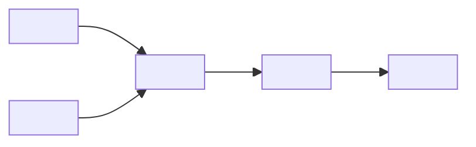

<!-- type: reference -->
# vX.Y.Z — [Feature Name]: Ultimate Release Plan

<!-- TEMPLATE: Replace "vX.Y.Z" with the target version (e.g. "v0.3.5") and "[Feature Name]" with a short, noun-phrase label for the headline capability (e.g. "Documentation Quality Improvement"). The title must match the branch name and the CHANGELOG entry. -->

**Plan type:** Actionable release plan — <!-- TEMPLATE: one-line characterisation of the release, e.g. "typed surface hardening for routing outputs" -->
**Audience:** Maintainer, reviewer, statistician reviewer, Jr. developer
**Target release:** `X.Y.Z` — <!-- TEMPLATE: state the chain position, e.g. "ships first in the 0.3.5 → 0.4.0 chain" or "headline release" -->
**Current released version:** `0.3.6`
**Branch:** `feat/vX.Y.Z-<!-- TEMPLATE: kebab-case feature slug -->`
**Status:** Draft
**Last reviewed:** <!-- TEMPLATE: ISO date, e.g. 2026-05-01 -->

> [!IMPORTANT]
> **Scope (binding).** This release ships <!-- TEMPLATE: enumerate the exact surfaces shipped -->.
> It does **not** ship <!-- TEMPLATE: enumerate explicit exclusions -->.
> Driver document: [aux_documents/developer_instruction_repo_scope.md](../plan/aux_documents/developer_instruction_repo_scope.md).
> <!-- TEMPLATE: If an earlier draft exists that is superseded, note its archive path here. -->

> [!NOTE]
> **Cross-release ordering.** <!-- TEMPLATE: Explain the dependency chain. Which release must ship before this one, and why? Which release ships after? What does the successor plan consume from this one? If this is a standalone release, state that explicitly. -->

**Companion refs:**

<!-- TEMPLATE: List predecessor plan(s) first, then successor plan(s), then driver/auxiliary documents. Use relative paths. -->
- [vA.B.C — Predecessor Feature: Ultimate Release Plan](implemented/vA_B_C_predecessor_plan.md) — shipped before
- [vX.Y.(Z+1) — Successor Feature: Ultimate Release Plan](vX_Y_Zp1_successor_plan.md) — ships after
- [aux_documents/developer_instruction_repo_scope.md](../plan/aux_documents/developer_instruction_repo_scope.md) — driver document

**Builds on:**

<!-- TEMPLATE: List every already-implemented surface, type, or service this release consumes. Be concrete: module paths, type names, and version numbers. Avoid vague "existing machinery" references. -->
- implemented `A.B.C` <!-- type or surface name --> from `src/forecastability/<!-- path -->`
- implemented `A.B.D` <!-- type or surface name --> from `src/forecastability/<!-- path -->`

---

## 1. Why this plan exists

<!-- TEMPLATE: Explain what gap or problem the release closes, why it must be closed now rather than later, and what the user experience looks like before and after. Write in first-person-plural ("we", "the release"). Keep to 2–4 paragraphs. -->

> The release should let a downstream consumer answer two crisp questions:
>
> 1. <!-- TEMPLATE: First crisp question the release answers, e.g. "Which lags are informative for this series?" -->
> 2. <!-- TEMPLATE: Second crisp question the release answers. -->

> [!IMPORTANT]
> <!-- TEMPLATE: State the single largest semantic risk: the misunderstanding or misuse that would most damage credibility or correctness if it slipped through. Every public result, docstring, and changelog entry in this release must preserve the distinction named here. -->

### Planning principles

<!-- TEMPLATE: Add 6–10 rows. Each row names one guiding principle and its concrete engineering implication. Model after v0.3.3 and v0.3.4 patterns. Keep each cell to one or two sentences. -->

| Principle | Implication |
| --- | --- |
| Hexagonal + SOLID | Mapper services, use-case builders, export helpers, and rendering adapters are separate modules with no cross-cutting imports. |
| Additive only | Existing public symbols and frozen Pydantic field shapes are preserved. No field rename or removal without a version bump and migration entry. |
| Regression visibility | Every surface change must appear as a fixture diff, not as a silent output flip. |
| Honest semantics | Output fields distinguish evidence from recommendation. Conservative empties are emitted for blocked or abstaining inputs. |
| <!-- TEMPLATE: add principle --> | <!-- TEMPLATE: add implication --> |
| <!-- TEMPLATE: add principle --> | <!-- TEMPLATE: add implication --> |
| <!-- TEMPLATE: add principle --> | <!-- TEMPLATE: add implication --> |

### Architecture rules

<!-- TEMPLATE: List the non-negotiable engineering invariants for this release. These are the things a reviewer checks first before reading the implementation. Add or remove bullets to match the release. -->

- The core package remains **framework-agnostic**: no `darts`, `mlforecast`, `statsforecast`, or `nixtla` imports at any tier (runtime, optional extras, dev, CI).
- All new result models are **frozen Pydantic models** with closed `Literal` label fields and explicit `Field(...)` descriptions.
- New public symbols are **additively re-exported** from `forecastability` and/or `forecastability.triage`; existing re-exports are not removed.
- New services belong in `src/forecastability/services/`; new use cases in `src/forecastability/use_cases/`; no new top-level packages are introduced without an explicit plan section.
- <!-- TEMPLATE: add release-specific invariant (e.g. "No new notebook is committed in this release.") -->
- <!-- TEMPLATE: add release-specific invariant -->

### Feature inventory

<!-- TEMPLATE: Assign a short ID prefix (e.g. "FPC" for Forecast Prep Contract, "RVB" for Routing Validation Benchmark). Fill one row per deliverable. Add or remove rows as needed. Phase values: 0 = domain contracts, 1 = build logic, 2 = exporters/adapters, 3 = examples/showcase, 4 = tests/fixtures, 5 = CI, 6 = docs/release. -->

| ID | Feature | Phase | Priority | Status |
| --- | --- | --- | --- | --- |
| XXX-F00 | <!-- TEMPLATE: Typed result models --> | 0 | P0 | Not started |
| XXX-F01 | <!-- TEMPLATE: Core use case / builder --> | 1 | P0 | Not started |
| XXX-F02 | <!-- TEMPLATE: Secondary build logic or exporter --> | 2 | P1 | Not started |
| XXX-F03 | <!-- TEMPLATE: Showcase script and public examples --> | 3 | P1 | Not started |
| XXX-F04 | <!-- TEMPLATE: Tests and regression fixtures --> | 4 | P0 | Not started |

---

### Reviewer acceptance block

<!-- TEMPLATE: This block defines the release success criteria. A reviewer must be able to verify every item independently. Write 10 or more numbered items, each with a bold subheading and 2–3 bullet sub-points. Model after v0.3.4. Items should cover: typed surface, builder/use-case, regression discipline, showcase script, documentation, and release engineering. -->

`X.Y.Z` is successful only if all of the following are visible together:

1. **Typed surface**
   - <!-- TEMPLATE: Name the frozen Pydantic models that must exist, with their closed Literal label fields. -->
   - <!-- TEMPLATE: Name the import paths that must resolve (both facade and triage namespace). -->
   - <!-- TEMPLATE: Name any field validators that enforce domain invariants. -->

2. **Builder / use case**
   - <!-- TEMPLATE: Describe the public function signature and its return type. -->
   - <!-- TEMPLATE: Describe conservative behaviour for blocked or abstaining inputs. -->
   - <!-- TEMPLATE: Confirm the builder never imports any forecasting framework. -->

3. **Regression discipline**
   - <!-- TEMPLATE: Name the fixture directory under docs/fixtures/ and the rebuild script. -->
   - <!-- TEMPLATE: State what constitutes a fixture diff vs a silent output flip. -->
   - <!-- TEMPLATE: Confirm all rebuild scripts run clean before tagging. -->

4. **Showcase script**
   - <!-- TEMPLATE: Name the script file and its --smoke flag behaviour. -->
   - <!-- TEMPLATE: Describe the output artifacts written (JSON, markdown, tables). -->
   - <!-- TEMPLATE: Confirm clean run on a fresh install with no optional extras required. -->

5. **Documentation**
   - <!-- TEMPLATE: Name the primary docs page(s) created or updated. -->
   - <!-- TEMPLATE: Describe the README and quickstart updates required. -->
   - <!-- TEMPLATE: Describe the CHANGELOG entry framing. -->

6. **Release engineering**
   - <!-- TEMPLATE: Confirm version bump locations: pyproject.toml, __init__.py, CHANGELOG.md, README.md. -->
   - <!-- TEMPLATE: Confirm all fixture rebuild scripts have been re-run and committed. -->
   - <!-- TEMPLATE: Confirm the git tag is created and pushed. -->

7. **<!-- TEMPLATE: add acceptance item subheading -->**
   - <!-- TEMPLATE: add sub-point -->
   - <!-- TEMPLATE: add sub-point -->

8. **<!-- TEMPLATE: add acceptance item subheading -->**
   - <!-- TEMPLATE: add sub-point -->
   - <!-- TEMPLATE: add sub-point -->

9. **<!-- TEMPLATE: add acceptance item subheading -->**
   - <!-- TEMPLATE: add sub-point -->
   - <!-- TEMPLATE: add sub-point -->

10. **<!-- TEMPLATE: add acceptance item subheading -->**
    - <!-- TEMPLATE: add sub-point -->
    - <!-- TEMPLATE: add sub-point -->

---

## 2. Theory-to-code map

> [!IMPORTANT]
> Every junior developer MUST read this section before writing any code.
> This release is <!-- TEMPLATE: describe the semantic risk in one sentence, e.g. "small in surface area but high in semantic risk: a wrong lag-role mapping will contaminate every downstream consumer." -->

### 2.1. Notation

<!-- TEMPLATE: Define all mathematical notation used in this release. Use KaTeX inline ($...$) and block ($$...$$) notation. Name each quantity and explain what it represents in the codebase. Cross-reference field names in the typed models. For example:

- $I_h$ — AMI at lag $h$; maps to `TriageResult.summary.ami_profile[h]`
- $\tilde{I}_h$ — pAMI at lag $h$; maps to `TriageResult.summary.pami_profile[h]`

Remove this comment when the section is filled. -->

### 2.2. Core algorithm

<!-- TEMPLATE: Describe the algorithm this release implements. Use numbered steps, formal notation where appropriate, and reference the typed models by name. For releases that adapt an existing algorithm (e.g. extend a lag profile from 1..K to 0..K), describe the change precisely, including the invariant that is preserved and the one that changes. -->

### 2.3. Mathematical invariants

<!-- TEMPLATE: List the hard mathematical invariants that the implementation must enforce. Each invariant should be stated formally (preferably as an equation or inequality) and then translated into its codebase enforcement point (field validator, builder assertion, or test). For example:

> [!IMPORTANT]
> Invariant A — target lags are strictly positive:
> $k \in \{1, 2, \ldots\}$ for all $k \in \texttt{recommended\_target\_lags}$.
> Enforced by: `ForecastPrepContract._strictly_positive_target_lags` field validator.

Remove this comment when the section is filled. -->

---

## 3. Phased delivery

### Phase 0 — Domain contracts

<!-- TEMPLATE: Describe the typed surface that must land first. This phase has no build logic; it only defines types, validates that imports resolve, and confirms the docs-contract check passes. -->

**Scope.** Land the typed result models, their re-exports, and the schema-evolution policy document.

**Acceptance criteria:**

- <!-- TEMPLATE: Frozen Pydantic models exist with closed Literal label fields. -->
- <!-- TEMPLATE: Imports resolve from both the facade and the triage namespace. -->
- <!-- TEMPLATE: docs-contract --imports check passes. -->
- <!-- TEMPLATE: No framework runtime import is introduced anywhere under src/. -->

### Phase 1 — Build logic

<!-- TEMPLATE: Describe the core use-case builder and any supporting services. Include a Mermaid flowchart showing the data flow from inputs to the result model. Keep the diagram to ≤ 15 nodes. -->

**Acceptance criteria:**

- <!-- TEMPLATE: Builder function exists with the documented signature. -->
- <!-- TEMPLATE: Conservative empties are emitted for blocked or abstaining inputs. -->
- <!-- TEMPLATE: Builder never imports any forecasting framework. -->
- <!-- TEMPLATE: Unit tests cover the happy path and the blocked/abstaining path. -->

### Phase 2 — Exporters and adapters

<!-- TEMPLATE: Describe any framework-agnostic export helpers, CLI changes, or adapter changes. If no exporters or adapters are introduced in this release, replace this section with a note and remove it from the feature inventory. -->

**Acceptance criteria:**

- <!-- TEMPLATE: Exporter functions exist and are re-exported from the facade. -->
- <!-- TEMPLATE: No exporter imports any forecasting framework. -->
- <!-- TEMPLATE: Exporter output is deterministic across reruns (same input → same output). -->

### Phase 3 — Examples and showcase

<!-- TEMPLATE: Describe the public examples taxonomy and the showcase script. Reference the existing examples taxonomy in examples/ for naming conventions. -->

**Acceptance criteria:**

- <!-- TEMPLATE: Showcase script runs clean in --smoke mode on a fresh install. -->
- <!-- TEMPLATE: Script writes output artifacts to outputs/reports/<feature>/. -->
- <!-- TEMPLATE: At least one minimal public example exists in examples/<feature>/. -->

---

## 4. Out of scope

<!-- TEMPLATE: List things that are explicitly not in this release and the reason. Be specific enough that a reviewer can confirm none of these slipped in. -->

- <!-- TEMPLATE: e.g. "Framework-specific adapters (to_darts_spec, fit_mlforecast) — belong in docs/recipes/** and the sibling examples repository from v0.4.0." -->
- <!-- TEMPLATE: e.g. "New walkthrough notebook — the notebooks/ directory is a transitional surface removed in v0.4.0." -->
- <!-- TEMPLATE: e.g. "Optional extras for downstream frameworks — no [darts], [mlforecast], [statsforecast], or [nixtla] extras are added." -->
- <!-- TEMPLATE: add exclusion -->

---

## 5. Open questions

<!-- TEMPLATE: Number each open question. Remove entries when resolved. Keep this list current throughout implementation; a non-empty list at release time is a blocker. -->
<!-- TEMPLATE: remove when resolved -->

1. <!-- TEMPLATE: e.g. "Should the builder accept a plain pandas.Series or require TriageResult? Decision needed before Phase 1 begins." -->
2. <!-- TEMPLATE: e.g. "What is the correct fallback behaviour when fingerprint_bundle is None and routing_recommendation is also None?" -->
3. <!-- TEMPLATE: e.g. "Does the docs-contract check need to be extended to cover new re-exports before Phase 0 ships?" -->
