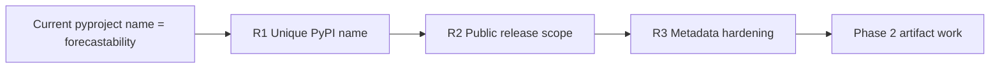
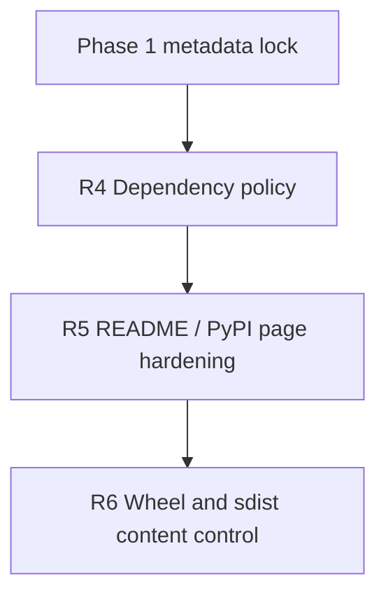
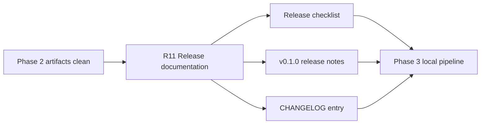
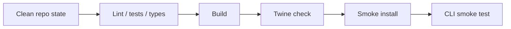
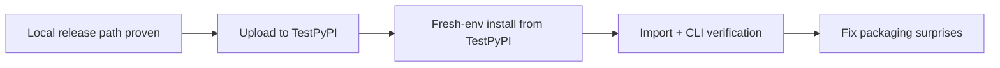
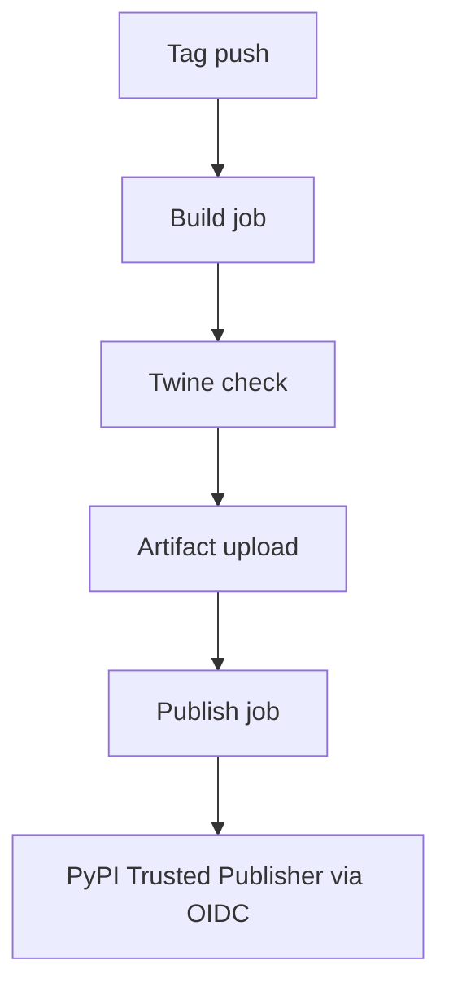
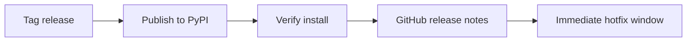

<!-- type: reference -->
# Release Plan — PyPI Publication

**Companion to:** [development_plan.md](development_plan.md), [cleaning_plan.md](cleaning_plan.md)  
**Builds on:** [acceptance_criteria.md](acceptance_criteria.md), [not_planed/pypi_release_plan.md](not_planed/pypi_release_plan.md) (original draft)  
**Status:** R0–R2 complete (2026-04-13)  
**Recommended delivery path:** merge the current docs/public-surface hardening PR first, then cut a dedicated release-prep branch from `main`  
**Last reviewed:** 2026-04-13

> **Verification snapshot on 2026-04-13 (R0–R2 complete):** `uv run pytest -q -ra` passed, `uv run ruff check .` passed, `uv run ty check` passed. `uv run python -m build` available via `build` + `twine` added to `dependency-groups.dev`. Distribution name set to `dependence-forecastability`. Public surface frozen: `run_triage`, `run_batch_triage`, `TriageRequest`, `TriageResult` added to root `__init__.py`; `py.typed` marker created; CHANGELOG support contract written.
>
> **Reviewability note:** keep PyPI work isolated from the current docs/public-surface hardening PR. Prefer one dedicated release-prep PR for R0-R3 and a follow-up PR for R4-R7 before any TestPyPI or publishing automation work.

---

## Release summary at a glance

| ID | Item | Short description | Status |
|---|---|---|---|
| R0 | Release tooling bootstrap | Make `build` and `twine` available from the documented `uv` workflow so later gate commands are executable as written. | ✅ Done (2026-04-13) |
| R1 | PyPI package naming resolution | Choose a unique distribution name while preserving `import forecastability`. | ✅ Done (2026-04-13) |
| R2 | Public package surface definition | Freeze what `0.1.0` supports in the deterministic core, CLI, extras, and root imports. | ✅ Done (2026-04-13) |
| R3 | Metadata hardening | Complete release-facing metadata, URLs, and typed-package signaling. | ✅ Done (2026-04-13) |
| R4 | Dependency policy for published wheel | Replace release-hostile equality pins with compatible external-install ranges. | Not started |
| R5 | README / PyPI landing-page hardening | Add a PyPI-first install path and minimal example before deeper GitHub-oriented material. | Not started |
| R6 | Artifact contents control | Verify wheel/sdist contents and exclude notebooks, outputs, and other noise. | Not started |
| R7 | Local release pipeline | Prove lint -> test -> build -> install -> CLI smoke from a clean environment. | Not started |
| R8 | TestPyPI dry run | Rehearse upload, install, and verification on TestPyPI before production. | Not started |
| R9 | GitHub Actions + Trusted Publishing | Automate publishing only after the manual path is proven. | Not started |
| R10 | First production release + stabilization | Publish `0.1.0`, verify external installation, and keep a short hotfix window. | Not started |
| R11 | PyPI release documentation | Ship release checklist, v0.1.0 release notes, and CHANGELOG entry before publishing. | Not started |

---

## Why a new plan structure

The repository is already beyond the "can this be packaged?" stage. It already has a
modern `pyproject.toml`, a `src/forecastability` layout, Hatchling as build backend,
optional dependency groups, and console entry points. The real problem is now
**release orchestration**: project naming, public package surface, metadata quality,
artifact validation, and safe publishing flow.

A phased release plan is a better fit than a generic backlog because PyPI release work
has hard dependencies:

1. package identity must be settled before publishing,
2. metadata must be hardened before artifact checks,
3. artifacts must pass local and TestPyPI validation before production release,
4. CI publishing should be automated only after the manual flow is proven.

### Planning principles

1. **Identity-first ordering** — resolve PyPI naming and public install surface before any upload.
2. **Small-first release** — first public version should expose the deterministic core, not the whole experimental surface.
3. **Artifact honesty** — only ship what is installable, documented, and tested.
4. **Trusted publishing end-state** — manual first if needed, but target GitHub Actions + PyPI Trusted Publishing.
5. **No interface churn without payoff** — keep the Python import namespace stable unless there is a strong reason to rename it.

---

## Repo baseline (what already exists)

Before reading the phase breakdown, note what the repo already provides:

| Capability | Status |
|---|---|
| Modern `pyproject.toml` | ✅ |
| `src/forecastability` package layout | ✅ |
| Hatchling build backend | ✅ |
| Python requirement declared (`>=3.11,<3.13`) | ✅ |
| Console entry points (`forecastability`, `forecastability-dashboard`) | ✅ |
| Optional extras for `agent` and `transport` | ✅ |
| Dev and notebook dependency groups | ✅ |
| Rich README with architecture, quickstart, and install matrix | ✅ |
| Documented `uv` toolchain already includes `build` and `twine` | ✅ |
| Documented release command path | ❌ |
| TestPyPI or PyPI upload ever attempted | ❌ |
| CI publishing workflow | ❌ |
| Unique PyPI distribution name chosen | ✅ (`dependence-forecastability`) |

---

## Release inventory and overlap assessment

| # | Release item | Phase | Overlap | Genuine new work | Status |
|---|---|---|---|---|---|
| R0 | Release tooling bootstrap | 0 | 0% | Make `build` and `twine` executable from the documented toolchain | ✅ Done |
| R1 | PyPI package naming resolution | 1 | 0% | Mandatory release blocker removal | ✅ Done |
| R2 | Public package surface definition | 1 | ~40% | Scope tightening, not new code | ✅ Done |
| R3 | Metadata hardening | 1 | ~70% | Incremental `pyproject.toml` cleanup | ✅ Done |
| R4 | Dependency policy for published wheel | 2 | ~30% | Relax runtime pins, preserve dev lock | Not started |
| R5 | README / PyPI landing-page hardening | 2 | ~50% | Re-order and simplify public install docs | Not started |
| R6 | Artifact contents control | 2 | ~40% | Explicit wheel/sdist validation rules | Not started |
| R7 | Local release pipeline | 3 | ~20% | Build/check/install smoke path | Not started |
| R8 | TestPyPI dry run | 4 | 0% | First end-to-end public packaging rehearsal | Not started |
| R9 | GitHub Actions + Trusted Publishing | 5 | 0% | Automated release workflow | Not started |
| R10 | First real PyPI release + stabilization | 6 | 0% | Tagging, changelog, rollback plan | Not started |
| R11 | PyPI release documentation | 2.5 | ~30% | Release checklist, v0.1.0 notes, CHANGELOG entry | Not started |

---

## Phased delivery

### Phase 0 — Tooling Bootstrap

> Tiny scope · Blocks every later gate · No public release surface change yet

```mermaid
flowchart LR
    A["Documented `uv` workflow"] --> B["Add `build` + `twine`"]
    B --> C["`uv run python -m build` works"]
    C --> D["Later phase gates become executable"]
```

| Item | Type | Effort |
|---|---|---|
| **R0 — Release tooling bootstrap** | Toolchain prerequisite | S |

#### R0 — Release tooling bootstrap

**Current state.** The plan's build and upload gates assume `uv run python -m build`
and `uv run twine ...` are available. Today `uv run python -m build` fails because
`build` is not installed in the documented environment, and `twine` is also not part
of the declared toolchain.

**What to build:**
- Add `build` and `twine` to the documented release toolchain
- Recommended path: extend `dependency-groups.dev` so later `uv sync --group dev`
  commands remain true as written
- Alternative if preferred: create a dedicated `release` group and update every gate
  command accordingly
- Prove `uv run python -m build` and `uv run twine check --help` start successfully
- Record the chosen toolchain rule in the release guide / plan

**Where it goes:**
- `pyproject.toml`
- `uv.lock`
- release guide / plan command snippets

**Acceptance criteria:**
- [ ] `build` and `twine` are available from the documented `uv` toolchain
- [ ] Later phase commands are executable as written
- [ ] `uv run python -m build` starts successfully
- [ ] `uv run twine check --help` starts successfully

#### Phase 0 gate

```bash
uv sync --group dev
uv run python -m build --help
uv run twine check --help
```

- Documented toolchain includes release-build utilities
- Later phase gates are executable as written

---

### Phase 1 — Identity, Scope, and Metadata Lock

> Highest content priority after Phase 0 · Low implementation risk · Removes release blockers



| Item | Type | Effort |
|---|---|---|
| **R1 — Naming resolution** | Package identity decision | S |
| **R2 — Public package surface** | Release-scope decision | S |
| **R3 — Metadata hardening** | `pyproject.toml` cleanup | S–M |

#### R1 — PyPI package naming resolution

**Current state.** `pyproject.toml` declares `name = "forecastability"`. That exact PyPI
project name is already occupied by an existing package, so releasing this project to
PyPI under `forecastability` is blocked unless you control that project on PyPI.

> [!IMPORTANT]
> The **distribution name** on PyPI and the **import package name** in Python do not
> need to be identical. You can publish as `dependence-forecastability` and still let
> users `import forecastability`.

**What to build:**
- Decision on unique PyPI distribution name
- Update `pyproject.toml` `[project] name`
- Update README install commands to use the chosen name
- Validate test install against the chosen name

**Recommended distribution names:**
- `dependence-forecastability`
- `ami-forecastability`
- `pami-forecastability`
- `forecastability-triage`

**Recommendation:** use `dependence-forecastability` for the PyPI project and keep
the Python package namespace as `forecastability`.

**Where it goes:**
- `pyproject.toml`
- `README.md` install commands
- CI config

**Acceptance criteria:**
- [ ] Unique PyPI distribution name chosen
- [ ] `pyproject.toml` updated on release branch
- [ ] README install commands updated
- [ ] Test install command validated against chosen name

---

#### R2 — Public package surface definition

**Current state.** The repo currently advertises a broad surface: deterministic core,
CLI, HTTP API, agent layer, MCP server, dashboard script, and notebook workflows. The
README already distinguishes stability levels, stating that core domain APIs are stable,
CLI/HTTP are beta, and MCP/agent layers are experimental. However, there is no formal
release-scope freeze for the first PyPI version, and `src/forecastability/__init__.py`
currently re-exports analyzers, config models, datasets, scorers, result types, and
selected triage models without an explicit release support contract.

**What to build:**
- Stability matrix in README
- Explicit "core install" and "extras install" sections
- Item-by-item audit of `src/forecastability/__init__.py` exports with explicit keep /
  deprecate / internal decisions
- Mark experimental surfaces in docs and changelog

**Decision:** first PyPI release should expose and document this support model clearly:

| Surface | Release status |
|---|---|
| Deterministic core (`run_triage`, analyzers, scorers) | Stable / primary |
| CLI | Supported |
| Dashboard | Optional / secondary |
| FastAPI transport | Extra |
| Agent layer | Extra / experimental |
| MCP server | Extra / experimental |

**Why:** the deterministic core is the strongest differentiator and the lowest-risk
install path. Extras should remain installable, but the first release should not make
them the headline.

**Where it goes:**
- `README.md`
- `src/forecastability/__init__.py`
- `CHANGELOG.md`

**Acceptance criteria:**
- [ ] Core vs extra vs experimental surfaces documented
- [ ] No experimental feature required for base install
- [ ] `src/forecastability/__init__.py` exports reviewed item by item; every supported
      root import for `0.1.0` is intentional
- [ ] Changelog states first-release support contract

---

#### R3 — Metadata hardening

**Current state.** Metadata is already decent: description, readme, license file, Python
range, keywords, classifiers, project URLs, extras, scripts, and build backend are
present. However, `authors` is missing, some classifiers are absent (`Typing :: Typed`,
`Operating System :: OS Independent`), the public documentation URL should be reviewed
as a release-facing surface, and there is currently no `py.typed` marker if typed-package
claims are kept.

**What to build:**
- Add `authors` and optionally `maintainers`
- Add `Typing :: Typed` and `Operating System :: OS Independent` classifiers
- Ensure `Documentation` URL points to the correct public docs location for the release
- Add `src/forecastability/py.typed` and ensure it ships if `Typing :: Typed` is claimed

**Recommended target:**
```toml
[project]
name = "dependence-forecastability"
authors = [{ name = "Adam Krysztopa" }]
maintainers = [{ name = "Adam Krysztopa" }]
classifiers = [
  "Development Status :: 3 - Alpha",
  "Intended Audience :: Science/Research",
  "Intended Audience :: Developers",
  "License :: OSI Approved :: MIT License",
  "Operating System :: OS Independent",
  "Programming Language :: Python :: 3",
  "Programming Language :: Python :: 3.11",
  "Programming Language :: Python :: 3.12",
  "Typing :: Typed",
  "Topic :: Scientific/Engineering",
  "Topic :: Scientific/Engineering :: Information Analysis",
]
```

**Where it goes:**
- `pyproject.toml`
- Project URLs
- `src/forecastability/py.typed` if typed-package claims are kept

> [!NOTE]
> If `Typing :: Typed` remains in the release metadata, ship `py.typed` in the wheel so
> the claim matches the artifact.

**Acceptance criteria:**
- [ ] Release metadata is complete and consistent
- [ ] Project URLs point to real public locations
- [ ] `py.typed` is shipped if `Typing :: Typed` is claimed
- [ ] `twine check` passes later without metadata/render warnings

---

#### Phase 1 gate

```bash
uv sync --group dev
uv run python -m build
uv run twine check dist/*
```

- Unique distribution name selected
- Public release scope frozen
- `pyproject.toml` metadata updated
- No unresolved naming or metadata blocker remains

---

### Phase 2 — Installability and Artifact Discipline

> Medium priority · High downstream value · Prevents bad first impressions



| Item | Type | Effort |
|---|---|---|
| **R4 — Dependency policy** | Published runtime dependency cleanup | M |
| **R5 — README hardening** | Public docs rewrite for PyPI consumption | M |
| **R6 — Artifact contents control** | Build artifact validation | S–M |

#### R4 — Dependency policy for the published wheel

**Current state.** Some runtime dependencies are pinned very tightly in
`project.dependencies`, including `matplotlib==3.10.8`, `numpy==2.4.3`, and
`pandas==3.0.1`. That is workable for a locked local environment, but it is usually
too restrictive for a PyPI package intended for external users.

**What to build:**
- Relax equality pins to compatible version ranges
- Keep reproducibility in lockfile / local dev workflow
- Verify fresh environment install succeeds with relaxed ranges
- Ensure optional extras are not silently pulled into the base install

**Recommended direction:**
```toml
dependencies = [
  "numpy>=2.0,<3",
  "pandas>=2.2,<3",
  "matplotlib>=3.8,<4",
  "scikit-learn>=1.5,<2",
  "scipy>=1.13,<2",
  "statsmodels>=0.14,<1",
  "pyyaml>=6.0,<7",
  "yfinance>=0.2,<1",
  "pydantic>=2.7,<3",
  "pydantic-settings>=2.7,<3",
]
```

**Where it goes:**
- `pyproject.toml` `[project.dependencies]`

**Acceptance criteria:**
- [ ] Tight equality pins removed from published runtime dependencies unless technically necessary
- [ ] Dev reproducibility preserved via lockfile / `uv`
- [ ] Fresh environment install succeeds
- [ ] No optional extra is silently pulled into the base install

---

#### R5 — README / PyPI landing-page hardening

**Current state.** The README is stronger than earlier drafts: it now opens with a short
value proposition, quickstart ladder, and stability guidance. But it is still
GitHub-first rather than PyPI-first. The first screen still leads with badges and
`uv`-based repo workflows, there is no canonical `pip install ...` path, there is no
minimal base-install import example, and Mermaid-heavy architecture content would render
poorly on PyPI if kept too high in the page.

**What to build:**
- Add `pip install dependence-forecastability`
- Add a minimal API example using deterministic core
- Move architecture deep-dives and Mermaid-heavy content lower
- Keep the paper alignment, but lead with user value
- Show the `uv` contributor workflow later, not as the only install story
- Ensure long sections still render cleanly in package index pages

**Recommended top order:**
1. one-sentence value proposition,
2. install command,
3. 15-line minimal example,
4. stability matrix,
5. links to docs / examples / notebooks.

**Where it goes:**
- `README.md` top sections

**Acceptance criteria:**
- [ ] First screen of README answers what it is and how to install
- [ ] Minimal example runs on base install
- [ ] Core/extra/experimental surfaces are clearly marked
- [ ] No architecture or Mermaid-heavy block appears above install + minimal example on
      the PyPI path
- [ ] Render-friendly for both GitHub and PyPI

---

#### R6 — Artifact contents control

**Current state.** The wheel target already points to `src/forecastability`, which is the
correct base. However, wheel and sdist contents have not been manually inspected for
accidental inclusion of notebooks, outputs, or large local artifacts.

**What to build:**
- Verify wheel does not accidentally ship notebooks, outputs, or large local artifacts
- Verify sdist includes what is needed for source builds and excludes noise
- Verify LICENSE and README are included
- Decide whether docs examples are shipped or remain repo-only

**Where it goes:**
- `pyproject.toml` build config
- Possibly `.gitattributes` or `MANIFEST.in`

**Acceptance criteria:**
- [ ] Wheel contains only intended runtime package files
- [ ] sdist is source-complete but not noisy
- [ ] No generated outputs or heavy assets included accidentally
- [ ] Manual inspection of `dist/*` contents completed

---

#### Phase 2 gate

```bash
rm -rf dist build *.egg-info
uv run python -m build
uv run twine check dist/*
python -m pip install --force-reinstall dist/*.whl
python -c "import forecastability; print('ok')"
```

- Base install works from local wheel
- README renders without issues
- Artifact contents are clean
- Published dependency ranges are sane

---

### Phase 2.5 — PyPI Release Documentation

> Must be completed before Phase 4 (TestPyPI) · Ships the release checklist and v0.1.0 notes



| Item | Type | Effort |
|---|---|---|
| **R11 — PyPI release documentation** | Release-facing docs | S–M |

#### R11 — PyPI release documentation

**Current state.** The repo has `docs/releases/pypi_publication.md` (publishing flow)
and `docs/releases/v0.1.0.md` (upgrade notes), but lacks a repeatable release checklist
and a user-facing release notes document suitable for GitHub Releases and PyPI pages.

**What to build:**

1. **Release checklist** (`docs/releases/release_checklist.md`) — a reusable pre-release,
   execution, and post-release checklist that the maintainer follows before every release.
   Covers version bump, CHANGELOG, smoke tests, GitHub Release creation, PyPI verification,
   badge updates, and stability decision reminders.

2. **v0.1.0 release notes** (`docs/releases/v0.1.0_release_notes.md`) — a detailed,
   user-facing document covering highlights, stable/beta/experimental surfaces, a
   60-second golden-path install example, project positioning, and known limitations.
   This serves as the base content for the GitHub Release description and CHANGELOG.

3. **CHANGELOG entry** — update `CHANGELOG.md` with a `## [0.1.0] — 2026-04-13` section
   derived from the release notes.

**Where it goes:**
- `docs/releases/release_checklist.md`
- `docs/releases/v0.1.0_release_notes.md`
- `CHANGELOG.md`

**Relationship to existing docs:**
- `docs/releases/pypi_publication.md` — documents the publishing workflow (OIDC trusted
  publishing); the checklist references it for manual steps
- `docs/releases/v0.1.0.md` — upgrade notes; the release notes document cross-references
  it for migration detail

**Acceptance criteria:**
- [ ] `docs/releases/release_checklist.md` exists and covers pre-release, execution, and post-release phases
- [ ] `docs/releases/v0.1.0_release_notes.md` exists with highlights, stability matrix, golden-path example, and known limitations
- [ ] `CHANGELOG.md` has a `[0.1.0]` section consistent with the release notes
- [ ] Release notes clearly distinguish stable, beta, and experimental surfaces
- [ ] Golden-path example uses `pip install dependence-forecastability` (or the chosen distribution name)
- [ ] No experimental feature is headlined as core in the release notes

---

#### Phase 2.5 gate

- Release checklist is complete and actionable
- v0.1.0 release notes are ready for GitHub Release and CHANGELOG use
- CHANGELOG has been updated
- Stability boundaries are consistent across release notes, README, and `docs/production_readiness.md`

---

### Phase 3 — Local Release Pipeline Proof

> Low risk · Operationally essential · Must pass before TestPyPI



| Item | Type | Effort |
|---|---|---|
| **R7 — Local release pipeline** | Repeatable release command path | S |

#### R7 — Local release pipeline

**Current state.** No documented release command path exists. The repo has build
infrastructure (`pyproject.toml`, Hatchling) but the full lint → test → build → check →
install → smoke sequence has not been codified.

**What to build:**
- Full documented command path from clean repo state to verified local wheel
- CLI smoke test from installed wheel
- Import smoke test in clean venv
- Reproducible path that someone other than the author can follow

**Canonical local release path:**
```bash
uv sync --group dev
uv run pytest -q -ra
uv run ruff check .
uv run ty check
uv run python -m build
uv run twine check dist/*
python -m venv .venv-release-smoke
source .venv-release-smoke/bin/activate
pip install dist/*.whl
python -c "import forecastability; print('import ok')"
forecastability --help
```

**Where it goes:**
- `docs/plan/` or a dedicated release guide

**Acceptance criteria:**
- [ ] Full command path documented in `docs/plan` or release guide
- [ ] CLI smoke test passes from installed wheel
- [ ] Import smoke test passes in clean venv
- [ ] Release path is reproducible by someone other than the author

---

#### Phase 3 gate

- Tests, lint, types green
- Build and `twine check` green
- Clean virtual environment install green
- CLI smoke path green

---

### Phase 4 — TestPyPI Rehearsal

> Zero production risk · Mandatory dress rehearsal



| Item | Type | Effort |
|---|---|---|
| **R8 — TestPyPI dry run** | External packaging rehearsal | S |

#### R8 — TestPyPI dry run

**Current state.** Publishing to TestPyPI has never been attempted. This is the safest
packaging rehearsal and fits the standard PyPA workflow.

**What to build:**
1. Build fresh artifacts
2. Upload to TestPyPI
3. Install from TestPyPI in a clean environment
4. Validate import path and CLI
5. Validate README / project page / metadata as rendered externally

**Suggested command path:**
```bash
uv run python -m build
uv run twine upload --repository testpypi dist/*
python -m venv .venv-testpypi
source .venv-testpypi/bin/activate
pip install --index-url https://test.pypi.org/simple/ \
  --extra-index-url https://pypi.org/simple \
  dependence-forecastability
python -c "import forecastability; print('ok')"
forecastability --help
```

**Where it goes:**
- TestPyPI project page
- `docs/`

**Acceptance criteria:**
- [ ] Upload to TestPyPI succeeds
- [ ] Install from TestPyPI succeeds
- [ ] Import namespace is correct
- [ ] Entry points are correct
- [ ] Any metadata/render issue is fixed before real PyPI

---

#### Phase 4 gate

- TestPyPI package page looks correct
- Fresh install works
- No unresolved packaging surprise remains
- Versioning scheme confirmed for first production release

---

### Phase 5 — Automated Publishing

> Medium implementation effort · Best long-term release posture



| Item | Type | Effort |
|---|---|---|
| **R9 — GitHub Actions + Trusted Publishing** | CI/CD release automation | M |

#### R9 — GitHub Actions + Trusted Publishing

**Current state.** No CI publishing workflow exists. PyPA documents GitHub Actions release
publishing with `pypa/gh-action-pypi-publish`, and PyPI documents Trusted Publishers
for GitHub Actions. This is the recommended end-state because it avoids long-lived API
tokens and uses OIDC-based identity.

**What to build:**
- `.github/workflows/publish.yml`
- Trigger on version tags like `v*`
- Separate `build` and `publish` jobs
- `id-token: write` on publish job
- Environment protection if you want manual approval before production publishing

**Reference workflow:**
```yaml
name: Publish to PyPI

on:
  push:
    tags:
      - "v*"

jobs:
  build:
    runs-on: ubuntu-latest
    steps:
      - uses: actions/checkout@v4
      - uses: actions/setup-python@v5
        with:
          python-version: "3.12"
      - run: python -m pip install --upgrade pip build twine
      - run: python -m build
      - run: twine check dist/*
      - uses: actions/upload-artifact@v4
        with:
          name: dist
          path: dist/*

  publish:
    needs: build
    runs-on: ubuntu-latest
    permissions:
      id-token: write
    steps:
      - uses: actions/download-artifact@v4
        with:
          name: dist
          path: dist
      - uses: pypa/gh-action-pypi-publish@release/v1
```

> [!NOTE]
> The workflow above uses OIDC-based Trusted Publishing. No long-lived PyPI API token is
> required. The Trusted Publisher must be configured on the PyPI project page before the
> first automated upload.

**Where it goes:**
- `.github/workflows/publish.yml`

**Acceptance criteria:**
- [ ] Trusted Publisher configured on PyPI
- [ ] GitHub workflow publishes from tag push
- [ ] Build and publish jobs are separate
- [ ] No long-lived PyPI token required
- [ ] Protected release path documented

---

#### Phase 5 gate

- Trusted Publisher configured successfully
- Dry-run tag process validated
- Workflow permissions minimal and correct
- Manual publishing path retained as fallback

---

### Phase 6 — First Production Release

> Public launch · Low code change · High communication importance



| Item | Type | Effort |
|---|---|---|
| **R10 — First real release** | Production publication and stabilization | S |

#### R10 — First production release

**Current state.** The package has not been published to PyPI.

**What to build:**

**Recommended first release version:** `0.1.0` or `0.1.0a1` on TestPyPI followed by
`0.1.0` on PyPI.

**Release content recommendation:**
- deterministic AMI / pAMI core,
- scorer registry,
- triage pipeline,
- CLI,
- package documentation,
- clearly marked optional extras.

> [!WARNING]
> Do **not** headline yet: MCP, agent workflows, dashboard, or anything experimental as
> core value. Those remain optional extras for v0.1.0.

**Post-release checks:**
- install from PyPI in clean env,
- import path check,
- CLI check,
- issue template for packaging bugs,
- first 48h stabilization window.

**Where it goes:**
- PyPI
- GitHub Releases
- `CHANGELOG.md`

**Acceptance criteria:**
- [ ] PyPI release completed successfully
- [ ] GitHub release notes published
- [ ] Installation verified externally
- [ ] Known limitations documented
- [ ] Hotfix process prepared

---

## Cross-cutting deliverables

These apply across all phases and must be maintained incrementally.

### Public release documentation framework

Each release-facing document should answer:
- what this package is,
- what is stable,
- how to install the base package,
- how to install extras,
- how to run the smallest possible example,
- where the theory and notebooks live.

### Artifact verification framework

Every candidate release must verify:
- metadata,
- wheel contents,
- sdist contents,
- import path,
- console entry points,
- optional extras,
- README rendering.

### Release governance

- Tagging scheme documented
- Changelog updated before every release
- Production publishing path documented
- Rollback / hotfix path documented
- Trusted Publishing configuration reviewed at least once after first release

---

## Exclusions

These remain out of scope for the first PyPI release:

- Conda-forge packaging
- OS-specific installers
- Docker-first distribution as the primary install path
- Rebranding the Python import namespace unless necessary
- Bundling notebooks or generated outputs into the wheel
- Treating experimental adapters as core release surface
- Major architectural refactors solely for PyPI cosmetics

---

## Definition of done (per release phase)

A phase is complete when:

- [ ] Required metadata and docs for that phase are updated
- [ ] No unresolved blocker remains for the next phase
- [ ] Commands for the phase are executable end-to-end
- [ ] Acceptance criteria for the phase are satisfied
- [ ] Result is documented in repo, not only in chat
- [ ] `uv run pytest -q -ra` · `uv run ruff check .` · `uv run ty check` pass
- [ ] `uv run python -m build` · `uv run twine check dist/*` pass where applicable

---

## Recommended execution order

1. Merge the current docs/public-surface hardening PR to `main`.
2. Cut a dedicated release-prep branch from `main`.
3. Bootstrap release tooling (R0).
4. Resolve package name (R1).
5. Freeze first-release scope (R2).
6. Harden metadata (R3).
7. Relax published dependency pins (R4).
8. Rewrite top of README for PyPI (R5).
9. Validate wheel / sdist contents (R6).
10. Ship release documentation: checklist, v0.1.0 release notes, CHANGELOG entry (R11).
11. Prove the full local release pipeline (R7).
12. Publish to TestPyPI (R8).
13. Add GitHub Actions + Trusted Publishing (R9).
14. Tag and publish the first real PyPI release (R10).

---

## Summary assessment

This repo is already close enough to publish that the job is now mostly **release
engineering**, not package creation.

The three most important early decisions are:

1. **Do not publish under `forecastability`**, because that PyPI name is already taken.
2. **Make the deterministic core the star of v0.1.0**, while keeping transport / agent / MCP surfaces clearly optional and clearly less stable.
3. **Make `build` and `twine` available from the documented `uv` toolchain** before treating any later artifact gate as real.

Operationally, implement this from a dedicated release-prep PR cut from `main`, not by
expanding the current docs/public-surface hardening PR.
