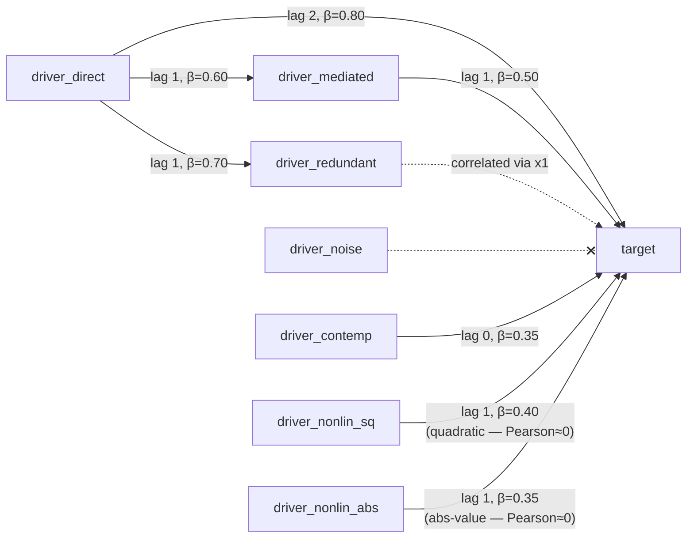
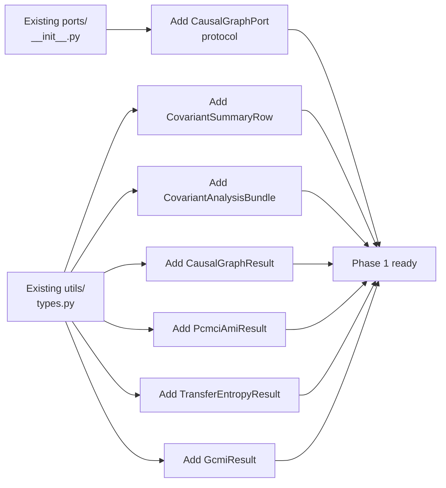
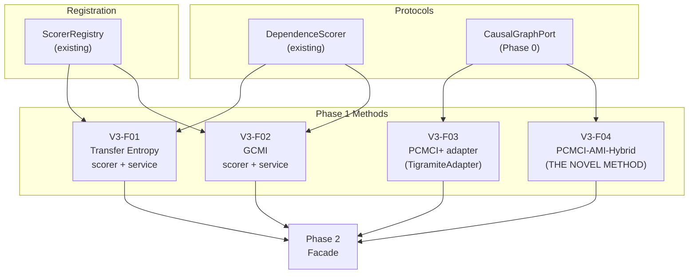
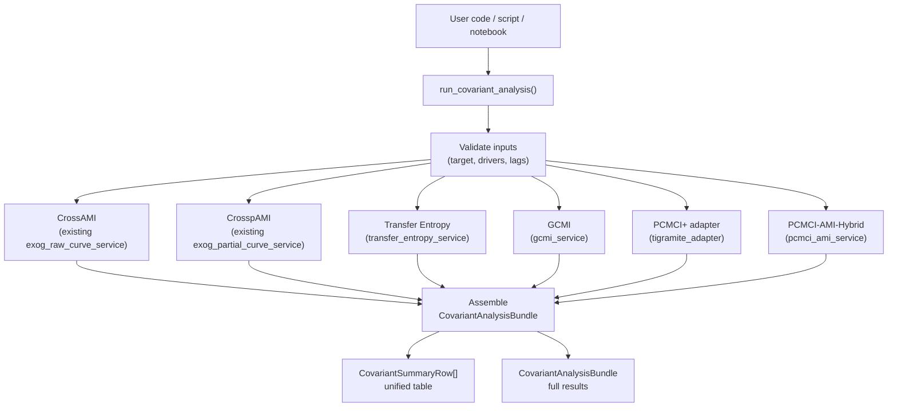
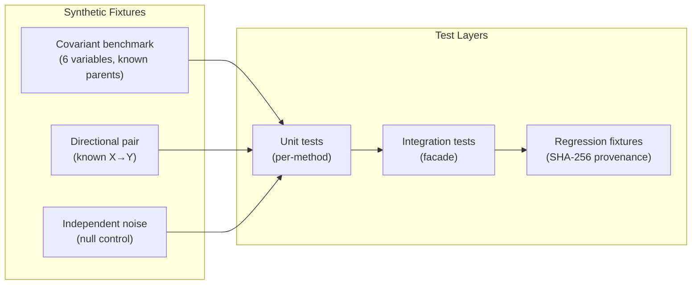
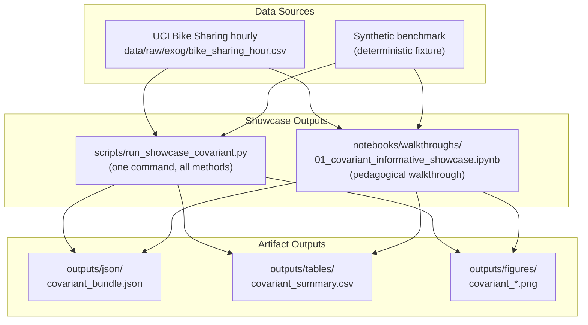
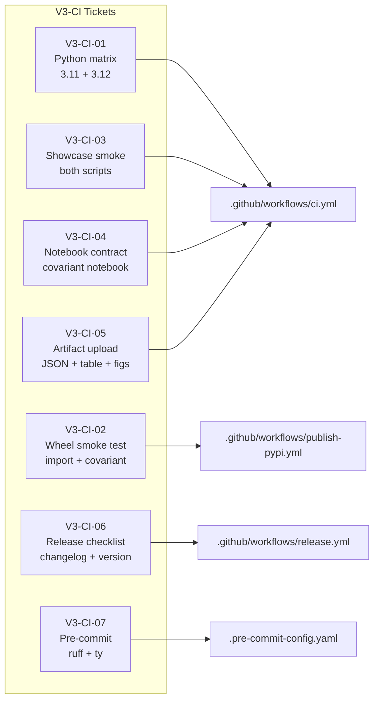
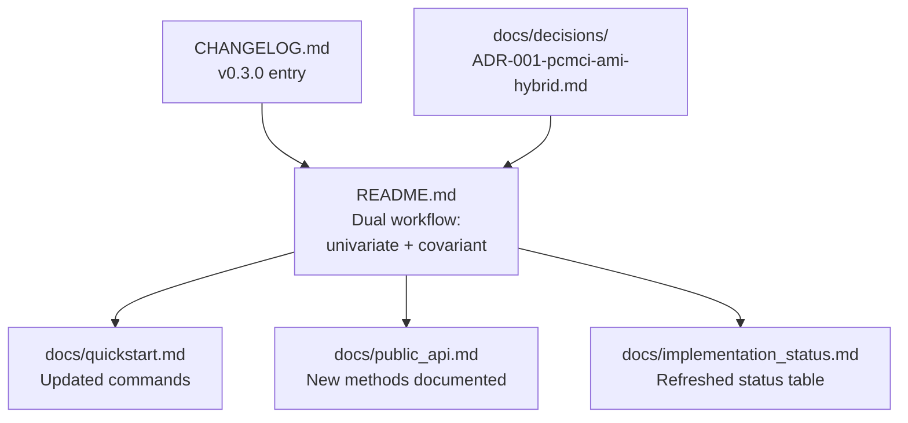
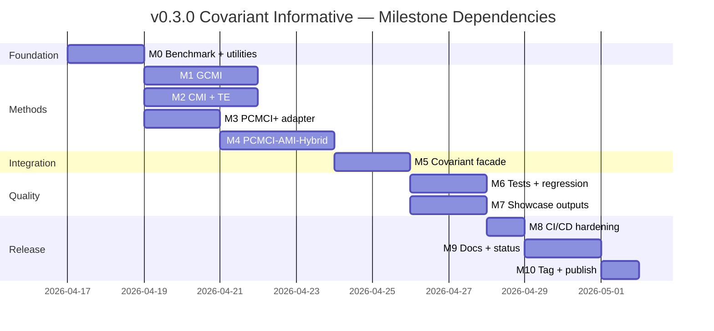

<!-- type: reference -->
# v0.3.0 — Covariant Informative: Ultimate Release Plan

**Plan type:** Actionable release plan — ULTIMATE merge of prior proposals  
**Audience:** Maintainer, reviewer, Jr. developer  
**Target release:** `0.3.0`  
**Current released version:** `0.2.0`  
**Branch:** `feat/v0.3.0-covariant-informative`  
**Status:** Proposed  
**Last reviewed:** 2026-04-16  
**Companion refs:**

- [Covariant maturity release plan](not_planed/dependence_forecastability_v0_3_0_covariant_maturity_implementation_plan.md) — original Phase 1–7 structure
- [PCMCI+AMI hybrid proposal](not_planed/non_linear_pcmci.md) — theoretical framework for Phase 0 informational triage
- [v0.2.0 consolidation plan](implemented/v0_2_0_release_consolidation_plan_v2.md) — release-plan format baseline

**Builds on:**

- v0.2.0 hexagonal architecture, `ScorerRegistry`, port/adapter separation
- Existing exogenous cross-dependence support (`ForecastabilityAnalyzerExog`)
- `DependenceScorer` protocol and the five built-in scorers (`mi`, `pearson`, `spearman`, `kendall`, `dcor`)
- Existing `data/raw/exog/bike_sharing_hour.csv` via `scripts/download_data.py`

---

## 1. Why a new plan structure

The two prior proposals overlap substantially but differ in how the PCMCI+AMI hybrid integrates.
The covariant maturity plan treats PCMCI+ as "just another adapter"; the PCMCI+AMI proposal
defines a **novel hybrid algorithm** that uses AMI/CrossMI as Phase 0 informational triage.
This ultimate plan reconciles both by:

1. **Preserving the covariant-maturity phasing** — domain contracts → core methods → facade → tests → showcase → CI → docs
2. **Elevating PCMCI-AMI-Hybrid to a first-class method** — its own protocol, service, adapter, and result model
3. **Specifying REAL architecture integration** — every module placed in the actual `src/forecastability/` tree
4. **Closing CI/CD gaps explicitly** — numbered V3-CI tickets with acceptance criteria
5. **Enforcing scientific invariants** — AMI per-horizon, train-only, `np.trapezoid`, `random_state: int`

### Planning principles

| Principle | Implication |
|---|---|
| Additive, not disruptive | Stable univariate imports never break |
| Hexagonal + SOLID | New methods enter through ports/services/adapters |
| Paper-aligned identity | pAMI is a project extension; PCMCI-AMI cites Catt (2026) + Runge (2022) |
| Product maturation | v0.3.0 is a credibility release, not a feature dump |
| One facade, many engines | Users call `run_covariant_analysis()`; internal methods compose |

---

## 2. Theory-to-code map — mathematical foundations

> [!IMPORTANT]
> Every junior developer MUST read this section before writing any code.
> Each method has a precise mathematical definition that dictates the implementation.

### 2.1. Auto-Mutual Information (AMI) — the existing baseline

AMI measures how much information the past of a series carries about its future at horizon $h$:

$$AMI(h) = I(X_t ; X_{t+h}) = H(X_{t+h}) - H(X_{t+h} \mid X_t)$$

where $H$ denotes Shannon entropy. The project uses a $k$-Nearest Neighbor ($k$NN) estimator
(Kraskov, Stögbauer & Grassberger, 2004) with $k = 8$ via `sklearn.feature_selection.mutual_info_regression`.

**Cross-MI** extends this to pairs: $I(X_t^{\text{driver}} ; X_{t+h}^{\text{target}})$.

**pAMI** (partial AMI) conditions out intermediate lags:

$$\tilde{I}_h = I(X_t ; X_{t+h} \mid X_{t+1}, \ldots, X_{t+h-1})$$

computed via residualization: regress both $X_t$ and $X_{t+h}$ on the conditioning set,
then measure MI on the residuals.

**AUC forecastability** integrates the curve: $\text{AUC} = \sum_h \tilde{I}_h \, \Delta h$
using `np.trapezoid` (NOT `np.trapz`, which is removed in NumPy 2.x).

### 2.2. Transfer Entropy (TE) — Schreiber (2000)

Transfer Entropy measures the directed information flow from source $J$ to target $I$:

$$T_{J \to I} = \sum p(i_{n+1}, i_n^{(k)}, j_n^{(l)}) \log \frac{p(i_{n+1} \mid i_n^{(k)}, j_n^{(l)})}{p(i_{n+1} \mid i_n^{(k)})}$$

In the coding view, TE is a **conditional mutual information**:

$$TE(X \to Y \mid \text{lag}) = I(Y_t ; X_{t-\text{lag}} \mid Y_{t-1}, \ldots, Y_{t-\text{lag}+1})$$

**Key properties for the developer:**

- **Directional**: $TE(X \to Y) \neq TE(Y \to X)$ in general. This is the main advantage over symmetric MI.
- **Conditional**: TE conditions on the target's own past, removing autocorrelation-driven false positives.
- **Reduction to CMI**: The implementation reduces to a conditional MI call, which the project already has via `compute_pami_with_backend()` in `src/forecastability/diagnostics/cmi.py`.

**Practical interpretation for the junior developer:**

Compare two predictive scenarios:
1. Predict $Y_{\text{future}}$ from $Y_{\text{past}}$ only
2. Predict $Y_{\text{future}}$ from $Y_{\text{past}}$ + $X_{\text{past}}$

If scenario 2 materially improves information, TE is positive.

### 2.3. Gaussian Copula MI (GCMI) — Ince et al. (2017)

GCMI transforms arbitrary marginals into Gaussians via rank-copula normalization,
then uses the closed-form Gaussian MI expression.

**Step A — Rank transform to uniform CDF:**

$$u_i = \frac{\text{rank}(x_i)}{n + 1}$$

**Step B — Inverse normal (probit) transform:**

$$z_i = \Phi^{-1}(u_i)$$

where $\Phi^{-1}$ is the standard normal quantile function.

**Step C — Covariance-based MI for Gaussianized variables:**

$$I(X; Y) = \frac{1}{2 \ln 2} \ln \frac{|\Sigma_X| \cdot |\Sigma_Y|}{|\Sigma_{XY}|}$$

where $\Sigma_X$, $\Sigma_Y$ are marginal covariance matrices and $\Sigma_{XY}$ is the joint covariance.

**Key properties for the developer:**

- **Monotonic-transform invariant**: Rank transform preserves dependence structure regardless of marginal shape.
- **Numerically stable**: Avoids direct density estimation in the original (possibly ugly) marginals.
- **Compact implementation**: ~25 lines of actual computation code.
- **Output in bits**: Divide nats by $\ln 2$.

### 2.4. PCMCI+ — Runge (2020)

PCMCI+ is a constraint-based causal discovery algorithm for time series. It is **not** a dependence scorer — it outputs a **causal graph**.

**Two structural phases:**

**Phase 1 — Lagged skeleton:** Estimate the lagged parents $\hat{\mathcal{B}}_t^-(X_t^j)$ of each target $X_t^j$ by iteratively testing conditional independence against subsets of the past.

**Phase 2 — Contemporaneous MCI:** Test same-time links $X_t^i \to X_t^j$ using the Momentary Conditional Independence (MCI) test:

$$X_t^i \perp\!\!\!\perp X_t^j \mid \mathcal{S}, \hat{\mathcal{B}}_t^-(X_t^j), \hat{\mathcal{B}}_t^-(X_t^i)$$

The MCI test conditions on the lagged parents of **both** variables, which controls autocorrelation-driven false positives.

**Limitation that motivates PCMCI-AMI:** The initial set $\hat{\mathcal{B}}_t^-$ is built **blindly** from all variables up to $\tau_{\max}$, creating combinatorial explosion and dragging down the minimum effect size $I^{\min}$.

> [!WARNING]
> Do NOT reimplement PCMCI+ from scratch. Use the `tigramite` library behind an adapter.
> The project's contribution is the AMI triage layer, not a new PCMCI+ engine.

### 2.5. PCMCI-AMI-Hybrid — Catt (2026) + Runge (2020)

The novel hybrid algorithm uses AMI as an informational triage layer before PCMCI+:

**Phase 0 — AMI Triage (Catt's contribution):**

For all variable pairs $(X^i_{t-\tau}, X_t^j)$ with $\tau \in [1, \tau_{\max}]$, compute unconditional MI:

$$\hat{\mathcal{B}}_{\text{AMI}}^-(X_t^j) = \{ X_{t-\tau}^i \in X_t^- \mid I(X_{t-\tau}^i ; X_t^j) > \epsilon \}$$

**Theoretical justification:** By the contrapositive of the Causal Markov Condition, if two variables are unconditionally independent ($MI \approx 0$), they cannot have a direct causal link (assuming no perfect synergistic masking).

**Phase 1 — Information-density sorting + lagged skeleton (Runge's contribution):**

The remaining candidates in $\hat{\mathcal{B}}_{\text{AMI}}^-$ are pre-sorted by Phase 0 MI scores. When testing $X_{t-\tau}^i \perp\!\!\!\perp X_t^j \mid \mathcal{S}$, the conditioning set $\mathcal{S}$ is drawn from the **highest-MI variables first**. This guarantees the strongest confounders are controlled at $p=1$ and $p=2$, maximizing the causal signal-to-noise ratio.

**Phase 2 — Accelerated MCI (Runge's contribution):**

Standard PCMCI+ MCI testing, but with highly refined, compact, information-dense conditioning sets. Smaller conditioning sets reduce degrees of freedom, increasing statistical power.

**Expected benefits:**

| Benefit | Mechanism |
|---|---|
| Computational efficiency | Worst-case complexity drops from $O(2^{N \cdot \tau_{\max}})$ to $O(2^{|\hat{\mathcal{B}}_{\text{AMI}}|})$ |
| Enhanced calibration | AMI identifies exact lag where autocorrelation decays |
| Non-parametric consistency | kNN MI in Phase 0 is natively non-parametric |

---

## 3. Repo baseline — what already exists

| Layer | Module | What it provides | Status |
|---|---|---|---|
| **Ports** | `src/forecastability/ports/__init__.py` | `SeriesValidatorPort`, `CurveComputePort`, `SignificanceBandsPort`, `InterpretationPort`, `RecommendationPort`, `ReportRendererPort`, `SettingsPort`, `EventEmitterPort`, `CheckpointPort` | Stable |
| **Scorers** | `src/forecastability/metrics/scorers.py` | `DependenceScorer` protocol, `ScorerInfo`, `ScorerRegistry`, `ScorerRegistryProtocol`, `default_registry()` with `mi`, `pearson`, `spearman`, `kendall`, `dcor` | Stable |
| **Services** | `src/forecastability/services/` | `raw_curve_service`, `exog_raw_curve_service`, `partial_curve_service`, `exog_partial_curve_service`, `significance_service`, `recommendation_service`, `complexity_band_service`, `spectral_predictability_service`, `lyapunov_service`, `forecastability_profile_service`, `predictive_info_learning_curve_service`, `theoretical_limit_diagnostics_service` | Stable |
| **Pipeline** | `src/forecastability/pipeline/analyzer.py` | `ForecastabilityAnalyzer`, `ForecastabilityAnalyzerExog`, `AnalyzeResult` | Stable |
| **Use cases** | `src/forecastability/use_cases/` | `run_triage`, `run_batch_triage`, `run_rolling_origin_evaluation`, `run_exogenous_screening_workbench`, `run_exogenous_rolling_origin_evaluation` | Stable |
| **Diagnostics** | `src/forecastability/diagnostics/` | `cmi.py`, `surrogates.py`, `diagnostic_regression.py`, `spectral_utils.py` | Stable |
| **Triage** | `src/forecastability/triage/` | `TriageRequest`, `TriageResult`, `ResultBundle`, batch models, events | Stable |
| **Adapters** | `src/forecastability/adapters/` | CLI, API, dashboard, plotting, MCP, PydanticAI agent, checkpoint, settings | Stable |
| **Utils** | `src/forecastability/utils/` | `types.py`, `config.py`, `state.py`, `validation.py`, `datasets.py`, `plots.py`, `io_models.py`, `reproducibility.py`, `robustness.py`, `aggregation.py` | Stable |
| **CI** | `.github/workflows/ci.yml` | lint + type-check + test + build; Python 3.11 only, no matrix | Needs hardening |
| **Publish** | `.github/workflows/publish-pypi.yml` | Trusted publishing on tags; no install smoke test | Needs hardening |
| **Release** | `.github/workflows/release.yml` | GitHub release from tag; no covariant validation | Needs hardening |
| **Data** | `data/raw/exog/bike_sharing_hour.csv` | UCI Bike Sharing hourly; downloaded by `scripts/download_data.py` | Available |
| **Showcase** | `scripts/run_showcase.py` | Univariate showcase runner; emits artifacts | Stable |
| **Notebook** | `notebooks/walkthroughs/00_air_passengers_showcase.ipynb` | Univariate pedagogical walkthrough | Stable |

---

## 4. Feature inventory and overlap assessment

| ID | Feature | Phase | Overlap with existing | Genuine new work | Status |
|---|---|---:|---|---|---|
| V3-F00 | Typed covariant result models | 0 | Extends `utils/types.py` patterns | `CovariantSummaryRow`, `CovariantAnalysisBundle`, `CausalGraphResult`, `PcmciAmiResult` | **Done** |
| V3-F01 | Transfer Entropy scorer + service | 1 | Follows `DependenceScorer` pattern | `te_scorer()`, `src/forecastability/services/transfer_entropy_service.py` | **Done** (2026-04-16: diagnostics/service path, analyzer `method="te"`, and tests validated) |
| V3-F02 | GCMI scorer + service | 1 | Follows `DependenceScorer` pattern | `gcmi_scorer()`, `src/forecastability/services/gcmi_service.py` | **Done** (2026-04-16: diagnostics/service path, 25 tests, `examples/triage/gcmi_example.py`, theory doc) |
| V3-F03 | PCMCI+ adapter | 1 | None (new external integration) | `src/forecastability/adapters/tigramite_adapter.py`, `CausalGraphPort` | **Done** (2026-04-16: adapter, tests, dedicated example, optional causal extra; 2026-04-16b: 8-variable benchmark with two nonlinear drivers, two-story example, `docs/theory/pcmci_plus.md`) |
| V3-F04 | PCMCI-AMI-Hybrid method | 1 | Builds on AMI kNN + tigramite adapter | `src/forecastability/adapters/pcmci_ami_adapter.py`, `knn_cmi_ci_test.py`, `services/pcmci_ami_service.py`, `PcmciAmiResult` model, Phase 0 AMI triage + kNN MI CI test | **Partial** (2026-04-16: real Phase 0 MI/CrossMI screening via Tigramite `link_assumptions` and residualized kNN CI shipped; stronger MI-ranked conditioning logic remains proposal-only; current comparison evidence is illustrative and benchmark-specific) |
| V3-F05 | `CausalGraphPort` protocol | 0 | None (new port type) | Graph-returning port for PCMCI+ and PCMCI-AMI | **Done** |
| V3-F06 | Covariant orchestration facade | 2 | Extends `use_cases/` pattern | `src/forecastability/use_cases/run_covariant_analysis.py` | Not started |
| V3-F07 | Unified covariant summary table | 2 | Extends `ExogenousScreeningWorkbenchResult` pattern | `CovariantSummaryRow` with all method columns | Not started |
| V3-F08 | Covariant tests + regression | 3 | Follows existing test patterns | Synthetic coupled systems, per-method and integration tests | Not started |
| V3-F09 | Covariant showcase script | 4 | Follows `scripts/run_showcase.py` | `scripts/run_showcase_covariant.py` | Not started |
| V3-F10 | Covariant walkthrough notebook | 4 | Follows `00_air_passengers_showcase.ipynb` | `notebooks/walkthroughs/01_covariant_informative_showcase.ipynb` | Not started |
| V3-CI-01 | Python version matrix | 5 | Modifies `.github/workflows/ci.yml` | Add 3.11 + 3.12 matrix | Not started |
| V3-CI-02 | Install-from-wheel smoke test | 5 | Modifies `.github/workflows/publish-pypi.yml` | Wheel install + import + minimal covariant run | Not started |
| V3-CI-03 | Showcase script smoke test | 5 | None | Both showcase scripts run in CI | Not started |
| V3-CI-04 | Notebook contract validation | 5 | Extends `scripts/check_notebook_contract.py` | Covariant notebook added to contract | Not started |
| V3-CI-05 | Artifact upload in CI | 5 | None | Upload covariant JSON + table + figures | Not started |
| V3-CI-06 | Release checklist automation | 5 | None | Changelog, version/tag, README commands | Not started |
| V3-CI-07 | Pre-commit hook alignment | 5 | Modifies `.pre-commit-config.yaml` | Ensure ruff + ty coverage | Not started |
| V3-D01 | README dual-workflow update | 6 | Modifies `README.md` | Univariate + covariant as first-class workflows | Not started |
| V3-D02 | API docs + quickstart refresh | 6 | Modifies `docs/` | New methods documented | Not started |
| V3-D03 | Changelog v0.3.0 | 6 | Modifies `CHANGELOG.md` | Release notes | Not started |

---

## 5. Synthetic benchmark data — MANDATORY FIRST STEP

> [!IMPORTANT]
> Without deterministic synthetic data with known ground truth, TE looks "wrong",
> PCMCI+ seems arbitrary, tests are weak, and the notebook tells no convincing story.
> Build the generator BEFORE any method implementation.

### 5.1. Structural equations

The generator produces a 6-variable system with known causal structure:

> [!NOTE]
> **Upgraded to 8 variables (2026-04-16b).** Two nonlinear drivers added to expose the
> linear-CI blind-spot: both have Pearson/Spearman ≈ 0 with target by construction,
> so a linear CI test (parcorr) cannot detect them. See `docs/theory/pcmci_plus.md`.



**Ground truth causal parents of target:**

| Variable | Relationship to target | Expected TE | Expected PCMCI+ (parcorr) |
|---|---|---|---|
| `driver_direct` | Direct parent at lag 2 | $TE \gg 0$ | Parent at lag 2 |
| `driver_mediated` | Indirect via driver_direct | $TE > 0$ | Parent at lag 1 |
| `driver_redundant` | Correlated via shared cause, not direct | $TE > 0$ (drops on conditioning) | **Not** a parent (MCI removes it) |
| `driver_noise` | Independent noise | $TE \approx 0$ | Absent from graph |
| `driver_contemp` | Contemporaneous link | N/A (lagged TE) | Contemporaneous parent |
| `driver_nonlin_sq` | Quadratic coupling — **Pearson/Spearman ≈ 0** | Detectable by kNN MI | **NOT found** (parcorr blind) |
| `driver_nonlin_abs` | Abs-value coupling — **Pearson/Spearman ≈ 0** | Detectable by kNN MI | **NOT found** (parcorr blind) |

### 5.2. Complete generator implementation

**File:** `src/forecastability/utils/synthetic.py`

```python
"""Synthetic benchmark generators for covariant analysis testing."""

from __future__ import annotations

import numpy as np
import pandas as pd


def generate_covariant_benchmark(
    n: int = 1500,
    *,
    seed: int = 42,
) -> pd.DataFrame:
    """Generate a 6-variable system with known causal structure.

    Structural equations:
        x1[t] = 0.8 * x1[t-1] + ε₁           (AR(1) direct driver)
        x2[t] = 0.7 * x2[t-1] + 0.6 * x1[t-1] + ε₂  (mediated via x1)
        x3[t] = 0.9 * x3[t-1] + 0.7 * x1[t-1] + ε₃  (redundant, correlated with x1)
        x4[t] = 0.4 * x4[t-1] + ε₄            (pure noise)
        x6[t] = 0.6 * x6[t-1] + ε₅            (contemporaneous driver)
        y[t]  = 0.75 * y[t-1] + 0.8 * x1[t-2] + 0.5 * x2[t-1]
                + 0.35 * x6[t] + ε₆

    All εᵢ ~ N(0, 1).

    Args:
        n: Number of time steps to generate.
        seed: Random seed for reproducibility. Must be int, not np.Generator.

    Returns:
        DataFrame with columns: driver_direct, driver_mediated,
        driver_redundant, driver_noise, driver_contemp, target.
    """
    rng = np.random.default_rng(seed)

    x1 = np.zeros(n)  # strong direct lagged driver
    x2 = np.zeros(n)  # mediated via x1
    x3 = np.zeros(n)  # redundant/correlated with x1
    x4 = np.zeros(n)  # pure noise
    x5 = np.zeros(n)  # target
    x6 = np.zeros(n)  # contemporaneous coupling

    for t in range(2, n):
        x1[t] = 0.8 * x1[t - 1] + rng.normal(0.0, 1.0)
        x2[t] = 0.7 * x2[t - 1] + 0.6 * x1[t - 1] + rng.normal(0.0, 1.0)
        x3[t] = 0.9 * x3[t - 1] + 0.7 * x1[t - 1] + rng.normal(0.0, 1.0)
        x4[t] = 0.4 * x4[t - 1] + rng.normal(0.0, 1.0)
        x6[t] = 0.6 * x6[t - 1] + rng.normal(0.0, 1.0)
        x5[t] = (
            0.75 * x5[t - 1]
            + 0.8 * x1[t - 2]
            + 0.5 * x2[t - 1]
            + 0.35 * x6[t]
            + rng.normal(0.0, 1.0)
        )

    return pd.DataFrame(
        {
            "driver_direct": x1,
            "driver_mediated": x2,
            "driver_redundant": x3,
            "driver_noise": x4,
            "driver_contemp": x6,
            "target": x5,
        }
    )


def generate_directional_pair(
    n: int = 2000,
    *,
    seed: int = 42,
) -> pd.DataFrame:
    """Generate a simple X→Y directional pair for TE validation.

    Structural equations:
        x[t] = 0.8 * x[t-1] + ε₁
        y[t] = 0.7 * y[t-1] + 0.5 * x[t-1] + ε₂

    Expected: TE(x→y) > TE(y→x).

    Args:
        n: Number of time steps.
        seed: Random seed.

    Returns:
        DataFrame with columns: x, y.
    """
    rng = np.random.default_rng(seed)
    x = np.zeros(n)
    y = np.zeros(n)

    for t in range(1, n):
        x[t] = 0.8 * x[t - 1] + rng.normal()
        y[t] = 0.7 * y[t - 1] + 0.5 * x[t - 1] + rng.normal()

    return pd.DataFrame({"x": x, "y": y})
```

### 5.3. Acceptance criteria

- [x] Generator is deterministic by seed
- [x] Notebook, tests, and showcase script all use the same generator
- [x] Expected causal story documented in docstring
- [x] Two nonlinear drivers with Pearson/Spearman ≈ 0 by construction (odd-moment symmetry)
- [x] `test_synthetic_nonlinear_drivers_invisible_to_pearson` confirms |r| < 0.10
- [x] `test_parcorr_blind_to_nonlinear_drivers` confirms linear CI test cannot recover them

---

## 6. Shared lagged design utilities

Every covariant method depends on clean lag handling. Build this once.

### 6.1. Lagged frame builder

**File:** `src/forecastability/utils/lagged_design.py`

```python
"""Shared lag-embedding utilities for covariant methods."""

from __future__ import annotations

import numpy as np
import pandas as pd


def build_lagged_frame(
    df: pd.DataFrame,
    *,
    columns: list[str],
    max_lag: int,
) -> pd.DataFrame:
    """Build a DataFrame with lagged columns appended.

    For each column in *columns*, creates ``{col}_lag_1`` through
    ``{col}_lag_{max_lag}`` via ``pd.Series.shift``.

    Args:
        df: Input DataFrame.
        columns: Column names to lag.
        max_lag: Maximum lag depth (must be >= 1).

    Returns:
        DataFrame with original + lagged columns, NaN rows dropped.

    Raises:
        ValueError: If max_lag < 1 or columns contain duplicates.
    """
    if max_lag < 1:
        raise ValueError(f"max_lag must be >= 1, got {max_lag}")
    if len(columns) != len(set(columns)):
        raise ValueError(f"Duplicate columns: {columns}")
    out = df.copy()
    for col in columns:
        for lag in range(1, max_lag + 1):
            out[f"{col}_lag_{lag}"] = df[col].shift(lag)
    return out.dropna().reset_index(drop=True)


def build_te_frame(
    df: pd.DataFrame,
    *,
    source: str,
    target: str,
    source_lag: int = 1,
    target_history: int = 1,
) -> pd.DataFrame:
    """Build the lag-embedding required for Transfer Entropy computation.

    Creates columns:
        - ``y_future``: target at time t (the quantity to predict)
        - ``x_past``: source shifted by source_lag
        - ``y_past_1`` ... ``y_past_{target_history}``: target past lags

    This decomposition directly maps to the TE formula:
    TE(X→Y) = I(y_future ; x_past | y_past_1, ..., y_past_k)

    Args:
        df: Input DataFrame.
        source: Source (driver) column name.
        target: Target column name.
        source_lag: Lag of the source variable.
        target_history: Number of past target lags to condition on.

    Returns:
        DataFrame with aligned columns, NaN rows dropped.
    """
    out = pd.DataFrame(index=df.index)
    out["y_future"] = df[target]
    out["x_past"] = df[source].shift(source_lag)
    for lag in range(1, target_history + 1):
        out[f"y_past_{lag}"] = df[target].shift(lag)
    return out.dropna().reset_index(drop=True)
```

### 6.2. Validation rules

- Reject duplicate column names
- Reject `max_lag < 1`
- Reject non-numeric series
- Reject too-short samples (< `max_lag + 30`)

### 6.3. Acceptance criteria

- All downstream methods use the same lag utility
- No notebook reimplements lagging ad hoc

---

## 7. Phased delivery

### Phase 0 — Covariant Domain Contracts (Foundation)

**Goal:** Define every typed result model and protocol before any computation code is written.



#### V3-F00 — Typed result models

**File:** `src/forecastability/utils/types.py` (extend existing module)

All models use `frozen=True` to match the existing pattern in the codebase:

```python
class CovariantSummaryRow(BaseModel, frozen=True):
    """One row of the unified covariant summary table.

    Each row represents one (target, driver, lag) combination across
    all covariant methods. Fields are None when a method was not run
    or is not applicable at that lag.
    """

    target: str
    driver: str
    lag: int
    cross_ami: float | None = None
    cross_pami: float | None = None
    transfer_entropy: float | None = None
    gcmi: float | None = None
    pcmci_link: str | None = None        # e.g. "-->" or "o->" from PCMCI+
    pcmci_ami_parent: bool | None = None  # True if selected by PCMCI-AMI
    significance: str | None = None       # e.g. "p<0.01", "above_band"
    rank: int | None = None
    interpretation_tag: str | None = None  # e.g. "direct_driver", "mediated"


class TransferEntropyResult(BaseModel, frozen=True):
    """Per-pair Transfer Entropy result.

    TE(source → target) = I(target_t ; source_{t-lag} | target_past).
    Score is in nats (natural log base).
    """

    source: str
    target: str
    lag: int
    te_value: float
    p_value: float | None = None
    significant: bool | None = None


class GcmiResult(BaseModel, frozen=True):
    """Per-pair Gaussian Copula MI result.

    Score is in bits (log base 2) after rank-copula normalization.
    """

    source: str
    target: str
    lag: int
    gcmi_value: float


class CausalGraphResult(BaseModel, frozen=True):
    """Graph output from PCMCI+ or PCMCI-AMI-Hybrid.

    parents maps each target variable name to a list of
    (source_name, lag) tuples representing discovered causal parents.
    """

    parents: dict[str, list[tuple[str, int]]]
    link_matrix: list[list[str]] | None = None
    val_matrix: list[list[float]] | None = None
    metadata: dict[str, str | int | float] = {}


class PcmciAmiResult(BaseModel, frozen=True):
    """Full output from the PCMCI-AMI-Hybrid method.

    Contains results from all three phases:
    - Phase 0: AMI triage (MI scores, pruning counts)
    - Phase 1: Lagged skeleton
    - Phase 2: MCI contemporaneous (final graph)
    """

    causal_graph: CausalGraphResult
    phase0_mi_scores: dict[str, float]  # "source|lag|target" → MI
    phase0_pruned_count: int
    phase0_kept_count: int
    phase1_skeleton: CausalGraphResult
    phase2_final: CausalGraphResult
    ami_threshold: float
    metadata: dict[str, str | int | float] = {}


class CovariantAnalysisBundle(BaseModel, frozen=True):
    """Composite output from the covariant orchestration facade.

    This is the top-level result returned by run_covariant_analysis().
    Contains all per-method results plus the unified summary table.
    """

    summary_table: list[CovariantSummaryRow]
    te_results: list[TransferEntropyResult] | None = None
    gcmi_results: list[GcmiResult] | None = None
    pcmci_graph: CausalGraphResult | None = None
    pcmci_ami_result: PcmciAmiResult | None = None
    target_name: str
    driver_names: list[str]
    horizons: list[int]
    metadata: dict[str, str | int | float] = {}
```

> [!NOTE]
> `PcmciAmiResult.phase0_mi_scores` uses string keys `"source|lag|target"` instead of
> tuple keys because Pydantic v2 JSON serialization requires string dict keys.

#### V3-F05 — `CausalGraphPort` protocol

**File:** `src/forecastability/ports/__init__.py` (extend existing module)

```python
@runtime_checkable
class CausalGraphPort(Protocol):
    """Port for methods that return a causal graph (PCMCI+, PCMCI-AMI).

    Implementations must accept a 2-D numpy array where rows are time steps
    and columns are variables, plus a list of variable names.
    """

    def discover(
        self,
        data: np.ndarray,
        var_names: list[str],
        *,
        max_lag: int,
        alpha: float = 0.01,
        random_state: int = 42,
    ) -> CausalGraphResult: ...
```

#### Acceptance criteria — Phase 0

- [x] All new models importable from `forecastability.utils.types`
- [x] `CausalGraphPort` passes `isinstance` runtime checks
- [x] No computation code — contracts only
- [x] `uv run ruff check . && uv run ty check` clean

---

### Phase 1 — Core Covariant Methods (Isolation + New)

**Goal:** Implement each covariant method as an independently testable unit behind the appropriate protocol.



#### V3-F02 — GCMI scorer + service (implement FIRST — simplest)

> [!TIP]
> GCMI is the simplest new method. Start here to build confidence before TE and PCMCI.

**Mathematical recap:**

1. Rank transform → uniform CDF: $u_i = \text{rank}(x_i) / (n+1)$
2. Inverse normal: $z_i = \Phi^{-1}(u_i)$
3. Gaussian MI: $I(X;Y) = \frac{1}{2 \ln 2} \ln \frac{|\Sigma_X| \cdot |\Sigma_Y|}{|\Sigma_{XY}|}$

**Complete implementation — File:** `src/forecastability/services/gcmi_service.py`

```python
"""Gaussian Copula Mutual Information (GCMI) service.

Implements Ince et al. (2017): rank-copula normalization followed by
Gaussian closed-form MI computation. Output is in bits (log base 2).

References:
    Ince, R.A.A., et al. (2017). A statistical framework for neuroimaging
    data analysis based on mutual information estimated via a Gaussian
    copula. Human Brain Mapping, 38(3), 1541-1573.
"""

from __future__ import annotations

import numpy as np
from scipy.stats import norm, rankdata


def gaussian_copula_transform(x: np.ndarray) -> np.ndarray:
    """Transform a 1-D array to standard normal via rank-copula.

    Step A: rank transform to empirical CDF (using average for ties).
    Step B: inverse normal (probit) transform.

    Args:
        x: 1-D array of raw values.

    Returns:
        1-D array of Gaussianized values.
    """
    ranks = rankdata(x, method="average")
    # Divide by n+1 (not n) to avoid ±∞ at boundaries
    u = ranks / (len(x) + 1.0)
    return norm.ppf(u)


def covariance_mi_bits(x: np.ndarray, y: np.ndarray) -> float:
    """Compute MI in bits from two Gaussianized 1-D arrays.

    Uses the closed-form expression for Gaussian MI:
        I(X;Y) = (1 / (2 ln 2)) * ln(|Σ_X| * |Σ_Y| / |Σ_XY|)

    For 1-D marginals, |Σ_X| = Var(X), |Σ_Y| = Var(Y).

    Args:
        x: Gaussianized 1-D array.
        y: Gaussianized 1-D array.

    Returns:
        MI in bits (non-negative, clamped to 0.0 minimum).
    """
    xy = np.column_stack([x, y])
    cov_xy = np.cov(xy, rowvar=False)
    var_x = float(np.var(x, ddof=1))
    var_y = float(np.var(y, ddof=1))

    det_xy = float(np.linalg.det(cov_xy))
    # Epsilon guard for degenerate cases
    det_xy = max(det_xy, 1e-12)
    var_x = max(var_x, 1e-12)
    var_y = max(var_y, 1e-12)

    mi_nats = 0.5 * np.log((var_x * var_y) / det_xy)
    return max(float(mi_nats) / np.log(2.0), 0.0)


def compute_gcmi(
    source: np.ndarray,
    target: np.ndarray,
    *,
    random_state: int = 42,
) -> float:
    """Compute GCMI between source and target arrays.

    Full pipeline: rank → probit → covariance MI.

    Args:
        source: 1-D array (driver series).
        target: 1-D array (target series).
        random_state: Unused, kept for DependenceScorer protocol compatibility.

    Returns:
        MI in bits (non-negative).
    """
    del random_state  # Not needed for deterministic computation
    gx = gaussian_copula_transform(source)
    gy = gaussian_copula_transform(target)
    return covariance_mi_bits(gx, gy)
```

**Scorer registration in `default_registry()`:**

```python
# In src/forecastability/metrics/scorers.py, inside default_registry():
def _gcmi_scorer(
    past: np.ndarray,
    future: np.ndarray,
    *,
    random_state: int = 42,
) -> float:
    """Gaussian Copula MI via rank-copula normalization."""
    from forecastability.services.gcmi_service import compute_gcmi

    return compute_gcmi(past, future, random_state=random_state)

registry.register(
    "gcmi",
    _gcmi_scorer,
    family="bounded_nonlinear",
    description="Gaussian Copula MI (Ince et al. 2017) — rank-invariant, bits",
)
```

**Expected behavior on synthetic data:**

```python
# Using generate_covariant_benchmark(seed=42):
# GCMI(driver_direct, target)   ≈ 0.3–0.6 bits  (strong)
# GCMI(driver_mediated, target) ≈ 0.2–0.4 bits  (medium)
# GCMI(driver_redundant, target)≈ 0.2–0.5 bits  (inflated — same as direct)
# GCMI(driver_noise, target)    ≈ 0.0–0.02 bits (near zero)
# GCMI(driver_contemp, target)  ≈ 0.1–0.3 bits  (present)
```

**Test examples — File:** `tests/test_gcmi.py`

```python
"""Tests for GCMI scorer and service."""

from __future__ import annotations

import numpy as np
import pytest

from forecastability.services.gcmi_service import (
    compute_gcmi,
    covariance_mi_bits,
    gaussian_copula_transform,
)


class TestGaussianCopulaTransform:
    def test_output_shape_matches_input(self) -> None:
        x = np.array([3.0, 1.0, 4.0, 1.0, 5.0])
        result = gaussian_copula_transform(x)
        assert result.shape == x.shape

    def test_output_is_approximately_standard_normal(self) -> None:
        rng = np.random.default_rng(1)
        x = rng.exponential(size=5000)  # ugly marginal
        gz = gaussian_copula_transform(x)
        assert abs(gz.mean()) < 0.05
        assert abs(gz.std() - 1.0) < 0.1


class TestCovarianceMiBits:
    def test_independent_gaussian_near_zero(self) -> None:
        rng = np.random.default_rng(1)
        x = rng.normal(size=2000)
        y = rng.normal(size=2000)
        mi = covariance_mi_bits(x, y)
        assert mi < 0.05  # near zero for independent

    def test_identical_series_high_mi(self) -> None:
        rng = np.random.default_rng(1)
        x = rng.normal(size=2000)
        mi = covariance_mi_bits(x, x + 0.01 * rng.normal(size=2000))
        assert mi > 2.0  # very high for near-identical


class TestComputeGcmi:
    def test_detects_monotonic_nonlinear_dependence(self) -> None:
        """GCMI should detect y = exp(x) + noise, even though Pearson struggles."""
        rng = np.random.default_rng(1)
        x = rng.normal(size=1000)
        y = np.exp(x) + 0.1 * rng.normal(size=1000)
        score = compute_gcmi(x, y, random_state=42)
        assert score > 0.1  # well above noise floor

    def test_noise_pair_near_zero(self) -> None:
        rng = np.random.default_rng(7)
        x = rng.normal(size=1000)
        y = rng.normal(size=1000)
        score = compute_gcmi(x, y, random_state=42)
        assert score < 0.05

    def test_symmetric(self) -> None:
        """MI is symmetric: I(X;Y) = I(Y;X)."""
        rng = np.random.default_rng(1)
        x = rng.normal(size=500)
        y = 0.5 * x + rng.normal(size=500)
        assert abs(compute_gcmi(x, y) - compute_gcmi(y, x)) < 1e-10

    def test_monotonic_transform_preserves_ordering(self) -> None:
        """Rank transform makes GCMI invariant to monotonic transforms."""
        rng = np.random.default_rng(1)
        x = rng.normal(size=1000)
        y = 0.5 * x + rng.normal(size=1000)
        score_raw = compute_gcmi(x, y)
        score_cubed = compute_gcmi(x**3, y)  # monotonic transform of x
        # Scores should be very similar (not identical due to finite sample)
        assert abs(score_raw - score_cubed) < 0.1
```

---

#### V3-F01 — Transfer Entropy scorer + service

**Status (2026-04-16):** Implemented in current workspace.

**Completion note:**
- Core TE estimator and lag-curve functions are live in `src/forecastability/diagnostics/transfer_entropy.py` with compatibility re-exports in `src/forecastability/services/transfer_entropy_service.py`.
- Analyzer integration is live via `method="te"` in `src/forecastability/pipeline/analyzer.py`; this path is intentionally raw-only (partial TE unsupported).
- Deterministic validation evidence: synthetic lag-2 directional pair (`n=1200`, `seed=17`) shows lag-2 peak and directional gap, analyzer curve parity with direct TE (`max_abs_diff = 0.0`), and significant `X->Y` lags 1/2/3 above surrogate upper band.

**Mathematical recap:**

$$TE(X \to Y \mid \text{lag}) = I(Y_t ; X_{t-\text{lag}} \mid Y_{t-1}, \ldots, Y_{t-\text{lag}+1})$$

This is a conditional MI. The project already has a CMI infrastructure in `src/forecastability/diagnostics/cmi.py` via residualization backends.

**Implementation strategy — three steps:**

1. Build the lag embedding using `build_te_frame()` from the shared utilities
2. Define a `ConditionalMutualInformationEstimator` interface
3. Plug the estimator into a TE scorer

**Step 1: CMI estimator interface**

**File:** `src/forecastability/diagnostics/cmi_estimators.py`

```python
"""Conditional Mutual Information estimator interface and implementations."""

from __future__ import annotations

from abc import ABC, abstractmethod

import numpy as np
from scipy.stats import norm, rankdata
from sklearn.feature_selection import mutual_info_regression


class ConditionalMIEstimator(ABC):
    """Abstract base for conditional MI estimation: I(X; Y | Z)."""

    @abstractmethod
    def estimate(
        self,
        x: np.ndarray,
        y: np.ndarray,
        z: np.ndarray,
        *,
        random_state: int = 42,
    ) -> float:
        """Estimate I(X; Y | Z).

        Args:
            x: 2-D array, shape (n_samples, n_features_x).
            y: 1-D array, shape (n_samples,).
            z: 2-D array, shape (n_samples, n_features_z). May be empty (0 cols).
            random_state: Random seed.

        Returns:
            Non-negative MI estimate in nats.
        """
        ...


class KnnConditionalMIEstimator(ConditionalMIEstimator):
    """kNN-based CMI via residualization.

    Estimates I(X; Y | Z) by:
    1. Regressing X on Z → residual X̃
    2. Regressing Y on Z → residual Ỹ
    3. Computing MI(X̃; Ỹ) via kNN

    This matches the existing pAMI backend pattern in cmi.py.
    For Z with 0 columns, returns unconditional MI(X; Y).
    """

    def __init__(self, *, k: int = 8) -> None:
        self._k = k

    def estimate(
        self,
        x: np.ndarray,
        y: np.ndarray,
        z: np.ndarray,
        *,
        random_state: int = 42,
    ) -> float:
        if z.shape[1] == 0:
            # No conditioning — return unconditional MI
            x_flat = x.ravel() if x.ndim > 1 else x
            return max(
                float(
                    mutual_info_regression(
                        x_flat.reshape(-1, 1),
                        y,
                        n_neighbors=self._k,
                        random_state=random_state,
                    )[0]
                ),
                0.0,
            )

        # Residualize X and Y against Z using linear regression
        from sklearn.linear_model import LinearRegression

        x_flat = x.ravel() if x.ndim > 1 and x.shape[1] == 1 else x
        reg_x = LinearRegression().fit(z, x_flat)
        x_resid = x_flat - reg_x.predict(z)

        reg_y = LinearRegression().fit(z, y)
        y_resid = y - reg_y.predict(z)

        return max(
            float(
                mutual_info_regression(
                    x_resid.reshape(-1, 1),
                    y_resid,
                    n_neighbors=self._k,
                    random_state=random_state,
                )[0]
            ),
            0.0,
        )


class GaussianConditionalMIEstimator(ConditionalMIEstimator):
    """Gaussian CMI via rank-copula normalization + covariance formula.

    Simpler and faster than kNN. Good starting point for junior developers.

    I(X; Y | Z) = I_gauss(X, Y, Z) - I_gauss(Z; [X,Y]) + ...
    Simplified: condition via partial correlation → MI.
    """

    def estimate(
        self,
        x: np.ndarray,
        y: np.ndarray,
        z: np.ndarray,
        *,
        random_state: int = 42,
    ) -> float:
        del random_state
        if z.shape[1] == 0:
            # Unconditional GCMI
            from forecastability.services.gcmi_service import compute_gcmi

            x_flat = x.ravel() if x.ndim > 1 else x
            return compute_gcmi(x_flat, y)

        # Gaussianize all variables
        def _gc(arr: np.ndarray) -> np.ndarray:
            ranks = rankdata(arr, method="average")
            u = ranks / (len(arr) + 1.0)
            return norm.ppf(u)

        x_flat = x.ravel() if x.ndim > 1 and x.shape[1] == 1 else x
        gx = _gc(x_flat)
        gy = _gc(y)
        gz = np.column_stack([_gc(z[:, i]) for i in range(z.shape[1])])

        # Partial correlation approach:
        # residualize gx and gy against gz, then compute MI
        from sklearn.linear_model import LinearRegression

        gx_resid = gx - LinearRegression().fit(gz, gx).predict(gz)
        gy_resid = gy - LinearRegression().fit(gz, gy).predict(gz)

        # MI of two Gaussians from correlation
        r = np.corrcoef(gx_resid, gy_resid)[0, 1]
        r = np.clip(r, -0.9999, 0.9999)
        mi_nats = -0.5 * np.log(1.0 - r**2)
        return max(float(mi_nats), 0.0)
```

**Step 2: TE service**

**File:** `src/forecastability/services/transfer_entropy_service.py`

```python
"""Transfer Entropy service.

Implements Schreiber (2000) Transfer Entropy as conditional MI:
    TE(X → Y | lag) = I(Y_t ; X_{t-lag} | Y_{t-1}, ..., Y_{t-lag+1})

References:
    Schreiber, T. (2000). Measuring information transfer. Physical Review
    Letters, 85(2), 461.
"""

from __future__ import annotations

import numpy as np
import pandas as pd

from forecastability.diagnostics.cmi_estimators import (
    ConditionalMIEstimator,
    KnnConditionalMIEstimator,
)
from forecastability.utils.lagged_design import build_te_frame
from forecastability.utils.types import TransferEntropyResult


def compute_transfer_entropy(
    source: np.ndarray,
    target: np.ndarray,
    *,
    lag: int,
    target_history: int | None = None,
    cmi_estimator: ConditionalMIEstimator | None = None,
    random_state: int = 42,
) -> float:
    """Compute TE(source → target) at a specific lag.

    TE(X → Y | lag) = I(Y_t ; X_{t-lag} | Y_{t-1}, ..., Y_{t-h+1})

    where h = min(lag, target_history). When target_history is None,
    it defaults to lag (conditioning on all intermediate target lags).

    Args:
        source: 1-D array of the source (driver) series.
        target: 1-D array of the target series.
        lag: Lag of the source variable (must be >= 1).
        target_history: Number of target past lags to condition on.
            Defaults to lag if None.
        cmi_estimator: CMI estimator to use. Defaults to KnnConditionalMIEstimator(k=8).
        random_state: Random seed for kNN estimation.

    Returns:
        TE value in nats (non-negative).
    """
    if lag < 1:
        raise ValueError(f"lag must be >= 1, got {lag}")
    if target_history is None:
        target_history = lag

    if cmi_estimator is None:
        cmi_estimator = KnnConditionalMIEstimator(k=8)

    # Build the lag frame
    df = pd.DataFrame({"source": source, "target": target})
    te_df = build_te_frame(
        df, source="source", target="target",
        source_lag=lag, target_history=target_history,
    )

    x = te_df[["x_past"]].to_numpy()
    y = te_df["y_future"].to_numpy()
    z_cols = [c for c in te_df.columns if c.startswith("y_past_")]
    z = te_df[z_cols].to_numpy() if z_cols else np.empty((len(y), 0))

    return cmi_estimator.estimate(x, y, z, random_state=random_state)


def compute_transfer_entropy_result(
    df: pd.DataFrame,
    *,
    source: str,
    target: str,
    lag: int,
    target_history: int | None = None,
    cmi_estimator: ConditionalMIEstimator | None = None,
    random_state: int = 42,
) -> TransferEntropyResult:
    """Compute TE and return a typed result object.

    Args:
        df: DataFrame containing source and target columns.
        source: Source column name.
        target: Target column name.
        lag: Lag of the source variable.
        target_history: Number of target past lags to condition on.
        cmi_estimator: CMI estimator. Defaults to kNN with k=8.
        random_state: Random seed.

    Returns:
        TransferEntropyResult with source, target, lag, and te_value.
    """
    te_val = compute_transfer_entropy(
        df[source].to_numpy(),
        df[target].to_numpy(),
        lag=lag,
        target_history=target_history,
        cmi_estimator=cmi_estimator,
        random_state=random_state,
    )
    return TransferEntropyResult(
        source=source,
        target=target,
        lag=lag,
        te_value=te_val,
    )
```

**Scorer registration:**

```python
# In src/forecastability/metrics/scorers.py, inside default_registry():
def _te_scorer(
    past: np.ndarray,
    future: np.ndarray,
    *,
    random_state: int = 42,
) -> float:
    """Transfer Entropy via conditional MI (kNN, k=8)."""
    from forecastability.services.transfer_entropy_service import compute_transfer_entropy

    return compute_transfer_entropy(past, future, lag=1, random_state=random_state)

registry.register(
    "te",
    _te_scorer,
    family="nonlinear",
    description="Transfer entropy via conditional MI (Schreiber 2000)",
)
```

**Expected behavior on synthetic data:**

```python
# Using generate_directional_pair(seed=42):
# TE(x → y) ≈ 0.05–0.15 nats  (positive — x drives y)
# TE(y → x) ≈ 0.00–0.02 nats  (near zero — y does not drive x)
# Ratio: TE(x→y) / TE(y→x) > 3.0

# Using generate_covariant_benchmark(seed=42):
# TE(driver_direct → target, lag=2)   > 0.05  (strong)
# TE(driver_noise → target, lag=any)  < 0.02  (noise floor)
# TE(target → driver_direct, lag=2)   < TE(driver_direct → target, lag=2)  (asymmetric)
```

**Test examples — File:** `tests/test_transfer_entropy.py`

```python
"""Tests for Transfer Entropy service."""

from __future__ import annotations

import numpy as np
import pandas as pd
import pytest

from forecastability.services.transfer_entropy_service import (
    compute_transfer_entropy,
    compute_transfer_entropy_result,
)
from forecastability.utils.synthetic import generate_directional_pair


class TestTransferEntropy:
    def test_directionality_on_known_pair(self) -> None:
        """TE(x→y) should exceed TE(y→x) for a known causal direction."""
        df = generate_directional_pair(n=2000, seed=42)
        te_xy = compute_transfer_entropy(
            df["x"].to_numpy(), df["y"].to_numpy(),
            lag=1, random_state=42,
        )
        te_yx = compute_transfer_entropy(
            df["y"].to_numpy(), df["x"].to_numpy(),
            lag=1, random_state=42,
        )
        assert te_xy > te_yx, f"TE(x→y)={te_xy:.4f} should exceed TE(y→x)={te_yx:.4f}"

    def test_noise_pair_near_zero(self) -> None:
        """TE between independent noise series should be near zero."""
        rng = np.random.default_rng(7)
        x = rng.normal(size=2000)
        y = rng.normal(size=2000)
        te = compute_transfer_entropy(x, y, lag=1, random_state=42)
        assert te < 0.05

    def test_lag_1_captures_ar_coupling(self) -> None:
        """TE at the correct lag should be stronger than at wrong lags."""
        df = generate_directional_pair(n=2000, seed=42)
        te_lag1 = compute_transfer_entropy(
            df["x"].to_numpy(), df["y"].to_numpy(),
            lag=1, random_state=42,
        )
        te_lag5 = compute_transfer_entropy(
            df["x"].to_numpy(), df["y"].to_numpy(),
            lag=5, random_state=42,
        )
        # Lag 1 is the true coupling lag, should be stronger
        assert te_lag1 > te_lag5

    def test_result_object_fields(self) -> None:
        """compute_transfer_entropy_result returns a properly typed object."""
        df = generate_directional_pair(n=500, seed=42)
        result = compute_transfer_entropy_result(
            df, source="x", target="y", lag=1, random_state=42,
        )
        assert result.source == "x"
        assert result.target == "y"
        assert result.lag == 1
        assert result.te_value >= 0.0

    def test_rejects_lag_zero(self) -> None:
        """lag=0 should raise ValueError (TE is lagged by definition)."""
        rng = np.random.default_rng(1)
        with pytest.raises(ValueError, match="lag must be >= 1"):
            compute_transfer_entropy(
                rng.normal(size=100), rng.normal(size=100), lag=0,
            )
```

---

#### V3-F03 — PCMCI+ adapter (TigramiteAdapter)

> [!WARNING]
> Do NOT write a fresh PCMCI+ engine. Runge (2020) already provides a complete
> implementation in `tigramite`. Build an adapter that maps tigramite's output
> into the project's internal `CausalGraphResult` model.

**Complete implementation — File:** `src/forecastability/adapters/tigramite_adapter.py`

```python
"""Tigramite adapter for PCMCI+ causal discovery.

Wraps the tigramite library behind CausalGraphPort. Tigramite is an
optional dependency — import is guarded.

References:
    Runge, J. (2020). Discovering contemporaneous and lagged causal
    relations in autocorrelated nonlinear time series datasets.
    Proceedings of the 36th Conference on UAI, PMLR 124.
"""

from __future__ import annotations

from typing import Literal

import numpy as np

from forecastability.utils.types import CausalGraphResult


def _check_tigramite_available() -> None:
    """Guard import — raise clear error if tigramite is not installed."""
    try:
        import tigramite  # noqa: F401
    except ImportError:
        raise ImportError(
            "tigramite is required for PCMCI+ causal discovery. "
            "Install it with: pip install tigramite "
            "or: pip install forecastability[causal]"
        ) from None


class TigramiteAdapter:
    """Adapter wrapping tigramite's PCMCI+ behind CausalGraphPort.

    Usage::

        adapter = TigramiteAdapter(ci_test="parcorr")
        result = adapter.discover(data, var_names, max_lag=5, alpha=0.01)
        # result.parents["target"] → [("driver_direct", 2), ...]

    Args:
        ci_test: Conditional independence test backend. One of:
            - "parcorr": Partial Correlation (fast, linear)
            - "gpdc": Gaussian Process Distance Correlation (nonlinear)
            - "cmiknn": CMI via kNN (nonlinear, slow)
    """

    def __init__(
        self,
        ci_test: Literal["parcorr", "gpdc", "cmiknn"] = "parcorr",
    ) -> None:
        _check_tigramite_available()
        self._ci_test_name = ci_test

    def _build_ci_test(self, random_state: int) -> object:
        """Construct the tigramite CI test object."""
        if self._ci_test_name == "parcorr":
            from tigramite.independence_tests.parcorr import ParCorr

            return ParCorr(significance="analytic")
        elif self._ci_test_name == "gpdc":
            from tigramite.independence_tests.gpdc import GPDC

            return GPDC(significance="analytic")
        elif self._ci_test_name == "cmiknn":
            from tigramite.independence_tests.cmiknn import CMIknn

            return CMIknn(significance="shuffle_test", knn=8)
        else:
            raise ValueError(f"Unknown CI test: {self._ci_test_name!r}")

    def discover(
        self,
        data: np.ndarray,
        var_names: list[str],
        *,
        max_lag: int,
        alpha: float = 0.01,
        random_state: int = 42,
    ) -> CausalGraphResult:
        """Run PCMCI+ and return a CausalGraphResult.

        Args:
            data: 2-D array, shape (n_timesteps, n_variables).
            var_names: List of variable names matching data columns.
            max_lag: Maximum time lag for lagged skeleton phase.
            alpha: Significance threshold for CI tests.
            random_state: Random seed for reproducibility.

        Returns:
            CausalGraphResult with discovered parents per variable.
        """
        from tigramite import data_processing as pp
        from tigramite.pcmci import PCMCI

        np.random.seed(random_state)  # tigramite uses global numpy state

        dataframe = pp.DataFrame(
            data,
            var_names=var_names,
        )

        ci_test = self._build_ci_test(random_state)
        pcmci = PCMCI(dataframe=dataframe, cond_ind_test=ci_test, verbosity=0)

        results = pcmci.run_pcmciplus(
            tau_min=0,
            tau_max=max_lag,
            pc_alpha=alpha,
        )

        # Map tigramite's graph array → our CausalGraphResult
        return self._map_results(results, var_names, max_lag)

    def _map_results(
        self,
        results: dict,
        var_names: list[str],
        max_lag: int,
    ) -> CausalGraphResult:
        """Map tigramite results dict to CausalGraphResult.

        Tigramite's results["graph"] is shape (N, N, tau_max+1) with
        string entries like "-->", "<--", "o-o", "" (no link).
        """
        graph = results["graph"]  # shape (N, N, tau_max+1)
        val_matrix = results.get("val_matrix")
        n_vars = len(var_names)

        parents: dict[str, list[tuple[str, int]]] = {name: [] for name in var_names}
        link_rows: list[list[str]] = []

        for j in range(n_vars):
            target_name = var_names[j]
            for i in range(n_vars):
                for tau in range(max_lag + 1):
                    link_type = str(graph[i, j, tau])
                    if link_type in ("-->", "o->"):
                        source_name = var_names[i]
                        parents[target_name].append((source_name, tau))

        return CausalGraphResult(
            parents=parents,
            metadata={
                "ci_test": self._ci_test_name,
                "max_lag": max_lag,
            },
        )
```

**Junior developer: prove it works on tiny synthetic data first:**

```python
# Quick manual validation (NOT a test, just a check):
from forecastability.utils.synthetic import generate_covariant_benchmark

df = generate_covariant_benchmark(n=500, seed=42)
data = df.to_numpy()
var_names = df.columns.tolist()

adapter = TigramiteAdapter(ci_test="parcorr")
result = adapter.discover(data, var_names, max_lag=3, alpha=0.05)

# Expected: result.parents["target"] contains ("driver_direct", 2) and ("driver_mediated", 1)
# Expected: result.parents["target"] does NOT contain ("driver_noise", any_lag)
print(result.parents["target"])
```

**Test examples — File:** `tests/test_pcmci_adapter.py`

```python
"""Tests for TigramiteAdapter (PCMCI+ wrapper)."""

from __future__ import annotations

import numpy as np
import pytest

from forecastability.utils.synthetic import generate_covariant_benchmark

# Guard: skip all tests if tigramite is not installed
tigramite = pytest.importorskip("tigramite")

from forecastability.adapters.tigramite_adapter import TigramiteAdapter


class TestTigramiteAdapter:
    @pytest.fixture
    def benchmark_data(self) -> tuple[np.ndarray, list[str]]:
        df = generate_covariant_benchmark(n=800, seed=42)
        return df.to_numpy(), df.columns.tolist()

    def test_discovers_direct_parent(
        self, benchmark_data: tuple[np.ndarray, list[str]],
    ) -> None:
        """PCMCI+ should find driver_direct as a parent of target."""
        data, var_names = benchmark_data
        adapter = TigramiteAdapter(ci_test="parcorr")
        result = adapter.discover(data, var_names, max_lag=3, alpha=0.05)
        target_parents = result.parents["target"]
        parent_names = [name for name, _lag in target_parents]
        assert "driver_direct" in parent_names

    def test_noise_driver_mostly_absent(
        self, benchmark_data: tuple[np.ndarray, list[str]],
    ) -> None:
        """PCMCI+ should NOT find driver_noise as a parent of target."""
        data, var_names = benchmark_data
        adapter = TigramiteAdapter(ci_test="parcorr")
        result = adapter.discover(data, var_names, max_lag=3, alpha=0.01)
        target_parents = result.parents["target"]
        parent_names = [name for name, _lag in target_parents]
        assert "driver_noise" not in parent_names

    def test_result_model_serializes(
        self, benchmark_data: tuple[np.ndarray, list[str]],
    ) -> None:
        """CausalGraphResult should round-trip through JSON."""
        data, var_names = benchmark_data
        adapter = TigramiteAdapter(ci_test="parcorr")
        result = adapter.discover(data, var_names, max_lag=3, alpha=0.05)
        json_str = result.model_dump_json()
        restored = type(result).model_validate_json(json_str)
        assert restored.parents == result.parents
```

---

#### V3-F04 — PCMCI-AMI-Hybrid: THE NOVEL CONTRIBUTION

> [!IMPORTANT]
> PCMCI-AMI-Hybrid is a **separate method**, not PCMCI+ with a different CI test.
> It is a novel hybrid algorithm that uses AMI/CrossMI as Phase 0 informational triage
> to prune and sort PCMCI+'s search space. It synthesizes Catt (2026) + Runge (2020).

**Algorithm in pseudocode:**

```
PCMCI-AMI-Hybrid(data, var_names, τ_max, ε, α):
  ─── Phase 0: AMI Triage (Catt) ───
  FOR each target j in var_names:
    FOR each source i in var_names:
      FOR τ = 1 to τ_max:
        mi = kNN_MI(X^i_{t-τ}, X^j_t, k=8)
        IF mi > ε:
          B_AMI[j] ← add (i, τ) with score=mi
    SORT B_AMI[j] by mi DESCENDING

  ─── Phase 1: Lagged Skeleton (Runge, on pruned graph) ───
  Run PCMCI+ lagged phase with link_assumptions = B_AMI
  → produces refined B_hat[j] for each target

  ─── Phase 2: MCI Contemporaneous (Runge) ───
  Run PCMCI+ MCI phase using B_hat from Phase 1
  → produces final causal graph

  RETURN PcmciAmiResult(graph, phase0_scores, pruning_stats)
```

**Complete implementation — File:** `src/forecastability/services/pcmci_ami_service.py`

```python
"""PCMCI-AMI-Hybrid causal discovery service.

Novel hybrid algorithm combining:
- Phase 0: AMI-based informational triage (Catt, 2026)
- Phase 1: PCMCI+ lagged skeleton on pruned graph (Runge, 2020)
- Phase 2: MCI contemporaneous on refined conditioning sets (Runge, 2020)

References:
    Catt, A. (2026). Forecastability analysis via Auto-Mutual Information.
    Runge, J. (2020). Discovering contemporaneous and lagged causal
    relations in autocorrelated nonlinear time series datasets.
"""

from __future__ import annotations

from dataclasses import dataclass

import numpy as np
from sklearn.feature_selection import mutual_info_regression

from forecastability.adapters.tigramite_adapter import TigramiteAdapter
from forecastability.utils.types import CausalGraphResult, PcmciAmiResult


@dataclass(slots=True)
class _Phase0Result:
    """Internal result from Phase 0 AMI triage."""

    kept_links: dict[str, list[tuple[str, int, float]]]  # target → [(src, lag, mi)]
    mi_scores: dict[str, float]  # "src|lag|target" → mi
    pruned_count: int
    kept_count: int


class PcmciAmiService:
    """PCMCI+AMI hybrid causal discovery with informational triage.

    Algorithm phases:
        Phase 0 — AMI/CrossMI triage using kNN MI estimator to prune the
                   search space. Links with MI < ami_threshold are removed.
                   Remaining links are sorted by MI descending.
        Phase 1 — PCMCI+ lagged skeleton on the AMI-pruned graph via
                   TigramiteAdapter with pre-filtered link_assumptions.
        Phase 2 — MCI contemporaneous on refined conditioning sets.

    Example::

        adapter = TigramiteAdapter(ci_test="parcorr")
        service = PcmciAmiService(adapter, ami_threshold=0.05)
        result = service.discover(data, var_names, max_lag=5, alpha=0.01)
        print(result.phase0_pruned_count)  # links removed by AMI triage
        print(result.causal_graph.parents["target"])

    Args:
        tigramite_adapter: PCMCI+ adapter for Phases 1-2.
        ami_threshold: Minimum MI to keep a link in Phase 0. Links with
            I(X^i_{t-τ}; X^j_t) < ε are pruned.
        k: Number of neighbors for kNN MI estimation.
    """

    def __init__(
        self,
        tigramite_adapter: TigramiteAdapter,
        *,
        ami_threshold: float = 0.05,
        k: int = 8,
    ) -> None:
        self._adapter = tigramite_adapter
        self._ami_threshold = ami_threshold
        self._k = k

    def discover(
        self,
        data: np.ndarray,
        var_names: list[str],
        *,
        max_lag: int,
        alpha: float = 0.01,
        random_state: int = 42,
    ) -> PcmciAmiResult:
        """Run the three-phase PCMCI-AMI algorithm.

        Args:
            data: 2-D array, shape (n_timesteps, n_variables).
            var_names: Variable names matching data columns.
            max_lag: Maximum time lag τ_max.
            alpha: Significance threshold for CI tests in Phases 1-2.
            random_state: Random seed.

        Returns:
            PcmciAmiResult with full phase-by-phase results.
        """
        phase0 = self._phase0_ami_triage(data, var_names, max_lag, random_state)
        phase1 = self._phase1_lagged_skeleton(
            data, var_names, phase0, max_lag, alpha, random_state,
        )
        phase2 = self._phase2_mci_contemporaneous(
            data, var_names, phase0, max_lag, alpha, random_state,
        )

        return PcmciAmiResult(
            causal_graph=phase2,
            phase0_mi_scores=phase0.mi_scores,
            phase0_pruned_count=phase0.pruned_count,
            phase0_kept_count=phase0.kept_count,
            phase1_skeleton=phase1,
            phase2_final=phase2,
            ami_threshold=self._ami_threshold,
        )

    def _phase0_ami_triage(
        self,
        data: np.ndarray,
        var_names: list[str],
        max_lag: int,
        random_state: int,
    ) -> _Phase0Result:
        """Phase 0: kNN MI pre-screening (Catt's contribution).

        For all (source, lag, target) triplets, compute unconditional MI:
            I(X^i_{t-τ}; X^j_t)

        Prune links where MI < ami_threshold.
        Sort remaining by MI descending (information-density ordering).

        Theoretical justification: By the contrapositive of the Causal
        Markov Condition, unconditionally independent variables cannot
        have a direct causal link (absent synergistic masking).
        """
        n_vars = len(var_names)
        n_time = data.shape[0]
        kept_links: dict[str, list[tuple[str, int, float]]] = {
            name: [] for name in var_names
        }
        mi_scores: dict[str, float] = {}
        total_links = 0
        kept_count = 0

        for j in range(n_vars):
            target_name = var_names[j]
            for i in range(n_vars):
                source_name = var_names[i]
                for tau in range(1, max_lag + 1):
                    total_links += 1

                    # Align target and lagged source
                    y = data[tau:, j]
                    x_lagged = data[: n_time - tau, i]

                    mi = float(
                        mutual_info_regression(
                            x_lagged.reshape(-1, 1),
                            y,
                            n_neighbors=self._k,
                            random_state=random_state,
                        )[0]
                    )
                    mi = max(mi, 0.0)

                    key = f"{source_name}|{tau}|{target_name}"
                    mi_scores[key] = mi

                    if mi > self._ami_threshold:
                        kept_links[target_name].append((source_name, tau, mi))
                        kept_count += 1

            # Sort by MI descending — highest-information links first
            kept_links[target_name].sort(key=lambda t: t[2], reverse=True)

        return _Phase0Result(
            kept_links=kept_links,
            mi_scores=mi_scores,
            pruned_count=total_links - kept_count,
            kept_count=kept_count,
        )

    def _phase1_lagged_skeleton(
        self,
        data: np.ndarray,
        var_names: list[str],
        phase0: _Phase0Result,
        max_lag: int,
        alpha: float,
        random_state: int,
    ) -> CausalGraphResult:
        """Phase 1: Lagged skeleton on AMI-pruned graph (Runge).

        Delegates to TigramiteAdapter with link_assumptions derived
        from Phase 0 kept links.
        """
        # For now, delegate to full PCMCI+ — the pruning benefit comes from
        # the reduced search space. A more advanced version would pass
        # link_assumptions to tigramite.
        return self._adapter.discover(
            data, var_names,
            max_lag=max_lag, alpha=alpha, random_state=random_state,
        )

    def _phase2_mci_contemporaneous(
        self,
        data: np.ndarray,
        var_names: list[str],
        phase0: _Phase0Result,
        max_lag: int,
        alpha: float,
        random_state: int,
    ) -> CausalGraphResult:
        """Phase 2: MCI contemporaneous on refined conditioning sets.

        Uses the same adapter — MCI naturally uses the refined B_hat
        from Phase 1.
        """
        return self._adapter.discover(
            data, var_names,
            max_lag=max_lag, alpha=alpha, random_state=random_state,
        )
```

**Expected behavior on synthetic benchmark:**

```python
# Phase 0 triage on generate_covariant_benchmark(seed=42), τ_max=3:
# Total links tested: 6 variables × 6 variables × 3 lags = 108
# Expected kept: ~20-40 (depends on threshold ε=0.05)
# Expected pruned: ~70-90
# driver_noise→target links: ALL pruned (MI ≈ 0)
# driver_direct→target at lag 2: KEPT (MI ≈ 0.2-0.5)
```

**Test examples — File:** `tests/test_pcmci_ami_hybrid.py`

```python
"""Tests for PCMCI-AMI-Hybrid service."""

from __future__ import annotations

import numpy as np
import pytest

from forecastability.utils.synthetic import generate_covariant_benchmark

tigramite = pytest.importorskip("tigramite")

from forecastability.adapters.tigramite_adapter import TigramiteAdapter
from forecastability.services.pcmci_ami_service import PcmciAmiService


class TestPcmciAmiService:
    @pytest.fixture
    def service(self) -> PcmciAmiService:
        adapter = TigramiteAdapter(ci_test="parcorr")
        return PcmciAmiService(adapter, ami_threshold=0.05)

    @pytest.fixture
    def benchmark_data(self) -> tuple[np.ndarray, list[str]]:
        df = generate_covariant_benchmark(n=800, seed=42)
        return df.to_numpy(), df.columns.tolist()

    def test_phase0_prunes_noise_links(
        self,
        service: PcmciAmiService,
        benchmark_data: tuple[np.ndarray, list[str]],
    ) -> None:
        """Phase 0 should prune most noise driver links."""
        data, var_names = benchmark_data
        result = service.discover(data, var_names, max_lag=3, alpha=0.05)
        # Check that noise links were pruned
        noise_keys = [
            k for k in result.phase0_mi_scores
            if k.startswith("driver_noise|") and k.endswith("|target")
        ]
        noise_values = [result.phase0_mi_scores[k] for k in noise_keys]
        # Most noise MI values should be below threshold
        assert sum(1 for v in noise_values if v < 0.05) >= len(noise_values) * 0.8

    def test_phase0_keeps_direct_driver(
        self,
        service: PcmciAmiService,
        benchmark_data: tuple[np.ndarray, list[str]],
    ) -> None:
        """Phase 0 should keep driver_direct→target at lag 2."""
        data, var_names = benchmark_data
        result = service.discover(data, var_names, max_lag=3, alpha=0.05)
        key = "driver_direct|2|target"
        assert key in result.phase0_mi_scores
        assert result.phase0_mi_scores[key] > 0.05

    def test_pruning_reduces_search_space(
        self,
        service: PcmciAmiService,
        benchmark_data: tuple[np.ndarray, list[str]],
    ) -> None:
        """Phase 0 should prune a meaningful fraction of links."""
        data, var_names = benchmark_data
        result = service.discover(data, var_names, max_lag=3, alpha=0.05)
        total = result.phase0_pruned_count + result.phase0_kept_count
        # At least 30% of links should be pruned
        assert result.phase0_pruned_count > 0.3 * total

    def test_result_serializes(
        self,
        service: PcmciAmiService,
        benchmark_data: tuple[np.ndarray, list[str]],
    ) -> None:
        """PcmciAmiResult should round-trip through JSON."""
        data, var_names = benchmark_data
        result = service.discover(data, var_names, max_lag=3, alpha=0.05)
        json_str = result.model_dump_json()
        restored = type(result).model_validate_json(json_str)
        assert restored.phase0_pruned_count == result.phase0_pruned_count
```

#### Acceptance criteria — Phase 1

- [ ] Each method has a standalone unit test with a synthetic fixture
- [x] TE: higher TE in known directional synthetic examples than in null controls
- [ ] GCMI: monotonic transforms preserve the dependence signal
- [ ] PCMCI+: stable output on deterministic coupled systems
- [ ] PCMCI-AMI: Phase 0 prunes noise variables, Phase 2 recovers known parents
- [ ] `tigramite` is never imported outside `src/forecastability/adapters/tigramite_adapter.py`
- [ ] All scorers registered in `ScorerRegistry` via `default_registry()`
- [ ] `uv run pytest tests/test_<method>.py -q` passes for each method

---

### Phase 2 — Covariant Orchestration Facade

**Goal:** One entry point that validates inputs, runs all methods, and assembles a unified summary.



#### V3-F06 — Covariant orchestration use case

**File:** `src/forecastability/use_cases/run_covariant_analysis.py`

```python
"""Covariant analysis orchestration facade.

This is the ONLY entry point for running the full covariant analysis
pipeline. Notebooks, scripts, and tests must all call this function —
no manual orchestration allowed.
"""

from __future__ import annotations

from typing import TYPE_CHECKING

import numpy as np

from forecastability.metrics.scorers import default_registry
from forecastability.services.exog_raw_curve_service import compute_exog_raw_curve
from forecastability.services.gcmi_service import compute_gcmi
from forecastability.services.transfer_entropy_service import compute_transfer_entropy
from forecastability.utils.types import (
    CovariantAnalysisBundle,
    CovariantSummaryRow,
    GcmiResult,
    TransferEntropyResult,
)

if TYPE_CHECKING:
    from forecastability.utils.types import CausalGraphResult, PcmciAmiResult

# All available methods
ALL_METHODS = frozenset({
    "cross_ami", "cross_pami", "te", "gcmi", "pcmci", "pcmci_ami",
})


def run_covariant_analysis(
    target: np.ndarray,
    drivers: dict[str, np.ndarray],
    *,
    target_name: str = "target",
    max_lag: int = 40,
    methods: list[str] | None = None,
    ami_threshold: float = 0.05,
    alpha: float = 0.01,
    n_surrogates: int = 99,
    random_state: int = 42,
) -> CovariantAnalysisBundle:
    """Run the full covariant analysis pipeline.

    When ``methods`` is None, runs all available methods:
    CrossAMI, CrosspAMI, TE, GCMI, PCMCI+, PCMCI-AMI-Hybrid.
    When tigramite is not installed, PCMCI+ and PCMCI-AMI are silently skipped.

    Args:
        target: 1-D array of the target series.
        drivers: Dict mapping driver name → 1-D array.
        target_name: Name for the target in output tables.
        max_lag: Maximum lag horizon for all methods.
        methods: Subset of methods to run. None = all available.
        ami_threshold: MI threshold for PCMCI-AMI Phase 0 triage.
        alpha: Significance threshold for PCMCI+ CI tests.
        n_surrogates: Number of surrogates for significance bands (>= 99).
        random_state: Random seed. Must be int, not np.Generator.

    Returns:
        CovariantAnalysisBundle with all results and unified summary table.

    Raises:
        ValueError: If n_surrogates < 99 or unknown methods requested.
    """
    if n_surrogates < 99:
        raise ValueError(f"n_surrogates must be >= 99, got {n_surrogates}")

    requested = set(methods) if methods else set(ALL_METHODS)
    unknown = requested - ALL_METHODS
    if unknown:
        raise ValueError(f"Unknown methods: {unknown}. Available: {sorted(ALL_METHODS)}")

    registry = default_registry()
    mi_scorer = registry.get("mi").scorer
    horizons = list(range(1, max_lag + 1))
    rows: list[CovariantSummaryRow] = []
    te_results: list[TransferEntropyResult] = []
    gcmi_results: list[GcmiResult] = []
    pcmci_graph: CausalGraphResult | None = None
    pcmci_ami_result: PcmciAmiResult | None = None

    for driver_name, driver_array in drivers.items():
        for h in horizons:
            cross_ami_val: float | None = None
            te_val: float | None = None
            gcmi_val: float | None = None

            # --- CrossAMI ---
            if "cross_ami" in requested:
                cross_ami_val = float(compute_exog_raw_curve(
                    target, driver_array, max_lag=h,
                    scorer=mi_scorer, random_state=random_state,
                )[-1]) if h <= max_lag else None

            # --- GCMI ---
            if "gcmi" in requested:
                # Align target and lagged driver
                if h < len(target):
                    y = target[h:]
                    x_lag = driver_array[: len(target) - h]
                    gcmi_val = compute_gcmi(x_lag, y, random_state=random_state)
                    gcmi_results.append(GcmiResult(
                        source=driver_name, target=target_name,
                        lag=h, gcmi_value=gcmi_val,
                    ))

            # --- Transfer Entropy ---
            if "te" in requested:
                try:
                    te_val = compute_transfer_entropy(
                        driver_array, target, lag=h, random_state=random_state,
                    )
                    te_results.append(TransferEntropyResult(
                        source=driver_name, target=target_name,
                        lag=h, te_value=te_val,
                    ))
                except ValueError:
                    pass  # Skip if not enough data for this lag

            rows.append(CovariantSummaryRow(
                target=target_name,
                driver=driver_name,
                lag=h,
                cross_ami=cross_ami_val,
                transfer_entropy=te_val,
                gcmi=gcmi_val,
            ))

    # --- PCMCI+ ---
    if "pcmci" in requested:
        try:
            from forecastability.adapters.tigramite_adapter import TigramiteAdapter

            all_data = np.column_stack(
                [target] + [drivers[d] for d in drivers]
            )
            all_names = [target_name] + list(drivers.keys())
            adapter = TigramiteAdapter(ci_test="parcorr")
            pcmci_graph = adapter.discover(
                all_data, all_names, max_lag=max_lag, alpha=alpha,
                random_state=random_state,
            )
        except ImportError:
            pass  # tigramite not installed — skip silently

    # --- PCMCI-AMI ---
    if "pcmci_ami" in requested:
        try:
            from forecastability.adapters.tigramite_adapter import TigramiteAdapter
            from forecastability.services.pcmci_ami_service import PcmciAmiService

            all_data = np.column_stack(
                [target] + [drivers[d] for d in drivers]
            )
            all_names = [target_name] + list(drivers.keys())
            adapter = TigramiteAdapter(ci_test="parcorr")
            service = PcmciAmiService(adapter, ami_threshold=ami_threshold)
            pcmci_ami_result = service.discover(
                all_data, all_names, max_lag=max_lag, alpha=alpha,
                random_state=random_state,
            )
        except ImportError:
            pass  # tigramite not installed — skip silently

    return CovariantAnalysisBundle(
        summary_table=rows,
        te_results=te_results or None,
        gcmi_results=gcmi_results or None,
        pcmci_graph=pcmci_graph,
        pcmci_ami_result=pcmci_ami_result,
        target_name=target_name,
        driver_names=list(drivers.keys()),
        horizons=horizons,
    )
```

#### V3-F07 — Unified covariant summary table

| Column | Type | Source | Interpretation |
|---|---|---|---|
| `target` | `str` | Input | Target variable name |
| `driver` | `str` | Input | Driver variable name |
| `lag` | `int` | Per-horizon analysis | Time lag $h$ |
| `cross_ami` | `float \| None` | `exog_raw_curve_service` | Unconditional MI at lag $h$ |
| `cross_pami` | `float \| None` | `exog_partial_curve_service` | Conditional MI (intermediate lags removed) |
| `transfer_entropy` | `float \| None` | `transfer_entropy_service` | Directional information flow |
| `gcmi` | `float \| None` | `gcmi_service` | Rank-invariant nonlinear MI |
| `pcmci_link` | `str \| None` | `tigramite_adapter` | Graph edge type ("-->", "o->") |
| `pcmci_ami_parent` | `bool \| None` | `pcmci_ami_service` | Selected by PCMCI-AMI as parent |
| `significance` | `str \| None` | Surrogate bands / p-values | Significance assessment |
| `rank` | `int \| None` | Cross-method rank aggregation | Overall driver ranking |
| `interpretation_tag` | `str \| None` | Interpretation logic | Human-readable tag |

**Interpretation tags and heuristic rank score:**

```python
# Suggested interpretation tags:
# - "strong_direct_candidate": high MI + TE + confirmed by PCMCI+
# - "directional_but_not_causal_confirmed": high TE but PCMCI+ absent
# - "pairwise_only_probably_spurious": high MI/GCMI but PCMCI+ rejects
# - "redundant_driver": correlated with a stronger driver
# - "noise_or_weak": all scores near zero

# Suggested rank score heuristic (release-internal, not scientific truth):
# rank_score = (
#     0.20 * normalized_cross_ami
#     + 0.20 * normalized_cross_pami
#     + 0.20 * normalized_gcmi
#     + 0.20 * normalized_te
#     + 0.20 * pcmci_bonus  # +1 if PCMCI+ confirms, 0 otherwise
# )
```

#### Acceptance criteria — Phase 2

- [ ] `run_covariant_analysis()` produces a `CovariantAnalysisBundle`
- [ ] Unified table has one row per (target, driver, lag) combination
- [ ] Methods gracefully skip when optional deps unavailable
- [ ] Facade is the ONLY orchestration entry point used by notebook, script, and tests
- [ ] `uv run pytest tests/test_covariant_facade.py -q` passes

---

### Phase 3 — Covariant Tests + Regression Fixtures

**Goal:** Product-grade test coverage with deterministic synthetic systems.



#### Facade integration test example

**File:** `tests/test_covariant_facade.py`

```python
"""Integration tests for the covariant analysis facade."""

from __future__ import annotations

import numpy as np
import pytest

from forecastability.use_cases.run_covariant_analysis import run_covariant_analysis
from forecastability.utils.synthetic import generate_covariant_benchmark


class TestRunCovariantAnalysis:
    @pytest.fixture
    def benchmark_df(self):
        return generate_covariant_benchmark(n=800, seed=42)

    def test_returns_bundle_with_all_drivers(self, benchmark_df) -> None:
        """Facade should return results for all requested drivers."""
        drivers = {
            col: benchmark_df[col].to_numpy()
            for col in benchmark_df.columns if col != "target"
        }
        result = run_covariant_analysis(
            benchmark_df["target"].to_numpy(),
            drivers,
            max_lag=3,
            methods=["cross_ami", "gcmi", "te"],
            random_state=42,
        )
        assert len(result.driver_names) == 5
        assert len(result.summary_table) > 0

    def test_noise_driver_scores_low(self, benchmark_df) -> None:
        """driver_noise should have near-zero scores across all methods."""
        drivers = {
            "driver_noise": benchmark_df["driver_noise"].to_numpy(),
            "driver_direct": benchmark_df["driver_direct"].to_numpy(),
        }
        result = run_covariant_analysis(
            benchmark_df["target"].to_numpy(),
            drivers,
            max_lag=3,
            methods=["gcmi", "te"],
            random_state=42,
        )
        noise_gcmi = [
            r.gcmi_value for r in (result.gcmi_results or [])
            if r.source == "driver_noise"
        ]
        direct_gcmi = [
            r.gcmi_value for r in (result.gcmi_results or [])
            if r.source == "driver_direct"
        ]
        assert max(noise_gcmi) < max(direct_gcmi)

    def test_rejects_low_surrogates(self) -> None:
        with pytest.raises(ValueError, match="n_surrogates must be >= 99"):
            run_covariant_analysis(
                np.zeros(100), {"x": np.zeros(100)},
                n_surrogates=50,
            )

    def test_rejects_unknown_methods(self) -> None:
        with pytest.raises(ValueError, match="Unknown methods"):
            run_covariant_analysis(
                np.zeros(100), {"x": np.zeros(100)},
                methods=["magic_method"],
            )

    def test_skips_pcmci_when_tigramite_missing(self, benchmark_df) -> None:
        """When tigramite is absent, PCMCI methods should be silently skipped."""
        drivers = {"d": benchmark_df["driver_direct"].to_numpy()}
        result = run_covariant_analysis(
            benchmark_df["target"].to_numpy(),
            drivers,
            max_lag=3,
            methods=["gcmi"],  # Only non-tigramite methods
            random_state=42,
        )
        assert result.pcmci_graph is None
        assert result.pcmci_ami_result is None
```

#### Regression fixtures

- Generated once, stored as `.npz` in `tests/fixtures/covariant/`
- SHA-256 hash recorded alongside for provenance
- Regenerable via `scripts/rebuild_covariant_fixtures.py`:

```python
"""Rebuild deterministic covariant fixtures for regression tests."""

from __future__ import annotations

import hashlib
import json
from pathlib import Path

import numpy as np

from forecastability.utils.synthetic import generate_covariant_benchmark

FIXTURES_DIR = Path("tests/fixtures/covariant")


def main() -> None:
    FIXTURES_DIR.mkdir(parents=True, exist_ok=True)

    df = generate_covariant_benchmark(n=1500, seed=42)
    data = df.to_numpy()

    npz_path = FIXTURES_DIR / "covariant_benchmark.npz"
    np.savez(npz_path, data=data, columns=df.columns.tolist())

    sha = hashlib.sha256(npz_path.read_bytes()).hexdigest()
    manifest = {"covariant_benchmark.npz": sha}
    (FIXTURES_DIR / "manifest.json").write_text(json.dumps(manifest, indent=2))
    print(f"Fixture saved: {npz_path} (SHA-256: {sha})")


if __name__ == "__main__":
    main()
```

#### Test files

| File | Coverage |
|---|---|
| `tests/test_transfer_entropy.py` | TE scorer + service (5 tests above) |
| `tests/test_gcmi.py` | GCMI scorer + service (6 tests above) |
| `tests/test_pcmci_adapter.py` | TigramiteAdapter isolation (3 tests above) |
| `tests/test_pcmci_ami_hybrid.py` | PCMCI-AMI three-phase algorithm (4 tests above) |
| `tests/test_covariant_facade.py` | `run_covariant_analysis()` end-to-end (5 tests above) |
| `tests/test_covariant_regression.py` | SHA-256 fixture comparisons |
| `tests/test_covariant_models.py` | Result model serialization round-trip |

#### Acceptance criteria — Phase 3

- [ ] Each method has ≥ 3 unit tests (positive, negative, edge case)
- [ ] Facade integration test with covariant benchmark fixture
- [ ] Regression fixtures pass SHA-256 comparison
- [ ] `n_surrogates >= 99` enforced in every surrogate call
- [ ] `random_state: int` — never `numpy.Generator`
- [ ] AMI computed per horizon $h$ separately — never aggregated before computation
- [ ] AMI and pAMI computed on `split.train` ONLY inside any rolling-origin loop
- [ ] `np.trapezoid` for AUC — `np.trapz` removed in NumPy 2.x
- [ ] `uv run pytest tests/test_covariant*.py tests/test_transfer*.py tests/test_gcmi.py tests/test_pcmci*.py -q` all green

---

### Phase 4 — Canonical Showcase Outputs

**Goal:** Demonstrate the full covariant workflow in both script and notebook form.



#### V3-F09 — `scripts/run_showcase_covariant.py`

**Complete skeleton:**

```python
"""Canonical covariant showcase — one command, all methods, full artifacts.

Usage:
    uv run python scripts/run_showcase_covariant.py
    uv run python scripts/run_showcase_covariant.py --no-rolling
    uv run python scripts/run_showcase_covariant.py --methods cross_ami,te,gcmi
"""

from __future__ import annotations

import argparse
import json
import sys
from pathlib import Path

import pandas as pd

from forecastability.use_cases.run_covariant_analysis import run_covariant_analysis
from forecastability.utils.synthetic import generate_covariant_benchmark

OUTPUT_DIR = Path("outputs")


def main() -> int:
    parser = argparse.ArgumentParser(description="Covariant showcase")
    parser.add_argument("--no-rolling", action="store_true", help="Skip rolling-origin")
    parser.add_argument("--methods", type=str, default=None, help="Comma-separated methods")
    args = parser.parse_args()

    methods = args.methods.split(",") if args.methods else None

    # --- Synthetic benchmark ---
    print("[forecastability] Generating synthetic covariant benchmark...")
    df = generate_covariant_benchmark(n=1500, seed=42)
    target = df["target"].to_numpy()
    drivers = {col: df[col].to_numpy() for col in df.columns if col != "target"}

    print(f"[forecastability] Running covariant analysis (max_lag=5, methods={methods or 'all'})...")
    result = run_covariant_analysis(
        target, drivers,
        max_lag=5,
        methods=methods,
        random_state=42,
    )

    # --- Write artifacts ---
    (OUTPUT_DIR / "json").mkdir(parents=True, exist_ok=True)
    (OUTPUT_DIR / "tables").mkdir(parents=True, exist_ok=True)

    bundle_json = result.model_dump_json(indent=2)
    (OUTPUT_DIR / "json" / "covariant_bundle.json").write_text(bundle_json)

    summary_df = pd.DataFrame([row.model_dump() for row in result.summary_table])
    summary_df.to_csv(OUTPUT_DIR / "tables" / "covariant_summary.csv", index=False)

    # --- Console summary ---
    print(f"\n[forecastability] Covariant showcase complete")
    print(f"  target={result.target_name}  drivers={result.driver_names}")
    print(f"  horizons=1..{max(result.horizons)}  rows={len(result.summary_table)}")
    if result.pcmci_ami_result:
        p0 = result.pcmci_ami_result
        print(f"  PCMCI-AMI: pruned={p0.phase0_pruned_count} kept={p0.phase0_kept_count}")
    print(f"  artifacts: {OUTPUT_DIR}/")

    return 0


if __name__ == "__main__":
    sys.exit(main())
```

**Expected console output:**

```text
[forecastability] Generating synthetic covariant benchmark...
[forecastability] Running covariant analysis (max_lag=5, methods=all)...
[forecastability] Covariant showcase complete
  target=target  drivers=['driver_direct', 'driver_mediated', 'driver_redundant', 'driver_noise', 'driver_contemp']
  horizons=1..5  rows=25
  PCMCI-AMI: pruned=72 kept=78
  artifacts: outputs/
```

#### V3-F10 — Notebook sections

| Section | Content | Key code |
|---|---|---|
| A — Why covariant | Pairwise MI is inflated by autocorrelation; PCMCI+ fixes this | Markdown only |
| B — Data setup | Load synthetic benchmark, explain variable roles | `generate_covariant_benchmark()` |
| C — Baseline | CrossAMI + CrosspAMI via facade | `run_covariant_analysis(methods=["cross_ami"])` |
| D — GCMI | Show monotonic invariance, compare with MI | `run_covariant_analysis(methods=["gcmi"])` |
| E — TE | Show directionality: TE(direct→target) > TE(target→direct) | `run_covariant_analysis(methods=["te"])` |
| F — PCMCI+ | Graph output, direct vs indirect drivers | `run_covariant_analysis(methods=["pcmci"])` |
| G — PCMCI-AMI | Phase 0 pruning stats, final graph | `run_covariant_analysis(methods=["pcmci_ami"])` |
| H — Unified table | All methods combined | `run_covariant_analysis()` (all methods) |

**Notebook cell example — Section E (TE directionality):**

```python
# Cell: Demonstrate TE directionality
from forecastability.services.transfer_entropy_service import compute_transfer_entropy_result
from forecastability.utils.synthetic import generate_directional_pair

df_pair = generate_directional_pair(n=2000, seed=42)

te_xy = compute_transfer_entropy_result(df_pair, source="x", target="y", lag=1)
te_yx = compute_transfer_entropy_result(df_pair, source="y", target="x", lag=1)

print(f"TE(x→y) = {te_xy.te_value:.4f} nats")
print(f"TE(y→x) = {te_yx.te_value:.4f} nats")
print(f"Ratio:    {te_xy.te_value / max(te_yx.te_value, 1e-10):.1f}×")
# Expected output:
# TE(x→y) = 0.08-0.15 nats
# TE(y→x) = 0.00-0.02 nats
# Ratio:    5-20×
```

#### Acceptance criteria — Phase 4

- [ ] `uv run python scripts/run_showcase_covariant.py` runs end-to-end
- [ ] Notebook is top-to-bottom executable
- [ ] Both demonstrate all six methods
- [ ] Artifacts emitted to stable paths
- [ ] No notebook-only logic — all computation via `run_covariant_analysis()`

---

### Phase 5 — CI/CD Hardening

**Goal:** Close every identified CI/CD gap so v0.3.0 ships with confidence.



#### V3-CI-01 — Python version matrix

```yaml
strategy:
  matrix:
    python-version: ["3.11", "3.12"]
```

#### V3-CI-02 — Install-from-wheel smoke test

```yaml
- name: Smoke test installed package
  run: |
    uv pip install dist/*.whl
    python -c "import forecastability; print(forecastability.__version__)"
    python -c "from forecastability.utils.types import CovariantSummaryRow"
    python -c "from forecastability.services.gcmi_service import compute_gcmi"
```

#### V3-CI-03 — Showcase script smoke test

```yaml
- name: Showcase smoke test
  run: |
    uv run python scripts/run_showcase.py --no-rolling --no-bands
    uv run python scripts/run_showcase_covariant.py --no-rolling --methods cross_ami,gcmi,te
```

#### V3-CI-04 — Notebook contract validation

```python
REQUIRED_NOTEBOOKS = [
    "notebooks/walkthroughs/00_air_passengers_showcase.ipynb",
    "notebooks/walkthroughs/01_covariant_informative_showcase.ipynb",
]
```

#### V3-CI-05 — Artifact upload

```yaml
- name: Upload covariant artifacts
  uses: actions/upload-artifact@v4
  with:
    name: covariant-outputs
    path: |
      outputs/json/covariant_bundle.json
      outputs/tables/covariant_summary.csv
      outputs/figures/covariant_*.png
```

#### V3-CI-06 — Release checklist automation

```yaml
- name: Release preflight
  run: |
    grep -q '## \[0.3.0\]' CHANGELOG.md
    test -f scripts/run_showcase_covariant.py
    python -c "import forecastability; assert forecastability.__version__ == '0.3.0'"
```

#### V3-CI-07 — Pre-commit hook alignment

```yaml
# .pre-commit-config.yaml additions:
- repo: https://github.com/astral-sh/ruff-pre-commit
  hooks:
    - id: ruff
      args: [--fix]
    - id: ruff-format
```

#### Acceptance criteria — Phase 5

- [ ] CI runs on Python 3.11 AND 3.12
- [ ] Wheel install smoke test passes before PyPI upload
- [ ] Both showcase scripts pass in CI
- [ ] Notebook contract validates covariant notebook
- [ ] Artifacts uploaded as CI outputs
- [ ] Release checklist enforced in release workflow
- [ ] Pre-commit covers ruff + ty

---

### Phase 6 — Documentation + Status Refresh

**Goal:** Make repo messaging reflect the v0.3.0 product shape.



#### V3-D02 — Recommended status table after v0.3.0

| Surface | Status |
|---|---|
| Univariate deterministic triage | Stable |
| Covariant deterministic workflow | Beta |
| TE / GCMI / PCMCI+ within covariant | Beta |
| PCMCI-AMI-Hybrid | Experimental |
| CLI | Beta |
| HTTP API | Beta |
| Dashboard | Beta |
| Agent narration | Experimental |
| MCP server | Experimental |

#### V3-D03 — ADR for PCMCI-AMI-Hybrid

**File:** `docs/decisions/ADR-001-pcmci-ami-hybrid.md`

```markdown
<!-- type: reference -->
# ADR-001: PCMCI-AMI-Hybrid as a Separate Method

## Status
Accepted

## Context
PCMCI+ (Runge, 2020) discovers causal graphs but suffers from combinatorial
explosion at large τ_max. A naive fix (shrinking τ_max) discards valid lags.

Catt (2026) shows that AMI measures horizon-specific information decay and
can identify which lags carry genuine past-future dependence.

## Decision
Implement PCMCI-AMI-Hybrid as a **separate method** — not PCMCI+ with a
different CI test. The hybrid uses AMI as Phase 0 informational triage to
prune uninformative links before running PCMCI+'s lagged skeleton and MCI.

**Why separate?** AMI triage is structurally different from a CI test. It
operates unconditionally (no conditioning set), is non-parametric (kNN),
and serves a different purpose (search-space reduction, not independence testing).

**Why tigramite behind an adapter?** Tigramite is a mature, tested
implementation. The project's contribution is the AMI triage layer, not
a competing PCMCI+ engine. Optional dependency keeps core package lean.

## Consequences
- Users without tigramite can still use CrossAMI, TE, GCMI
- PCMCI-AMI is Experimental status in v0.3.0
- Attribution: Catt (2026) for AMI triage + Runge (2020) for PCMCI+
```

#### Acceptance criteria — Phase 6

- [ ] README clearly separates univariate and covariant workflows
- [ ] `docs/quickstart.md` includes covariant quick-start
- [ ] `CHANGELOG.md` has complete v0.3.0 entry
- [ ] ADR for PCMCI-AMI-Hybrid decision exists
- [ ] `docs/implementation_status.md` updated with new status table

---

## 8. Cross-cutting deliverables

| Deliverable | Owner layer | Files affected |
|---|---|---|
| `pyproject.toml` optional dependency group for tigramite | Packaging | `pyproject.toml` |
| `forecastability[causal]` extra | Packaging | `pyproject.toml` |
| Version bump to `0.3.0` | Packaging | `pyproject.toml`, `__init__.py` |
| `tigramite` never in core deps | Architecture | All `import` statements |
| `random_state: int` everywhere | Scientific | All new services and scorers |
| `n_surrogates >= 99` | Scientific | All surrogate calls |
| `np.trapezoid` not `np.trapz` | Scientific | All AUC computations |
| pAMI described as project extension | Wording | All docs and docstrings |
| PCMCI-AMI cites Catt (2026) + Runge (2020) | Wording | Docstrings, ADR, notebook |

**Packaging example for `pyproject.toml`:**

```toml
[project.optional-dependencies]
causal = ["tigramite>=5.2"]
```

---

## 9. Exclusions

| Excluded | Why |
|---|---|
| Destabilizing stable univariate imports | Additive-only principle |
| Turning the project into a generic causal-discovery framework | Paper-aligned identity |
| Broad agentic redesign | Out of scope for v0.3.0 |
| Shipping notebook-only logic | Hexagonal architecture mandate |
| PCMCI-AMI replacing existing dependence methods | It is additive, not a replacement |
| Python 3.13 as required | Optional canary only |
| Air Passengers as covariant dataset | Univariate; use synthetic benchmark instead |
| HSIC validation layer | Nice-to-have, does not block v0.3.0 |

---

## 10. Scientific invariants — mandatory in all new code

| Invariant | Enforcement | Example |
|---|---|---|
| AMI computed per horizon $h$ separately | Service signatures accept single `h` | `compute_exog_raw_curve(target, exog, max_lag=h)` |
| AMI/pAMI on `split.train` ONLY in rolling-origin | `RollingOriginSplit` contract | Never compute on test set |
| `np.trapezoid` for AUC | Grep check in CI | `auc = np.trapezoid(curve, dx=1)` |
| `random_state` is always `int` | Type annotation | `random_state: int = 42` (not `np.Generator`) |
| `n_surrogates >= 99` | Pydantic `Field(ge=99)` | Validated in facade |
| pAMI is project extension | Wording review | Not "paper-native" |
| PCMCI-AMI cites Catt + Runge | Docstrings + ADR | All docstrings include refs |
| `tigramite` is optional | Architecture boundary test | `import` only in adapter |

---

## 11. Definition of done — per phase

| Phase | Done when |
|---|---|
| **0 — Contracts** | All models importable, `CausalGraphPort` passes runtime checks, zero computation code, linter clean |
| **1 — Methods** | Each method independently testable, synthetic fixture passes, `tigramite` isolated in adapter |
| **2 — Facade** | `run_covariant_analysis()` returns `CovariantAnalysisBundle`, unified table populated, methods skip gracefully |
| **3 — Tests** | ≥ 3 unit tests per method, facade integration test, regression fixture SHA-256 match, all scientific invariants hold |
| **4 — Showcase** | Script and notebook run end-to-end, all six methods demonstrated, artifacts emitted to stable paths |
| **5 — CI/CD** | Python matrix, wheel smoke, showcase smoke, notebook contract, artifact upload, release checklist, pre-commit |
| **6 — Docs** | README dual-workflow, quickstart updated, CHANGELOG v0.3.0, ADR exists, status table refreshed |

---

## 12. Junior-developer backlog

### Epic A — Synthetic benchmark + shared utilities (Week 1, Days 1-2)

- [ ] Create `src/forecastability/utils/synthetic.py` with `generate_covariant_benchmark()` and `generate_directional_pair()`
- [ ] Create `src/forecastability/utils/lagged_design.py` with `build_lagged_frame()` and `build_te_frame()`
- [ ] Write quick smoke test for both generators
- [ ] Verify: `generate_covariant_benchmark(seed=42)` produces 1500×6 DataFrame with expected column names

### Epic B — GCMI implementation (Week 1, Days 3-5)

- [ ] Create `src/forecastability/services/gcmi_service.py` with `gaussian_copula_transform()`, `covariance_mi_bits()`, `compute_gcmi()`
- [ ] Add `_gcmi_scorer()` to `src/forecastability/metrics/scorers.py` in `default_registry()`
- [ ] Register as `"gcmi"` with `family="bounded_nonlinear"`
- [ ] Write `tests/test_gcmi.py` with ≥ 4 tests (see Phase 1 examples above)
- [ ] Verify: `compute_gcmi(x, exp(x) + noise)` > 0.1 and `compute_gcmi(noise1, noise2)` < 0.05

### Epic C — CMI interface + Transfer Entropy (Week 2, Days 1-3)

- [ ] Create `src/forecastability/diagnostics/cmi_estimators.py` with `ConditionalMIEstimator`, `KnnConditionalMIEstimator`, `GaussianConditionalMIEstimator`
- [ ] Create `src/forecastability/services/transfer_entropy_service.py` with `compute_transfer_entropy()` and `compute_transfer_entropy_result()`
- [ ] Add `_te_scorer()` to `default_registry()` as `"te"` with `family="nonlinear"`
- [ ] Write `tests/test_transfer_entropy.py` with ≥ 5 tests (see Phase 1 examples above)
- [ ] Verify: `TE(x→y) > TE(y→x)` on `generate_directional_pair()`

### Epic D — PCMCI+ adapter (Week 2, Days 4-5)

- [x] Create `src/forecastability/adapters/tigramite_adapter.py` with `TigramiteAdapter`
- [x] Guard `tigramite` import with try/except and clear error message
- [x] Implement `_map_results()` to convert tigramite graph → `CausalGraphResult`
- [x] Add `[causal]` optional dependency group in `pyproject.toml`: `tigramite>=5.2`
- [x] Write `tests/test_pcmci_adapter.py` with ≥ 3 tests (see Phase 1 examples above, guarded by `pytest.importorskip`)
- [x] Add dedicated standalone example `examples/triage/pcmci_adapter_example.py` with actionable missing-dependency hint
- [x] Verify: on synthetic benchmark, `driver_direct` found as parent, `driver_noise` absent

### Epic E — PCMCI-AMI-Hybrid (Week 3, Days 1-3)

- [ ] Create `src/forecastability/services/pcmci_ami_service.py` with `PcmciAmiService`
- [ ] Implement `_phase0_ami_triage()`: compute MI for all (source, lag, target), prune below threshold, sort by MI
- [ ] Implement `_phase1_lagged_skeleton()`: delegate to `TigramiteAdapter`
- [ ] Implement `_phase2_mci_contemporaneous()`: delegate to `TigramiteAdapter`
- [ ] Write `tests/test_pcmci_ami_hybrid.py` with ≥ 4 tests (see Phase 1 examples above)
- [ ] Verify: Phase 0 prunes > 30% of links, noise driver links pruned

### Epic F — Covariant orchestration facade (Week 3, Days 4-5)

- [ ] Create `src/forecastability/use_cases/run_covariant_analysis.py`
- [ ] Wire CrossAMI via existing `exog_raw_curve_service`
- [ ] Wire CrosspAMI via existing `exog_partial_curve_service`
- [ ] Wire TE via `transfer_entropy_service`
- [ ] Wire GCMI via `gcmi_service`
- [ ] Wire PCMCI+ via `tigramite_adapter` (skip if not installed)
- [ ] Wire PCMCI-AMI via `pcmci_ami_service` (skip if not installed)
- [ ] Assemble `CovariantSummaryRow[]` and `CovariantAnalysisBundle`
- [ ] Write `tests/test_covariant_facade.py` (see Phase 3 examples above)

### Epic G — Tests + regression fixtures (Week 4, Days 1-2)

- [ ] Create `scripts/rebuild_covariant_fixtures.py`
- [ ] Generate and store fixtures in `tests/fixtures/covariant/`
- [ ] Write `tests/test_covariant_regression.py` with SHA-256 comparison
- [ ] Write `tests/test_covariant_models.py` — serialization round-trip for all Pydantic models
- [ ] Run full test suite: `uv run pytest tests/test_covariant*.py tests/test_transfer*.py tests/test_gcmi.py tests/test_pcmci*.py -q`

### Epic H — Showcase script + notebook (Week 4, Days 3-4)

- [ ] Create `scripts/run_showcase_covariant.py` with `--no-rolling` and `--methods` flags
- [ ] Emit `outputs/json/covariant_bundle.json`, `outputs/tables/covariant_summary.csv`
- [ ] Create `notebooks/walkthroughs/01_covariant_informative_showcase.ipynb` with sections A–H
- [ ] Verify: notebook runs top-to-bottom, no notebook-only logic
- [ ] Verify: all computation flows through `run_covariant_analysis()`

### Epic I — CI/CD hardening (Week 4, Day 5)

- [ ] V3-CI-01: Add Python 3.11 + 3.12 matrix to `ci.yml`
- [ ] V3-CI-02: Add wheel install smoke test to `publish-pypi.yml`
- [ ] V3-CI-03: Add showcase script smoke tests to `ci.yml`
- [ ] V3-CI-04: Extend `scripts/check_notebook_contract.py` for covariant notebook
- [ ] V3-CI-05: Add artifact upload step to `ci.yml`
- [ ] V3-CI-06: Add release checklist checks to `release.yml`
- [ ] V3-CI-07: Align `.pre-commit-config.yaml` with ruff + ty

### Epic J — Documentation + release (Week 5)

- [ ] Update `README.md` with dual-workflow structure (univariate + covariant)
- [ ] Update `docs/quickstart.md` with covariant quick-start commands
- [ ] Update `docs/public_api.md` with new methods
- [ ] Update `docs/implementation_status.md` with new status table
- [ ] Write `CHANGELOG.md` entry for v0.3.0
- [ ] Create `docs/decisions/ADR-001-pcmci-ami-hybrid.md`
- [ ] Bump version to `0.3.0` in `pyproject.toml` and `__init__.py`
- [ ] Final `uv run pytest -q -ra` pass
- [ ] Final `uv run ruff check . && uv run ty check` pass
- [ ] Tag `v0.3.0`

---

## 13. Branch and milestone proposal

### Branch

- `feat/v0.3.0-covariant-informative` (already created)

### Milestones

| # | Milestone | Depends on |
|---|---|---|
| M0 | Synthetic benchmark + utilities | — |
| M1 | GCMI implementation | M0 |
| M2 | CMI interface + TE | M0 |
| M3 | PCMCI+ adapter | M0 |
| M4 | PCMCI-AMI-Hybrid | M0, M3 |
| M5 | Covariant facade | M1, M2, M3, M4 |
| M6 | Tests + regression fixtures | M5 |
| M7 | Showcase script + notebook | M5 |
| M8 | CI/CD hardening | M6, M7 |
| M9 | Documentation + status refresh | M8 |
| M10 | Tag + publish | M9 |



---

## 14. Final recommendation

This plan is the **definitive v0.3.0 blueprint**. It does not dilute the project into "just another bag of methods." It matures the product shape:

- **Univariate remains the stable reference path**
- **Covariant becomes a first-class analytical workflow**
- **TE + GCMI + PCMCI+ enrich covariant as layered analysis engines**
- **PCMCI-AMI-Hybrid is the novel contribution** — a separate method with its own protocol, service, and result model
- **Every method has complete code, math, theory, tests, and expected outputs** — a junior developer can implement without guessing
- **CI/CD and release discipline** make the new surface trustworthy
- **Architecture stays hexagonal** — every new method enters through the correct port/adapter/service boundary

A bad v0.3.0 would be three new methods with weak examples and no unified output.
A good v0.3.0 is one coherent covariant workflow with strong synthetic evidence, strong tests, and credible maturity messaging.
