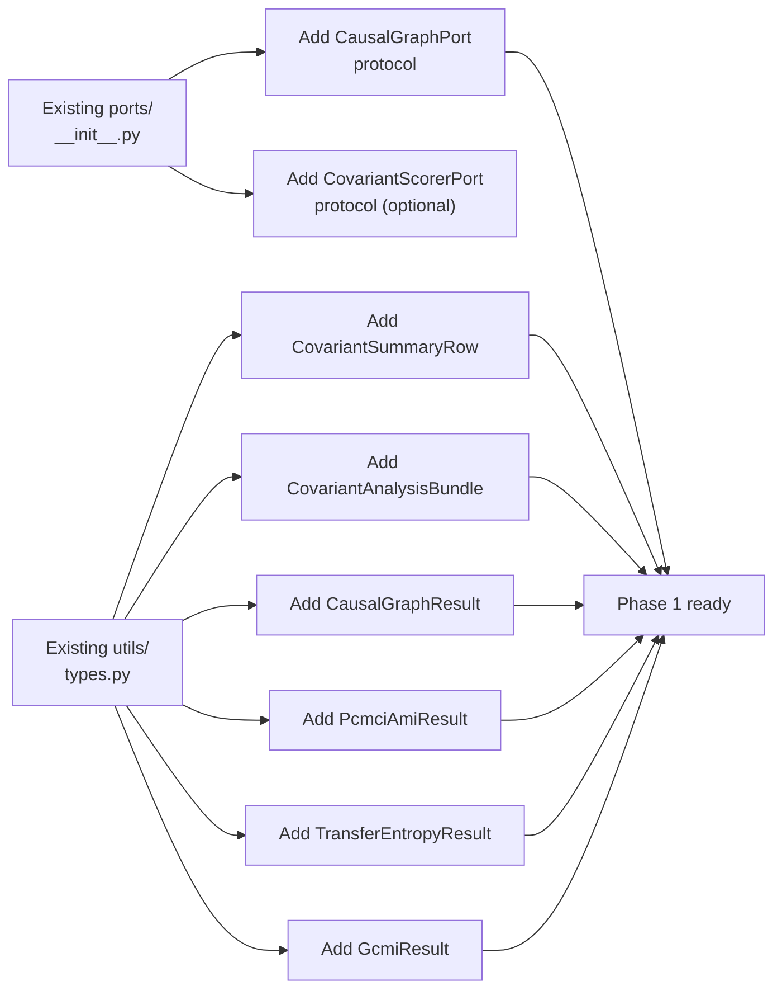
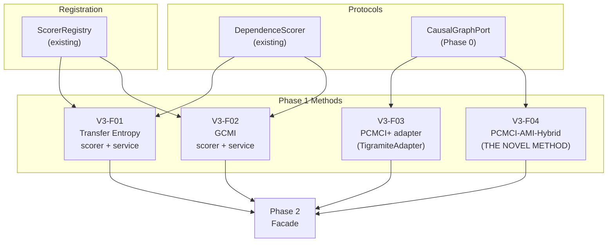
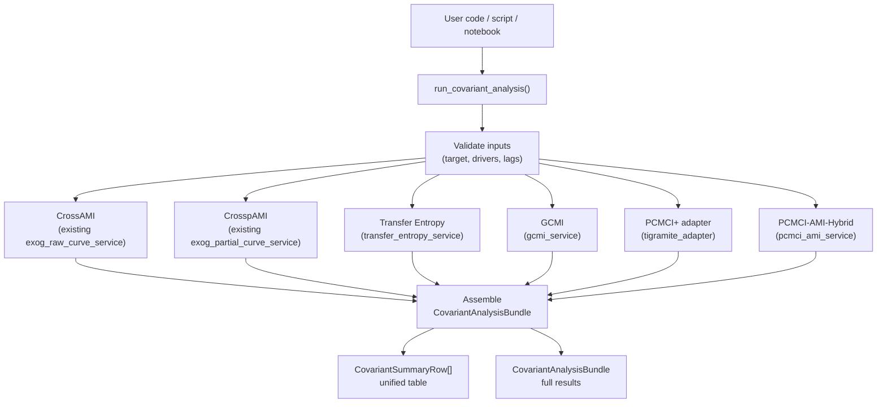
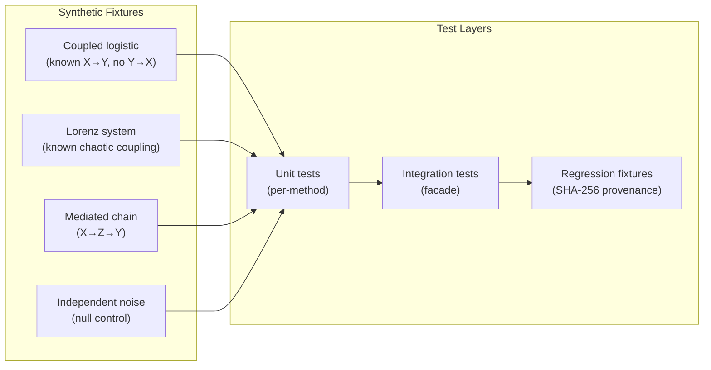
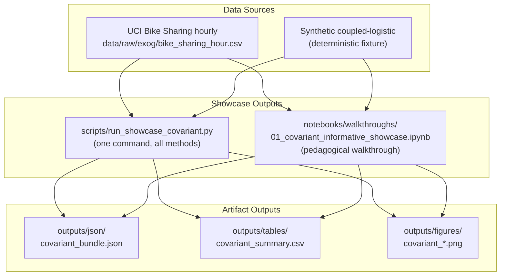
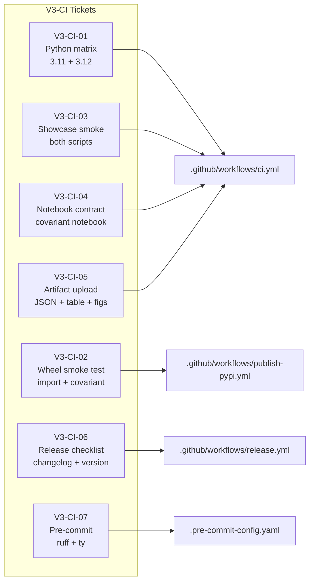
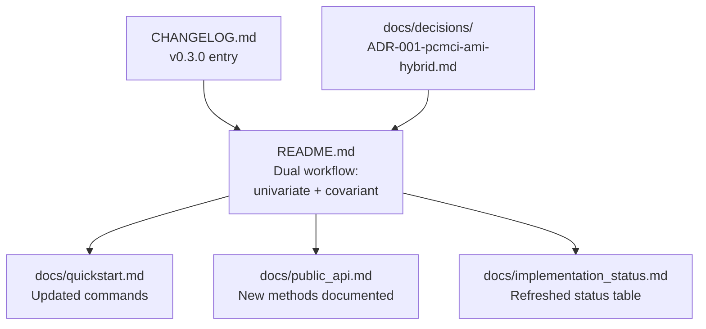
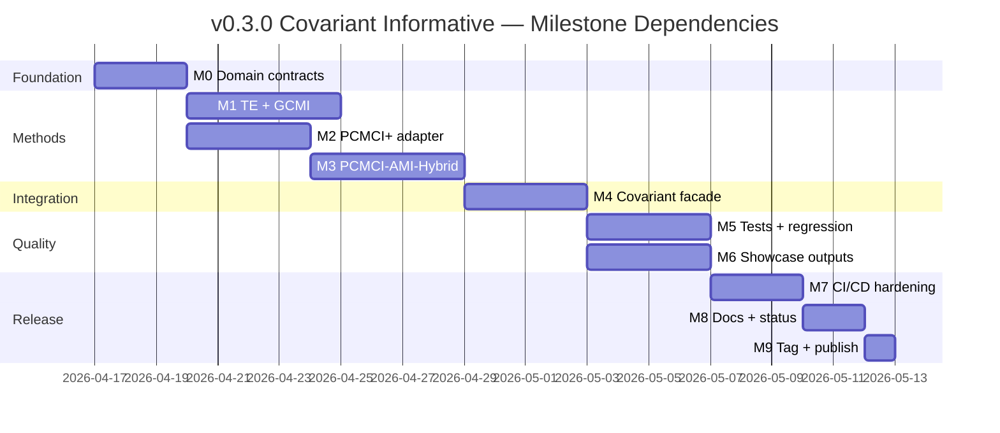

<!-- type: reference -->
# v0.3.0 — Covariant Informative: Ultimate Release Plan

**Plan type:** Actionable release plan — ULTIMATE merge of prior proposals  
**Audience:** Maintainer, reviewer, Jr. developer  
**Target release:** `0.3.0`  
**Current released version:** `0.2.0`  
**Branch:** `feat/v0.3.0-covariant-informative`  
**Status:** Proposed  
**Last reviewed:** 2026-04-16  
**Companion refs:**

- [Covariant maturity release plan](dependence_forecastability_v0_3_0_covariant_maturity_release_plan.md) — original Phase 1–7 structure
- [PCMCI+AMI hybrid proposal](non_linear_pcmci.md) — theoretical framework for Phase 0 informational triage
- [v0.2.0 consolidation plan](implemented/v0_2_0_release_consolidation_plan_v2.md) — release-plan format baseline

**Builds on:**

- v0.2.0 hexagonal architecture, `ScorerRegistry`, port/adapter separation
- Existing exogenous cross-dependence support (`ForecastabilityAnalyzerExog`)
- `DependenceScorer` protocol and the five built-in scorers (`mi`, `pearson`, `spearman`, `kendall`, `dcor`)
- Existing `data/raw/exog/bike_sharing_hour.csv` via `scripts/download_data.py`

---

## 1. Why a new plan structure

The two prior proposals overlap substantially but differ in how the PCMCI+AMI hybrid integrates.
The covariant maturity plan treats PCMCI+ as "just another adapter"; the PCMCI+AMI proposal
defines a **novel hybrid algorithm** that uses AMI/CrossMI as Phase 0 informational triage.
This ultimate plan reconciles both by:

1. **Preserving the covariant-maturity phasing** — domain contracts → core methods → facade → tests → showcase → CI → docs
2. **Elevating PCMCI-AMI-Hybrid to a first-class method** — its own protocol, service, adapter, and result model
3. **Specifying REAL architecture integration** — every module placed in the actual `src/forecastability/` tree
4. **Closing CI/CD gaps explicitly** — numbered V3-CI tickets with acceptance criteria
5. **Enforcing scientific invariants** — AMI per-horizon, train-only, `np.trapezoid`, `random_state: int`

### Planning principles

| Principle | Implication |
|---|---|
| Additive, not disruptive | Stable univariate imports never break |
| Hexagonal + SOLID | New methods enter through ports/services/adapters |
| Paper-aligned identity | pAMI is a project extension; PCMCI-AMI cites Catt (2026) + Runge (2022) |
| Product maturation | v0.3.0 is a credibility release, not a feature dump |
| One facade, many engines | Users call `run_covariant_analysis()`; internal methods compose |

---

## 2. Repo baseline — what already exists

| Layer | Module | What it provides | Status |
|---|---|---|---|
| **Ports** | `src/forecastability/ports/__init__.py` | `SeriesValidatorPort`, `CurveComputePort`, `SignificanceBandsPort`, `InterpretationPort`, `RecommendationPort`, `ReportRendererPort`, `SettingsPort`, `EventEmitterPort`, `CheckpointPort` | Stable |
| **Scorers** | `src/forecastability/metrics/scorers.py` | `DependenceScorer` protocol, `ScorerInfo`, `ScorerRegistry`, `ScorerRegistryProtocol`, `default_registry()` with `mi`, `pearson`, `spearman`, `kendall`, `dcor` | Stable |
| **Services** | `src/forecastability/services/` | `raw_curve_service`, `exog_raw_curve_service`, `partial_curve_service`, `exog_partial_curve_service`, `significance_service`, `recommendation_service`, `complexity_band_service`, `spectral_predictability_service`, `lyapunov_service`, `forecastability_profile_service`, `predictive_info_learning_curve_service`, `theoretical_limit_diagnostics_service` | Stable |
| **Pipeline** | `src/forecastability/pipeline/analyzer.py` | `ForecastabilityAnalyzer`, `ForecastabilityAnalyzerExog`, `AnalyzeResult` | Stable |
| **Use cases** | `src/forecastability/use_cases/` | `run_triage`, `run_batch_triage`, `run_rolling_origin_evaluation`, `run_exogenous_screening_workbench`, `run_exogenous_rolling_origin_evaluation` | Stable |
| **Diagnostics** | `src/forecastability/diagnostics/` | `cmi.py`, `surrogates.py`, `diagnostic_regression.py`, `spectral_utils.py` | Stable |
| **Triage** | `src/forecastability/triage/` | `TriageRequest`, `TriageResult`, `ResultBundle`, batch models, events | Stable |
| **Adapters** | `src/forecastability/adapters/` | CLI, API, dashboard, plotting, MCP, PydanticAI agent, checkpoint, settings | Stable |
| **Utils** | `src/forecastability/utils/` | `types.py`, `config.py`, `state.py`, `validation.py`, `datasets.py`, `plots.py`, `io_models.py`, `reproducibility.py`, `robustness.py`, `aggregation.py` | Stable |
| **CI** | `.github/workflows/ci.yml` | lint + type-check + test + build; Python 3.11 only, no matrix | Needs hardening |
| **Publish** | `.github/workflows/publish-pypi.yml` | Trusted publishing on tags; no install smoke test | Needs hardening |
| **Release** | `.github/workflows/release.yml` | GitHub release from tag; no covariant validation | Needs hardening |
| **Data** | `data/raw/exog/bike_sharing_hour.csv` | UCI Bike Sharing hourly; downloaded by `scripts/download_data.py` | Available |
| **Showcase** | `scripts/run_showcase.py` | Univariate showcase runner; emits artifacts | Stable |
| **Notebook** | `notebooks/walkthroughs/00_air_passengers_showcase.ipynb` | Univariate pedagogical walkthrough | Stable |

---

## 3. Feature inventory and overlap assessment

| ID | Feature | Phase | Overlap with existing | Genuine new work | Status |
|---|---|---:|---|---|---|
| V3-F00 | Typed covariant result models | 0 | Extends `utils/types.py` patterns | `CovariantSummaryRow`, `CovariantAnalysisBundle`, `CausalGraphResult`, `PcmciAmiResult` | Not started |
| V3-F01 | Transfer Entropy scorer + service | 1 | Follows `DependenceScorer` pattern | `te_scorer()`, `src/forecastability/services/transfer_entropy_service.py` | Not started |
| V3-F02 | GCMI scorer + service | 1 | Follows `DependenceScorer` pattern | `gcmi_scorer()`, `src/forecastability/services/gcmi_service.py` | Not started |
| V3-F03 | PCMCI+ adapter | 1 | None (new external integration) | `src/forecastability/adapters/tigramite_adapter.py`, `CausalGraphPort` | Not started |
| V3-F04 | PCMCI-AMI-Hybrid method | 1 | Builds on AMI kNN + tigramite adapter | `src/forecastability/services/pcmci_ami_service.py`, dedicated result model, Phase 0 triage logic | Not started |
| V3-F05 | `CausalGraphPort` protocol | 0 | None (new port type) | Graph-returning port for PCMCI+ and PCMCI-AMI | Not started |
| V3-F06 | Covariant orchestration facade | 2 | Extends `use_cases/` pattern | `src/forecastability/use_cases/run_covariant_analysis.py` | Not started |
| V3-F07 | Unified covariant summary table | 2 | Extends `ExogenousScreeningWorkbenchResult` pattern | `CovariantSummaryRow` with all method columns | Not started |
| V3-F08 | Covariant tests + regression | 3 | Follows existing test patterns | Synthetic coupled systems, per-method and integration tests | Not started |
| V3-F09 | Covariant showcase script | 4 | Follows `scripts/run_showcase.py` | `scripts/run_showcase_covariant.py` | Not started |
| V3-F10 | Covariant walkthrough notebook | 4 | Follows `00_air_passengers_showcase.ipynb` | `notebooks/walkthroughs/01_covariant_informative_showcase.ipynb` | Not started |
| V3-CI-01 | Python version matrix | 5 | Modifies `.github/workflows/ci.yml` | Add 3.11 + 3.12 matrix | Not started |
| V3-CI-02 | Install-from-wheel smoke test | 5 | Modifies `.github/workflows/publish-pypi.yml` | Wheel install + import + minimal covariant run | Not started |
| V3-CI-03 | Showcase script smoke test | 5 | None | Both showcase scripts run in CI | Not started |
| V3-CI-04 | Notebook contract validation | 5 | Extends `scripts/check_notebook_contract.py` | Covariant notebook added to contract | Not started |
| V3-CI-05 | Artifact upload in CI | 5 | None | Upload covariant JSON + table + figures | Not started |
| V3-CI-06 | Release checklist automation | 5 | None | Changelog, version/tag, README commands | Not started |
| V3-CI-07 | Pre-commit hook alignment | 5 | Modifies `.pre-commit-config.yaml` | Ensure ruff + ty coverage | Not started |
| V3-D01 | README dual-workflow update | 6 | Modifies `README.md` | Univariate + covariant as first-class workflows | Not started |
| V3-D02 | API docs + quickstart refresh | 6 | Modifies `docs/` | New methods documented | Not started |
| V3-D03 | Changelog v0.3.0 | 6 | Modifies `CHANGELOG.md` | Release notes | Not started |

---

## 4. Phased delivery

### Phase 0 — Covariant Domain Contracts (Foundation)

**Goal:** Define every typed result model and protocol before any computation code is written.



#### V3-F00 — Typed result models

**File:** `src/forecastability/utils/types.py` (extend existing module)

New Pydantic models:

```python
class CovariantSummaryRow(BaseModel):
    """One row of the unified covariant summary table."""
    target: str
    driver: str
    lag: int
    cross_ami: float | None = None
    cross_pami: float | None = None
    transfer_entropy: float | None = None
    gcmi: float | None = None
    pcmci_link: str | None = None        # e.g. "-->" or "o->" from PCMCI+
    pcmci_ami_parent: bool | None = None  # True if selected by PCMCI-AMI
    significance: str | None = None       # e.g. "p<0.01", "above_band"
    rank: int | None = None
    interpretation_tag: str | None = None # e.g. "direct_driver", "mediated", "spurious"

class TransferEntropyResult(BaseModel):
    """Per-pair Transfer Entropy result."""
    source: str
    target: str
    lag: int
    te_value: float
    p_value: float | None = None
    significant: bool | None = None

class GcmiResult(BaseModel):
    """Per-pair Gaussian Copula MI result."""
    source: str
    target: str
    lag: int
    gcmi_value: float

class CausalGraphResult(BaseModel):
    """Graph output from PCMCI+ or PCMCI-AMI-Hybrid."""
    parents: dict[str, list[tuple[str, int]]]   # target → [(source, lag), ...]
    link_matrix: list[list[str]] | None = None   # tigramite-style link summary
    val_matrix: list[list[float]] | None = None  # test statistic matrix
    metadata: dict[str, str | int | float] = {}

class PcmciAmiResult(BaseModel):
    """Full output from the PCMCI-AMI-Hybrid method."""
    causal_graph: CausalGraphResult
    phase0_mi_scores: dict[tuple[str, int, str], float]  # (source, lag, target) → MI
    phase0_pruned_count: int
    phase0_kept_count: int
    phase1_skeleton: CausalGraphResult
    phase2_final: CausalGraphResult
    ami_threshold: float
    metadata: dict[str, str | int | float] = {}

class CovariantAnalysisBundle(BaseModel):
    """Composite output from the covariant orchestration facade."""
    summary_table: list[CovariantSummaryRow]
    te_results: list[TransferEntropyResult] | None = None
    gcmi_results: list[GcmiResult] | None = None
    pcmci_graph: CausalGraphResult | None = None
    pcmci_ami_result: PcmciAmiResult | None = None
    target_name: str
    driver_names: list[str]
    horizons: list[int]
    metadata: dict[str, str | int | float] = {}
```

#### V3-F05 — `CausalGraphPort` protocol

**File:** `src/forecastability/ports/__init__.py` (extend existing module)

```python
@runtime_checkable
class CausalGraphPort(Protocol):
    """Port for methods that return a causal graph (PCMCI+, PCMCI-AMI)."""

    def discover(
        self,
        data: np.ndarray,
        var_names: list[str],
        *,
        max_lag: int,
        alpha: float = 0.01,
        random_state: int = 42,
    ) -> CausalGraphResult: ...
```

#### Acceptance criteria — Phase 0

- [ ] All new models importable from `forecastability.utils.types`
- [ ] `CausalGraphPort` passes `isinstance` runtime checks
- [ ] No computation code — contracts only
- [ ] `uv run ruff check . && uv run ty check` clean

---

### Phase 1 — Core Covariant Methods (Isolation + New)

**Goal:** Implement each covariant method as an independently testable unit behind the appropriate protocol.



#### V3-F01 — Transfer Entropy scorer + service

**Scorer file:** `src/forecastability/metrics/scorers.py` (register new scorer)

```python
# Register in default_registry():
# registry.register("te", te_scorer, family="nonlinear",
#                    description="Transfer entropy via conditional MI (kNN)")
```

**Service file:** `src/forecastability/services/transfer_entropy_service.py`

```python
from forecastability.diagnostics.cmi import compute_cmi

def compute_transfer_entropy(
    source: np.ndarray,
    target: np.ndarray,
    *,
    lag: int,
    k: int = 8,
    random_state: int = 42,
) -> float:
    """TE(source → target | lag) = I(target_t ; source_{t-lag} | target_{t-1}, ..., target_{t-lag+1})."""
    ...
```

- Implements `DependenceScorer` for the scorer variant (bivariate past/future)
- Service function returns `TransferEntropyResult`
- Directional: $TE(X \to Y) \neq TE(Y \to X)$

#### V3-F02 — GCMI scorer + service

**Service file:** `src/forecastability/services/gcmi_service.py`

```python
def compute_gcmi(
    source: np.ndarray,
    target: np.ndarray,
    *,
    random_state: int = 42,
) -> float:
    """Gaussian Copula MI via rank transformation + copula normalization."""
    ...
```

- Implements `DependenceScorer` for scorer variant
- Rank/copula-based: invariant under monotonic transforms
- Numerically stable: handles tied ranks, degenerate marginals
- Registered in `ScorerRegistry` as `"gcmi"` with `family="bounded_nonlinear"`

#### V3-F03 — PCMCI+ adapter (TigramiteAdapter)

**Adapter file:** `src/forecastability/adapters/tigramite_adapter.py`

```python
from forecastability.ports import CausalGraphPort
from forecastability.utils.types import CausalGraphResult

class TigramiteAdapter:
    """Adapter wrapping tigramite's PCMCI+ behind CausalGraphPort.

    tigramite is an optional dependency — import guarded behind
    try/except with a clear ImportError message.
    """

    def discover(
        self,
        data: np.ndarray,
        var_names: list[str],
        *,
        max_lag: int,
        alpha: float = 0.01,
        random_state: int = 42,
    ) -> CausalGraphResult:
        ...
```

- Implements `CausalGraphPort`
- `tigramite` import guarded: `try: import tigramite ... except ImportError: raise ImportError("pip install tigramite ...")`
- Core package NEVER imports tigramite directly — only through this adapter
- Maps tigramite's internal graph representation → `CausalGraphResult`

#### V3-F04 — PCMCI-AMI-Hybrid: THE NOVEL CONTRIBUTION

> [!IMPORTANT]
> PCMCI-AMI-Hybrid is a **separate method**, not PCMCI+ with a different CI test.
> It is a novel hybrid algorithm that uses AMI/CrossMI as Phase 0 informational triage
> to prune and sort PCMCI+'s search space. It synthesizes Catt (2026) + Runge (2022).

**Service file:** `src/forecastability/services/pcmci_ami_service.py`

```python
from forecastability.adapters.tigramite_adapter import TigramiteAdapter
from forecastability.metrics.scorers import DependenceScorer, ScorerRegistry
from forecastability.ports import CausalGraphPort
from forecastability.utils.types import CausalGraphResult, PcmciAmiResult

class PcmciAmiService:
    """PCMCI+AMI hybrid causal discovery with informational triage.

    Algorithm phases:
        Phase 0 — AMI/CrossMI triage using kNN MI estimator to prune search space.
        Phase 1 — PCMCI+ lagged skeleton on pruned graph via TigramiteAdapter.
        Phase 2 — MCI contemporaneous on refined conditioning sets.

    The result includes the causal graph, parent sets, MI scores, and
    pruning statistics.
    """

    def __init__(
        self,
        tigramite_adapter: TigramiteAdapter,
        mi_scorer: DependenceScorer,
        *,
        ami_threshold: float = 0.05,
    ) -> None: ...

    def discover(
        self,
        data: np.ndarray,
        var_names: list[str],
        *,
        max_lag: int,
        alpha: float = 0.01,
        random_state: int = 42,
    ) -> PcmciAmiResult:
        """Run the three-phase PCMCI-AMI algorithm."""
        phase0 = self._phase0_ami_triage(data, var_names, max_lag, random_state)
        phase1 = self._phase1_lagged_skeleton(data, var_names, phase0, max_lag, alpha, random_state)
        phase2 = self._phase2_mci_contemporaneous(data, var_names, phase1, alpha, random_state)
        return PcmciAmiResult(
            causal_graph=phase2,
            phase0_mi_scores=phase0.mi_scores,
            phase0_pruned_count=phase0.pruned_count,
            phase0_kept_count=phase0.kept_count,
            phase1_skeleton=phase1,
            phase2_final=phase2,
            ami_threshold=self._ami_threshold,
        )

    def _phase0_ami_triage(self, ...) -> _Phase0Result:
        """Catt's contribution: kNN MI pre-screening.

        For all (source, lag, target) triplets, compute unconditional MI.
        Prune links where MI < ami_threshold.
        Sort remaining by MI descending (information-density ordering).
        """
        ...

    def _phase1_lagged_skeleton(self, ...) -> CausalGraphResult:
        """Runge's lagged skeleton on the AMI-pruned graph.

        Delegates to TigramiteAdapter with pre-filtered link assumptions.
        """
        ...

    def _phase2_mci_contemporaneous(self, ...) -> CausalGraphResult:
        """MCI contemporaneous phase on refined conditioning sets."""
        ...
```

- Accessible as `method="pcmci_ami"` in the covariant facade
- Implements `CausalGraphPort` (via composition, delegates to `TigramiteAdapter`)
- Produces `PcmciAmiResult` (extends `CausalGraphResult` with pruning stats)
- Phase 0 uses the existing `mi` scorer from `default_registry()` (kNN, k=8)
- Phase 1 and 2 delegate to `TigramiteAdapter` with pre-filtered link assumptions
- Independently testable with synthetic coupled-logistic fixtures

#### Acceptance criteria — Phase 1

- [ ] Each method has a standalone unit test with a synthetic fixture
- [ ] TE: higher TE in known directional synthetic examples than in null controls
- [ ] GCMI: monotonic transforms preserve the dependence signal
- [ ] PCMCI+: stable output on deterministic coupled systems
- [ ] PCMCI-AMI: Phase 0 prunes noise variables, Phase 2 recovers known parents
- [ ] `tigramite` is never imported outside `src/forecastability/adapters/tigramite_adapter.py`
- [ ] All scorers registered in `ScorerRegistry` via `default_registry()`
- [ ] `uv run pytest tests/test_<method>.py -q` passes for each method

---

### Phase 2 — Covariant Orchestration Facade

**Goal:** One entry point that validates inputs, runs all methods, and assembles a unified summary.



#### V3-F06 — Covariant orchestration use case

**File:** `src/forecastability/use_cases/run_covariant_analysis.py`

```python
from forecastability.utils.types import CovariantAnalysisBundle

def run_covariant_analysis(
    target: np.ndarray,
    drivers: dict[str, np.ndarray],
    *,
    target_name: str = "target",
    max_lag: int = 40,
    methods: list[str] | None = None,   # None = all available
    ami_threshold: float = 0.05,
    alpha: float = 0.01,
    n_surrogates: int = 99,
    random_state: int = 42,
) -> CovariantAnalysisBundle:
    """Run the full covariant analysis pipeline.

    When ``methods`` is None, runs all available methods:
    CrossAMI, CrosspAMI, TE, GCMI, PCMCI+, PCMCI-AMI-Hybrid.
    When tigramite is not installed, PCMCI+ and PCMCI-AMI are silently skipped.
    """
    ...
```

#### V3-F07 — Unified covariant summary table

Columns in `CovariantSummaryRow`:

| Column | Type | Source |
|---|---|---|
| `target` | `str` | Input |
| `driver` | `str` | Input |
| `lag` | `int` | Per-horizon analysis |
| `cross_ami` | `float \| None` | `exog_raw_curve_service` |
| `cross_pami` | `float \| None` | `exog_partial_curve_service` |
| `transfer_entropy` | `float \| None` | `transfer_entropy_service` |
| `gcmi` | `float \| None` | `gcmi_service` |
| `pcmci_link` | `str \| None` | `tigramite_adapter` |
| `pcmci_ami_parent` | `bool \| None` | `pcmci_ami_service` |
| `significance` | `str \| None` | Surrogate bands / p-values |
| `rank` | `int \| None` | Cross-method rank aggregation |
| `interpretation_tag` | `str \| None` | Interpretation logic |

#### Acceptance criteria — Phase 2

- [ ] `run_covariant_analysis()` produces a `CovariantAnalysisBundle`
- [ ] Unified table has one row per (target, driver, lag) combination
- [ ] Methods gracefully skip when optional deps unavailable
- [ ] Facade is the ONLY orchestration entry point used by notebook, script, and tests
- [ ] `uv run pytest tests/test_covariant_facade.py -q` passes

---

### Phase 3 — Covariant Tests + Regression Fixtures

**Goal:** Product-grade test coverage with deterministic synthetic systems.



#### Synthetic fixture design

| Fixture | Structure | Expected behavior |
|---|---|---|
| **Coupled logistic** | $X_t = r X_{t-1}(1-X_{t-1}) + \epsilon$; $Y_t = \beta X_{t-2} + \gamma Y_{t-1}(1-Y_{t-1}) + \epsilon$ | TE(X→Y) > TE(Y→X); PCMCI-AMI finds X as parent of Y at lag 2 |
| **Lorenz (xyz)** | Standard Lorenz ODE discretized | CrossAMI(x,y) > noise; PCMCI+ finds contemporaneous links |
| **Mediated chain** | X→Z(lag 1)→Y(lag 2) | CrossAMI(X,Y) strong; PCMCI-AMI finds Z as mediator, X as indirect |
| **Independent noise** | $X_t, Y_t \sim N(0,1)$ i.i.d. | All MI scores ≈ 0; PCMCI+ empty graph; no false positives |

#### Regression fixtures

- Generated once, stored as `.npz` or `.parquet` in `tests/fixtures/covariant/`
- SHA-256 hash recorded alongside for provenance
- Regenerable via `scripts/rebuild_covariant_fixtures.py`

#### Test files

| File | Coverage |
|---|---|
| `tests/test_transfer_entropy.py` | TE scorer + service |
| `tests/test_gcmi.py` | GCMI scorer + service |
| `tests/test_pcmci_adapter.py` | TigramiteAdapter isolation |
| `tests/test_pcmci_ami_hybrid.py` | PCMCI-AMI three-phase algorithm |
| `tests/test_covariant_facade.py` | `run_covariant_analysis()` end-to-end |
| `tests/test_covariant_regression.py` | SHA-256 fixture comparisons |
| `tests/test_covariant_models.py` | Result model serialization round-trip |

#### Acceptance criteria — Phase 3

- [ ] Each method has ≥ 3 unit tests (positive, negative, edge case)
- [ ] Facade integration test with coupled-logistic fixture
- [ ] Regression fixtures pass SHA-256 comparison
- [ ] `n_surrogates >= 99` enforced in every surrogate call
- [ ] `random_state: int` — never `numpy.Generator`
- [ ] AMI computed per horizon $h$ separately — never aggregated before computation
- [ ] AMI and pAMI computed on `split.train` ONLY inside any rolling-origin loop
- [ ] `np.trapezoid` for AUC — `np.trapz` removed in NumPy 2.x
- [ ] `uv run pytest tests/test_covariant*.py tests/test_transfer*.py tests/test_gcmi.py tests/test_pcmci*.py -q` all green

---

### Phase 4 — Canonical Showcase Outputs

**Goal:** Demonstrate the full covariant workflow in both script and notebook form.



#### V3-F09 — `scripts/run_showcase_covariant.py`

**Design:**

```python
"""Canonical covariant showcase — one command, all methods, full artifacts.

Usage:
    uv run python scripts/run_showcase_covariant.py
    uv run python scripts/run_showcase_covariant.py --no-rolling
    uv run python scripts/run_showcase_covariant.py --methods cross_ami,te,gcmi
"""
```

- Loads UCI Bike Sharing: target=`cnt`, drivers=`temp`, `hum`, `windspeed`, `atemp`, `hr`
- Runs `run_covariant_analysis()` facade
- Emits artifacts to `outputs/json/`, `outputs/tables/`, `outputs/figures/`
- Prints console summary table
- Exit non-zero on failure
- Supports `--no-rolling` flag for fast CI smoke tests
- Supports `--methods` filter for partial runs

#### V3-F10 — `notebooks/walkthroughs/01_covariant_informative_showcase.ipynb`

**Required sections:**

| Section | Content |
|---|---|
| A — Why covariant analysis | Motivation, univariate vs covariant, when to use |
| B — Data setup | UCI Bike Sharing load, variable roles explained |
| C — Baseline covariant | CrossAMI + CrosspAMI via facade, significance bands |
| D — Rich layers | TE, GCMI, PCMCI+, PCMCI-AMI-Hybrid results |
| E — Unified interpretation | Direct vs mediated vs redundant vs spurious |
| F — Reproducible artifacts | Saved JSON, table, plots; how to rerun |

> [!IMPORTANT]
> The notebook must consume the package facade — no logic may exist only inside the notebook.

#### Dataset: UCI Bike Sharing hourly

| Variable | Role | Why |
|---|---|---|
| `cnt` | **Target** | Total bike rentals — the quantity to forecast |
| `temp` | Direct driver | Known direct influence on rentals |
| `hum` | Direct driver | Humidity affects outdoor activity |
| `windspeed` | Direct driver | Wind discourages cycling |
| `atemp` | Redundant/mediated | Feels-like temperature — correlated with `temp` |
| `hr` | Calendar confounder | Hour of day — periodic, strong but not causal in the driver sense |
| `weekday` | Calendar confounder | Day of week — similar calendar confounding |

#### Acceptance criteria — Phase 4

- [ ] `uv run python scripts/run_showcase_covariant.py` runs end-to-end
- [ ] Notebook is top-to-bottom executable
- [ ] Both demonstrate all six methods: CrossAMI, CrosspAMI, TE, GCMI, PCMCI+, PCMCI-AMI-Hybrid
- [ ] Artifacts emitted to stable paths
- [ ] No notebook-only logic — all computation via `run_covariant_analysis()`
- [ ] UCI Bike Sharing as primary real-data example
- [ ] Synthetic coupled-logistic as deterministic fixture

---

### Phase 5 — CI/CD Hardening

**Goal:** Close every identified CI/CD gap so v0.3.0 ships with confidence.



#### V3-CI-01 — Python version matrix

**File:** `.github/workflows/ci.yml`

```yaml
strategy:
  matrix:
    python-version: ["3.11", "3.12"]
```

- Both versions REQUIRED (not allow-failure)
- Ensures NumPy 2.x compatibility (`np.trapezoid` vs removed `np.trapz`)

#### V3-CI-02 — Install-from-wheel smoke test

**File:** `.github/workflows/publish-pypi.yml`

After wheel build, before upload:

```yaml
- name: Smoke test installed package
  run: |
    uv pip install dist/*.whl
    python -c "import forecastability; print(forecastability.__version__)"
    python -c "from forecastability.utils.types import CovariantSummaryRow"
```

#### V3-CI-03 — Showcase script smoke test

**File:** `.github/workflows/ci.yml`

```yaml
- name: Showcase smoke test
  run: |
    uv run python scripts/run_showcase.py --no-rolling --no-bands
    uv run python scripts/run_showcase_covariant.py --no-rolling
```

#### V3-CI-04 — Notebook contract validation

Extend `scripts/check_notebook_contract.py` to include:

```python
REQUIRED_NOTEBOOKS = [
    "notebooks/walkthroughs/00_air_passengers_showcase.ipynb",
    "notebooks/walkthroughs/01_covariant_informative_showcase.ipynb",
]
```

#### V3-CI-05 — Artifact upload

```yaml
- name: Upload covariant artifacts
  uses: actions/upload-artifact@v4
  with:
    name: covariant-outputs
    path: |
      outputs/json/covariant_bundle.json
      outputs/tables/covariant_summary.csv
      outputs/figures/covariant_*.png
```

#### V3-CI-06 — Release checklist automation

Checks run in `release.yml` before creating GitHub release:

- [ ] `CHANGELOG.md` contains `## [0.3.0]` entry
- [ ] Tag matches `pyproject.toml` version
- [ ] README quickstart commands reference valid script paths
- [ ] `scripts/run_showcase_covariant.py` exists

#### V3-CI-07 — Pre-commit hook alignment

Ensure `.pre-commit-config.yaml` covers:

- `ruff check --fix`
- `ruff format`
- `ty check` (or equivalent type-checking hook)

#### Acceptance criteria — Phase 5

- [ ] CI runs on Python 3.11 AND 3.12
- [ ] Wheel install smoke test passes before PyPI upload
- [ ] Both showcase scripts pass in CI
- [ ] Notebook contract validates covariant notebook
- [ ] Artifacts uploaded as CI outputs
- [ ] Release checklist enforced in release workflow
- [ ] Pre-commit covers ruff + ty

---

### Phase 6 — Documentation + Status Refresh

**Goal:** Make repo messaging reflect the v0.3.0 product shape.



#### V3-D01 — README dual-workflow update

Structure README as:

1. **Univariate workflow** — stable reference (AMI, pAMI, triage)
2. **Covariant workflow** — new first-class workflow (CrossAMI, CrosspAMI, TE, GCMI, PCMCI+, PCMCI-AMI)
3. **Quick commands** — both `run_showcase.py` and `run_showcase_covariant.py`

#### V3-D02 — Recommended status table after v0.3.0

| Surface | Status |
|---|---|
| Univariate deterministic triage | Stable |
| Covariant deterministic workflow | Beta |
| TE / GCMI / PCMCI+ within covariant | Beta |
| PCMCI-AMI-Hybrid | Experimental |
| CLI | Beta |
| HTTP API | Beta |
| Dashboard | Beta |
| Agent narration | Experimental |
| MCP server | Experimental |

#### V3-D03 — ADR for PCMCI-AMI-Hybrid

**File:** `docs/decisions/ADR-001-pcmci-ami-hybrid.md`

Documents:
- Why AMI triage before PCMCI+ (computational + statistical motivation)
- Why a separate method rather than a CI-test swap
- Why tigramite behind an adapter (optional dependency principle)
- Attribution: Catt (2026) + Runge (2022)

#### Acceptance criteria — Phase 6

- [ ] README clearly separates univariate and covariant workflows
- [ ] `docs/quickstart.md` includes covariant quick-start
- [ ] `CHANGELOG.md` has complete v0.3.0 entry
- [ ] ADR for PCMCI-AMI-Hybrid decision exists
- [ ] `docs/implementation_status.md` updated with new status table

---

## 5. Cross-cutting deliverables

| Deliverable | Owner layer | Files affected |
|---|---|---|
| `pyproject.toml` optional dependency group for tigramite | Packaging | `pyproject.toml` |
| `forecastability[causal]` extra | Packaging | `pyproject.toml` |
| Version bump to `0.3.0` | Packaging | `pyproject.toml`, `__init__.py` |
| `tigramite` never in core deps | Architecture | All `import` statements |
| `random_state: int` everywhere | Scientific | All new services and scorers |
| `n_surrogates >= 99` | Scientific | All surrogate calls |
| `np.trapezoid` not `np.trapz` | Scientific | All AUC computations |
| pAMI described as project extension | Wording | All docs and docstrings |
| PCMCI-AMI cites Catt (2026) + Runge (2022) | Wording | Docstrings, ADR, notebook |

---

## 6. Exclusions

| Excluded | Why |
|---|---|
| Destabilizing stable univariate imports | Additive-only principle |
| Turning the project into a generic causal-discovery framework | Paper-aligned identity |
| Broad agentic redesign | Out of scope for v0.3.0 |
| Shipping notebook-only logic | Hexagonal architecture mandate |
| PCMCI-AMI replacing existing dependence methods | It is additive, not a replacement |
| Python 3.13 as required | Optional canary only |
| Air Passengers as covariant dataset | Univariate; use UCI Bike Sharing instead |

---

## 7. Definition of done — per phase

| Phase | Done when |
|---|---|
| **0 — Contracts** | All models importable, `CausalGraphPort` passes runtime checks, zero computation code, linter clean |
| **1 — Methods** | Each method independently testable, synthetic fixture passes, `tigramite` isolated in adapter |
| **2 — Facade** | `run_covariant_analysis()` returns `CovariantAnalysisBundle`, unified table populated, methods skip gracefully |
| **3 — Tests** | ≥ 3 unit tests per method, facade integration test, regression fixture SHA-256 match, all scientific invariants hold |
| **4 — Showcase** | Script and notebook run end-to-end, all six methods demonstrated, artifacts emitted to stable paths |
| **5 — CI/CD** | Python matrix, wheel smoke, showcase smoke, notebook contract, artifact upload, release checklist, pre-commit |
| **6 — Docs** | README dual-workflow, quickstart updated, CHANGELOG v0.3.0, ADR exists, status table refreshed |

---

## 8. Scientific invariants — mandatory in all new code

| Invariant | Enforcement |
|---|---|
| AMI computed per horizon $h$ separately — never aggregated before computation | Service function signatures accept single `h` |
| AMI and pAMI computed on `split.train` ONLY inside rolling-origin | `RollingOriginSplit` contract |
| `np.trapezoid` for AUC — `np.trapz` removed in NumPy 2.x | Lint rule or grep check |
| `random_state` is always `int` — never `numpy.Generator` | Type annotation + ruff check |
| `n_surrogates >= 99` in every surrogate call | Pydantic `Field(ge=99)` on request models |
| pAMI described as project extension, not paper-native | Wording review |
| PCMCI-AMI described as project extension synthesizing Catt (2026) + Runge (2022) | Docstrings + ADR |
| `tigramite` is optional — core package never imports it directly | Architecture boundary test |

---

## 9. Junior-developer backlog

### Epic A — Covariant domain contracts (Phase 0)

- [ ] Add `CovariantSummaryRow` to `src/forecastability/utils/types.py`
- [ ] Add `CovariantAnalysisBundle` to `src/forecastability/utils/types.py`
- [ ] Add `CausalGraphResult` to `src/forecastability/utils/types.py`
- [ ] Add `PcmciAmiResult` to `src/forecastability/utils/types.py`
- [ ] Add `TransferEntropyResult` to `src/forecastability/utils/types.py`
- [ ] Add `GcmiResult` to `src/forecastability/utils/types.py`
- [ ] Add `CausalGraphPort` to `src/forecastability/ports/__init__.py`
- [ ] Verify all models pass `model_validate()` round-trip
- [ ] Run `uv run ruff check . && uv run ty check`

### Epic B — Core covariant methods (Phase 1)

- [ ] Implement `te_scorer()` following `DependenceScorer` protocol
- [ ] Create `src/forecastability/services/transfer_entropy_service.py`
- [ ] Register `"te"` in `default_registry()`
- [ ] Implement `gcmi_scorer()` following `DependenceScorer` protocol
- [ ] Create `src/forecastability/services/gcmi_service.py`
- [ ] Register `"gcmi"` in `default_registry()`
- [ ] Create `src/forecastability/adapters/tigramite_adapter.py` implementing `CausalGraphPort`
- [ ] Guard `tigramite` import with try/except
- [ ] Create `src/forecastability/services/pcmci_ami_service.py` with three-phase algorithm
- [ ] Add `PcmciAmiService.__init__` accepting `TigramiteAdapter` + `DependenceScorer`
- [ ] Implement `_phase0_ami_triage()` using kNN MI scorer
- [ ] Implement `_phase1_lagged_skeleton()` delegating to `TigramiteAdapter`
- [ ] Implement `_phase2_mci_contemporaneous()` delegating to `TigramiteAdapter`
- [ ] Add `[causal]` optional dependency group in `pyproject.toml`

### Epic C — Covariant orchestration (Phase 2)

- [ ] Create `src/forecastability/use_cases/run_covariant_analysis.py`
- [ ] Implement `run_covariant_analysis()` facade function
- [ ] Wire CrossAMI via existing `exog_raw_curve_service`
- [ ] Wire CrosspAMI via existing `exog_partial_curve_service`
- [ ] Wire TE via `transfer_entropy_service`
- [ ] Wire GCMI via `gcmi_service`
- [ ] Wire PCMCI+ via `tigramite_adapter` (skip if not installed)
- [ ] Wire PCMCI-AMI via `pcmci_ami_service` (skip if not installed)
- [ ] Assemble `CovariantSummaryRow[]` unified table
- [ ] Assemble `CovariantAnalysisBundle` composite result

### Epic D — Tests and regression (Phase 3)

- [ ] Create coupled-logistic synthetic fixture generator
- [ ] Create Lorenz system synthetic fixture generator
- [ ] Create mediated-chain synthetic fixture generator
- [ ] Create independent-noise null fixture
- [ ] Write `tests/test_transfer_entropy.py` (≥ 3 tests)
- [ ] Write `tests/test_gcmi.py` (≥ 3 tests)
- [ ] Write `tests/test_pcmci_adapter.py` (≥ 3 tests)
- [ ] Write `tests/test_pcmci_ami_hybrid.py` (≥ 3 tests)
- [ ] Write `tests/test_covariant_facade.py` (end-to-end)
- [ ] Write `tests/test_covariant_regression.py` (SHA-256)
- [ ] Write `tests/test_covariant_models.py` (serialization round-trip)
- [ ] Create `scripts/rebuild_covariant_fixtures.py`
- [ ] Store fixtures in `tests/fixtures/covariant/`

### Epic E — Canonical showcase (Phase 4)

- [ ] Create `scripts/run_showcase_covariant.py` with `--no-rolling` and `--methods` flags
- [ ] Load UCI Bike Sharing data (`data/raw/exog/bike_sharing_hour.csv`)
- [ ] Run `run_covariant_analysis()` with all methods
- [ ] Emit `outputs/json/covariant_bundle.json`
- [ ] Emit `outputs/tables/covariant_summary.csv`
- [ ] Emit `outputs/figures/covariant_*.png`
- [ ] Print console summary table
- [ ] Create `notebooks/walkthroughs/01_covariant_informative_showcase.ipynb`
- [ ] Implement sections A–F per Phase 4 spec
- [ ] Verify notebook runs top-to-bottom
- [ ] Verify no notebook-only logic

### Epic F — CI/CD hardening (Phase 5)

- [ ] V3-CI-01: Add Python 3.11 + 3.12 matrix to `ci.yml`
- [ ] V3-CI-02: Add wheel install smoke test to `publish-pypi.yml`
- [ ] V3-CI-03: Add showcase script smoke tests to `ci.yml`
- [ ] V3-CI-04: Extend `scripts/check_notebook_contract.py` for covariant notebook
- [ ] V3-CI-05: Add artifact upload step to `ci.yml`
- [ ] V3-CI-06: Add release checklist checks to `release.yml`
- [ ] V3-CI-07: Align `.pre-commit-config.yaml` with ruff + ty

### Epic G — Documentation (Phase 6)

- [ ] Update `README.md` with dual-workflow structure (univariate + covariant)
- [ ] Update `docs/quickstart.md` with covariant quick-start commands
- [ ] Update `docs/public_api.md` with new methods
- [ ] Update `docs/implementation_status.md` with new status table
- [ ] Write `CHANGELOG.md` entry for v0.3.0
- [ ] Create `docs/decisions/ADR-001-pcmci-ami-hybrid.md`
- [ ] Review all docstrings for wording policy compliance

### Epic H — Release execution

- [ ] Bump version to `0.3.0` in `pyproject.toml`
- [ ] Bump `__version__` in `src/forecastability/__init__.py`
- [ ] Final `uv run pytest -q -ra` pass
- [ ] Final `uv run ruff check . && uv run ty check` pass
- [ ] Tag `v0.3.0`
- [ ] Verify Trusted Publishing succeeds
- [ ] Verify PyPI package installs and runs covariant example

---

## 10. Branch and milestone proposal

### Branch

- `feat/v0.3.0-covariant-informative` (already created)

### Milestones

| # | Milestone | Depends on |
|---|---|---|
| M0 | Covariant domain contracts | — |
| M1 | TE + GCMI implementation | M0 |
| M2 | PCMCI+ adapter | M0 |
| M3 | PCMCI-AMI-Hybrid | M0, M2 |
| M4 | Covariant facade | M1, M2, M3 |
| M5 | Tests + regression fixtures | M4 |
| M6 | Showcase script + notebook | M4 |
| M7 | CI/CD hardening | M5, M6 |
| M8 | Documentation + status refresh | M7 |
| M9 | Tag + publish | M8 |



---

## 11. Final recommendation

This plan is the **definitive v0.3.0 blueprint**. It does not dilute the project into "just another bag of methods." It matures the product shape:

- **Univariate remains the stable reference path**
- **Covariant becomes a first-class analytical workflow**
- **TE + GCMI + PCMCI+ enrich covariant as layered analysis engines**
- **PCMCI-AMI-Hybrid is the novel contribution** — a separate method with its own protocol, service, and result model
- **CI/CD and release discipline** make the new surface trustworthy
- **Architecture stays hexagonal** — every new method enters through the correct port/adapter/service boundary

That is a credible v0.3.0 story and a real maturity step for the project.
