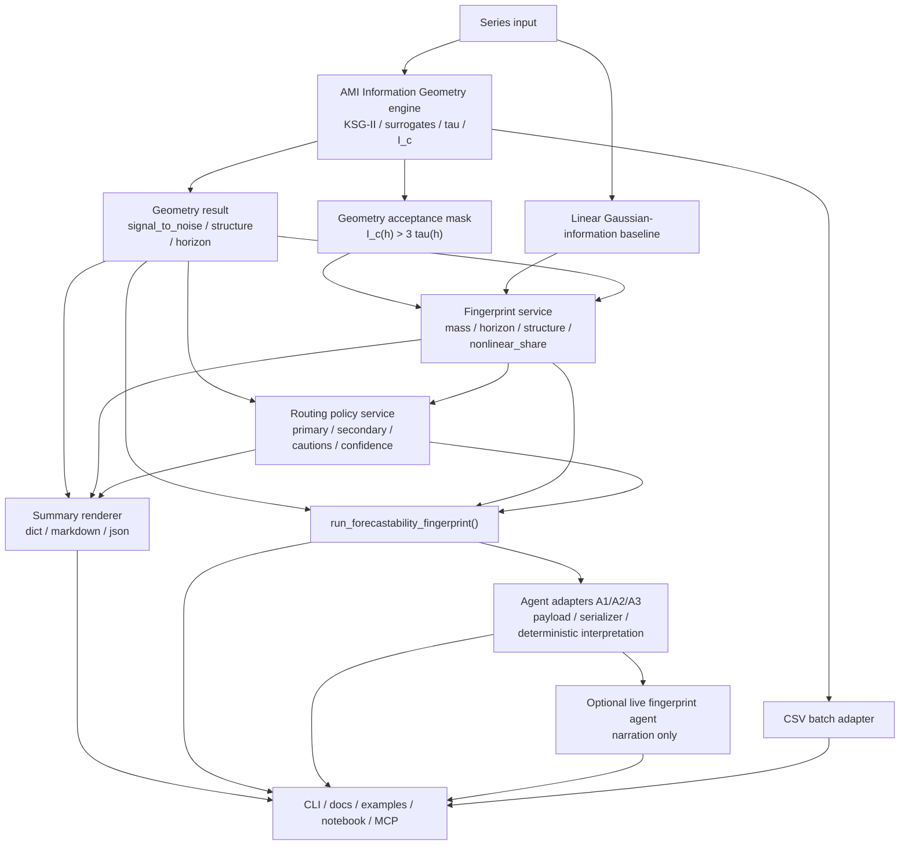

<!-- type: reference -->
# v0.3.1 — Forecastability Fingerprint & Model Routing: Ultimate Release Plan

**Plan type:** Actionable release plan — first follow-up to implemented `0.3.0`  
**Audience:** Maintainer, reviewer, Jr. developer  
**Target release:** `0.3.1`  
**Current released version:** `0.3.0`  
**Branch:** `feat/v0.3.1-forecastability-fingerprint`  
**Status:** In Progress — geometry-backed fingerprint core complete; CSV/regression/notebook/CI follow-through pending  
**Last reviewed:** 2026-04-19  

**Companion refs:**

- [v0.3.0 Covariant Informative: Ultimate Release Plan](v0_3_0_covariant_informative_ultimate_plan.md)
- [v0.3.2 Lagged-Exogenous Triage: Ultimate Release Plan](v0_3_2_lagged_exogenous_triage_ultimate_plan.md)
- [v0.3.3 Documentation Quality Improvement: Ultimate Release Plan](v0_3_3_documentation_quality_improvement_ultimate_plan.md)
- [v0.3.4 Routing Validation & Benchmark Hardening: Ultimate Release Plan](v0_3_4_routing_validation_benchmark_hardening_plan.md)
- [v0.3.1.5 Forecastability Fingerprint, Model Routing & AMI Information Geometry: Ultimate Release Plan](v0_3_1_5_fingerprint_information_geometry_ultimate_plan.md)
- [Agent Layer Contract](../agent_layer.md)

**Builds on:**

- implemented `0.3.0` univariate + covariant triage surfaces
- hexagonal architecture, `ScorerRegistry`, port / adapter separation
- existing AMI / pAMI / directness-ratio logic and profile-oriented interpretation
- current recommendation and interpretation service patterns
- existing A1/A2/A3 agent payload / serializer / deterministic-interpretation pattern
- existing optional live-agent adapter pattern under `src/forecastability/adapters/llm/`
- existing examples, showcase scripts, notebook contract checks, and CI / release workflows
- Dr. Peter Catt's AMI Information Geometry working note and prototype semantics

---

## 1. Why this plan exists

`0.3.0` made the repo much stronger mathematically and architecturally, but the
package still presents many diagnostics as separate outputs instead of a compact,
decision-ready **forecastability fingerprint**.

Dr. Peter Catt's original request still points to the right public abstraction:

- `information_mass`
- `information_horizon`
- `information_structure`
- `nonlinear_share`

Those remain the correct public fingerprint fields for `0.3.1`.

However, Dr. Catt's later **AMI Information Geometry** note makes one thing clear:
the release cannot stop at a summary layer. `0.3.1` also needs to ship the
underlying scientific engine that computes, denoises, and thresholds the AMI curve
in a concrete, reusable way.

That note adds operational geometry outputs:

- `signal_to_noise`
- corrected AMI profile semantics
- threshold profile `tau(h)`
- geometry-driven `information_horizon`
- geometry-driven `information_structure`

computed from:

- KSG-II AMI estimation
- shuffle-surrogate bias correction
- corrected profile `I_c(h) = max(I(h) - bias(h), 0)`
- deterministic thresholding against `tau(h)`

This plan therefore keeps the fingerprint and routing story from `0.3.1`, but
promotes **AMI Information Geometry** from a follow-up idea into a mandatory part
of the main `0.3.1` release.

> Given a horizon-wise AMI profile, how do we compute it robustly, denoise it,
> summarize it into a compact fingerprint, and route toward suitable model
> families without overclaiming exact-model superiority?

### Planning principles

| Principle | Implication |
|---|---|
| Additive, not disruptive | Stable public univariate/covariant imports remain valid |
| Preserve `0.3.1` identity | `information_mass`, `information_horizon`, `information_structure`, and `nonlinear_share` remain the main public fingerprint fields |
| Information Geometry is an engine, not a replacement | Dr. Catt's AMI geometry methods become a service layer beneath fingerprint construction |
| Hexagonal + SOLID | Estimation services compute signals; fingerprint services summarize; routing services recommend |
| AMI-first identity | Fingerprint remains derived primarily from horizon-wise AMI behavior |
| Clear semantics | `signal_to_noise` is not `information_mass`; `directness_ratio` is not `nonlinear_share` |
| One facade, many engines | Users call a dedicated fingerprint use case or opt into fingerprint inside existing bundle flows |
| Agent-ready by construction | The compact fingerprint bundle should be serialisable into a deterministic agent payload before any live narration is added |

### Reviewer acceptance block

For reviewer sign-off, `0.3.1` is successful only if both layers are visible and
consistent:

1. **Fingerprint layer**
   - `information_mass`
   - `information_horizon`
   - `information_structure`
   - `nonlinear_share`

2. **Information Geometry layer**
   - `signal_to_noise`
   - corrected AMI profile semantics
   - surrogate threshold semantics
   - geometry-driven `information_horizon`
   - geometry-driven `information_structure`

Required reviewer-visible outcomes:

- the original four fingerprint fields still exist on a typed Python result object
- Dr. Catt's `signal_to_noise` exists as a typed output and is surfaced consistently
- the CLI / JSON summary surface includes fingerprint + geometry outputs together
- the walkthrough notebook and public example surfaces show the same outputs without
  notebook-only logic
- the same fields plus routing/confidence/cautions appear in an agent-ready
  deterministic payload surface
- docs define both the fingerprint semantics and the geometry-engine semantics
- routing guidance remains driven by deterministic rules and does not claim
  exact-model optimality
- any live agent surface, if shipped, narrates deterministic payloads and does not
  invent metrics, probabilities, or exact-model claims

Reviewer comment / source crosswalk for this update:

- comment 2 (`Catt alignment`) → this block, §5.3, §9
- comment 3 (thresholding / significance semantics) → §2.2, §2.4, §2.5,
  Phase 1 acceptance criteria, Phase 3 threshold tests
- comment 4 (`information_structure` classifier rules) → §2.6, Phase 1
  acceptance criteria, Phase 3 classifier tests
- comment 5 (no-overclaim routing rule) → §2.9, §8, §9
- comment 6 (routing-quality validation task) → V3_1-F06.2, §9
- comment 7 (`nonlinear_share` calibration) → §2.7, §6.2, Phase 3 tests
- comment 8 (routing confidence semantics) → §2.9, V3_1-F03, V3_1-F03a
- comment 9 (mandatory public-surface examples) → V3_1-F05, V3_1-F08, V3_1-D01, §9
- comment 10 (univariate-first scope boundary) → planning principles, V3_1-D02,
  §8, §9
- Dr. Catt working note (`AMI Information Geometry`) → §1, §2.2-§2.7,
  V3_1-F01a, V3_1-F01b, V3_1-F02a, V3_1-F03a, §11

---

## 2. Theory-to-code map — mathematical foundations

> [!IMPORTANT]
> Every junior developer MUST read this section before writing any code.
> The release is small in surface area but high in semantic risk.

### 2.1. Forecastability profile recap

Let the univariate forecastability profile be the horizon-wise AMI curve:

$$AMI(h) = I(X_t ; X_{t+h})$$

for horizons $h = 1, \dots, H$.

The package already treats forecastability as **horizon-dependent**, not as a
single global scalar. That remains the correct base.

`0.3.1` now adds one non-optional requirement:

- AMI must be estimable through a concrete Information Geometry engine, not only
  through abstract profile contracts.

### 2.2. AMI Information Geometry engine

Adopt Dr. Catt's KSG-II prototype semantics as a reusable service layer.

Estimator:

$$I(h) = \psi(k) - \frac{1}{k} + \psi(n_h) - \left\langle \psi(n_x(i)) + \psi(n_y(i)) \right\rangle$$

Required `0.3.1` implementation semantics:

- KSG-II estimator
- Chebyshev joint metric
- median over configurable `k_list`, with release-default alignment to the working
  note: `k_list = [3, 5, 8]`
- one-shot tiny jitter for tie handling with deterministic seed
- guard for too-small `n-h`
- shuffle surrogates for bias estimation, with release-default alignment to the
  working note: `n_surrogates = 200`
- threshold profile `tau(h)` defined as the surrogate 90th percentile
- corrected profile:

$$I_c(h) = \max(I(h) - bias(h), 0)$$

where `bias(h)` is the surrogate mean.

This layer must be implemented as a service, not as a CSV-only script or notebook.

### 2.3. `signal_to_noise`

Add Dr. Catt's `signal_to_noise` as a first-class geometry output:

$$S = \frac{\sum_h \max(I_c(h) - \tau(h), 0)}{\sum_h I_c(h) + \epsilon}$$

Required semantics:

- bounded to `[0, 1]`
- if the denominator is near zero, return `0.0`
- this is a **quality-of-signal** metric over the corrected AMI profile
- it is not a replacement for `information_mass`
- it is not a direct route selector by itself
- it should influence routing confidence and caution logic

Interpretation:

- low value → corrected AMI exists but little exceeds surrogate threshold
- high value → corrected AMI is meaningfully above surrogate background

### 2.4. `information_mass`

Keep `information_mass` as a public fingerprint field, but define it explicitly
over the **corrected** profile rather than raw AMI.

For `0.3.1`, define the geometry acceptance mask as:

$$\mathcal{H}_{geom} = \{h \in \{1, \dots, H\} : I_c(h) > 3\tau(h)\}$$

Required implementation:

$$M = \frac{1}{\max(1, H)} \sum_{h=1}^{H} I_c(h)\,\mathbf{1}[h \in \mathcal{H}_{geom}]$$

Required semantics:

- `information_mass` and `information_horizon` MUST share the exact same
  geometry-acceptance mask
- routing logic MUST consume the same geometry mask rather than redefining
  thresholding locally
- invalid or truncated horizons are excluded conservatively
- if no horizons satisfy the condition, `information_mass = 0.0`
- this is intentionally **not** the mean AMI over accepted horizons; strength and
  extent both contribute

Interpretation:

- low mass → weak overall forecastability even after correction
- high mass → rich usable predictive information over the evaluated horizon grid

### 2.5. `information_horizon`

`information_horizon` remains the latest horizon that stays informative, but
`0.3.1` now resolves the threshold definition canonically through geometry:

$$H_{info} = \max \{ h : I_c(h) > 3 \cdot \tau(h) \}$$

with the convention that if no such horizon exists, the result is `0`.

Additional required semantics:

- invalid horizons are excluded conservatively
- if accepted horizons are non-contiguous, the latest accepted horizon still wins
- routing rules referring to "short" or "long" horizon MUST use this exact output
- the `3 * tau(h)` rule is the canonical horizon acceptance rule for `0.3.1`
- the plan should document Dr. Catt's rationale that `3 * tau(h)` is intended as a
  conservative profile-wide screening rule rather than a formal exact guarantee

Interpretation:

- short horizon → prediction decays quickly
- long horizon → information persists farther into the future

### 2.6. `information_structure`

Keep the public taxonomy:

- `none`
- `monotonic`
- `periodic`
- `mixed`

But source the classifier from the corrected AMI profile and accepted peaks.

Required `0.3.1` classifier contract:

1. `none` if `signal_to_noise < 0.05` or `information_horizon == 0`
2. `monotonic` if no qualifying repeated peaks remain and corrected AMI decays broadly
3. `periodic` if significant repeated peaks occur near a dominant spacing
4. `mixed` otherwise

Additional required semantics:

- prototype internal label `monotone` maps to public label `monotonic`
- peak detection operates on corrected AMI and cannot be triggered by non-accepted
  noise structure alone
- release-default peak thresholds should align to the working note via documented
  configuration, including absolute prominence and minimum peak spacing
- tie-breaking priority is deterministic:
  `none` > `periodic` > `monotonic` > `mixed`

### 2.7. `nonlinear_share`

`nonlinear_share` remains part of the fingerprint and must stay separate from both
`signal_to_noise` and `directness_ratio`.

For each horizon $h$, define a Gaussian-information proxy from Pearson autocorrelation:

$$I_G(h) = -\frac{1}{2}\log(1 - \rho(h)^2)$$

with numerically safe clipping.

Then define nonlinear excess over **corrected AMI**:

$$E(h) = \max(I_c(h) - I_G(h), 0)$$

and aggregate over the geometry acceptance mask:

$$N = \frac{\sum_{h \in \mathcal{H}_{geom}} E(h)}{\sum_{h \in \mathcal{H}_{geom}} I_c(h) + \epsilon}$$

Required edge behavior:

- if $\mathcal{H}_{geom} = \varnothing$, return `nonlinear_share = 0.0`
- if the accepted-horizon corrected-AMI denominator is `<= epsilon`, return
  `0.0` rather than a noisy tiny ratio
- if `rho(h)` is invalid or undefined after safe clipping, exclude that horizon
  from the nonlinear-baseline aggregation and emit a caution

Interpretation:

- low share → mostly linear dependence story
- high share → substantial dependence beyond linear autocorrelation structure

> [!WARNING]
> `nonlinear_share` is NOT `1 - directness_ratio`.
> `directness_ratio` measures direct vs mediated lag structure.
> `signal_to_noise` measures how much corrected AMI rises above surrogate noise.
> `information_mass` measures accepted AMI area over the horizon grid.

### 2.8. `directness_ratio` stays separate

The repo already has the idea of directness / mediated structure.
That remains useful for routing, but as a separate field.

The routing object for `0.3.1` should therefore contain at least:

- `information_mass`
- `information_horizon`
- `information_structure`
- `nonlinear_share`
- `signal_to_noise`
- `directness_ratio`

### 2.9. Model-family routing

The goal remains the same: route toward **model families**, not one exact winner.

> [!IMPORTANT]
> Routing in `0.3.1` is heuristic product guidance. It is not empirical model
> selection, not a ranking guarantee, and not a promise that a recommended family
> will outperform all alternatives on a given series.

Updated mapping policy:

| Fingerprint / geometry pattern | Recommended families |
|---|---|
| low mass, low signal-to-noise, `none` | naïve, seasonal naïve, stop / downscope effort |
| high mass, monotonic, low nonlinear share, high directness | ARIMA / ETS / linear state-space / dynamic regression |
| high mass, periodic | seasonal naïve / harmonic regression / TBATS / seasonal state-space |
| mixed structure or high nonlinear share | tree-on-lags / TCN / N-BEATS / NHITS / nonlinear tabular baselines |
| high mass but low directness | increase lookback, inspect mediated structure, prefer richer state representation |
| high mass but weak signal-to-noise margin | keep primary family suggestion but down-rank confidence |

This routing policy must be explicit and versioned. It is a product rule, not an
implicit interpretation hidden in notebooks.

Required confidence semantics for `0.3.1`:

- confidence is derived from four deterministic binary penalties:
  `threshold_margin_penalty`, `taxonomy_uncertainty_penalty`,
  `signal_conflict_penalty`, and `low_signal_quality_penalty`
- `threshold_margin_penalty = 1` if any routing-defining scalar falls within a
  versioned margin band around its decision threshold
- `taxonomy_uncertainty_penalty = 1` if `information_structure == "mixed"`, if
  the classifier relied on a tie-break, or if accepted support is below a
  versioned `min_confident_horizons`
- `signal_conflict_penalty = 1` if the primary route is supported by one signal
  but contradicted by another according to a versioned rule table
- `low_signal_quality_penalty = 1` when `signal_to_noise` is below a versioned
  confidence threshold, even if the route itself is not forced to `downscope`
- map penalty counts deterministically:
  `0 -> high`, `1 -> medium`, `2+ -> low`
- confidence is derived from deterministic rule evaluation only; `0.3.1` does not
  claim benchmark-calibrated probabilities

### 2.10. Agent layer contract for `0.3.1`

The fingerprint release remains directly usable by coding agents and LLM-facing
surfaces, but only through the repo's existing deterministic-first contract.

Required `0.3.1` agent-layer semantics:

- `FingerprintBundle` remains the authoritative result object
- new geometry fields are mirrored into A1 payloads
- A2 serialisation adds a versioned envelope for transport, MCP, API, or agent use
- A3 deterministic interpretation adapters may compress rationale and cautions
  into a more conversational structure, but they may not change routes, confidence,
  or numeric fields
- an optional live fingerprint agent may narrate or orchestrate only after reading
  the deterministic payload or calling the fingerprint use case; strict mode must
  still return deterministic output when narration is disabled or unavailable
- no prompt, notebook cell, or LLM adapter may recompute AMI, alter thresholds,
  or override deterministic caution flags

---

## 3. Repo baseline — what already exists

| Layer | Module | What it provides | Status |
|---|---|---|---|
| **Scorers** | `src/forecastability/metrics/scorers.py` | dependence scorers and registry pattern | Stable |
| **Services** | `src/forecastability/services/forecastability_profile_service.py` | profile-oriented interpretation surface | Stable |
| **Services** | `src/forecastability/services/recommendation_service.py` | recommendation/routing precedent | Stable |
| **Diagnostics** | current AMI / pAMI / directness logic | horizon-wise dependence and shape evidence | Stable |
| **Pipeline** | `src/forecastability/pipeline/analyzer.py` | existing orchestration pattern | Stable |
| **Use cases** | `src/forecastability/use_cases/` | existing facade/use-case conventions | Stable |
| **Utils** | `src/forecastability/utils/types.py` | typed-result pattern | Stable |
| **Adapters** | `src/forecastability/adapters/agents/` | typed payload / serialiser / deterministic interpretation precedent | Stable |
| **Adapters** | `src/forecastability/adapters/llm/` | optional live narration / orchestration precedent | Experimental |
| **Examples** | univariate walkthrough + showcase | user-facing evidence surface | Stable |
| **CI** | existing matrix, smoke, notebook contract, release checklist | release hygiene baseline | Stable |

---

## 4. Feature inventory and overlap assessment

| ID | Feature | Phase | Overlap with existing | Genuine new work | Status |
|---|---|---:|---|---|---|
| V3_1-F00 | Typed fingerprint result models | 0 | Extends `utils/types.py` patterns | `ForecastabilityFingerprint`, `RoutingRecommendation`, `FingerprintBundle` | ✅ **Done** (geometry-aligned) |
| V3_1-F00.1 | Synthetic fingerprint archetype generators | 0 | Extends `utils/synthetic.py` | `generate_white_noise`, `generate_ar1_monotonic`, `generate_seasonal_periodic`, `generate_nonlinear_mixed`, `generate_mediated_directness_drop` | ✅ **Done** |
| V3_1-F01 | Linear Gaussian-information baseline | 1 | Reuses Pearson / autocorrelation logic | per-horizon `I_G(h)` service with stable clipping and aggregation | ✅ **Done** |
| V3_1-F01a | AMI Information Geometry engine | 1 | Builds on AMI/profile infrastructure | KSG-II AMI, shuffle bias correction, `tau(h)`, corrected profile, `signal_to_noise` | ✅ **Done** |
| V3_1-F01b | Geometry result and configuration models | 1 | Extends typed-result pattern | `AmiInformationGeometry`, `AmiGeometryCurvePoint`, config models | ✅ **Done** |
| V3_1-F02 | Fingerprint builder service | 1 | Builds on AMI/profile outputs | initial `information_mass`, `information_horizon`, `information_structure`, `nonlinear_share` implementation | ✅ **Done** (geometry-aligned) |
| V3_1-F02a | Geometry-backed fingerprint refactor | 1 | Refactors completed `V3_1-F02` | fingerprint from corrected AMI + geometry acceptance mask | ✅ **Done** |
| V3_1-F03 | Routing policy service | 1 | Extends current recommendation logic | initial model-family policy keyed by fingerprint buckets | ✅ **Done** (geometry-aligned) |
| V3_1-F03a | Geometry-aware routing refactor | 1 | Refactors completed `V3_1-F03` | integrate `signal_to_noise`, geometry cautions, and confidence updates | ✅ **Done** |
| V3_1-F04 | Fingerprint orchestration use case | 2 | Follows existing use-case / facade pattern | initial `run_forecastability_fingerprint()` bundle integration | ✅ **Done** (geometry-aligned) |
| V3_1-F04a | Geometry-first use-case refactor | 2 | Refactors completed `V3_1-F04` | use geometry engine first and return bundle-level geometry outputs | ✅ **Done** |
| V3_1-F05 | Unified summary rendering | 2 | Extends current reporting helpers | initial compact summary row / markdown / JSON surface | ✅ **Done** (geometry-aligned) |
| V3_1-F05a | Geometry surfacing refactor | 2 | Refactors completed `V3_1-F05` | compact summary row / markdown / JSON surface for fingerprint + routing + geometry | ✅ **Done** |
| V3_1-F05.1 | Agent-ready fingerprint adapters | 2 | Extends existing A1/A2/A3 agent pattern | payloads with geometry fields, routing, confidence, cautions | ✅ **Done** |
| V3_1-F05.2 | Optional live fingerprint agent | 2 | Extends existing `adapters/llm` pattern | consume geometry-backed deterministic payloads only | ✅ **Done** |
| V3_1-F05b | CSV batch geometry adapter | 2 | Inspired by Dr. Catt prototype | column-wise CSV runner producing plot + summary CSV | Proposed |
| V3_1-F06 | Tests and regression fixtures | 3 | Follows current deterministic regression pattern | synthetic archetypes, threshold tests, routing invariants | Partial — unit/integration tests done; frozen regression fixtures pending |
| V3_1-F06a | Geometry regression and boundary fixtures | 3 | Extends current deterministic regression pattern | freeze corrected AMI / `tau` / `signal_to_noise` and boundary behavior | Proposed |
| V3_1-F07 | Showcase script and notebook | 4 | Follows existing walkthrough / showcase pattern | canonical four-series fingerprint + geometry demo | Partial — examples are present, notebook/showcase script still pending |
| V3_1-F08 | Public examples and notebook extensions | 5 | Extends examples taxonomy and walkthrough surfaces | minimal Python example, CLI example, notebook cross-links, and reusable example artifacts | Partial — minimal and batch workbench examples added; notebook/CLI/README follow-through pending |
| V3_1-F08.1 | Agent demos and cross-links | 5 | Extends agent examples and notebook/doc surfaces | strict payload demo, optional live-agent demo, and agent-layer discoverability | Partial — strict/live demos exist and batch workbench now feeds A1/A3; notebook cross-links still pending |
| V3_1-D01 | README + quickstart + agent-layer routing section | 5 | Extends docs and `docs/agent_layer.md` cross-links | fingerprint + geometry concept and example snippets | Partial — quickstart/public API/agent-layer updated; README still pending |
| V3_1-D02 | Theory docs | 5 | New or split theory pages | fingerprint definitions, geometry semantics, and routing semantics | ✅ **Done** |
| V3_1-D03 | Changelog + migration note | 5 | Release docs | additive feature surface and policy notes | ✅ **Done** |
| V3_1-CI-01 | Routing smoke test in CI | 6 | Extends smoke workflow | import + run on canonical synthetic panel | Proposed |
| V3_1-CI-02 | Notebook contract extension | 6 | Extends notebook contract checks | fingerprint notebook included | Proposed |
| V3_1-CI-03 | Release checklist update | 6 | Extends release template | geometry + routing + fingerprint checks | Proposed |

---

## 5. Domain contracts — MANDATORY FIRST STEP

### 5.1. Typed result models

**File:** `src/forecastability/utils/types.py`

```python
FingerprintStructure = Literal["none", "monotonic", "periodic", "mixed"]
RoutingConfidenceLabel = Literal["low", "medium", "high"]
GeometryMethodLabel = Literal["ksg2_shuffle_surrogate"]
ModelFamilyLabel = Literal[
    "naive",
    "seasonal_naive",
    "downscope",
    "arima",
    "ets",
    "linear_state_space",
    "dynamic_regression",
    "harmonic_regression",
    "tbats",
    "seasonal_state_space",
    "tree_on_lags",
    "tcn",
    "nbeats",
    "nhits",
    "nonlinear_tabular",
]
RoutingCautionFlag = Literal[
    "near_threshold",
    "mixed_structure",
    "low_directness",
    "high_nonlinear_share",
    "short_information_horizon",
    "weak_informative_support",
    "signal_conflict",
    "low_signal_to_noise",
    "geometry_threshold_borderline",
    "nonstationarity_risk",
]


class AmiGeometryCurvePoint(BaseModel, frozen=True):
    """One horizon point in the AMI Information Geometry curve."""

    horizon: int
    ami_raw: float | None = None
    ami_bias: float | None = None
    ami_corrected: float | None = None
    tau: float | None = None
    accepted: bool = False
    valid: bool = True
    caution: str | None = None


class AmiInformationGeometry(BaseModel, frozen=True):
    """Deterministic AMI Information Geometry outputs."""

    method: GeometryMethodLabel = "ksg2_shuffle_surrogate"
    signal_to_noise: float
    information_horizon: int
    information_structure: FingerprintStructure
    informative_horizons: list[int] = Field(default_factory=list)
    curve: list[AmiGeometryCurvePoint] = Field(default_factory=list)
    metadata: dict[str, str | int | float] = Field(default_factory=dict)


class ForecastabilityFingerprint(BaseModel, frozen=True):
    """Compact summary of forecastability profile semantics."""

    information_mass: float
    information_horizon: int
    information_structure: FingerprintStructure
    nonlinear_share: float
    signal_to_noise: float
    directness_ratio: float | None = None
    informative_horizons: list[int] = Field(default_factory=list)
    metadata: dict[str, str | int | float] = Field(default_factory=dict)


class RoutingRecommendation(BaseModel, frozen=True):
    """Model-family recommendation driven by a fingerprint."""

    primary_families: list[ModelFamilyLabel]
    secondary_families: list[ModelFamilyLabel] = Field(default_factory=list)
    rationale: list[str] = Field(default_factory=list)
    caution_flags: list[RoutingCautionFlag] = Field(default_factory=list)
    confidence_label: RoutingConfidenceLabel = "medium"
    metadata: dict[str, str | int | float] = Field(default_factory=dict)


class FingerprintBundle(BaseModel, frozen=True):
    """Composite output from the forecastability fingerprint use case."""

    target_name: str
    geometry: AmiInformationGeometry
    fingerprint: ForecastabilityFingerprint
    recommendation: RoutingRecommendation
    profile_summary: dict[str, str | int | float]
    metadata: dict[str, str | int | float] = Field(default_factory=dict)
```

### 5.2. Port / service boundary rules

- the Information Geometry engine is a domain/application service, not a script-owned implementation
- scorers do not emit model recommendations
- routing policy is a service, not a plotting helper
- fingerprint building depends on profile / geometry outputs, never on dashboard code
- the use case composes services and formats typed results; adapters only render
- CSV reading, plotting, and file writing belong to adapters / scripts, not to geometry services
- agent payload adapters serialise typed fingerprint bundles; they do not own
  thresholding, routing, or scientific computation
- optional live fingerprint agents live strictly downstream of deterministic
  payloads or use cases and may not mutate their numeric or categorical outputs
- no `pydantic_ai`, provider SDK, or prompt text belongs in `services/`, `utils/`,
  `pipeline/`, or notebook cells; those dependencies stay in outer adapters only
- if the live path needs dedicated request/response contracts, add them under
  `src/forecastability/use_cases/requests.py` / `responses.py` or adapter-local
  models, never inside domain services
- agent-related files must remain single-purpose:
  payload models, serialiser, deterministic interpretation, and live orchestration
  each get their own module rather than one mixed-responsibility file
- no notebook cell may implement its own AMI thresholding or route logic

### 5.3. Acceptance criteria

- all new types are importable from the typed surface
- categorical fingerprint / routing fields use closed literal labels or enums,
  not free-form strings
- `geometry.information_structure` maps prototype `monotone` to public `monotonic`
- no route recommendation logic is embedded in notebook cells
- no existing analyzer public interface is broken
- reviewer can verify that the original four fingerprint fields appear unchanged in typed
  Python output, CLI / JSON summary output, example output, notebook output, and docs
- reviewer can verify that geometry fields appear consistently across typed output,
  CLI / JSON summary output, example output, notebook output, and docs
- reviewer can verify that the same fingerprint/routing/geometry fields pass unchanged
  through the agent payload surface and any live narration surface remains optional

---

## 6. Synthetic benchmark panel — MANDATORY BEFORE ROUTING

> [!IMPORTANT]
> Routing logic without archetypal benchmark series becomes opinionated guesswork.

### 6.1. Required synthetic families

Create a deterministic benchmark generator module for four canonical classes:

1. `white_noise`
2. `ar1_monotonic`
3. `seasonal_periodic`
4. `nonlinear_mixed`

Optional fifth class for stronger mediated structure:

5. `mediated_directness_drop`

### 6.2. Expected fingerprint behavior

| Series archetype | Expected structure | Expected mass | Expected nonlinear share | Expected signal-to-noise | Expected routing |
|---|---|---|---|---|---|
| white noise | `none` | low | low | low | naïve / downscope |
| AR(1) | `monotonic` | medium/high | low | medium/high | ARIMA / ETS |
| seasonal | `periodic` | medium/high | low/medium | medium/high | seasonal families |
| nonlinear synthetic | `mixed` | medium/high | high | medium/high | nonlinear model families |
| mediated lag process | `monotonic` or `mixed` | medium | variable | variable | caution on directness / state representation |

Calibration / sanity-check expectations:

- `signal_to_noise`
  - white noise: near `0`
  - AR(1): clearly above noise
  - seasonal linear process: clearly above noise
  - nonlinear synthetic process: above noise, but not necessarily the highest
  - noisy weak series: can show non-zero corrected AMI with low signal-to-noise
- `nonlinear_share`
  - white noise: near `0`, with no spurious high-share route caused by estimation noise
  - AR(1): low and near `0` within tolerance because the dependence is primarily linear
  - seasonal linear process: low to low / medium at most; periodic linear structure
    alone must not be mislabeled as strongly nonlinear
  - nonlinear synthetic process: materially above the linear cases and high enough
    to activate the nonlinear-routing branch in at least one canonical example

### 6.3. Acceptance criteria

- deterministic by seed
- used in tests, showcase, examples, and notebooks
- each archetype has docstring-grounded expected behavior
- at least one regression asserts routing family output, not only raw metric values
- at least one regression freezes `signal_to_noise`
- at least one regression freezes accepted-horizon behavior

---

## 7. Phased delivery

### Phase 0 — Domain contracts and benchmark panel

**Goal:** define typed outputs, benchmark generators, and hard semantic constraints.

#### V3_1-F00 — Typed fingerprint result models

**File targets**

- `src/forecastability/utils/types.py`
- export surfaces if applicable

**Acceptance criteria**

- frozen typed models added
- JSON serialization is stable
- no existing type contracts regress

#### V3_1-F00.1 — Synthetic fingerprint archetype generators

**File targets**

- `src/forecastability/utils/synthetic.py` or dedicated companion module
- tests + example helpers

**Acceptance criteria**

- deterministic by seed
- benchmark families documented and reusable
- no notebook reimplements generation ad hoc

---

### Phase 1 — Core services

**Goal:** implement geometry, fingerprint semantics, and routing behind clean service boundaries.

#### V3_1-F01 — Linear Gaussian-information baseline

**Goal.** Compute a per-horizon linear benchmark.

**File targets**

- `src/forecastability/services/linear_information_service.py`
- tests

**Acceptance criteria**

- uses autocorrelation / Pearson-derived information proxy
- clips safely near `|rho| = 1`
- returns horizon-wise and aggregate outputs
- documented as linear baseline, not as AMI replacement

#### V3_1-F01a — AMI Information Geometry engine

**Goal.** Compute robust corrected AMI profiles and geometry summaries.

**File targets**

- `src/forecastability/services/ami_information_geometry_service.py` — new
- tests

**Acceptance criteria**

- KSG-II estimator implemented in reusable service form
- uses median over configurable `k_list`
- applies one-shot jitter with deterministic seed
- computes surrogate bias profile and `tau(h)`
- computes corrected profile `I_c(h)`
- computes `signal_to_noise`
- computes geometry `information_horizon`
- computes geometry `information_structure`
- does not own CSV loading, plotting, or file export
- exposes configuration for `k_list`, `n_surrogates`, `max_lag_frac`, `min_n`,
  prominence, spacing, and horizon-threshold multiplier
- supports a lighter CI / smoke configuration

#### V3_1-F01b — Geometry result and configuration models

**Goal.** Provide versioned threshold and configuration contracts.

**File targets**

- `src/forecastability/services/ami_information_geometry_service.py`
- `src/forecastability/utils/types.py`

**Acceptance criteria**

- versioned configuration object exists
- includes defaults aligned to the working note for `k_list`, `n_surrogates`,
  `peak_prominence_abs`, `peak_spacing`, `signal_to_noise_none_threshold`,
  `horizon_multiplier_threshold`, `max_lag_frac`, `min_n`, and `epsilon`
- deterministic metadata is recorded into typed outputs

#### V3_1-F02 — Fingerprint builder service

**Goal.** Preserve the completed initial fingerprint builder as the base refactor target.

**File targets**

- `src/forecastability/services/fingerprint_service.py`

**Acceptance criteria**

- the pre-geometry implementation remains referenceable for the refactor diff
- no one treats the pre-geometry semantics as sufficient for release sign-off

#### V3_1-F02a — Geometry-backed fingerprint refactor

**Goal.** Rebuild the fingerprint from geometry + profile outputs.

**File targets**

- `src/forecastability/services/fingerprint_service.py`
- tests

**Acceptance criteria**

- computes `information_mass` from corrected AMI over accepted horizons
- carries forward canonical `information_horizon`
- carries forward canonical `information_structure`
- computes `nonlinear_share` against the linear baseline
- preserves `directness_ratio` as separate input/output
- mirrors `signal_to_noise` into the fingerprint object
- does not require plotting adapter code
- uses the geometry acceptance mask rather than redefining thresholding locally

#### V3_1-F03 — Routing policy service

**Goal.** Preserve the completed initial routing service as the base refactor target.

**File targets**

- `src/forecastability/services/routing_policy_service.py`

**Acceptance criteria**

- the pre-geometry implementation remains referenceable for the refactor diff

#### V3_1-F03a — Geometry-aware routing refactor

**Goal.** Map fingerprint + geometry quality to model families.

**File targets**

- `src/forecastability/services/routing_policy_service.py`
- tests

**Acceptance criteria**

- explicit, versioned bucket rules
- returns primary + secondary families
- returns rationale and caution flags
- confidence label is deterministic and rule-based
- includes `signal_to_noise` in caution / confidence logic
- no single exact-model promise is made
- includes an explicit non-goal statement that routing is heuristic product
  guidance, not empirical ranking or performance guarantee

---

### Phase 2 — Use case and facade integration

**Goal:** expose the new capability cleanly.

#### V3_1-F04 — Forecastability fingerprint use case

**Goal.** Preserve the completed initial orchestration function as the base refactor target.

**File targets**

- `src/forecastability/use_cases/run_forecastability_fingerprint.py`

**Acceptance criteria**

- the pre-geometry implementation remains referenceable for the refactor diff

#### V3_1-F04a — Geometry-first use-case refactor

**Goal.** Rewire the public use case around geometry-first deterministic execution.

**File targets**

- `src/forecastability/use_cases/run_forecastability_fingerprint.py`
- optional additive export surface
- optional integration hook in existing triage/use-case bundles

**Acceptance criteria**

- accepts series plus existing AMI/profile settings
- returns `FingerprintBundle`
- uses geometry engine + deterministic services only
- stable additive API; no breaking import changes

#### V3_1-F05 — Unified summary rendering

**Goal.** Preserve the completed initial rendering surface as the base refactor target.

**File targets**

- reporting helper / markdown rendering utilities
- CLI / JSON summary adapter integration
- example JSON artifact builder

**Acceptance criteria**

- the pre-geometry rendering surface remains referenceable for the refactor diff

#### V3_1-F05a — Geometry surfacing refactor

**Goal.** Make the output easy to consume in scripts, agents, docs, and batch adapters.

**File targets**

- reporting helper / markdown rendering utilities
- CLI / JSON summary adapter integration
- example JSON artifact builder

**Acceptance criteria**

- fingerprint summary is visible in one compact object
- geometry summary is visible in the same output family
- CLI / JSON summary surface exposes the fingerprint fields plus geometry output
- recommendation rationale is human-readable
- output is stable enough for regression tests

#### V3_1-F05.1 — Agent-ready fingerprint adapters

**Goal.** Make the fingerprint bundle directly consumable by agent and MCP surfaces.

**File targets**

- `src/forecastability/adapters/agents/fingerprint_agent_payload_models.py` — new
- `src/forecastability/adapters/agents/fingerprint_summary_serializer.py` — new
- `src/forecastability/adapters/agents/fingerprint_agent_interpretation_adapter.py` — new

**Acceptance criteria**

- A1 payload models expose the same four fingerprint fields plus geometry outputs,
  routing, confidence, caution flags, and rationale
- A2 serialisation uses a versioned envelope and produces JSON-safe output
- A3 deterministic interpretation adapter never invents metrics, routes, or
  probabilities and preserves the deterministic caution language
- payloads are reusable by examples, notebooks, MCP, and optional live-agent paths
- payload models, serialisation, and deterministic interpretation stay split
  across separate modules to preserve SOLID boundaries

#### V3_1-F05.2 — Optional live fingerprint agent

**Goal.** Add a thin live narration/orchestration surface without moving any science into the LLM.

**File targets**

- `src/forecastability/adapters/llm/fingerprint_agent.py` — new
- tests if this live path ships in `0.3.1`

**Acceptance criteria**

- the live adapter calls `run_forecastability_fingerprint()` or consumes the
  A1/A2 payload rather than recomputing metrics
- strict mode or equivalent deterministic fallback remains available when live
  narration is disabled or a provider is unavailable
- prompt rules explicitly ban new numeric invention and exact-model claims
- the surface is documented as optional / experimental
- any LLM/provider dependency is confined to `src/forecastability/adapters/llm/`

#### V3_1-F05b — CSV batch geometry adapter

**Goal.** Preserve the useful shape of Dr. Catt's prototype script without polluting domain services.

**File targets**

- `src/forecastability/adapters/csv/ami_geometry_csv_runner.py` — new
- `scripts/run_ami_information_geometry_csv.py` — new

**Acceptance criteria**

- reads CSV with one series per column
- drops NaNs column-wise
- skips too-short series with clear warning
- writes summary CSV
- writes plot artifact
- internally calls reusable geometry service
- does not duplicate AMI estimation logic from the service layer

---

### Phase 3 — Tests and regression

**Goal:** lock the semantics before publicizing the feature.

#### V3_1-F06 — Fingerprint tests

**Required test classes**

- `test_information_horizon_zero_when_no_signal`
- `test_monotonic_structure_on_ar1`
- `test_periodic_structure_on_seasonal_series`
- `test_nonlinear_share_rises_above_linear_baseline`
- `test_directness_ratio_not_used_as_nonlinear_share`
- `test_routing_white_noise_to_naive_family`
- `test_routing_periodic_to_seasonal_family`
- `test_routing_nonlinear_to_nonlinear_family`
- `test_low_signal_to_noise_downgrades_confidence`
- `test_fingerprint_agent_payload_preserves_bundle_fields`
- `test_fingerprint_agent_interpretation_preserves_route_and_confidence`
- `test_live_fingerprint_agent_strict_mode_returns_deterministic_payload`

**Acceptance criteria**

- deterministic by seed
- no fragile exact floating-point thresholds without tolerance
- routing tests assert family inclusion, not exact full prose strings
- classifier tests cover tie-breaking, spacing tolerance, and monotonicity tolerance
- threshold tests cover geometry-threshold boundaries and empty-set behavior
- agent contract tests assert that deterministic fields survive unchanged through
  payload serialisation and optional narration paths

#### V3_1-F06a — Geometry regression and boundary fixtures

**Goal.** Freeze representative geometry outputs and boundary behavior for canonical examples.

**Acceptance criteria**

- fixture rebuild script exists
- drift is visible in CI
- policy changes require intentional fixture refresh
- at least one frozen fixture covers corrected AMI, `tau`, `signal_to_noise`,
  `information_structure`, and `information_horizon`
- boundary tests cover the `signal_to_noise < 0.05` null rule
- boundary tests cover `I_c(h) > 3 * tau(h)` horizon acceptance logic
- tests cover short-series rejection at configured `min_n`

#### V3_1-F06.2 — Small curated routing-quality panel

**Goal.** Sanity-check routing quality on a small curated real or semi-real panel.

**Acceptance criteria**

- at least a small curated panel of real or semi-real series is evaluated before release
- expected broad family tags are documented for each case
- mismatches between expected and observed routing are recorded in docs or release notes
- the task is explicitly framed as a lightweight `0.3.1` sanity check, with broader
  calibration and hardening deferred to `0.3.4`

---

### Phase 4 — Showcase and notebook

**Goal:** make the product story obvious.

#### V3_1-F07 — Showcase script

**File targets**

- `scripts/run_showcase_fingerprint.py` — new

**Acceptance criteria**

- runs four canonical series
- emits fingerprint + geometry JSON / markdown / figures
- can be used in CI smoke mode

#### V3_1-F07.1 — Walkthrough notebook

**File targets**

- `notebooks/walkthroughs/02_forecastability_fingerprint_showcase.ipynb`

**Acceptance criteria**

- explains the fingerprint concept
- explains the Information Geometry engine concept
- shows four canonical archetypes
- shows recommended families and caution notes
- no logic divergence from reusable services
- shows the four fingerprint fields plus Dr. Catt-style geometry outputs directly

---

### Phase 5 — Examples, notebooks, and documentation

**Goal:** turn the feature into a complete public surface before CI freezes it.

#### V3_1-F08 — Public examples and notebook extensions

**Goal.** Create or extend example and notebook artifacts beyond the canonical showcase.

**File targets**

- `examples/` additions or refresh for fingerprint-facing usage
- `notebooks/walkthroughs/02_forecastability_fingerprint_showcase.ipynb`
- optional extension or cross-link in existing walkthrough / quickstart notebooks

**Acceptance criteria**

- at least one minimal Python example exists in `examples/` or the repo's equivalent
  example surface
- at least one CLI example is present in example artifacts, not only in README prose
- at least one batch CSV example is present for the geometry adapter
- the fingerprint notebook is cross-linked from examples and docs surfaces
- at least one existing user-facing notebook or walkthrough is extended or linked so
  the fingerprint surface is discoverable outside the dedicated showcase
- examples and notebooks consume reusable services and do not introduce notebook-only
  logic divergence

#### V3_1-F08.1 — Agent demos and cross-links

**Goal.** Make the new fingerprint layer discoverable to agent-oriented users as well.

**File targets**

- `examples/univariate/agents/fingerprint_agent_payload_demo.py` — new
- optional `examples/univariate/agents/fingerprint_live_agent_demo.py` — new
- cross-links from docs and notebook surfaces as appropriate

**Acceptance criteria**

- at least one strict deterministic agent-payload demo exists and emits stable artifacts
- if a live demo is shipped, it is clearly marked experimental and optional
- demos consume reusable package surfaces rather than notebook-local assembly
- fingerprint docs, examples, or notebooks link users to the agent-facing surface

#### V3_1-D01 — README + quickstart update

Add a new section:

- what the fingerprint is
- what the Information Geometry engine is
- how the fingerprint and geometry layers differ
- one mandatory short Python snippet showing fingerprint + routing + geometry output
- one mandatory CLI example showing fingerprint + routing + geometry output
- one mandatory batch CSV example for the geometry adapter
- one mandatory agent-payload example or link into `examples/univariate/agents/`
- links to the example and notebook surfaces added in `V3_1-F08`
- link to `docs/agent_layer.md` for the deterministic-first contract

These examples are required release artifacts, not optional nice-to-haves.

#### V3_1-D02 — Theory doc

**File targets**

- `docs/theory/forecastability_fingerprint.md`
- optional split companion:
  `docs/theory/ami_information_geometry.md`

Must document:

- KSG-II AMI estimator semantics
- shuffle-surrogate bias correction semantics
- corrected profile and threshold profile
- `signal_to_noise`
- canonical `information_horizon`
- formula definitions for the fingerprint layer
- shape taxonomy
- `information_mass`
- `nonlinear_share`
- routing semantics
- confidence penalty rules and their versioned thresholds / tolerances
- caveats and non-goals
- stationarity assumption and shuffle-surrogate limitation
- univariate-first / AMI-first scope boundary
- deterministic-first agent contract and why agent narration is downstream only
- where users can find the public examples and notebook walkthroughs

#### V3_1-D03 — Changelog

Document additive capability, no breaking API, the geometry-engine addition,
routing caveat, the agent-layer contract additions, the batch CSV adapter,
and the new public example / notebook surfaces.

---

### Phase 6 — CI / release hygiene

#### V3_1-CI-01 — Routing smoke test

- add quick fingerprint run to smoke workflow

#### V3_1-CI-02 — Notebook contract extension

- include fingerprint notebook in contract checker

#### V3_1-CI-03 — Release checklist update

- add geometry artifact / fixture / docs checks

**Acceptance criteria**

- smoke path completes on CI-supported Python versions
- notebook contract passes
- release checklist mentions geometry and routing semantics explicitly
- agent contract tests and strict deterministic fallback tests pass if the agent
  surface ships in `0.3.1`
- CI checks run only after example, notebook, and docs surfaces are in place

---

## 8. Out of scope for v0.3.1

- automatic exact-model selection
- hyperparameter optimization
- exogenous lag selection and tensor construction
- replacing current covariant workflows
- hiding routing uncertainty behind overconfident labels
- using pAMI/directness as a proxy for nonlinearity
- multivariate or conditional-MI fingerprint extensions
- benchmark-calibrated routing confidence probabilities
- autonomous agent-driven backtesting, hyperparameter search, or exact-model selection
- IAAFT-based production surrogate switching in this release
- claiming the geometry CSV adapter is the main package API

Scope statement for reviewers:

- `0.3.1` is intentionally univariate-first and AMI-first
- Information Geometry strengthens the AMI engine; it does not replace the fingerprint layer
- multivariate, conditional-MI, or broader empirical routing validation work belongs
  to follow-up releases, especially `0.3.4`, and is not part of this release

---

## 9. Exit criteria

- [ ] Every retained base `0.3.1` ticket needed for public release is either **Done** or explicitly **Deferred** in §4.
- [ ] Refactor / geometry items `V3_1-F01a`, `V3_1-F01b`, `V3_1-F02a`, `V3_1-F03a`, `V3_1-F04a`, `V3_1-F05a`, `V3_1-F05b`, and `V3_1-F06a` are **Done** or explicitly **Deferred** with justification.
- [ ] Every ticket V3_1-D01 through V3_1-D03 is **Done** before CI / release sign-off.
- [ ] Every ticket V3_1-CI-01 through V3_1-CI-03 is **Done**.
- [x] `AmiInformationGeometry`, `ForecastabilityFingerprint`, `RoutingRecommendation`, and `FingerprintBundle` exist as typed outputs.
- [x] `signal_to_noise` is documented and tested.
- [x] `information_mass` is computed from corrected AMI over accepted horizons.
- [x] `nonlinear_share` is documented and tested against a linear information baseline.
- [ ] `directness_ratio` is kept semantically separate from `nonlinear_share` in code, docs, and examples.
- [x] The canonical showcase runs on at least four archetypal series.
- [x] Public example surfaces under `examples/` or equivalent are created or extended for the fingerprint release.
- [ ] Notebook surfaces are created or extended beyond the single showcase and are cross-linked from docs.
- [ ] At least one regression fixture protects geometry behavior from silent drift.
- [ ] At least one regression fixture protects routing behavior from silent drift.
- [ ] A small curated real or semi-real routing-quality panel is run and mismatches are documented.
- [ ] README / quickstart includes one Python example, one CLI example, and one batch CSV geometry example.
- [x] Agent-ready payload surfaces expose the same four fingerprint fields plus geometry, routing, confidence, and cautions.
- [x] No agent adapter or live narration path overrides deterministic fingerprint, geometry, or routing outputs.
- [ ] The release docs state that `0.3.1` is univariate-first / AMI-first and does not include multivariate or conditional-MI extensions.
- [ ] Reviewer comments 2-10 are each traceable to concrete sections in the plan or explicitly deferred.
- [ ] No doc, notebook, or bundle string claims the package selects the one true optimal model.

---

## 10. Recommended implementation order

```text
1. Phase 0 models + synthetic archetypes
2. AMI Information Geometry engine
3. Linear baseline service
4. Geometry-backed fingerprint refactor
5. Geometry-aware routing refactor
6. Geometry-first use case / facade
7. Summary rendering + agent adapters
8. CSV batch geometry adapter
9. Tests + fixtures
10. Showcase + notebook + agent demos
11. Examples + docs + changelog
12. CI + release hygiene
```


---

## 11. Detailed implementation appendix — additive extension only

> [!IMPORTANT]
> This appendix does **not** replace any prior section.
> It exists only to give `0.3.1` the same practical implementation depth that `0.3.0`
> already had: file-level targets, code skeletons, validation rules, and execution order.
>
> Wherever any later historical snippet still refers to raw AMI + `surrogate_p_values`,
> `ami_floor`, or `_build_informative_mask()` as the canonical thresholding path,
> treat that snippet as a pre-geometry baseline only. In every such conflict,
> §2 and the refactor items `V3_1-F01a`, `V3_1-F01b`, `V3_1-F02a`, and `V3_1-F03a`
> take precedence.

### 11.1. Reference architecture for the fingerprint release



### 11.2. File map — concrete target placement

| Layer | New / updated file | Purpose |
|---|---|---|
| Utils | `src/forecastability/utils/types.py` | typed fingerprint + geometry + routing outputs |
| Utils | `src/forecastability/utils/synthetic.py` | deterministic archetypal series for geometry / routing validation |
| Services | `src/forecastability/services/ami_information_geometry_service.py` | KSG-II AMI + surrogate correction + geometry summaries |
| Services | `src/forecastability/services/linear_information_service.py` | Gaussian-information proxy from autocorrelation |
| Services | `src/forecastability/services/fingerprint_service.py` | geometry-backed fingerprint construction |
| Services | `src/forecastability/services/routing_policy_service.py` | versioned model-family routing rules |
| Adapters / renderers | `src/forecastability/adapters/rendering/fingerprint_rendering.py` or existing reporting helper | markdown / dict / JSON summaries |
| Adapters / CSV | `src/forecastability/adapters/csv/ami_geometry_csv_runner.py` | reusable CSV batch adapter |
| Adapters / agents | `src/forecastability/adapters/agents/fingerprint_agent_payload_models.py` | A1 typed payload models for fingerprint bundles |
| Adapters / agents | `src/forecastability/adapters/agents/fingerprint_summary_serializer.py` | A2 versioned serialisation envelope |
| Adapters / agents | `src/forecastability/adapters/agents/fingerprint_agent_interpretation_adapter.py` | A3 deterministic interpretation for agent consumers |
| Adapters / llm | `src/forecastability/adapters/llm/fingerprint_agent.py` | optional live narration/orchestration over deterministic fingerprint output |
| Use cases | `src/forecastability/use_cases/run_forecastability_fingerprint.py` | additive public orchestration function |
| Use cases | `src/forecastability/use_cases/requests.py`, `src/forecastability/use_cases/responses.py` | optional stable request/response seam if live orchestration needs explicit contracts |
| Tests | `tests/test_ami_information_geometry_service.py` | geometry correctness + boundary behavior |
| Tests | `tests/test_linear_information_service.py` | baseline correctness + clipping |
| Tests | `tests/test_fingerprint_service.py` | semantics of the four fingerprint fields |
| Tests | `tests/test_routing_policy_service.py` | deterministic mapping + caution logic |
| Tests | `tests/test_run_forecastability_fingerprint.py` | facade / typed output |
| Tests | `tests/test_fingerprint_agent_payload_models.py` | agent payload parity with bundle fields |
| Tests | `tests/test_fingerprint_summary_serializer.py` | versioned transport contract |
| Tests | `tests/test_fingerprint_agent_interpretation_adapter.py` | deterministic interpretation / caveat preservation |
| Tests | `tests/test_fingerprint_agent.py` | strict fallback and live-path boundary checks |
| Tests | `tests/test_fingerprint_regression.py` | frozen fixture drift guard |
| Tests | `tests/test_geometry_regression.py` | frozen corrected AMI / tau / signal-to-noise drift guard |
| Examples | `examples/univariate/fingerprint/forecastability_fingerprint_example.py` | minimal Python example |
| Examples | `examples/univariate/fingerprint/forecastability_routing_cli_example.md` | CLI example surface |
| Examples | `examples/univariate/fingerprint/ami_information_geometry_csv_example.md` | CSV batch example surface |
| Examples | `examples/univariate/agents/fingerprint_agent_payload_demo.py` | deterministic agent payload showcase |
| Examples | `examples/univariate/agents/fingerprint_live_agent_demo.py` | optional experimental live-agent showcase |
| Scripts | `scripts/run_showcase_fingerprint.py` | canonical four-series artifact generator |
| Scripts | `scripts/run_ami_information_geometry_csv.py` | batch CSV runner |
| Notebook | `notebooks/walkthroughs/02_forecastability_fingerprint_showcase.ipynb` | pedagogical walkthrough |
| Docs | `docs/theory/forecastability_fingerprint.md` | fingerprint semantics |
| Docs | `docs/theory/ami_information_geometry.md` | geometry-engine semantics |
| Docs | `docs/quickstart.md`, `docs/public_api.md`, `README.md`, `docs/agent_layer.md` | user-facing additive surface and agent contract |

### 11.2A. Agent file plan — mandatory HEXAGO / SOLID ownership

> [!IMPORTANT]
> The `0.3.1` agent extension must follow the existing hexagonal architecture.
> No LLM concern may leak inward past the adapter boundary.

| Ring | Files | Responsibility | Must not do |
|---|---|---|---|
| Domain core | `utils/types.py`, `services/ami_information_geometry_service.py`, `services/fingerprint_service.py`, `services/routing_policy_service.py`, `services/linear_information_service.py` | compute geometry, fingerprint semantics, and deterministic routing | import adapter code, prompt code, provider SDKs, or notebook helpers |
| Application / use case | `use_cases/run_forecastability_fingerprint.py` plus optional `use_cases/requests.py` / `responses.py` seams | orchestrate deterministic services into one typed bundle | own prompt templates, serialisation, or provider-specific logic |
| Deterministic adapter ring | `adapters/rendering/fingerprint_rendering.py`, `adapters/csv/ami_geometry_csv_runner.py`, `adapters/agents/fingerprint_agent_payload_models.py`, `adapters/agents/fingerprint_summary_serializer.py`, `adapters/agents/fingerprint_agent_interpretation_adapter.py` | transform typed results into stable transport / presentation shapes | recompute AMI, route families, or tune thresholds |
| Live adapter ring | `adapters/llm/fingerprint_agent.py` | optional narration and tool wiring over deterministic outputs | define scientific formulas, override routes, or become a second use case |
| Outer surfaces | CLI, examples, notebooks, MCP, docs | consume the use case or adapter contracts | assemble fingerprint logic ad hoc in notebooks |

Mandatory SOLID interpretation for these files:

- `fingerprint_agent_payload_models.py` owns only A1 payload schemas and bundle-to-payload mapping
- `fingerprint_summary_serializer.py` owns only A2 transport envelopes and JSON-safe serialisation
- `fingerprint_agent_interpretation_adapter.py` owns only A3 deterministic prose compression / caveat framing
- `fingerprint_agent.py` owns only live-agent prompt/tool orchestration and strict fallback behavior
- if a file starts needing two of those responsibilities, split it instead of growing a god-module

### 11.3. Shared configuration objects for geometry and fingerprint semantics

**Files:** `src/forecastability/services/ami_information_geometry_service.py`,
`src/forecastability/services/fingerprint_service.py`

```python
from __future__ import annotations

from dataclasses import dataclass


@dataclass(frozen=True, slots=True)
class AmiInformationGeometryConfig:
    """Versioned threshold and estimator settings for geometry semantics.

    This object centralizes the Dr. Catt-aligned AMI geometry semantics so tests,
    routing, and docs reference one source of truth.

    Args:
        k_list: K values aggregated by median for KSG-II.
        n_surrogates: Number of shuffle surrogates for bias / tau estimation.
        max_lag_frac: Max horizon as a fraction of series length.
        min_n: Minimum series length for valid geometry analysis.
        peak_prominence_abs: Absolute prominence floor for periodic-peak acceptance.
        peak_spacing: Minimum spacing between accepted peaks.
        signal_to_noise_none_threshold: Null-rule cutoff for structure == none.
        horizon_multiplier_threshold: Acceptance multiplier in I_c(h) > m * tau(h).
        epsilon: Numerical floor used in ratios.
    """

    k_list: tuple[int, ...] = (3, 5, 8)
    n_surrogates: int = 200
    max_lag_frac: float = 0.33
    min_n: int = 80
    peak_prominence_abs: float = 0.10
    peak_spacing: int = 2
    signal_to_noise_none_threshold: float = 0.05
    horizon_multiplier_threshold: float = 3.0
    epsilon: float = 1e-8


@dataclass(frozen=True, slots=True)
class FingerprintThresholdConfig:
    """Downstream fingerprint / routing thresholds.

    Geometry owns AMI correction and acceptance. This config owns only the
    downstream semantics layered on top of geometry outputs.
    """

    min_confident_horizons: int = 3
    low_signal_to_noise_confidence_threshold: float = 0.10
    epsilon: float = 1e-12
```

> [!NOTE]
> The exact numeric defaults above should align to the working note unless the
> maintainer documents a deliberate deviation. The important requirement is that
> `0.3.1` defines versioned geometry and downstream threshold surfaces and reuses
> them across services, routing, regression, notebook examples, and docs.

### 11.4. Synthetic archetype generator — mandatory before routing

`0.3.1` depends on deterministic series families with an expected fingerprint story.
The synthetic panel should live in the same shared utility style used in `0.3.0`.

**File:** `src/forecastability/utils/synthetic.py`

```python
"""Synthetic series generators for fingerprint and routing validation."""

from __future__ import annotations

import numpy as np
import pandas as pd


def generate_fingerprint_archetypes(
    n: int = 600,
    *,
    seed: int = 42,
    seasonal_period: int = 24,
) -> dict[str, pd.Series]:
    """Generate canonical univariate archetypes for fingerprint validation.

    Args:
        n: Number of observations per series.
        seed: Random seed for reproducibility.
        seasonal_period: Dominant seasonal spacing for the periodic archetype.

    Returns:
        dict[str, pd.Series]: Named benchmark series.
    """
    rng = np.random.default_rng(seed)
    t = np.arange(n)

    white_noise = rng.normal(0.0, 1.0, size=n)

    ar1 = np.zeros(n)
    for idx in range(1, n):
        ar1[idx] = 0.82 * ar1[idx - 1] + rng.normal(0.0, 1.0)

    seasonal = (
        1.2 * np.sin(2.0 * np.pi * t / seasonal_period)
        + 0.5 * np.sin(2.0 * np.pi * t / (seasonal_period * 2))
        + rng.normal(0.0, 0.35, size=n)
    )

    nonlinear = np.zeros(n)
    driver = rng.normal(0.0, 1.0, size=n)
    for idx in range(2, n):
        nonlinear[idx] = (
            0.35 * nonlinear[idx - 1]
            + 0.55 * (driver[idx - 1] ** 2 - 1.0)
            + 0.25 * np.sin(nonlinear[idx - 2])
            + rng.normal(0.0, 0.45)
        )

    return {
        "white_noise": pd.Series(white_noise, name="white_noise"),
        "ar1_monotonic": pd.Series(ar1, name="ar1_monotonic"),
        "seasonal_periodic": pd.Series(seasonal, name="seasonal_periodic"),
        "nonlinear_mixed": pd.Series(nonlinear, name="nonlinear_mixed"),
    }
```

**Expected fingerprint stories**

| Archetype | Expected structure | Expected mass | Expected nonlinear share | Expected route |
|---|---|---|---|---|
| `white_noise` | `none` | near zero | near zero | `naive` / `downscope` |
| `ar1_monotonic` | `monotonic` | low-to-medium | low | linear families |
| `seasonal_periodic` | `periodic` | medium-to-high | low | seasonal families |
| `nonlinear_mixed` | `mixed` | medium | elevated | nonlinear families |

### 11.5. Linear Gaussian-information baseline — detailed code skeleton

**File:** `src/forecastability/services/linear_information_service.py`

```python
"""Linear Gaussian-information baseline derived from autocorrelation."""

from __future__ import annotations

import math

import numpy as np
from pydantic import BaseModel, Field


class LinearInformationPoint(BaseModel, frozen=True):
    """Per-horizon linear-information proxy."""

    horizon: int
    rho: float | None = None
    gaussian_information: float | None = None
    valid: bool = True
    caution: str | None = None


class LinearInformationCurve(BaseModel, frozen=True):
    """Collection of Gaussian-information points over horizons."""

    points: list[LinearInformationPoint] = Field(default_factory=list)


def _safe_autocorrelation(series: np.ndarray, horizon: int) -> float | None:
    """Compute Pearson autocorrelation for one horizon.

    Args:
        series: One-dimensional numeric series.
        horizon: Positive lag horizon.

    Returns:
        float | None: Correlation value or None if undefined.
    """
    x = series[:-horizon]
    y = series[horizon:]
    if x.size < 3 or y.size < 3:
        return None
    if np.std(x) == 0.0 or np.std(y) == 0.0:
        return None
    return float(np.corrcoef(x, y)[0, 1])


def _gaussian_information_from_rho(rho: float, *, epsilon: float) -> float:
    """Map correlation to the Gaussian-information proxy.

    Args:
        rho: Pearson correlation.
        epsilon: Numerical floor for clipping near one.

    Returns:
        float: Gaussian-information value in nats.
    """
    rho_abs = min(abs(rho), 1.0 - epsilon)
    return -0.5 * math.log(1.0 - rho_abs * rho_abs)


def compute_linear_information_curve(
    series: np.ndarray,
    *,
    horizons: list[int],
    epsilon: float = 1e-12,
) -> LinearInformationCurve:
    """Compute the Gaussian-information baseline over horizons.

    Args:
        series: One-dimensional numeric series.
        horizons: Positive horizons to evaluate.
        epsilon: Numerical clipping constant.

    Returns:
        LinearInformationCurve: Horizon-wise baseline values.
    """
    points: list[LinearInformationPoint] = []
    for horizon in horizons:
        rho = _safe_autocorrelation(series, horizon)
        if rho is None:
            points.append(
                LinearInformationPoint(
                    horizon=horizon,
                    rho=None,
                    gaussian_information=None,
                    valid=False,
                    caution="undefined_autocorrelation",
                )
            )
            continue
        points.append(
            LinearInformationPoint(
                horizon=horizon,
                rho=rho,
                gaussian_information=_gaussian_information_from_rho(
                    rho,
                    epsilon=epsilon,
                ),
            )
        )
    return LinearInformationCurve(points=points)
```

**Acceptance details beyond the main plan**

- uses Pearson/autocorrelation-derived information proxy only
- clips safely near `|rho| = 1`
- excludes undefined horizons conservatively
- returns stable horizon-wise output that tests can freeze
- does not pretend to estimate AMI; it is explicitly a baseline only

### 11.6. Fingerprint builder service — detailed code skeleton

**File:** `src/forecastability/services/fingerprint_service.py`

> [!IMPORTANT]
> The legacy raw-AMI / `surrogate_p_values` sketch below is retained only as a
> contrast point from the earlier `0.3.1` draft. For the actual release,
> `V3_1-F02a` supersedes it: the fingerprint builder must consume
> `AmiInformationGeometry` outputs, the corrected profile `I_c(h)`, and the
> geometry acceptance mask rather than rebuilding threshold semantics locally.

```python
"""Forecastability fingerprint construction from AMI profile outputs."""

from __future__ import annotations

from collections import Counter

import numpy as np
from pydantic import BaseModel, Field

from forecastability.services.linear_information_service import LinearInformationCurve
from forecastability.utils.types import ForecastabilityFingerprint


class FingerprintInputs(BaseModel, frozen=True):
    """Normalized domain inputs for fingerprint computation."""

    horizons: list[int]
    ami_values: list[float]
    surrogate_p_values: list[float | None]
    directness_ratio: float | None = None


class FingerprintDiagnostics(BaseModel, frozen=True):
    """Supplementary diagnostics emitted alongside the fingerprint."""

    informative_horizons: list[int] = Field(default_factory=list)
    informative_mask: list[bool] = Field(default_factory=list)
    nonlinear_excess_by_horizon: list[float] = Field(default_factory=list)
    cautions: list[str] = Field(default_factory=list)


def _build_informative_mask(
    inputs: FingerprintInputs,
    *,
    alpha: float,
    ami_floor: float,
) -> list[bool]:
    """Build the shared informative-horizon mask.

    Args:
        inputs: Normalized fingerprint inputs.
        alpha: Surrogate significance threshold.
        ami_floor: Minimum AMI floor.

    Returns:
        list[bool]: Horizon-aligned informative mask.
    """
    mask: list[bool] = []
    for ami_value, p_value in zip(inputs.ami_values, inputs.surrogate_p_values, strict=True):
        if p_value is None:
            mask.append(False)
            continue
        is_informative = ami_value >= ami_floor and p_value <= alpha
        mask.append(is_informative)
    return mask


def _classify_information_structure(
    horizons: list[int],
    ami_values: list[float],
    informative_mask: list[bool],
    *,
    peak_prominence_abs: float,
    peak_prominence_rel: float,
    spacing_tolerance: int,
    monotonicity_tolerance: float,
) -> str:
    """Classify the AMI profile shape.

    Returns:
        str: One of none, monotonic, periodic, mixed.
    """
    informative_points = [
        (horizon, value)
        for horizon, value, is_informative in zip(
            horizons,
            ami_values,
            informative_mask,
            strict=True,
        )
        if is_informative
    ]
    if not informative_points:
        return "none"

    informative_values = [value for _, value in informative_points]
    monotonic_ok = True
    for previous, current in zip(informative_values, informative_values[1:], strict=False):
        if current - previous > monotonicity_tolerance:
            monotonic_ok = False
            break

    peak_threshold = max(
        peak_prominence_abs,
        peak_prominence_rel * max(informative_values),
    )
    peaks: list[int] = []
    for idx in range(1, len(informative_points) - 1):
        previous_value = informative_points[idx - 1][1]
        current_value = informative_points[idx][1]
        next_value = informative_points[idx + 1][1]
        prominence = current_value - max(previous_value, next_value)
        if current_value >= previous_value and current_value >= next_value and prominence >= peak_threshold:
            peaks.append(informative_points[idx][0])

    if len(peaks) >= 2:
        spacings = [right - left for left, right in zip(peaks, peaks[1:], strict=True)]
        dominant_spacing = Counter(spacings).most_common(1)[0][0]
        if all(abs(spacing - dominant_spacing) <= spacing_tolerance for spacing in spacings):
            return "periodic"

    if monotonic_ok:
        return "monotonic"
    return "mixed"


def build_forecastability_fingerprint(
    inputs: FingerprintInputs,
    baseline: LinearInformationCurve,
    *,
    config: FingerprintThresholdConfig,
) -> tuple[ForecastabilityFingerprint, FingerprintDiagnostics]:
    """Build the fingerprint from horizon-wise AMI and baseline outputs.

    Args:
        inputs: AMI-profile inputs.
        baseline: Linear Gaussian-information baseline.
        config: Threshold and tolerance configuration.

    Returns:
        tuple[ForecastabilityFingerprint, FingerprintDiagnostics]:
            Typed fingerprint plus supplementary diagnostics.
    """
    informative_mask = _build_informative_mask(
        inputs,
        alpha=config.alpha,
        ami_floor=config.ami_floor,
    )
    informative_horizons = [
        horizon
        for horizon, is_informative in zip(inputs.horizons, informative_mask, strict=True)
        if is_informative
    ]
    information_mass = sum(
        ami_value
        for ami_value, is_informative in zip(inputs.ami_values, informative_mask, strict=True)
        if is_informative
    ) / max(1, len(inputs.horizons))
    information_horizon = max(informative_horizons, default=0)

    baseline_map = {point.horizon: point for point in baseline.points}
    nonlinear_excess_by_horizon: list[float] = []
    nonlinear_numerator = 0.0
    nonlinear_denominator = 0.0
    cautions: list[str] = []

    for horizon, ami_value, is_informative in zip(
        inputs.horizons,
        inputs.ami_values,
        informative_mask,
        strict=True,
    ):
        if not is_informative:
            nonlinear_excess_by_horizon.append(0.0)
            continue
        point = baseline_map.get(horizon)
        if point is None or not point.valid or point.gaussian_information is None:
            nonlinear_excess_by_horizon.append(0.0)
            cautions.append(f"undefined_linear_baseline_h{horizon}")
            continue
        excess = max(ami_value - point.gaussian_information, 0.0)
        nonlinear_excess_by_horizon.append(excess)
        nonlinear_numerator += excess
        nonlinear_denominator += ami_value

    nonlinear_share = 0.0
    if nonlinear_denominator > config.epsilon:
        nonlinear_share = nonlinear_numerator / nonlinear_denominator

    information_structure = _classify_information_structure(
        inputs.horizons,
        inputs.ami_values,
        informative_mask,
        peak_prominence_abs=config.peak_prominence_abs,
        peak_prominence_rel=config.peak_prominence_rel,
        spacing_tolerance=config.spacing_tolerance,
        monotonicity_tolerance=config.monotonicity_tolerance,
    )

    fingerprint = ForecastabilityFingerprint(
        information_mass=float(information_mass),
        information_horizon=int(information_horizon),
        information_structure=information_structure,
        nonlinear_share=float(nonlinear_share),
        directness_ratio=inputs.directness_ratio,
        informative_horizons=informative_horizons,
        metadata={
            "alpha": config.alpha,
            "ami_floor": config.ami_floor,
        },
    )
    diagnostics = FingerprintDiagnostics(
        informative_horizons=informative_horizons,
        informative_mask=informative_mask,
        nonlinear_excess_by_horizon=nonlinear_excess_by_horizon,
        cautions=sorted(set(cautions)),
    )
    return fingerprint, diagnostics
```

### 11.7. Routing policy service — detailed code skeleton

**File:** `src/forecastability/services/routing_policy_service.py`

```python
"""Deterministic model-family routing from a forecastability fingerprint."""

from __future__ import annotations

from dataclasses import dataclass

from forecastability.utils.types import ForecastabilityFingerprint, RoutingRecommendation


@dataclass(frozen=True, slots=True)
class RoutingThresholdConfig:
    """Versioned thresholds for model-family routing."""

    mass_low: float = 0.03
    mass_high: float = 0.12
    horizon_short: int = 3
    horizon_long: int = 12
    nonlinear_share_high: float = 0.30
    directness_high: float = 0.60
    directness_low: float = 0.30
    near_threshold_margin: float = 0.01


def build_routing_recommendation(
    fingerprint: ForecastabilityFingerprint,
    *,
    config: RoutingThresholdConfig,
) -> RoutingRecommendation:
    """Map a fingerprint to deterministic model-family guidance.

    Args:
        fingerprint: Typed forecastability fingerprint.
        config: Versioned routing thresholds.

    Returns:
        RoutingRecommendation: Primary and secondary families with rationale.
    """
    primary: list[str] = []
    secondary: list[str] = []
    rationale: list[str] = []
    caution_flags: list[str] = []

    if fingerprint.information_structure == "none" or fingerprint.information_mass <= config.mass_low:
        primary = ["naive", "seasonal_naive", "downscope"]
        rationale.append("Information mass is low or no informative structure was detected.")
        caution_flags.append("weak_informative_support")
    elif (
        fingerprint.information_structure == "periodic"
        and fingerprint.nonlinear_share < config.nonlinear_share_high
    ):
        primary = ["seasonal_naive", "harmonic_regression", "tbats"]
        secondary = ["seasonal_state_space"]
        rationale.append("Repeated informative peaks indicate stable periodic structure.")
    elif (
        fingerprint.information_structure == "monotonic"
        and fingerprint.nonlinear_share < config.nonlinear_share_high
        and (fingerprint.directness_ratio is None or fingerprint.directness_ratio >= config.directness_high)
    ):
        primary = ["arima", "ets", "linear_state_space"]
        secondary = ["dynamic_regression"]
        rationale.append("Decay is mostly monotonic with limited nonlinear excess over the Gaussian baseline.")
    else:
        primary = ["tree_on_lags", "tcn", "nbeats"]
        secondary = ["nhits", "nonlinear_tabular"]
        rationale.append("Mixed structure or elevated nonlinear share suggests richer nonlinear families.")

    if fingerprint.information_structure == "mixed":
        caution_flags.append("mixed_structure")
    if fingerprint.information_horizon <= config.horizon_short:
        caution_flags.append("short_information_horizon")
    if fingerprint.directness_ratio is not None and fingerprint.directness_ratio <= config.directness_low:
        caution_flags.append("low_directness")
    if fingerprint.nonlinear_share >= config.nonlinear_share_high:
        caution_flags.append("high_nonlinear_share")

    penalty_count = 0
    if abs(fingerprint.information_mass - config.mass_low) <= config.near_threshold_margin:
        penalty_count += 1
        caution_flags.append("near_threshold")
    if fingerprint.information_structure == "mixed":
        penalty_count += 1
    if (
        fingerprint.information_structure == "monotonic"
        and fingerprint.nonlinear_share >= config.nonlinear_share_high
    ):
        penalty_count += 1
        caution_flags.append("signal_conflict")

    confidence_label = "high"
    if penalty_count == 1:
        confidence_label = "medium"
    elif penalty_count >= 2:
        confidence_label = "low"

    return RoutingRecommendation(
        primary_families=primary,
        secondary_families=secondary,
        rationale=rationale,
        caution_flags=sorted(set(caution_flags)),
        confidence_label=confidence_label,
        metadata={"routing_policy_version": "0.3.1"},
    )
```

**Mandatory wording rule for every output surface**

- “Recommended families” is allowed
- “Suggested starting families” is allowed
- “Best model” is not allowed
- “Optimal model” is not allowed
- “Guaranteed winner” is not allowed

### 11.8. Use case / facade — detailed code skeleton

**File:** `src/forecastability/use_cases/run_forecastability_fingerprint.py`

```python
"""Public use case for the forecastability fingerprint workflow."""

from __future__ import annotations

import numpy as np
import pandas as pd

from forecastability.services.ami_information_geometry_service import (
    AmiInformationGeometryConfig,
    compute_ami_information_geometry,
)
from forecastability.services.fingerprint_service import (
    FingerprintThresholdConfig,
    build_forecastability_fingerprint,
)
from forecastability.services.linear_information_service import compute_linear_information_curve
from forecastability.services.routing_policy_service import (
    RoutingThresholdConfig,
    build_routing_recommendation,
)
from forecastability.utils.types import FingerprintBundle


def run_forecastability_fingerprint(
    series: pd.Series | np.ndarray,
    *,
    target_name: str = "target",
    max_lag: int = 24,
    directness_ratio: float | None = None,
) -> FingerprintBundle:
    """Run the additive forecastability fingerprint workflow.

    Args:
        series: Input univariate series.
        target_name: Friendly target label.
        max_lag: Maximum horizon for profile computation.
        directness_ratio: Optional directness statistic supplied by existing logic.

    Returns:
        FingerprintBundle: Typed fingerprint, routing guidance, and compact summary.
    """
    values = np.asarray(series, dtype=float)

    geometry = compute_ami_information_geometry(
        values,
        config=AmiInformationGeometryConfig(max_lag_frac=min(0.33, max_lag / max(1, len(values)))),
    )

    baseline = compute_linear_information_curve(
        values,
        horizons=[point.horizon for point in geometry.curve if point.valid],
    )
    fingerprint, _diagnostics = build_forecastability_fingerprint(
        geometry=geometry,
        baseline=baseline,
        directness_ratio=directness_ratio,
        config=FingerprintThresholdConfig(),
    )
    recommendation = build_routing_recommendation(
        fingerprint,
        config=RoutingThresholdConfig(),
    )
    profile_summary = {
        "informative_horizons": ",".join(str(item) for item in geometry.informative_horizons),
        "structure": fingerprint.information_structure,
        "signal_to_noise": fingerprint.signal_to_noise,
        "confidence": recommendation.confidence_label,
    }
    return FingerprintBundle(
        target_name=target_name,
        geometry=geometry,
        fingerprint=fingerprint,
        recommendation=recommendation,
        profile_summary=profile_summary,
        metadata={"release": "0.3.1"},
    )
```

> [!IMPORTANT]
> The geometry call above is schematic. The junior developer should expose
> explicit `max_horizon` or `max_lag_frac` handling through the geometry config
> rather than recomputing AMI ad hoc elsewhere in the use case.
> This use case must not import `adapters/agents/` or `adapters/llm/`; outer
> adapters consume the use case, not the other way around.

### 11.9. Unified summary rendering — recommended output contract

**File:** reporting helper or adapter-specific renderer

```python
from __future__ import annotations

from forecastability.utils.types import FingerprintBundle


def render_fingerprint_summary(bundle: FingerprintBundle) -> dict[str, object]:
    """Render a stable dictionary for JSON, docs, MCP, and agents.

    Args:
        bundle: Forecastability fingerprint bundle.

    Returns:
        dict[str, object]: Stable compact summary.
    """
    return {
        "target_name": bundle.target_name,
        "geometry_method": bundle.geometry.method,
        "signal_to_noise": bundle.geometry.signal_to_noise,
        "geometry_information_horizon": bundle.geometry.information_horizon,
        "geometry_information_structure": bundle.geometry.information_structure,
        "information_mass": bundle.fingerprint.information_mass,
        "information_horizon": bundle.fingerprint.information_horizon,
        "information_structure": bundle.fingerprint.information_structure,
        "nonlinear_share": bundle.fingerprint.nonlinear_share,
        "directness_ratio": bundle.fingerprint.directness_ratio,
        "primary_families": bundle.recommendation.primary_families,
        "secondary_families": bundle.recommendation.secondary_families,
        "confidence_label": bundle.recommendation.confidence_label,
        "caution_flags": bundle.recommendation.caution_flags,
        "rationale": bundle.recommendation.rationale,
    }
```

### 11.9A. Agent-ready contract — recommended A1 / A2 / A3 shape

**Files:** `src/forecastability/adapters/agents/fingerprint_agent_payload_models.py`,
`src/forecastability/adapters/agents/fingerprint_summary_serializer.py`,
`src/forecastability/adapters/agents/fingerprint_agent_interpretation_adapter.py`

```python
class FingerprintAgentPayload(BaseModel, frozen=True):
    """JSON-safe deterministic payload for agent consumers."""

    target_name: str
    geometry_method: GeometryMethodLabel
    signal_to_noise: float
    geometry_information_horizon: int
    geometry_information_structure: FingerprintStructure
    information_mass: float
    information_horizon: int
    information_structure: FingerprintStructure
    nonlinear_share: float
    directness_ratio: float | None = None
    primary_families: list[ModelFamilyLabel]
    secondary_families: list[ModelFamilyLabel] = Field(default_factory=list)
    confidence_label: RoutingConfidenceLabel
    caution_flags: list[RoutingCautionFlag] = Field(default_factory=list)
    rationale: list[str] = Field(default_factory=list)
    caveats: list[str] = Field(default_factory=list)
    schema_version: str = "1"


def fingerprint_agent_payload(bundle: FingerprintBundle) -> FingerprintAgentPayload:
    """Build the A1 payload without changing deterministic values."""
    ...
```

Required A1 / A2 / A3 rules:

- A1 mirrors deterministic fingerprint, geometry, and routing outputs exactly
- A2 wraps the payload in a versioned transport envelope
- A3 may shorten rationale or caution prose, but may not alter families,
  confidence labels, caution flags, or any numeric field
- any live LLM adapter must read A1/A2 output or call the same use case and
  expose a strict no-narrative mode
- LLM/provider imports remain confined to `adapters/llm/`; A1/A2/A3 stay pure
  deterministic adapters with no network/runtime provider dependency

**Stable JSON example expected in docs and tests**

```json
{
  "target_name": "seasonal_periodic",
  "geometry_method": "ksg2_shuffle_surrogate",
  "signal_to_noise": 0.612,
  "geometry_information_horizon": 24,
  "geometry_information_structure": "periodic",
  "information_mass": 0.184,
  "information_horizon": 24,
  "information_structure": "periodic",
  "nonlinear_share": 0.071,
  "directness_ratio": 0.79,
  "primary_families": ["seasonal_naive", "harmonic_regression", "tbats"],
  "secondary_families": ["seasonal_state_space"],
  "confidence_label": "high",
  "caution_flags": [],
  "rationale": [
    "Repeated informative peaks indicate stable periodic structure."
  ]
}
```

### 11.10. Test plan — concrete file-level detail

#### `tests/test_linear_information_service.py`

```python
def test_gaussian_information_zero_for_zero_correlation() -> None:
    ...


def test_linear_information_curve_marks_invalid_short_horizon() -> None:
    ...


def test_gaussian_information_clips_near_unit_correlation() -> None:
    ...
```

#### `tests/test_fingerprint_service.py`

```python
def test_information_horizon_zero_when_no_informative_horizons() -> None:
    ...


def test_information_mass_uses_full_horizon_normalization() -> None:
    ...


def test_information_structure_monotonic_on_ar1_like_profile() -> None:
    ...


def test_information_structure_periodic_on_repeated_peak_profile() -> None:
    ...


def test_information_structure_mixed_when_periodic_rule_not_stable() -> None:
    ...


def test_nonlinear_share_uses_gaussian_baseline_only_on_informative_horizons() -> None:
    ...


def test_invalid_baseline_horizon_is_excluded_conservatively() -> None:
    ...
```

#### `tests/test_routing_policy_service.py`

```python
def test_route_none_structure_to_naive_and_downscope() -> None:
    ...


def test_route_periodic_structure_to_seasonal_families() -> None:
    ...


def test_route_monotonic_low_nonlinear_to_linear_families() -> None:
    ...


def test_route_mixed_or_high_nonlinear_to_nonlinear_families() -> None:
    ...


def test_confidence_drops_when_signals_conflict() -> None:
    ...
```

#### `tests/test_run_forecastability_fingerprint.py`

```python
def test_use_case_returns_fingerprint_bundle() -> None:
    ...


def test_bundle_summary_contains_same_four_fields_as_python_surface() -> None:
    ...
```

#### `tests/test_fingerprint_regression.py`

- freeze one compact artifact per canonical series
- compare exact categorical outputs and tolerance-bounded numeric outputs
- fail loudly on semantic drift in routing or fingerprint construction

### 11.11. Regression fixture format

**Suggested path:** `docs/fixtures/fingerprint_regression/expected/`

Each fixture should contain at least:

```json
{
  "series_name": "ar1_monotonic",
  "routing_policy_version": "0.3.1",
  "fingerprint": {
    "information_mass": 0.0941,
    "information_horizon": 8,
    "information_structure": "monotonic",
    "nonlinear_share": 0.0482,
    "directness_ratio": 0.73
  },
  "recommendation": {
    "primary_families": ["arima", "ets", "linear_state_space"],
    "secondary_families": ["dynamic_regression"],
    "confidence_label": "high",
    "caution_flags": []
  }
}
```

### 11.12. Showcase script — recommended structure

**File:** `scripts/run_showcase_fingerprint.py`

```python
"""Canonical showcase for the forecastability fingerprint release."""

from __future__ import annotations

import json
from pathlib import Path

from forecastability.use_cases.run_forecastability_fingerprint import run_forecastability_fingerprint
from forecastability.utils.synthetic import generate_fingerprint_archetypes


def main() -> None:
    """Run the fingerprint showcase and emit stable artifacts."""
    outputs_dir = Path("outputs/json")
    outputs_dir.mkdir(parents=True, exist_ok=True)

    series_map = generate_fingerprint_archetypes()
    for name, series in series_map.items():
        bundle = run_forecastability_fingerprint(series, target_name=name, max_lag=24)
        payload = {
            "target_name": bundle.target_name,
            "fingerprint": bundle.fingerprint.model_dump(),
            "recommendation": bundle.recommendation.model_dump(),
            "profile_summary": bundle.profile_summary,
        }
        output_path = outputs_dir / f"fingerprint_{name}.json"
        output_path.write_text(json.dumps(payload, indent=2), encoding="utf-8")


if __name__ == "__main__":
    main()
```

**Required showcase artifacts**

- one JSON artifact per canonical series
- one markdown summary table for docs/screenshots
- one stable figure showing AMI profile + informative mask + baseline for each series
- one lightweight routing comparison table

### 11.13. Notebook outline — required pedagogical flow

**File:** `notebooks/walkthroughs/02_forecastability_fingerprint_showcase.ipynb`

Sections to include:

1. What the fingerprint solves
2. Why four fields instead of many disconnected diagnostics
3. Canonical benchmark series generation
4. `information_mass` walkthrough
5. `information_horizon` walkthrough
6. `information_structure` walkthrough with peak-spacing visuals
7. `nonlinear_share` walkthrough against Gaussian baseline
8. Routing walkthrough with caution flags and confidence labels
9. Caveats: heuristic routing, univariate-first, no exact-model claim
10. Cross-links to `0.3.0` and planned `0.3.4` validation hardening

### 11.14. Public examples — mandatory additive surfaces

#### Minimal Python example

**File:** `examples/univariate/fingerprint/forecastability_fingerprint_example.py`

```python
from __future__ import annotations

from forecastability.use_cases.run_forecastability_fingerprint import run_forecastability_fingerprint
from forecastability.utils.synthetic import generate_fingerprint_archetypes

series = generate_fingerprint_archetypes()["seasonal_periodic"]
bundle = run_forecastability_fingerprint(series, target_name="seasonal_periodic", max_lag=24)

print(bundle.fingerprint)
print(bundle.recommendation)
```

#### CLI example snippet for README / quickstart

```bash
uv run python -m forecastability.adapters.cli.fingerprint \
  --input data/examples/air_passengers.csv \
  --target passengers \
  --max-lag 24 \
  --output-json outputs/json/air_passengers_fingerprint.json
```

> [!NOTE]
> If a dedicated CLI subcommand does not exist yet, the release may expose the same
> surface through an existing CLI entrypoint. The important requirement is that the
> four fingerprint fields and routing output become available outside notebooks.

### 11.15. Documentation snippets — mandatory wording additions

#### README / quickstart Python example

```python
from forecastability.use_cases.run_forecastability_fingerprint import run_forecastability_fingerprint

bundle = run_forecastability_fingerprint(series, target_name="sales", max_lag=24)
print(bundle.geometry.signal_to_noise)
print(bundle.fingerprint.information_structure)
print(bundle.recommendation.primary_families)
```

#### Required README caution box

> [!WARNING]
> The forecastability fingerprint is a triage and routing aid.
> It summarizes horizon-wise information structure and suggests starting model families.
> It does **not** claim to identify the one true optimal model and does **not** replace
> empirical validation.

---

## 12. Scientific invariants — mandatory in all new `0.3.1` code

| Invariant | Enforcement | Example |
|---|---|---|
| `information_mass` and `information_horizon` use the same geometry acceptance mask | shared helper function + test | `I_c(h) > 3 * tau(h)` |
| `signal_to_noise` is computed from corrected AMI and `tau(h)` only | service boundary + test | `sum(max(I_c - tau, 0)) / sum(I_c)` |
| `nonlinear_share` is computed against Gaussian-information baseline only | service boundary + test | `_gaussian_information_from_rho()` |
| Undefined baseline horizons are excluded conservatively | explicit caution + test | `valid=False` point |
| Geometry structure is domain logic, not plotting logic | service placement review | `ami_information_geometry_service.py` |
| Routing is heuristic guidance only | wording grep / doc review | “recommended families” |
| Confidence is deterministic, never prose-only | threshold tests | penalty-count mapping |
| `directness_ratio` remains separate from `nonlinear_share` | explicit fields + negative tests | `test_directness_ratio_not_used_as_nonlinear_share()` |
| Synthetic generators are deterministic by integer seed | typed seed + fixture test | `seed: int = 42` |
| Public surfaces expose the same four fingerprint fields plus geometry outputs | example / notebook / CLI contract tests | JSON + notebook assertions |
| Agent payloads mirror deterministic bundle values exactly | adapter parity tests | `fingerprint_agent_payload()` |
| Live narration stays downstream of deterministic output | strict-mode / provider-failure tests | `run_fingerprint_agent(..., strict=True)` |
| `0.3.1` remains univariate-first / AMI-first | docs review | README + theory page |

---

## 13. Definition of done — per phase

| Phase | Done when |
|---|---|
| **0 — Contracts + synthetic panel** | Typed models importable, archetype generator deterministic, no notebook-only logic, linter clean |
| **1 — Core services** | Geometry engine, linear baseline, geometry-backed fingerprint builder, and routing policy independently testable, threshold semantics centralized |
| **2 — Facade** | `run_forecastability_fingerprint()` returns `FingerprintBundle` with geometry, summary rendering stable, agent adapters preserve deterministic values, additive public API only |
| **3 — Tests** | Unit + integration + geometry/routing regression fixtures green, semantic edge cases covered, routing-quality panel documented |
| **4 — Showcase** | Canonical script and notebook run end-to-end, stable artifacts emitted, all four archetypes demonstrated |
| **5 — Docs / examples** | README, quickstart, theory docs, agent-layer docs, examples, and notebook all expose the same fingerprint + geometry story and same caution language |
| **6 — CI / release** | Smoke path, notebook contract, agent contract checks, artifact checks, and release checklist all mention fingerprint + geometry + routing semantics |

---

## 14. Junior-developer backlog — copy-paste execution order

### Epic A — Contracts + synthetic panel (Day 1)

- [x] Extend `src/forecastability/utils/types.py` with `AmiInformationGeometry`, `ForecastabilityFingerprint`, `RoutingRecommendation`, and `FingerprintBundle`
- [x] Add `generate_fingerprint_archetypes()` to `src/forecastability/utils/synthetic.py`
- [x] Write `tests/test_fingerprint_synthetic.py`
- [x] Verify deterministic output by `seed=42`

### Epic B — Geometry engine (Day 2)

- [x] Create `src/forecastability/services/ami_information_geometry_service.py`
- [x] Add `AmiInformationGeometryConfig`
- [x] Implement KSG-II estimator with median over `k_list`
- [x] Implement shuffle bias correction, `tau(h)`, corrected profile `I_c(h)`, and `signal_to_noise`
- [x] Write `tests/test_ami_information_geometry_service.py`
- [x] Verify: white noise gives low `signal_to_noise`; seasonal series gives periodic geometry structure

### Epic C — Linear-information baseline (Day 3)

- [ ] Create `src/forecastability/services/linear_information_service.py`
- [ ] Add `LinearInformationPoint` and `LinearInformationCurve`
- [ ] Implement safe clipping near `|rho| = 1`
- [ ] Write `tests/test_linear_information_service.py`
- [ ] Verify: zero-correlation white noise produces near-zero Gaussian information

### Epic D — Geometry-backed fingerprint semantics (Days 4-5)

- [x] Refactor `src/forecastability/services/fingerprint_service.py` to consume geometry outputs
- [x] Mirror `signal_to_noise` into the fingerprint object
- [x] Implement `build_forecastability_fingerprint()`
- [x] Write `tests/test_fingerprint_service.py`
- [x] Verify: `ar1_monotonic -> monotonic`, `seasonal_periodic -> periodic`, `white_noise -> none`

### Epic E — Routing policy (Day 6)

- [x] Create `src/forecastability/services/routing_policy_service.py`
- [x] Add versioned routing thresholds
- [x] Implement caution flags and confidence penalties including low-signal-quality handling
- [x] Write `tests/test_routing_policy_service.py`
- [x] Verify: mixed/high-nonlinear cases map to nonlinear families

### Epic F — Use case + rendering + agent adapters (Day 7)

- [x] Create `src/forecastability/use_cases/run_forecastability_fingerprint.py`
- [x] Call the geometry engine first; do not recompute AMI ad hoc in outer layers
- [x] Add stable rendering helper for dict / JSON / markdown output
- [ ] Create `src/forecastability/adapters/csv/ami_geometry_csv_runner.py`
- [ ] Create `scripts/run_ami_information_geometry_csv.py`
- [x] Create `src/forecastability/adapters/agents/fingerprint_agent_payload_models.py`
- [x] Create `src/forecastability/adapters/agents/fingerprint_summary_serializer.py`
- [x] Create `src/forecastability/adapters/agents/fingerprint_agent_interpretation_adapter.py`
- [x] Optional: create `src/forecastability/adapters/llm/fingerprint_agent.py`
- [x] Write `tests/test_run_forecastability_fingerprint.py`
- [x] Add agent contract tests for payload parity and strict fallback
- [x] Verify additive imports only; no breaking interface changes

### Epic G — Regression + routing-quality panel (Day 8)

- [ ] Freeze expected fixtures in `docs/fixtures/fingerprint_regression/expected/`
- [ ] Freeze expected geometry fixtures in `docs/fixtures/geometry_regression/expected/`
- [ ] Add `tests/test_fingerprint_regression.py`
- [ ] Add `tests/test_geometry_regression.py`
- [ ] Create a small curated routing-quality panel note under `docs/theory/forecastability_fingerprint.md` or adjacent doc
- [ ] Document mismatches explicitly rather than smoothing them away

### Epic H — Showcase + notebook + examples (Days 9-10)

- [ ] Create `scripts/run_showcase_fingerprint.py`
- [ ] Create `notebooks/walkthroughs/02_forecastability_fingerprint_showcase.ipynb`
- [x] Add minimal Python example under `examples/univariate/fingerprint/`
- [ ] Add batch CSV geometry example under `examples/univariate/fingerprint/`
- [x] Add deterministic fingerprint agent demo under `examples/univariate/agents/`
- [x] Optional: add experimental live fingerprint agent demo
- [ ] Add CLI example snippet to README / quickstart
- [ ] Verify notebook uses real package surfaces only

### Epic I — Docs + CI + release closeout (Day 11)

- [ ] Update `README.md`, `docs/quickstart.md`, `docs/public_api.md`
- [x] Update `docs/agent_layer.md` with fingerprint-specific contract examples
- [x] Add `docs/theory/forecastability_fingerprint.md`
- [x] Add `docs/theory/ami_information_geometry.md`
- [x] Update `CHANGELOG.md`
- [ ] Extend smoke workflow to run fingerprint showcase
- [ ] Extend smoke workflow or script checks for the CSV geometry adapter
- [ ] Extend notebook contract checker for the new walkthrough
- [ ] Add agent contract checks if the live/deterministic agent surface ships
- [ ] Extend release checklist with geometry/fingerprint/routing semantics checks

---

## 15. Copy-paste commands for the maintainer

```bash
git checkout -b feat/v0.3.1-forecastability-fingerprint-model-routing
uv run ruff check .
uv run ty check
uv run pytest -q
uv run python scripts/run_showcase_fingerprint.py
uv run python scripts/run_ami_information_geometry_csv.py --help
uv run python scripts/check_notebook_contract.py
uv build
```

```bash
uv run pytest tests/test_ami_information_geometry_service.py -q
uv run pytest tests/test_linear_information_service.py -q
uv run pytest tests/test_fingerprint_service.py -q
uv run pytest tests/test_routing_policy_service.py -q
uv run pytest tests/test_run_forecastability_fingerprint.py -q
uv run pytest tests/test_fingerprint_agent_payload_models.py -q
uv run pytest tests/test_fingerprint_summary_serializer.py -q
uv run pytest tests/test_fingerprint_agent_interpretation_adapter.py -q
uv run pytest tests/test_fingerprint_agent.py -q
uv run pytest tests/test_fingerprint_regression.py -q
uv run pytest tests/test_geometry_regression.py -q
```

---

## 16. Final maintainer note

This appendix is intentionally verbose so a junior developer can implement the release
without guessing where files belong, what each service owns, or how the four fingerprint
fields are expected to behave.

The base plan remains the source of truth.
This appendix only makes that plan operational in the same stronger style as `0.3.0`.


---

## 17. Heavy math-to-code extension — additive only, no prior text removed

> [!IMPORTANT]
> This section exists specifically to mirror the practical density of `0.3.0`.
> It adds **worked mathematical examples**, **implementation helpers**, and
> **test-ready code snippets**. It does not replace any earlier section.

### 17.1. Worked example — `information_mass` and `information_horizon`

Suppose the AMI profile over horizons `1..6` is:

$$
AMI = [0.21, 0.16, 0.11, 0.03, 0.08, 0.01]
$$

and the surrogate p-values are:

$$
p_{sur} = [0.001, 0.004, 0.010, 0.150, 0.030, 0.600]
$$

with:

$$
\alpha = 0.05, \qquad \tau_{AMI} = 0.05
$$

Then:

$$
\mathcal{H}_{info} = \{1, 2, 3, 5\}
$$

because horizons `1,2,3,5` satisfy both the AMI floor and the surrogate significance rule.

The masked normalized area is:

$$
M = \frac{0.21 + 0.16 + 0.11 + 0.08}{6} = \frac{0.56}{6} \approx 0.0933
$$

and the latest informative horizon is:

$$
H_{info} = 5
$$

This worked example is important because it shows two non-obvious facts:

1. `information_horizon` is **not** the count of informative horizons.
2. `information_mass` is **not** the average over informative horizons.

Python helper snippet:

```python
from __future__ import annotations

from dataclasses import dataclass


@dataclass(frozen=True, slots=True)
class InformativeMaskResult:
    """Shared informative-horizon mask and scalar summaries.

    Args:
        informative_horizons: Accepted horizon indices.
        informative_mask: Horizon-aligned boolean mask.
        information_mass: Normalized masked area over full horizon grid.
        information_horizon: Latest informative horizon or zero.
    """

    informative_horizons: list[int]
    informative_mask: list[bool]
    information_mass: float
    information_horizon: int


def build_informative_mask_result(
    horizons: list[int],
    ami_values: list[float],
    surrogate_p_values: list[float | None],
    *,
    alpha: float,
    ami_floor: float,
) -> InformativeMaskResult:
    """Construct the shared informative-horizon semantics.

    Args:
        horizons: Evaluated horizon indices.
        ami_values: AMI value per horizon.
        surrogate_p_values: Per-horizon surrogate p-values.
        alpha: Surrogate significance threshold.
        ami_floor: Minimum AMI floor after significance filtering.

    Returns:
        InformativeMaskResult: Shared mask plus mass/horizon outputs.

    Raises:
        ValueError: If aligned vectors have mismatched lengths.
    """
    if not (
        len(horizons) == len(ami_values) == len(surrogate_p_values)
    ):
        raise ValueError("horizons, ami_values, and surrogate_p_values must align")

    informative_horizons: list[int] = []
    informative_mask: list[bool] = []
    masked_sum = 0.0

    for horizon, ami_value, p_value in zip(
        horizons,
        ami_values,
        surrogate_p_values,
        strict=True,
    ):
        is_informative = (
            p_value is not None
            and ami_value >= ami_floor
            and p_value <= alpha
        )
        informative_mask.append(is_informative)
        if is_informative:
            informative_horizons.append(horizon)
            masked_sum += ami_value

    information_mass = masked_sum / max(1, len(horizons))
    information_horizon = max(informative_horizons, default=0)
    return InformativeMaskResult(
        informative_horizons=informative_horizons,
        informative_mask=informative_mask,
        information_mass=information_mass,
        information_horizon=information_horizon,
    )
```

### 17.2. Worked example — `nonlinear_share`

Suppose the informative horizons are again `1,2,3,5`, with:

$$
AMI = [0.21, 0.16, 0.11, 0.08]
$$

and autocorrelations:

$$
\rho = [0.55, 0.41, 0.32, 0.10]
$$

The Gaussian-information baseline per informative horizon is:

$$
I_G(h) = -\frac{1}{2}\log(1 - \rho(h)^2)
$$

which gives approximately:

$$
I_G \approx [0.1803, 0.0913, 0.0540, 0.0050]
$$

Then the nonlinear excess is:

$$
E = \max(AMI - I_G, 0) \approx [0.0297, 0.0687, 0.0560, 0.0750]
$$

and:

$$
N = \frac{0.0297 + 0.0687 + 0.0560 + 0.0750}{0.21 + 0.16 + 0.11 + 0.08}
= \frac{0.2294}{0.56} \approx 0.4096
$$

So the series has a **non-trivial nonlinear component**, but it is not “purely nonlinear”.

Implementation helper:

```python
from __future__ import annotations

import math


def gaussian_information_from_rho(
    rho: float,
    *,
    epsilon: float,
) -> float:
    """Convert Pearson correlation into Gaussian-information baseline.

    Args:
        rho: Pearson autocorrelation value.
        epsilon: Numerical floor for clipping near one.

    Returns:
        float: Gaussian-information proxy in nats.
    """
    rho_clipped = min(abs(rho), 1.0 - epsilon)
    return -0.5 * math.log(1.0 - rho_clipped * rho_clipped)


def compute_nonlinear_share(
    informative_horizons: list[int],
    ami_by_horizon: dict[int, float],
    rho_by_horizon: dict[int, float | None],
    *,
    epsilon: float,
) -> tuple[float, list[float], list[str]]:
    """Compute nonlinear_share and emit per-horizon diagnostics.

    Args:
        informative_horizons: Accepted informative horizons.
        ami_by_horizon: AMI values keyed by horizon.
        rho_by_horizon: Pearson autocorrelation values keyed by horizon.
        epsilon: Numerical floor.

    Returns:
        tuple[float, list[float], list[str]]: Share, excess values, cautions.
    """
    if not informative_horizons:
        return 0.0, [], []

    numerator = 0.0
    denominator = 0.0
    excess_values: list[float] = []
    cautions: list[str] = []

    for horizon in informative_horizons:
        ami_value = ami_by_horizon[horizon]
        rho = rho_by_horizon.get(horizon)
        if rho is None:
            cautions.append(f"invalid_rho_h{horizon}")
            continue
        baseline = gaussian_information_from_rho(rho, epsilon=epsilon)
        excess = max(ami_value - baseline, 0.0)
        excess_values.append(excess)
        numerator += excess
        denominator += ami_value

    if denominator <= epsilon:
        return 0.0, excess_values, cautions
    return numerator / denominator, excess_values, cautions
```

### 17.3. Worked example — `information_structure`

Take the informative AMI profile:

$$
[(1, 0.31), (2, 0.22), (3, 0.15), (4, 0.10), (5, 0.08)]
$$

This is a clean **monotonic** shape.

Now take:

$$
[(1, 0.26), (2, 0.09), (3, 0.23), (4, 0.08), (5, 0.20), (6, 0.07)]
$$

with accepted peaks at horizons `1, 3, 5`. Dominant spacing is `2`, repeated within tolerance,
so this is **periodic**.

Now take:

$$
[(1, 0.28), (2, 0.14), (3, 0.25), (4, 0.11), (5, 0.12)]
$$

This has a strong rebound but no stable repeated spacing, so the safe label is **mixed**.

Implementation helper:

```python
from __future__ import annotations

from collections import Counter


def classify_information_structure(
    informative_horizons: list[int],
    informative_ami_values: list[float],
    *,
    peak_prominence_abs: float,
    peak_prominence_rel: float,
    spacing_tolerance: int,
    monotonicity_tolerance: float,
) -> tuple[str, list[int], list[str]]:
    """Classify the shape of the informative AMI profile.

    Args:
        informative_horizons: Informative horizons only.
        informative_ami_values: Informative AMI values only.
        peak_prominence_abs: Absolute peak threshold.
        peak_prominence_rel: Relative peak threshold.
        spacing_tolerance: Allowed deviation from dominant spacing.
        monotonicity_tolerance: Allowed monotonic reversal tolerance.

    Returns:
        tuple[str, list[int], list[str]]: Structure label, accepted peaks, cautions.
    """
    if not informative_horizons:
        return "none", [], []
    if len(informative_horizons) < 3:
        return "mixed", [], ["too_few_informative_horizons"]

    max_value = max(informative_ami_values)
    prominence_threshold = max(
        peak_prominence_abs,
        peak_prominence_rel * max_value,
    )

    accepted_peak_horizons: list[int] = []
    for idx in range(1, len(informative_ami_values) - 1):
        previous_value = informative_ami_values[idx - 1]
        current_value = informative_ami_values[idx]
        next_value = informative_ami_values[idx + 1]
        prominence = current_value - max(previous_value, next_value)
        if (
            current_value >= previous_value
            and current_value >= next_value
            and prominence >= prominence_threshold
        ):
            accepted_peak_horizons.append(informative_horizons[idx])

    if len(accepted_peak_horizons) >= 3:
        spacings = [
            right - left
            for left, right in zip(
                accepted_peak_horizons,
                accepted_peak_horizons[1:],
                strict=True,
            )
        ]
        dominant_spacing = Counter(spacings).most_common(1)[0][0]
        spacing_ok = all(
            abs(spacing - dominant_spacing) <= spacing_tolerance
            for spacing in spacings
        )
        if spacing_ok:
            return "periodic", accepted_peak_horizons, []

    monotonic_ok = True
    for previous_value, current_value in zip(
        informative_ami_values,
        informative_ami_values[1:],
        strict=True,
    ):
        if current_value - previous_value > monotonicity_tolerance:
            monotonic_ok = False
            break

    if monotonic_ok:
        return "monotonic", accepted_peak_horizons, []
    return "mixed", accepted_peak_horizons, []
```

### 17.4. Unified fingerprint builder — end-to-end service sketch

**File:** `src/forecastability/services/fingerprint_service.py`

```python
from __future__ import annotations

from pydantic import BaseModel, Field

from forecastability.services.linear_information_service import (
    compute_linear_information_curve,
)
from forecastability.utils.types import ForecastabilityFingerprint


class FingerprintBuildResult(BaseModel, frozen=True):
    """Structured output of fingerprint construction.

    Args:
        fingerprint: Compact typed fingerprint.
        caution_flags: Deterministic caution flags.
        accepted_peaks: Accepted periodic peaks, if any.
        nonlinear_excess: Horizon-wise nonlinear excess values.
    """

    fingerprint: ForecastabilityFingerprint
    caution_flags: list[str] = Field(default_factory=list)
    accepted_peaks: list[int] = Field(default_factory=list)
    nonlinear_excess: list[float] = Field(default_factory=list)


def build_forecastability_fingerprint(
    horizons: list[int],
    ami_values: list[float],
    surrogate_p_values: list[float | None],
    *,
    directness_ratio: float | None,
    config: FingerprintThresholdConfig,
) -> FingerprintBuildResult:
    """Build the full forecastability fingerprint from aligned profile outputs.

    Args:
        horizons: Evaluated horizons.
        ami_values: AMI value per horizon.
        surrogate_p_values: Surrogate significance p-values per horizon.
        directness_ratio: Existing directness metric when available.
        config: Versioned release thresholds.

    Returns:
        FingerprintBuildResult: Fingerprint plus deterministic diagnostics.
    """
    mask_result = build_informative_mask_result(
        horizons,
        ami_values,
        surrogate_p_values,
        alpha=config.alpha,
        ami_floor=config.ami_floor,
    )

    informative_ami_values = [
        value
        for value, is_informative in zip(
            ami_values,
            mask_result.informative_mask,
            strict=True,
        )
        if is_informative
    ]

    structure, accepted_peaks, structure_cautions = classify_information_structure(
        mask_result.informative_horizons,
        informative_ami_values,
        peak_prominence_abs=config.peak_prominence_abs,
        peak_prominence_rel=config.peak_prominence_rel,
        spacing_tolerance=config.spacing_tolerance,
        monotonicity_tolerance=config.monotonicity_tolerance,
    )

    linear_curve = compute_linear_information_curve(
        np.asarray(ami_values, dtype=float),
        horizons=horizons,
        epsilon=config.epsilon,
    )
    rho_by_horizon = {
        point.horizon: point.rho
        for point in linear_curve.points
    }
    ami_by_horizon = {
        horizon: ami_value
        for horizon, ami_value in zip(horizons, ami_values, strict=True)
    }
    nonlinear_share, nonlinear_excess, nonlinear_cautions = compute_nonlinear_share(
        mask_result.informative_horizons,
        ami_by_horizon,
        rho_by_horizon,
        epsilon=config.epsilon,
    )

    caution_flags = list(structure_cautions) + list(nonlinear_cautions)
    if len(mask_result.informative_horizons) < config.min_confident_horizons:
        caution_flags.append("weak_informative_support")

    fingerprint = ForecastabilityFingerprint(
        information_mass=mask_result.information_mass,
        information_horizon=mask_result.information_horizon,
        information_structure=structure,
        nonlinear_share=nonlinear_share,
        directness_ratio=directness_ratio,
        informative_horizons=mask_result.informative_horizons,
        metadata={
            "alpha": config.alpha,
            "ami_floor": config.ami_floor,
        },
    )
    return FingerprintBuildResult(
        fingerprint=fingerprint,
        caution_flags=caution_flags,
        accepted_peaks=accepted_peaks,
        nonlinear_excess=nonlinear_excess,
    )
```

> [!WARNING]
> The junior developer must notice one thing here: the example above assumes the
> autocorrelation baseline is computed from the **original target series**, not from the
> AMI values themselves. In the real implementation, `compute_linear_information_curve()`
> must receive the raw target series and the evaluated horizons, then be aligned to the
> already computed AMI profile. Do **not** pass the AMI vector into the autocorrelation service.

### 17.5. Routing service — concrete rule table and code skeleton

**File:** `src/forecastability/services/routing_policy_service.py`

```python
from __future__ import annotations

from pydantic import BaseModel

from forecastability.utils.types import ForecastabilityFingerprint, RoutingRecommendation


class RoutingThresholdConfig(BaseModel, frozen=True):
    """Versioned decision thresholds for model-family routing."""

    low_mass_max: float = 0.03
    high_mass_min: float = 0.10
    short_horizon_max: int = 3
    high_nonlinear_share_min: float = 0.30
    high_directness_min: float = 0.60
    near_threshold_margin: float = 0.01


def _threshold_margin_penalty(
    fingerprint: ForecastabilityFingerprint,
    config: RoutingThresholdConfig,
) -> int:
    """Flag borderline scalar decisions."""
    threshold_pairs = [
        (fingerprint.information_mass, config.low_mass_max),
        (fingerprint.information_mass, config.high_mass_min),
        (fingerprint.nonlinear_share, config.high_nonlinear_share_min),
    ]
    if fingerprint.directness_ratio is not None:
        threshold_pairs.append((fingerprint.directness_ratio, config.high_directness_min))
    for value, threshold in threshold_pairs:
        if abs(value - threshold) <= config.near_threshold_margin:
            return 1
    return 0


def recommend_model_families(
    fingerprint: ForecastabilityFingerprint,
    *,
    routing_config: RoutingThresholdConfig,
    fingerprint_config: FingerprintThresholdConfig,
    classifier_used_tiebreak: bool,
) -> RoutingRecommendation:
    """Map a fingerprint to deterministic model-family guidance.

    Args:
        fingerprint: Compact forecastability fingerprint.
        routing_config: Routing thresholds.
        fingerprint_config: Fingerprint thresholds.
        classifier_used_tiebreak: Whether structure classification relied on tie-break logic.

    Returns:
        RoutingRecommendation: Deterministic routing output.
    """
    primary_families: list[str] = []
    secondary_families: list[str] = []
    rationale: list[str] = []
    caution_flags: list[str] = []

    if (
        fingerprint.information_mass <= routing_config.low_mass_max
        or fingerprint.information_structure == "none"
    ):
        primary_families = ["naive", "seasonal_naive", "downscope"]
        rationale.append("Low information mass or no informative structure detected.")
    elif (
        fingerprint.information_structure == "periodic"
        and fingerprint.nonlinear_share < routing_config.high_nonlinear_share_min
    ):
        primary_families = ["seasonal_naive", "harmonic_regression", "tbats"]
        secondary_families = ["seasonal_state_space"]
        rationale.append("Stable repeated informative peaks indicate seasonal structure.")
    elif (
        fingerprint.information_structure == "monotonic"
        and fingerprint.nonlinear_share < routing_config.high_nonlinear_share_min
        and (fingerprint.directness_ratio or 0.0) >= routing_config.high_directness_min
    ):
        primary_families = ["arima", "ets", "linear_state_space"]
        secondary_families = ["dynamic_regression"]
        rationale.append("Mostly linear monotonic decay with strong direct lag structure.")
    else:
        primary_families = ["tree_on_lags", "tcn", "nbeats", "nhits"]
        secondary_families = ["nonlinear_tabular"]
        rationale.append("Mixed structure or nonlinear excess suggests richer nonlinear families.")

    if fingerprint.directness_ratio is not None and fingerprint.directness_ratio < routing_config.high_directness_min:
        caution_flags.append("low_directness")
    if fingerprint.nonlinear_share >= routing_config.high_nonlinear_share_min:
        caution_flags.append("high_nonlinear_share")
    if fingerprint.information_horizon <= routing_config.short_horizon_max:
        caution_flags.append("short_information_horizon")
    if len(fingerprint.informative_horizons) < fingerprint_config.min_confident_horizons:
        caution_flags.append("weak_informative_support")
    if fingerprint.information_structure == "mixed":
        caution_flags.append("mixed_structure")

    threshold_margin_penalty = _threshold_margin_penalty(fingerprint, routing_config)
    taxonomy_uncertainty_penalty = int(
        fingerprint.information_structure == "mixed"
        or classifier_used_tiebreak
        or len(fingerprint.informative_horizons) < fingerprint_config.min_confident_horizons
    )
    signal_conflict_penalty = int(
        fingerprint.information_structure == "periodic"
        and fingerprint.information_horizon < 2 * routing_config.short_horizon_max
    )

    penalty_sum = (
        threshold_margin_penalty
        + taxonomy_uncertainty_penalty
        + signal_conflict_penalty
    )
    confidence_label = "high"
    if penalty_sum == 1:
        confidence_label = "medium"
    elif penalty_sum >= 2:
        confidence_label = "low"

    return RoutingRecommendation(
        primary_families=primary_families,
        secondary_families=secondary_families,
        rationale=rationale,
        caution_flags=sorted(set(caution_flags)),
        confidence_label=confidence_label,
        metadata={
            "routing_policy_version": "0.3.1",
            "threshold_margin_penalty": threshold_margin_penalty,
            "taxonomy_uncertainty_penalty": taxonomy_uncertainty_penalty,
            "signal_conflict_penalty": signal_conflict_penalty,
        },
    )
```

### 17.6. Use-case orchestration — additive public facade

**File:** `src/forecastability/use_cases/run_forecastability_fingerprint.py`

```python
from __future__ import annotations

import numpy as np
import pandas as pd

from forecastability.pipeline.analyzer import ForecastabilityAnalyzer
from forecastability.services.fingerprint_service import (
    FingerprintThresholdConfig,
    build_forecastability_fingerprint,
)
from forecastability.services.routing_policy_service import (
    RoutingThresholdConfig,
    recommend_model_families,
)
from forecastability.utils.types import FingerprintBundle


def run_forecastability_fingerprint(
    series: pd.Series,
    *,
    max_horizon: int = 24,
    alpha: float = 0.05,
    ami_floor: float = 0.01,
) -> FingerprintBundle:
    """Run the additive fingerprint use case on one univariate series.

    Args:
        series: Numeric target series.
        max_horizon: Maximum horizon to evaluate.
        alpha: Surrogate significance threshold.
        ami_floor: Minimum AMI floor after significance filtering.

    Returns:
        FingerprintBundle: Fingerprint, routing recommendation, and compact summary.
    """
    analyzer = ForecastabilityAnalyzer(max_lag=max_horizon)
    result = analyzer.analyze(series)

    horizons = list(range(1, max_horizon + 1))
    fingerprint_config = FingerprintThresholdConfig(
        alpha=alpha,
        ami_floor=ami_floor,
    )
    fingerprint_result = build_forecastability_fingerprint(
        horizons,
        list(result.raw_curve.values),
        list(result.significance.p_values),
        directness_ratio=getattr(result, "directness_ratio", None),
        config=fingerprint_config,
    )
    recommendation = recommend_model_families(
        fingerprint_result.fingerprint,
        routing_config=RoutingThresholdConfig(),
        fingerprint_config=fingerprint_config,
        classifier_used_tiebreak=False,
    )

    return FingerprintBundle(
        target_name=series.name or "target",
        fingerprint=fingerprint_result.fingerprint,
        recommendation=recommendation,
        profile_summary={
            "max_horizon": max_horizon,
            "n_obs": int(series.shape[0]),
        },
        metadata={
            "release": "0.3.1",
        },
    )
```

> [!WARNING]
> The exact attributes on `AnalyzeResult` above are placeholders and must be aligned to
> the real repo objects. The purpose of this snippet is to force the maintainer to design
> the use-case seam explicitly instead of hiding fingerprint assembly inside notebook cells.

### 17.7. Rendering contract — markdown, dict, JSON

**File:** `src/forecastability/adapters/rendering/fingerprint_rendering.py`

```python
from __future__ import annotations

from forecastability.utils.types import FingerprintBundle


def render_fingerprint_summary_dict(bundle: FingerprintBundle) -> dict[str, object]:
    """Render a stable machine-friendly summary payload."""
    return {
        "target_name": bundle.target_name,
        "information_mass": bundle.fingerprint.information_mass,
        "information_horizon": bundle.fingerprint.information_horizon,
        "information_structure": bundle.fingerprint.information_structure,
        "nonlinear_share": bundle.fingerprint.nonlinear_share,
        "directness_ratio": bundle.fingerprint.directness_ratio,
        "informative_horizons": bundle.fingerprint.informative_horizons,
        "primary_families": bundle.recommendation.primary_families,
        "secondary_families": bundle.recommendation.secondary_families,
        "confidence_label": bundle.recommendation.confidence_label,
        "caution_flags": bundle.recommendation.caution_flags,
        "rationale": bundle.recommendation.rationale,
    }


def render_fingerprint_markdown(bundle: FingerprintBundle) -> str:
    """Render a stable human-friendly markdown summary."""
    fingerprint = bundle.fingerprint
    recommendation = bundle.recommendation
    return "\n".join(
        [
            f"# Forecastability fingerprint — {bundle.target_name}",
            "",
            f"- information_mass: {fingerprint.information_mass:.4f}",
            f"- information_horizon: {fingerprint.information_horizon}",
            f"- information_structure: {fingerprint.information_structure}",
            f"- nonlinear_share: {fingerprint.nonlinear_share:.4f}",
            f"- directness_ratio: {fingerprint.directness_ratio}",
            f"- informative_horizons: {fingerprint.informative_horizons}",
            "",
            f"Primary families: {', '.join(recommendation.primary_families)}",
            f"Secondary families: {', '.join(recommendation.secondary_families)}",
            f"Confidence: {recommendation.confidence_label}",
            f"Cautions: {', '.join(recommendation.caution_flags)}",
            "",
            "Rationale:",
            *[f"- {item}" for item in recommendation.rationale],
        ]
    )
```

Expected CLI / JSON example output:

```json
{
  "target_name": "seasonal_periodic",
  "information_mass": 0.1184,
  "information_horizon": 24,
  "information_structure": "periodic",
  "nonlinear_share": 0.0812,
  "directness_ratio": 0.74,
  "informative_horizons": [1, 2, 3, 6, 12, 18, 24],
  "primary_families": ["seasonal_naive", "harmonic_regression", "tbats"],
  "secondary_families": ["seasonal_state_space"],
  "confidence_label": "high",
  "caution_flags": [],
  "rationale": [
    "Stable repeated informative peaks indicate seasonal structure."
  ]
}
```

### 17.8. Example script — exactly what the maintainer should want in the repo

**File:** `examples/univariate/fingerprint/forecastability_fingerprint_example.py`

```python
"""Minimal public example for the v0.3.1 fingerprint surface."""

from __future__ import annotations

from forecastability.adapters.rendering.fingerprint_rendering import (
    render_fingerprint_markdown,
    render_fingerprint_summary_dict,
)
from forecastability.use_cases.run_forecastability_fingerprint import (
    run_forecastability_fingerprint,
)
from forecastability.utils.synthetic import generate_fingerprint_archetypes


def main() -> None:
    """Run the public fingerprint example on canonical archetypes."""
    series_map = generate_fingerprint_archetypes()
    for series_name, series in series_map.items():
        bundle = run_forecastability_fingerprint(series, max_horizon=24)
        print(f"\n=== {series_name} ===")
        print(render_fingerprint_markdown(bundle))
        print(render_fingerprint_summary_dict(bundle))


if __name__ == "__main__":
    main()
```

### 17.9. Test plan — concrete assertions, not slogans

**File:** `tests/test_fingerprint_service.py`

```python
from __future__ import annotations

from forecastability.services.fingerprint_service import (
    FingerprintThresholdConfig,
    build_forecastability_fingerprint,
)


def test_information_mass_uses_full_horizon_normalization() -> None:
    """information_mass must normalize by full evaluated horizon count."""
    result = build_forecastability_fingerprint(
        horizons=[1, 2, 3, 4, 5, 6],
        ami_values=[0.21, 0.16, 0.11, 0.03, 0.08, 0.01],
        surrogate_p_values=[0.001, 0.004, 0.010, 0.150, 0.030, 0.600],
        directness_ratio=0.7,
        config=FingerprintThresholdConfig(alpha=0.05, ami_floor=0.05),
    )
    assert round(result.fingerprint.information_mass, 4) == 0.0933
    assert result.fingerprint.information_horizon == 5
    assert result.fingerprint.informative_horizons == [1, 2, 3, 5]


def test_empty_informative_set_returns_none_and_zeroes() -> None:
    """No informative horizons means zero mass, zero horizon, none structure."""
    result = build_forecastability_fingerprint(
        horizons=[1, 2, 3],
        ami_values=[0.004, 0.003, 0.002],
        surrogate_p_values=[0.40, 0.60, 0.80],
        directness_ratio=None,
        config=FingerprintThresholdConfig(alpha=0.05, ami_floor=0.01),
    )
    assert result.fingerprint.information_mass == 0.0
    assert result.fingerprint.information_horizon == 0
    assert result.fingerprint.information_structure == "none"
    assert result.fingerprint.nonlinear_share == 0.0
```

**File:** `tests/test_routing_policy_service.py`

```python
from __future__ import annotations

from forecastability.services.fingerprint_service import FingerprintThresholdConfig
from forecastability.services.routing_policy_service import (
    RoutingThresholdConfig,
    recommend_model_families,
)
from forecastability.utils.types import ForecastabilityFingerprint


def test_periodic_fingerprint_routes_to_seasonal_families() -> None:
    """Periodic structure should produce seasonal routing."""
    fingerprint = ForecastabilityFingerprint(
        information_mass=0.12,
        information_horizon=24,
        information_structure="periodic",
        nonlinear_share=0.08,
        directness_ratio=0.74,
        informative_horizons=[1, 2, 3, 6, 12, 18, 24],
    )
    recommendation = recommend_model_families(
        fingerprint,
        routing_config=RoutingThresholdConfig(),
        fingerprint_config=FingerprintThresholdConfig(),
        classifier_used_tiebreak=False,
    )
    assert recommendation.primary_families == [
        "seasonal_naive",
        "harmonic_regression",
        "tbats",
    ]
    assert recommendation.confidence_label in {"high", "medium"}
```

### 17.10. Regression fixtures — freeze semantics across releases

The maintainer should add a small frozen fixture module in the same spirit as `0.3.0`.
Suggested fixture rows:

| Fixture | Expectation |
|---|---|
| `white_noise` | `none`, mass ≈ 0, route contains `downscope` |
| `ar1_monotonic` | `monotonic`, low nonlinear share, route contains `arima` |
| `seasonal_periodic` | `periodic`, route contains `tbats` or `harmonic_regression` |
| `nonlinear_mixed` | `mixed`, elevated nonlinear share, route contains nonlinear family |

Suggested artifact shape:

```python
EXPECTED_FINGERPRINT_FIXTURES: dict[str, dict[str, object]] = {
    "white_noise": {
        "information_structure": "none",
        "primary_families": ["naive", "seasonal_naive", "downscope"],
    },
    "ar1_monotonic": {
        "information_structure": "monotonic",
        "primary_contains": "arima",
    },
    "seasonal_periodic": {
        "information_structure": "periodic",
        "primary_contains": "tbats",
    },
    "nonlinear_mixed": {
        "information_structure": "mixed",
        "primary_contains": "tcn",
    },
}
```

### 17.11. Junior-developer implementation rules — line-by-line reminders

- Do **not** recompute thresholding inside the routing service.
- Do **not** hardcode notebook-only logic for `information_structure`.
- Do **not** collapse `nonlinear_share` into `1 - directness_ratio`.
- Do **not** normalize `information_mass` by the number of informative horizons.
- Do **not** mark non-informative peaks as seasonal evidence.
- Do **not** return free-form recommendation strings; use typed labels.
- Do **not** let CI rely only on notebooks; add real unit and regression tests.

### 17.12. Exact public-surface snippets that should appear in README / quickstart

Python snippet:

```python
from forecastability.use_cases.run_forecastability_fingerprint import (
    run_forecastability_fingerprint,
)
from forecastability.utils.synthetic import generate_fingerprint_archetypes

series = generate_fingerprint_archetypes()["seasonal_periodic"]
bundle = run_forecastability_fingerprint(series, max_horizon=24)
print(bundle.fingerprint)
print(bundle.recommendation)
```

CLI snippet shape:

```bash
uv run python -m forecastability.adapters.cli.fingerprint \
  --input data/demo/seasonal_periodic.csv \
  --target value \
  --max-horizon 24 \
  --alpha 0.05 \
  --ami-floor 0.01 \
  --output-json outputs/json/seasonal_periodic_fingerprint.json
```

Notebook expectation:

1. plot raw AMI profile
2. overlay informative mask
3. overlay Gaussian-information baseline
4. print typed fingerprint object
5. print routing recommendation
6. compare across the four canonical archetypes in one summary table

### 17.13. Maintainer review checklist for the implementation PR

Before merging `0.3.1`, the reviewer should be able to answer **yes** to all of these:

- Is there exactly one shared definition of `\mathcal{H}_{info}`?
- Is `information_mass` normalized by the full horizon grid?
- Does `information_horizon` return the latest informative lag even when the set is non-contiguous?
- Is `information_structure` deterministic and test-covered?
- Is `nonlinear_share` computed against a clear Gaussian-information baseline?
- Are routing recommendations typed, versioned, and explicitly heuristic?
- Do README, notebook, example script, and JSON surface all expose the same four metrics?
- Can a junior developer trace each mathematical definition to one concrete file and function?

### 17.14. Final note on style parity with `0.3.0`

If this appendix still feels lighter than `0.3.0`, the next additive extension should not change the plan body.
It should append only:

1. a complete notebook section outline,
2. a complete CLI adapter contract,
3. frozen regression fixture payloads,
4. one synthetic benchmark module with expected scalar ranges,
5. one theory doc draft ready to paste into `docs/theory/forecastability_fingerprint.md`.
