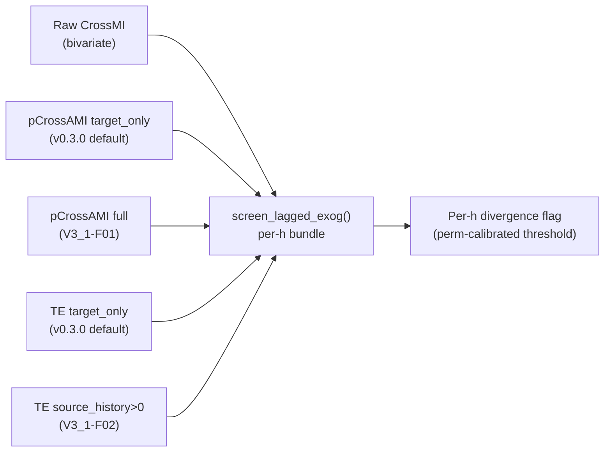

<!-- type: reference -->
# v0.3.1 — Lagged-Exogenous Triage: Draft Plan

**Plan type:** Actionable release plan — DRAFT follow-up to v0.3.0
**Audience:** Maintainer, reviewer, Jr. developer
**Target release:** `0.3.1`
**Current released version:** `0.3.0` (in progress)
**Branch:** `feat/v0.3.1-lagged-exogenous-triage` — draft
**Status:** Draft / Proposed
**Last reviewed:** 2026-04-17
**Builds on:** [v0.3.0 Covariant Informative plan](v0_3_0_covariant_informative_ultimate_plan.md)

---

## 1. Motivation

v0.3.0 ships a **covariant-informative triage gate** but leaves a verified gap: the
lightweight scorer/curve path (CrossMI, pCrossAMI, univariate-exog TE) does not condition
on the exogenous driver's own past. A driver that actually affects the target at lag 1
and lag 3 can therefore appear spuriously strong at lag 3 because the driver's own
lag-1↔lag-3 autocorrelation is left un-residualized. Full lagged-exogenous verification
in v0.3.0 requires PCMCI+ (V3-F03) or PCMCI-AMI-Hybrid (V3-F04), both of which apply the
full MCI test.

Evidence in source (verified 2026-04-17):

- `src/forecastability/services/partial_curve_service.py::_residualize` — when
  `exog is not None`, the future target is residualized on the target's intermediate lags
  only; the in-file comment reads: *"the exogenous predictor is left untouched (no
  residualization on the past side)"*. The residualization itself is linear
  (`sklearn.linear_model.LinearRegression`).
- `src/forecastability/diagnostics/transfer_entropy.py` — TE conditions on the **target**
  history `Y_{t-1..t-h+1}`; the source (exog) own-history is not part of the conditioning
  set.

v0.3.1 closes this specific gap in the lightweight path. It does not restate or replace
PCMCI-based causal discovery; PCMCI+ / PCMCI-AMI-Hybrid remain the recommended path for
confirmatory lagged-exogenous claims.

> [!IMPORTANT]
> v0.3.1 is **additive**. The existing `pCrossAMI` column and existing TE signature stay
> backward-compatible. Full-conditioning variants arrive as new opt-in parameters and new
> result columns.

---

## 2. Scope

### V3_1-F01 — Exogenous autohistory conditioning for pCrossAMI

**Goal.** Extend the pCrossAMI past-side residualization so that, when requested, the
exogenous predictor is residualized on its own lagged autohistory before the conditional
MI step.

**File targets.**

- `src/forecastability/services/partial_curve_service.py` — add `exog_self_condition: bool = False`
  to `_residualize` (and to public service callers), defaulting to current behavior.
- `src/forecastability/services/exog_partial_curve_service.py` — surface the flag on the
  public curve function and thread it into `_residualize`.
- `src/forecastability/utils/types.py` — extend the exog-partial result container with a
  `pCrossAMI_full` column (or a typed per-h field) alongside the existing `pCrossAMI`.
- `tests/test_covariant_lagged_exog_conditioning.py` — new.

**Acceptance criteria.**

- Default behavior byte-identical to v0.3.0 on existing fixtures when
  `exog_self_condition=False`.
- When `exog_self_condition=True`, the exog past is residualized on
  `exog[t-1..t-h+1]` using the same linear residualization backend already used for the
  target side (keep the existing linearity honest; do **not** describe the path as
  non-parametric).
- `min_pairs >= 50` enforced per horizon in both branches; degrees-of-freedom shrinkage at
  large `h` surfaces as a structured `InsufficientSamplesError` or the existing equivalent,
  not a silent NaN.
- New column `pCrossAMI_full` appears in the partial curve output alongside the existing
  `pCrossAMI`; the existing column retains `lagged_exog_conditioning == "target_only"`
  and the new one carries `"full_lightweight"`.
- `random_state: int` only; `n_neighbors=8` in the kNN MI step; rolling-origin usage
  stays train-only per the statistician invariants.

### V3_1-F02 — Transfer Entropy with source-history conditioning

**Goal.** Extend the TE service to optionally condition on a user-specified number of
source (exog) own-history lags in addition to the target history, matching Schreiber's
original TE definition more fully.

**File targets.**

- `src/forecastability/diagnostics/transfer_entropy.py` — add
  `source_history: int = 0` parameter. When `source_history == 0`, behavior is unchanged.
  When `source_history > 0`, append `X_{t-lag-source_history..t-lag-1}` to the conditioning
  set before the conditional MI step.
- `src/forecastability/services/transfer_entropy_service.py` — pass-through.
- `tests/test_transfer_entropy.py` — new test cases.

**Acceptance criteria.**

- `source_history=0` is byte-identical to v0.3.0.
- For a synthetic driver with strong lag-1 and lag-3 coupling and strong own
  autocorrelation, `source_history >= 2` must materially attenuate the lag-3 TE estimate
  relative to `source_history=0`.
- Docstring documents the Schreiber (2000) interpretation and names the block-length
  parameter explicitly.
- `n_surrogates >= 99` in any significance surrogate call; `random_state: int` only.

### V3_1-F03 — Lagged-exog screening utility

**Goal.** A small helper that, for `h = 1..H`, returns a per-horizon table of
`{raw_crossmi, pcrossami_target_only, pcrossami_full, te_target_only, te_source_history}`
and flags horizons where `|target_only − full| > τ` using a permutation-calibrated
threshold.

**File targets.**

- `src/forecastability/use_cases/screen_lagged_exog.py` — new use case function.
- `tests/test_screen_lagged_exog.py` — new.

**Acceptance criteria.**

- Helper is a pure use-case; no notebook-only logic.
- Permutation threshold uses `n_surrogates >= 99` and the same surrogate infrastructure as
  elsewhere in the package.
- Output model carries a per-row `lagged_exog_conditioning` tag consistent with the
  v0.3.0 §5A taxonomy plus the new `full_lightweight` tag introduced here.
- Helper is exercised on the v0.3.0 synthetic benchmark extended with a deliberate
  lag-1 + lag-3 mixed-effect driver; the test asserts that at least one horizon is flagged
  when the mixed-lag driver is active and no horizon is flagged when only an independent
  noise driver is present.

---

## 3. Out of scope for v0.3.1

- Multivariate cross-exog conditioning (e.g. exog1 conditioning on exog2 autohistory).
  That is a v0.4.0 topic and structurally overlaps with PCMCI+.
- Nonlinear conditioning via kNN CMI in the lightweight path. Users who need nonlinear
  conditional independence should use PCMCI-AMI-Hybrid; the lightweight path stays linear.
- MI-ranked conditioning-set selection (originally proposed under v0.3.0 V3-F04, deferred
  here). This is a PCMCI-AMI concern, not a pCrossAMI / TE concern.
- Any deprecation of existing public API shipped in v0.3.0.

---

## 4. Acceptance criteria

- `uv run ruff check . && uv run ty check` clean across the three tickets.
- New test suite uses a synthetic pair with a known mixed-lag effect (lag-1 + lag-3) where
  the target-only conditioning path measurably inflates the lag-3 estimate and the full
  conditioning path attenuates it; the inflation-vs-attenuation relationship is asserted
  numerically, not just visually.
- Regression test (extending the v0.3.0 Phase 3 test) that checks conditioning-scope
  metadata is accurate per row: `pCrossAMI_full` rows carry `"full_lightweight"`, legacy
  `pCrossAMI` rows still carry `"target_only"`, raw CrossMI rows still carry `"none"`,
  and PCMCI rows still carry `"full_mci"`.
- Stage-gate invariants (per the statistician instructions) hold: AMI per-horizon,
  train-only inside rolling-origin, `np.trapezoid`, `random_state: int`, `n_neighbors=8`,
  `min_pairs=50` for partial paths, `n_surrogates >= 99`.

---

## 5. Risks

- **Degrees-of-freedom shrinkage at high `h`.** With small `n`, the combined target-plus-source
  conditioning set can exhaust usable samples fast. `min_pairs` may need to be raised on a
  per-h basis; the screening helper (V3_1-F03) must surface this rather than silently
  returning noise.
- **User confusion between the two pCrossAMI flavors.** Mitigated by explicit column naming
  (`pCrossAMI` vs `pCrossAMI_full`), explicit `lagged_exog_conditioning` tags, and docs
  that link back to v0.3.0 §5A.
- **Lingering linearity.** The residualization backend remains linear; v0.3.1 does **not**
  promote pCrossAMI to a non-parametric conditional MI measure. Any docstring that calls
  this path "non-parametric" must fail the regression test inherited from v0.3.0.

---

## 6. Open questions

- Should full conditioning become the default in v0.4.0? That would be a breaking
  behavioral change; decision deferred until v0.3.1 field evidence is in.
- Should the `exog_self_condition` and `source_history` flags be exposed at the analyzer
  level, or only at the service/use-case level? Current working assumption: expose at
  service and use-case level in v0.3.1; re-evaluate analyzer surface at v0.4.0.

> [!NOTE]
> Decisions left open here are intentional. v0.3.1 is a targeted gap-closure release, not
> an API redesign.

---

## 7. References

- [v0.3.0 Covariant Informative plan](v0_3_0_covariant_informative_ultimate_plan.md), §5A
  (Known limitation: lagged-exogenous autohistory conditioning).
- [V3-F03 / V3-F04 second-loop review](implemented/v3_f03_v3_f04_second_loop_review.md) —
  reconciles what is shipped vs what was proposed in the PCMCI path.
- [`docs/theory/pcmci_plus.md`](../theory/pcmci_plus.md) — why PCMCI+ / PCMCI-AMI-Hybrid
  remain the recommended path for confirmatory lagged-exogenous verification.
- Schreiber, T. (2000). Measuring information transfer. *Physical Review Letters*, 85(2),
  461.
