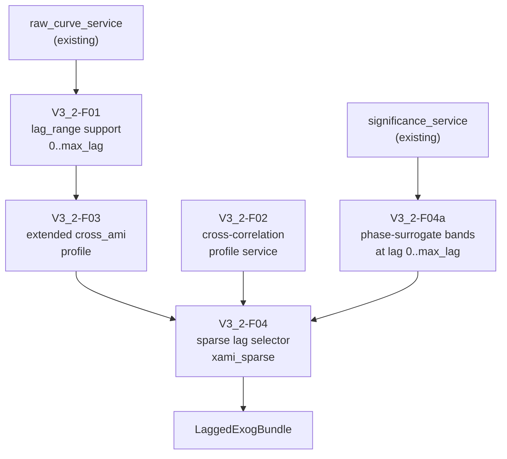
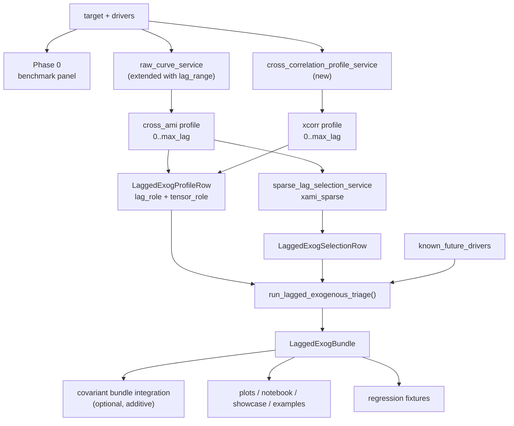

<!-- type: reference -->
# v0.3.2 — Lagged-Exogenous Triage: Ultimate Release Plan

**Plan type:** Actionable release plan — fixed-lag exogenous follow-up to implemented `0.3.0` and `0.3.1`
**Audience:** Maintainer, reviewer, Jr. developer
**Target release:** `0.3.2`
**Current released version:** `0.3.1`
**Branch:** `feat/v0.3.2-lagged-exogenous-triage`
**Status:** In progress — Phases 0 and 1 completed
**Last reviewed:** 2026-04-22

**Companion refs:**

- [v0.3.0 Covariant Informative: Ultimate Release Plan](implemented/v0_3_0_covariant_informative_ultimate_plan.md)
- [v0.3.1 Forecastability Fingerprint & Model Routing: Ultimate Release Plan](implemented/v0_3_1_forecastability_fingerprint_model_routing_plan.md)
- [v0.3.3 Documentation Quality Improvement: Ultimate Release Plan](v0_3_3_documentation_quality_improvement_ultimate_plan.md)
- [v0.3.4 Routing Validation & Benchmark Hardening: Ultimate Release Plan](v0_3_4_routing_validation_benchmark_hardening_plan.md)

**Builds on:**

- implemented `0.3.0` covariant triage gate, including `cross_ami`, `cross_pami`,
  `te`, `gcmi`, `pcmci`, `pcmci_ami`, `CovariantAnalysisBundle`,
  `CovariantSummaryRow`, and `lagged_exog_conditioning` metadata
- implemented `0.3.1` univariate fingerprint, AMI Information Geometry engine,
  routing service, agent A1/A2/A3 contract, and CSV batch adapter
- existing `services/exog_raw_curve_service.py`,
  `services/exog_partial_curve_service.py`, and the shared
  `raw_curve_service` / `partial_curve_service` machinery (currently emitting
  curves on `1..max_lag` only)
- existing notebook contract checks, smoke workflow, release checklist, and
  examples taxonomy under `examples/covariant_informative/`
- prior draft at
  [`docs/plan/aux_documents/v0_3_1_lagged_exogenous_triage_plan.md`](aux_documents/v0_3_1_lagged_exogenous_triage_plan.md)
  which the v0.3.0 facade explicitly forward-links from its conditioning-scope
  disclaimer

---

## 1. Why this plan exists

`0.3.0` shipped a covariant-informative triage gate, and `0.3.1` shipped the
geometry-backed fingerprint and routing layer. Both releases assume that any
exogenous candidate already has a sensible **lag contract** — which is where the
toolkit currently has a real gap.

Today the package conflates two qualitatively different questions:

1. **Multivariate (instant-impact) screening:** "Does $X$ co-move with $Y$ at the
   same time step?" — i.e. structural / contemporaneous association at $\text{lag}=0$.
   This is a diagnostic about leakage risk, contemporaneous structure, and
   known-future covariates. It is **not** a forecasting feature unless $X_t$ is
   actually known when $Y_t$ must be predicted.
2. **Covariant-informative screening:** "Does the *past* of $X$ carry usable
   predictive information about the *future* of $Y$?" — i.e. fixed-lag predictive
   association at $\text{lag} \ge 1$. This is the only association class that is
   eligible to enter a lagged-exogenous tensor for ordinary forecasting.

The repo currently offers covariant methods that all start from $\text{lag}=1$
and silently drop $\text{lag}=0$ structure, while the user-facing language treats
them as one homogeneous class. This release fixes that:

- multivariate (instant-impact) screening becomes a first-class, **diagnostic-only**
  surface
- covariant-informative screening becomes a first-class, **predictive** surface
  with a sparse lag selector and a tensor-eligibility flag
- a versioned escape hatch is added for **known-future** features whose
  $\text{lag}=0$ value is legitimately available at prediction time
- standard cross-correlation is added as the cheap linear baseline
- crosspAMI-style sparse lag pruning is added as the redundancy-reduction layer
- DTW / FastDTW / ShapeDTW are explicitly **out of scope** because they solve
  elastic-alignment similarity, not fixed-lag predictive feature selection

> The release should let a downstream consumer answer two crisp questions:
>
> 1. *Which exogenous variables are predictive at which lags?*
> 2. *Which exogenous variables are only contemporaneously associated and must
>    therefore be treated as multivariate diagnostics or known-future features?*

### Planning principles

| Principle | Implication |
| --- | --- |
| Two-axis taxonomy first | Every exogenous association is classified along **(role × tensor-eligibility)** |
| Fixed-lag chronology first | Predictive selection serves forecasting tensors, not elastic alignment |
| Additive, not disruptive | `0.3.0` covariant methods stay valid and correctly labelled |
| Hexagonal + SOLID | Lag-profile services, selection services, and rendering adapters stay separate |
| Honest semantics | Shipped `cross_pami` stays `target_only`; no relabelling without a new selector |
| Diagnostic vs predictive clarity | `lag = 0` is reportable but not selectable for tensors unless explicitly tagged `known_future` |
| Architecture-neutral hand-off | Output is a sparse lag map, not a commitment to one downstream model class |
| Geometry continuity | Reuse `0.3.1` significance machinery (surrogates, threshold profiles) where applicable, not a parallel ad-hoc copy |

### Reviewer acceptance block

`0.3.2` is successful only if all of the following are visible together:

1. **Role layer** (multivariate vs covariant-informative)
   - every emitted lag row carries a `lag_role`
   - `lag_role = "instant"` is reserved for $\text{lag} = 0$
   - `lag_role = "predictive"` is reserved for $\text{lag} \ge 1$
   - a `tensor_role` mirror field (`{diagnostic, predictive, known_future}`)
     captures whether the lag may legitimately enter a forecasting tensor
2. **Method layer**
   - standard cross-correlation profile over `0..max_lag`
   - `cross_ami` lag profile over `0..max_lag` (additive to existing `1..max_lag`)
   - shipped `cross_pami` semantics unchanged
3. **Selection layer**
   - sparse selector emits at least one row per `(target, driver)` pair
   - `selected_for_tensor = True` is impossible at `lag = 0` unless the user opts
     into a `known_future` tag
4. **Bundle integration**
   - `LaggedExogBundle` exists as a typed Python output
   - `CovariantAnalysisBundle` optionally surfaces a sparse lag-map summary
5. **Documentation**
   - the multivariate vs covariant-informative distinction is documented in
     `docs/theory/lagged_exogenous_triage.md` with a forward link from the
     `0.3.0` conditioning-scope disclaimer
   - DTW omission is documented as intentional
   - `cross_pami` semantics are still described as `target_only`

---

## 2. Theory-to-code map — mathematical foundations

> [!IMPORTANT]
> Every junior developer MUST read this section before writing any code.
> The release is small in surface area but extremely high in semantic risk:
> a wrong lag contract will contaminate every downstream exogenous model story.

### 2.1. Multivariate (instant-impact) vs covariant-informative — formal split

For target series $Y_t$ and candidate exogenous series $X_t$:

- **Multivariate / instant-impact** dependence at $k = 0$:

$$\text{Inst}(X, Y) = I(X_t ; Y_t)$$

- **Covariant-informative** dependence at $k \ge 1$:

$$\text{Pred}_k(X, Y) = I(X_{t-k} ; Y_t)$$

The release encodes one hard rule:

| Quantity | $k = 0$ | $k \ge 1$ |
| --- | --- | --- |
| `lag_role` | `instant` | `predictive` |
| Default `tensor_role` | `diagnostic` | `predictive` |
| Default `selected_for_tensor` | `False` | possibly `True` |
| Eligible to populate a lagged tensor for ordinary forecasting | only if user tags `known_future` | yes |

> [!NOTE]
> A "known-future" exogenous covariate is one whose value $X_t$ is observed
> *before* $Y_t$ must be predicted (calendar features, holidays, regulator-set
> tariffs, planned promotions). Such features may be selected at $\text{lag}=0$,
> but only via an explicit `known_future_drivers={...}` opt-in argument. The
> default behaviour remains diagnostic-only.

### 2.2. Standard cross-correlation baseline

For each $k \in \{0, 1, \dots, K_{\max}\}$:

$$\hat{\rho}_k(X, Y) = \frac{\sum_{t} (X_{t-k} - \bar{X})(Y_t - \bar{Y})}{\sqrt{\sum_{t} (X_{t-k} - \bar{X})^2 \sum_{t} (Y_t - \bar{Y})^2}}$$

This is the cheap *linear* baseline. It is **descriptive**, not causal, and not a
substitute for `cross_ami`. The release ships it with explicit sign retention
(no premature absolute-value collapse) and a documented warning that it cannot
detect symmetric nonlinear couplings (cf. v0.3.0 §5.1 nonlinear drivers panel).

### 2.3. Fixed-lag `cross_ami` profile over `0..max_lag`

For each $k \in \{0, 1, \dots, K_{\max}\}$:

$$\widehat{I}_k(X, Y) = \widehat{I}(X_{t-k} ; Y_t)$$

estimated with the same kNN MI estimator used by the rest of the covariant
surface. The shipped `compute_exog_raw_curve` only emits $k \in \{1, \dots, K_{\max}\}$;
this release adds a $k = 0$ row with `lag_role = "instant"` so that the multivariate
diagnostic is no longer silently dropped.

### 2.4. Sparse lag selection (crosspAMI-style pruning)

Given the dense profile $\widehat{I}_k$ for $k \in \{1, \dots, K_{\max}\}$,
emit a sparse subset $\mathcal{S}(X, Y) \subseteq \{1, \dots, K_{\max}\}$ such
that:

- the strongest lag $k^\star = \arg\max_k \widehat{I}_k$ is included
- subsequent candidates $k$ are added only if their *partialled* score
  $\tilde{I}_k$ — conditioned on already-selected lags of the same driver — exceeds
  a documented threshold

Concretely the selector loops:

1. start with $\mathcal{S} \leftarrow \emptyset$
2. while there exists $k^\dagger \in \{1, \dots, K_{\max}\} \setminus \mathcal{S}$
   with $\tilde{I}_{k^\dagger}(X, Y \mid \{X_{t - k'} : k' \in \mathcal{S}\}) \ge \tau_{\text{select}}$:
   add $k^\dagger$ to $\mathcal{S}$, capped at `max_selected_per_driver`
3. emit each candidate $k$ as a `LaggedExogSelectionRow` with
   `selected_for_tensor` true if and only if $k \in \mathcal{S}$

> [!IMPORTANT]
> This selector intentionally does **not** condition on the driver's own
> autohistory in `0.3.2`. That stronger conditioning is the job of
> `pcmci_ami` (`full_mci`) from v0.3.0. The selector is positioned as a
> *triage* layer that cheaply prunes redundant lags, not as a confirmatory
> causal filter. Any new selector that goes further (e.g. PMIME-style) must be
> introduced under a **new method label** so that shipped `cross_pami` semantics
> are not silently relabelled.

### 2.5. Significance handling

Wherever the surrogate path exists already (phase-randomised cross-AMI bands in
`run_covariant_analysis`), the lagged-exogenous flow MUST reuse it rather than
introducing a parallel surrogate engine. When a $\text{lag} = 0$ row is added,
the band machinery is extended to evaluate the same surrogate at $k = 0$.

If a method genuinely lacks a surrogate path (standard cross-correlation), the
significance field stays explicitly `None` and the row metadata records
`significance_source = "not_computed"`. No fake `p < 0.01` is invented.

### 2.6. DTW omission rationale

DTW, FastDTW, ShapeDTW, and friends solve **elastic-alignment similarity**:
they search for the alignment $\pi$ that minimises a path-cumulated distance
between $X$ and $Y$. They do not produce a fixed-lag predictive feature set,
they do not respect the chronological causality required by forecasting tensors,
and the warping path is not directly consumable as a lag map. They are out of
scope for `0.3.2` and remain so until a separate plan justifies a constrained
forecasting-causal use.

### 2.7. Conditioning-scope crosswalk after `0.3.2`

| Method (post-`0.3.2`) | Lag domain | `lag_role` per row | `tensor_role` per row | `lagged_exog_conditioning` |
| --- | --- | --- | --- | --- |
| Standard cross-correlation (`xcorr`) | `0..max_lag` | `instant` at `k=0`, `predictive` otherwise | `diagnostic` at `k=0`, `predictive` otherwise | `none` |
| `cross_ami` (extended profile) | `0..max_lag` | `instant` at `k=0`, `predictive` otherwise | `diagnostic` at `k=0`, `predictive` otherwise | `none` |
| Shipped `cross_pami` | `1..max_lag` | `predictive` | `predictive` | `target_only` (unchanged) |
| Sparse lag selector (`xami_sparse`) | `1..max_lag` | `predictive` | `predictive` | `target_only` |
| Transfer Entropy (existing) | `1..max_lag` | `predictive` | `predictive` | `target_only` |
| PCMCI+ / PCMCI-AMI (existing) | `0..max_lag` | inherits `instant`/`predictive` from PCMCI link lag | inherits | `full_mci` |
| Known-future opt-in | `0` only | `instant` | `predictive` (via opt-in) | `none` |

---

## 3. Repo baseline — what already exists

| Layer | Module | What it provides | Status |
| --- | --- | --- | --- |
| **Services** | `src/forecastability/services/raw_curve_service.py` | dense lag profile loop on `1..max_lag` | Stable |
| **Services** | `src/forecastability/services/partial_curve_service.py` | partial-curve loop, target-only residualisation | Stable |
| **Services** | `src/forecastability/services/exog_raw_curve_service.py` | thin wrapper around `compute_raw_curve` for exog | Stable |
| **Services** | `src/forecastability/services/exog_partial_curve_service.py` | thin wrapper around `compute_partial_curve` for exog | Stable |
| **Services** | `src/forecastability/services/transfer_entropy_service.py` | TE per pair, target-only conditioning | Stable |
| **Services** | `src/forecastability/services/significance_service.py` | reusable surrogate band machinery | Stable |
| **Use cases** | `src/forecastability/use_cases/run_covariant_analysis.py` | covariant bundle facade with conditioning metadata | Stable |
| **Types** | `src/forecastability/utils/types.py` | `CovariantSummaryRow`, `CovariantAnalysisBundle`, `LaggedExogConditioningTag` | Stable |
| **Synthetic** | `src/forecastability/utils/synthetic.py` | `generate_covariant_benchmark`, `generate_directional_pair`, fingerprint archetypes | Stable |
| **Notebooks** | `notebooks/walkthroughs/01_covariant_informative_showcase.ipynb` | covariant walkthrough | Stable |
| **Examples** | `examples/covariant_informative/` | facade benchmark, summary table, regression, info measures, exogenous screening | Stable |
| **CI** | `.github/workflows/{ci,smoke,publish-pypi,release}.yml`, `scripts/check_notebook_contract.py` | release hygiene baseline | Stable |
| **Docs** | `docs/theory/covariant_summary_table.md`, `docs/theory/covariant_role_assignment.md`, `docs/plan/implemented/v0_3_0_covariant_informative_ultimate_plan.md` §5A | conditioning scope and limitation language | Stable |

Forward-link target already in `run_covariant_analysis._FORWARD_LINK`:
`docs/plan/v0_3_1_lagged_exogenous_triage_plan.md`. The `0.3.2` plan supersedes
that draft and the constant must be repointed to the v0.3.2 plan in the same
release.

---

## 4. Feature inventory and overlap assessment

| ID | Feature | Phase | Overlap with existing | Genuine new work | Status |
| --- | --- | ---: | --- | --- | --- |
| V3_2-F00 | Typed lagged-exogenous result models | 0 | Extends `utils/types.py` patterns | `LagRoleLabel`, `TensorRoleLabel`, `LaggedExogProfileRow`, `LaggedExogSelectionRow`, `LaggedExogBundle` | Done |
| V3_2-F00.1 | Lagged-exogenous benchmark generators | 0 | Extends `utils/synthetic.py` | `generate_lagged_exog_panel`, `generate_known_future_calendar_pair`, `generate_contemporaneous_only_pair` | Done |
| V3_2-F01 | Zero-lag-aware lag plumbing | 1 | Extends `raw_curve_service`, `exog_raw_curve_service`, `exog_partial_curve_service` | `lag_range` argument, additive `0..max_lag` support, role tagging at the boundary | Done |
| V3_2-F02 | Standard cross-correlation profile service | 1 | New service modelled on existing curve services | `services/cross_correlation_profile_service.py` with `0..max_lag` signed profile | Done |
| V3_2-F03 | Extended `cross_ami` lag profile | 1 | Extends `services/exog_raw_curve_service.py` | `compute_exog_raw_curve_with_zero_lag()` + `lag_role` tagging | Done |
| V3_2-F04 | Sparse lag selector (`xami_sparse`) | 1 | New service modelled on existing partial-curve flow | `services/sparse_lag_selection_service.py`, additive selector contract | Done |
| V3_2-F04a | Selector significance reuse | 1 | Reuses `significance_service` | extend phase-surrogate bands to `0..max_lag`, no parallel surrogate engine | Done |
| V3_2-F05 | Lagged-exogenous orchestration use case | 2 | Follows `use_cases/` pattern | `use_cases/run_lagged_exogenous_triage.py` returning `LaggedExogBundle` | Proposed |
| V3_2-F05a | Known-future opt-in | 2 | Argument extension on use case | `known_future_drivers: dict[str, bool]` honored in selector, with caution flag | Proposed |
| V3_2-F06 | Integration with covariant bundle | 2 | Additive on `run_covariant_analysis` | optional `lagged_exog: LaggedExogBundle | None` field on `CovariantAnalysisBundle` | Proposed |
| V3_2-F07 | Tests and regression fixtures | 3 | Follows current deterministic regression pattern | lag-role invariants, zero-lag ban, selection drift, known-future opt-in path | Proposed |
| V3_2-F08 | Plotting refresh | 4 | Extends covariant plot helpers | correlogram-first lag-profile figure with `lag = 0` visually separated | Proposed |
| V3_2-F08.1 | Walkthrough notebook | 4 | Follows existing walkthrough pattern | `notebooks/walkthroughs/03_lagged_exogenous_triage_showcase.ipynb` | Proposed |
| V3_2-F08.2 | Public examples | 4 | Extends `examples/covariant_informative/` | `examples/covariant_informative/lagged_exogenous/{python,cli,known_future}.{py,md}` | Proposed |
| V3_2-F09 | Showcase script | 4 | Mirrors `scripts/run_showcase_covariant.py` | `scripts/run_showcase_lagged_exogenous.py` with `--smoke` mode | Proposed |
| V3_2-CI-01 | Smoke path for lagged-exog triage | 5 | Extends `.github/workflows/smoke.yml` | run showcase script in `--smoke` mode | Proposed |
| V3_2-CI-02 | Notebook contract extension | 5 | Extends `scripts/check_notebook_contract.py` | track new walkthrough notebook | Proposed |
| V3_2-CI-03 | Release checklist update | 5 | Extends `.github/ISSUE_TEMPLATE/release_checklist.md` | zero-lag ban, sparse map, known-future opt-in checks | Proposed |
| V3_2-D01 | Theory doc | 6 | New docs page | `docs/theory/lagged_exogenous_triage.md` covering role taxonomy, sparse selection, DTW omission | Proposed |
| V3_2-D02 | README + quickstart + public API update | 6 | Extends `README.md`, `docs/quickstart.md`, `docs/public_api.md` | document `LaggedExogBundle`, role taxonomy, known-future opt-in | Proposed |
| V3_2-D03 | Forward-link repointing + changelog | 6 | Extends `run_covariant_analysis._FORWARD_LINK`, `CHANGELOG.md` | repoint to v0.3.2 plan, document additive semantics | Proposed |

---

## 5. Domain contracts — MANDATORY FIRST STEP

### 5.1. Typed result models

**File:** `src/forecastability/utils/types.py` (additive only)

```python
from typing import Literal

from pydantic import BaseModel, Field

LagRoleLabel = Literal["instant", "predictive"]
TensorRoleLabel = Literal["diagnostic", "predictive", "known_future"]
LagSelectorLabel = Literal["xcorr_top_k", "xami_sparse"]
LagSignificanceSource = Literal[
    "phase_surrogate_xami",
    "phase_surrogate_xcorr",
    "not_computed",
]


class LaggedExogProfileRow(BaseModel, frozen=True):
    """One lag-domain diagnostic row for a target-driver pair.

    Carries every method-specific score that exists at this lag, plus the
    role and significance metadata required to interpret it correctly.
    """

    target: str
    driver: str
    lag: int
    lag_role: LagRoleLabel
    tensor_role: TensorRoleLabel
    correlation: float | None = None
    cross_ami: float | None = None
    cross_pami: float | None = None
    significance: str | None = None
    significance_source: LagSignificanceSource = "not_computed"
    metadata: dict[str, str | int | float] = Field(default_factory=dict)


class LaggedExogSelectionRow(BaseModel, frozen=True):
    """Sparse predictive lag selection row.

    Emitted once per (target, driver, lag) candidate evaluated by the
    selector. ``selected_for_tensor`` is the only field downstream tensor
    builders should consume.
    """

    target: str
    driver: str
    lag: int
    selected_for_tensor: bool
    selection_order: int | None = None
    selector_name: LagSelectorLabel
    score: float | None = None
    tensor_role: TensorRoleLabel = "predictive"
    metadata: dict[str, str | int | float] = Field(default_factory=dict)


class LaggedExogBundle(BaseModel, frozen=True):
    """Composite output from fixed-lag exogenous triage."""

    target_name: str
    driver_names: list[str]
    max_lag: int
    profile_rows: list[LaggedExogProfileRow]
    selected_lags: list[LaggedExogSelectionRow]
    known_future_drivers: list[str] = Field(default_factory=list)
    metadata: dict[str, str | int | float] = Field(default_factory=dict)
```

### 5.2. Boundary rules

- profile computation is in `services/`
- selection computation is in a separate service (`sparse_lag_selection_service.py`)
- rendering / plotting adapters do not own lag-role semantics
- the `known_future` tag is honored at the **use case** layer; selector services
  are pure and do not read it
- existing `cross_pami` semantics remain `target_only`; no service silently
  upgrades it
- new selector labels (`xcorr_top_k`, `xami_sparse`) must each be a distinct
  `selector_name` and never overwrite `cross_pami`'s shipped surface

### 5.3. Acceptance criteria

- typed models importable from the stable `forecastability.utils.types`
  surface
- categorical fields use closed `Literal` labels, not free-form strings
- `lag = 0` is representable and explicitly tagged `instant`
- `selected_for_tensor=True` is impossible at `lag = 0` unless the driver is in
  `known_future_drivers`
- typed sparse output exists independently from plot artifacts
- no existing covariant bundle field changes shape (additive only)

---

## 6. Synthetic benchmark panel — MANDATORY FIRST STEP

> [!IMPORTANT]
> Routing-style logic without a panel of archetypal driver classes becomes
> opinionated guesswork. Build the generator and the case taxonomy BEFORE any
> selector implementation.

### 6.1. Required driver archetypes

The generator emits a 7-driver panel with known ground truth, modelled on
`generate_covariant_benchmark` but with explicit lag-role expectations:

1. `direct_lag2` — true predictive driver at $k = 2$
2. `mediated_lag1` — true predictive driver at $k = 1$, mediated via `direct_lag2`
3. `redundant` — strongly correlated with `direct_lag2`, no independent signal
4. `noise` — pure independent noise
5. `instant_only` — strong contemporaneous coupling, no predictive lag signal
6. `nonlinear_lag1` — quadratic or abs-value coupling at $k = 1$, Pearson
   $|\rho| < 0.1$ at all lags by construction
7. `known_future_calendar` — deterministic calendar / planned-event signal that
   is genuinely available at prediction time (used for the `known_future` opt-in
   path)

### 6.2. Expected behavior matrix

| Driver | Std cross-corr at `k=0` | Std cross-corr at `k≥1` | `cross_ami` at `k=0` | `cross_ami` at `k≥1` | Selected lags (default) | Selected lags (with known-future opt-in) |
| --- | --- | --- | --- | --- | --- | --- |
| `direct_lag2` | small | strong at `k=2` | small | strong at `k=2` | `{2}` | `{2}` |
| `mediated_lag1` | small | strong at `k=1` | small | strong at `k=1` | `{1}` | `{1}` |
| `redundant` | small | spuriously strong | small | spuriously strong | pruned to `{}` or `{k^\star}` only | unchanged |
| `noise` | near 0 | near 0 | near 0 | near 0 | `{}` | `{}` |
| `instant_only` | strong at `k=0` | small | strong at `k=0` | small | `{}` (diagnostic only) | `{0}` if user opts in as known-future |
| `nonlinear_lag1` | $\approx 0$ everywhere | $\approx 0$ everywhere | small | strong at `k=1` | `{1}` | `{1}` |
| `known_future_calendar` | strong at `k=0` | small | strong at `k=0` | small | `{}` (diagnostic only) | `{0}` |

### 6.3. Acceptance criteria

- deterministic by seed
- used in tests, showcase, examples, and the walkthrough notebook
- at least one case proves `lag = 0` strong yet unselectable by default
  (`instant_only`)
- at least one case proves the known-future opt-in flips that case to selectable
- at least one case proves cross-correlation and `cross_ami` disagree for a
  nonlinear driver (`nonlinear_lag1`)
- at least one case proves redundant lags are pruned by `xami_sparse`

### 6.4. Generator skeleton

**File:** `src/forecastability/utils/synthetic.py` (additive)

```python
def generate_lagged_exog_panel(
    n: int = 1500,
    *,
    seed: int = 42,
) -> pd.DataFrame:
    """Generate a 7-driver lagged-exogenous benchmark with known ground truth.

    Drivers are wired so that:
      - direct_lag2:        true predictive lag at k = 2
      - mediated_lag1:      true predictive lag at k = 1, via direct_lag2
      - redundant:          correlated with direct_lag2, no extra signal
      - noise:              independent noise
      - instant_only:       contemporaneous coupling at k = 0 only
      - nonlinear_lag1:     quadratic coupling at k = 1, Pearson |rho| ~ 0
      - known_future_cal:   deterministic calendar feature, contemporaneous

    See plan §6.2 for the full expected-behavior matrix.

    Args:
        n: Number of time steps. Must be >= 200.
        seed: Random seed (must be int, not np.Generator).

    Returns:
        DataFrame with columns: target, direct_lag2, mediated_lag1,
        redundant, noise, instant_only, nonlinear_lag1, known_future_cal.
    """
    if n < 200:
        raise ValueError(f"n must be >= 200, got {n}")
    rng = np.random.default_rng(seed)
    # ... structural equations as documented in §6.2 ...
```

A companion `generate_known_future_calendar_pair()` and
`generate_contemporaneous_only_pair()` are added for unit-test scope.

---

## 7. Phased delivery

### Phase 0 — Domain contracts and benchmark panel

#### V3_2-F00 — Typed lagged-exog result models

**File targets:**

- `src/forecastability/utils/types.py`
- export surfaces if applicable

**Acceptance criteria:**

- frozen typed models added per §5.1
- JSON serialisation is stable
- no existing covariant bundle field changes shape

#### V3_2-F00.1 — Benchmark generators

**File targets:**

- `src/forecastability/utils/synthetic.py`
- `tests/test_synthetic_lagged_exog_panel.py`

**Acceptance criteria:**

- canonical driver cases per §6.1 are deterministic by seed
- no notebook reimplements generators
- sanity-check tests freeze:
  - `nonlinear_lag1` Pearson $|\rho| < 0.10$ at every lag
  - `instant_only` Pearson $|\rho|$ at $k = 0$ is materially larger than at any
    $k \ge 1$
  - `direct_lag2` Pearson $|\rho|$ peaks at $k = 2$

---

### Phase 1 — Core methods

Implemented in this branch (validated): V3_2-F01, V3_2-F02, V3_2-F03, V3_2-F04, and V3_2-F04a. Validation executed with targeted tests: `uv run pytest tests/test_raw_curve_service.py tests/test_exog_curve_services.py tests/test_cross_correlation_profile_service.py tests/test_sparse_lag_selection_service.py tests/test_significance_service.py -q`.



#### V3_2-F01 — Zero-lag-aware lag plumbing

**File targets:**

- `src/forecastability/services/raw_curve_service.py`
- `src/forecastability/services/exog_raw_curve_service.py`
- `src/forecastability/services/exog_partial_curve_service.py`
- supporting helpers as needed

**Implementation contract (additive only):**

```python
def compute_raw_curve(
    series: np.ndarray,
    max_lag: int,
    scorer: DependenceScorer,
    *,
    exog: np.ndarray | None = None,
    min_pairs: int = 30,
    random_state: int = 42,
    lag_range: tuple[int, int] | None = None,  # NEW, defaults preserve behavior
) -> np.ndarray: ...
```

When `lag_range` is `None`, the function is byte-for-byte equivalent to today's
`1..max_lag` loop. When `lag_range = (0, max_lag)`, a `k = 0` row is prepended.
The `exog_raw_curve_service` and `exog_partial_curve_service` gain analogous
optional arguments. **No existing call site changes by default.**

**Acceptance criteria:**

- diagnostic lag domain supports `0..max_lag` opt-in
- existing predictive-only call paths still emit `1..max_lag`
- every `lag = 0` row downstream is tagged `lag_role = "instant"`
- regression test freezes one `lag_range = (1, max_lag)` curve byte-for-byte
  against the v0.3.0 fixture to prove no behavior change for default callers

#### V3_2-F02 — Standard cross-correlation profile service

**File targets:**

- `src/forecastability/services/cross_correlation_profile_service.py`
- `tests/test_cross_correlation_profile_service.py`

**Implementation contract:**

```python
def compute_cross_correlation_profile(
    target: np.ndarray,
    driver: np.ndarray,
    *,
    max_lag: int,
    lag_range: tuple[int, int] = (0, None),  # explicit; signed values retained
    method: Literal["pearson"] = "pearson",
) -> np.ndarray:
    """Signed cross-correlation profile rho_k(driver, target) over the lag range.

    Returns a 1-D array aligned to ``range(lag_range[0], max_lag + 1)``.
    Sign is preserved; consumers that want absolute scores must apply abs()
    themselves.
    """
```

**Acceptance criteria:**

- signed correlogram retained
- not collapsed to absolute score before return
- documented in module docstring as a linear baseline only, not causal evidence
- a unit test verifies the panel `nonlinear_lag1` driver's profile sits within
  $\pm 0.10$ across the full range while `cross_ami` exceeds a documented
  positive threshold at $k = 1$

#### V3_2-F03 — Extended `cross_ami` lag profile

**File targets:**

- `src/forecastability/services/exog_raw_curve_service.py`
- `tests/test_exog_raw_curve_service.py`

**Acceptance criteria:**

- additive helper `compute_exog_raw_curve_with_zero_lag()` returns a
  `(max_lag + 1,)` array indexed by `range(0, max_lag + 1)`
- existing `compute_exog_raw_curve()` unchanged
- significance semantics remain method-specific (no silent estimator swap)
- docs/theory note explicitly warns that `lag = 0` `cross_ami` measures
  contemporaneous structure, not predictive value

#### V3_2-F04 — Sparse lag selector (`xami_sparse`)

**File targets:**

- `src/forecastability/services/sparse_lag_selection_service.py`
- `src/forecastability/utils/types.py` (selector label, already in §5.1)
- `tests/test_sparse_lag_selection_service.py`

**Implementation contract:**

```python
@dataclass(frozen=True, slots=True)
class SparseLagSelectionConfig:
    """Versioned thresholds for the xami_sparse selector."""

    selector_name: LagSelectorLabel = "xami_sparse"
    max_selected_per_driver: int = 3
    score_threshold: float = 0.02      # tau_select on the partialled MI
    relative_threshold: float = 0.20   # tau_rel: fraction of k_star score
    min_lag: int = 1                   # never set 0 from the selector itself


def select_sparse_lags(
    target: np.ndarray,
    driver: np.ndarray,
    *,
    max_lag: int,
    scorer: DependenceScorer,
    config: SparseLagSelectionConfig = SparseLagSelectionConfig(),
    random_state: int = 42,
) -> list[LaggedExogSelectionRow]:
    """Greedy selector: start from k_star, then add lags whose score conditioned
    on already-selected lags of the same driver still exceeds tau_select and
    tau_rel * score(k_star). Caps at max_selected_per_driver.
    """
```

**Acceptance criteria:**

- evaluates only `k >= config.min_lag` (default `1`); cannot return `k = 0`
- emits one row per evaluated candidate with `selected_for_tensor`,
  `selection_order`, and `score`
- does not relabel shipped `cross_pami` surface
- if a stronger PMIME-style selector is later proposed, it MUST register a new
  `selector_name` literal and not overload `xami_sparse`
- regression test freezes selected-lag set for the §6 panel

#### V3_2-F04a — Selector significance reuse

**File targets:**

- `src/forecastability/services/significance_service.py` (additive helper)
- `tests/test_significance_service.py`

**Acceptance criteria:**

- the existing phase-surrogate machinery is extended to accept `lag_range`
  including `0`; no parallel surrogate engine is created
- a `lag = 0` band is computed only when explicitly requested via the new
  argument (default callers unchanged)
- significance metadata propagates into `LaggedExogProfileRow.significance` and
  `LaggedExogProfileRow.significance_source`

---

### Phase 2 — Orchestration and integration

#### V3_2-F05 — `run_lagged_exogenous_triage()`

**File target:** `src/forecastability/use_cases/run_lagged_exogenous_triage.py`

**Implementation contract:**

```python
def run_lagged_exogenous_triage(
    target: np.ndarray,
    drivers: dict[str, np.ndarray],
    *,
    target_name: str,
    max_lag: int,
    n_surrogates: int = 199,
    alpha: float = 0.05,
    random_state: int = 42,
    selector_config: SparseLagSelectionConfig = SparseLagSelectionConfig(),
    known_future_drivers: dict[str, bool] | None = None,
    include_zero_lag_diagnostic: bool = True,
    include_cross_correlation: bool = True,
    include_cross_ami: bool = True,
) -> LaggedExogBundle:
    """Fixed-lag exogenous triage facade returning a typed LaggedExogBundle.

    See plan §2 and §5 for the role taxonomy and §6 for the canonical
    benchmark panel that exercises the contract.
    """
```

**Acceptance criteria:**

- returns `LaggedExogBundle`
- profile rows + sparse selected lags both available
- the orchestration code does not import any plotting / CLI / agent module
- no adapter-to-adapter coupling
- raises `ValueError` if any driver is not aligned to target length
- raises `ValueError` if `n_surrogates < 99`

#### V3_2-F05a — Known-future opt-in

**File targets:**

- `src/forecastability/use_cases/run_lagged_exogenous_triage.py`
- `tests/test_run_lagged_exogenous_triage.py`

**Acceptance criteria:**

- `known_future_drivers` defaults to `None`; default behavior matches the
  diagnostic-only contract
- when a driver is flagged, its `lag = 0` row is emitted as a
  `LaggedExogSelectionRow` with `tensor_role = "known_future"` and
  `selected_for_tensor = True`
- `LaggedExogBundle.known_future_drivers` records the opt-in list
- a caution flag is included in `metadata` warning that known-future selection
  is the user's contractual claim, not the toolkit's

#### V3_2-F06 — Integration with covariant bundle

**File targets:**

- `src/forecastability/use_cases/run_covariant_analysis.py`
- `src/forecastability/utils/types.py` (additive `lagged_exog: LaggedExogBundle | None = None` on `CovariantAnalysisBundle`)
- `tests/test_covariant_facade.py` (additive case)

**Acceptance criteria:**

- additive integration only; existing fields unchanged
- `run_covariant_analysis(..., include_lagged_exog_triage=False)` is the default
- when enabled, the bundle exposes a sparse lag map alongside existing
  per-method curves
- the `_FORWARD_LINK` constant in `run_covariant_analysis` is updated to point
  at the v0.3.2 plan
- architecture remains neutral with respect to downstream model class

---

### Phase 3 — Tests and regression

#### V3_2-F07 — Lag semantics tests

Required test classes (in `tests/test_run_lagged_exogenous_triage.py` and
`tests/test_lagged_exog_role_invariants.py`):

- `test_zero_lag_row_is_diagnostic_only`
- `test_zero_lag_never_selected_for_tensor_by_default`
- `test_known_future_opt_in_flips_zero_lag_to_selected`
- `test_direct_driver_selected_at_expected_lag`
- `test_mediated_driver_selected_at_expected_lag`
- `test_contemporaneous_only_driver_not_selected_by_default`
- `test_redundant_driver_pruned_by_xami_sparse`
- `test_nonlinear_driver_can_exceed_linear_baseline_at_k1`
- `test_shipped_cross_pami_semantics_not_overwritten`
- `test_no_default_callsite_behavior_change_in_existing_curve_services`

**Acceptance criteria:**

- deterministic by seed
- routing-style assertions check role and selection set membership, not
  brittle floating-point thresholds
- one regression freezes the §6 panel selected-lag map

#### V3_2-F07.1 — Regression fixtures

**File targets:**

- `docs/fixtures/lagged_exog_regression/expected/` (frozen JSON)
- `scripts/rebuild_lagged_exog_regression_fixtures.py` (new)
- `src/forecastability/diagnostics/lagged_exog_regression.py` (rebuilder helpers)

**Acceptance criteria:**

- rebuild script exists and is referenced from
  `.github/ISSUE_TEMPLATE/release_checklist.md`
- selection drift visible in CI
- docstring guards protecting `target_only` semantics on `cross_pami` are
  exercised by at least one regression test
- floating-point fields use the project's `math.isclose(atol, rtol)` tolerance
  pattern (see user-memory note on cross-platform numeric drift)

---

### Phase 4 — Plotting, notebook, examples, showcase

#### V3_2-F08 — Plotting refresh

**File targets:**

- `src/forecastability/utils/plots.py` or a dedicated
  `src/forecastability/adapters/rendering/lagged_exog_plots.py`
- `tests/test_lagged_exog_plots.py`

**Acceptance criteria:**

- correlogram and `cross_ami` lag profiles are primary
- `lag = 0` is visually separated (e.g. distinct marker, vertical guide line,
  or panel split)
- selected predictive lags are highlighted directly in plots
- plot helpers do not own role semantics; they consume `LaggedExogBundle`

#### V3_2-F08.1 — Walkthrough notebook

**File target:**
`notebooks/walkthroughs/03_lagged_exogenous_triage_showcase.ipynb`

**Required sections:**

1. Multivariate vs covariant-informative — the role taxonomy
2. Standard cross-correlation baseline on the §6 panel
3. Extended `cross_ami` profile and the `lag = 0` diagnostic
4. Sparse lag selection with `xami_sparse`
5. The known-future opt-in worked example
6. DTW omission rationale (textual only)
7. Hand-off: how the sparse lag map is consumed by a downstream tensor builder

**Acceptance criteria:**

- explains diagnostic vs predictive lag roles
- shows sparse lag map hand-off
- explains explicit DTW omission
- uses reusable services only (no notebook-local logic)
- registered in `scripts/check_notebook_contract.py`

#### V3_2-F08.2 — Public examples

**File targets:**

- `examples/covariant_informative/lagged_exogenous/lagged_exog_python_example.py`
- `examples/covariant_informative/lagged_exogenous/lagged_exog_cli_example.md`
- `examples/covariant_informative/lagged_exogenous/known_future_opt_in_example.py`

**Acceptance criteria:**

- minimal Python example uses `run_lagged_exogenous_triage()` only
- CLI example is a documented runnable invocation, not just prose
- known-future example shows the opt-in path explicitly

#### V3_2-F09 — Showcase script

**File target:** `scripts/run_showcase_lagged_exogenous.py`

**Acceptance criteria:**

- runs the §6 benchmark panel
- emits JSON, markdown summary, figures
- supports `--smoke` for CI-friendly run
- mirrors `scripts/run_showcase_covariant.py` invocation conventions

---

### Phase 5 — CI / release hygiene

#### V3_2-CI-01 — Smoke workflow addition

- run `scripts/run_showcase_lagged_exogenous.py --smoke --quiet`
- triggers on push to `main`

#### V3_2-CI-02 — Notebook contract extension

- add `notebooks/walkthroughs/03_lagged_exogenous_triage_showcase.ipynb` to the
  tracked notebook list
- representative integration call exercised by the contract checker

#### V3_2-CI-03 — Release checklist update

- add explicit assertions for:
  - zero-lag handling (no selection at `k = 0` without opt-in)
  - sparse lag selection drift (regression fixture)
  - known-future opt-in path
  - lagged-exog showcase command

---

### Phase 6 — Documentation

#### V3_2-D01 — Theory doc

**File target:** `docs/theory/lagged_exogenous_triage.md`

Must document:

- multivariate (instant) vs covariant-informative (lagged) role taxonomy
- standard cross-correlation as a linear baseline
- extended `cross_ami` lag profile
- sparse selector (`xami_sparse`) algorithm and config
- known-future opt-in semantics
- explicit DTW omission and rationale
- continued `target_only` semantics for shipped `cross_pami`

#### V3_2-D02 — README + quickstart + public API update

**File targets:** `README.md`, `docs/quickstart.md`, `docs/public_api.md`

Add a new section in each:

- one Python snippet showing `run_lagged_exogenous_triage()`
- one CLI example
- one known-future opt-in snippet
- cross-link to the walkthrough notebook and the §6 panel docs

#### V3_2-D03 — Forward-link repointing + changelog

**File targets:**

- `src/forecastability/use_cases/run_covariant_analysis.py` (`_FORWARD_LINK`)
- `docs/plan/implemented/v0_3_0_covariant_informative_ultimate_plan.md`
  (only the disclaimer link target, not the rationale)
- `CHANGELOG.md`

**Acceptance criteria:**

- forward-link repointed to v0.3.2 plan
- changelog documents additive surfaces and semantic clarifications, with no
  breaking-change entry
- migration note: existing covariant calls remain unchanged

---

## 8. Out of scope for v0.3.2

- using `lag = 0` as predictive tensor input without an explicit
  `known_future_drivers` opt-in
- claiming causal identification from cross-correlation or pairwise MI
- replacing PCMCI+ / PCMCI-AMI as the confirmatory path
- adding elastic-alignment methods (DTW, FastDTW, ShapeDTW) as official
  exogenous triage tools
- committing downstream architecture to a single neural or tabular family
- introducing a PMIME-style selector under the existing `cross_pami` label
- benchmark-calibrated thresholds for `tau_select` / `tau_rel` (deferred to
  v0.3.4)
- multivariate (multi-target) extensions of the lagged-exog facade

---

## 9. Exit criteria

- [ ] Every ticket V3_2-F00 through V3_2-F09 is either **Done** or explicitly
      **Deferred** in §4.
- [ ] Every ticket V3_2-CI-01 through V3_2-CI-03 is **Done**.
- [ ] Every ticket V3_2-D01 through V3_2-D03 is **Done**.
- [ ] `LaggedExogProfileRow`, `LaggedExogSelectionRow`, and `LaggedExogBundle`
      exist as typed outputs with closed `Literal` labels for role fields.
- [ ] `lag = 0` is supported diagnostically and blocked predictively unless
      `known_future_drivers` opts in.
- [ ] Standard cross-correlation and `cross_ami` both exist as lag profiles
      over `0..max_lag` with `lag_role` tagging.
- [ ] Sparse selected-lag output is restricted to `1..max_lag` from the
      selector itself.
- [ ] `run_covariant_analysis` `_FORWARD_LINK` repointed to this plan.
- [ ] No active docs or notebook imply DTW is a recommended triage path.
- [ ] No active docs or notebook redescribe shipped `cross_pami` as a
      fully conditioned selector.
- [ ] At least one regression fixture protects the §6 panel selected-lag map
      from silent drift.
- [ ] At least one regression fixture protects existing default-call-path
      curves from byte-level drift introduced by the new `lag_range` argument.

---

## 10. Recommended implementation order

```text
1. Phase 0  — typed models + benchmark panel + role labels
2. Phase 1a — zero-lag plumbing (V3_2-F01) with default-behavior regression
3. Phase 1b — cross-correlation profile service (V3_2-F02)
4. Phase 1c — extended cross_ami profile (V3_2-F03)
5. Phase 1d — sparse lag selector (V3_2-F04, V3_2-F04a)
6. Phase 2  — use case + known-future opt-in + covariant bundle integration
7. Phase 3  — tests + regression fixtures + rebuild script
8. Phase 4  — plotting + showcase script + examples + walkthrough notebook
9. Phase 5  — CI smoke + notebook contract + release checklist
10. Phase 6 — theory doc + README/quickstart/public API + forward-link + changelog
```

---

## 11. Detailed implementation appendix — additive extension only

> [!IMPORTANT]
> This appendix exists only to give `0.3.2` the same practical implementation
> depth that `0.3.0` and `0.3.1` already have: file-level targets, code
> skeletons, validation rules, and execution order. It does **not** replace any
> prior section — wherever a snippet here disagrees with §2-§10, §2-§10 wins.

### 11.1. Reference architecture for the lagged-exog release



### 11.2. File map — concrete target placement

| Layer | New / updated file | Purpose |
| --- | --- | --- |
| Utils | `src/forecastability/utils/types.py` | typed lagged-exog outputs and role literals |
| Utils | `src/forecastability/utils/synthetic.py` | §6 benchmark panel + helpers |
| Services | `src/forecastability/services/raw_curve_service.py` | additive `lag_range` argument |
| Services | `src/forecastability/services/exog_raw_curve_service.py` | wrapper exposing zero-lag-aware curve |
| Services | `src/forecastability/services/exog_partial_curve_service.py` | wrapper exposing zero-lag-aware curve |
| Services | `src/forecastability/services/cross_correlation_profile_service.py` | new linear baseline service |
| Services | `src/forecastability/services/sparse_lag_selection_service.py` | new `xami_sparse` selector |
| Services | `src/forecastability/services/significance_service.py` | extend phase-surrogate bands to `lag = 0` |
| Use cases | `src/forecastability/use_cases/run_lagged_exogenous_triage.py` | new orchestration facade |
| Use cases | `src/forecastability/use_cases/run_covariant_analysis.py` | additive integration + forward-link repoint |
| Diagnostics | `src/forecastability/diagnostics/lagged_exog_regression.py` | regression rebuilder helpers |
| Adapters / rendering | `src/forecastability/adapters/rendering/lagged_exog_plots.py` (or extension to `utils/plots.py`) | correlogram-first plot |
| Tests | `tests/test_synthetic_lagged_exog_panel.py` | benchmark panel sanity |
| Tests | `tests/test_cross_correlation_profile_service.py` | linear baseline correctness |
| Tests | `tests/test_exog_raw_curve_service.py` | extended profile correctness + default-callpath byte equivalence |
| Tests | `tests/test_sparse_lag_selection_service.py` | selector correctness + redundant-driver pruning |
| Tests | `tests/test_significance_service.py` | extended bands at `lag = 0` |
| Tests | `tests/test_run_lagged_exogenous_triage.py` | use-case contract + known-future opt-in |
| Tests | `tests/test_lagged_exog_role_invariants.py` | role taxonomy invariants |
| Tests | `tests/test_lagged_exog_regression.py` | frozen panel-selection drift guard |
| Tests | `tests/test_covariant_facade.py` | additive lagged-exog integration case |
| Examples | `examples/covariant_informative/lagged_exogenous/lagged_exog_python_example.py` | minimal Python example |
| Examples | `examples/covariant_informative/lagged_exogenous/lagged_exog_cli_example.md` | CLI example |
| Examples | `examples/covariant_informative/lagged_exogenous/known_future_opt_in_example.py` | known-future opt-in example |
| Scripts | `scripts/run_showcase_lagged_exogenous.py` | canonical artifact generator with `--smoke` |
| Scripts | `scripts/rebuild_lagged_exog_regression_fixtures.py` | regression fixture rebuilder |
| Notebook | `notebooks/walkthroughs/03_lagged_exogenous_triage_showcase.ipynb` | pedagogical walkthrough |
| Docs | `docs/theory/lagged_exogenous_triage.md` | role taxonomy and method semantics |
| Docs | `docs/quickstart.md`, `docs/public_api.md`, `README.md` | user-facing additive surface |
| Docs | `CHANGELOG.md` | release notes (additive) |
| CI | `.github/workflows/smoke.yml`, `.github/ISSUE_TEMPLATE/release_checklist.md`, `scripts/check_notebook_contract.py` | smoke + checklist + notebook contract |

### 11.3. Versioned configuration object for the sparse selector

```python
from __future__ import annotations

from dataclasses import dataclass

from forecastability.utils.types import LagSelectorLabel


@dataclass(frozen=True, slots=True)
class SparseLagSelectionConfig:
    """Versioned thresholds for the xami_sparse lag selector.

    These defaults are intentionally conservative for v0.3.2. Calibration
    against a curated panel and rolling-origin evaluation is deferred to v0.3.4.

    Attributes:
        selector_name: Closed literal that identifies the selector in
            ``LaggedExogSelectionRow.selector_name``. Future selectors must
            register a NEW literal rather than overload this one.
        max_selected_per_driver: Cap on lags emitted with
            ``selected_for_tensor=True`` per (target, driver).
        score_threshold: Absolute floor on the partialled MI score required
            for a candidate to enter the selected set.
        relative_threshold: Fractional floor relative to the strongest lag's
            score. A candidate must satisfy both score thresholds.
        min_lag: Smallest lag the selector itself ever returns. Must remain
            >= 1 for v0.3.2 to enforce the predictive-only contract; the
            known-future opt-in is honored at the use-case layer, not here.
    """

    selector_name: LagSelectorLabel = "xami_sparse"
    max_selected_per_driver: int = 3
    score_threshold: float = 0.02
    relative_threshold: float = 0.20
    min_lag: int = 1
```

### 11.4. Worked invariants for the role taxonomy

| Invariant | How to assert in tests |
| --- | --- |
| Every emitted profile row at `lag = 0` has `lag_role == "instant"` | parametric loop over `bundle.profile_rows` |
| Every emitted profile row at `lag >= 1` has `lag_role == "predictive"` | parametric loop over `bundle.profile_rows` |
| No selection row has `lag == 0` unless `bundle.known_future_drivers` lists its driver | iterate over `bundle.selected_lags`, cross-check against `known_future_drivers` |
| `selector_name` is one of the registered literals | `assert row.selector_name in get_args(LagSelectorLabel)` |
| `tensor_role == "known_future"` only when the use case received an opt-in for that driver | sanity check in `test_known_future_opt_in_flips_zero_lag_to_selected` |
| Default-callpath byte equivalence on the v0.3.0 fixture | freeze `compute_exog_raw_curve(...)` output and assert exact equality |
