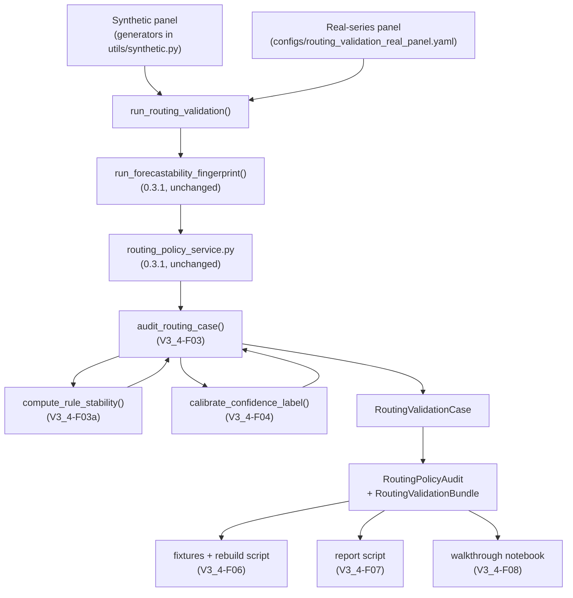

<!-- type: reference -->
# v0.3.3 — Routing Validation & Benchmark Hardening: Ultimate Release Plan

**Plan type:** Actionable release plan — validation and calibration hardening for routing surfaces
**Audience:** Maintainer, reviewer, statistician reviewer, Jr. developer
**Target release:** `0.3.3` — **ships first** in the 0.3.3 → 0.3.4 → 0.3.5 chain
**Current released version:** `0.3.2`
**Branch:** `feat/v0.3.3-routing-validation-hardening`
**Status:** In progress (Phase 0 done; revised 2026-04-23 after statistician + architect review)
**Last reviewed:** 2026-04-23

> [!NOTE]
> **Cross-release ordering.** This plan ships **before** v0.3.4 because the
> calibrated `confidence_label` and `RoutingValidationBundle` it introduces are
> consumed directly by `ForecastPrepContract` confidence propagation
> (v0.3.4 §2.5). The v0.3.5 documentation hardening release ships **after**
> v0.3.4 so the docs pass covers all new public surfaces (validation +
> contract + adapters + extras) in one sweep instead of three.

**Companion refs:**

- [v0.3.0 Covariant Informative: Ultimate Release Plan](implemented/v0_3_0_covariant_informative_ultimate_plan.md)
- [v0.3.1 Forecastability Fingerprint & Model Routing: Ultimate Release Plan](implemented/v0_3_1_forecastability_fingerprint_model_routing_plan.md)
- [v0.3.2 Lagged-Exogenous Triage: Ultimate Release Plan](implemented/v0_3_2_lagged_exogenous_triage_ultimate_plan.md)
- [v0.3.4 Forecast Prep Contract: Ultimate Release Plan](v0_3_4_forecast_prep_contract_ultimate_plan.md) — ships next
- [v0.3.5 Documentation Quality Improvement: Ultimate Release Plan](v0_3_5_documentation_quality_improvement_ultimate_plan.md) — ships last

**Builds on:**

- implemented `0.3.1` `FingerprintBundle`, `RoutingRecommendation`,
  `ForecastabilityFingerprint`, `RoutingConfidenceLabel = Literal["high",
  "medium", "low"]`, and `ModelFamilyLabel`
- implemented `0.3.1` routing service (`services/routing_policy_service.py`) and
  univariate fingerprint use case (`use_cases/run_forecastability_fingerprint.py`)
- implemented `0.3.0` significance machinery (`services/significance_service.py`)
  and synthetic generators in `utils/synthetic.py`
- implemented `0.3.2` `LaggedExogBundle`, `LaggedExogSelectionRow`,
  `SparseLagSelectionConfig`, and the `xami_sparse` selector
- v0.3.5 docs-contract checker
  (`scripts/check_docs_contract.py`) and the canonical terminology table
- existing regression-fixture pattern under
  `docs/fixtures/{diagnostic,covariant,fingerprint,lagged_exog}_regression/`
- existing showcase script pattern (`scripts/run_showcase.py`,
  `scripts/run_showcase_covariant.py`, `scripts/run_showcase_fingerprint.py`,
  `scripts/run_showcase_lagged_exogenous.py`)

---

## 1. Why this plan exists

`0.3.1` shipped the deterministic forecastability fingerprint and a routing
recommendation surface. `0.3.2` shipped the lagged-exogenous sparse lag map.
Both surfaces now influence what downstream consumers do. The next release
(`0.3.4`) is the headline Forecast Prep Contract release that turns routing
output into Darts/MLForecast specs.

If we let `0.3.4` ship on top of routing rules that have **no formal pass/fail
contract**, **no calibrated confidence labels**, and **no regression protection
against silent rule drift**, then every downstream framework spec will inherit
that uncertainty and amplify it inside the user's modelling pipeline.

This release therefore has one job: **make the routing surface's behavior
contractual, evidence-based, and drift-protected before the Forecast Prep
Contract starts consuming it.**

It is **not** a model benchmark release. It does not train models. It does not
claim to know the optimal model family for a series. It calibrates the existing
`RoutingRecommendation` policy against synthetic archetypes with known ground
truth and against a small panel of license-clear real series, and it exposes the
results as a typed, regression-protected validation bundle.

> [!IMPORTANT]
> Routing recommendations are family-level guidance, not optimal-model claims.
> Every public result, doc string, and changelog entry in this release must
> preserve that distinction. Routing that pretends to be benchmarking is the
> single largest credibility risk this repository carries.

### Planning principles

| Principle | Implication |
| --- | --- |
| Validation before expansion | Better-calibrated existing rules beat new untested rules |
| Hexagonal + SOLID | Benchmark generation, policy evaluation, confidence calibration, and reporting stay separated |
| Family-level humility | Rules emit families and fallbacks; never one-true-model |
| Confidence must be earned | Confidence labels are computed deterministically from rule-stability and threshold-distance |
| Regression visibility | Every routing-policy change must surface as a fixture diff, not as a silent label flip |
| Pass / fail / abstain / downgrade are first-class | The four outcomes are formal, typed, and grep-able |
| Real-series panel is small and license-clear | Three real datasets at most, all redistributable or downloadable on demand |
| Additive only on `0.3.1` types | Existing `RoutingRecommendation` shape is preserved; the `abstain` confidence label is added by extending `RoutingConfidenceLabel` |

### Reviewer acceptance block

`0.3.3` is successful only if all of the following are visible together:

1. **Typed validation surface**
   - `RoutingValidationCase`, `RoutingPolicyAudit`, and
     `RoutingValidationBundle` exist as frozen Pydantic models with closed
     `Literal` outcome labels (`pass`, `fail`, `abstain`, `downgrade`)
   - the existing `RoutingConfidenceLabel` is additively extended to
     `Literal["high", "medium", "low", "abstain"]`
2. **Synthetic archetype panel**
   - ten synthetic generators with known ground truth, deterministic by seed,
     enumerated in §6.1 with explicit expected primary families
3. **Real-series panel**
   - exactly three license-clear real series with documented sources, expected
     family classes, and expected caution flags
4. **Policy audit service**
   - `services/routing_policy_audit_service.py` evaluates a routing
     recommendation against an expected-family case using the four outcomes
   - threshold-distance is computed and exposed per case
5. **Confidence calibration service**
   - `services/routing_confidence_calibration_service.py` computes the new
     `confidence_label` deterministically from rule-stability, threshold
     distance, and the existing fingerprint penalty count
6. **Validation use case**
   - `run_routing_validation()` returns `RoutingValidationBundle`
7. **Regression discipline**
   - frozen JSON fixtures under
     `docs/fixtures/routing_validation_regression/expected/`
   - rebuild script `scripts/rebuild_routing_validation_fixtures.py`
8. **Reporting**
   - `scripts/run_routing_validation_report.py` generates a markdown + JSON
     report and a small set of summary plots
9. **CI**
   - smoke job runs the validation report in `--smoke` mode
   - release checklist requires a fixture diff sign-off for any routing rule
     change
10. **Documentation**
    - `docs/theory/routing_validation.md` documents the four outcomes, the
      threshold-distance metric, and the rule-stability score
    - `CHANGELOG.md` `0.3.3` entry lists the additive surfaces and explicitly
      notes that no `0.3.1` routing-rule semantics change without a fixture
      refresh

---

## 2. Theory-to-code map — formal validation semantics

> [!IMPORTANT]
> Every junior developer MUST read this section before writing any code.
> The release is small in surface area but extremely high in semantic risk:
> a wrong outcome label or a miscomputed threshold distance will silently
> mislabel routing quality across the entire panel.

### 2.1. Notation

For a triaged series with fingerprint $f$ and routing recommendation
$r = \texttt{RoutingRecommendation}$, define:

- $\mathcal{F}_{\text{obs}}(r) \subseteq \mathcal{F}$ — observed primary
  families emitted by `r.primary_families`
- $\mathcal{F}_{\text{exp}}(c) \subseteq \mathcal{F}$ — expected primary
  families declared by validation case $c$
- $\theta = \{\theta_1, \theta_2, \ldots\}$ — the routing policy thresholds
  (e.g. nonlinear-share floor, information-mass floor, structure-stability
  floor) read from `services/routing_policy_service.py`
- $s_i > 0$ — the per-coordinate normalisation scale read from
  `RoutingPolicyAuditConfig.coordinate_scales` (default `1.0` for fingerprint
  coordinates already normalised to $[0, 1]$; documented operating range
  otherwise; see §2.3 and §2.6)
- $d_\theta(f) = \min_i |f_i - \theta_i| / s_i$ — the smallest *normalised*
  distance from the fingerprint vector $f$ to any active threshold $\theta_i$
- $S(f, r; \delta) \in [0, 1]$ — the rule-stability score (defined in §2.4)

### 2.2. The four outcomes — formal predicates

For each validation case $c$ paired with its observed routing recommendation
$r$, exactly one outcome label $o \in \{\texttt{pass}, \texttt{fail},
\texttt{abstain}, \texttt{downgrade}\}$ is assigned by the policy audit
service:

$$
o(c, r) = \begin{cases}
\texttt{abstain}    & \text{if } |\mathcal{F}_{\text{obs}}(r)| = 0 \\
\texttt{pass}       & \text{if } \mathcal{F}_{\text{exp}}(c) \cap \mathcal{F}_{\text{obs}}(r) \ne \emptyset \text{ and } d_\theta(f) \ge \tau_{\text{margin}} \text{ and } S(f, r; \delta) \ge \tau_{\text{stable}} \\
\texttt{downgrade}  & \text{if } \mathcal{F}_{\text{exp}}(c) \cap \mathcal{F}_{\text{obs}}(r) \ne \emptyset \text{ and } \big( d_\theta(f) < \tau_{\text{margin}} \text{ or } S(f, r; \delta) < \tau_{\text{stable}} \big) \\
\texttt{fail}       & \text{otherwise}
\end{cases}
$$

where $\tau_{\text{margin}}$ and $\tau_{\text{stable}}$ are versioned scalars
defined in `RoutingPolicyAuditConfig` (default values in §2.6).

> [!NOTE]
> A `downgrade` is **not** a failure. It is a passing decision whose confidence
> the validator deliberately reduces because the supporting evidence sits close
> to a policy boundary. The downstream Forecast Prep Contract (`0.3.4`) reads
> the new `confidence_label` field directly to decide how cautiously to
> recommend a model family.

> [!IMPORTANT]
> The `fail` outcome deliberately collapses two distinct situations: a
> *confident-wrong* recommendation (family disjoint from expected, but
> $d_\theta(f) \ge \tau_{\text{margin}}$ and $S \ge \tau_{\text{stable}}$) and
> a *borderline-wrong* recommendation (family disjoint from expected, with
> low margin or low stability). The numeric `threshold_margin` and
> `rule_stability` fields on `RoutingValidationCase` remain available for
> downstream diagnostics and drift detection; consumers must not infer
> "borderline" from `outcome` alone.

### 2.3. Threshold-distance metric

Let $\theta = (\theta_1, \ldots, \theta_K)$ be the active routing thresholds
and $f = (f_1, \ldots, f_K)$ the corresponding fingerprint coordinates (the
fingerprint exposes one coordinate per active threshold). Let $s_i > 0$ be
the per-coordinate normalisation scale defined in §2.1 and pinned in §2.6.
The normalised signed threshold-distance vector is:

$$\widetilde{\Delta}_\theta(f) = \big( (f_1 - \theta_1)/s_1, \ldots, (f_K - \theta_K)/s_K \big)$$

The scalar margin used for the predicate in §2.2 is:

$$d_\theta(f) = \min_{i \in \{1, \ldots, K\}} |\widetilde{\Delta}_{\theta, i}(f)|$$

> [!IMPORTANT]
> Per-coordinate normalisation is mandatory because the active thresholds
> live on heterogeneous scales (nonlinear-share is a $[0, 1]$ ratio;
> information-mass typically clusters near $1$ with effective range $\le 0.15$;
> structure-stability is in $[0, 1]$). Without dividing by $s_i$, the scalar
> margin $\tau_{\text{margin}}$ would silently bias toward whichever
> coordinate has the narrowest natural range. The default $s_i = 1.0$ is
> only valid for coordinates already normalised to $[0, 1]$; coordinates
> with documented operating ranges must override $s_i$ in
> `RoutingPolicyAuditConfig.coordinate_scales`.

> [!IMPORTANT]
> $d_\theta(f)$ is a measure of policy fragility, not a measure of forecasting
> quality. A small $d_\theta(f)$ means "your fingerprint is sitting on the
> fence between two routing arms" and triggers either a `downgrade` or a
> reduced confidence label. It does not mean the series is hard to forecast.

### 2.4. Rule-stability score across nearby parameter perturbations

The rule-stability score $S(f, r; \delta)$ measures how robust the routing
decision is to small perturbations of the fingerprint coordinates. Let
$\mathcal{P}_\delta(f) = \{f + e : e \in \mathbb{R}^K, \|e/s\|_\infty \le \delta\}$
be the closed $\ell_\infty$-ball of radius $\delta$ around $f$ in *normalised*
coordinates (using the same per-coordinate scale $s_i$ from §2.3). Discretise
$\mathcal{P}_\delta(f)$ into the deterministic **corner-plus-center** grid

$$\hat{\mathcal{P}}_\delta(f) = \{f + \delta \cdot s \odot e : e \in \{-1, +1\}^K\} \cup \{f\}$$

so that $|\hat{\mathcal{P}}_\delta(f)| = 2^K + 1$. Let $r' = \text{route}(f')$
be the routing recommendation evaluated at $f' \in \hat{\mathcal{P}}_\delta(f)$.
Then:

$$S(f, r; \delta) = \frac{|\{f' \in \hat{\mathcal{P}}_\delta(f) : \mathcal{F}_{\text{obs}}(r') = \mathcal{F}_{\text{obs}}(r)\}|}{|\hat{\mathcal{P}}_\delta(f)|}$$

A score of $1.0$ means the decision is invariant under the grid; a score below
$\tau_{\text{stable}}$ triggers a `downgrade` (per §2.2) and a reduced
confidence label (per §2.5).

> [!NOTE]
> Corner-plus-center is preferred over axis-only ($2K + 1$ samples) because
> axis-only flips one coordinate at a time and systematically *over-estimates*
> stability by missing interaction effects between thresholds. Corner-plus-
> center evaluates every sign combination of the $K$ coordinates plus the
> center. With the current $K \le 6$ active thresholds, this caps at
> $2^6 + 1 = 65$ routing-service calls per case, which is well within budget.

> [!NOTE]
> The rule-stability score is deterministic by construction (no Monte Carlo).
> The grid $\hat{\mathcal{P}}_\delta(f)$ is a fixed corner-plus-center
> enumeration; the implementation must sort `fingerprint_coordinates` keys
> before constructing the grid so that two identical fingerprints always
> produce the same score regardless of upstream dict insertion order.

### 2.5. Confidence label calibration

The new `confidence_label` is computed deterministically from three signals:

1. the existing fingerprint penalty count
   $p \in \mathbb{N}$ (already computed by `0.3.1` routing service)
2. the threshold margin $d_\theta(f)$
3. the stability score $S(f, r; \delta)$

The decision table is **evaluated top-to-bottom; the first matching row wins**:

| Condition | `confidence_label` |
| --- | --- |
| $\mathcal{F}_{\text{obs}}(r) = \emptyset$ | `abstain` |
| $p = 0$ and $d_\theta(f) \ge \tau_{\text{margin}}$ and $S \ge \tau_{\text{stable, high}}$ | `high` |
| $p \le 1$ and $d_\theta(f) \ge \tau_{\text{margin, med}}$ and $S \ge \tau_{\text{stable, med}}$ | `medium` |
| otherwise | `low` |

The equivalent reference implementation:

```python
if not primary_families:
    return "abstain"
if penalty_count == 0 and margin >= cfg.tau_margin and stability >= cfg.tau_stable_high:
    return "high"
if penalty_count <= 1 and margin >= cfg.tau_margin_medium and stability >= cfg.tau_stable_medium:
    return "medium"
return "low"
```

> [!IMPORTANT]
> The labels `high`, `medium`, `low` retain their `0.3.1` meaning. The
> `abstain` label is **new** and is reserved for cases where the routing
> service would emit zero primary families. This extension is additive: the
> existing `RoutingConfidenceLabel = Literal["high", "medium", "low"]` is
> widened to `Literal["high", "medium", "low", "abstain"]`. No existing field
> name changes; no existing default value changes.

### 2.6. Versioned scalars

The validation thresholds are encoded in a frozen Pydantic config so that
fixture rebuilds are deterministic and so that any change is grep-able:

| Symbol | Default | Meaning |
| --- | --- | --- |
| $\tau_{\text{margin}}$ | `0.05` | Minimum threshold margin for `pass` |
| $\tau_{\text{margin, med}}$ | `0.02` | Minimum margin for `medium` confidence |
| $\tau_{\text{stable}}$ | `0.80` | Minimum stability score for `pass` |
| $\tau_{\text{stable, high}}$ | `0.95` | Minimum stability for `high` confidence |
| $\tau_{\text{stable, med}}$ | `0.75` | Minimum stability for `medium` confidence |
| $\delta$ | `0.05` | Perturbation radius in **normalised** fingerprint coordinate space (per §2.4) |
| $s_i$ | `1.0` per coordinate (default) | Per-coordinate normalisation scale used in §2.3 and §2.4. Override only for coordinates not already in $[0, 1]$; record overrides in `RoutingPolicyAuditConfig.coordinate_scales` and pin them in the regression fixture |

These defaults are intentionally conservative for `0.3.3`. They are versioned
in `RoutingPolicyAuditConfig` and cited in `docs/theory/routing_validation.md`.
Any change requires a fixture rebuild and a changelog entry.

---

## 3. Repo baseline — what already exists

| Layer | Module | What it provides | Status |
| --- | --- | --- | --- |
| **Types** | `src/forecastability/utils/types.py` | `RoutingRecommendation`, `RoutingConfidenceLabel`, `RoutingCautionFlag`, `ModelFamilyLabel`, `FingerprintBundle`, `ForecastabilityFingerprint` | Stable |
| **Services** | `src/forecastability/services/routing_policy_service.py` | rule-based mapping from fingerprint to families | Stable |
| **Services** | `src/forecastability/services/significance_service.py` | reusable surrogate band machinery | Stable |
| **Services** | `src/forecastability/services/sparse_lag_selection_service.py` | `xami_sparse` selector (consumed by `exogenous_driven` archetype) | Stable |
| **Use cases** | `src/forecastability/use_cases/run_forecastability_fingerprint.py` | univariate fingerprint facade | Stable |
| **Use cases** | `src/forecastability/use_cases/run_lagged_exogenous_triage.py` | lagged-exogenous facade | Stable |
| **Synthetic** | `src/forecastability/utils/synthetic.py` | existing fingerprint archetype generators (white noise, AR(1), seasonal, nonlinear-mixed) | Stable |
| **Diagnostics** | `src/forecastability/diagnostics/fingerprint_regression.py` | precedent for regression rebuilder | Stable |
| **Fixtures** | `docs/fixtures/{diagnostic,covariant,fingerprint,lagged_exog}_regression/` | precedent for frozen JSON snapshots | Stable |
| **Showcase scripts** | `scripts/run_showcase_*.py` | precedent for `--smoke` invocations | Stable |
| **CI** | `.github/workflows/{ci,smoke,publish-pypi,release}.yml`, `.github/ISSUE_TEMPLATE/release_checklist.md` | release hygiene baseline | Stable |
| **Docs** | `docs/theory/forecastability_fingerprint.md`, `docs/theory/ami_information_geometry.md` | shipped routing/fingerprint theory | Stable |
| **Docs contract** | `scripts/check_docs_contract.py` (from v0.3.5) | terminology + import + version + lifecycle checks | Stable (new in v0.3.5) |

---

## 4. Feature inventory and overlap assessment

| ID | Feature | Phase | Overlap with existing | Genuine new work | Status |
| --- | --- | ---: | --- | --- | --- |
| V3_4-F00 | Validation result models | 0 | Extends `utils/types.py` patterns | `RoutingValidationCase`, `RoutingPolicyAudit`, `RoutingValidationBundle`, `RoutingValidationOutcome`, additive `abstain` confidence label, `RoutingPolicyAuditConfig` (with `@model_validator(mode="after")` cross-field checks per §5.1) | Done |
| V3_4-F00a | `confidence_label` widening safety patch | 0 | Patches existing call sites | replace open `confidence_label != "low"` checks at `use_cases/run_batch_forecastability_workbench.py` lines 97 and 138 with explicit `in {"high", "medium"}`; tighten `adapters/llm/fingerprint_agent.py` payload field type from `str` to `RoutingConfidenceLabel`; add AST guard test that fails on any future open inequality against the widened alias | Done |
| V3_4-F01 | Expanded synthetic archetype panel | 1 | Extends `utils/synthetic.py` | ten generators (§6.1) with deterministic seed contracts and expected-family metadata (one extra `low_directness_high_penalty` generator added to guarantee `confidence_label = "low"` coverage) | Done |
| V3_4-F02 | Real-series validation panel | 1 | New small curated dataset layer | three license-clear real series with metadata (§6.2) | Done |
| V3_4-F03 | Policy audit service | 1 | Builds on `routing_policy_service.py` | `services/routing_policy_audit_service.py` implementing the four-outcome predicate from §2.2 and the normalised threshold-distance metric from §2.3 | Done |
| V3_4-F03a | Rule-stability subroutine | 1 | New helper inside policy audit | `compute_rule_stability(fingerprint, recommendation, *, delta) -> float` per §2.4 (corner-plus-center grid, $2^K + 1$ samples) | Done |
| V3_4-F04 | Confidence calibration service | 1 | Extends routing semantics | `services/routing_confidence_calibration_service.py` implementing §2.5 with the additive `abstain` label and the explicit first-matching-row precedence | Done |
| V3_4-F05 | Validation orchestration use case | 2 | Follows `use_cases/` pattern | `use_cases/run_routing_validation.py` returning `RoutingValidationBundle`; manifest loader lives next to it as `use_cases/routing_validation_panel.py` (not `diagnostics/`) | Done |
| V3_4-F06 | Regression fixtures | 3 | Extends current fixture discipline | `docs/fixtures/routing_validation_regression/expected/` + `scripts/rebuild_routing_validation_fixtures.py` (with `--calibrate-near-threshold` sub-step that pins the `weak_seasonal` amplitude to land inside the downgrade band) | Done |
| V3_4-F07 | Validation report generation | 4 | Extends showcase/reporting pattern | `scripts/run_routing_validation_report.py` emitting markdown + JSON + summary plots | Proposed |
| V3_4-F08 | Walkthrough notebook | 4 | Follows existing walkthrough pattern | `notebooks/walkthroughs/04_routing_validation_showcase.ipynb` | Proposed |
| V3_4-F09 | Agentic example — "hear human-feedback narration" | 4 | Extends `adapters/agents/` + `examples/.../agents/` patterns | `adapters/agents/routing_validation_agent_payload_models.py` (deterministic A3 payload), `examples/univariate/agents/routing_validation_agent_review.py` (deterministic-first demo with optional live-LLM path gated on the existing `agent` extra), reusing the [docs/agent_layer.md](../agent_layer.md) hard contract | Proposed |
| V3_4-CI-01 | Validation smoke test | 5 | Extends `.github/workflows/smoke.yml` | run report script in `--smoke` mode | Proposed |
| V3_4-CI-02 | Release checklist hardening | 5 | Extends `.github/ISSUE_TEMPLATE/release_checklist.md` | fixture diff sign-off required for any change to `services/routing_policy_service.py` | Proposed |
| V3_4-CI-03 | Notebook contract extension | 5 | Extends `scripts/check_notebook_contract.py` | track new walkthrough notebook | Proposed |
| V3_4-CI-04 | `diagnostics/` boundary test | 5 | Extends `tests/test_architecture_boundaries.py` | new `test_diagnostics_have_no_infra_imports` mirroring the existing services rule (forbids `matplotlib`, `pydantic_ai`, `fastapi`, `mcp`, `httpx`, `click`, `typer`) so the new `diagnostics/routing_validation_regression.py` cannot regress | Proposed |
| V3_4-D01 | Validation theory doc | 6 | New docs page | `docs/theory/routing_validation.md` covering §2 in plain language | Proposed |
| V3_4-D02 | README + quickstart + public API update | 6 | Extends user-facing docs | document `confidence_label` widening, the validation use case, the report script, and the agentic example | Proposed |
| V3_4-D03 | Changelog and policy notes | 6 | Release docs | document additive surfaces and the additive `abstain` label | Proposed |

---

## 5. Domain contracts — MANDATORY FIRST STEP

### 5.1. Typed result models

**File:** `src/forecastability/utils/types.py` (additive only)

```python
from typing import Literal

from pydantic import BaseModel, ConfigDict, Field, field_validator, model_validator

# Additive widening of the existing label. The three original values keep
# their 0.3.1 meaning. ``abstain`` is new and is emitted only when the
# routing recommendation contains zero primary families.
RoutingConfidenceLabel = Literal["high", "medium", "low", "abstain"]

RoutingValidationOutcome = Literal["pass", "fail", "abstain", "downgrade"]

RoutingValidationSourceKind = Literal["synthetic", "real"]


class RoutingPolicyAuditConfig(BaseModel):
    """Versioned scalars for the routing policy audit.

    Defaults match plan v0.3.3 §2.6. Any change requires a fixture rebuild
    via ``scripts/rebuild_routing_validation_fixtures.py``.
    """

    model_config = ConfigDict(frozen=True)

    tau_margin: float = Field(
        default=0.05,
        ge=0.0,
        description="Minimum threshold margin required for a 'pass' outcome.",
    )
    tau_margin_medium: float = Field(
        default=0.02,
        ge=0.0,
        description="Minimum margin for 'medium' confidence.",
    )
    tau_stable: float = Field(
        default=0.80,
        ge=0.0,
        le=1.0,
        description="Minimum rule-stability score required for a 'pass' outcome.",
    )
    tau_stable_high: float = Field(
        default=0.95,
        ge=0.0,
        le=1.0,
        description="Minimum stability score for 'high' confidence.",
    )
    tau_stable_medium: float = Field(
        default=0.75,
        ge=0.0,
        le=1.0,
        description="Minimum stability score for 'medium' confidence.",
    )
    perturbation_radius: float = Field(
        default=0.05,
        gt=0.0,
        description="L-infinity radius (in normalised coordinates) for the rule-stability grid.",
    )
    coordinate_scales: dict[str, float] = Field(
        default_factory=dict,
        description=(
            "Per-coordinate normalisation scales s_i used in §2.3 and §2.4. "
            "Missing keys default to 1.0 (assumed already in [0, 1]). "
            "Override only for coordinates with documented operating ranges "
            "outside [0, 1]."
        ),
    )

    @model_validator(mode="after")
    def _check_threshold_ordering(self) -> "RoutingPolicyAuditConfig":
        if self.tau_margin_medium > self.tau_margin:
            raise ValueError(
                "tau_margin_medium must be <= tau_margin "
                f"(got {self.tau_margin_medium} > {self.tau_margin})"
            )
        if not (
            self.tau_stable_medium <= self.tau_stable <= self.tau_stable_high
        ):
            raise ValueError(
                "Expected tau_stable_medium <= tau_stable <= tau_stable_high "
                f"(got {self.tau_stable_medium}, {self.tau_stable}, "
                f"{self.tau_stable_high})"
            )
        for key, value in self.coordinate_scales.items():
            if value <= 0.0:
                raise ValueError(
                    f"coordinate_scales['{key}'] must be > 0 (got {value})"
                )
        return self


class RoutingValidationCase(BaseModel):
    """One benchmark validation case for the routing policy.

    A case pairs a synthetic or real series's expected primary families with
    the routing recommendation observed for that series. The four outcome
    labels are defined formally in plan v0.3.3 §2.2.
    """

    model_config = ConfigDict(frozen=True)

    case_name: str = Field(description="Stable, machine-readable case identifier.")
    source_kind: RoutingValidationSourceKind
    expected_primary_families: list[str] = Field(
        description="Non-empty list of family labels considered acceptable for this case.",
    )
    observed_primary_families: list[str]
    outcome: RoutingValidationOutcome
    confidence_label: RoutingConfidenceLabel
    threshold_margin: float = Field(
        description="d_theta(f) per plan §2.3; smaller means closer to a routing boundary.",
    )
    rule_stability: float = Field(
        ge=0.0,
        le=1.0,
        description="S(f, r; delta) per plan §2.4.",
    )
    fingerprint_penalty_count: int = Field(
        ge=0,
        description="Existing 0.3.1 penalty count carried through unchanged.",
    )
    notes: list[str] = Field(default_factory=list)
    metadata: dict[str, str | int | float] = Field(default_factory=dict)

    @field_validator("expected_primary_families")
    @classmethod
    def _expected_non_empty(cls, value: list[str]) -> list[str]:
        if not value:
            raise ValueError("expected_primary_families must be non-empty")
        return value


class RoutingPolicyAudit(BaseModel):
    """Aggregate audit of routing policy over a panel of validation cases."""

    model_config = ConfigDict(frozen=True)

    total_cases: int = Field(ge=0)
    passed_cases: int = Field(ge=0)
    failed_cases: int = Field(ge=0)
    downgraded_cases: int = Field(ge=0)
    abstained_cases: int = Field(ge=0)
    metadata: dict[str, str | int | float] = Field(default_factory=dict)

    @field_validator("abstained_cases")
    @classmethod
    def _counts_consistent(cls, value: int, info: object) -> int:
        # Cross-field count consistency (passed + failed + downgraded +
        # abstained == total) is enforced by the constructor in
        # run_routing_validation(); the validator stays for non-negativity.
        return value


class RoutingValidationBundle(BaseModel):
    """Composite output from routing validation orchestration."""

    model_config = ConfigDict(frozen=True)

    cases: list[RoutingValidationCase]
    audit: RoutingPolicyAudit
    config: RoutingPolicyAuditConfig
    metadata: dict[str, str | int | float] = Field(default_factory=dict)
```

### 5.2. Boundary rules

- `RoutingConfidenceLabel` widening is additive. No existing field name
  changes. No existing default value changes. The `abstain` label appears only
  when `RoutingRecommendation.primary_families` is empty.
- All non-exhaustive call sites that compare `confidence_label` to a single
  value (notably `use_cases/run_batch_forecastability_workbench.py` lines
  97 and 138 which use `!= "low"`) MUST be patched in V3_4-F00a to use
  closed-set membership (`in {"high", "medium"}`) before V3_4-F00 widens the
  alias. Treating `"abstain"` as "usable" is the single largest correctness
  hazard of this release.
- `RoutingPolicyAuditConfig` is the **only** place where validation thresholds
  are tunable. Cross-field invariants ($\tau_{\text{margin, med}} \le
  \tau_{\text{margin}}$ and $\tau_{\text{stable, med}} \le \tau_{\text{stable}}
  \le \tau_{\text{stable, high}}$) are enforced on the model itself via
  `@model_validator(mode="after")`, matching the existing convention in
  `src/forecastability/utils/config.py` (five precedents). Use cases construct
  the config; they do not re-validate it.
- The audit service is in `services/`. The use case is in `use_cases/`. The
  panel manifest loader lives in `use_cases/routing_validation_panel.py`
  (not `diagnostics/`, which is reserved for numerical building blocks and
  regression-fixture helpers). Plot helpers and the report script are in
  adapters / scripts. No service imports any plotting / CLI / agent module.
- The `diagnostics/` package is brought under architecture-boundary
  enforcement in V3_4-CI-04 with a new `test_diagnostics_have_no_infra_imports`
  test mirroring the existing services rule.

### 5.3. Acceptance criteria

- typed models importable from the stable
  `forecastability` facade as additive re-exports
- categorical fields use closed `Literal` labels
- existing `RoutingRecommendation` shape is preserved byte-for-byte (the
  `confidence_label` field already accepts the widened type because Python's
  `Literal` widening is forward-compatible at runtime)
- JSON serialisation of `RoutingValidationBundle` is stable across reruns
  with the same seed

---

## 6. Benchmark panels — MANDATORY BEFORE CALIBRATION

> [!IMPORTANT]
> Validation without a curated panel becomes opinion. Build the synthetic
> generators and the real-series manifest BEFORE any audit-service code.

### 6.1. Synthetic archetype panel — ten generators

All generators live in `src/forecastability/utils/synthetic.py` (additive only)
and are deterministic by seed. Each generator returns a 1-D `numpy.ndarray` of
length `n` plus a `dict` of expected-family metadata consumed by the audit
service.

| # | Generator | Seed contract | Expected primary families | Caveats |
| --- | --- | --- | --- | --- |
| 1 | `generate_white_noise_archetype(n, seed)` | $X_t \sim \mathcal{N}(0, 1)$, no autoregressive structure | `["naive", "seasonal_naive"]` | should be `abstain` for advanced families |
| 2 | `generate_ar1_archetype(n, seed, *, phi=0.7)` | $X_t = \phi X_{t-1} + \varepsilon_t$ | `["arima", "ets", "regression"]` | strong autocorrelation peak at lag 1 |
| 3 | `generate_seasonal_archetype(n, seed, *, period=12, amplitude=1.0)` | additive sinusoid + noise | `["ets", "arima", "regression"]` | seasonal lag must be detected |
| 4 | `generate_weak_seasonal_near_threshold_archetype(n, seed, *, period=12, amplitude=<calibrated>)` | weakened amplitude **calibrated by V3_4-F06** so that the seasonality fingerprint coordinate sits inside the downgrade band | `["arima", "regression"]` | designed to trigger `downgrade`; amplitude default is set by `--calibrate-near-threshold` and pinned in `docs/fixtures/routing_validation_regression/expected/calibration.json` |
| 5 | `generate_nonlinear_mixed_archetype(n, seed)` | quadratic coupling on a slow-decay carrier | `["nonlinear_regression", "neural"]` | informative for nonlinear-share threshold |
| 6 | `generate_structural_break_archetype(n, seed, *, break_at=None)` | mean shift halfway through the series | `["regression"]` (with caution flag `structural_break`) | should produce caution flag in routing |
| 7 | `generate_long_memory_archetype(n, seed, *, hurst=0.75)` | fractional Brownian motion approximation | `["arima", "regression"]` | must surface long-memory caution |
| 8 | `generate_mediated_low_directness_archetype(n, seed)` | $Y_t$ predicted via $Z_t$ which is itself driven by $X_{t-1}$ | `["regression", "nonlinear_regression"]` | should expose directness gap as `downgrade` |
| 9 | `generate_exogenous_driven_archetype(n, seed)` | uses `LaggedExogBundle` from a single sparse-lag driver | `["regression", "nonlinear_regression"]` | depends on `0.3.2` selector; archetype packs `(target, drivers, expected_lag_set)` |
| 10 | `generate_low_directness_high_penalty_archetype(n, seed)` | composes `mediated_low_directness` with a structural-break segment so $p \ge 2$ while family-set match remains plausible | `["regression"]` | designed to guarantee `confidence_label = "low"` coverage; intersection non-empty so it never lands in `fail` or `abstain` |

**Seed contract.** Every generator accepts `seed: int` (not `np.random.Generator`)
and uses `np.random.default_rng(seed)` internally. Tests freeze the first 32
elements of each generator's output for the canonical seed `42`.

**Expected-family metadata.** Each generator returns a tuple
`(series, ExpectedFamilyMetadata)` where `ExpectedFamilyMetadata` is a small
frozen Pydantic model defined alongside the generators:

```python
class ExpectedFamilyMetadata(BaseModel):
    """Expected routing outcome for one synthetic archetype."""

    model_config = ConfigDict(frozen=True)

    archetype_name: str
    expected_primary_families: list[str]
    expected_caution_flags: list[str] = Field(default_factory=list)
    expected_outcome_hint: RoutingValidationOutcome | None = None
    notes: list[str] = Field(default_factory=list)
```

### 6.2. Real-series validation panel — three license-clear datasets

The real-series panel is intentionally minimal. Each entry must be either
**redistributable in the repo** or **downloadable on demand via
`scripts/download_data.py`**, and each must carry an explicit license note.

| Case name | Source | Expected primary families | Expected caution flags | License / sourcing |
| --- | --- | --- | --- | --- |
| `air_passengers` | classical AirPassengers monthly series (R/`datasets`, public domain) | `["ets", "arima"]` | `[]` | public domain; bundled under `data/raw/air_passengers.csv` |
| `sunspots_monthly` | SIDC monthly mean total sunspot number (CC-BY-NC-4.0; downloadable on demand) | `["arima", "regression", "nonlinear_regression"]` | `["long_memory"]` | downloadable; redistribution check before bundling |
| `etth1_oht_subset` | ETTh1 oil temperature subset (Apache-2.0 dataset, original repo: zhouhaoyi/ETDataset) | `["regression", "nonlinear_regression"]` | `["nonlinear_share_high"]` | redistributable subset under `data/raw/etth1_oht_subset.csv` |

> [!NOTE]
> The analyst sign-off step is responsible for confirming each license at
> release time. The plan lists the recommended sources but the V3_4-F02 ticket
> includes a `license-check` sub-step that must pass before any real series is
> committed to `data/raw/`.

**Manifest file.** The real-series panel is declared in
`configs/routing_validation_real_panel.yaml`:

```yaml
panel_version: 0.3.3
cases:
  - name: air_passengers
    source: bundled
    path: data/raw/air_passengers.csv
    column: passengers
    expected_primary_families: [ets, arima]
    expected_caution_flags: []
    license: public_domain
  - name: sunspots_monthly
    source: download
    download_command: "uv run python scripts/download_data.py sunspots_monthly"
    path: data/processed/sunspots_monthly.csv
    column: ssn
    expected_primary_families: [arima, regression, nonlinear_regression]
    expected_caution_flags: [long_memory]
    license: cc_by_nc_4_0
  - name: etth1_oht_subset
    source: bundled
    path: data/raw/etth1_oht_subset.csv
    column: oht
    expected_primary_families: [regression, nonlinear_regression]
    expected_caution_flags: [nonlinear_share_high]
    license: apache_2_0
```

### 6.3. Acceptance criteria

- every synthetic archetype is deterministic by seed and emits
  `ExpectedFamilyMetadata`
- every real series has a license entry and a verified path
- the §6.1 generators are used in tests, the showcase, and the walkthrough
  notebook with no notebook-local reimplementation
- at least one synthetic case proves a `pass` outcome
- at least one synthetic case proves a `downgrade` outcome
  (`weak_seasonal_near_threshold` is the canonical candidate)
- at least one synthetic case proves an `abstain` outcome
  (`white_noise` is the canonical candidate)
- at least one synthetic case proves a `fail` outcome (engineered by
  deliberately mis-declaring `expected_primary_families` for the
  `nonlinear_mixed` archetype, used as a regression guard against silent
  rule flips)
- at least one synthetic case proves `confidence_label = "low"` coverage
  (`low_directness_high_penalty` is the canonical candidate; without this
  case the v0.3.4 Forecast Prep Contract has no regression evidence for the
  label it gates on most heavily)
- the `weak_seasonal_near_threshold` amplitude default is **not** a
  literature value; before the v0.3.3 fixture freeze, the maintainer must
  run `scripts/rebuild_routing_validation_fixtures.py --calibrate-near-threshold`
  (added under V3_4-F06) which sweeps amplitude over `[0.10, 0.30]` at
  `seed = 42`, `n = 600` and selects the amplitude whose normalised
  threshold-distance lies in $[0.5\,\tau_{\text{margin, med}},\;
  0.5\,\tau_{\text{margin}}]$. The selected amplitude is recorded in
  `docs/fixtures/routing_validation_regression/expected/calibration.json`
  and reused on every subsequent rebuild.

### 6.4. Generator skeleton

```python
def generate_weak_seasonal_near_threshold_archetype(
    n: int = 600,
    seed: int = 42,
    *,
    period: int = 12,
    amplitude: float = 0.18,
) -> tuple[np.ndarray, ExpectedFamilyMetadata]:
    """Weak-seasonal archetype designed to hover near the seasonality threshold.

    The amplitude default of 0.18 is chosen so that the fingerprint coordinate
    associated with seasonality strength sits within ``tau_margin`` of the
    routing threshold for typical n. This generator is the canonical case for
    exercising the 'downgrade' outcome path (see plan v0.3.3 §6.3).

    Args:
        n: Number of samples. Must be >= 5 * period.
        seed: Deterministic seed (must be int, not np.random.Generator).
        period: Seasonal period in samples.
        amplitude: Sinusoid amplitude relative to unit-variance noise.

    Returns:
        (series, expected_metadata) tuple.
    """
    if n < 5 * period:
        raise ValueError(f"n must be >= 5 * period, got {n}")
    rng = np.random.default_rng(seed)
    t = np.arange(n)
    series = amplitude * np.sin(2 * np.pi * t / period) + rng.standard_normal(n)
    metadata = ExpectedFamilyMetadata(
        archetype_name="weak_seasonal_near_threshold",
        expected_primary_families=["arima", "regression"],
        expected_caution_flags=["near_seasonality_threshold"],
        expected_outcome_hint="downgrade",
        notes=["Designed to sit within tau_margin of the seasonality routing arm."],
    )
    return series, metadata
```

---

## 7. Phased delivery

### Phase 0 — Validation contracts and panels

#### V3_4-F00 — Validation result models

**Goal.** Land the typed surface from §5.1 before any audit code.

**File targets:**

- `src/forecastability/utils/types.py`
- `src/forecastability/__init__.py` (additive re-export of every new symbol
  enumerated below; both the `from forecastability.utils.types import (...)`
  block AND `__all__` must be updated, alphabetical-within-group)

**Required additive re-exports (full enumeration):**

- `RoutingValidationCase`
- `RoutingPolicyAudit`
- `RoutingValidationBundle`
- `RoutingValidationOutcome`
- `RoutingValidationSourceKind`
- `RoutingPolicyAuditConfig`
- `ExpectedFamilyMetadata` (from `forecastability.utils.synthetic`)
- `run_routing_validation` (from `forecastability.use_cases`; landed in
  V3_4-F05 but listed here so the facade contract is grep-able from one
  ticket)

**Acceptance criteria:**

- frozen typed models per §5.1 with `@model_validator(mode="after")`
  enforcing the cross-field ordering (matching
  `src/forecastability/utils/config.py` precedent)
- additive re-exports under `forecastability` (Invariant A from v0.3.5),
  every symbol above present in both the import block and `__all__`
- `RoutingConfidenceLabel` widening verified by a test that imports the
  literal and checks `"abstain" in get_args(RoutingConfidenceLabel)`

#### V3_4-F00a — `confidence_label` widening safety patch

**Goal.** Eliminate the silent-misclassification hazard introduced by the
additive `"abstain"` label at every existing call site that compares
`confidence_label` with an open inequality.

**File targets:**

- `src/forecastability/use_cases/run_batch_forecastability_workbench.py`
  (lines around 97 and 138 — replace `!= "low"` with explicit
  `in {"high", "medium"}`)
- `src/forecastability/adapters/llm/fingerprint_agent.py` (around line 128 —
  tighten the payload field type from `str` to `RoutingConfidenceLabel`)
- `tests/test_routing_confidence_label_widening_safety.py` (new)

**Acceptance criteria:**

- no `src/forecastability/**/*.py` file contains a `!=` or `==` comparison
  against a single `confidence_label` string value (`"low"`, `"medium"`,
  `"high"`, `"abstain"`); enforced by an AST-based test that scans the tree
  and fails with a precise file:line message on any new occurrence
- `test_batch_workbench_treats_abstain_as_non_usable` passes
- patch lands in the SAME PR as V3_4-F00 (the widening) so the alias is
  never widened while open-inequality call sites still exist

#### V3_4-F01 — Expanded synthetic archetype panel

**File targets:**

- `src/forecastability/utils/synthetic.py`
- `tests/test_routing_validation_synthetic_panel.py`

**Acceptance criteria:**

- nine deterministic generators per §6.1
- each generator returns `(series, ExpectedFamilyMetadata)`
- regression test freezes the first 32 elements of each generator at
  `seed=42`
- panel is referenced from the showcase, the report script, and the
  walkthrough notebook

#### V3_4-F02 — Real-series validation panel

**File targets:**

- `configs/routing_validation_real_panel.yaml`
- `data/raw/air_passengers.csv` (verify presence)
- `data/raw/etth1_oht_subset.csv` (add bundled subset)
- `scripts/download_data.py` (add `sunspots_monthly` entry)
- `tests/test_routing_validation_real_panel.py`

**Acceptance criteria:**

- manifest validates against a small Pydantic loader inside
  `forecastability.diagnostics.routing_validation_panel`
- license note is non-empty for every entry
- bundled CSVs pass a smoke load test
- the `download` entry's command is documented in
  `docs/maintenance/data_download.md` (created if absent)

### Phase 1 — Policy hardening services

#### V3_4-F03 — Policy audit service

**File targets:**

- `src/forecastability/services/routing_policy_audit_service.py`
- `tests/test_routing_policy_audit_service.py`

**Implementation contract:**

```python
def audit_routing_case(
    *,
    case_name: str,
    source_kind: RoutingValidationSourceKind,
    expected_primary_families: list[str],
    fingerprint: ForecastabilityFingerprint,
    recommendation: RoutingRecommendation,
    threshold_vector: dict[str, float],
    config: RoutingPolicyAuditConfig = RoutingPolicyAuditConfig(),
) -> RoutingValidationCase:
    """Evaluate a single routing recommendation against an expected-family case.

    Implements the four-outcome predicate from plan v0.3.3 §2.2 and the
    threshold-distance metric from §2.3. The rule-stability score is
    computed via compute_rule_stability() (see V3_4-F03a).
    """
```

**Acceptance criteria:**

- `audit_routing_case()` returns a frozen `RoutingValidationCase`
- the four outcome predicates from §2.2 are implemented exactly as specified
- the threshold distance is computed using the **normalised** signed
  difference defined in §2.3 (per-coordinate division by
  `config.coordinate_scales[name]` with default `1.0`; no absolute-value
  collapse before the `min` operator)
- abstention is detected when `recommendation.primary_families == []`
- raises `ValueError` if `expected_primary_families` is empty
- never mutates input objects

#### V3_4-F03a — Rule-stability subroutine

**File targets:**

- same module as V3_4-F03
- `tests/test_routing_rule_stability.py`

**Implementation contract:**

```python
def compute_rule_stability(
    fingerprint_coordinates: dict[str, float],
    *,
    routing_callable: Callable[[dict[str, float]], list[str]],
    delta: float,
) -> float:
    """Deterministic rule-stability score per plan v0.3.3 §2.4.

    Discretises the L-infinity ball of radius delta around the fingerprint
    coordinates onto the **corner-plus-center** grid (size 2^K + 1),
    evaluates routing_callable at each grid point, and returns the fraction
    of grid points whose primary family set matches the centre's primary
    family set.

    The routing function is injected as a Callable to keep the rule-stability
    subroutine testable in isolation; the production default at the audit-
    service boundary binds it to forecastability.services.routing_policy_service.
    The implementation must sort fingerprint_coordinates keys before
    constructing the grid so the score is invariant to upstream dict
    insertion order.
    """
```

**Acceptance criteria:**

- score is `1.0` on a synthetic case engineered to be far from every
  threshold
- score is below `tau_stable` on the
  `weak_seasonal_near_threshold_archetype`
- deterministic across reruns
- raises `ValueError` if `delta <= 0`

#### V3_4-F04 — Confidence calibration service

**File targets:**

- `src/forecastability/services/routing_confidence_calibration_service.py`
- `tests/test_routing_confidence_calibration_service.py`

**Implementation contract:**

```python
def calibrate_confidence_label(
    *,
    fingerprint_penalty_count: int,
    threshold_margin: float,
    rule_stability: float,
    primary_families: list[str],
    config: RoutingPolicyAuditConfig = RoutingPolicyAuditConfig(),
) -> RoutingConfidenceLabel:
    """Return the calibrated confidence label per plan v0.3.3 §2.5.

    Returns 'abstain' when primary_families is empty; otherwise applies the
    decision table over (penalty_count, margin, stability).
    """
```

**Acceptance criteria:**

- empty `primary_families` always yields `"abstain"`
- the decision table from §2.5 is implemented exactly
- result is one of `Literal["high", "medium", "low", "abstain"]`
- regression test freezes the label for each of the ten synthetic
  archetypes at `seed=42`

### Phase 2 — Orchestration

#### V3_4-F05 — `run_routing_validation()`

**File target:** `src/forecastability/use_cases/run_routing_validation.py`

**Implementation contract:**

```python
def run_routing_validation(
    *,
    synthetic_panel: list[ExpectedFamilyMetadata] | None = None,
    real_panel_path: Path | None = None,
    n_per_archetype: int = 600,
    random_state: int = 42,
    config: RoutingPolicyAuditConfig = RoutingPolicyAuditConfig(),
) -> RoutingValidationBundle:
    """Run the routing validation orchestration over the configured panels.

    Defaults to the §6.1 synthetic panel and the §6.2 real-series manifest.
    Returns a frozen RoutingValidationBundle suitable for fixture freezing
    and report rendering.
    """
```

**Acceptance criteria:**

- enforces the cross-field invariants on `RoutingPolicyAuditConfig` by
  *constructing* it (the model self-validates via
  `@model_validator(mode="after")`; the use case does not re-implement
  the check)
- raises `ValueError` if both panels are empty
- the orchestration code does not import any plotting / CLI / agent module
- the manifest loader at
  `src/forecastability/use_cases/routing_validation_panel.py` (a sibling of
  this use case, **not** a `diagnostics/` module) parses
  `configs/routing_validation_real_panel.yaml` into a frozen Pydantic
  manifest model
- output is deterministic given the same seeds and configs
- per-case `outcome` and `confidence_label` are populated from V3_4-F03 /
  V3_4-F04 directly (no re-implementation)

### Phase 3 — Regression and drift protection

#### V3_4-F06 — Validation regression fixtures

**File targets:**

- `docs/fixtures/routing_validation_regression/expected/synthetic_panel.json`
- `docs/fixtures/routing_validation_regression/expected/audit_summary.json`
- `docs/fixtures/routing_validation_regression/expected/confidence_labels.json`
- `scripts/rebuild_routing_validation_fixtures.py`
- `src/forecastability/diagnostics/routing_validation_regression.py`
- `tests/test_routing_validation_regression.py`

**Implementation notes:**

The rebuild script mirrors `scripts/rebuild_lagged_exog_regression_fixtures.py`
and exposes a `--verify` flag to compare against current fixtures without
overwriting:

```python
"""Rebuild the routing validation regression fixtures."""

from __future__ import annotations

import argparse
from pathlib import Path

from forecastability.diagnostics.routing_validation_regression import (
    rebuild_fixtures,
    verify_fixtures,
)


def main() -> int:
    parser = argparse.ArgumentParser(description=__doc__)
    parser.add_argument("--verify", action="store_true")
    args = parser.parse_args()
    repo_root = Path(__file__).resolve().parents[1]
    if args.verify:
        return verify_fixtures(repo_root)
    return rebuild_fixtures(repo_root)


if __name__ == "__main__":
    raise SystemExit(main())
```

**Acceptance criteria:**

- floating-point fields use `math.isclose(atol=1e-6, rtol=1e-4)`
  (per repo memory note on cross-platform numeric drift)
- discrete fields (outcomes, labels, family lists) compare exactly
- script referenced from the release checklist
- `--verify` mode exits non-zero on drift without modifying the working tree
- `--calibrate-near-threshold` sub-mode runs the amplitude sweep described
  in §6.3, writes
  `docs/fixtures/routing_validation_regression/expected/calibration.json`,
  and is a prerequisite for any rebuild that touches the
  `weak_seasonal_near_threshold` archetype

### Phase 4 — Reports, walkthrough, and showcase

#### V3_4-F07 — Validation report generation

**File targets:**

- `scripts/run_routing_validation_report.py`
- `outputs/reports/routing_validation/` (created by the script when run)

**Implementation contract — script skeleton:**

```python
"""Generate the routing validation report for plan v0.3.3.

Outputs:
- outputs/reports/routing_validation/report.md
- outputs/reports/routing_validation/bundle.json
- outputs/figures/routing_validation/outcome_histogram.png
- outputs/figures/routing_validation/threshold_margin_scatter.png

Usage:
    uv run python scripts/run_routing_validation_report.py
    uv run python scripts/run_routing_validation_report.py --smoke
    uv run python scripts/run_routing_validation_report.py --no-real-panel
"""

from __future__ import annotations

import argparse
import json
from pathlib import Path

from forecastability import (
    RoutingPolicyAuditConfig,
    run_routing_validation,
)


def parse_args() -> argparse.Namespace:
    parser = argparse.ArgumentParser(description=__doc__)
    parser.add_argument("--smoke", action="store_true")
    parser.add_argument("--no-real-panel", action="store_true")
    parser.add_argument(
        "--output-dir",
        type=Path,
        default=Path("outputs/reports/routing_validation"),
    )
    return parser.parse_args()


def main() -> int:
    args = parse_args()
    args.output_dir.mkdir(parents=True, exist_ok=True)
    n_per_archetype = 200 if args.smoke else 600
    real_panel_path = (
        None if args.no_real_panel
        else Path("configs/routing_validation_real_panel.yaml")
    )
    bundle = run_routing_validation(
        n_per_archetype=n_per_archetype,
        real_panel_path=real_panel_path,
        config=RoutingPolicyAuditConfig(),
    )
    bundle_path = args.output_dir / "bundle.json"
    bundle_path.write_text(bundle.model_dump_json(indent=2))
    report_path = args.output_dir / "report.md"
    report_path.write_text(_render_markdown(bundle))
    return 0


def _render_markdown(bundle) -> str:
    lines = ["# Routing validation report", ""]
    lines.append(f"- Total cases: {bundle.audit.total_cases}")
    lines.append(f"- Passed: {bundle.audit.passed_cases}")
    lines.append(f"- Failed: {bundle.audit.failed_cases}")
    lines.append(f"- Downgraded: {bundle.audit.downgraded_cases}")
    lines.append(f"- Abstained: {bundle.audit.abstained_cases}")
    lines.append("")
    lines.append("## Per-case outcomes")
    lines.append("")
    lines.append("| Case | Source | Outcome | Confidence | Margin | Stability |")
    lines.append("| --- | --- | --- | --- | ---: | ---: |")
    for case in bundle.cases:
        lines.append(
            f"| {case.case_name} | {case.source_kind} | {case.outcome} | "
            f"{case.confidence_label} | {case.threshold_margin:.4f} | "
            f"{case.rule_stability:.4f} |"
        )
    return "\n".join(lines) + "\n"


if __name__ == "__main__":
    raise SystemExit(main())
```

**Acceptance criteria:**

- runs end-to-end on a clean checkout in under 60 seconds
- `--smoke` mode runs in under 15 seconds
- `--no-real-panel` mode runs without network access
- output markdown lists every case with outcome and confidence
- failures, abstentions, and low-confidence cases are visually
  distinguishable in the histogram
- script is suitable for release-review attachment and for the v0.3.4
  Forecast Prep Contract release notes

#### V3_4-F08 — Walkthrough notebook

**File target:** `notebooks/walkthroughs/04_routing_validation_showcase.ipynb`

**Required sections:**

1. The four outcomes — `pass`, `fail`, `abstain`, `downgrade`
2. Threshold margin and rule-stability — what they measure and what they
   don't
3. Synthetic panel walkthrough (one case per outcome)
4. Real-series panel walkthrough (one case)
5. Reading the report markdown and the bundle JSON
6. What the new `confidence_label` means for the v0.3.4 Forecast Prep
   Contract (forward link only — no `0.3.4` API call)

**Acceptance criteria:**

- uses only public surfaces (`forecastability` and
  `forecastability.triage`)
- no notebook-local re-implementation of generators or audit logic
- registered in `scripts/check_notebook_contract.py`
- referenced from `docs/notebooks/` index
- follows `.github/instructions/notebooks.instructions.md` rules

#### V3_4-F09 — Agentic example: "hear human-feedback narration"

**Goal.** Give a human reader a deterministic-first narration of a
`RoutingValidationBundle`, with an optional live-LLM path that strictly
follows the [docs/agent_layer.md](../agent_layer.md) hard contract
("deterministic numbers come first; narration comes second; no free-form
recomputation by the LLM"). This is the user-facing "agentic" surface for
the release and intentionally lives outside the validation/orchestration
critical path.

**File targets:**

- `src/forecastability/adapters/agents/routing_validation_agent_payload_models.py`
  (deterministic A3 payload, mirroring `triage_agent_payload_models.py` and
  `fingerprint_agent_payload_models.py`)
- `src/forecastability/adapters/agents/routing_validation_summary_serializer.py`
  (batch JSON serializer over a `RoutingValidationBundle`)
- `examples/univariate/agents/routing_validation_agent_review.py` (the
  deterministic-first example invoked manually)
- `src/forecastability/adapters/llm/routing_validation_agent.py` (optional;
  strict mode by default with deterministic fallback narration; live LLM
  path gated on the existing `agent` extra and on the standard
  `OPENAI_API_KEY` discovery used by `adapters/llm/fingerprint_agent.py`)
- `tests/test_routing_validation_agent_payload.py` (deterministic payload
  shape only; live LLM is not exercised in CI)

**Implementation contract — deterministic A3 payload:**

```python
class RoutingValidationAgentPayload(BaseModel):
    """Evidence-bearing, deterministic A3 payload for one validation bundle.

    Mirrors the shape used by ``triage_agent_payload_models`` and
    ``fingerprint_agent_payload_models`` so the agent-layer narration logic
    in ``adapters/llm/`` can consume any of the three uniformly.
    """

    model_config = ConfigDict(frozen=True)

    bundle_audit: RoutingPolicyAudit
    case_summaries: list[RoutingValidationCase]
    headline_findings: list[str] = Field(
        description=(
            "Deterministic short statements derived from the bundle "
            "(e.g. 'all white-noise cases abstained', 'two real-series "
            "cases downgraded due to low rule-stability'). Computed from "
            "counts and case fields; never from an LLM."
        )
    )
    caveats: list[str] = Field(
        default_factory=list,
        description=(
            "Hard caveats appended verbatim into any LLM narration: "
            "family-level guidance not optimal-model claims; abstain means "
            "no opinion not failure; downgrade means borderline-confident "
            "not wrong; threshold_margin and rule_stability are policy "
            "fragility signals not forecasting-quality signals."
        ),
    )
```

**Acceptance criteria:**

- example runs end-to-end on a clean checkout WITHOUT the `agent` extra and
  prints the deterministic A3 payload (no LLM call); CI exercises this path
- when the `agent` extra is installed AND `OPENAI_API_KEY` is set, the
  optional live path produces a narrative that includes EVERY string in
  `RoutingValidationAgentPayload.caveats` verbatim (asserted by the unit
  test using the same strict-mode pattern as
  `examples/univariate/agents/fingerprint_live_agent_demo.py`)
- the example does NOT recompute any audit field; it only narrates the
  bundle returned by `run_routing_validation()` (enforced by the existing
  agent-layer hard contract in `docs/agent_layer.md`)
- the deterministic A3 payload module passes the new
  `test_diagnostics_have_no_infra_imports`-style boundary checks already
  applied to `adapters/agents/`
- the example is referenced in §V3_4-D02's docs update so a human reader
  knows where to look for the "hear it from the agent" surface

### Phase 5 — CI / release hygiene

#### V3_4-CI-01 — Validation smoke test

**File targets:**

- `.github/workflows/smoke.yml`

**Responsibilities:**

- add a step that runs
  `uv run python scripts/run_routing_validation_report.py --smoke --no-real-panel`
- the step must complete in under 30 seconds in CI

**Acceptance criteria:**

- new step is gated by the same triggers as the existing smoke jobs
- step does not require network access (real panel is opt-in via flag)

#### V3_4-CI-02 — Release checklist hardening

**File targets:**

- `.github/ISSUE_TEMPLATE/release_checklist.md`

**Responsibilities:**

- add a checkbox: "`uv run python scripts/rebuild_routing_validation_fixtures.py --verify` passes"
- add a checkbox: "Routing validation report has been generated and reviewed
  (`outputs/reports/routing_validation/report.md`)"
- add a checkbox: "Any change to `services/routing_policy_service.py` carries
  a matching fixture refresh under
  `docs/fixtures/routing_validation_regression/expected/`"

**Acceptance criteria:**

- checklist text references the canonical script paths exactly

#### V3_4-CI-03 — Notebook contract extension

**File targets:**

- `scripts/check_notebook_contract.py`

**Responsibilities:**

- add `notebooks/walkthroughs/04_routing_validation_showcase.ipynb` to the
  tracked notebook list
- representative public-surface call exercised by the contract checker

**Acceptance criteria:**

- notebook contract check passes on the new notebook

#### V3_4-CI-04 — `diagnostics/` architecture-boundary test

**File targets:**

- `tests/test_architecture_boundaries.py`

**Responsibilities:**

- add `test_diagnostics_have_no_infra_imports` mirroring the existing
  `test_services_have_no_infra_imports`, iterating
  `src/forecastability/diagnostics/*.py` and forbidding imports of
  `matplotlib`, `pydantic_ai`, `fastapi`, `mcp`, `httpx`, `click`, `typer`
- add a complementary `test_diagnostics_do_not_import_adapters` mirroring
  the existing services rule

**Acceptance criteria:**

- both new tests pass on the existing `diagnostics/` modules without changes
  to those modules (purely additive enforcement)
- both tests fail on a deliberate import of `matplotlib` inside any
  `diagnostics/*.py` module (verified once during PR review then reverted)

### Phase 6 — Documentation

#### V3_4-D01 — Validation theory doc

**File target:** `docs/theory/routing_validation.md`

**Required content:**

- the four outcomes with their formal predicates from §2.2
- the threshold-distance metric from §2.3 with worked example
- the rule-stability score from §2.4 with the deterministic grid description
- the confidence calibration table from §2.5 with the additive `abstain`
  label
- the versioned scalars from §2.6
- explicit statement that routing recommendations are family-level guidance,
  not optimal-model claims
- forward link to the v0.3.4 Forecast Prep Contract plan describing how the
  `confidence_label` is consumed

**Acceptance criteria:**

- terminology matches v0.3.5 §6.4 canonical table
- uses KaTeX for math notation
- passes `scripts/check_docs_contract.py --all`

#### V3_4-D02 — README + quickstart + public API update

**File targets:**

- `README.md`
- `docs/quickstart.md`
- `docs/public_api.md`

**Responsibilities:**

- document the additive `RoutingValidationBundle` surface
- document the additive `abstain` confidence label
- document the new `run_routing_validation()` use case
- document the report script invocation

**Acceptance criteria:**

- every code block obeys Invariant A from v0.3.5
- no preview of `0.3.4` Forecast Prep Contract symbols (only forward links
  to its plan)

#### V3_4-D03 — Changelog and policy notes

**File target:** `CHANGELOG.md`

**Implementation notes — sample changelog entry:**

```markdown
## [0.3.3] - 2026-04-DD

### Added
- `RoutingValidationCase`, `RoutingPolicyAudit`, `RoutingValidationBundle`,
  `RoutingValidationOutcome`, and `RoutingPolicyAuditConfig` typed result
  models (additive on `forecastability.utils.types`).
- `run_routing_validation()` use case (additive on the public facade).
- `services/routing_policy_audit_service.py` and
  `services/routing_confidence_calibration_service.py`.
- Ten synthetic archetype generators in `forecastability.utils.synthetic`
  with deterministic seed contracts and expected-family metadata.
- Real-series validation panel manifest at
  `configs/routing_validation_real_panel.yaml`.
- `scripts/run_routing_validation_report.py` with `--smoke` and
  `--no-real-panel` flags.
- `scripts/rebuild_routing_validation_fixtures.py` with `--verify`.
- Walkthrough notebook
  `notebooks/walkthroughs/04_routing_validation_showcase.ipynb`.
- Theory doc `docs/theory/routing_validation.md`.

### Changed
- `RoutingConfidenceLabel` is widened additively from
  `Literal["high", "medium", "low"]` to
  `Literal["high", "medium", "low", "abstain"]`. The three original labels
  retain their `0.3.1` meaning. The new `abstain` label is emitted only when
  the routing recommendation contains zero primary families.

### Notes
- No `0.3.1` routing-rule semantics change in this release. Any future
  change to `services/routing_policy_service.py` must be accompanied by a fixture
  refresh under `docs/fixtures/routing_validation_regression/expected/`.
```

**Acceptance criteria:**

- entry is the topmost `## [X.Y.Z]` block in `CHANGELOG.md`
- the additive widening of `RoutingConfidenceLabel` is documented under
  `Changed` (not `Removed`)

---

## 8. Non-goals

- training models, scoring models, or claiming optimal hyperparameters
- exhaustive benchmarking across all model libraries
- replacing model evaluation with routing policy
- adding brand-new dependence metrics in this release
- changing any `0.3.1` routing rule semantics without a fixture refresh
- previewing `0.3.4` Forecast Prep Contract surfaces in user-facing docs
  (forward links are allowed, code snippets are not)
- introducing any new third-party dependency in `pyproject.toml`
  `[project].dependencies`
- claiming the real-series panel is representative of any production domain;
  it is a sanity panel, not a benchmark

---

## 9. Exit criteria

- [x] V3_4-F00 is **Done** — typed validation models exist and are additive
- [x] V3_4-F00a is **Done** — every open-inequality `confidence_label` call
      site has been replaced with closed-set membership and the AST guard
      test passes
- [x] V3_4-F01 is **Done** — ten synthetic generators with deterministic
      seeds and `ExpectedFamilyMetadata`
- [x] V3_4-F02 is **Done** — real-series manifest, license-checked, with
      every entry resolvable
- [x] V3_4-F03 is **Done** — policy audit service implementing §2.2 and the
      normalised §2.3
- [x] V3_4-F03a is **Done** — rule-stability subroutine implementing §2.4
      with the corner-plus-center grid
- [x] V3_4-F04 is **Done** — confidence calibration service implementing
      §2.5 with explicit first-matching-row precedence
- [x] V3_4-F05 is **Done** — `run_routing_validation()` returns
      `RoutingValidationBundle`, manifest loader sits next to it under
      `use_cases/`
- [ ] V3_4-F06 is **Done** — fixtures and rebuild script exist; the
      `--calibrate-near-threshold` sub-step has been run and its output
      pinned in `calibration.json`
- [ ] V3_4-F07 is **Done** — report script generates markdown + JSON +
      summary plots
- [ ] V3_4-F08 is **Done** — walkthrough notebook is registered with the
      notebook contract
- [ ] V3_4-F09 is **Done** — agentic example runs deterministically without
      the `agent` extra; live-LLM path passes the strict-mode caveat-
      verbatim test when extras are present
- [ ] V3_4-CI-01 is **Done** — validation smoke job runs on every push
- [ ] V3_4-CI-02 is **Done** — release checklist requires fixture verify
      and references `services/routing_policy_service.py` (the actual file
      name, not the legacy `routing_service.py` typo)
- [ ] V3_4-CI-03 is **Done** — notebook contract tracks the new walkthrough
- [ ] V3_4-CI-04 is **Done** — `diagnostics/` is now under boundary
      enforcement
- [ ] V3_4-D01 is **Done** — theory doc landed and passes the docs-contract
      check
- [ ] V3_4-D02 is **Done** — README / quickstart / public API updated, with
      the agentic example referenced
- [ ] V3_4-D03 is **Done** — changelog entry published
- [ ] At least one synthetic case proves each of `pass`, `fail`,
      `downgrade`, `abstain` outcomes
- [ ] At least one synthetic case proves `confidence_label = "low"`
- [ ] No public docs claim routing is universally correct or equivalent to
      full benchmarking

---

## 10. Recommended implementation order

```text
1. V3_4-F00 + V3_4-F00a (same PR) — typed models + additive abstain label,
   call-site safety patch must land in lockstep with the widening
2. V3_4-F01 — synthetic panel (ten generators)
3. V3_4-F02 — real-series manifest (license check first)
4. V3_4-F03 + V3_4-F03a — policy audit + rule stability (corner-plus-center)
5. V3_4-F04 — confidence calibration
6. V3_4-F05 — orchestration use case + sibling manifest loader
7. V3_4-F06 — fixtures + rebuild script + --calibrate-near-threshold
8. V3_4-F07 — report script
9. V3_4-F08 — walkthrough notebook
10. V3_4-F09 — agentic example (deterministic-first; optional live-LLM)
11. V3_4-CI-01, V3_4-CI-02, V3_4-CI-03, V3_4-CI-04 — CI + checklist + boundary
12. V3_4-D01, V3_4-D02, V3_4-D03 — docs + changelog, then tag v0.3.3
```

---

## 11. Detailed implementation appendix

> [!IMPORTANT]
> This appendix exists only to give `0.3.3` the same practical implementation
> depth that `0.3.0`, `0.3.1`, and `0.3.2` already have. Wherever a snippet
> here disagrees with §2-§10, §2-§10 wins.

### 11.1. Reference architecture



### 11.2. File map

| Layer | New / updated file | Purpose |
| --- | --- | --- |
| Types | `src/forecastability/utils/types.py` | `RoutingValidationCase`, `RoutingPolicyAudit`, `RoutingValidationBundle`, `RoutingPolicyAuditConfig` (with `@model_validator`), widened `RoutingConfidenceLabel` |
| Facade | `src/forecastability/__init__.py` | additive re-exports of every symbol enumerated in V3_4-F00 (both import block and `__all__`) |
| Synthetic | `src/forecastability/utils/synthetic.py` | ten archetype generators + `ExpectedFamilyMetadata` |
| Configs | `configs/routing_validation_real_panel.yaml` | real-series manifest |
| Data | `data/raw/etth1_oht_subset.csv` | bundled subset |
| Services | `src/forecastability/services/routing_policy_audit_service.py` | audit + rule-stability (corner-plus-center grid) |
| Services | `src/forecastability/services/routing_confidence_calibration_service.py` | confidence calibration with explicit precedence |
| Use cases | `src/forecastability/use_cases/run_routing_validation.py` | orchestration facade |
| Use cases | `src/forecastability/use_cases/routing_validation_panel.py` | manifest loader (moved out of `diagnostics/` per architect review) |
| Use cases | `src/forecastability/use_cases/run_batch_forecastability_workbench.py` | V3_4-F00a patch: replace `!= "low"` with `in {"high", "medium"}` |
| Diagnostics | `src/forecastability/diagnostics/routing_validation_regression.py` | rebuild + verify helpers |
| Adapters (agents) | `src/forecastability/adapters/agents/routing_validation_agent_payload_models.py` | deterministic A3 payload (V3_4-F09) |
| Adapters (agents) | `src/forecastability/adapters/agents/routing_validation_summary_serializer.py` | batch JSON serializer |
| Adapters (LLM, optional) | `src/forecastability/adapters/llm/routing_validation_agent.py` | strict-mode fallback + optional live narration |
| Adapters (LLM, patch) | `src/forecastability/adapters/llm/fingerprint_agent.py` | V3_4-F00a tightening: `confidence_label: str` → `RoutingConfidenceLabel` |
| Tests | `tests/test_routing_validation_synthetic_panel.py` | seed determinism + 32-element freeze |
| Tests | `tests/test_routing_validation_real_panel.py` | manifest loading + smoke |
| Tests | `tests/test_routing_policy_audit_service.py` | four-outcome predicates |
| Tests | `tests/test_routing_rule_stability.py` | grid + scoring |
| Tests | `tests/test_routing_confidence_calibration_service.py` | decision table |
| Tests | `tests/test_routing_confidence_label_widening_safety.py` | V3_4-F00a AST guard |
| Tests | `tests/test_run_routing_validation.py` | orchestration contract |
| Tests | `tests/test_routing_validation_regression.py` | fixture drift guard |
| Tests | `tests/test_routing_validation_agent_payload.py` | V3_4-F09 deterministic payload shape |
| Tests | `tests/test_architecture_boundaries.py` | V3_4-CI-04 `diagnostics/` boundary |
| Fixtures | `docs/fixtures/routing_validation_regression/expected/synthetic_panel.json` | per-case freeze |
| Fixtures | `docs/fixtures/routing_validation_regression/expected/audit_summary.json` | aggregate freeze |
| Fixtures | `docs/fixtures/routing_validation_regression/expected/confidence_labels.json` | label freeze |
| Fixtures | `docs/fixtures/routing_validation_regression/expected/calibration.json` | pinned `weak_seasonal` amplitude |
| Examples | `examples/univariate/agents/routing_validation_agent_review.py` | V3_4-F09 deterministic-first agentic example |
| Scripts | `scripts/run_routing_validation_report.py` | report generator |
| Scripts | `scripts/rebuild_routing_validation_fixtures.py` | rebuild + verify + `--calibrate-near-threshold` |
| Scripts | `scripts/download_data.py` | additive `sunspots_monthly` entry |
| Notebook | `notebooks/walkthroughs/04_routing_validation_showcase.ipynb` | pedagogical walkthrough |
| Docs | `docs/theory/routing_validation.md` | theory reference |
| Docs | `docs/maintenance/data_download.md` | download command reference |
| Docs | `README.md`, `docs/quickstart.md`, `docs/public_api.md` | additive surface (incl. agentic example pointer) |
| Docs | `CHANGELOG.md` | release notes |
| CI | `.github/workflows/smoke.yml`, `.github/ISSUE_TEMPLATE/release_checklist.md`, `scripts/check_notebook_contract.py` | smoke + checklist + notebook contract |

### 11.3. Worked invariants

| Invariant | How to assert in tests |
| --- | --- |
| Empty `primary_families` always yields `confidence_label = "abstain"` | `test_calibrate_confidence_label_empty_primary_families` |
| Empty `primary_families` always yields `outcome = "abstain"` | `test_audit_routing_case_empty_primary_families` |
| `tau_margin_medium <= tau_margin` cross-field invariant (enforced on the model) | `test_routing_policy_audit_config_rejects_inverted_margins` |
| `tau_stable_medium <= tau_stable <= tau_stable_high` cross-field invariant (enforced on the model) | `test_routing_policy_audit_config_rejects_inverted_stability` |
| Rule stability is `1.0` when all $2^K + 1$ corner-plus-center grid points route identically | `test_compute_rule_stability_invariant_far_from_threshold` |
| Rule stability is below `tau_stable` for `weak_seasonal_near_threshold_archetype` | `test_compute_rule_stability_low_near_threshold` |
| Rule stability is invariant to the insertion order of `fingerprint_coordinates` keys | `test_compute_rule_stability_key_order_invariant` |
| Threshold distance uses per-coordinate normalisation $s_i$ (no raw-unit collapse) | `test_threshold_distance_uses_coordinate_scales` |
| Confidence decision table evaluated top-to-bottom (first row wins) | `test_calibrate_confidence_label_first_matching_row_wins` |
| `RoutingConfidenceLabel` widening is additive | `test_routing_confidence_label_includes_abstain` |
| No `src/forecastability/**/*.py` file uses an open inequality against a single `confidence_label` value | `test_no_open_inequality_against_confidence_label` (V3_4-F00a AST guard) |
| `run_batch_forecastability_workbench` treats `"abstain"` as non-usable | `test_batch_workbench_treats_abstain_as_non_usable` |
| Existing `RoutingRecommendation` shape preserved | `test_routing_recommendation_schema_stable` |
| Synthetic panel determinism | `test_synthetic_archetype_first_32_elements_frozen` |
| Real-panel manifest validates | `test_real_panel_manifest_loads` |
| Each outcome label is exercised by at least one synthetic case | `test_synthetic_panel_covers_all_four_outcomes` |
| `confidence_label = "low"` is exercised by at least one synthetic case | `test_synthetic_panel_covers_low_confidence` |
| `weak_seasonal` amplitude is loaded from `calibration.json` (no hard-coded literal) | `test_weak_seasonal_amplitude_pinned_in_calibration_fixture` |
| `diagnostics/` modules do not import `matplotlib`, `pydantic_ai`, `fastapi`, `mcp`, `httpx`, `click`, `typer` | `test_diagnostics_have_no_infra_imports` (V3_4-CI-04) |
| `diagnostics/` modules do not import `forecastability.adapters.*` | `test_diagnostics_do_not_import_adapters` (V3_4-CI-04) |
| Agentic example runs deterministically without the `agent` extra | `test_routing_validation_agent_payload_deterministic` |
| Live-LLM narration includes every caveat verbatim when extras present | `test_routing_validation_agent_strict_mode_caveats_verbatim` |
| No notebook-local re-implementation | covered by `scripts/check_notebook_contract.py` |
| Docs-contract terminology and import resolution | covered by `scripts/check_docs_contract.py --all` |

### 11.4. Performance and determinism notes

- The rule-stability grid is fixed at the **corner-plus-center** enumeration
  per §2.4, giving $2^K + 1$ evaluations per case for $K$ active thresholds.
  With the current `0.3.1` threshold count $K \le 6$, this caps at
  $2^6 + 1 = 65$ routing-service calls per case. The validation use case
  stays comfortably under two seconds per synthetic case at `n = 600`.
  Axis-only sampling ($2K + 1$ samples) was rejected because flipping one
  coordinate at a time systematically over-estimates stability by missing
  interaction effects between thresholds. If the routing service grows
  beyond $K = 8$ active thresholds in a future release, switch the grid to
  a Latin-hypercube or Sobol sample BEFORE the next fixture freeze.
- All randomness flows through `np.random.default_rng(seed)` constructors.
  No global `np.random.seed()` is permitted in the new modules.
- Float comparisons in fixture verification use
  `math.isclose(atol=1e-6, rtol=1e-4)`. Discrete fields compare exactly.
- The `RoutingPolicyAuditConfig` cross-field invariants are enforced by an
  `@model_validator(mode="after")` on the model itself, matching the
  five existing precedents in `src/forecastability/utils/config.py`.
- The `compute_rule_stability` function sorts `fingerprint_coordinates`
  keys before constructing the corner grid, guaranteeing reproducibility
  across upstream dict insertion-order changes.
### 11.5. Migration notes for v0.3.4 readers

- The `confidence_label` field on `RoutingRecommendation` may now contain
  `"abstain"`. The `0.3.4` Forecast Prep Contract builder must therefore
  treat `"abstain"` as a hard signal to populate the contract with empty
  `recommended_families` and a non-empty `caution_flags` list.
- Any existing v0.3.1 / v0.3.2 caller that uses an open inequality against
  `confidence_label` (e.g. `!= "low"`) will silently misclassify an
  `"abstain"` recommendation as usable. v0.3.3 ships V3_4-F00a to fix the
  in-tree call sites; downstream forks must perform the equivalent patch.
- The `RoutingValidationBundle` is **not** part of the
  `ForecastPrepContract` input. The contract reads `RoutingRecommendation`
  directly. The validation bundle is used at release time to verify the
  routing surface, not at contract-build time.
- The agentic narration produced by V3_4-F09 is a **usability surface, not
  an authoritative output**. Per `docs/agent_layer.md`, the deterministic
  `RoutingValidationBundle` is authoritative; if any LLM narration
  contradicts a deterministic field, the deterministic field wins and the
  narration must be treated as defective.
