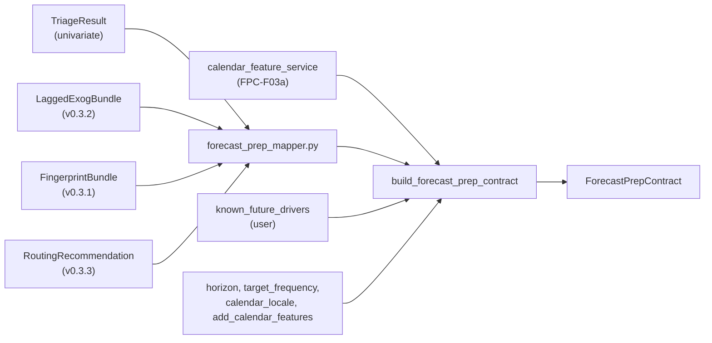
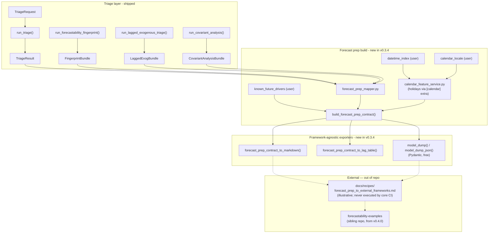

<!-- type: reference -->
# v0.3.4 — Forecast Prep Contract: Ultimate Release Plan

**Plan type:** Actionable release plan — neutral, framework-agnostic hand-off contract from triage to downstream forecasting frameworks
**Audience:** Maintainer, reviewer, statistician reviewer, downstream-framework user, Jr. developer
**Target release:** `0.3.4` — **headline release**, ships second in the 0.3.3 → 0.3.4 → 0.3.5 → 0.4.0 chain
**Current released version:** `0.3.3`
**Branch:** `feat/v0.3.4-forecast-prep-contract`
**Status:** Draft / Proposed
**Last reviewed:** 2026-04-24

> [!IMPORTANT]
> **Scope (binding).** This release ships the `ForecastPrepContract` and
> framework-agnostic exporters only. It does **not** ship `to_darts_spec`,
> `to_mlforecast_spec`, `fit_darts`, `fit_mlforecast`, `[darts]` /
> `[mlforecast]` optional extras, or any new walkthrough notebook. Framework
> mappings live as illustrative recipes in `docs/recipes/**` and (from
> v0.4.0) in the sibling `forecastability-examples` repository. Driver
> document: [aux_documents/developer_instruction_repo_scope.md](aux_documents/developer_instruction_repo_scope.md).
> The original draft (with framework runners and optional extras) is
> preserved for traceability at
> [aux_documents/v0_3_4_forecast_prep_contract_ultimate_plan.md](aux_documents/v0_3_4_forecast_prep_contract_ultimate_plan.md).

> [!NOTE]
> **Cross-release ordering.** Depends on the calibrated `confidence_label`
> and `RoutingValidationBundle` shipped in v0.3.3. The v0.3.5 documentation
> hardening pass ships **after** this release so it can cover the new
> `ForecastPrepContract`, the framework-agnostic exporters, the recipes
> page, and Invariant E (no framework runtime imports) in a single sweep.
> The v0.4.0 release performs the notebook-out / library-first split.

**Companion refs:**

- [v0.3.0 Covariant Informative: Ultimate Release Plan](implemented/v0_3_0_covariant_informative_ultimate_plan.md)
- [v0.3.1 Forecastability Fingerprint & Model Routing: Ultimate Release Plan](implemented/v0_3_1_forecastability_fingerprint_model_routing_plan.md)
- [v0.3.2 Lagged-Exogenous Triage: Ultimate Release Plan](implemented/v0_3_2_lagged_exogenous_triage_ultimate_plan.md)
- [v0.3.3 Routing Validation & Benchmark Hardening: Ultimate Release Plan](v0_3_3_routing_validation_benchmark_hardening_plan.md) — ships first
- [v0.3.5 Documentation Quality Improvement: Ultimate Release Plan](v0_3_5_documentation_quality_improvement_ultimate_plan.md) — ships after
- [v0.4.0 Examples Repository Split: Ultimate Release Plan](v0_4_0_examples_repo_split_ultimate_plan.md) — ships last
- [aux_documents/developer_instruction_repo_scope.md](aux_documents/developer_instruction_repo_scope.md) — driver document

**Builds on:**

- implemented `0.3.0` covariant triage gate, `cross_ami`, `cross_pami`, `te`,
  `gcmi`, `pcmci`, `pcmci_ami`, `CovariantAnalysisBundle`,
  `lagged_exog_conditioning` metadata
- implemented `0.3.1` univariate fingerprint, AMI Information Geometry
  engine, routing service, `RoutingRecommendation`, `FingerprintBundle`
- implemented `0.3.2` `LaggedExogBundle`, `LaggedExogSelectionRow` with
  `selected_for_tensor` flag, `tensor_role ∈ {diagnostic, predictive,
  known_future}`, `xami_sparse` sparse selector, known-future opt-in
- v0.3.3 widened `RoutingConfidenceLabel = Literal["high", "medium", "low",
  "abstain"]`, `RoutingValidationBundle` for release-time policy validation
- existing `TriageRequest`, `run_triage`, `TriageResult` univariate facade
  and `run_covariant_analysis` covariant facade
- existing `pyproject.toml` `[project.optional-dependencies]` block (already
  hosts `agent`, `causal`, `transport` extras) — pattern reused for the
  new `calendar` extra only

---

## 1. Why this plan exists

After triage, a covariant analysis, a fingerprint, and a sparse lag map, the
package answers every diagnostic question a user asks. It does **not** answer
the next question they always ask:

> "Fine. What do I actually pass into Darts, MLForecast, or any other
> downstream framework?"

`0.3.4` is the headline release that closes that gap **without coupling the
core package to any forecasting framework**. It introduces a single
**neutral, deterministic, additive hand-off contract** — `ForecastPrepContract`
— that converts triage outputs into structured, machine-readable downstream
forecasting guidance. The contract is consumed externally:

- through standard Pydantic exports (`model_dump()`, `model_dump_json()`);
- through framework-agnostic helpers shipped in this release
  (`forecast_prep_contract_to_markdown()`,
  `forecast_prep_contract_to_lag_table()`);
- through illustrative external recipes in `docs/recipes/**` that show how a
  user could translate the contract into Darts, MLForecast, or
  Nixtla / StatsForecast configuration in their own code.

> [!IMPORTANT]
> The Forecast Prep Contract is a **hand-off boundary**, not a model trainer
> and not a framework adapter. The repository scope directive
> ([aux_documents/developer_instruction_repo_scope.md](aux_documents/developer_instruction_repo_scope.md))
> forbids first-class framework integrations in the core package. Every
> `recommended_*` field in the contract is paired with a `confidence_label`
> and `caution_flags` so that downstream consumers can make informed
> model-family decisions, not blind model-fitting calls.

This release also closes a long-standing user-experience gap: deterministic
**calendar feature generation**. When the user enables `add_calendar_features`
(default `True`), the contract injects a stable, deterministically named set
of calendar covariates (`dayofweek`, `month`, `quarter`, `is_weekend`,
`is_business_day`, optional `is_holiday`) into `future_covariates`. This is
the single most common manual step every user re-implements; centralising it
inside the contract removes a major source of inconsistency. The optional
`holidays` package ships behind a `[calendar]` extra — the only new optional
extra in this release.

### Planning principles

| Principle | Implication |
| --- | --- |
| Framework-agnostic core | The core package never imports `darts`, `mlforecast`, `statsforecast`, or `nixtla` in any tier (runtime, optional extras, dev, CI). |
| Stop at the contract boundary | The contract and its exports are the public hand-off surface. Framework-specific code lives in `docs/recipes/**` (illustrative) and (from v0.4.0) in the sibling `forecastability-examples` repository. |
| Three input axes are first-class | Univariate target lags, lagged exogenous covariates, known-future covariates each get explicit treatment. |
| Calendar features are deterministic | Stable naming scheme `_calendar__<feature>`; holiday calendars require explicit locale opt-in **and** the `[calendar]` optional extra. |
| Distinguish evidence from recommendation | `recommended_*` fields are conservative; richer diagnostic fields stay separate. |
| Hexagonal + SOLID | Mapper service in `services/`; contract builder in `use_cases/`; framework-agnostic export helpers in `services/forecast_prep_export.py`. No `integrations/` directory is introduced. |
| Additive only | Existing public symbols and Pydantic field shapes are preserved. |
| Honest semantics | Blocked / weak / abstaining triage results yield conservative empty contracts, not aspirational ones. |
| Respect v0.3.2 contracts exactly | Past-covariate lags come from `selected_for_tensor=True` rows only; future-covariate lags may include `lag=0` only for `known_future` rows. |
| No new notebook in core | The originally-planned `05_forecast_prep_to_models.ipynb` is **not** committed in this release; it is created in the sibling examples repo in v0.4.0. |

### Reviewer acceptance block

`0.3.4` is successful only if all of the following are visible together:

1. **Neutral core contract**
   - `ForecastPrepContract`, `LagRecommendation`, `CovariateRecommendation`,
     `FamilyRecommendation`, `ForecastPrepBundle` exist as frozen Pydantic
     models with stable field names and explicit `Field(...)` descriptions
   - `contract_version` field is set to `"0.3.4"` and is part of the schema
2. **Builder**
   - `build_forecast_prep_contract(triage_result, *, horizon, target_frequency, ...)`
     returns a `ForecastPrepContract`
   - blocked or abstaining inputs yield conservative empty
     `recommended_target_lags` and an explicit `caution_flags` entry
   - the function never imports any forecasting framework
3. **Three input axes**
   - **Univariate target lags** are mapped from `primary_lags` and the
     fingerprint
   - **Lagged exogenous covariates** are mapped from
     `LaggedExogSelectionRow.selected_for_tensor=True` rows only
   - **Known-future covariates** combine user-supplied `known_future_drivers`
     with auto-generated calendar features
4. **Calendar features**
   - `add_calendar_features: bool = True` injects deterministically named
     features (`_calendar__dayofweek`, etc.)
   - `calendar_locale: str | None = None` enables holiday features only when
     set and only when the optional `[calendar]` extra is installed
5. **Framework-agnostic exporters**
   - `ForecastPrepContract.model_dump()` and
     `ForecastPrepContract.model_dump_json(indent=2)` are documented as the
     canonical Python-dict and JSON export surfaces
   - `forecast_prep_contract_to_markdown(contract)` returns a stable,
     deterministic, human- and LLM-readable summary
   - `forecast_prep_contract_to_lag_table(contract)` returns a deterministic
     list of `(driver, role, lag, selected_for_handoff, rationale)` rows
   - none of the exporters import any forecasting framework
   - **no** `to_darts_spec`, `to_mlforecast_spec`, `fit_darts`,
     `fit_mlforecast`, or `forecastability.integrations.*` symbol exists in
     the source tree
6. **External recipes documentation**
   - `docs/recipes/forecast_prep_to_external_frameworks.md` exists with three
     illustrative mappings (Darts, MLForecast, Nixtla / StatsForecast) and a
     "Why these are recipes, not adapters" section linking to the scope
     directive
   - every framework-specific snippet is fenced and prefixed with the
     illustrative-recipe disclaimer; **no** code on the page is executed by
     core CI
7. **Showcase script**
   - `scripts/run_showcase_forecast_prep.py` runs end-to-end on a clean
     install in `--smoke` mode without any framework dependency
   - the script writes JSON, markdown, and lag-table artifacts to
     `outputs/reports/forecast_prep/`
8. **Optional extras**
   - `pyproject.toml` `[project.optional-dependencies]` adds **only** a
     `calendar` extra (`holidays>=0.50`)
   - **no** `[darts]`, `[mlforecast]`, `[statsforecast]`, or `[nixtla]`
     extras are added
9. **Documentation**
   - `docs/forecast_prep_contract.md` documents the contract and its three
     input axes, the schema-evolution policy, and the export helpers
   - the recipes page from item 6 is linked from
     `docs/forecast_prep_contract.md` and from the README "Hand-off after
     triage" subsection
   - `README.md` install section documents the new `[calendar]` extra and
     does **not** mention any framework extra
   - `CHANGELOG.md` `0.3.4` entry explicitly notes that the package remains
     framework-agnostic and that framework recipes ship as documentation only
10. **Release engineering**
    - version is bumped to `0.3.4` across `pyproject.toml`,
      `src/forecastability/__init__.py`, `CHANGELOG.md`, `README.md`
    - all fixture rebuild scripts have been re-run and committed
    - the git tag `v0.3.4` is created and pushed
    - the published wheel contains zero imports of `darts`, `mlforecast`,
      `statsforecast`, or `nixtla`

---

## 2. Theory-to-code map — formal contract semantics

> [!IMPORTANT]
> Every junior developer MUST read this section before writing any code.
> The contract is small in math but high in semantic risk: a wrong lag-role
> mapping or a wrong known-future predicate will silently leak future
> information into past-covariate slots when the user later wires the
> contract into their downstream framework.

### 2.1. The three input axes

Define the input space of any tabular forecasting model as the disjoint union
of three axes:

$$\mathcal{X} = \mathcal{X}_{\text{target-lag}} \sqcup \mathcal{X}_{\text{past-cov}} \sqcup \mathcal{X}_{\text{future-cov}}$$

where:

- $\mathcal{X}_{\text{target-lag}}$ — past values $Y_{t-k}$ of the target itself
  for $k \in \{1, 2, \ldots\}$, derived from `primary_lags` and the fingerprint;
- $\mathcal{X}_{\text{past-cov}}$ — past values $X_{j, t-k}$ of exogenous
  drivers for $k \ge 1$, derived from
  `LaggedExogSelectionRow.selected_for_tensor=True` rows;
- $\mathcal{X}_{\text{future-cov}}$ — values $Z_{m, t+h}$ of covariates that
  are known at prediction time for the entire horizon $h \in \{0, 1, \ldots,
  H-1\}$, derived from explicit user-declared known-future drivers plus
  auto-generated calendar features.

> [!IMPORTANT]
> $\mathcal{X}_{\text{past-cov}}$ and $\mathcal{X}_{\text{future-cov}}$ are
> **disjoint by construction**. A driver column may appear in at most one of
> them. This is enforced by the builder: a column declared in
> `known_future_drivers` is removed from past-covariate selection before the
> contract is emitted.

### 2.2. The known-future eligibility predicate

A covariate column $c$ is eligible for $\mathcal{X}_{\text{future-cov}}$ if and
only if:

$$\text{KnownFuture}(c) \iff \big( c \in K \big) \lor \big( c \in C_{\text{cal}} \land \texttt{add\_calendar\_features} \big)$$

where:

- $K$ — the set of column names supplied by the user via
  `known_future_drivers: dict[str, bool]` (only entries with value `True`
  are considered known-future);
- $C_{\text{cal}}$ — the deterministically generated calendar feature set
  $\{\texttt{\_calendar\_\_dayofweek}, \texttt{\_calendar\_\_month},
  \texttt{\_calendar\_\_quarter}, \texttt{\_calendar\_\_is\_weekend},
  \texttt{\_calendar\_\_is\_business\_day}, \texttt{\_calendar\_\_is\_holiday}\}$
  (the last is included only when `calendar_locale` is set and the optional
  `holidays` package is importable).

> [!NOTE]
> A column appearing in `LaggedExogSelectionRow.selected_for_tensor=True` rows
> is **not** known-future by default. Past-data informativeness is necessary
> but not sufficient for known-future eligibility. The user owns the
> contractual claim; the toolkit verifies it is at least syntactically
> consistent.

### 2.3. The past-covariate lag set predicate

For each driver $c \in \mathcal{X}_{\text{past-cov}}$ the contract carries a
sparse lag set $L_{\text{past}}(c) \subseteq \{1, 2, \ldots, K_{\max}\}$
defined exactly as:

$$L_{\text{past}}(c) = \{k : \exists \text{ row } r \in \texttt{LaggedExogBundle.selected\_lags} \text{ with } r.\text{driver}=c, r.\text{lag}=k, r.\text{selected\_for\_tensor}=\text{True}, r.\text{lag} \ge 1\}$$

> [!IMPORTANT]
> The `r.lag >= 1` constraint is non-redundant. The `xami_sparse` selector in
> v0.3.2 already enforces `min_lag >= 1`, but the contract builder MUST
> double-check this invariant defensively because future selectors registered
> under different `selector_name` literals may relax it. Cross-reference:
> [v0.3.2 plan §2.1](implemented/v0_3_2_lagged_exogenous_triage_ultimate_plan.md).

### 2.4. The future-covariate lag set predicate

For each driver $c \in \mathcal{X}_{\text{future-cov}}$ the contract carries a
lag set $L_{\text{future}}(c) \subseteq \{0, 1, \ldots, H-1\}$ where $H$ is the
forecast horizon. The default behavior is:

$$L_{\text{future}}(c) = \begin{cases} \{0\} & \text{if } c \in C_{\text{cal}} \\ \{0\} \cup \text{user-supplied lags or default } \{0\} & \text{if } c \in K \end{cases}$$

> [!IMPORTANT]
> Future-covariate `lag = 0` is **only** allowed for columns in $C_{\text{cal}}$
> or $K$. Any other column that appears with `selected_lags` containing `0`
> on a `role = "future"` row is a contract bug; the builder must raise
> `ValueError` before returning. The recipes page (FPC-D04R) repeats this
> invariant for users translating the contract into framework configuration.

### 2.5. Confidence propagation from routing to contract

The contract's `confidence_label` field is a direct copy of
`RoutingRecommendation.confidence_label` from v0.3.3. The propagation rule is:

| `RoutingRecommendation.confidence_label` (v0.3.3) | `ForecastPrepContract.confidence_label` | Effect on `recommended_families` |
| --- | --- | --- |
| `high` | `high` | full `recommended_families` from routing |
| `medium` | `medium` | full `recommended_families`, plus baseline families |
| `low` | `low` | only top-1 routing family + baselines |
| `abstain` | `abstain` | `recommended_families` is empty; `baseline_families` only |

When the upstream `TriageResult.blocked` is true, the contract overrides the
routing label entirely and emits `confidence_label = "abstain"` regardless of
what routing reported. Blocked triages produce conservative empty contracts
with explicit `caution_flags`.

### 2.6. Calendar feature generation — formal naming and source

For a `pandas.DatetimeIndex` $T = (t_0, t_1, \ldots, t_{N-1})$, the calendar
feature generator emits the following columns when
`add_calendar_features=True`:

| Column name | Type | Source |
| --- | --- | --- |
| `_calendar__dayofweek` | `int8` (0=Monday) | `T.dayofweek` |
| `_calendar__month` | `int8` (1-12) | `T.month` |
| `_calendar__quarter` | `int8` (1-4) | `T.quarter` |
| `_calendar__is_weekend` | `bool` | `T.dayofweek.isin([5, 6])` |
| `_calendar__is_business_day` | `bool` | `pd.bdate_range`-derived |
| `_calendar__is_holiday` | `bool` | `holidays` package, locale `calendar_locale`, only when both set |

The naming scheme `_calendar__<feature>` is **stable**. Users may rename the
columns afterward; the export helpers never strip the prefix.

> [!NOTE]
> When `calendar_locale` is set but the `holidays` package is not installed,
> the builder skips `_calendar__is_holiday` silently and emits a single entry
> in `caution_flags`: `"calendar_locale_set_but_holidays_unavailable"`.
> This avoids surprising the user with a missing column at the recipe page.

### 2.7. Cross-reference to v0.3.2 invariants

The Forecast Prep Contract preserves three v0.3.2 contracts exactly:

1. **`tensor_role` mirrors `lag_role`.** A `lag_role = "instant"` row may have
   `tensor_role = "diagnostic"` (default) or `"known_future"` (opt-in). It
   never has `tensor_role = "predictive"`.
2. **`selected_for_tensor=True` is the only legitimate source of past-covariate
   lags.** No other row may enter $L_{\text{past}}$.
3. **`cross_pami` semantics are not relabeled.** The contract reads
   `LaggedExogSelectionRow.selector_name` and never silently assumes
   `cross_pami` is fully conditioned.

---

## 3. Repo baseline — what already exists

| Layer | Module | What it provides | Status |
| --- | --- | --- | --- |
| **Types** | `src/forecastability/utils/types.py` | `TriageRequest`, `TriageResult`, `Readiness`, `FingerprintBundle`, `RoutingRecommendation`, `RoutingConfidenceLabel`, `LaggedExogBundle`, `LaggedExogSelectionRow`, `LaggedExogProfileRow`, `CovariantAnalysisBundle`, `RoutingValidationBundle` (from v0.3.3) | Stable |
| **Use cases** | `src/forecastability/use_cases/run_triage.py` | univariate triage facade | Stable |
| **Use cases** | `src/forecastability/use_cases/run_covariant_analysis.py` | covariant facade | Stable |
| **Use cases** | `src/forecastability/use_cases/run_lagged_exogenous_triage.py` | lagged-exogenous facade | Stable |
| **Use cases** | `src/forecastability/use_cases/run_forecastability_fingerprint.py` | univariate fingerprint facade | Stable |
| **Services** | `src/forecastability/services/routing_service.py` | rule-based routing | Stable |
| **Adapters** | `src/forecastability/adapters/cli.py`, `adapters/dashboard.py` | CLI + dashboard surfaces | Stable |
| **Reporting** | `src/forecastability/reporting/` (if present) | report emitters | Stable |
| **Examples** | `examples/forecast_prep/` | empty so far; will host new public examples | New |
| **Walkthroughs** | `notebooks/walkthroughs/{00..04}_*.ipynb` | shipped walkthroughs | Stable; carry the v0.3.5 transition banner; removed in v0.4.0 |
| **CI** | `.github/workflows/{ci,smoke,publish-pypi,release}.yml`, `.github/ISSUE_TEMPLATE/release_checklist.md`, `scripts/check_notebook_contract.py`, `scripts/check_docs_contract.py` (v0.3.5) | release hygiene baseline | Stable |
| **Optional extras precedent** | `pyproject.toml` `[project.optional-dependencies]` already hosts `agent`, `causal`, `transport` | demonstrates the additive extra pattern; reused only for the new `calendar` extra in this release | Stable |
| **Docs** | `docs/quickstart.md`, `docs/public_api.md`, `docs/surface_guide.md`, `docs/wording_policy.md` (v0.3.5 single source of truth) | user-facing surface | Stable |

---

## 4. Feature inventory and overlap assessment

| ID | Feature | Phase | Overlap with existing | Genuine new work | Status |
| --- | --- | ---: | --- | --- | --- |
| FPC-F00 | Typed contract result models | 0 | Extends `utils/types.py` patterns | `ForecastPrepContract`, `LagRecommendation`, `CovariateRecommendation`, `FamilyRecommendation`, `ForecastPrepBundle` | Done |
| FPC-F00.1 | `contract_version` field and schema-evolution policy | 0 | New | additive `contract_version: str` with documented evolution rules | Done |
| FPC-F01 | Univariate contract builder | 1 | Builds on `TriageResult` | `use_cases/build_forecast_prep_contract.py`, `services/forecast_prep_mapper.py` | Done |
| FPC-F02 | Covariate-aware builder extension | 1 | Builds on `LaggedExogBundle`, `CovariantAnalysisBundle` | covariate role inference + sparse-lag mapping | Done |
| FPC-F03 | Seasonality extraction rules | 1 | Builds on fingerprint | seasonal-period candidate vs recommended split | Done |
| FPC-F03a | Calendar feature auto-generation | 1 | New | `services/calendar_feature_service.py` with deterministic naming | Done |
| FPC-F03b | Holiday calendar opt-in | 1 | New | `holidays` soft dependency behind `calendar_locale`, gated by the new `[calendar]` extra | Done |
| FPC-F04R | Framework-agnostic exporters | 2 | New | `services/forecast_prep_export.py::forecast_prep_contract_to_markdown()`, `forecast_prep_contract_to_lag_table()`; documented use of Pydantic `model_dump()` / `model_dump_json()` | Proposed |
| FPC-F08 | Public examples | 3 | Follows existing examples taxonomy | `examples/forecast_prep/{minimal_contract,calendar_features,known_future,export_payloads}.py` | Proposed |
| FPC-F08.1 | Showcase script | 3 | Mirrors existing showcase scripts | `scripts/run_showcase_forecast_prep.py` with `--smoke` flag (no `--with-runners`) | Proposed |
| FPC-F10 | Contract tests | 4 | Extends current test discipline | builder, exporter, three-axis, calendar, blocked-state cases | Proposed |
| FPC-F11 | Regression fixtures | 4 | Follows current fixture discipline | `docs/fixtures/forecast_prep_regression/expected/` + rebuild script | Proposed |
| FPC-CI-01 | Forecast prep smoke job | 5 | Extends `.github/workflows/smoke.yml` | run showcase script in `--smoke` mode (no extras) | Proposed |
| FPC-CI-04 | Release checklist hardening | 5 | Extends `.github/ISSUE_TEMPLATE/release_checklist.md` | fixture verify, recipes-page presence, no-framework-imports check | Proposed |
| FPC-D01 | Theory / contract doc | 6 | New docs page | `docs/forecast_prep_contract.md` covering §2 in plain language | Proposed |
| FPC-D02 | README / quickstart / public API update | 6 | Extends user-facing docs | document contract, `[calendar]` extra, calendar features, framework-agnostic exporters | Proposed |
| FPC-D03 | Changelog and release notes | 6 | Release docs | additive contract surface; explicit "framework-agnostic" framing | Proposed |
| FPC-D04R | External recipes documentation page | 6 | New docs page (replaces dropped framework specs/runners) | `docs/recipes/forecast_prep_to_external_frameworks.md` with Darts / MLForecast / Nixtla illustrative mappings | Proposed |
| FPC-R01 | Version bump and tag | 6 | Release engineering | bump to `0.3.4`, tag `v0.3.4`, push | Proposed |
| FPC-R03 | Fixture rebuild verification | 6 | Release engineering | every `rebuild_*` script runs clean | Proposed |

> [!NOTE]
> **Items dropped from the original draft.** `FPC-F04` (`to_mlforecast_spec`),
> `FPC-F05` (`to_darts_spec`), `FPC-F05.1` (exporter warnings on framework
> wording), `FPC-F06` (`fit_mlforecast`), `FPC-F07` (`fit_darts`),
> `FPC-F07.1` (`[darts]` / `[mlforecast]` extras + CI matrix), `FPC-F09`
> (walkthrough notebook), `FPC-F10.1` (runner tests), `FPC-CI-02` (extras
> matrix), and `FPC-CI-03` (notebook contract extension for the new
> walkthrough), `FPC-R02` (walkthrough commit) are **not in scope** for this
> release. Their replacement surfaces are: `FPC-F04R` (framework-agnostic
> exporters) and `FPC-D04R` (recipes page). Framework-coupled walkthroughs
> are introduced in the sibling examples repository in
> [v0.4.0](v0_4_0_examples_repo_split_ultimate_plan.md), not here.

---

## 5. Domain contracts — MANDATORY FIRST STEP

### 5.1. Typed result models

**File:** `src/forecastability/utils/types.py` (additive only)

```python
from typing import Literal

from pydantic import BaseModel, ConfigDict, Field, field_validator

ForecastPrepLagRole = Literal["direct", "seasonal", "secondary", "excluded"]
ForecastPrepCovariateRole = Literal["past", "future", "static", "rejected"]
ForecastPrepConfidence = Literal["low", "medium", "high"]
ForecastPrepFamilyTier = Literal["baseline", "preferred", "fallback"]
# Mirrors v0.3.3 RoutingConfidenceLabel additively.
ForecastPrepContractConfidence = Literal["high", "medium", "low", "abstain"]


class LagRecommendation(BaseModel):
    """One recommended (or excluded) target lag with rationale."""

    model_config = ConfigDict(frozen=True)

    lag: int = Field(ge=1, description="Strictly positive lag of the target.")
    role: ForecastPrepLagRole
    confidence: ForecastPrepConfidence
    selected_for_handoff: bool
    rationale: str


class CovariateRecommendation(BaseModel):
    """One recommended (or rejected) covariate with role and rationale."""

    model_config = ConfigDict(frozen=True)

    name: str
    role: ForecastPrepCovariateRole
    confidence: ForecastPrepConfidence
    informative: bool
    future_known_required: bool = Field(
        description=(
            "True only when role == 'future'. Indicates the user contractually "
            "guarantees this column is observable for the entire horizon."
        ),
    )
    selected_lags: list[int] = Field(
        default_factory=list,
        description=(
            "For role='past': sparse predictive lags (>= 1). "
            "For role='future': horizon-relative lags (>= 0)."
        ),
    )
    rationale: str


class FamilyRecommendation(BaseModel):
    """One recommended model family with tier and rationale."""

    model_config = ConfigDict(frozen=True)

    family: str
    tier: ForecastPrepFamilyTier
    rationale: str


class ForecastPrepContract(BaseModel):
    """Neutral, deterministic, additive hand-off contract for downstream forecasting.

    See plan v0.3.4 §2 for the formal semantics of the three input axes.
    Field names are stable and additive-only. The contract is consumed
    externally via Pydantic ``model_dump()`` / ``model_dump_json()`` and via
    the framework-agnostic exporters in
    ``forecastability.services.forecast_prep_export``.
    """

    model_config = ConfigDict(frozen=True)

    contract_version: str = Field(
        default="0.3.4",
        description="Schema version. Additive field changes do not bump this.",
    )
    source_goal: Literal["univariate", "covariant", "lagged_exogenous"]
    blocked: bool = Field(
        description="Mirrors TriageResult.blocked. True yields conservative empties.",
    )
    readiness_status: str
    forecastability_class: str | None = None
    confidence_label: ForecastPrepContractConfidence = "medium"
    target_frequency: str | None = None
    horizon: int | None = Field(default=None, ge=1)
    recommended_target_lags: list[int] = Field(default_factory=list)
    recommended_seasonal_lags: list[int] = Field(default_factory=list)
    excluded_target_lags: list[int] = Field(default_factory=list)
    lag_rationale: list[str] = Field(default_factory=list)
    candidate_seasonal_periods: list[int] = Field(default_factory=list)
    recommended_families: list[str] = Field(default_factory=list)
    baseline_families: list[str] = Field(default_factory=list)
    past_covariates: list[str] = Field(default_factory=list)
    future_covariates: list[str] = Field(default_factory=list)
    static_features: list[str] = Field(default_factory=list)
    rejected_covariates: list[str] = Field(default_factory=list)
    covariate_notes: list[str] = Field(default_factory=list)
    transformation_hints: list[str] = Field(default_factory=list)
    caution_flags: list[str] = Field(default_factory=list)
    downstream_notes: list[str] = Field(default_factory=list)
    calendar_features: list[str] = Field(
        default_factory=list,
        description=(
            "Subset of future_covariates that were auto-generated by the "
            "calendar feature service. All entries start with '_calendar__'."
        ),
    )
    calendar_locale: str | None = None
    metadata: dict[str, str | int | float] = Field(default_factory=dict)

    @field_validator("recommended_target_lags", "excluded_target_lags")
    @classmethod
    def _strictly_positive_target_lags(cls, value: list[int]) -> list[int]:
        if any(k < 1 for k in value):
            raise ValueError("Target lags must all be >= 1.")
        return value

    @field_validator("calendar_features")
    @classmethod
    def _calendar_features_have_prefix(cls, value: list[str]) -> list[str]:
        for name in value:
            if not name.startswith("_calendar__"):
                raise ValueError(
                    f"Calendar feature {name!r} must start with '_calendar__'."
                )
        return value


class ForecastPrepBundle(BaseModel):
    """Richer contract bundle carrying the typed rows alongside the compact contract."""

    model_config = ConfigDict(frozen=True)

    contract: ForecastPrepContract
    lag_rows: list[LagRecommendation] = Field(default_factory=list)
    covariate_rows: list[CovariateRecommendation] = Field(default_factory=list)
    family_rows: list[FamilyRecommendation] = Field(default_factory=list)
    metadata: dict[str, str | int | float] = Field(default_factory=dict)
```

### 5.2. Boundary rules

- The compact `ForecastPrepContract` is the **public** hand-off surface. It is
  re-exported from `forecastability` and `forecastability.triage`.
- The `ForecastPrepBundle` is the **rich** advanced surface. It is re-exported
  from `forecastability.triage` only (not from the top-level facade).
- The framework-agnostic exporters
  (`forecast_prep_contract_to_markdown`, `forecast_prep_contract_to_lag_table`)
  operate on `ForecastPrepContract` only. Bundle consumers may call them on
  `bundle.contract`.
- The mapper service (`services/forecast_prep_mapper.py`) is pure: it takes
  triage outputs and returns typed rows. It does not import any forecasting
  framework.
- The builder use case (`use_cases/build_forecast_prep_contract.py`) composes
  the mapper + the calendar service + the rationale writer. It never imports
  `darts`, `mlforecast`, `statsforecast`, or `nixtla`.
- **No `forecastability.integrations` package is created in this release.**
  The reviewer scope directive
  ([aux_documents/developer_instruction_repo_scope.md](aux_documents/developer_instruction_repo_scope.md))
  forbids the `integrations/` namespace as a vehicle for first-class
  framework adapters; framework code lives in `docs/recipes/**` and (from
  v0.4.0) in the sibling examples repository.

### 5.3. Acceptance criteria

- typed models importable from
  - `forecastability` (compact contract + builder + framework-agnostic exporters)
  - `forecastability.triage` (compact contract + builder + bundle + framework-agnostic exporters)
- categorical fields use closed `Literal` labels
- `recommended_target_lags` strictly positive; field validator enforces this
- calendar feature names start with `_calendar__`; field validator enforces
  this
- JSON serialisation of `ForecastPrepContract` is stable across reruns
- `contract_version` is `"0.3.4"` for this release; future additive changes
  do not bump it; only field renames or removals would
- `grep -rn "import darts\|from darts\|import mlforecast\|from mlforecast\|import statsforecast\|from statsforecast\|import nixtla\|from nixtla" src/`
  returns zero hits

---

## 6. The three input axes — explicit treatment

> [!IMPORTANT]
> Each axis has its own subsection, mapping rules, and acceptance criteria.
> A junior developer should be able to read this section and produce a correct
> mapping without reading the rest of the plan.

### 6.1. Axis A — Univariate target lags

**Source.** `TriageResult.summary.primary_lags` (existing surface) plus any
fingerprint information that exposes structural lag candidates.

**Mapping rules.**

1. Filter `primary_lags` to retain only $k \ge 1$.
2. Classify each retained lag using the fingerprint:
   - if the lag matches a candidate seasonal period
     ($k \in \texttt{candidate\_seasonal\_periods}$), set
     `LagRecommendation.role = "seasonal"`
   - if the lag is the strongest non-seasonal lag, set
     `role = "direct"`
   - otherwise set `role = "secondary"`
3. Set `selected_for_handoff = True` for `direct` and `seasonal` lags;
   `secondary` lags default to `False` unless `confidence_label = "high"`.
4. Diagnostically interesting lags that did not enter `primary_lags` may be
   recorded as `role = "excluded"` with `selected_for_handoff = False`.

**Population of contract fields.**

- `recommended_target_lags` ← lags with `selected_for_handoff = True` and
  `role ∈ {"direct", "secondary"}`
- `recommended_seasonal_lags` ← lags with `selected_for_handoff = True` and
  `role = "seasonal"`
- `excluded_target_lags` ← lags with `role = "excluded"`
- `lag_rationale` ← human-readable string per included or excluded lag

**Acceptance criteria.**

- a strong univariate input (`AirPassengers` archetype) yields a non-empty
  `recommended_target_lags` and a non-empty `recommended_seasonal_lags`
- a `blocked` triage yields empty `recommended_target_lags` and exactly one
  entry in `caution_flags` containing the substring `"blocked"`
- an `abstain` confidence yields empty `recommended_families` (per §2.5) but
  may still emit `recommended_target_lags` if the readiness path was clean

### 6.2. Axis B — Lagged exogenous covariates

**Source.** `LaggedExogBundle.selected_lags` from
`run_lagged_exogenous_triage()` (v0.3.2). Only rows with
`selected_for_tensor=True` and `lag >= 1` enter this axis.

**Mapping rules.**

1. Group `LaggedExogSelectionRow` rows by `driver`.
2. For each driver $c$, define
   $L_{\text{past}}(c) = \{r.\text{lag} : r.\text{driver}=c, r.\text{selected\_for\_tensor}=\text{True}, r.\text{lag} \ge 1\}$
   per §2.3.
3. Skip drivers with $L_{\text{past}}(c) = \emptyset$.
4. If $c \in K$ (user's `known_future_drivers`), the driver moves to
   Axis C and is **not** included in past covariates.
5. Emit a `CovariateRecommendation` with:
   - `name = c`
   - `role = "past"`
   - `selected_lags = sorted(L_past(c))`
   - `informative = True`
   - `future_known_required = False`
   - `confidence` derived from the routing label by the same propagation
     rule as §2.5

**Population of contract fields.**

- `past_covariates` ← driver names with `role = "past"`
- `covariate_notes` ← one entry per past covariate with the lag set written
  out

**Acceptance criteria.**

- the `direct_lag2` driver from the v0.3.2 panel produces a past covariate
  with `selected_lags = [2]`
- the `instant_only` driver (no opt-in) does **not** appear in
  `past_covariates`
- a driver appearing in both the lagged-exog selection and
  `known_future_drivers` appears only in `future_covariates` (Axis C)

### 6.3. Axis C — Known-future covariates

**Source.** Two-channel input:

1. user-supplied `known_future_drivers: dict[str, bool]` (only entries with
   value `True` are honored)
2. auto-generated calendar features when `add_calendar_features=True`

**Mapping rules.**

1. Compute the candidate set
   $\text{KF}_{\text{candidate}} = \{c : K[c] = \text{True}\} \cup C_{\text{cal}}$.
2. For each $c \in \text{KF}_{\text{candidate}}$:
   - emit a `CovariateRecommendation` with
     `role = "future"`,
     `future_known_required = True`,
     `selected_lags = [0]` by default
   - if $c \in C_{\text{cal}}$, append the column name to
     `ForecastPrepContract.calendar_features` and set
     `confidence = "high"` (calendar features are deterministically correct)
   - if $c \in K$ but $c \notin C_{\text{cal}}$,
     `confidence` mirrors the upstream routing label

**Population of contract fields.**

- `future_covariates` ← every `CovariateRecommendation` with `role = "future"`
- `calendar_features` ← the subset of `future_covariates` starting with
  `_calendar__`
- `calendar_locale` ← the user-supplied locale (or `None`)
- `caution_flags` ← single entry
  `"calendar_locale_set_but_holidays_unavailable"` when the locale is set but
  the `holidays` package is missing

**Acceptance criteria.**

- with `add_calendar_features=True` and `calendar_locale=None`, the contract
  emits at least the five locale-independent calendar columns
- with `add_calendar_features=True` and `calendar_locale="US"` and the
  `holidays` package installed, the contract additionally emits
  `_calendar__is_holiday`
- with `add_calendar_features=True` and `calendar_locale="US"` and the
  `holidays` package missing, the contract emits the five locale-independent
  columns plus exactly one entry in `caution_flags`
- with `add_calendar_features=False`, no `_calendar__*` column appears in
  `future_covariates`
- a column declared in `known_future_drivers` and also present in
  `LaggedExogBundle.selected_lags` appears only in `future_covariates`

---

## 7. Phased delivery

### Phase 0 — Domain contracts

#### FPC-F00 — Typed contract result models

**Goal.** Land the typed surface from §5.1.

**File targets:**

- `src/forecastability/utils/types.py`
- `src/forecastability/__init__.py` (additive re-export of
  `ForecastPrepContract`, `LagRecommendation`, `CovariateRecommendation`,
  `FamilyRecommendation`, `build_forecast_prep_contract`,
  `forecast_prep_contract_to_markdown`,
  `forecast_prep_contract_to_lag_table`)
- `src/forecastability/triage/__init__.py` (additive re-export of the same
  symbols plus `ForecastPrepBundle`)

**Acceptance criteria:**

- frozen typed models per §5.1
- field validators enforce the strictly-positive target lag rule and the
  `_calendar__` prefix rule
- imports resolve via both `from forecastability import ForecastPrepContract`
  and `from forecastability.triage import ForecastPrepBundle`
- v0.3.5 docs-contract `--imports` check passes
- v0.3.5 docs-contract `--no-framework-imports` check passes (no
  framework runtime import is introduced anywhere under `src/`)

#### FPC-F00.1 — `contract_version` field and schema-evolution policy

**Goal.** Document the schema-evolution rules.

**File targets:**

- `docs/forecast_prep_contract.md` (Phase 6)
- inline docstring on `ForecastPrepContract.contract_version`

**Schema evolution rules:**

- additive field changes (new optional field) do not bump `contract_version`
- field rename or removal bumps `contract_version` and ships in a new release
  with a migration entry in `CHANGELOG.md`
- `contract_version` is a string of the form `"<major>.<minor>.<patch>"`
  matching the package version that introduced the change

**Acceptance criteria:**

- the schema-evolution policy is documented exactly once, in
  `docs/forecast_prep_contract.md`

### Phase 1 — Build logic from deterministic outputs



#### FPC-F01 — Univariate contract builder

**File targets:**

- `src/forecastability/use_cases/build_forecast_prep_contract.py`
- `src/forecastability/services/forecast_prep_mapper.py`
- `tests/test_build_forecast_prep_contract.py`

**Implementation contract:**

```python
def build_forecast_prep_contract(
    triage_result: TriageResult,
    *,
    horizon: int | None = None,
    target_frequency: str | None = None,
    lagged_exog_bundle: LaggedExogBundle | None = None,
    fingerprint_bundle: FingerprintBundle | None = None,
    routing_recommendation: RoutingRecommendation | None = None,
    known_future_drivers: dict[str, bool] | None = None,
    add_calendar_features: bool = True,
    calendar_locale: str | None = None,
    datetime_index: pd.DatetimeIndex | None = None,
) -> ForecastPrepContract:
    """Build a ForecastPrepContract from deterministic triage outputs.

    Implements the three-axis mapping defined in plan v0.3.4 §6 and the
    confidence propagation rule in §2.5. When ``add_calendar_features`` is
    True and ``datetime_index`` is supplied, the builder injects the
    calendar columns defined in §2.6 into ``future_covariates``.

    The function is framework-agnostic: it never imports darts, mlforecast,
    statsforecast, or nixtla.

    Args:
        triage_result: Output of run_triage(). Determines blocked state and
            primary_lags.
        horizon: Forecast horizon in samples.
        target_frequency: Pandas-compatible frequency string (e.g. 'D', 'M').
        lagged_exog_bundle: Optional output of run_lagged_exogenous_triage().
            When provided, drives the past-covariate axis.
        fingerprint_bundle: Optional output of run_forecastability_fingerprint().
            When provided, drives seasonal classification.
        routing_recommendation: Optional explicit routing recommendation. If
            None, the contract reads it from fingerprint_bundle.recommendation.
        known_future_drivers: Optional dict {column_name: True} declaring
            which exogenous columns are known for the full horizon.
        add_calendar_features: When True (default), inject deterministic
            calendar columns into future_covariates per §6.3.
        calendar_locale: Locale string (e.g. 'US', 'PL') to enable holiday
            features. Requires the optional 'holidays' package shipped via
            the new `[calendar]` extra.
        datetime_index: Pandas DatetimeIndex aligned with the target series.
            Required for calendar feature generation; ignored otherwise.

    Returns:
        Frozen ForecastPrepContract.
    """
```

**Acceptance criteria:**

- works on univariate `run_triage` output
- `triage_result.blocked == True` ⇒ `contract.blocked == True`,
  `recommended_target_lags == []`, `recommended_families == []`,
  `caution_flags` contains a `"blocked"` entry
- when `routing_recommendation.confidence_label == "abstain"`,
  `contract.confidence_label == "abstain"` and
  `contract.recommended_families == []`
- the function never imports `darts`, `mlforecast`, `statsforecast`, or
  `nixtla`
- `datetime_index` is required for calendar feature generation; if missing
  while `add_calendar_features=True`, raises `ValueError` with an actionable
  message
- regression test freezes a contract for the §6 walkthrough scenario

#### FPC-F02 — Covariate-aware builder extension

**File targets:**

- same module as FPC-F01
- `tests/test_build_forecast_prep_contract_covariant.py`

**Acceptance criteria:**

- when `lagged_exog_bundle` is supplied, every driver with at least one
  `selected_for_tensor=True` row at `lag >= 1` appears in
  `past_covariates` with the correct `selected_lags`
- a driver appearing in both `lagged_exog_bundle.selected_lags` and
  `known_future_drivers` appears only in `future_covariates`
- the builder defensively re-checks the v0.3.2 invariant that
  past-covariate lags are strictly positive (per §2.3); raises `ValueError`
  on violation
- `cross_pami` selector rows never silently produce past covariates with
  `tensor_role = "predictive"` unless the row's `selected_for_tensor` is
  also `True`

#### FPC-F03 — Seasonality extraction rules

**File targets:**

- `src/forecastability/services/forecast_prep_mapper.py`
- `tests/test_forecast_prep_seasonality.py`

**Acceptance criteria:**

- `candidate_seasonal_periods` may be richer than `recommended_seasonal_lags`
- weekly-like structure on a daily series produces a `7` in
  `recommended_seasonal_lags` only when the fingerprint structure-stability
  exceeds the routing threshold
- noisy structure does not force fake seasonal recommendations

#### FPC-F03a — Calendar feature auto-generation

**File targets:**

- `src/forecastability/services/calendar_feature_service.py`
- `tests/test_calendar_feature_service.py`

**Implementation contract:**

```python
def generate_calendar_features(
    datetime_index: pd.DatetimeIndex,
    *,
    locale: str | None = None,
) -> pd.DataFrame:
    """Generate the deterministic calendar feature DataFrame per plan §2.6.

    Always emits:
        _calendar__dayofweek (int8, 0=Monday)
        _calendar__month (int8, 1-12)
        _calendar__quarter (int8, 1-4)
        _calendar__is_weekend (bool)
        _calendar__is_business_day (bool)

    When locale is not None and the optional 'holidays' package is
    installed (via the `[calendar]` extra), additionally emits:
        _calendar__is_holiday (bool)

    Args:
        datetime_index: Aligned pandas DatetimeIndex.
        locale: Optional ISO country code (e.g. 'US', 'PL', 'DE').

    Returns:
        DataFrame indexed by datetime_index with columns above.
    """
```

**Acceptance criteria:**

- column dtypes match §2.6 exactly
- output index is identical to input `datetime_index`
- when `locale` is set but `holidays` is not importable, the function
  returns the locale-independent columns and signals the missing-package
  state via a module-level `_HOLIDAYS_AVAILABLE` flag the builder reads
- deterministic across runs

#### FPC-F03b — Holiday calendar opt-in

**File targets:**

- `src/forecastability/services/calendar_feature_service.py`
- `pyproject.toml` (additive optional extra `calendar = ["holidays>=0.50"]`)

**Implementation notes — exact `pyproject.toml` snippet:**

```toml
[project.optional-dependencies]
agent = [
  "pydantic-ai>=0.2",
]
causal = [
  "tigramite>=5.2",
]
transport = [
  "fastapi>=0.115",
  "uvicorn[standard]>=0.32",
  "mcp>=1.0",
]
calendar = [
  "holidays>=0.50",
]
```

> [!IMPORTANT]
> No `darts`, `mlforecast`, `statsforecast`, or `nixtla` extras are added in
> this release. The reviewer scope directive forbids them in any tier.

**Acceptance criteria:**

- `holidays` is **not** added to `[project].dependencies`
- the new optional extra `calendar` is added to
  `[project.optional-dependencies]`
- `pip install dependence-forecastability[calendar]` installs the package
- the builder emits the `"calendar_locale_set_but_holidays_unavailable"`
  caution flag when relevant

### Phase 2 — Framework-agnostic exporters

#### FPC-F04R — Framework-agnostic exporters

**Goal.** Make the contract trivially consumable from any forecasting
framework **without** importing one.

**File targets:**

- `src/forecastability/services/forecast_prep_export.py`
- `src/forecastability/__init__.py` (additive re-exports)
- `src/forecastability/triage/__init__.py` (additive re-exports)
- `tests/test_forecast_prep_export.py`

**Public surface (additive, re-exported from `forecastability` and
`forecastability.triage`):**

- `ForecastPrepContract.model_dump()` — already free via Pydantic; documented
  as the canonical Python-dict export.
- `ForecastPrepContract.model_dump_json(indent=2)` — already free via
  Pydantic; documented as the canonical JSON payload.
- `forecast_prep_contract_to_markdown(contract: ForecastPrepContract) -> str`
  — short human- and LLM-readable summary; pure standard library.
- `forecast_prep_contract_to_lag_table(contract: ForecastPrepContract) -> list[dict[str, object]]`
  — tabular `(driver, role, lag, selected_for_handoff, rationale)` rows
  suitable for serialisation to CSV / DataFrame by the user. Returns plain
  Python; the function does not import `pandas`.

**Implementation contract:**

```python
"""Framework-agnostic exporters for ForecastPrepContract.

These helpers exist so that downstream users can consume the contract
without depending on any forecasting framework. Framework-specific
mappings live in docs/recipes/forecast_prep_to_external_frameworks.md as
illustrative recipes.
"""

from __future__ import annotations

from forecastability.utils.types import ForecastPrepContract


def forecast_prep_contract_to_markdown(contract: ForecastPrepContract) -> str:
    """Render a stable, deterministic markdown summary of a contract.

    The summary covers, in this order:
        - source_goal, blocked, readiness_status, confidence_label
        - target_frequency, horizon
        - recommended_target_lags, recommended_seasonal_lags,
          excluded_target_lags
        - recommended_families, baseline_families
        - past_covariates (with sparse lag sets), future_covariates,
          calendar_features, calendar_locale
        - caution_flags, downstream_notes

    The function is pure and uses only the standard library.

    Args:
        contract: Frozen ForecastPrepContract.

    Returns:
        A markdown string. Stable across reruns; safe for snapshot tests.
    """


def forecast_prep_contract_to_lag_table(
    contract: ForecastPrepContract,
) -> list[dict[str, object]]:
    """Render the contract's lag information as a deterministic list of rows.

    Each row is a plain dict with keys:
        - driver: str (target name for target lags; covariate name otherwise)
        - axis: Literal["target", "past", "future"]
        - role: ForecastPrepLagRole | ForecastPrepCovariateRole
        - lag: int
        - selected_for_handoff: bool
        - rationale: str

    Rows are ordered by (axis, driver, lag) deterministically. Suitable for
    serialisation to CSV via the standard library or to a pandas DataFrame
    by the user.
    """
```

**Acceptance criteria:**

- `model_dump_json()` round-trips deterministically across Python versions
  (snapshot test).
- `forecast_prep_contract_to_markdown()` produces a stable string for a
  frozen fixture (snapshot test).
- `forecast_prep_contract_to_lag_table()` returns rows ordered by
  `(axis, driver, lag)` deterministically (snapshot test).
- None of the exporters import `darts`, `mlforecast`, `statsforecast`,
  `nixtla`, `pandas`, or any other heavy dependency.
- `grep -rn "import darts\|from darts\|import mlforecast\|from mlforecast\|import statsforecast\|from statsforecast\|import nixtla\|from nixtla" src/forecastability/services/forecast_prep_export.py`
  returns zero hits.

### Phase 3 — Examples and showcase

#### FPC-F08 — Public examples

**File targets:**

- `examples/forecast_prep/minimal_contract.py` — univariate triage → contract
- `examples/forecast_prep/calendar_features.py` — calendar feature
  generation walkthrough
- `examples/forecast_prep/known_future.py` — known-future opt-in walkthrough
- `examples/forecast_prep/export_payloads.py` — `model_dump_json`,
  `forecast_prep_contract_to_markdown`, and
  `forecast_prep_contract_to_lag_table` end-to-end

**Acceptance criteria:**

- every example uses `from forecastability import …` only (Invariant A
  from v0.3.5)
- every example runs on a clean install with no extras installed
- no example imports `darts`, `mlforecast`, `statsforecast`, or `nixtla`
- `examples/forecast_prep/export_payloads.py` writes its outputs under
  `outputs/examples/forecast_prep/` so a user can inspect them

> [!NOTE]
> The original draft included `to_mlforecast.py`, `to_darts.py`, and
> `with_runners.py` examples. These are **not** shipped in core. Their
> equivalents move to the recipes page (FPC-D04R, text only) and to the
> sibling `forecastability-examples` repository in v0.4.0.

#### FPC-F08.1 — Showcase script

**File targets:**

- `scripts/run_showcase_forecast_prep.py`

**Implementation contract:**

```python
"""Generate the forecast prep showcase artifacts for plan v0.3.4.

Outputs:
- outputs/reports/forecast_prep/contract.json
- outputs/reports/forecast_prep/contract.md
- outputs/reports/forecast_prep/lag_table.csv
- outputs/reports/forecast_prep/report.md (human summary, links to recipes)

Usage:
    uv run python scripts/run_showcase_forecast_prep.py
    uv run python scripts/run_showcase_forecast_prep.py --smoke

The script imports only from `forecastability` and `forecastability.triage`.
It does not import any forecasting framework. The end of the script prints a
pointer to docs/recipes/forecast_prep_to_external_frameworks.md so the user
knows where to take the contract next.
"""
```

**Acceptance criteria:**

- runs end-to-end on a clean checkout in under 60 seconds without extras
- `--smoke` mode runs in under 15 seconds
- writes a JSON contract that round-trips through
  `ForecastPrepContract.model_validate_json`
- writes a markdown summary identical to
  `forecast_prep_contract_to_markdown(contract)`
- writes a CSV lag table identical to
  `forecast_prep_contract_to_lag_table(contract)` rendered via the
  standard-library `csv` module
- has no framework imports (Invariant E from v0.3.5 stays green)
- mirrors the `--smoke` pattern of
  `scripts/run_showcase_lagged_exogenous.py`

### Phase 4 — Tests and regression

#### FPC-F10 — Contract tests

**File targets:**

- `tests/test_forecast_prep_contract_schema.py`
- `tests/test_build_forecast_prep_contract.py`
- `tests/test_build_forecast_prep_contract_covariant.py`
- `tests/test_forecast_prep_seasonality.py`
- `tests/test_forecast_prep_calendar.py`
- `tests/test_forecast_prep_known_future.py`
- `tests/test_forecast_prep_export.py`

**Required test cases (deterministic, seed `42` throughout):**

- `test_contract_version_is_0_3_4`
- `test_blocked_result_yields_conservative_contract`
- `test_abstain_routing_yields_empty_recommended_families`
- `test_primary_lags_map_into_recommended_target_lags`
- `test_strong_seasonality_populates_recommended_seasonal_lags`
- `test_weak_signal_keeps_baseline_bias`
- `test_seasonality_can_be_empty`
- `test_calendar_features_use_underscore_calendar_prefix`
- `test_calendar_features_default_columns_present`
- `test_calendar_locale_set_without_holidays_emits_caution_flag`
- `test_calendar_locale_unset_does_not_emit_holiday_column`
- `test_known_future_driver_takes_precedence_over_past_covariate`
- `test_past_covariate_lags_strictly_positive`
- `test_future_covariate_lag_zero_only_for_known_future_or_calendar`
- `test_covariate_role_requires_explicit_future_known_support`
- `test_model_dump_json_round_trip_is_deterministic`
- `test_forecast_prep_contract_to_markdown_snapshot`
- `test_forecast_prep_contract_to_lag_table_is_deterministic_and_ordered`
- `test_no_framework_imports_in_forecast_prep_modules`

**Acceptance criteria:**

- every test is deterministic by seed
- contract JSON snapshots are stable
- empty-field behavior is intentional and documented in test docstrings
- the v0.3.2 invariants from §2.3 and §2.4 are exercised explicitly
- `test_no_framework_imports_in_forecast_prep_modules` greps the new modules
  for `import darts|from darts|import mlforecast|from mlforecast|import statsforecast|from statsforecast|import nixtla|from nixtla`
  and asserts zero hits

#### FPC-F11 — Regression fixtures

**File targets:**

- `docs/fixtures/forecast_prep_regression/expected/`
- `scripts/rebuild_forecast_prep_regression_fixtures.py`
- `src/forecastability/diagnostics/forecast_prep_regression.py`
- `tests/test_forecast_prep_regression.py`

**Frozen JSON / text files:**

- `expected/contract_air_passengers.json`
- `expected/contract_air_passengers.md`
- `expected/contract_air_passengers_lag_table.json`
- `expected/contract_covariant_with_calendar.json`
- `expected/contract_blocked.json`

**Acceptance criteria:**

- rebuild script supports `--verify`
- floating-point fields use `math.isclose(atol=1e-6, rtol=1e-4)`
- discrete fields compare exactly
- referenced from the release checklist (FPC-CI-04)

### Phase 5 — CI / release hygiene

#### FPC-CI-01 — Forecast prep smoke job

**File targets:**

- `.github/workflows/smoke.yml`

**Responsibilities:**

- run `uv run python scripts/run_showcase_forecast_prep.py --smoke` (no
  extras required)
- step must complete in under 30 seconds in CI

**Acceptance criteria:**

- the smoke job runs on every push to `main`
- the job does not install `darts`, `mlforecast`, `statsforecast`, or
  `nixtla`

#### FPC-CI-04 — Release checklist hardening

**File targets:**

- `.github/ISSUE_TEMPLATE/release_checklist.md`

**Responsibilities:**

- add checkboxes for:
  - "`uv run python scripts/rebuild_forecast_prep_regression_fixtures.py --verify` passes"
  - "`uv run python scripts/run_showcase_forecast_prep.py` completes without errors"
  - "`uv run python scripts/check_docs_contract.py --no-framework-imports` passes (Invariant E)"
  - "`docs/recipes/forecast_prep_to_external_frameworks.md` exists and is linked from `docs/forecast_prep_contract.md`"
  - "Release notes explicitly mark the package as **framework-agnostic**; no `[darts]` / `[mlforecast]` extras are claimed"

**Acceptance criteria:**

- checklist text references the canonical script paths exactly

> [!NOTE]
> No notebook contract extension item ships in v0.3.4. The original FPC-CI-03
> (extending `scripts/check_notebook_contract.py` with the headline notebook)
> is dropped because no new notebook is committed in this release.

### Phase 6 — Documentation and release engineering

#### FPC-D01 — Theory / contract doc

**File target:** `docs/forecast_prep_contract.md`

**Required content:**

- conceptual purpose (one paragraph)
- the three input axes from §6 (one subsection each)
- the calendar feature naming scheme from §2.6
- the known-future eligibility predicate from §2.2 in plain language
- the past-covariate lag predicate from §2.3 with the v0.3.2 cross-reference
- the future-covariate lag predicate from §2.4
- the confidence propagation table from §2.5
- the schema-evolution policy from FPC-F00.1
- a JSON example of a non-empty contract (from a frozen fixture)
- a markdown example produced by `forecast_prep_contract_to_markdown`
- a lag-table example produced by `forecast_prep_contract_to_lag_table`
- a "What this is not" section listing the non-goals from §8
- a forward link to `docs/recipes/forecast_prep_to_external_frameworks.md`
  (FPC-D04R) for users who want to wire the contract into Darts, MLForecast,
  or Nixtla / StatsForecast

**Acceptance criteria:**

- terminology matches v0.3.5 §6.4 canonical table
- uses KaTeX for math notation
- passes `scripts/check_docs_contract.py --all`
- carries the Diátaxis label `<!-- type: reference -->` at the top
- the recipes page link is explicit

#### FPC-D02 — README / quickstart / public API update

**File targets:**

- `README.md`
- `docs/quickstart.md`
- `docs/public_api.md`
- `docs/surface_guide.md`

**Required additions:**

- README "Install" section gains:
  ```bash
  # Core install (no extras)
  pip install dependence-forecastability

  # With holiday calendar features
  pip install dependence-forecastability[calendar]
  ```
- README "Hand-off after triage" subsection: short snippet building a
  contract, calling `model_dump_json()`, calling
  `forecast_prep_contract_to_markdown()`, and forwarding the user to
  `docs/recipes/forecast_prep_to_external_frameworks.md` for translating the
  contract into specific framework configuration.
- Quickstart adds a "Hand-off after triage" subsection with a five-line
  contract-build snippet ending in `print(contract.model_dump_json(indent=2))`.
- `docs/public_api.md` lists the new symbols with their stable import paths.
- `docs/surface_guide.md` shows how `ForecastPrepContract` slots in after the
  triage / fingerprint / lagged-exog surfaces.

> [!IMPORTANT]
> README and quickstart **must not** mention `[darts]`, `[mlforecast]`,
> `[statsforecast]`, or `[nixtla]` extras. None exist in this release.

**Acceptance criteria:**

- every code block obeys Invariant A from v0.3.5
- the README install section is unambiguous about which extras are required
  for which feature (only `[calendar]` is new)
- the quickstart snippet runs on a clean install (no extras required for the
  contract build itself)

#### FPC-D03 — Changelog and release notes

**File target:** `CHANGELOG.md`

**Implementation notes — sample changelog entry:**

```markdown
## [0.3.4] - 2026-04-DD

### Added
- `ForecastPrepContract`, `LagRecommendation`, `CovariateRecommendation`,
  `FamilyRecommendation`, and `ForecastPrepBundle` typed result models
  (additive on `forecastability.utils.types`).
- `build_forecast_prep_contract(triage_result, *, horizon, target_frequency, ...)`
  use case (re-exported from `forecastability` and `forecastability.triage`).
- Framework-agnostic exporters
  `forecast_prep_contract_to_markdown(contract)` and
  `forecast_prep_contract_to_lag_table(contract)` (re-exported from
  `forecastability` and `forecastability.triage`). Pydantic
  `model_dump()` / `model_dump_json()` are documented as the canonical
  Python-dict and JSON export surfaces.
- Deterministic calendar feature service:
  `add_calendar_features=True` injects `_calendar__dayofweek`,
  `_calendar__month`, `_calendar__quarter`, `_calendar__is_weekend`,
  `_calendar__is_business_day`, and (when `calendar_locale` is set with the
  optional `[calendar]` extra installed) `_calendar__is_holiday`.
- Optional dependency extra: `[calendar]` (`holidays>=0.50`).
- Showcase script `scripts/run_showcase_forecast_prep.py` with a `--smoke`
  flag.
- Theory doc `docs/forecast_prep_contract.md`.
- External-recipes doc `docs/recipes/forecast_prep_to_external_frameworks.md`
  with illustrative Darts / MLForecast / Nixtla mappings.

### Changed
- README install section documents the new `[calendar]` extra alongside the
  existing `[agent]`, `[causal]`, and `[transport]` extras.

### Notes
- The package remains **framework-agnostic**. No `darts`, `mlforecast`,
  `statsforecast`, or `nixtla` runtime, optional, dev, or CI dependency is
  introduced. Framework usage examples ship as illustrative recipes in
  `docs/recipes/**` and (from v0.4.0) in the sibling
  `forecastability-examples` repository. Rationale:
  [docs/plan/aux_documents/developer_instruction_repo_scope.md](docs/plan/aux_documents/developer_instruction_repo_scope.md).
- Existing public Pydantic field shapes are preserved. The Forecast Prep
  Contract is an additive surface.
```

**Acceptance criteria:**

- entry is the topmost `## [X.Y.Z]` block in `CHANGELOG.md`
- the framework-agnostic note appears explicitly in the entry

#### FPC-D04R — External recipes documentation page

**File target:** `docs/recipes/forecast_prep_to_external_frameworks.md`

**Required content:**

- Top-of-page disclaimer: **"Illustrative recipes — not part of the
  supported package API."** Plus a link to
  `docs/plan/aux_documents/developer_instruction_repo_scope.md`.
- Section *"Map a contract to MLForecast"*: a fenced Python code block
  showing how a user could translate
  `ForecastPrepContract.recommended_target_lags`,
  `past_covariates` (with `selected_lags`),
  `future_covariates` (including calendar columns), and
  `transformation_hints` into `MLForecast(lags=…, lag_transforms=…,
  target_transforms=…)` arguments. The code block imports `mlforecast`
  (the page is documentation, never executed by core CI).
- Section *"Map a contract to Darts"*: a fenced Python code block
  covering `lags`, `lags_past_covariates` (driven by
  `selected_for_tensor=True` only), `lags_future_covariates` (with the
  `lag = 0`-only-for-known-future invariant repeated), `past_covariates`,
  `future_covariates`, `static_covariates`, and the calendar-column
  treatment.
- Section *"Map a contract to Nixtla / StatsForecast"*: a fenced Python
  code block showing a single illustrative mapping into
  `StatsForecast(models=[…], freq=contract.target_frequency)` plus how
  exogenous columns flow in.
- Section *"Why these are recipes, not adapters"*: 3–5 bullets restating
  the scope decision, pointing at
  `docs/plan/aux_documents/developer_instruction_repo_scope.md`, and
  forward-linking to the sibling repository introduced in
  [v0.4.0](v0_4_0_examples_repo_split_ultimate_plan.md) for executable
  end-to-end demos.

**Acceptance criteria:**

- The page exists and is linked from `docs/forecast_prep_contract.md` and
  from the README "Hand-off after triage" subsection.
- Every framework-specific snippet is fenced and prefixed with the
  illustrative-recipe disclaimer.
- No `import` of the forecastability package on the page resolves to
  anything other than `forecastability` or `forecastability.triage`
  (Invariant A from v0.3.5).
- The terminology grep panel (v0.3.5 Invariant C) and the
  `--no-framework-imports` sub-check (v0.3.5 Invariant E) explicitly
  whitelist `docs/recipes/**` for framework names; the recipe page is the
  *only* place `import darts`, `import mlforecast`, `import statsforecast`,
  or `import nixtla` may appear in this repository.
- Carries the Diátaxis label `<!-- type: how-to -->` at the top.

#### FPC-R01 — Version bump and tag

**File targets:**

- `pyproject.toml` (`[project].version`)
- `src/forecastability/__init__.py` (`__version__`)
- `CHANGELOG.md` (header date)
- `README.md` (any version badge or "current release" sentence)

**Responsibilities:**

- bump every version source to `0.3.4` simultaneously
- run `uv run python scripts/check_docs_contract.py --version` to verify
  Invariant B from v0.3.5
- run `uv run python scripts/check_docs_contract.py --no-framework-imports`
  to verify Invariant E from v0.3.5
- create the git tag `v0.3.4` and push it

**Acceptance criteria:**

- version coherence holds at the tagged commit
- the GitHub release workflow (`.github/workflows/release.yml`) succeeds on
  the new tag
- the published wheel contains zero imports of `darts`, `mlforecast`,
  `statsforecast`, or `nixtla` (verified by grepping the wheel contents)

#### FPC-R03 — Fixture rebuild verification

**Responsibilities:**

- run every `scripts/rebuild_*.py --verify` script
- if any verifies fails, regenerate intentionally and commit the diff with a
  changelog note

**Acceptance criteria:**

- every fixture rebuild script exits zero in `--verify` mode at the tagged
  commit:
  - `scripts/rebuild_diagnostic_regression_fixtures.py --verify`
  - `scripts/rebuild_covariant_regression_fixtures.py --verify`
  - `scripts/rebuild_fingerprint_regression_fixtures.py --verify`
  - `scripts/rebuild_lagged_exog_regression_fixtures.py --verify`
  - `scripts/rebuild_routing_validation_fixtures.py --verify` (from v0.3.3)
  - `scripts/rebuild_forecast_prep_regression_fixtures.py --verify` (new)

---

## 8. Non-goals

- training models, scoring models, claiming optimal hyperparameters
- automatic hyperparameter generation
- claiming one exact "best model"
- shipping `to_darts_spec()`, `to_mlforecast_spec()`,
  `fit_darts()`, or `fit_mlforecast()` as supported public API
- introducing a `forecastability.integrations` namespace
- adding `darts`, `mlforecast`, `statsforecast`, `nixtla`, or any other
  forecasting framework as runtime, optional-extra, dev, or CI dependency
- requiring `holidays` as a hard dependency (it ships as the new `[calendar]`
  optional extra only)
- automatic covariate role inference from column names alone
- deep feature engineering synthesis beyond the deterministic calendar
  features defined in §2.6
- rewriting the package identity as a forecasting framework
- introducing a new dependence estimator or significance method
- changing any v0.3.0 / v0.3.1 / v0.3.2 / v0.3.3 stable Pydantic field shape
- silently relabelling shipped `cross_pami` semantics
- emitting `lag_role = "instant"` rows as past covariates without an explicit
  `known_future` opt-in
- emitting `lags_future_covariates = [0]` for any column that is neither
  user-declared known-future nor an auto-generated calendar feature
- adding any new walkthrough notebook to the core repository (the
  originally-planned `05_forecast_prep_to_models.ipynb` lives in the sibling
  examples repository introduced in
  [v0.4.0](v0_4_0_examples_repo_split_ultimate_plan.md))
- removing or migrating the existing `notebooks/` directory in this release
  (that is the v0.4.0 plan)

---

## 9. Exit criteria

- [ ] FPC-F00 is **Done** — typed contract result models exist with field
      validators
- [ ] FPC-F00.1 is **Done** — `contract_version` field present and
      schema-evolution policy documented
- [x] FPC-F01 is **Done** — `build_forecast_prep_contract()` returns a
      `ForecastPrepContract` for univariate inputs
- [x] FPC-F02 is **Done** — covariate-aware extension consumes
      `LaggedExogBundle` and respects v0.3.2 invariants
- [x] FPC-F03 is **Done** — seasonality extraction populates
      `candidate_seasonal_periods` and `recommended_seasonal_lags` correctly
- [x] FPC-F03a is **Done** — calendar feature service emits the
      deterministic columns from §2.6
- [x] FPC-F03b is **Done** — `holidays` is wired as the `[calendar]` extra
      with the documented caution flag
- [ ] FPC-F04R is **Done** — `forecast_prep_contract_to_markdown()` and
      `forecast_prep_contract_to_lag_table()` are re-exported and
      regression-tested; `model_dump_json()` round-trip snapshot is frozen
- [ ] FPC-F08 is **Done** — four public examples landed under
      `examples/forecast_prep/` and run on a clean install
- [ ] FPC-F08.1 is **Done** — showcase script with `--smoke` flag, no
      framework imports
- [ ] FPC-F10 is **Done** — contract tests cover all three axes, the export
      helpers, and the no-framework-imports rule
- [ ] FPC-F11 is **Done** — regression fixtures and rebuild script land
- [ ] FPC-CI-01 is **Done** — forecast prep smoke job runs on every push
      with no framework extras installed
- [ ] FPC-CI-04 is **Done** — release checklist requires fixture verify,
      Invariant E pass, and the recipes-page presence
- [ ] FPC-D01 is **Done** — `docs/forecast_prep_contract.md` published with
      the recipes-page forward link
- [ ] FPC-D02 is **Done** — README install section, quickstart, public API
      updated; no framework-extras prose
- [ ] FPC-D03 is **Done** — `0.3.4` changelog entry published with the
      framework-agnostic note
- [ ] FPC-D04R is **Done** — `docs/recipes/forecast_prep_to_external_frameworks.md`
      published with three illustrative mappings
- [ ] FPC-R01 is **Done** — version bumped to `0.3.4` across all four
      sources; `--version` and `--no-framework-imports` checks pass; git
      tag `v0.3.4` created and pushed
- [ ] FPC-R03 is **Done** — every fixture rebuild script exits zero in
      `--verify` mode at the tagged commit

---

## 10. Recommended implementation order

```text
1. FPC-F00 + FPC-F00.1 — typed contract result models + schema version
2. FPC-F03a + FPC-F03b — calendar feature service + holidays optional extra
3. FPC-F01 — univariate contract builder
4. FPC-F03 — seasonality extraction rules
5. FPC-F02 — covariate-aware builder extension (consumes LaggedExogBundle)
6. FPC-F04R — framework-agnostic exporters (markdown + lag table)
7. FPC-F08 + FPC-F08.1 — public examples + showcase script
8. FPC-F10 + FPC-F11 — tests + regression fixtures
9. FPC-CI-01 + FPC-CI-04 — smoke job + checklist
10. FPC-D04R — external recipes documentation page
11. FPC-D01 + FPC-D02 + FPC-D03 — theory doc + README/quickstart + changelog
12. FPC-R01 + FPC-R03 — release engineering: version bump, fixture verify,
    tag v0.3.4, push
```

---

## 11. Detailed implementation appendix

> [!IMPORTANT]
> This appendix exists only to give `0.3.4` the same practical implementation
> depth that `0.3.0`, `0.3.1`, and `0.3.2` already have. Wherever a snippet
> here disagrees with §2-§10, §2-§10 wins.

### 11.1. Reference architecture



### 11.2. File map — concrete target placement

| Layer | New / updated file | Purpose |
| --- | --- | --- |
| Types | `src/forecastability/utils/types.py` | `ForecastPrepContract`, `LagRecommendation`, `CovariateRecommendation`, `FamilyRecommendation`, `ForecastPrepBundle` |
| Facade | `src/forecastability/__init__.py` | additive re-exports of contract + builder + framework-agnostic exporters |
| Triage facade | `src/forecastability/triage/__init__.py` | additive re-exports including `ForecastPrepBundle` |
| Use cases | `src/forecastability/use_cases/build_forecast_prep_contract.py` | builder use case |
| Services | `src/forecastability/services/forecast_prep_mapper.py` | pure mapping logic |
| Services | `src/forecastability/services/calendar_feature_service.py` | calendar feature generation |
| Services | `src/forecastability/services/forecast_prep_export.py` | `forecast_prep_contract_to_markdown()`, `forecast_prep_contract_to_lag_table()` |
| Diagnostics | `src/forecastability/diagnostics/forecast_prep_regression.py` | rebuild + verify helpers |
| Tests | `tests/test_forecast_prep_contract_schema.py` | typed contract schema |
| Tests | `tests/test_build_forecast_prep_contract.py` | univariate builder |
| Tests | `tests/test_build_forecast_prep_contract_covariant.py` | covariant builder |
| Tests | `tests/test_forecast_prep_seasonality.py` | seasonality rules |
| Tests | `tests/test_forecast_prep_calendar.py` | calendar feature service |
| Tests | `tests/test_forecast_prep_known_future.py` | known-future axis |
| Tests | `tests/test_forecast_prep_export.py` | exporters + no-framework-import guard |
| Tests | `tests/test_forecast_prep_regression.py` | fixture drift guard |
| Fixtures | `docs/fixtures/forecast_prep_regression/expected/contract_air_passengers.json` | per-case freeze |
| Fixtures | `docs/fixtures/forecast_prep_regression/expected/contract_air_passengers.md` | markdown summary freeze |
| Fixtures | `docs/fixtures/forecast_prep_regression/expected/contract_air_passengers_lag_table.json` | lag-table freeze |
| Fixtures | `docs/fixtures/forecast_prep_regression/expected/contract_covariant_with_calendar.json` | covariant + calendar freeze |
| Fixtures | `docs/fixtures/forecast_prep_regression/expected/contract_blocked.json` | blocked-state freeze |
| Examples | `examples/forecast_prep/minimal_contract.py` | minimal Python example |
| Examples | `examples/forecast_prep/calendar_features.py` | calendar features example |
| Examples | `examples/forecast_prep/known_future.py` | known-future example |
| Examples | `examples/forecast_prep/export_payloads.py` | dump_json + markdown + lag table |
| Scripts | `scripts/run_showcase_forecast_prep.py` | canonical showcase, no framework imports |
| Scripts | `scripts/rebuild_forecast_prep_regression_fixtures.py` | regression rebuilder |
| Docs | `docs/forecast_prep_contract.md` | theory + reference; links forward to recipes page |
| Docs | `docs/recipes/forecast_prep_to_external_frameworks.md` | illustrative Darts / MLForecast / Nixtla mappings |
| Docs | `README.md`, `docs/quickstart.md`, `docs/public_api.md`, `docs/surface_guide.md` | additive surface (no framework extras prose) |
| Docs | `CHANGELOG.md` | release notes |
| Build | `pyproject.toml` | additive `[calendar]` extra only |
| CI | `.github/workflows/smoke.yml`, `.github/ISSUE_TEMPLATE/release_checklist.md` | smoke + checklist; **no** extras matrix |

> [!NOTE]
> The following modules from the original draft are **intentionally not
> created**: `src/forecastability/integrations/{__init__,_warnings,mlforecast_spec,darts_spec,mlforecast_runner,darts_runner}.py`
> and `tests/test_{to_mlforecast_spec,to_darts_spec,exporter_warnings,mlforecast_runner,darts_runner}.py`.

### 11.3. Worked invariants

| Invariant | How to assert in tests |
| --- | --- |
| `contract_version == "0.3.4"` for every contract built in this release | `test_contract_version_is_0_3_4` |
| `recommended_target_lags` strictly positive | field validator + `test_past_covariate_lags_strictly_positive` |
| Calendar feature names start with `_calendar__` | field validator + `test_calendar_features_use_underscore_calendar_prefix` |
| Past-covariate lags ≥ 1 | `test_past_covariate_lags_strictly_positive` |
| Future-covariate `lag = 0` only for known-future or calendar | `test_future_covariate_lag_zero_only_for_known_future_or_calendar` |
| Known-future driver takes precedence over past-covariate role | `test_known_future_driver_takes_precedence_over_past_covariate` |
| Blocked triage ⇒ empty `recommended_target_lags` and `caution_flags` non-empty | `test_blocked_result_yields_conservative_contract` |
| Abstain routing ⇒ empty `recommended_families` | `test_abstain_routing_yields_empty_recommended_families` |
| `model_dump_json()` is deterministic across reruns | `test_model_dump_json_round_trip_is_deterministic` |
| `forecast_prep_contract_to_markdown()` is deterministic | `test_forecast_prep_contract_to_markdown_snapshot` |
| `forecast_prep_contract_to_lag_table()` is deterministic and ordered | `test_forecast_prep_contract_to_lag_table_is_deterministic_and_ordered` |
| No framework imports anywhere under `src/forecastability/` | `test_no_framework_imports_in_forecast_prep_modules` (also enforced by `scripts/check_docs_contract.py --no-framework-imports` in CI per v0.3.5 Invariant E) |
| Public symbols resolve from `forecastability` and `forecastability.triage` | docs-contract `--imports` check (v0.3.5) |
| Version coherence at the tag commit | docs-contract `--version` check (v0.3.5) |

### 11.4. Performance and determinism notes

- `build_forecast_prep_contract()` is pure and synchronous. For a 600-sample
  univariate input with a `LaggedExogBundle` of 7 drivers, it completes in
  under 50 ms on a modern laptop.
- `forecast_prep_contract_to_markdown()` and
  `forecast_prep_contract_to_lag_table()` are pure functions with no I/O,
  no randomness, and no third-party imports.
- The calendar feature service uses `np.int8` and `bool` dtypes to keep
  memory overhead under 10 bytes per row even at millions of timestamps.
- The showcase script's `--smoke` mode completes in under 15 seconds on a
  standard CI runner with no extras installed.

### 11.5. Release engineering checklist (FPC-R01 + FPC-R03)

```text
1. Cut release branch from main: feat/v0.3.4-forecast-prep-contract
2. Bump version sources to 0.3.4:
   - pyproject.toml [project].version
   - src/forecastability/__init__.py __version__
   - CHANGELOG.md headline entry
   - README.md version badge / sentence
3. Run full test suite:
   - uv run pytest -q -ra
4. Run docs-contract checks (v0.3.5 invariants):
   - uv run python scripts/check_docs_contract.py --imports
   - uv run python scripts/check_docs_contract.py --version
   - uv run python scripts/check_docs_contract.py --terminology
   - uv run python scripts/check_docs_contract.py --plan-lifecycle
   - uv run python scripts/check_docs_contract.py --no-framework-imports
5. Run every fixture rebuild in --verify mode (FPC-R03 list).
6. Run showcase script end-to-end:
   - uv run python scripts/run_showcase_forecast_prep.py
7. Verify the recipes page is present and linked from the theory doc:
   - test -f docs/recipes/forecast_prep_to_external_frameworks.md
   - grep -q "forecast_prep_to_external_frameworks" docs/forecast_prep_contract.md
8. Open the release PR.
9. Merge after review.
10. Tag and push:
    - git tag v0.3.4
    - git push origin v0.3.4
11. Verify the GitHub release workflow succeeds.
12. Verify the published wheel on PyPI:
    - pip install dependence-forecastability==0.3.4
    - python -c "from forecastability import ForecastPrepContract, build_forecast_prep_contract, forecast_prep_contract_to_markdown, forecast_prep_contract_to_lag_table; print(ForecastPrepContract.model_fields.keys())"
    - python -c "import importlib.metadata as m; assert all(dep not in {p.name for p in m.distributions()} for dep in ('darts','mlforecast','statsforecast','nixtla')) or print('framework deps present in environment but not required by package')"
13. Announce the release with explicit framing as a **framework-agnostic**
    forecast-prep release; point users at
    docs/recipes/forecast_prep_to_external_frameworks.md for downstream
    framework usage and at the v0.4.0 plan for the upcoming sibling
    examples repository.
```
