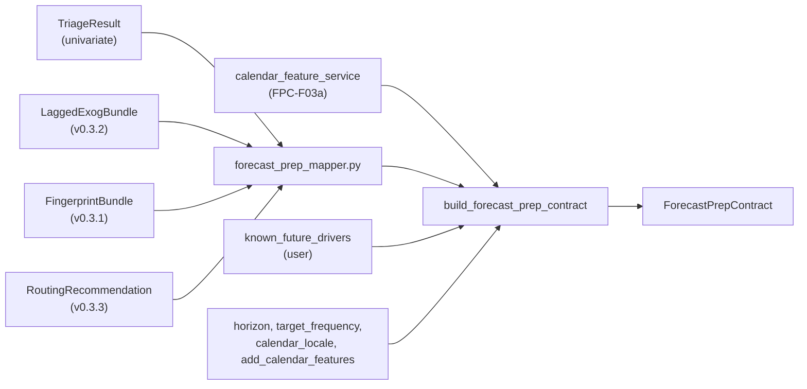
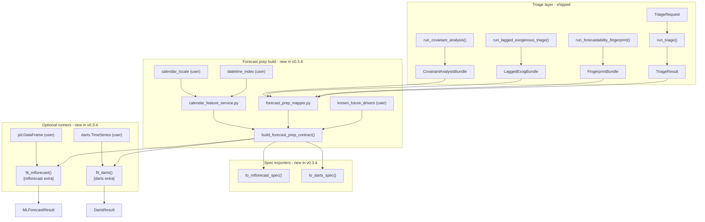

# v0.3.4 — Forecast Prep Contract: Ultimate Release Plan

**Plan type:** Actionable release plan — neutral hand-off contract from triage to downstream forecasting frameworks
**Audience:** Maintainer, reviewer, statistician reviewer, downstream-framework user, Jr. developer
**Target release:** `0.3.4` — **headline release**, ships second in the 0.3.3 → 0.3.4 → 0.3.5 chain
**Current released version:** `0.3.3`
**Branch:** `feat/v0.3.4-forecast-prep-contract`
**Status:** Draft / Proposed
**Last reviewed:** 2026-04-22

> [!NOTE]
> **Cross-release ordering.** Depends on the calibrated `confidence_label`
> and `RoutingValidationBundle` shipped in v0.3.3. The v0.3.5 documentation
> hardening pass ships **after** this release so it can cover the new
> `ForecastPrepContract`, `to_darts_spec`, `to_mlforecast_spec`, optional
> extras, and the new walkthrough notebook in a single sweep.

**Companion refs:**

- [v0.3.0 Covariant Informative: Ultimate Release Plan](implemented/v0_3_0_covariant_informative_ultimate_plan.md)
- [v0.3.1 Forecastability Fingerprint & Model Routing: Ultimate Release Plan](implemented/v0_3_1_forecastability_fingerprint_model_routing_plan.md)
- [v0.3.2 Lagged-Exogenous Triage: Ultimate Release Plan](implemented/v0_3_2_lagged_exogenous_triage_ultimate_plan.md)
- [v0.3.3 Routing Validation & Benchmark Hardening: Ultimate Release Plan](v0_3_3_routing_validation_benchmark_hardening_plan.md) — ships first
- [v0.3.5 Documentation Quality Improvement: Ultimate Release Plan](v0_3_5_documentation_quality_improvement_ultimate_plan.md) — ships last

**Builds on:**

- implemented `0.3.0` covariant triage gate, `cross_ami`, `cross_pami`, `te`,
  `gcmi`, `pcmci`, `pcmci_ami`, `CovariantAnalysisBundle`,
  `lagged_exog_conditioning` metadata
- implemented `0.3.1` univariate fingerprint, AMI Information Geometry
  engine, routing service, `RoutingRecommendation`, `FingerprintBundle`
- implemented `0.3.2` `LaggedExogBundle`, `LaggedExogSelectionRow` with
  `selected_for_tensor` flag, `tensor_role ∈ {diagnostic, predictive,
  known_future}`, `xami_sparse` sparse selector, known-future opt-in
- v0.3.5 docs-contract checker, canonical terminology table
- v0.3.3 widened `RoutingConfidenceLabel = Literal["high", "medium", "low",
  "abstain"]`, `RoutingValidationBundle` for release-time policy validation
- existing `TriageRequest`, `run_triage`, `TriageResult` univariate facade
  and `run_covariant_analysis` covariant facade
- existing `pyproject.toml` `[project.optional-dependencies]` block (already
  hosts `agent`, `causal`, `transport` extras) — pattern reused for
  `darts` and `mlforecast` extras

---

## 1. Why this plan exists

After triage, a covariant analysis, a fingerprint, and a sparse lag map, the
package answers every diagnostic question a user asks. It does **not** answer
the next question they always ask:

> "Fine. What do I actually pass into Darts or MLForecast?"

`0.3.4` is the headline release that closes that gap. It introduces a single
**neutral, deterministic, additive hand-off contract** — `ForecastPrepContract`
— that converts triage outputs into structured downstream forecasting guidance
**without turning the package itself into a model-training framework**.

The release also ships **two optional adapter extras** (`darts`, `mlforecast`)
that let users go from contract straight to a fitted model with a single
function call. The adapters are strictly optional; the core package gains zero
new hard dependencies.

> [!IMPORTANT]
> The Forecast Prep Contract is a **hand-off layer**, not a model trainer.
> It does not select hyperparameters, score models, or claim optimal
> architectures. Every `recommended_*` field in the contract is paired with
> a `confidence_label` and `caution_flags` so that downstream consumers can
> make informed model-family decisions, not blind model-fitting calls.

This release also closes a long-standing user-experience gap: deterministic
**calendar feature generation**. When the user enables `add_calendar_features`
(default `True`), the contract injects a stable, deterministically named set
of calendar covariates (`dayofweek`, `month`, `quarter`, `is_weekend`,
`is_business_day`, optional `is_holiday`) into `future_covariates`. This is
the single most common manual step every user re-implements; centralising it
inside the contract removes a major source of inconsistency.

### Planning principles

| Principle | Implication |
| --- | --- |
| Neutral core, framework-specific adapters second | Core contract first; Darts and MLForecast specs second; runner functions third |
| Optional extras only | `darts` and `mlforecast` ship as `[project.optional-dependencies]`; core install is unchanged |
| Lazy imports inside adapters | Adapter modules are importable without their extras; runners raise actionable `ImportError` when extras are missing |
| Three input axes are first-class | univariate target lags, lagged exogenous covariates, known-future covariates each get explicit treatment |
| Calendar features are deterministic | Stable naming scheme `_calendar__<feature>`; holiday calendars require explicit locale opt-in |
| Distinguish evidence from recommendation | `recommended_*` fields are conservative; richer diagnostic fields stay separate |
| Hexagonal + SOLID | Mapper service in `services/`; contract builder in `use_cases/`; framework adapters in `integrations/`; runner functions are thin shells around lazy-imported framework calls |
| Additive only | Existing public symbols and Pydantic field shapes are preserved |
| Honest semantics | Blocked / weak / abstaining triage results yield conservative empty contracts, not aspirational ones |
| Respect v0.3.2 contracts exactly | Past-covariate lags come from `selected_for_tensor=True` rows only; future-covariate lags may include `lag=0` only for `known_future` rows |

### Reviewer acceptance block

`0.3.4` is successful only if all of the following are visible together:

1. **Neutral core contract**
   - `ForecastPrepContract`, `LagRecommendation`, `CovariateRecommendation`,
     `FamilyRecommendation` exist as frozen Pydantic models with stable field
     names and explicit `Field(...)` descriptions
   - `contract_version` field is set to `"0.3.4"` and is part of the schema
2. **Builder**
   - `build_forecast_prep_contract(triage_result, *, horizon, target_frequency, ...)`
     returns a `ForecastPrepContract`
   - blocked or abstaining inputs yield conservative empty
     `recommended_target_lags` and an explicit `caution_flags` entry
3. **Three input axes**
   - **Univariate target lags** are mapped from `primary_lags` and the
     fingerprint
   - **Lagged exogenous covariates** are mapped from
     `LaggedExogSelectionRow.selected_for_tensor=True` rows only
   - **Known-future covariates** combine user-supplied `known_future_drivers`
     with auto-generated calendar features
4. **Calendar features**
   - `add_calendar_features: bool = True` injects deterministically named
     features (`_calendar__dayofweek`, etc.)
   - `calendar_locale: str | None = None` enables holiday features only when
     set and only when the optional `holidays` package is installed
5. **Framework specs**
   - `to_mlforecast_spec(contract)` returns a serializable dict
   - `to_darts_spec(contract)` returns a serializable dict, with
     `lags_past_covariates` derived **only** from
     `selected_for_tensor=True` rows
6. **Runner functions (optional extras)**
   - `fit_mlforecast(contract, df, ...)` lives under
     `forecastability.integrations.mlforecast_runner` and lazy-imports
     `mlforecast`
   - `fit_darts(contract, series, ...)` lives under
     `forecastability.integrations.darts_runner` and lazy-imports `darts`
   - both raise actionable `ImportError` when the extra is missing
7. **Optional extras**
   - `pyproject.toml` `[project.optional-dependencies]` adds `darts` and
     `mlforecast` entries
   - `pip install dependence-forecastability[darts]` and
     `pip install dependence-forecastability[mlforecast]` succeed
8. **Final walkthrough notebook**
   - `notebooks/walkthroughs/05_forecast_prep_to_models.ipynb` exists and
     exercises the full path: triage → contract → MLForecast → Darts → side-by-side
9. **Release engineering**
   - version is bumped to `0.3.4` across `pyproject.toml`,
     `src/forecastability/__init__.py`, `CHANGELOG.md`, `README.md`
   - the showcase notebook is committed with executed outputs
   - all fixture rebuild scripts have been re-run and committed
   - the git tag `v0.3.4` is created and pushed
10. **Documentation**
    - `docs/forecast_prep_contract.md` documents the contract and its three
      input axes
    - `README.md` install section documents `[darts]` and `[mlforecast]`
      extras
    - `CHANGELOG.md` `0.3.4` entry explicitly notes that `darts` and
      `mlforecast` are optional extras, not core dependencies

---

## 2. Theory-to-code map — formal contract semantics

> [!IMPORTANT]
> Every junior developer MUST read this section before writing any code.
> The contract is small in math but high in semantic risk: a wrong lag-role
> mapping or a wrong known-future predicate will silently leak future
> information into past-covariate slots in downstream forecasting models.

### 2.1. The three input axes

Define the input space of any tabular forecasting model as the disjoint union
of three axes:

$$\mathcal{X} = \mathcal{X}_{\text{target-lag}} \sqcup \mathcal{X}_{\text{past-cov}} \sqcup \mathcal{X}_{\text{future-cov}}$$

where:

- $\mathcal{X}_{\text{target-lag}}$ — past values $Y_{t-k}$ of the target itself
  for $k \in \{1, 2, \ldots\}$, derived from `primary_lags` and the fingerprint
- $\mathcal{X}_{\text{past-cov}}$ — past values $X_{j, t-k}$ of exogenous
  drivers for $k \ge 1$, derived from
  `LaggedExogSelectionRow.selected_for_tensor=True` rows
- $\mathcal{X}_{\text{future-cov}}$ — values $Z_{m, t+h}$ of covariates that
  are known at prediction time for the entire horizon $h \in \{0, 1, \ldots,
  H-1\}$, derived from explicit user-declared known-future drivers plus
  auto-generated calendar features

> [!IMPORTANT]
> $\mathcal{X}_{\text{past-cov}}$ and $\mathcal{X}_{\text{future-cov}}$ are
> **disjoint by construction**. A driver column may appear in at most one of
> them. This is enforced by the builder: a column declared in
> `known_future_drivers` is removed from past-covariate selection before the
> Darts/MLForecast spec is emitted.

### 2.2. The known-future eligibility predicate

A covariate column $c$ is eligible for $\mathcal{X}_{\text{future-cov}}$ if and
only if:

$$\text{KnownFuture}(c) \iff \big( c \in K \big) \lor \big( c \in C_{\text{cal}} \land \texttt{add\_calendar\_features} \big)$$

where:

- $K$ — the set of column names supplied by the user via
  `known_future_drivers: dict[str, bool]` (only entries with value `True`
  are considered known-future)
- $C_{\text{cal}}$ — the deterministically generated calendar feature set
  $\{\texttt{\_calendar\_\_dayofweek}, \texttt{\_calendar\_\_month},
  \texttt{\_calendar\_\_quarter}, \texttt{\_calendar\_\_is\_weekend},
  \texttt{\_calendar\_\_is\_business\_day}, \texttt{\_calendar\_\_is\_holiday}\}$
  (the last is included only when `calendar_locale` is set and the optional
  `holidays` package is importable)

> [!NOTE]
> A column appearing in `LaggedExogSelectionRow.selected_for_tensor=True` rows
> is **not** known-future by default. Past-data informativeness is necessary
> but not sufficient for known-future eligibility. The user owns the
> contractual claim; the toolkit verifies it is at least syntactically
> consistent.

### 2.3. The past-covariate lag set predicate

For each driver $c \in \mathcal{X}_{\text{past-cov}}$ the contract carries a
sparse lag set $L_{\text{past}}(c) \subseteq \{1, 2, \ldots, K_{\max}\}$
defined exactly as:

$$L_{\text{past}}(c) = \{k : \exists \text{ row } r \in \texttt{LaggedExogBundle.selected\_lags} \text{ with } r.\text{driver}=c, r.\text{lag}=k, r.\text{selected\_for\_tensor}=\text{True}, r.\text{lag} \ge 1\}$$

> [!IMPORTANT]
> The `r.lag >= 1` constraint is non-redundant. The `xami_sparse` selector in
> v0.3.2 already enforces `min_lag >= 1`, but the contract builder MUST
> double-check this invariant defensively because future selectors registered
> under different `selector_name` literals may relax it. Cross-reference:
> [v0.3.2 plan §2.1](implemented/v0_3_2_lagged_exogenous_triage_ultimate_plan.md).

### 2.4. The future-covariate lag set predicate

For each driver $c \in \mathcal{X}_{\text{future-cov}}$ the contract carries a
lag set $L_{\text{future}}(c) \subseteq \{0, 1, \ldots, H-1\}$ where $H$ is the
forecast horizon. The default behavior is:

$$L_{\text{future}}(c) = \begin{cases} \{0\} & \text{if } c \in C_{\text{cal}} \\ \{0\} \cup \text{user-supplied lags or default } \{0\} & \text{if } c \in K \end{cases}$$

> [!IMPORTANT]
> Future-covariate `lag = 0` is **only** allowed for columns in $C_{\text{cal}}$
> or $K$. Any other column that arrives at the spec emitter with
> `lags_future_covariates` containing `0` is a contract bug and the builder
> must raise `ValueError`. This enforces the invariant from v0.3.2 §2.1.

### 2.5. Confidence propagation from routing to contract

The contract's `confidence_label` field is a direct copy of
`RoutingRecommendation.confidence_label` from v0.3.3. The propagation rule is:

| `RoutingRecommendation.confidence_label` (v0.3.3) | `ForecastPrepContract.confidence_label` | Effect on `recommended_families` |
| --- | --- | --- |
| `high` | `high` | full `recommended_families` from routing |
| `medium` | `medium` | full `recommended_families`, plus baseline families |
| `low` | `low` | only top-1 routing family + baselines |
| `abstain` | `abstain` | `recommended_families` is empty; `baseline_families` only |

When the upstream `TriageResult.blocked` is true, the contract overrides the
routing label entirely and emits `confidence_label = "abstain"` regardless of
what routing reported. Blocked triages produce conservative empty contracts
with explicit `caution_flags`.

### 2.6. Calendar feature generation — formal naming and source

For a `pandas.DatetimeIndex` $T = (t_0, t_1, \ldots, t_{N-1})$, the calendar
feature generator emits the following columns when
`add_calendar_features=True`:

| Column name | Type | Source |
| --- | --- | --- |
| `_calendar__dayofweek` | `int8` (0=Monday) | `T.dayofweek` |
| `_calendar__month` | `int8` (1-12) | `T.month` |
| `_calendar__quarter` | `int8` (1-4) | `T.quarter` |
| `_calendar__is_weekend` | `bool` | `T.dayofweek.isin([5, 6])` |
| `_calendar__is_business_day` | `bool` | `pd.bdate_range`-derived |
| `_calendar__is_holiday` | `bool` | `holidays` package, locale `calendar_locale`, only when both set |

The naming scheme `_calendar__<feature>` is **stable**. Users may rename the
columns afterward; the contract emitter never strips the prefix.

> [!NOTE]
> When `calendar_locale` is set but the `holidays` package is not installed,
> the builder skips `_calendar__is_holiday` silently and emits a single entry
> in `caution_flags`: `"calendar_locale_set_but_holidays_unavailable"`.
> This avoids surprising the user with a missing column at the spec emitter.

### 2.7. Cross-reference to v0.3.2 invariants

The Forecast Prep Contract preserves three v0.3.2 contracts exactly:

1. **`tensor_role` mirrors `lag_role`.** A `lag_role = "instant"` row may have
   `tensor_role = "diagnostic"` (default) or `"known_future"` (opt-in). It
   never has `tensor_role = "predictive"`.
2. **`selected_for_tensor=True` is the only legitimate source of past-covariate
   lags.** No other row may enter $L_{\text{past}}$.
3. **`cross_pami` semantics are not relabeled.** The contract reads
   `LaggedExogSelectionRow.selector_name` and never silently assumes
   `cross_pami` is fully conditioned.

---

## 3. Repo baseline — what already exists

| Layer | Module | What it provides | Status |
| --- | --- | --- | --- |
| **Types** | `src/forecastability/utils/types.py` | `TriageRequest`, `TriageResult`, `Readiness`, `FingerprintBundle`, `RoutingRecommendation`, `RoutingConfidenceLabel`, `LaggedExogBundle`, `LaggedExogSelectionRow`, `LaggedExogProfileRow`, `CovariantAnalysisBundle`, `RoutingValidationBundle` (from v0.3.3) | Stable |
| **Use cases** | `src/forecastability/use_cases/run_triage.py` | univariate triage facade | Stable |
| **Use cases** | `src/forecastability/use_cases/run_covariant_analysis.py` | covariant facade | Stable |
| **Use cases** | `src/forecastability/use_cases/run_lagged_exogenous_triage.py` | lagged-exogenous facade | Stable |
| **Use cases** | `src/forecastability/use_cases/run_forecastability_fingerprint.py` | univariate fingerprint facade | Stable |
| **Services** | `src/forecastability/services/routing_service.py` | rule-based routing | Stable |
| **Adapters** | `src/forecastability/adapters/cli.py`, `adapters/dashboard.py` | CLI + dashboard surfaces | Stable |
| **Reporting** | `src/forecastability/reporting/` (if present) | report emitters | Stable |
| **Examples** | `examples/forecast_prep/` | empty so far; will host new public examples | New |
| **Walkthroughs** | `notebooks/walkthroughs/{00..04}_*.ipynb` | shipped walkthroughs | Stable |
| **CI** | `.github/workflows/{ci,smoke,publish-pypi,release}.yml`, `.github/ISSUE_TEMPLATE/release_checklist.md`, `scripts/check_notebook_contract.py`, `scripts/check_docs_contract.py` (v0.3.5) | release hygiene baseline | Stable |
| **Optional extras precedent** | `pyproject.toml` `[project.optional-dependencies]` already hosts `agent`, `causal`, `transport` | demonstrates the additive extra pattern | Stable |
| **Docs** | `docs/quickstart.md`, `docs/public_api.md`, `docs/surface_guide.md`, `docs/wording_policy.md` (v0.3.5 single source of truth) | user-facing surface | Stable |

---

## 4. Feature inventory and overlap assessment

| ID | Feature | Phase | Overlap with existing | Genuine new work | Status |
| --- | --- | ---: | --- | --- | --- |
| FPC-F00 | Typed contract result models | 0 | Extends `utils/types.py` patterns | `ForecastPrepContract`, `LagRecommendation`, `CovariateRecommendation`, `FamilyRecommendation`, `ForecastPrepBundle` | Proposed |
| FPC-F00.1 | `contract_version` field and schema-evolution policy | 0 | New | additive `contract_version: str` with documented evolution rules | Proposed |
| FPC-F01 | Univariate contract builder | 1 | Builds on `TriageResult` | `use_cases/build_forecast_prep_contract.py`, `services/forecast_prep_mapper.py` | Proposed |
| FPC-F02 | Covariate-aware builder extension | 1 | Builds on `LaggedExogBundle`, `CovariantAnalysisBundle` | covariate role inference + sparse-lag mapping | Proposed |
| FPC-F03 | Seasonality extraction rules | 1 | Builds on fingerprint | seasonal-period candidate vs recommended split | Proposed |
| FPC-F03a | Calendar feature auto-generation | 1 | New | `services/calendar_feature_service.py` with deterministic naming | Proposed |
| FPC-F03b | Holiday calendar opt-in | 1 | New | `holidays` soft dependency behind `calendar_locale` | Proposed |
| FPC-F04 | MLForecast spec exporter | 2 | New | `integrations/mlforecast_spec.py::to_mlforecast_spec()` | Proposed |
| FPC-F05 | Darts spec exporter | 2 | New | `integrations/darts_spec.py::to_darts_spec()` with v0.3.2 invariants | Proposed |
| FPC-F05.1 | Exporter warnings policy | 2 | Builds on contract caution flags | deterministic note generation in both spec emitters | Proposed |
| FPC-F06 | MLForecast runner (optional extra) | 3 | New | `integrations/mlforecast_runner.py::fit_mlforecast()` with lazy import | Proposed |
| FPC-F07 | Darts runner (optional extra) | 3 | New | `integrations/darts_runner.py::fit_darts()` with lazy import | Proposed |
| FPC-F07.1 | Optional extras configuration | 3 | Extends `pyproject.toml` | additive `[darts]` and `[mlforecast]` entries; CI matrix update | Proposed |
| FPC-F08 | Public examples | 4 | Follows existing examples taxonomy | `examples/forecast_prep/{minimal_contract,to_mlforecast,to_darts,calendar_features,known_future,with_runners}.py` | Proposed |
| FPC-F08.1 | Showcase script | 4 | Mirrors existing showcase scripts | `scripts/run_showcase_forecast_prep.py` with `--smoke` and `--with-runners` | Proposed |
| FPC-F09 | Walkthrough notebook | 4 | Follows existing walkthrough pattern | `notebooks/walkthroughs/05_forecast_prep_to_models.ipynb` (HEADLINE) | Proposed |
| FPC-F10 | Contract tests | 5 | Extends current test discipline | builder, exporter, three-axis, calendar, blocked-state cases | Proposed |
| FPC-F10.1 | Runner tests (skipped without extras) | 5 | New | `tests/test_mlforecast_runner.py`, `tests/test_darts_runner.py` with `pytest.importorskip` | Proposed |
| FPC-F11 | Regression fixtures | 5 | Follows current fixture discipline | `docs/fixtures/forecast_prep_regression/expected/` + rebuild script | Proposed |
| FPC-CI-01 | Forecast prep smoke job | 6 | Extends `.github/workflows/smoke.yml` | run showcase script in `--smoke` mode (no extras) | Proposed |
| FPC-CI-02 | Optional-extras CI matrix | 6 | Extends `.github/workflows/ci.yml` | extras matrix runs runner tests with `[darts]` and `[mlforecast]` | Proposed |
| FPC-CI-03 | Notebook contract extension | 6 | Extends `scripts/check_notebook_contract.py` | track new walkthrough notebook | Proposed |
| FPC-CI-04 | Release checklist hardening | 6 | Extends `.github/ISSUE_TEMPLATE/release_checklist.md` | extras tag, fixture verify, walkthrough commit | Proposed |
| FPC-D01 | Theory / contract doc | 7 | New docs page | `docs/forecast_prep_contract.md` covering §2 in plain language | Proposed |
| FPC-D02 | README / quickstart / public API update | 7 | Extends user-facing docs | document contract, extras, calendar features | Proposed |
| FPC-D03 | Changelog and release notes | 7 | Release docs | additive contract surface, optional extras explicitly tagged | Proposed |
| FPC-R01 | Version bump and tag | 7 | Release engineering | bump to `0.3.4`, tag `v0.3.4`, push | Proposed |
| FPC-R02 | Walkthrough notebook executed-and-committed | 7 | Release engineering | the headline notebook ships with executed outputs | Proposed |
| FPC-R03 | Fixture rebuild verification | 7 | Release engineering | every `rebuild_*` script runs clean | Proposed |

---

## 5. Domain contracts — MANDATORY FIRST STEP

### 5.1. Typed result models

**File:** `src/forecastability/utils/types.py` (additive only)

```python
from typing import Literal

from pydantic import BaseModel, ConfigDict, Field, field_validator

ForecastPrepLagRole = Literal["direct", "seasonal", "secondary", "excluded"]
ForecastPrepCovariateRole = Literal["past", "future", "static", "rejected"]
ForecastPrepConfidence = Literal["low", "medium", "high"]
ForecastPrepFamilyTier = Literal["baseline", "preferred", "fallback"]
# Mirrors v0.3.3 RoutingConfidenceLabel additively.
ForecastPrepContractConfidence = Literal["high", "medium", "low", "abstain"]


class LagRecommendation(BaseModel):
    """One recommended (or excluded) target lag with rationale."""

    model_config = ConfigDict(frozen=True)

    lag: int = Field(ge=1, description="Strictly positive lag of the target.")
    role: ForecastPrepLagRole
    confidence: ForecastPrepConfidence
    selected_for_handoff: bool
    rationale: str


class CovariateRecommendation(BaseModel):
    """One recommended (or rejected) covariate with role and rationale."""

    model_config = ConfigDict(frozen=True)

    name: str
    role: ForecastPrepCovariateRole
    confidence: ForecastPrepConfidence
    informative: bool
    future_known_required: bool = Field(
        description=(
            "True only when role == 'future'. Indicates the user contractually "
            "guarantees this column is observable for the entire horizon."
        ),
    )
    selected_lags: list[int] = Field(
        default_factory=list,
        description=(
            "For role='past': sparse predictive lags (>= 1). "
            "For role='future': horizon-relative lags (>= 0)."
        ),
    )
    rationale: str


class FamilyRecommendation(BaseModel):
    """One recommended model family with tier and rationale."""

    model_config = ConfigDict(frozen=True)

    family: str
    tier: ForecastPrepFamilyTier
    rationale: str


class ForecastPrepContract(BaseModel):
    """Neutral, deterministic, additive hand-off contract for downstream forecasting.

    See plan v0.3.4 §2 for the formal semantics of the three input axes.
    Field names are stable and additive-only.
    """

    model_config = ConfigDict(frozen=True)

    contract_version: str = Field(
        default="0.3.4",
        description="Schema version. Additive field changes do not bump this.",
    )
    source_goal: Literal["univariate", "covariant", "lagged_exogenous"]
    blocked: bool = Field(
        description="Mirrors TriageResult.blocked. True yields conservative empties.",
    )
    readiness_status: str
    forecastability_class: str | None = None
    confidence_label: ForecastPrepContractConfidence = "medium"
    target_frequency: str | None = None
    horizon: int | None = Field(default=None, ge=1)
    recommended_target_lags: list[int] = Field(default_factory=list)
    recommended_seasonal_lags: list[int] = Field(default_factory=list)
    excluded_target_lags: list[int] = Field(default_factory=list)
    lag_rationale: list[str] = Field(default_factory=list)
    candidate_seasonal_periods: list[int] = Field(default_factory=list)
    recommended_families: list[str] = Field(default_factory=list)
    baseline_families: list[str] = Field(default_factory=list)
    past_covariates: list[str] = Field(default_factory=list)
    future_covariates: list[str] = Field(default_factory=list)
    static_features: list[str] = Field(default_factory=list)
    rejected_covariates: list[str] = Field(default_factory=list)
    covariate_notes: list[str] = Field(default_factory=list)
    transformation_hints: list[str] = Field(default_factory=list)
    caution_flags: list[str] = Field(default_factory=list)
    downstream_notes: list[str] = Field(default_factory=list)
    calendar_features: list[str] = Field(
        default_factory=list,
        description=(
            "Subset of future_covariates that were auto-generated by the "
            "calendar feature service. All entries start with '_calendar__'."
        ),
    )
    calendar_locale: str | None = None
    metadata: dict[str, str | int | float] = Field(default_factory=dict)

    @field_validator("recommended_target_lags", "excluded_target_lags")
    @classmethod
    def _strictly_positive_target_lags(cls, value: list[int]) -> list[int]:
        if any(k < 1 for k in value):
            raise ValueError("Target lags must all be >= 1.")
        return value

    @field_validator("calendar_features")
    @classmethod
    def _calendar_features_have_prefix(cls, value: list[str]) -> list[str]:
        for name in value:
            if not name.startswith("_calendar__"):
                raise ValueError(
                    f"Calendar feature {name!r} must start with '_calendar__'."
                )
        return value


class ForecastPrepBundle(BaseModel):
    """Richer contract bundle carrying the typed rows alongside the compact contract."""

    model_config = ConfigDict(frozen=True)

    contract: ForecastPrepContract
    lag_rows: list[LagRecommendation] = Field(default_factory=list)
    covariate_rows: list[CovariateRecommendation] = Field(default_factory=list)
    family_rows: list[FamilyRecommendation] = Field(default_factory=list)
    metadata: dict[str, str | int | float] = Field(default_factory=dict)
```

### 5.2. Boundary rules

- The compact `ForecastPrepContract` is the **public** hand-off surface. It is
  re-exported from `forecastability` and `forecastability.triage`.
- The `ForecastPrepBundle` is the **rich** advanced surface. It is re-exported
  from `forecastability.triage` only (not from the top-level facade).
- `to_mlforecast_spec()` and `to_darts_spec()` operate on `ForecastPrepContract`
  only. Bundle consumers may call them on `bundle.contract`.
- `fit_mlforecast()` and `fit_darts()` operate on `ForecastPrepContract` only
  and lazy-import their respective frameworks inside the function body.
- The mapper service (`services/forecast_prep_mapper.py`) is pure: it takes
  triage outputs and returns typed rows. It does not call any framework
  adapter.
- The builder use case (`use_cases/build_forecast_prep_contract.py`) composes
  the mapper + the calendar service + the rationale writer. It never imports
  `darts` or `mlforecast`.

### 5.3. Acceptance criteria

- typed models importable from
  - `forecastability` (compact contract + builder)
  - `forecastability.triage` (compact contract + builder + bundle)
- categorical fields use closed `Literal` labels
- `recommended_target_lags` strictly positive; field validator enforces this
- calendar feature names start with `_calendar__`; field validator enforces
  this
- JSON serialisation of `ForecastPrepContract` is stable across reruns
- `contract_version` is `"0.3.4"` for this release; future additive changes
  do not bump it; only field renames or removals would

---

## 6. The three input axes — explicit treatment

> [!IMPORTANT]
> Each axis has its own subsection, mapping rules, and acceptance criteria.
> A junior developer should be able to read this section and produce a correct
> mapping without reading the rest of the plan.

### 6.1. Axis A — Univariate target lags

**Source.** `TriageResult.summary.primary_lags` (existing surface) plus any
fingerprint information that exposes structural lag candidates.

**Mapping rules.**

1. Filter `primary_lags` to retain only $k \ge 1$.
2. Classify each retained lag using the fingerprint:
   - if the lag matches a candidate seasonal period
     ($k \in \texttt{candidate\_seasonal\_periods}$), set
     `LagRecommendation.role = "seasonal"`
   - if the lag is the strongest non-seasonal lag, set
     `role = "direct"`
   - otherwise set `role = "secondary"`
3. Set `selected_for_handoff = True` for `direct` and `seasonal` lags;
   `secondary` lags default to `False` unless `confidence_label = "high"`.
4. Diagnostically interesting lags that did not enter `primary_lags` may be
   recorded as `role = "excluded"` with `selected_for_handoff = False`.

**Population of contract fields.**

- `recommended_target_lags` ← lags with `selected_for_handoff = True` and
  `role ∈ {"direct", "secondary"}`
- `recommended_seasonal_lags` ← lags with `selected_for_handoff = True` and
  `role = "seasonal"`
- `excluded_target_lags` ← lags with `role = "excluded"`
- `lag_rationale` ← human-readable string per included or excluded lag

**Acceptance criteria.**

- a strong univariate input (`AirPassengers` archetype) yields a non-empty
  `recommended_target_lags` and a non-empty `recommended_seasonal_lags`
- a `blocked` triage yields empty `recommended_target_lags` and exactly one
  entry in `caution_flags` containing the substring `"blocked"`
- an `abstain` confidence yields empty `recommended_families` (per §2.5) but
  may still emit `recommended_target_lags` if the readiness path was clean

### 6.2. Axis B — Lagged exogenous covariates

**Source.** `LaggedExogBundle.selected_lags` from
`run_lagged_exogenous_triage()` (v0.3.2). Only rows with
`selected_for_tensor=True` and `lag >= 1` enter this axis.

**Mapping rules.**

1. Group `LaggedExogSelectionRow` rows by `driver`.
2. For each driver $c$, define
   $L_{\text{past}}(c) = \{r.\text{lag} : r.\text{driver}=c, r.\text{selected\_for\_tensor}=\text{True}, r.\text{lag} \ge 1\}$
   per §2.3.
3. Skip drivers with $L_{\text{past}}(c) = \emptyset$.
4. If $c \in K$ (user's `known_future_drivers`), the driver moves to
   Axis C and is **not** included in past covariates.
5. Emit a `CovariateRecommendation` with:
   - `name = c`
   - `role = "past"`
   - `selected_lags = sorted(L_past(c))`
   - `informative = True`
   - `future_known_required = False`
   - `confidence` derived from the routing label by the same propagation
     rule as §2.5

**Population of contract fields.**

- `past_covariates` ← driver names with `role = "past"`
- `covariate_notes` ← one entry per past covariate with the lag set written
  out

**Acceptance criteria.**

- the `direct_lag2` driver from the v0.3.2 panel produces a past covariate
  with `selected_lags = [2]`
- the `instant_only` driver (no opt-in) does **not** appear in
  `past_covariates`
- a driver appearing in both the lagged-exog selection and
  `known_future_drivers` appears only in `future_covariates` (Axis C)

### 6.3. Axis C — Known-future covariates

**Source.** Two-channel input:

1. user-supplied `known_future_drivers: dict[str, bool]` (only entries with
   value `True` are honored)
2. auto-generated calendar features when `add_calendar_features=True`

**Mapping rules.**

1. Compute the candidate set
   $\text{KF}_{\text{candidate}} = \{c : K[c] = \text{True}\} \cup C_{\text{cal}}$.
2. For each $c \in \text{KF}_{\text{candidate}}$:
   - emit a `CovariateRecommendation` with
     `role = "future"`,
     `future_known_required = True`,
     `selected_lags = [0]` by default
   - if $c \in C_{\text{cal}}$, append the column name to
     `ForecastPrepContract.calendar_features` and set
     `confidence = "high"` (calendar features are deterministically
     correct)
   - if $c \in K$ but $c \notin C_{\text{cal}}$,
     `confidence` mirrors the upstream routing label

**Population of contract fields.**

- `future_covariates` ← every `CovariateRecommendation` with `role = "future"`
- `calendar_features` ← the subset of `future_covariates` starting with
  `_calendar__`
- `calendar_locale` ← the user-supplied locale (or `None`)
- `caution_flags` ← single entry
  `"calendar_locale_set_but_holidays_unavailable"` when the locale is set but
  the `holidays` package is missing

**Acceptance criteria.**

- with `add_calendar_features=True` and `calendar_locale=None`, the contract
  emits at least the five locale-independent calendar columns
- with `add_calendar_features=True` and `calendar_locale="US"` and the
  `holidays` package installed, the contract additionally emits
  `_calendar__is_holiday`
- with `add_calendar_features=True` and `calendar_locale="US"` and the
  `holidays` package missing, the contract emits the five locale-independent
  columns plus exactly one entry in `caution_flags`
- with `add_calendar_features=False`, no `_calendar__*` column appears in
  `future_covariates`
- a column declared in `known_future_drivers` and also present in
  `LaggedExogBundle.selected_lags` appears only in `future_covariates`

---

## 7. Phased delivery

### Phase 0 — Domain contracts

#### FPC-F00 — Typed contract result models

**Goal.** Land the typed surface from §5.1.

**File targets:**

- `src/forecastability/utils/types.py`
- `src/forecastability/__init__.py` (additive re-export of
  `ForecastPrepContract`, `LagRecommendation`, `CovariateRecommendation`,
  `FamilyRecommendation`, `build_forecast_prep_contract`,
  `to_mlforecast_spec`, `to_darts_spec`)
- `src/forecastability/triage/__init__.py` (additive re-export of the same
  symbols plus `ForecastPrepBundle`)

**Acceptance criteria:**

- frozen typed models per §5.1
- field validators enforce the strictly-positive target lag rule and the
  `_calendar__` prefix rule
- imports resolve via both `from forecastability import ForecastPrepContract`
  and `from forecastability.triage import ForecastPrepBundle`
- v0.3.5 docs-contract `--imports` check passes

#### FPC-F00.1 — `contract_version` field and schema-evolution policy

**Goal.** Document the schema-evolution rules.

**File targets:**

- `docs/forecast_prep_contract.md` (Phase 7)
- inline docstring on `ForecastPrepContract.contract_version`

**Schema evolution rules:**

- additive field changes (new optional field) do not bump `contract_version`
- field rename or removal bumps `contract_version` and ships in a new release
  with a migration entry in `CHANGELOG.md`
- `contract_version` is a string of the form `"<major>.<minor>.<patch>"`
  matching the package version that introduced the change

**Acceptance criteria:**

- the schema-evolution policy is documented exactly once, in
  `docs/forecast_prep_contract.md`

### Phase 1 — Build logic from deterministic outputs



#### FPC-F01 — Univariate contract builder

**File targets:**

- `src/forecastability/use_cases/build_forecast_prep_contract.py`
- `src/forecastability/services/forecast_prep_mapper.py`
- `tests/test_build_forecast_prep_contract.py`

**Implementation contract:**

```python
def build_forecast_prep_contract(
    triage_result: TriageResult,
    *,
    horizon: int | None = None,
    target_frequency: str | None = None,
    lagged_exog_bundle: LaggedExogBundle | None = None,
    fingerprint_bundle: FingerprintBundle | None = None,
    routing_recommendation: RoutingRecommendation | None = None,
    known_future_drivers: dict[str, bool] | None = None,
    add_calendar_features: bool = True,
    calendar_locale: str | None = None,
    datetime_index: pd.DatetimeIndex | None = None,
) -> ForecastPrepContract:
    """Build a ForecastPrepContract from deterministic triage outputs.

    Implements the three-axis mapping defined in plan v0.3.4 §6 and the
    confidence propagation rule in §2.5. When add_calendar_features is True
    and datetime_index is supplied, the builder injects the calendar columns
    defined in §2.6 into future_covariates.

    Args:
        triage_result: Output of run_triage(). Determines blocked state and
            primary_lags.
        horizon: Forecast horizon in samples.
        target_frequency: Pandas-compatible frequency string (e.g. 'D', 'M').
        lagged_exog_bundle: Optional output of run_lagged_exogenous_triage().
            When provided, drives the past-covariate axis.
        fingerprint_bundle: Optional output of run_forecastability_fingerprint().
            When provided, drives seasonal classification.
        routing_recommendation: Optional explicit routing recommendation. If
            None, the contract reads it from fingerprint_bundle.recommendation.
        known_future_drivers: Optional dict {column_name: True} declaring
            which exogenous columns are known for the full horizon.
        add_calendar_features: When True (default), inject deterministic
            calendar columns into future_covariates per §6.3.
        calendar_locale: Locale string (e.g. 'US', 'PL') to enable holiday
            features. Requires the optional 'holidays' package.
        datetime_index: Pandas DatetimeIndex aligned with the target series.
            Required for calendar feature generation; ignored otherwise.

    Returns:
        Frozen ForecastPrepContract.
    """
```

**Acceptance criteria:**

- works on univariate `run_triage` output
- `triage_result.blocked == True` ⇒ `contract.blocked == True`,
  `recommended_target_lags == []`, `recommended_families == []`,
  `caution_flags` contains a `"blocked"` entry
- when `routing_recommendation.confidence_label == "abstain"`,
  `contract.confidence_label == "abstain"` and
  `contract.recommended_families == []`
- the function never imports `darts` or `mlforecast`
- `datetime_index` is required for calendar feature generation; if missing
  while `add_calendar_features=True`, raises `ValueError` with an actionable
  message
- regression test freezes a contract for the §6 walkthrough scenario

#### FPC-F02 — Covariate-aware builder extension

**File targets:**

- same module as FPC-F01
- `tests/test_build_forecast_prep_contract_covariant.py`

**Acceptance criteria:**

- when `lagged_exog_bundle` is supplied, every driver with at least one
  `selected_for_tensor=True` row at `lag >= 1` appears in
  `past_covariates` with the correct `selected_lags`
- a driver appearing in both `lagged_exog_bundle.selected_lags` and
  `known_future_drivers` appears only in `future_covariates`
- the builder defensively re-checks the v0.3.2 invariant that
  past-covariate lags are strictly positive (per §2.3); raises `ValueError`
  on violation
- `cross_pami` selector rows never silently produce past covariates with
  `tensor_role = "predictive"` unless the row's `selected_for_tensor` is
  also `True`

#### FPC-F03 — Seasonality extraction rules

**File targets:**

- `src/forecastability/services/forecast_prep_mapper.py`
- `tests/test_forecast_prep_seasonality.py`

**Acceptance criteria:**

- `candidate_seasonal_periods` may be richer than `recommended_seasonal_lags`
- weekly-like structure on a daily series produces a `7` in
  `recommended_seasonal_lags` only when the fingerprint structure-stability
  exceeds the routing threshold
- noisy structure does not force fake seasonal recommendations

#### FPC-F03a — Calendar feature auto-generation

**File targets:**

- `src/forecastability/services/calendar_feature_service.py`
- `tests/test_calendar_feature_service.py`

**Implementation contract:**

```python
def generate_calendar_features(
    datetime_index: pd.DatetimeIndex,
    *,
    locale: str | None = None,
) -> pd.DataFrame:
    """Generate the deterministic calendar feature DataFrame per plan §2.6.

    Always emits:
        _calendar__dayofweek (int8, 0=Monday)
        _calendar__month (int8, 1-12)
        _calendar__quarter (int8, 1-4)
        _calendar__is_weekend (bool)
        _calendar__is_business_day (bool)

    When locale is not None and the optional 'holidays' package is
    installed, additionally emits:
        _calendar__is_holiday (bool)

    Args:
        datetime_index: Aligned pandas DatetimeIndex.
        locale: Optional ISO country code (e.g. 'US', 'PL', 'DE').

    Returns:
        DataFrame indexed by datetime_index with columns above.
    """
```

**Acceptance criteria:**

- column dtypes match §2.6 exactly
- output index is identical to input `datetime_index`
- when `locale` is set but `holidays` is not importable, the function
  returns the locale-independent columns and signals the missing-package
  state via a module-level `_HOLIDAYS_AVAILABLE` flag the builder reads
- deterministic across runs

#### FPC-F03b — Holiday calendar opt-in

**File targets:**

- `src/forecastability/services/calendar_feature_service.py`
- `pyproject.toml` (additive optional extra `calendar = ["holidays>=0.50"]`)

**Acceptance criteria:**

- `holidays` is **not** added to `[project].dependencies`
- a new optional extra `calendar` is added to
  `[project.optional-dependencies]`:
  ```toml
  calendar = [
    "holidays>=0.50",
  ]
  ```
- `pip install dependence-forecastability[calendar]` installs the package
- the builder emits the `"calendar_locale_set_but_holidays_unavailable"`
  caution flag when relevant

### Phase 2 — Spec exporters

#### FPC-F04 — MLForecast spec exporter

**File targets:**

- `src/forecastability/integrations/__init__.py`
- `src/forecastability/integrations/mlforecast_spec.py`
- `tests/test_to_mlforecast_spec.py`

**Implementation contract:**

```python
def to_mlforecast_spec(contract: ForecastPrepContract) -> dict[str, object]:
    """Export the contract as a dictionary suitable for MLForecast configuration.

    Output shape:
        {
            "lags": list[int],                  # contract.recommended_target_lags
            "lag_transforms": dict[int, list[str]],  # conservative defaults
            "date_features": list[str],          # subset of calendar_features
            "target_transforms": list[str],      # contract.transformation_hints
            "static_features": list[str],        # contract.static_features
            "exogenous_features": list[str],     # past_covariates + future_covariates
            "notes": list[str],                  # built from caution_flags
        }

    The function never imports mlforecast.
    """
```

**Acceptance criteria:**

- returns a serializable dict (JSON round-trip preserves shape)
- does not require `mlforecast` to be installed
- output is stable enough for docs/examples/tests
- `notes` includes deterministic warnings for blocked or abstain contracts
- no unsupported MLForecast fields are fabricated

#### FPC-F05 — Darts spec exporter

**File targets:**

- `src/forecastability/integrations/darts_spec.py`
- `tests/test_to_darts_spec.py`

**Implementation contract:**

```python
def to_darts_spec(contract: ForecastPrepContract) -> dict[str, object]:
    """Export the contract as a dictionary suitable for Darts configuration.

    Output shape:
        {
            "lags": list[int],                       # contract.recommended_target_lags
            "lags_past_covariates": list[int],       # union of selected_lags from past covariate rows
            "lags_future_covariates": list[int],     # union of selected_lags from future covariate rows
            "past_covariates": list[str],            # contract.past_covariates
            "future_covariates": list[str],          # contract.future_covariates
            "static_covariates": list[str],          # contract.static_features
            "recommended_model_families": list[str], # contract.recommended_families
            "baseline_families": list[str],          # contract.baseline_families
            "notes": list[str],                      # built from caution_flags
        }

    The function enforces the v0.3.2 invariants:
        - lags_past_covariates contains only k >= 1
        - lags_future_covariates may contain k = 0 only for known_future
          or calendar columns
        - violations raise ValueError before returning
    """
```

**Acceptance criteria:**

- returns a serializable dict
- enforces both v0.3.2 invariants per §2.3 and §2.4 with explicit
  `ValueError` on violation
- `lags_past_covariates` is the sorted union of `selected_lags` across all
  past-covariate rows, with the `lag >= 1` invariant double-checked
- `lags_future_covariates` may include `0` only for entries listed in
  `contract.future_covariates` whose origin is `known_future` or `calendar`

#### FPC-F05.1 — Exporter warnings policy

**File targets:**

- `src/forecastability/integrations/_warnings.py` (shared helper, internal)
- `tests/test_exporter_warnings.py`

**Acceptance criteria:**

- both exporters always include explicit notes for blocked and abstain
  contracts
- warning wording is deterministic and regression-testable (frozen in
  fixtures)
- helper is internal; it is not re-exported from `forecastability`

### Phase 3 — Optional adapter runners

#### FPC-F06 — MLForecast runner (optional extra)

**File targets:**

- `src/forecastability/integrations/mlforecast_runner.py`
- `tests/test_mlforecast_runner.py`

**Implementation contract:**

```python
class MLForecastResult(BaseModel):
    """Compact result returned by fit_mlforecast()."""

    model_config = ConfigDict(frozen=True, arbitrary_types_allowed=True)

    forecast: pd.DataFrame
    fitted_model: object
    spec_used: dict[str, object]
    metadata: dict[str, str | int | float] = Field(default_factory=dict)


def fit_mlforecast(
    contract: ForecastPrepContract,
    df: pd.DataFrame,
    *,
    target_column: str = "y",
    id_column: str = "unique_id",
    time_column: str = "ds",
    horizon: int | None = None,
    model: object | None = None,
) -> MLForecastResult:
    """Fit an MLForecast model from a ForecastPrepContract and a long DataFrame.

    Lazy-imports mlforecast inside the function body. Raises an actionable
    ImportError if the 'mlforecast' extra is missing.

    Args:
        contract: A ForecastPrepContract built via build_forecast_prep_contract().
        df: Long-format DataFrame with columns id_column, time_column,
            target_column and any covariate columns referenced by the
            contract.
        target_column: Column name of the target series. Default 'y'.
        id_column: Column name of the series id. Default 'unique_id'.
        time_column: Column name of the timestamp. Default 'ds'.
        horizon: Forecast horizon. Defaults to contract.horizon.
        model: Optional MLForecast estimator instance. When None, a
            default LightGBM-style regressor is constructed; if LightGBM
            is unavailable, falls back to scikit-learn's HistGradientBoostingRegressor.

    Returns:
        MLForecastResult with forecast DataFrame and fitted model.

    Raises:
        ImportError: If the 'mlforecast' extra is missing. The message
            instructs the user to run:
                pip install dependence-forecastability[mlforecast]
        ValueError: If the contract is blocked or has empty
            recommended_target_lags.
    """
    try:
        from mlforecast import MLForecast
    except ImportError as exc:
        raise ImportError(
            "fit_mlforecast() requires the 'mlforecast' extra. Install with:\n"
            "    pip install dependence-forecastability[mlforecast]"
        ) from exc
    if contract.blocked:
        raise ValueError(
            "Cannot fit a model on a blocked ForecastPrepContract. "
            "Resolve the readiness issues reported in caution_flags first."
        )
    if not contract.recommended_target_lags:
        raise ValueError(
            "ForecastPrepContract has no recommended_target_lags; "
            "MLForecast cannot be configured without lag inputs."
        )
    spec = to_mlforecast_spec(contract)
    # Build MLForecast(...) using spec; fit; predict; package result.
    # Implementation details are deferred to the implementing developer.
    raise NotImplementedError("Body to be implemented in FPC-F06.")
```

**Acceptance criteria:**

- module is importable on a clean install (no `mlforecast` extra)
- calling `fit_mlforecast()` without the extra raises `ImportError` with
  the canonical install command exactly as shown above
- with the extra installed, the function returns an `MLForecastResult` whose
  `forecast` DataFrame has length `contract.horizon` per series id
- `tests/test_mlforecast_runner.py` uses `pytest.importorskip("mlforecast")`
  to skip the body of integration tests when the extra is missing

#### FPC-F07 — Darts runner (optional extra)

**File targets:**

- `src/forecastability/integrations/darts_runner.py`
- `tests/test_darts_runner.py`

**Implementation contract:**

```python
class DartsResult(BaseModel):
    """Compact result returned by fit_darts()."""

    model_config = ConfigDict(frozen=True, arbitrary_types_allowed=True)

    forecast: object  # darts.TimeSeries; typed as object to avoid hard import
    fitted_model: object
    spec_used: dict[str, object]
    metadata: dict[str, str | int | float] = Field(default_factory=dict)


def fit_darts(
    contract: ForecastPrepContract,
    series: object,
    *,
    past_covariates: object | None = None,
    future_covariates: object | None = None,
    horizon: int | None = None,
    model: object | None = None,
) -> DartsResult:
    """Fit a Darts model from a ForecastPrepContract and a TimeSeries.

    Lazy-imports darts inside the function body. Raises an actionable
    ImportError if the 'darts' extra is missing.

    Args:
        contract: A ForecastPrepContract built via build_forecast_prep_contract().
        series: A darts.TimeSeries instance (typed as object to avoid hard
            import at module load).
        past_covariates: Optional darts.TimeSeries of past covariates aligned
            to series.
        future_covariates: Optional darts.TimeSeries of future covariates
            aligned to series + horizon.
        horizon: Forecast horizon. Defaults to contract.horizon.
        model: Optional Darts model instance. When None, a default
            RegressionModel is constructed using contract.recommended_target_lags
            and the lag sets implied by the contract's covariate axes.

    Returns:
        DartsResult with forecast TimeSeries and fitted model.

    Raises:
        ImportError: If the 'darts' extra is missing. The message instructs
            the user to run:
                pip install dependence-forecastability[darts]
        ValueError: If the contract is blocked or violates the v0.3.2
            invariant that past-covariate lags are strictly positive.
    """
    try:
        from darts.models import RegressionModel
    except ImportError as exc:
        raise ImportError(
            "fit_darts() requires the 'darts' extra. Install with:\n"
            "    pip install dependence-forecastability[darts]"
        ) from exc
    if contract.blocked:
        raise ValueError(
            "Cannot fit a model on a blocked ForecastPrepContract. "
            "Resolve the readiness issues reported in caution_flags first."
        )
    spec = to_darts_spec(contract)
    # Build RegressionModel(lags=spec["lags"], ...); fit; predict; package.
    # Implementation details are deferred to the implementing developer.
    raise NotImplementedError("Body to be implemented in FPC-F07.")
```

**Acceptance criteria:**

- module is importable on a clean install (no `darts` extra)
- calling `fit_darts()` without the extra raises `ImportError` with the
  canonical install command exactly as shown above
- with the extra installed, the function returns a `DartsResult` whose
  `forecast` is a `darts.TimeSeries` of length `contract.horizon`
- the runner refuses to fit when `to_darts_spec(contract)` would produce
  `lags_past_covariates` containing `0` (per §2.3)

#### FPC-F07.1 — Optional extras configuration

**File targets:**

- `pyproject.toml`
- `.github/workflows/ci.yml` (extras matrix update)
- `README.md` install section

**Implementation notes — exact `pyproject.toml` snippet:**

```toml
[project.optional-dependencies]
agent = [
  "pydantic-ai>=0.2",
]
causal = [
  "tigramite>=5.2",
]
transport = [
  "fastapi>=0.115",
  "uvicorn[standard]>=0.32",
  "mcp>=1.0",
]
calendar = [
  "holidays>=0.50",
]
darts = [
  "darts>=0.32",
]
mlforecast = [
  "mlforecast>=0.13",
]
```

**CI matrix snippet:**

```yaml
jobs:
  extras:
    name: extras-${{ matrix.extra }}
    runs-on: ubuntu-latest
    strategy:
      fail-fast: false
      matrix:
        extra: [darts, mlforecast]
    steps:
      - uses: actions/checkout@v4
      - uses: astral-sh/setup-uv@v5
        with:
          enable-cache: true
      - name: Set up Python
        run: uv python install 3.12
      - name: Sync core + extra
        run: uv sync --extra ${{ matrix.extra }}
      - name: Run extra-specific tests
        run: uv run pytest tests/test_${{ matrix.extra }}_runner.py -q
```

**Acceptance criteria:**

- `pip install dependence-forecastability` (no extras) succeeds
- `pip install dependence-forecastability[darts]` succeeds
- `pip install dependence-forecastability[mlforecast]` succeeds
- `pip install dependence-forecastability[calendar]` succeeds
- `pip install dependence-forecastability[darts,mlforecast,calendar]`
  succeeds
- the `extras-darts` and `extras-mlforecast` CI jobs both pass on the
  release branch
- `darts` and `mlforecast` are **not** present in `[project].dependencies`

### Phase 4 — Examples, showcase, walkthrough

#### FPC-F08 — Public examples

**File targets:**

- `examples/forecast_prep/minimal_contract.py` — univariate triage → contract
- `examples/forecast_prep/to_mlforecast.py` — contract → MLForecast spec
  (no extras required)
- `examples/forecast_prep/to_darts.py` — contract → Darts spec
  (no extras required)
- `examples/forecast_prep/calendar_features.py` — calendar feature
  generation walkthrough
- `examples/forecast_prep/known_future.py` — known-future opt-in walkthrough
- `examples/forecast_prep/with_runners.py` — full path including
  `fit_mlforecast()` and `fit_darts()` (clearly marked as requiring extras)

**Acceptance criteria:**

- every example uses `from forecastability import …` only (Invariant A
  from v0.3.5)
- the no-extras examples (`minimal_contract.py`, `to_mlforecast.py`,
  `to_darts.py`, `calendar_features.py`, `known_future.py`) run on a clean
  install
- `with_runners.py` includes a clear top-of-file comment listing the extras
  install command and falls back to a printed message if the extras are
  missing

#### FPC-F08.1 — Showcase script

**File targets:**

- `scripts/run_showcase_forecast_prep.py`

**Implementation contract:**

```python
"""Generate the forecast prep showcase artifacts for plan v0.3.4.

Outputs:
- outputs/reports/forecast_prep/contract.json
- outputs/reports/forecast_prep/mlforecast_spec.json
- outputs/reports/forecast_prep/darts_spec.json
- outputs/reports/forecast_prep/report.md

Usage:
    uv run python scripts/run_showcase_forecast_prep.py
    uv run python scripts/run_showcase_forecast_prep.py --smoke
    uv run python scripts/run_showcase_forecast_prep.py --with-runners
"""
```

**Acceptance criteria:**

- runs end-to-end on a clean checkout in under 60 seconds without extras
- `--smoke` mode runs in under 15 seconds
- `--with-runners` mode runs the optional runners and writes additional
  forecast artifacts to `outputs/reports/forecast_prep/forecasts/`
- without extras, the script gracefully prints a "skipped (extras missing)"
  message when `--with-runners` is requested
- script mirrors the `--smoke` pattern of
  `scripts/run_showcase_lagged_exogenous.py`

#### FPC-F09 — Walkthrough notebook (HEADLINE)

**File target:** `notebooks/walkthroughs/05_forecast_prep_to_models.ipynb`

> [!IMPORTANT]
> This is the headline notebook of the `0.3.4` release. It must run
> end-to-end on a clean checkout with the `darts` and `mlforecast` extras
> installed. It must follow `.github/instructions/notebooks.instructions.md`:
> illustrative only, no reusable logic embedded in the notebook itself.

**Required cell outline (in order):**

1. **Markdown** — Title, motivation, link to plan §1
2. **Markdown** — Setup notes: extras required, install command
3. **Code** — imports (`from forecastability import …`)
4. **Markdown** — "Step 1 — Univariate triage on AirPassengers"
5. **Code** — `result = run_triage(TriageRequest(series=…))`
6. **Code** — `print(result.summary)`
7. **Markdown** — "Step 2 — Build the Forecast Prep Contract"
8. **Code** — `contract = build_forecast_prep_contract(result, horizon=24,
   target_frequency='M', datetime_index=index)`
9. **Code** — `print(contract.model_dump_json(indent=2))`
10. **Markdown** — "Step 3 — Inspect contract structure (three input axes)"
11. **Code** — print `recommended_target_lags`,
    `recommended_seasonal_lags`, `past_covariates`, `future_covariates`,
    `calendar_features`
12. **Markdown** — "Step 4 — Export to MLForecast spec"
13. **Code** — `mlforecast_spec = to_mlforecast_spec(contract)`
14. **Code** — `pprint(mlforecast_spec)`
15. **Markdown** — "Step 5 — Fit MLForecast (requires `[mlforecast]` extra)"
16. **Code** — `result_mlf = fit_mlforecast(contract, df_long, horizon=24)`
17. **Code** — display `result_mlf.forecast.head()`
18. **Markdown** — "Step 6 — Export to Darts spec"
19. **Code** — `darts_spec = to_darts_spec(contract)`
20. **Code** — `pprint(darts_spec)`
21. **Markdown** — "Step 7 — Fit Darts (requires `[darts]` extra)"
22. **Code** — `result_darts = fit_darts(contract, series_darts, horizon=24)`
23. **Code** — display side-by-side forecast table merging
    `result_mlf.forecast` and `result_darts.forecast.pd_series()`
24. **Markdown** — "Step 8 — Covariant section: one past covariate + one
    auto-generated calendar covariate"
25. **Code** — generate a small example with one past covariate via
    `run_lagged_exogenous_triage()` and reuse `build_forecast_prep_contract()`
    with `lagged_exog_bundle=` and `add_calendar_features=True`
26. **Code** — print the resulting contract's
    `past_covariates`, `future_covariates`, `calendar_features`
27. **Markdown** — "Step 9 — What this notebook intentionally does not do"
28. **Markdown** — explicit list: no hyperparameter tuning, no model
    selection, no benchmarking, no claim of optimality

**Acceptance criteria:**

- exactly the cell outline above (markdown vs code), in order
- the notebook executes end-to-end with both extras installed
- the notebook contains zero reusable logic that does not live in package
  code (per `.github/instructions/notebooks.instructions.md`)
- the notebook is registered in `scripts/check_notebook_contract.py`
- the notebook is committed with executed outputs (per FPC-R02)

### Phase 5 — Tests and regression

#### FPC-F10 — Contract tests

**File targets:**

- `tests/test_forecast_prep_contract_schema.py`
- `tests/test_build_forecast_prep_contract.py`
- `tests/test_build_forecast_prep_contract_covariant.py`
- `tests/test_forecast_prep_seasonality.py`
- `tests/test_forecast_prep_calendar.py`
- `tests/test_forecast_prep_known_future.py`

**Required test cases (deterministic, seed `42` throughout):**

- `test_contract_version_is_0_3_5`
- `test_blocked_result_yields_conservative_contract`
- `test_abstain_routing_yields_empty_recommended_families`
- `test_primary_lags_map_into_recommended_target_lags`
- `test_strong_seasonality_populates_recommended_seasonal_lags`
- `test_weak_signal_keeps_baseline_bias`
- `test_seasonality_can_be_empty`
- `test_calendar_features_use_underscore_calendar_prefix`
- `test_calendar_features_default_columns_present`
- `test_calendar_locale_set_without_holidays_emits_caution_flag`
- `test_calendar_locale_unset_does_not_emit_holiday_column`
- `test_known_future_driver_takes_precedence_over_past_covariate`
- `test_past_covariate_lags_strictly_positive`
- `test_future_covariate_lag_zero_only_for_known_future_or_calendar`
- `test_covariate_role_requires_explicit_future_known_support`

**Acceptance criteria:**

- every test is deterministic by seed
- contract JSON snapshots are stable
- empty-field behavior is intentional and documented in test docstrings
- the v0.3.2 invariants from §2.3 and §2.4 are exercised explicitly

#### FPC-F10.1 — Runner tests (skipped without extras)

**File targets:**

- `tests/test_mlforecast_runner.py`
- `tests/test_darts_runner.py`

**Required test cases:**

- `test_fit_mlforecast_raises_actionable_import_error_without_extra` (always
  runs)
- `test_fit_darts_raises_actionable_import_error_without_extra` (always
  runs)
- `test_fit_mlforecast_returns_forecast_when_extra_installed`
  (`pytest.importorskip("mlforecast")`)
- `test_fit_darts_returns_forecast_when_extra_installed`
  (`pytest.importorskip("darts")`)
- `test_fit_mlforecast_rejects_blocked_contract`
- `test_fit_darts_rejects_blocked_contract`
- `test_fit_darts_rejects_lag_zero_in_past_covariates`

**Acceptance criteria:**

- the always-running tests pass on a clean install (no extras)
- the importorskip-gated tests pass when the extras are installed (CI matrix
  from FPC-F07.1)
- the canonical install command appears verbatim in the asserted error
  message of the without-extra tests

#### FPC-F11 — Regression fixtures

**File targets:**

- `docs/fixtures/forecast_prep_regression/expected/`
- `scripts/rebuild_forecast_prep_regression_fixtures.py`
- `src/forecastability/diagnostics/forecast_prep_regression.py`
- `tests/test_forecast_prep_regression.py`

**Frozen JSON files:**

- `expected/contract_air_passengers.json`
- `expected/mlforecast_spec_air_passengers.json`
- `expected/darts_spec_air_passengers.json`
- `expected/contract_covariant_with_calendar.json`
- `expected/exporter_warnings.json`

**Acceptance criteria:**

- rebuild script supports `--verify`
- floating-point fields use `math.isclose(atol=1e-6, rtol=1e-4)`
- discrete fields compare exactly
- referenced from the release checklist (FPC-CI-04)

### Phase 6 — CI / release hygiene

#### FPC-CI-01 — Forecast prep smoke job

**File targets:**

- `.github/workflows/smoke.yml`

**Responsibilities:**

- run `uv run python scripts/run_showcase_forecast_prep.py --smoke` (no
  extras required)
- step must complete in under 30 seconds in CI

**Acceptance criteria:**

- the smoke job runs on every push to `main`
- the job does not install `darts` or `mlforecast`

#### FPC-CI-02 — Optional-extras CI matrix

**File targets:**

- `.github/workflows/ci.yml`

**Responsibilities:**

- add the `extras` job from FPC-F07.1
- the matrix runs on every PR that modifies
  `src/forecastability/integrations/**` or `pyproject.toml`

**Acceptance criteria:**

- the matrix is gated by the canonical `paths` filter
- both matrix entries pass on the release branch

#### FPC-CI-03 — Notebook contract extension

**File targets:**

- `scripts/check_notebook_contract.py`

**Responsibilities:**

- add `notebooks/walkthroughs/05_forecast_prep_to_models.ipynb` to the
  tracked notebook list
- representative public-surface call exercised by the contract checker

**Acceptance criteria:**

- notebook contract check passes on the new notebook

#### FPC-CI-04 — Release checklist hardening

**File targets:**

- `.github/ISSUE_TEMPLATE/release_checklist.md`

**Responsibilities:**

- add checkboxes for:
  - "`uv run python scripts/rebuild_forecast_prep_regression_fixtures.py --verify` passes"
  - "`uv run python scripts/run_showcase_forecast_prep.py` completes
    without errors"
  - "Walkthrough notebook
    `notebooks/walkthroughs/05_forecast_prep_to_models.ipynb` is committed
    with executed outputs"
  - "Release notes explicitly tag `darts` and `mlforecast` as **optional
    extras**, not core dependencies"

**Acceptance criteria:**

- checklist text references the canonical script paths exactly

### Phase 7 — Documentation and release engineering

#### FPC-D01 — Theory / contract doc

**File target:** `docs/forecast_prep_contract.md`

**Required content:**

- conceptual purpose (one paragraph)
- the three input axes from §6 (one subsection each)
- the calendar feature naming scheme from §2.6
- the known-future eligibility predicate from §2.2 in plain language
- the past-covariate lag predicate from §2.3 with the v0.3.2 cross-reference
- the future-covariate lag predicate from §2.4
- the confidence propagation table from §2.5
- the schema-evolution policy from FPC-F00.1
- a JSON example of a non-empty contract
- an MLForecast spec example
- a Darts spec example
- a "What this is not" section listing the non-goals from §8

**Acceptance criteria:**

- terminology matches v0.3.5 §6.4 canonical table
- uses KaTeX for math notation
- passes `scripts/check_docs_contract.py --all`
- carries the Diátaxis label `<!-- type: reference -->` at the top

#### FPC-D02 — README / quickstart / public API update

**File targets:**

- `README.md`
- `docs/quickstart.md`
- `docs/public_api.md`
- `docs/surface_guide.md`

**Required additions:**

- README "Install" section gains:
  ```bash
  # Core install (no extras)
  pip install dependence-forecastability

  # With Darts integration
  pip install dependence-forecastability[darts]

  # With MLForecast integration
  pip install dependence-forecastability[mlforecast]

  # With holiday calendar features
  pip install dependence-forecastability[calendar]

  # All hand-off integrations
  pip install dependence-forecastability[darts,mlforecast,calendar]
  ```
- Quickstart adds a "Hand-off after triage" subsection with a five-line
  contract-build snippet
- `docs/public_api.md` lists the new symbols with their stable import paths

**Acceptance criteria:**

- every code block obeys Invariant A from v0.3.5
- the README install section is unambiguous about which extras are required
  for which feature
- the quickstart snippet runs on a clean install (no extras required for the
  contract build itself)

#### FPC-D03 — Changelog and release notes

**File target:** `CHANGELOG.md`

**Implementation notes — sample changelog entry:**

```markdown
## [0.3.4] - 2026-04-DD

### Added
- `ForecastPrepContract`, `LagRecommendation`, `CovariateRecommendation`,
  `FamilyRecommendation`, and `ForecastPrepBundle` typed result models
  (additive on `forecastability.utils.types`).
- `build_forecast_prep_contract(triage_result, *, horizon, target_frequency, ...)`
  use case (re-exported from `forecastability` and `forecastability.triage`).
- `to_mlforecast_spec(contract)` and `to_darts_spec(contract)` neutral
  exporters under `forecastability.integrations` (no extras required).
- `fit_mlforecast(contract, df, ...)` and `fit_darts(contract, series, ...)`
  optional runners that lazy-import their respective frameworks.
- Deterministic calendar feature service:
  `add_calendar_features=True` injects `_calendar__dayofweek`,
  `_calendar__month`, `_calendar__quarter`, `_calendar__is_weekend`,
  `_calendar__is_business_day`, and (when `calendar_locale` is set with the
  optional `[calendar]` extra installed) `_calendar__is_holiday`.
- Optional dependency extras: `[darts]`, `[mlforecast]`, `[calendar]`.
- Walkthrough notebook
  `notebooks/walkthroughs/05_forecast_prep_to_models.ipynb` (headline).
- Showcase script `scripts/run_showcase_forecast_prep.py` with `--smoke`
  and `--with-runners` flags.
- Theory doc `docs/forecast_prep_contract.md`.

### Changed
- README install section documents the new `[darts]`, `[mlforecast]`, and
  `[calendar]` extras alongside the existing `[agent]`, `[causal]`, and
  `[transport]` extras.

### Notes
- `darts` and `mlforecast` are **optional extras**, not core dependencies.
  The core `pip install dependence-forecastability` install does not change.
- Existing public Pydantic field shapes are preserved. The Forecast Prep
  Contract is an additive surface.
```

**Acceptance criteria:**

- entry is the topmost `## [X.Y.Z]` block in `CHANGELOG.md`
- the optional-extras note appears explicitly in the entry

#### FPC-R01 — Version bump and tag

**File targets:**

- `pyproject.toml` (`[project].version`)
- `src/forecastability/__init__.py` (`__version__`)
- `CHANGELOG.md` (header date)
- `README.md` (any version badge or "current release" sentence)

**Responsibilities:**

- bump every version source to `0.3.4` simultaneously
- run `uv run python scripts/check_docs_contract.py --version` to verify
  Invariant B from v0.3.5
- create the git tag `v0.3.4` and push it

**Acceptance criteria:**

- version coherence holds at the tagged commit
- the GitHub release workflow (`.github/workflows/release.yml`) succeeds on
  the new tag
- the published wheel contains no `darts` or `mlforecast` runtime imports
  outside the lazy-import bodies

#### FPC-R02 — Walkthrough notebook executed-and-committed

**Responsibilities:**

- execute `notebooks/walkthroughs/05_forecast_prep_to_models.ipynb`
  end-to-end with the `[darts,mlforecast,calendar]` extras installed
- commit the notebook with executed outputs
- verify the notebook contract check still passes after committing outputs

**Acceptance criteria:**

- the committed notebook has non-empty `outputs` arrays for every code cell
- `scripts/check_notebook_contract.py` exits zero
- no large binary outputs (>1 MB) are committed; if a forecast plot is
  needed, it is rendered inline via Matplotlib SVG, not as a base64 PNG

#### FPC-R03 — Fixture rebuild verification

**Responsibilities:**

- run every `scripts/rebuild_*.py --verify` script
- if any verifies fails, regenerate intentionally and commit the diff with a
  changelog note

**Acceptance criteria:**

- every fixture rebuild script exits zero in `--verify` mode at the tagged
  commit:
  - `scripts/rebuild_diagnostic_regression_fixtures.py --verify`
  - `scripts/rebuild_covariant_regression_fixtures.py --verify`
  - `scripts/rebuild_fingerprint_regression_fixtures.py --verify`
  - `scripts/rebuild_lagged_exog_regression_fixtures.py --verify`
  - `scripts/rebuild_routing_validation_fixtures.py --verify` (from v0.3.3)
  - `scripts/rebuild_forecast_prep_regression_fixtures.py --verify` (new)

---

## 8. Non-goals

- training models, scoring models, claiming optimal hyperparameters
- automatic hyperparameter generation
- claiming one exact "best model"
- requiring `darts`, `mlforecast`, or `holidays` as hard dependencies
- automatic covariate role inference from column names alone
- deep feature engineering synthesis beyond the deterministic calendar
  features defined in §2.6
- rewriting the package identity as a forecasting framework
- introducing a new dependence estimator or significance method
- changing any v0.3.0 / v0.3.1 / v0.3.2 / v0.3.3 stable Pydantic field shape
- silently relabelling shipped `cross_pami` semantics
- emitting `lag_role = "instant"` rows as past covariates without an explicit
  `known_future` opt-in
- emitting `lags_future_covariates = [0]` for any column that is neither
  user-declared known-future nor an auto-generated calendar feature

---

## 9. Exit criteria

- [ ] FPC-F00 is **Done** — typed contract result models exist with field
      validators
- [ ] FPC-F00.1 is **Done** — `contract_version` field present and
      schema-evolution policy documented
- [ ] FPC-F01 is **Done** — `build_forecast_prep_contract()` returns a
      `ForecastPrepContract` for univariate inputs
- [ ] FPC-F02 is **Done** — covariate-aware extension consumes
      `LaggedExogBundle` and respects v0.3.2 invariants
- [ ] FPC-F03 is **Done** — seasonality extraction populates
      `candidate_seasonal_periods` and `recommended_seasonal_lags` correctly
- [ ] FPC-F03a is **Done** — calendar feature service emits the
      deterministic columns from §2.6
- [ ] FPC-F03b is **Done** — `holidays` is wired as the `[calendar]` extra
      with the documented caution flag
- [ ] FPC-F04 is **Done** — `to_mlforecast_spec()` returns a serializable
      dict
- [ ] FPC-F05 is **Done** — `to_darts_spec()` returns a serializable dict
      and enforces the v0.3.2 invariants
- [ ] FPC-F05.1 is **Done** — exporter warnings are deterministic and
      regression-frozen
- [ ] FPC-F06 is **Done** — `fit_mlforecast()` lazy-imports `mlforecast`
      and raises actionable `ImportError` without the extra
- [ ] FPC-F07 is **Done** — `fit_darts()` lazy-imports `darts` and raises
      actionable `ImportError` without the extra
- [ ] FPC-F07.1 is **Done** — `[darts]`, `[mlforecast]`, `[calendar]`
      extras are wired in `pyproject.toml` and the CI matrix
- [ ] FPC-F08 is **Done** — six public examples landed under
      `examples/forecast_prep/`
- [ ] FPC-F08.1 is **Done** — showcase script with `--smoke` and
      `--with-runners` flags
- [ ] FPC-F09 is **Done** — headline walkthrough notebook executes
      end-to-end with executed outputs
- [ ] FPC-F10 is **Done** — contract tests cover all three axes and the
      blocked / abstain paths
- [ ] FPC-F10.1 is **Done** — runner tests cover both the without-extra and
      with-extra paths
- [ ] FPC-F11 is **Done** — regression fixtures and rebuild script land
- [ ] FPC-CI-01 is **Done** — forecast prep smoke job runs on every push
- [ ] FPC-CI-02 is **Done** — optional-extras matrix passes
- [ ] FPC-CI-03 is **Done** — notebook contract tracks the new walkthrough
- [ ] FPC-CI-04 is **Done** — release checklist requires fixture verify,
      walkthrough commit, and the optional-extras tag
- [ ] FPC-D01 is **Done** — `docs/forecast_prep_contract.md` published
- [ ] FPC-D02 is **Done** — README install section, quickstart, public API
      updated
- [ ] FPC-D03 is **Done** — `0.3.4` changelog entry published with the
      optional-extras note
- [ ] FPC-R01 is **Done** — version bumped to `0.3.4` across all four
      sources, git tag `v0.3.4` created and pushed
- [ ] FPC-R02 is **Done** — walkthrough notebook committed with executed
      outputs
- [ ] FPC-R03 is **Done** — every fixture rebuild script exits zero in
      `--verify` mode at the tagged commit

---

## 10. Recommended implementation order

```text
1. FPC-F00 + FPC-F00.1 — typed contract result models + schema version
2. FPC-F03a + FPC-F03b — calendar feature service + holidays optional extra
3. FPC-F01 — univariate contract builder
4. FPC-F03 — seasonality extraction rules
5. FPC-F02 — covariate-aware builder extension (consumes LaggedExogBundle)
6. FPC-F04 — to_mlforecast_spec()
7. FPC-F05 + FPC-F05.1 — to_darts_spec() with v0.3.2 invariant guards
8. FPC-F06 + FPC-F07 + FPC-F07.1 — runners + optional extras + CI matrix
9. FPC-F08 + FPC-F08.1 — public examples + showcase script
10. FPC-F10 + FPC-F10.1 + FPC-F11 — tests + regression fixtures
11. FPC-CI-01 + FPC-CI-02 + FPC-CI-03 + FPC-CI-04 — CI + checklist
12. FPC-D01 + FPC-D02 + FPC-D03 — docs + changelog
13. FPC-F09 — headline walkthrough notebook (run end-to-end with extras)
14. FPC-R01 + FPC-R02 + FPC-R03 — release engineering: version bump,
    notebook commit, fixture verify, tag v0.3.4, push
```

---

## 11. Detailed implementation appendix

> [!IMPORTANT]
> This appendix exists only to give `0.3.4` the same practical implementation
> depth that `0.3.0`, `0.3.1`, and `0.3.2` already have. Wherever a snippet
> here disagrees with §2-§10, §2-§10 wins.

### 11.1. Reference architecture



### 11.2. File map — concrete target placement

| Layer | New / updated file | Purpose |
| --- | --- | --- |
| Types | `src/forecastability/utils/types.py` | `ForecastPrepContract`, `LagRecommendation`, `CovariateRecommendation`, `FamilyRecommendation`, `ForecastPrepBundle`, `MLForecastResult`, `DartsResult` |
| Facade | `src/forecastability/__init__.py` | additive re-exports of contract + builder + exporters + runners |
| Triage facade | `src/forecastability/triage/__init__.py` | additive re-exports including `ForecastPrepBundle` |
| Use cases | `src/forecastability/use_cases/build_forecast_prep_contract.py` | builder use case |
| Services | `src/forecastability/services/forecast_prep_mapper.py` | pure mapping logic |
| Services | `src/forecastability/services/calendar_feature_service.py` | calendar feature generation |
| Integrations | `src/forecastability/integrations/__init__.py` | package marker |
| Integrations | `src/forecastability/integrations/mlforecast_spec.py` | `to_mlforecast_spec()` |
| Integrations | `src/forecastability/integrations/darts_spec.py` | `to_darts_spec()` |
| Integrations | `src/forecastability/integrations/mlforecast_runner.py` | `fit_mlforecast()` (lazy import) |
| Integrations | `src/forecastability/integrations/darts_runner.py` | `fit_darts()` (lazy import) |
| Integrations | `src/forecastability/integrations/_warnings.py` | shared internal warnings helper |
| Diagnostics | `src/forecastability/diagnostics/forecast_prep_regression.py` | rebuild + verify helpers |
| Tests | `tests/test_forecast_prep_contract_schema.py` | typed contract schema |
| Tests | `tests/test_build_forecast_prep_contract.py` | univariate builder |
| Tests | `tests/test_build_forecast_prep_contract_covariant.py` | covariant builder |
| Tests | `tests/test_forecast_prep_seasonality.py` | seasonality rules |
| Tests | `tests/test_forecast_prep_calendar.py` | calendar feature service |
| Tests | `tests/test_forecast_prep_known_future.py` | known-future axis |
| Tests | `tests/test_to_mlforecast_spec.py` | MLForecast spec exporter |
| Tests | `tests/test_to_darts_spec.py` | Darts spec exporter |
| Tests | `tests/test_exporter_warnings.py` | exporter warnings policy |
| Tests | `tests/test_mlforecast_runner.py` | runner with `pytest.importorskip` |
| Tests | `tests/test_darts_runner.py` | runner with `pytest.importorskip` |
| Tests | `tests/test_forecast_prep_regression.py` | fixture drift guard |
| Fixtures | `docs/fixtures/forecast_prep_regression/expected/contract_air_passengers.json` | per-case freeze |
| Fixtures | `docs/fixtures/forecast_prep_regression/expected/mlforecast_spec_air_passengers.json` | spec freeze |
| Fixtures | `docs/fixtures/forecast_prep_regression/expected/darts_spec_air_passengers.json` | spec freeze |
| Fixtures | `docs/fixtures/forecast_prep_regression/expected/contract_covariant_with_calendar.json` | covariant + calendar freeze |
| Fixtures | `docs/fixtures/forecast_prep_regression/expected/exporter_warnings.json` | warnings text freeze |
| Examples | `examples/forecast_prep/minimal_contract.py` | minimal Python example |
| Examples | `examples/forecast_prep/to_mlforecast.py` | MLForecast spec example |
| Examples | `examples/forecast_prep/to_darts.py` | Darts spec example |
| Examples | `examples/forecast_prep/calendar_features.py` | calendar features example |
| Examples | `examples/forecast_prep/known_future.py` | known-future example |
| Examples | `examples/forecast_prep/with_runners.py` | full runner walkthrough |
| Scripts | `scripts/run_showcase_forecast_prep.py` | canonical showcase |
| Scripts | `scripts/rebuild_forecast_prep_regression_fixtures.py` | regression rebuilder |
| Notebook | `notebooks/walkthroughs/05_forecast_prep_to_models.ipynb` | headline walkthrough |
| Docs | `docs/forecast_prep_contract.md` | theory + reference |
| Docs | `README.md`, `docs/quickstart.md`, `docs/public_api.md`, `docs/surface_guide.md` | additive surface |
| Docs | `CHANGELOG.md` | release notes |
| Build | `pyproject.toml` | additive `[darts]`, `[mlforecast]`, `[calendar]` extras |
| CI | `.github/workflows/{ci,smoke}.yml`, `.github/ISSUE_TEMPLATE/release_checklist.md`, `scripts/check_notebook_contract.py` | smoke + extras matrix + checklist + notebook contract |

### 11.3. Worked invariants

| Invariant | How to assert in tests |
| --- | --- |
| `contract_version == "0.3.4"` for every contract built in this release | `test_contract_version_is_0_3_5` |
| `recommended_target_lags` strictly positive | field validator + `test_past_covariate_lags_strictly_positive` |
| Calendar feature names start with `_calendar__` | field validator + `test_calendar_features_use_underscore_calendar_prefix` |
| Past-covariate lags ≥ 1 | `test_past_covariate_lags_strictly_positive` |
| Future-covariate `lag = 0` only for known-future or calendar | `test_future_covariate_lag_zero_only_for_known_future_or_calendar` |
| Known-future driver takes precedence over past-covariate role | `test_known_future_driver_takes_precedence_over_past_covariate` |
| Blocked triage ⇒ empty `recommended_target_lags` and `caution_flags` non-empty | `test_blocked_result_yields_conservative_contract` |
| Abstain routing ⇒ empty `recommended_families` | `test_abstain_routing_yields_empty_recommended_families` |
| `fit_mlforecast()` raises actionable `ImportError` without the extra | `test_fit_mlforecast_raises_actionable_import_error_without_extra` |
| `fit_darts()` raises actionable `ImportError` without the extra | `test_fit_darts_raises_actionable_import_error_without_extra` |
| `to_darts_spec()` rejects `lag = 0` in `lags_past_covariates` | `test_to_darts_spec_rejects_zero_in_past_covariate_lags` |
| Exporter warnings are deterministic | `test_exporter_warnings_are_frozen` |
| Public symbols resolve from `forecastability` and `forecastability.triage` | docs-contract `--imports` check (v0.3.5) |
| Version coherence at the tag commit | docs-contract `--version` check (v0.3.5) |

### 11.4. Performance and determinism notes

- `build_forecast_prep_contract()` is pure and synchronous. For a 600-sample
  univariate input with a `LaggedExogBundle` of 7 drivers, it completes in
  under 50 ms on a modern laptop.
- `to_mlforecast_spec()` and `to_darts_spec()` are pure dictionary
  constructions: no I/O, no randomness, no third-party imports.
- `fit_mlforecast()` and `fit_darts()` are deterministic given a fixed model
  seed. The runners pass `random_state` through to the underlying
  framework's estimator constructor where supported.
- The calendar feature service uses `np.int8` and `bool` dtypes to keep
  memory overhead under 10 bytes per row even at millions of timestamps.
- The headline walkthrough notebook is intentionally kept short; the full
  end-to-end execution (with both extras installed and `n = 144` AirPassengers
  samples) completes in under 30 seconds on a standard CI runner.

### 11.5. Release engineering checklist (FPC-R01 + FPC-R02 + FPC-R03)

```text
1. Cut release branch from main: feat/v0.3.4-forecast-prep-contract
2. Bump version sources to 0.3.4:
   - pyproject.toml [project].version
   - src/forecastability/__init__.py __version__
   - CHANGELOG.md headline entry
   - README.md version badge / sentence
3. Run full test suite:
   - uv run pytest -q -ra
4. Run extras-specific tests with extras installed:
   - uv sync --extra darts && uv run pytest tests/test_darts_runner.py -q
   - uv sync --extra mlforecast && uv run pytest tests/test_mlforecast_runner.py -q
5. Run docs-contract check:
   - uv run python scripts/check_docs_contract.py --all
6. Run every fixture rebuild in --verify mode (FPC-R03 list).
7. Run showcase script end-to-end:
   - uv run python scripts/run_showcase_forecast_prep.py
8. Execute the headline walkthrough notebook with all extras:
   - uv sync --extra darts --extra mlforecast --extra calendar
   - jupyter nbconvert --to notebook --execute notebooks/walkthroughs/05_forecast_prep_to_models.ipynb --inplace
9. Commit the executed notebook (FPC-R02).
10. Open the release PR.
11. Merge after review.
12. Tag and push:
    - git tag v0.3.4
    - git push origin v0.3.4
13. Verify the GitHub release workflow succeeds.
14. Verify the published wheel on PyPI:
    - pip install dependence-forecastability==0.3.4
    - python -c "from forecastability import ForecastPrepContract, build_forecast_prep_contract; print(ForecastPrepContract.model_fields.keys())"
15. Announce the release with explicit mention that darts and mlforecast are
    optional extras (not core dependencies).
```
