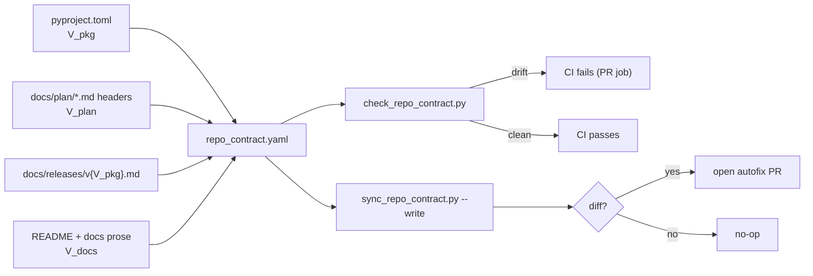

<!-- type: reference -->
# v0.3.6 — Release Truth & Documentation Integrity Automation: Ultimate Release Plan

**Plan type:** Actionable release plan — CI/CD automation for release-truth synchronization, internal-link integrity, and library-first landing-surface discipline
**Audience:** Maintainer, reviewer, documentation contributor, release engineer, Jr. developer
**Target release:** `0.3.6` — stabilization release that ships **before** `0.4.0` in the 0.3.5 → 0.3.6 → 0.4.0 chain
**Current released version:** `0.3.4`
**Branch:** `feat/v0.3.6-release-truth-docs-integrity`
**Status:** Draft
**Last reviewed:** 2026-04-25

> [!IMPORTANT]
> **Scope (binding).** This release ships:
> - a single machine-readable repository contract (`repo_contract.yaml`)
> - a release-truth checker that compares `pyproject.toml`, plan headers, docs surfaces, the active git tag, the GitHub release, and PyPI
> - an autofix script and PR-only workflow that rewrites stale version headers and known outdated internal links
> - an internal markdown-link integrity checker
> - a README/landing-surface checker that enforces library-first ordering and demotes notebook-first wording
> - rename of the public dependency group `notebook` → `examples`
> - a hardened release workflow that blocks tag/version mismatches and verifies the published PyPI version
> - regression fixtures and maintainer documentation for all of the above
>
> It does **not** ship:
> - new statistical methods or new public runtime API
> - framework-specific adapters or runners
> - the `notebooks/` directory removal or sibling-repo migration (that lands in v0.4.0)
> - MkDocs site publication or large README prose redesign beyond enforcing the library-first contract
>
> Driver document: [aux_documents/developer_instruction_repo_scope.md](aux_documents/developer_instruction_repo_scope.md).

> [!NOTE]
> **Cross-release ordering.** v0.3.6 is a stabilization release. It ships **after** v0.3.5 (documentation quality and Diátaxis bucketing) and **before** v0.4.0 (examples-repo split and notebook removal). v0.4.0 consumes the repository contract and the autofix machinery from this release: the notebook-removal commit must leave the contract green, and the cross-repo CI handshake reuses the link checker.

**Companion refs:**

- [implemented/v0_3_5_documentation_quality_improvement_revision_2026_04_24.md](implemented/v0_3_5_documentation_quality_improvement_revision_2026_04_24.md) — predecessor (shipped before)
- [v0_4_0_examples_repo_split_ultimate_plan.md](v0_4_0_examples_repo_split_ultimate_plan.md) — successor (ships after)
- [aux_documents/developer_instruction_repo_scope.md](aux_documents/developer_instruction_repo_scope.md) — driver document

**Builds on:**

- implemented `0.3.5` Diátaxis bucketing under `docs/` (`docs/explanation/`, `docs/how-to/`, `docs/reference/`, `docs/recipes/`)
- implemented `0.3.5` Invariant E (transition banner on every notebook) and the markdownlint + lychee CI gates
- implemented `0.3.4` `ForecastPrepContract` reference at [docs/reference/forecast_prep_contract.md](../reference/forecast_prep_contract.md) — the canonical target for stale-link rewrites
- implemented release tooling under [scripts/check_docs_contract.py](../../scripts/check_docs_contract.py) — extended, not replaced, by this release

---

## 1. Why this plan exists

The repository direction is now correct, but three public-trust failures remain in the surfaces a downstream consumer reads first.

1. **Release truth is inconsistent.** Active plan headers state the current released version is `0.3.5`, while [pyproject.toml](../../pyproject.toml) still declares `0.3.4`. There is no automated check that forces these surfaces (plus tags, GitHub releases, and PyPI) to agree, so drift accumulates silently between releases.
2. **The landing surface is still notebook-centric.** The strategy says notebooks are transitional and migrate out in v0.4.0, but the root README still advertises a `## Notebook Path And Artifact Surfaces` section and `pyproject.toml` exposes a public `notebook` dependency group. New readers see a notebook-first project rather than a deterministic library.
3. **Documentation links are partially migrated.** Internal links still target stale paths — most visibly the moved `docs/forecast_prep_contract.md` (now at [docs/reference/forecast_prep_contract.md](../reference/forecast_prep_contract.md)) and references to the scope-directive doc that omit its actual on-disk path.

The release should let a downstream consumer answer two crisp questions:

> 1. **What is the true current released version of this project across `pyproject.toml`, plan headers, docs prose, the git tag, the GitHub release, and PyPI?**
> 2. **Does the repository landing surface present a library-first deterministic toolkit, rather than a notebook-first project with half-migrated docs?**

> [!IMPORTANT]
> The single largest semantic risk in this release is **presenting drifted release metadata or notebook-first messaging as canonical**. Every CHANGELOG entry, plan header, README section, and CI message in v0.3.6 must treat `pyproject.toml` as the canonical version source and notebooks as supplementary. A green build that still leaks a stale version string or a "primary entry surface = notebook" framing fails the release.

### Planning principles

| Principle | Implication |
| --- | --- |
| Single source of version truth | `pyproject.toml` is the canonical version source. All other surfaces (plan headers, docs prose, release notes, tags, GitHub release, PyPI) are derived and must converge on it or fail CI. |
| Fail fast, autofix where safe | PR CI blocks drift with a clear error; a separate autofix workflow rewrites only safe textual surfaces and opens a PR for review. |
| Library-first landing surface | The root README and quickstart present install, examples, scripts, and docs first. Notebooks are introduced only as supplementary, transitional surfaces. |
| Mechanical documentation repair | Stale-path rewrites and version-header sync are encoded in `repo_contract.yaml` and applied by a deterministic script — never by ad-hoc hand edits. |
| Additive release discipline | This release adds guards, fixers, and workflow logic only. It does not change scientific outputs, public runtime semantics, or frozen Pydantic field shapes. |
| Autofix never writes to main | Every autofix run produces a pull request via `peter-evans/create-pull-request`. No workflow has direct push access to `main`. |
| Deterministic, local-first checks on PRs | PR CI runs only checks that work offline against the repository tree. PyPI and GitHub-release verification run only in tag/release workflows. |
| Internal-link integrity is a release blocker | Repository-relative markdown links must resolve against the on-disk tree at release time; an unresolved internal link fails CI. |

### Architecture rules

- The core package remains **framework-agnostic**: no `darts`, `mlforecast`, `statsforecast`, or `nixtla` imports at any tier (runtime, optional extras, dev, CI).
- `pyproject.toml` is the **canonical version source** for all release automation; no other file may be authored as an independent version origin.
- Autofix workflows **never push directly to `main`**: they always open a pull request with a narrow, reviewable diff.
- PR CI is **deterministic and local-first**: it must pass without internet access against PyPI, GitHub Releases API, or external link targets.
- Remote PyPI and GitHub-release verification runs **only in tag/release workflows**, where it is allowed to fail the publish step.
- Notebook references in the root `README.md` are allowed only as **supplementary, transitional** notes; the long-term primary entry surface is scripts, examples, and reference docs.
- Repository-relative markdown links **must resolve against the repo tree** without depending on GitHub UI behavior; broken internal links fail CI.

### Feature inventory

| ID | Feature | Phase | Priority | Status |
| --- | --- | --- | --- | --- |
| RTI-F00 | Repository contract (`repo_contract.yaml`) and typed loader | 0 | P0 | Done (2026-04-25) |
| RTI-F01 | Release-truth checker (`scripts/check_repo_contract.py`) | 1 | P0 | Done (2026-04-25) |
| RTI-F02 | Release-truth autofixer (`scripts/sync_repo_contract.py --write`) | 1 | P0 | Done (2026-04-25) |
| RTI-F03 | Internal markdown-link checker (`scripts/check_markdown_links.py`) | 2 | P0 | Not started |
| RTI-F04 | README / landing-surface checker (`scripts/check_readme_surface.py`) | 2 | P0 | Not started |
| RTI-F05 | Notebook dependency-group rename (`notebook` → `examples`) | 2 | P1 | Not started |
| RTI-F06 | Release workflow hardening (tag/version block, release-mode contract check) | 3 | P0 | Not started |
| RTI-F07 | Post-release PyPI verification (`scripts/check_published_release.py`) | 3 | P0 | Not started |
| RTI-F08 | Scheduled/dispatch autofix PR workflow (`.github/workflows/repo-autofix.yml`) | 4 | P1 | Not started |
| RTI-F09 | Regression fixtures for checker and autofixer | 5 | P0 | Not started |
| RTI-F10 | Maintainer docs (`docs/maintenance/repository_contract.md`) | 6 | P1 | Not started |
| RTI-F11 | Release engineering: version bump, CHANGELOG, `docs/releases/v0.3.6.md` | 6 | P0 | Not started |

---

### Reviewer acceptance block

`0.3.6` is successful only if all of the following are visible together:

1. **Repository contract**
   - A single `repo_contract.yaml` exists at the repo root with `current_released_version`, `next_planned_version`, `canonical_paths`, `deprecated_paths`, `landing_surface`, and `dependency_group_policy` keys.
   - A typed loader parses the file and is consumed by every checker and the autofixer.
   - The contract is referenced from [docs/maintenance/repository_contract.md](../maintenance/repository_contract.md) and from the root README's maintainer section.

2. **Release truth**
   - PR CI fails when `V_plan ≠ V_pkg`, when a docs surface claims a released version newer than `V_pkg`, or when `docs/releases/v{V_pkg}.md` is missing.
   - The release workflow refuses to build or publish when `github.ref_name != f"v{V_pkg}"`.
   - A release-mode rerun of the contract checker runs against the tag's checked-out tree before publish.

3. **Internal-link integrity**
   - `scripts/check_markdown_links.py` resolves every repo-relative markdown link in `README.md`, `docs/**/*.md`, and `llms.txt` against the on-disk tree.
   - Known stale links (`docs/forecast_prep_contract.md`, scope-directive references missing the actual on-disk path) are listed in `repo_contract.yaml` under `deprecated_paths` and rewritten to canonical targets by the autofixer.
   - The checker emits machine-readable JSON usable for CI annotations.

4. **Library-first landing surface**
   - `scripts/check_readme_surface.py` enforces install → minimal example → scripts → docs ordering at the top of `README.md`.
   - The forbidden heading `## Notebook Path And Artifact Surfaces` no longer appears in the root README.
   - Any remaining notebook mention in the root README is gated behind the words `supplementary` or `transitional` and references the v0.4.0 migration plan.

5. **Notebook dep-group rename**
   - `pyproject.toml` no longer exposes a public `[project.optional-dependencies] notebook` group; the equivalent tooling is renamed to `examples`.
   - The contract's `dependency_group_policy.forbidden_public_names` list explicitly forbids `notebook`.
   - Existing internal documentation referencing `pip install -e .[notebook]` is rewritten to `pip install -e .[examples]`.

6. **Autofix capability**
   - `scripts/sync_repo_contract.py --write` rewrites only configured surfaces: plan headers, deprecated-path links, README headings/wording, and the dep-group rename.
   - The fixer is idempotent: a second run on a clean tree produces no diff.
   - The fixer never edits `src/`, `tests/`, fixture JSON, or release notes prose outside the configured rewrite zones.

7. **Release-workflow hardening**
   - The release workflow parses `V_pkg` from `pyproject.toml` and asserts `github.ref_name == f"v{V_pkg}"` as the first step after checkout.
   - The release workflow asserts `docs/releases/v{V_pkg}.md` exists.
   - The release workflow runs `check_repo_contract.py` in release mode before any build or publish step.

8. **Post-release verification**
   - After publish, `scripts/check_published_release.py` queries PyPI's JSON API and asserts the latest version equals `V_pkg`, with a bounded retry window for index propagation.
   - The script also verifies that the GitHub release exists for tag `v{V_pkg}`.
   - Failure of either check fails the release workflow with a clear error message.

9. **Autofix PR workflow**
   - `.github/workflows/repo-autofix.yml` supports `workflow_dispatch` and an optional weekly `schedule` trigger.
   - A non-empty diff produces a PR with title `chore: sync repository contract and documentation links`.
   - The workflow uses `peter-evans/create-pull-request@v7` (or current pinned version) with no direct write access to `main`.

10. **Regression fixtures**
    - `tests/fixtures/repo_contract/` contains a deliberately drifted mini-tree (stale version, broken link, forbidden heading, `notebook` group) that fails the checker.
    - The same fixture, after running the autofixer, passes the checker.
    - A unit test asserts the fixer is idempotent on the corrected fixture.

11. **Maintainer documentation**
    - [docs/maintenance/repository_contract.md](../maintenance/repository_contract.md) explains how to run each check and fixer locally with `uv run`.
    - The page documents how to triage and merge an autofix PR.
    - The page links to `repo_contract.yaml` as the single configuration surface.

12. **Release engineering**
    - `pyproject.toml` is bumped to `0.3.6`.
    - `CHANGELOG.md` carries a v0.3.6 entry framing the release as "release-truth + docs-integrity automation; no runtime API changes".
    - [docs/releases/v0.3.6.md](../releases/v0.3.6.md) exists and is referenced by the contract.
    - All fixture rebuild scripts under `scripts/` still run clean on the release branch.

---

## 2. Theory-to-code map

> [!IMPORTANT]
> Every junior developer MUST read this section before writing any code.
> This release is small in surface area but high in trust risk: a wrong canonical-version mapping or a missed autofix rewrite zone will silently re-introduce the same drift this release is meant to eliminate.

### 2.1. Notation

The contract is governed by a small set of named quantities. Each maps to a concrete enforcement script:

- $V_\text{pkg}$ — version string in [pyproject.toml](../../pyproject.toml). Canonical source. Read by `check_repo_contract.py`, `check_published_release.py`, and the release workflow.
- $V_\text{plan}$ — the `Current released version` value declared in active plan headers (`docs/plan/*.md`). Verified by `check_repo_contract.py`.
- $V_\text{docs}$ — version strings in user-facing docs prose: `README.md`, `docs/quickstart.md`, `docs/releases/*.md` headers, badges. Verified by `check_repo_contract.py`.
- $V_\text{tag}$ — the git tag triggering the release workflow, accessed as `github.ref_name`. Verified by the release workflow against $V_\text{pkg}$.
- $V_\text{pypi}$ — the latest version exposed by PyPI for the project. Verified post-publish by `check_published_release.py`.
- $L_\text{internal}$ — the set of repository-relative markdown links across `README.md`, `docs/**/*.md`, and `llms.txt`. Verified by `check_markdown_links.py`.
- $N_\text{root}$ — the set of notebook references appearing in the root `README.md`. Verified by `check_readme_surface.py`.
- $G_\text{nb}$ — the public dependency-group name used for notebook/example tooling in `pyproject.toml`. Verified by `check_repo_contract.py`.

### 2.2. Core algorithm

The release introduces five repository services, all driven by a single configuration file `repo_contract.yaml`:

1. **`scripts/check_repo_contract.py`** — read $V_\text{pkg}$ from `pyproject.toml`; assert $V_\text{plan} = V_\text{pkg}$ and that no $V_\text{docs}$ surface claims a version greater than $V_\text{pkg}$; assert `docs/releases/v{V_pkg}.md` exists; assert no path under `repo_contract.yaml.deprecated_paths` is referenced anywhere in tracked markdown; assert $G_\text{nb}$ is not in `dependency_group_policy.forbidden_public_names`. In release mode (invoked from the tag workflow), additionally assert $V_\text{tag} = V_\text{pkg}$.
2. **`scripts/sync_repo_contract.py`** — given `repo_contract.yaml`, rewrite only configured surfaces: plan-header `Current released version` lines, deprecated-path references in markdown, the forbidden README heading, and the `notebook` → `examples` dep-group rename. The fixer must be idempotent and never edit `src/`, `tests/`, or fixture JSON.
3. **`scripts/check_markdown_links.py`** — for every $l \in L_\text{internal}$, resolve $l$ relative to its source file location; fail when the target does not exist. Emit JSON for CI annotations.
4. **`scripts/check_readme_surface.py`** — verify that the root `README.md` opens with install/quickstart/scripts/docs sections before any notebook reference; reject the forbidden heading `## Notebook Path And Artifact Surfaces`; require any remaining notebook mention to include the words `supplementary` or `transitional`.
5. **`scripts/check_published_release.py`** — invoked by the release workflow after publish: query the PyPI JSON API with bounded retry, assert the latest released version equals $V_\text{pkg}$, and assert a GitHub release exists for tag `v{V_pkg}`.

`repo_contract.yaml` is the **single source of truth**: every checker reads it, the autofixer is the only writer of the surfaces it covers, and changes to canonical paths or forbidden surfaces are reviewed as one diff against this file.

### 2.3. Mathematical invariants

> [!IMPORTANT]
> **Invariant A — Release truth.** For any release candidate on `main`:
> $$V_\text{plan} = V_\text{pkg} \quad \text{and} \quad \forall v \in V_\text{docs}: v \le V_\text{pkg}.$$
> For any tag-triggered release:
> $$V_\text{tag} = V_\text{pkg} \quad \text{and, after publish,} \quad V_\text{pypi} = V_\text{pkg}.$$
> Enforced by: `check_repo_contract.py` (PR + release mode), the first step of `.github/workflows/release.yml`, and `check_published_release.py` (post-publish).

> [!IMPORTANT]
> **Invariant B — Library-first landing surface.** At the repository root, the README presents install/example/scripts/docs surfaces before any notebook reference, and the public dependency-group name is non-notebook:
> $$G_\text{nb} \ne \texttt{"notebook"} \quad \text{and} \quad \forall n \in N_\text{root}: n \text{ is labelled } \texttt{supplementary} \text{ or } \texttt{transitional}.$$
> Enforced by: `check_readme_surface.py` and the `dependency_group_policy` block in `repo_contract.yaml`, both invoked from the `repo-contract` CI job.

> [!IMPORTANT]
> **Invariant C — Internal-link integrity.** For all repository-relative markdown links:
> $$\forall l \in L_\text{internal}: \texttt{resolve}(l) \text{ exists on disk}.$$
> Enforced by: `check_markdown_links.py` invoked from the `repo-contract` CI job; rewrites of known stale paths are mechanized via `repo_contract.yaml.deprecated_paths` and applied by `sync_repo_contract.py`.

---

## 3. Phased delivery

### Phase 0 — Repository contract and canonical metadata

**Scope.** Land the single machine-readable contract and document the synchronization surface before any check or fixer is wired up.

**Status (2026-04-25).** Completed for RTI-F00 only.

**Completion check (RTI-F00):**

- `repo_contract.yaml` added at repo root with Phase 0 keys and values aligned to the current release (`0.3.4`).
- Typed loader added at `scripts/_repo_contract.py` with schema validation and explicit malformed-contract errors.
- Contract policy reference added at [docs/maintenance/repository_contract.md](../maintenance/repository_contract.md).

**Acceptance criteria:**

- `repo_contract.yaml` exists at the repo root and contains:
  - `current_released_version` (matches $V_\text{pkg}$ on the release branch)
  - `next_planned_version`
  - `canonical_paths.forecast_prep_contract: docs/reference/forecast_prep_contract.md`
  - `canonical_paths.scope_directive: docs/plan/aux_documents/developer_instruction_repo_scope.md`
  - `deprecated_paths` map with `docs/forecast_prep_contract.md → docs/reference/forecast_prep_contract.md` and any other known stale entries
  - `landing_surface.notebook_policy: supplementary_only`
  - `landing_surface.forbidden_root_headings: ["Notebook Path And Artifact Surfaces"]`
  - `dependency_group_policy.forbidden_public_names: ["notebook"]`
  - `dependency_group_policy.rename_map: {notebook: examples}`
- A typed loader exists under `scripts/_repo_contract.py` (or equivalent) and is imported by every Phase 1+ script.
- The contract path policy is referenced from [docs/maintenance/repository_contract.md](../maintenance/repository_contract.md) (created in Phase 6).
- No script under `src/forecastability/` imports the loader — the contract is a maintainer tool, not a runtime concern.

### Phase 1 — Release-truth checker and autofixer

**Scope.** Turn version drift into a deterministic check and a safe rewrite. This is the highest-priority phase.

**Acceptance criteria:**

- `scripts/check_repo_contract.py` validates $V_\text{pkg}$ vs $V_\text{plan}$, $V_\text{docs}$ ≤ $V_\text{pkg}$, presence of `docs/releases/v{V_pkg}.md`, absence of any `repo_contract.yaml.deprecated_paths` entries in tracked markdown, and the `dependency_group_policy`.
- `scripts/sync_repo_contract.py --write` performs only the rewrites configured in the contract:
  - aligns plan-header `Current released version` lines to $V_\text{pkg}$
  - rewrites every reference in tracked markdown matching `deprecated_paths` keys to their canonical targets (in particular `docs/forecast_prep_contract.md` → `docs/reference/forecast_prep_contract.md`)
  - fixes scope-directive references that omit the on-disk path so they resolve to [docs/plan/aux_documents/developer_instruction_repo_scope.md](aux_documents/developer_instruction_repo_scope.md)
  - removes the forbidden README heading and replaces it with a short supplementary note
  - renames the dependency group `notebook` → `examples` in `pyproject.toml`
- The fixer is idempotent: a second `--write` run on the clean tree produces no diff.
- The fixer must not edit `src/`, `tests/`, fixture JSON, or scientific output artifacts.
- Both scripts return non-zero exit codes on failure and emit a clear, single-line summary to stdout.

### Phase 2 — Documentation link integrity and landing-surface discipline

**Scope.** Enforce internal-link integrity and rewrite the root README so it is library-first.

**Acceptance criteria:**

- `scripts/check_markdown_links.py` resolves every repo-relative markdown link in `README.md`, `docs/**/*.md`, and `llms.txt`; ignores external `http(s)://` links (already covered by lychee) and anchors in v1; emits JSON for CI annotations.
- `scripts/check_readme_surface.py` verifies the root README opens with install → minimal example → scripts → docs and that no notebook reference precedes them.
- The forbidden heading `## Notebook Path And Artifact Surfaces` is removed from the root README and replaced with a one-paragraph supplementary note pointing at the v0.4.0 migration plan.
- Any remaining notebook mention in the root README contains the literal words `supplementary` or `transitional`.
- `pyproject.toml` no longer declares a public `[project.optional-dependencies] notebook` group; the equivalent tooling lives under `examples`. Internal docs that previously suggested `pip install -e .[notebook]` are rewritten to `pip install -e .[examples]`.
- All known stale-link cleanups land here: the scope-directive path resolves to the actual on-disk file, and every `docs/forecast_prep_contract.md` reference is rewritten to `docs/reference/forecast_prep_contract.md`.

### Phase 3 — CI/CD workflow hardening (release-blocking + post-release verification)

**Scope.** Wire the contract into PR CI and the release workflow, and verify the published artifact.

**Acceptance criteria:**

- `.github/workflows/ci.yml` gains a `repo-contract` job that runs on `pull_request` and `push` to `main` and executes, in order: `uv sync --dev`, `uv run python scripts/check_repo_contract.py`, `uv run python scripts/check_markdown_links.py`, `uv run python scripts/check_readme_surface.py`. The job must complete offline (no PyPI or external HTTP calls).
- `.github/workflows/release.yml` is hardened:
  - parses $V_\text{pkg}$ from `pyproject.toml` immediately after checkout
  - fails fast when `github.ref_name != f"v{V_pkg}"`
  - asserts `docs/releases/v{V_pkg}.md` exists
  - reruns `check_repo_contract.py` in `--release-mode` against the tag's tree before any build step
- `scripts/check_published_release.py` is invoked **after** the publish step:
  - queries `https://pypi.org/pypi/<project>/json` with bounded retry/backoff
  - asserts `info.version == V_pkg`
  - asserts a GitHub release exists for tag `v{V_pkg}` (via `gh api` or the GitHub REST API)
  - exits non-zero on mismatch, failing the workflow run
- Release-mode and post-publish failures produce actionable error messages identifying which surface drifted.

### Phase 4 — Autofix PR workflow and maintainer ergonomics

**Scope.** Automate low-risk repair via PR-only writes and document the local UX.

**Acceptance criteria:**

- `.github/workflows/repo-autofix.yml` exists with `workflow_dispatch` and an optional `schedule` trigger (resolution of cadence is tracked in section 5, open question 1).
- The workflow runs `uv run python scripts/sync_repo_contract.py --write`; if `git diff --quiet` returns non-zero, it opens a PR via `peter-evans/create-pull-request@v7` with title `chore: sync repository contract and documentation links` and a body listing every rewritten file.
- The workflow has no permissions to push to `main`; PR creation is the only write path.
- Local maintainer commands are documented in [docs/maintenance/repository_contract.md](../maintenance/repository_contract.md):
  - `uv run python scripts/check_repo_contract.py`
  - `uv run python scripts/sync_repo_contract.py --write`
  - `uv run python scripts/check_markdown_links.py`
  - `uv run python scripts/check_readme_surface.py`

### Phase 5 — Regression fixtures and tests

**Scope.** Lock the checker and fixer behavior under unit and end-to-end tests.

**Acceptance criteria:**

- `tests/test_repo_contract.py` covers: version extraction from `pyproject.toml`, plan-header parsing, deprecated-path rewrites in markdown, forbidden-heading detection, and dep-group rename.
- `tests/fixtures/repo_contract/broken/` contains a mini-tree with deliberate drift (stale version, broken link, forbidden heading, `notebook` group). The checker fails on it.
- `tests/fixtures/repo_contract/fixed/` contains the same mini-tree post-autofix; the checker passes on it. A unit test asserts a second `--write` run on `fixed/` produces no diff (idempotency).
- An end-to-end smoke test copies `broken/` to a temp dir, runs `sync_repo_contract.py --write`, then runs all three checkers and asserts they all pass.
- The new tests are wired into the default `uv run pytest` invocation and run in CI.

### Phase 6 — Release engineering (version bump, CHANGELOG, release notes)

**Scope.** Land the release-engineering surfaces required by the contract.

**Acceptance criteria:**

- `pyproject.toml` is bumped from `0.3.4` to `0.3.6`.
- `src/forecastability/__init__.py` `__version__` (if present) is updated to `0.3.6`.
- `CHANGELOG.md` carries a v0.3.6 entry framed as "release-truth + documentation-integrity automation; no runtime API changes" and listing each `RTI-Fxx` deliverable.
- [docs/releases/v0.3.6.md](../releases/v0.3.6.md) is created with the full release notes and is referenced by `repo_contract.yaml.current_released_version` after the bump.
- The root `README.md` version badge or version mention (if any) is updated by the autofixer, not by hand.
- All existing fixture rebuild scripts (`scripts/rebuild_*_regression_fixtures.py`) still run clean on the release branch.
- The git tag `v0.3.6` is created and pushed only after the contract checker passes in release mode.

---

## 4. Out of scope

- **Notebook migration to the sibling examples repository** — that lands in v0.4.0; this release only demotes notebook surfaces in the root README and renames the dep group.
- **Removal of the `notebooks/` directory** — also v0.4.0; the directory remains in v0.3.6 as a transitional surface.
- **New statistical surfaces, public runtime API, or framework adapters** — no `to_<framework>_spec()` / `fit_<framework>()` helpers; no changes to frozen Pydantic field shapes.
- **Optional extras for downstream forecasting frameworks** — no `[darts]`, `[mlforecast]`, `[statsforecast]`, or `[nixtla]` extras are added or modified.
- **Major README prose redesign** — beyond enforcing the library-first contract, the README is not rewritten.
- **MkDocs site publishing** — the docs site build remains as configured by v0.3.5; this release does not flip a publication switch.
- **External link checking** — already covered by lychee in v0.3.5; this release adds only repo-relative internal-link integrity.

---

## 5. Open questions

1. Should the autofix workflow run on a weekly `schedule` trigger, or only on `workflow_dispatch`? Weekly catches slow drift but generates noise PRs; manual-only minimizes PR churn but relies on maintainer memory.
2. What retry window is acceptable for `check_published_release.py` against PyPI's index propagation delay? Proposed default: 5 attempts, exponential backoff, total cap 5 minutes — needs maintainer confirmation before Phase 3 closes.
3. Should the scope-directive doc remain at [docs/plan/aux_documents/developer_instruction_repo_scope.md](aux_documents/developer_instruction_repo_scope.md), or move to a stable non-`aux_documents` path that survives plan archival? v0.3.6 only repairs the broken links; a path move is deferred unless decided here.
4. Should `check_markdown_links.py` validate anchor fragments (`#section`) in v0.3.6, or defer that to a later release? Anchor validation is more expensive and requires a markdown parser.
5. Should the contract checker also assert that `docs/recipes/**` examples remain free of `darts`/`mlforecast`/`statsforecast`/`nixtla` runtime imports, or is the existing architecture-boundary test sufficient?

---

## 6. Suggested file list

### New scripts

- `scripts/check_repo_contract.py`
- `scripts/sync_repo_contract.py`
- `scripts/check_markdown_links.py`
- `scripts/check_readme_surface.py`
- `scripts/check_published_release.py`
- `scripts/_repo_contract.py` — typed loader shared by the above

### New configuration

- `repo_contract.yaml` (repo root)

### New documentation

- [docs/maintenance/repository_contract.md](../maintenance/repository_contract.md)
- [docs/releases/v0.3.6.md](../releases/v0.3.6.md)

### New tests and fixtures

- `tests/test_repo_contract.py`
- `tests/fixtures/repo_contract/broken/`
- `tests/fixtures/repo_contract/fixed/`

### Workflow changes

- update `.github/workflows/ci.yml` — add the `repo-contract` job
- update `.github/workflows/release.yml` — add tag-vs-version block, release-mode contract check, and post-publish PyPI/GitHub-release verification
- add `.github/workflows/repo-autofix.yml` — `workflow_dispatch` (and optionally `schedule`); opens a PR via `peter-evans/create-pull-request`

### Existing files modified by the autofixer (not by hand)

- `pyproject.toml` — version bump, dep-group rename
- `README.md` — forbidden-heading removal, library-first ordering
- active plan headers under `docs/plan/` — `Current released version` sync
- markdown files under `docs/**` — deprecated-path rewrites
