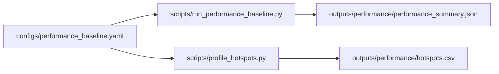

<!-- type: reference -->
# v0.4.1 — Performance Bottleneck Elimination: Ultimate Release Plan

**Plan type:** Actionable release plan — benchmark-first performance hardening for deterministic AMI/pAMI triage  
**Audience:** Maintainer, reviewer, statistician reviewer, performance implementer, Jr. developer  
**Target release:** `0.4.1` — ships after the `0.4.0` examples-repo split  
**Current released version:** `0.4.0`  
**Branch:** `feat/v0.4.1-performance-bottleneck-elimination`  
**Status:** Draft  
**Last reviewed:** 2026-04-30

> [!IMPORTANT]
> **Scope (binding).** This release ships a measured performance baseline, a code-evidenced bottleneck inventory, correctness gates for significance services, Python-level bottleneck elimination, and an optional-native-acceleration design document.
> It does **not** ship downstream forecasting integrations, framework-specific fit helpers, or a Rust extension inside the core package.
> Driver document: [aux_documents/developer_instruction_repo_scope.md](../plan/aux_documents/developer_instruction_repo_scope.md).

> [!NOTE]
> **Cross-release ordering.** This plan follows `v0.4.0` because the core repository must stay library-first after notebooks and heavy examples move to the sibling examples repository. Performance work should land only after that split, so benchmark results are not distorted by notebook churn or example-repository migration.

**Companion refs:**

- [v0.4.0 — Examples Repo Split: Ultimate Release Plan](implemented/v0_4_0_examples_repo_split_ultimate_plan.md) — predecessor
- [acceptance_criteria.md](acceptance_criteria.md) — shared scientific and verification gates
- [aux_documents/developer_instruction_repo_scope.md](../plan/aux_documents/developer_instruction_repo_scope.md) — scope directive
- [Python Packaging User Guide — Entry points specification](https://packaging.python.org/en/latest/specifications/entry-points/) — optional plugin discovery reference
- [maturin project](https://github.com/PyO3/maturin) — optional Rust/PyO3 packaging reference

**Builds on:**

- `run_triage` and `TriageRequest` from `src/forecastability/use_cases/run_triage.py` and `src/forecastability/triage/models.py`
- legacy AMI/pAMI kernels in `src/forecastability/metrics/metrics.py`
- generic raw/partial curve services in `src/forecastability/services/raw_curve_service.py` and `src/forecastability/services/partial_curve_service.py`
- surrogate-band services in `src/forecastability/services/significance_service.py`
- KSG-II fingerprint geometry in `src/forecastability/services/ami_information_geometry_service.py`
- covariant bundle orchestration in `src/forecastability/use_cases/run_covariant_analysis.py`
- batch workbench orchestration in `src/forecastability/use_cases/run_batch_forecastability_workbench.py`

---

## 1. Why this plan exists

The package is now broad enough that performance cost is no longer concentrated in one function. The high-cost paths are split across legacy AMI/pAMI, generic raw/partial curves, phase-surrogate significance, KSG-II fingerprint geometry, covariant method fan-out, and rolling-origin loops. Without a measured plan, isolated optimizations will move one benchmark while leaving the user-visible workflows slow.

This release makes performance a deterministic, reviewable surface. It first establishes repeatable timing and memory baselines, then removes avoidable work without changing AMI/pAMI semantics. Native acceleration remains a later optional plugin path, not a core-package rewrite.

The planning research read the current hot paths under `src/forecastability/metrics/`, `src/forecastability/services/`, `src/forecastability/diagnostics/`, `src/forecastability/use_cases/`, and the rolling-origin helpers. The plan therefore separates bottleneck elimination into four categories: work we can avoid, Python kernels we can tighten, alternate estimators we can expose only under honest names, and native kernels that may justify an out-of-tree Rust plugin after parity gates exist.

The release should let a downstream consumer answer two crisp questions:

1. Which forecastability workflows are slow, by how much, and on which inputs?
2. Which bottlenecks can be eliminated without weakening horizon-specific AMI/pAMI, surrogate significance, or rolling-origin leakage controls?

> [!IMPORTANT]
> The largest semantic risk is replacing a scientifically meaningful estimator with a faster but different estimand while keeping the same name. GCMI, Pearson, rank correlation, distance correlation, approximate nearest neighbors, or RF residualization may be useful explicit alternatives, but they must not silently replace AMI or linear-residual pAMI.

### Planning principles

| Principle | Implication |
| --- | --- |
| Benchmark before rewrite | Add repeatable timing and profiling artifacts before changing algorithms. Every claimed improvement needs a before/after baseline. |
| Correctness before speed | Fix significance-service surrogate-count validation before optimizing those services. Faster invalid bands are a regression. |
| Semantics-preserving first | Prefer work avoidance, caching, validation hoisting, preallocation, and deterministic parallelism before estimator replacement. |
| Additive public surface | Any public control, such as explicit significance mode or performance config, must default to current behavior. |
| Train-window discipline | Rolling-origin diagnostics must keep AMI/pAMI, scaling, residualization, and covariate diagnostics inside each train window only. |
| Optional native only | Rust acceleration belongs behind kernel ports or entry-point plugins, not as a mandatory core dependency. |
| Deterministic ordering | Parallel implementations must preserve fixed seeds, result order, and stable fixture outputs. |
| Framework boundary | No Darts, MLForecast, StatsForecast, Nixtla, or framework-fitting helpers are introduced. |

### Architecture rules

- The core package remains **framework-agnostic**: no `darts`, `mlforecast`, `statsforecast`, or `nixtla` imports at any tier.
- AMI/pAMI remain **horizon-specific**: lag `h` is still computed from exactly `[:-h]` and `[h:]` aligned pairs unless an existing documented lag-0 diagnostic path is explicitly requested.
- Surrogate significance must enforce `n_surrogates >= 99` at every public and service-level entry point that returns significance bands.
- Rolling-origin diagnostics compute on train windows only; no pre-split scaling, residualization, rank-normalization, or surrogate fitting may use holdout values.
- New performance scripts write to `outputs/performance/**`; regression fixtures remain under `docs/fixtures/**`.
- Native acceleration, if prototyped, is out-of-tree as a separate distribution discovered by entry points such as `forecastability.kernels`.
- The pure-Python path remains authoritative and installed by default.
- No new notebooks are added to this repository.

### Feature inventory

| ID | Feature | Phase | Priority | Status |
| --- | --- | --- | --- | --- |
| PBE-F00 | Significance-service correctness gate (`n_surrogates >= 99`) | 0 | P0 | Not started |
| PBE-F01 | Performance baseline config and timing script | 1 | P0 | Not started |
| PBE-F02 | Hotspot profiling script and report artifacts | 1 | P0 | Not started |
| PBE-F03 | Covariant method-subset work avoidance | 2 | P0 | Not started |
| PBE-F04 | Single-horizon rolling-origin compute path | 2 | P0 | Not started |
| PBE-F05 | Surrogate generation/evaluation reuse and preallocation | 3 | P1 | Not started |
| PBE-F06 | pAMI lag-design/residualization optimization | 3 | P1 | Not started |
| PBE-F07 | Fingerprint geometry parallel/preset optimization | 3 | P1 | Not started |
| PBE-F08 | Lagged-exog surrogate parallelism and distance-scorer guardrails | 3 | P1 | Not started |
| PBE-F09 | Optional native-kernel plugin design | 4 | P2 | Not started |
| PBE-F10 | Performance decision matrix and optimization backlog | 4 | P0 | Not started |
| PBE-F11 | Performance docs, budgets, and release report | 5 | P0 | Not started |

---

### Reviewer acceptance block

`0.4.1` is successful only if all of the following are visible together:

1. **Correct significance guards**
   - `compute_significance_bands_generic(..., n_surrogates=98)` raises before surrogate generation.
   - `compute_significance_bands_transfer_entropy(..., n_surrogates=98)` raises before surrogate generation.
   - Legacy `compute_significance_bands()` behavior remains unchanged.

2. **Benchmark baseline**
   - `configs/performance_baseline.yaml` defines small, medium, and large deterministic cases.
   - `scripts/run_performance_baseline.py` writes `outputs/performance/performance_summary.json`.
   - The JSON includes command metadata, Python/platform metadata, git SHA when available, config hash, wall time, CPU time, and peak memory.

3. **Hotspot report**
   - `scripts/profile_hotspots.py` writes `outputs/performance/hotspots.csv` and `.prof` artifacts.
   - The profiling targets include every supported import/use-case surface, packaged command, and live repo script listed in the profiling coverage matrix.
   - The report separates estimator time from orchestration/reporting time.
   - The report records skipped targets with explicit reasons, for example optional dependency unavailable, network/data unavailable, archived script, or generated fixture path.

4. **Covariant work avoidance**
   - Requesting only `cross_ami` does not compute pCrossAMI.
   - Requesting only `cross_pami` does not compute CrossAMI significance bands.
   - Summary-row semantics and ranking remain unchanged for method sets that previously computed both.

5. **Rolling-origin single-horizon path**
   - Rolling-origin code no longer computes a full curve when only one horizon is consumed.
   - Tests prove lag `h` still maps to `curve[h - 1]` in the full-curve path, including `random_state + h` seed behavior.
   - Holdout perturbation after an origin does not change train-window diagnostics.

6. **Surrogate discipline**
   - Phase-surrogate target matrices may be reused across drivers only when the null remains “phase-randomized target, fixed driver/source” and current per-driver seed-stream parity is preserved; otherwise this is a Monte Carlo design change, not a bitwise optimization.
   - Raw, partial, TE, exogenous, and geometry surrogate nulls are not pooled together.
   - CrossAMI bands are never reused for pCrossAMI or TE, and geometry shuffle-surrogate `tau` is never replaced by phase-surrogate bands.
   - Parallel `n_jobs=1` and `n_jobs>1` outputs match for fixed seeds within documented tolerances.

7. **pAMI optimization safety**
   - Lag-design or residualization caches are per-series and per-train-window, not global.
   - Any closed-form least-squares path includes the intercept and matches current `LinearRegression()` residuals within tolerance.
   - Linear residual pAMI remains the default pAMI estimand.
   - RF/ExtraTrees residualization remains explicit and is not used as a performance replacement.

8. **Fingerprint geometry safety**
   - KSG-II keeps exact Chebyshev-neighbor semantics, one-shot jitter, median over `k_list`, shuffle-surrogate bias, 90th percentile `tau`, corrected clamp, and strict acceptance threshold.
   - A fitted neighbor structure is not reused across horizons because the paired sample matrix changes with `h`.
   - `AmiInformationGeometryConfig.n_jobs` is used consistently in scripts that opt into parallel geometry.
   - Smoke-mode configs reduce workload only when artifact plumbing is under test.

9. **Native acceleration boundary**
   - No Rust/maturin dependency is added to core runtime, optional extras, dev dependencies, or CI gates in this release.
   - The design specifies an out-of-tree `dependence-forecastability-accel` package discovered through Python package entry points.
   - Native plugin contracts are curve-level kernels, not scalar `DependenceScorer` callbacks.
   - The pure-Python implementation remains the default and parity oracle.

10. **Verification gates**
    - `uv run pytest -q -ra`
    - `uv run ruff check .`
    - `uv run ty check`
    - Relevant fixture rebuild scripts run when result surfaces or examples change.

---

## 2. Theory-to-code map

> [!IMPORTANT]
> Every junior developer MUST read this section before writing code.
> This release is low in public API ambition but high in semantic risk: most performance shortcuts are wrong if they change the statistical null, lag alignment, or train-window boundary.

### 2.1. Notation

- $y_t$ — target series value at time $t$; maps to `TriageRequest.series`.
- $x^{(j)}_t$ — exogenous driver `j`; maps to `drivers[driver_name]` or `TriageRequest.exog`.
- $h$ — forecast horizon or lag, with predictive horizons in $\{1, \ldots, H\}$.
- $I_h$ — AMI at horizon $h$; maps to `AnalyzeResult.raw[h - 1]`.
- $\tilde{I}_h$ — pAMI at horizon $h$ after residualization on intermediate target lags; maps to `AnalyzeResult.partial[h - 1]`.
- $S_b$ — phase-randomized surrogate series for surrogate index $b$.
- $B$ — number of surrogate draws; must satisfy $B \ge 99$ for significance claims.
- $G_h$ — KSG-II geometry AMI at horizon $h$; maps to `AmiInformationGeometry.curve[*].ami_raw`.
- $\tau_h$ — geometry surrogate threshold; maps to `AmiGeometryCurvePoint.tau`.

### 2.2. Core algorithm

The performance release preserves the current triage algorithm:

1. Validate the target and optional exogenous series.
2. Build a readiness report before expensive compute.
3. Route to univariate or exogenous analysis.
4. Compute raw AMI/CrossAMI curves by aligning `past = predictor[:-h]` and `future = target[h:]`.
5. Compute pAMI/pCrossAMI by residualizing against intermediate target lags `1..h-1`.
6. Compute surrogate significance bands only when the route requests them and `n_surrogates >= 99`.
7. Interpret curves into deterministic forecastability, directness, seasonality, and recommendation surfaces.
8. For fingerprint routing, compute KSG-II AMI geometry, shuffle-surrogate bias, corrected profile, and routing features.

Performance work changes *how much unnecessary work is performed*, not what the evidence means.

### 2.3. Mathematical invariants

> [!IMPORTANT]
> Invariant A — horizon alignment:
> $I_h = I(y_{t-h}; y_t)$ for $h \ge 1$.
> Enforced by: `compute_ami`, `compute_raw_curve`, curve-alignment tests, and single-horizon parity tests.

> [!IMPORTANT]
> Invariant B — pAMI conditioning set:
> $\tilde{I}_h$ conditions only on intermediate target lags $\{y_{t-1}, \ldots, y_{t-h+1}\}$ in the linear-residual approximation.
> Enforced by: `compute_pami_linear_residual`, `compute_partial_curve`, pCrossAMI tests, and residualization parity tests.

> [!IMPORTANT]
> Invariant C — surrogate-count floor:
> $B \ge 99$ for every significance-band surface.
> Enforced by: legacy, generic, and TE significance tests.

> [!IMPORTANT]
> Invariant D — rolling-origin train-only diagnostics:
> diagnostics at origin $o$ may depend on $\{y_t : t < o\}$ and matching train-window exog only.
> Enforced by: holdout-perturbation tests.

> [!IMPORTANT]
> Invariant E — estimator naming honesty:
> GCMI, Pearson, rank correlation, distance correlation, TE, RF-residual CMI, and approximate NN are distinct methods unless explicitly documented as approximations.
> Enforced by: public docs, scorer names, and result metadata.

---

## 3. Bottleneck inventory

### 3.1. Confirmed or likely hot paths

| Area | Path | Why it is hot | Elimination plan |
| --- | --- | --- | --- |
| Legacy AMI | `src/forecastability/metrics/metrics.py::compute_ami` | Loops over horizons and calls sklearn `mutual_info_regression` per lag. | Add single-horizon helpers, benchmark estimator calls separately, avoid full curves in rolling-origin single-horizon use. |
| Legacy pAMI | `src/forecastability/metrics/metrics.py::compute_pami_linear_residual` | Rebuilds conditioning matrices and fits two regressions per horizon. | Cache lag design matrices within a curve call; benchmark closed-form least squares parity before replacing `LinearRegression`. |
| Generic raw curves | `src/forecastability/services/raw_curve_service.py::compute_raw_curve` | Scales target and optional exog on every curve call; called inside surrogate and rolling-origin loops. | Accept prevalidated/pre-scaled arrays only through private helpers; keep public helper behavior unchanged. |
| Generic partial curves | `src/forecastability/services/partial_curve_service.py::_residualize` | Rebuilds `np.column_stack` lag matrices and fits `LinearRegression` per horizon. | Share lag-design scaffolding and reduce repeated scaling/validation. |
| Significance bands | `src/forecastability/services/significance_service.py` | Cost is `n_surrogates * curve_cost`; currently list + `vstack` materialization and lacks service-level `n_surrogates >= 99` guards. | Enforce surrogate floor, preallocate result matrices, expose deterministic `n_jobs`, reuse target surrogates where null permits. |
| Legacy significance bands | `src/forecastability/diagnostics/surrogates.py::compute_significance_bands` | Generates all surrogates, maps each to full AMI/pAMI curve, then stacks arrays. | Keep process-pool option, add matrix preallocation in serial path, and profile memory on large cases. |
| Fingerprint geometry | `src/forecastability/services/ami_information_geometry_service.py` | KSG-II nearest-neighbor fit per horizon and per shuffle surrogate. | Use existing `n_jobs` in script presets, skip impossible horizons early, keep exact KSG-II parity. |
| Covariant analysis | `src/forecastability/use_cases/run_covariant_analysis.py` | Fan-out over drivers, lags, methods, surrogates; computes CrossAMI and pCrossAMI together when either is requested. | Split method-specific curve computation; expose cross-band parallelism; reuse target surrogates safely. |
| TE/GCMI curves | `src/forecastability/diagnostics/transfer_entropy.py`, `src/forecastability/diagnostics/gcmi.py` | Per-driver, per-lag validation and estimator work. | Validate once per curve; preserve per-lag rank-normalization semantics for GCMI. |
| Lagged exogenous triage | `src/forecastability/use_cases/run_lagged_exogenous_triage.py` | Loops drivers and computes surrogate bands with `n_jobs=1`; default `n_surrogates` is high. | Add deterministic `n_jobs` pass-through and separate profile computation from significance when public defaults stay unchanged. |
| Distance correlation scorer | `src/forecastability/metrics/scorers.py` | Exact distance matrices are quadratic in sample count per score and repeat per lag. | Add budget guard or chunked exact implementation; do not use approximate scorer silently. |
| Batch workbench | `src/forecastability/use_cases/run_batch_forecastability_workbench.py` | Runs triage, then geometry-backed fingerprint per successful series. | Optional per-series parallelism with stable output ordering and fixed seeds. |
| Rolling origin | `src/forecastability/use_cases/run_rolling_origin_evaluation.py`, `src/forecastability/use_cases/run_exogenous_rolling_origin_evaluation.py`, `src/forecastability/extensions.py::compute_target_baseline_by_horizon` | Computes full curves when only one horizon value is consumed. | Add single-horizon diagnostics under train-window-only tests. |

### 3.2. Code-evidence notes

These are the concrete observations a reviewer should verify before approving optimization work:

- `compute_ami()` scales once, then loops over `1..max_lag` and calls `mutual_info_regression` once per horizon. This is correct, but rolling-origin callers often discard every value except `curve[h - 1]`.
- `compute_pami_linear_residual()` and generic `_residualize()` build the intermediate-lag design from slices on every horizon, then fit separate regressions. This is a good Python-level target because the pAMI estimand can stay unchanged.
- `compute_significance_bands_generic()` and `compute_significance_bands_transfer_entropy()` call `phase_surrogates()` before enforcing the project-level surrogate floor. The public analyzer enforces `n_surrogates >= 99`, but direct service calls should reject invalid values too.
- `run_covariant_analysis()` calls `_compute_cross_curves()` when either `cross_ami` or `cross_pami` is requested, so method-subset requests still pay for both curves.
- `run_rolling_origin_evaluation()` and `run_exogenous_rolling_origin_evaluation()` call full-curve analyzers with `max_lag=horizon`, then read only `curve[horizon - 1]`.
- `compute_gcmi_curve()` validates and rank-normalizes inside `compute_gcmi_at_lag()` for every lag. Hoisting validation is safe; hoisting rank normalization across lags is not automatically safe because each lag has a different aligned sample.
- `compute_transfer_entropy_curve()` revalidates the same source/target pair for every lag. Validation and shared alignment metadata can be hoisted if sample-size checks remain lag-specific.
- `compute_ami_information_geometry()` already has `AmiInformationGeometryConfig.n_jobs`, but the high-cost KSG-II kernel remains exact Python/scikit-learn nearest-neighbor work for every raw and shuffle profile.
- `compute_ami_information_geometry()` cannot safely reuse fitted nearest-neighbor structures across horizons because each horizon has a different paired sample matrix.
- Lagged-exogenous triage and the distance-correlation scorer are secondary hotspots: the first is surrogate fan-out over drivers, and the second is exact quadratic pairwise-distance work.

### 3.3. Local smoke timing snapshot

These numbers are exploratory, not a release baseline. They were collected on 2026-04-30 from a single local run:

| Workflow | Input | Elapsed |
| --- | --- | ---: |
| `run_triage` | AR(1), `n=300`, `max_lag=24`, current router with significance | ~4.34s |
| `run_forecastability_fingerprint` | same series, `n_surrogates=99`, `max_lag=24` | ~1.41s |
| `run_covariant_analysis` subset | `n=300`, 3 drivers, `max_lag=5`, `cross_ami/cross_pami/gcmi` | ~1.38s |

The first result also exposes a product-performance issue: current triage routing computes surrogate significance automatically for series long enough to pass feasibility. A future additive `significance_mode` field may be useful, but this release should only add it if the default preserves current behavior.

### 3.4. Algorithm replacement decision table

| Candidate | Classification | Decision |
| --- | --- | --- |
| Work avoidance for unrequested covariant methods | Semantics-preserving | Implement in this release. |
| Single-horizon AMI/pAMI helpers | Semantics-preserving if parity-tested | Implement in this release for rolling-origin consumers. |
| Preallocated surrogate result matrices | Semantics-preserving | Implement in this release. |
| Reusing target phase surrogates across drivers | Null-preserving only for fixed-target-surrogate, fixed-driver nulls; not bitwise semantics-preserving if current per-driver seed streams change | Implement only if per-driver seed parity is preserved; otherwise label as an explicit Monte Carlo design change. |
| GCMI instead of kNN AMI | Different estimator | Keep as explicit method, not replacement. |
| Pearson/Spearman/Kendall instead of AMI | Different estimator | Keep as explicit scorer family, not replacement. |
| Distance correlation instead of AMI | Different estimator | Keep as explicit scorer, not replacement. |
| Approximate nearest neighbors for KSG-II | Approximation | Do not use as default; consider only as an explicitly labeled approximate mode later. |
| RF/ExtraTrees residualization instead of linear pAMI | Different estimand | Keep explicit backend, not a performance swap. |
| Reducing surrogates below 99 | Invalid significance | Forbidden. |
| Rust phase-surrogate generation | Native implementation of same kernel | Good plugin candidate after Python baseline. |
| Rust lagged matrix/residualization kernel | Native implementation of same kernel | Good plugin candidate after parity tests. |
| Rust exact KSG-II Chebyshev kernel | Native implementation of same estimator | Possible plugin candidate; high parity burden. |

### 3.5. What should be optimized in Python first

| Work item | Why Python first | Acceptance gate |
| --- | --- | --- |
| Single-horizon AMI/pAMI helpers | Small API-internal change; largest immediate effect for rolling-origin loops. | Single-horizon equals full curve at `h - 1` for AMI, pAMI, raw exog, and partial exog. |
| Covariant method split | Pure orchestration waste; no estimator change. | Method-subset tests prove unrequested curve functions are not called. |
| Service-level surrogate guards | Correctness fix, not a performance gamble. | Invalid direct calls raise before surrogate generation. |
| Preallocated surrogate matrices | Same values with lower Python/list overhead and clearer memory profile. | Fixed-seed output parity with current implementation. |
| Hoisted validation/scaling private helpers | Reduces repeated public-boundary checks inside loops. | Public functions keep the same exceptions and result arrays. |
| Closed-form linear residualization experiment | `LinearRegression` defaults to ordinary least squares with intercept; a local `np.linalg.lstsq` helper may be faster. | Residuals match current `LinearRegression` path within tight tolerance on representative windows. |
| Lagged-exog significance `n_jobs` pass-through | Existing code pays serial surrogate cost per driver. | Fixed-seed outputs match `n_jobs=1`, and result ordering remains deterministic. |
| Distance-correlation budget guard | Exact scorer can allocate `n x n` matrices per lag; a guard is lower risk than an approximate rewrite. | Existing small-array scorer tests pass; oversized use produces an explicit warning or documented error. |

### 3.6. What should stay as explicit alternative algorithms

| Alternative | Why not a replacement | Valid product role |
| --- | --- | --- |
| GCMI | Assumes Gaussian-copula dependence after rank normalization; not the same estimator as kNN AMI. | Fast deterministic scorer for covariant screening and comparison rows. |
| Pearson/Spearman/Kendall | Measures linear or monotone association, not general mutual information. | Lightweight screening and sanity checks with scorer-family-specific interpretation. |
| Distance correlation | Captures dependence differently from MI and has different scale. | Bounded nonlinear scorer when users want a non-MI dependence view. |
| RF/ExtraTrees residual CMI | Changes the residualization model and therefore the pAMI-like estimand. | Explicit nonlinear residual backend, never a speed replacement for linear pAMI. |
| Approximate nearest neighbors | Changes KSG-II neighbor sets and can bias geometry thresholds. | Future opt-in approximate mode only if labeled and validated separately. |
| Histogram/binning MI | Faster but bin-sensitive and not comparable to current curves. | Possible educational recipe, not a core replacement. |

### 3.7. Native/Rust plugin candidate matrix

Native acceleration is useful only where Python overhead remains material after work avoidance and pure-Python kernel tightening. The core package should expose a small protocol and keep pure Python as the parity oracle.

The native boundary must be **curve-level**, not the existing scalar `DependenceScorer` callback. Scalar callbacks cross Python too often and erase most native benefit. `ScorerRegistry` remains the Python extension point for user-defined scorers; native providers should implement whole curve or matrix kernels.

| Candidate kernel | Rust fit | Minimal boundary | Parity burden | Decision |
| --- | --- | --- | --- | --- |
| Phase-surrogate generation | Good: FFT-heavy loop and matrix fill can be deterministic. | `phase_surrogates(series, n_surrogates, random_state) -> ndarray` equivalent. | Exact shape, spectrum-preservation checks, fixed-seed distribution checks. | Design as first plugin prototype. |
| Lagged design matrix builder | Good: repeated slicing/column assembly is simple and deterministic. | `lag_design(series, lag) -> 2D array` or batched design views/copies. | Exact alignment and dtype parity across horizons. | Good plugin candidate after Python cache design lands. |
| Linear residualization | Good: ordinary least squares can run in Rust/BLAS, but numerical parity matters. | `linear_residualize(z, y, fit_intercept=True) -> residuals`. | Residual parity against scikit-learn `LinearRegression`; degenerate matrix behavior. | Candidate only after `np.linalg.lstsq` experiment. |
| Exact KSG-II Chebyshev MI | Possible but high risk: must reproduce exact neighbor and tie semantics. | `ksg2_profile(series, k_list, max_horizon, jitter_seed) -> curve`. | Neighbor indices, one-shot jitter, digamma formula, median over k, NaN/invalid horizon semantics. | Later plugin candidate, not first. |
| Surrogate percentile reduction | Moderate: percentile and matrix reductions are already NumPy-optimized. | `percentile_bands(matrix, alpha) -> lower, upper`. | Quantile method parity with NumPy. | Low priority. |
| Parallel batch orchestration | Poor fit: scheduling and Pydantic assembly are Python-level concerns. | None. | Stable ordering and exception semantics. | Keep in Python. |

The optional distribution name should be separate, for example `dependence-forecastability-accel`, and register entry points under `forecastability.kernels`. The core package should not add `maturin`, `pyo3`, or `setuptools-rust` to runtime, optional extras, dev dependencies, or CI in `0.4.1`.

Minimum parity gates for any future plugin:

- Python fallback is always available and selected by default.
- Native and Python outputs match for fixed seeds, `n_jobs=1`, and `n_jobs>1`.
- Single-horizon native output equals full-curve Python `curve[h - 1]`.
- Native surrogate paths reject `n_surrogates < 99` before allocation.
- Rolling-origin holdout perturbation does not change diagnostics.
- KSG-II plugin parity covers jitter, Chebyshev metric, `k_list` median, shuffle bias, 90th percentile `tau`, corrected clamp, and strict acceptance threshold.

### 3.8. Bottleneck elimination backlog

| Rank | Item | Expected impact | Risk | First tests |
| --- | --- | --- | --- | --- |
| 1 | Split covariant CrossAMI / pCrossAMI computation | High for method-subset covariant runs | Low | `tests/test_covariant_facade.py`, new monkeypatch call-count tests |
| 2 | Single-horizon rolling-origin diagnostics | High for benchmark panels and causal-rivers workflows | Medium because of lag indexing | `tests/test_pipeline.py`, `tests/test_extensions.py`, holdout-perturbation tests |
| 3 | Service-level surrogate guards | Correctness and fail-fast speed | Low | `tests/test_significance_service.py` |
| 4 | Surrogate matrix preallocation | Medium memory and overhead reduction | Low | Significance fixed-seed parity tests |
| 5 | Validation/scaling hoist in generic curves | Medium in surrogate loops | Medium because public exceptions must stay stable | Raw/partial curve service tests |
| 6 | pAMI residualization cache or `lstsq` helper | Medium to high for pAMI-heavy loops | Medium because residuals affect MI estimates | Metrics and partial-curve parity tests |
| 7 | GCMI/TE curve validation hoist | Medium in covariant runs | Medium because lag-specific min-pair checks differ | GCMI and TE service tests |
| 8 | Geometry `n_jobs` presets and profile pruning | Medium to high for fingerprint batch | Medium due deterministic ordering | Geometry regression and fingerprint tests |
| 9 | Lagged-exog surrogate `n_jobs` pass-through | Medium to high for multi-driver screening | Medium due fixture output ordering | Lagged-exog regression and role-invariant tests |
| 10 | Distance-scorer guard or chunked exact implementation | Medium for users selecting distance correlation | Medium due scorer semantics | Scorer parity tests |
| 11 | Optional Rust phase-surrogate plugin prototype | Unknown until Python baseline | High packaging/parity risk | Separate plugin parity suite |

### 3.9. Statistical guardrail ledger

Performance work must preserve these statistical boundaries:

- **Single-horizon parity:** AMI and pAMI helpers must exactly match the full-curve value at `h - 1`, including scaling, minimum-pair zero behavior, underdetermined pAMI break behavior, and `random_state + h` seed mapping.
- **Train-only rolling origin:** every scaling, residualization, rank-normalization, surrogate generation, and dependence score inside rolling-origin diagnostics uses the train prefix only. Tests perturb holdout values and assert diagnostics are unchanged.
- **pAMI residualization:** linear pAMI uses `LinearRegression()`-equivalent OLS with an intercept for both past and future residuals; pCrossAMI residualizes only the future target when the predictor is exogenous.
- **Surrogate null isolation:** raw, partial, TE, exogenous, and geometry surrogate matrices are not pooled. CrossAMI bands do not stand in for pCrossAMI or TE bands. Geometry shuffle-surrogate bias and `tau` remain separate from phase-surrogate bands.
- **Ratio reporting:** raw `pAMI/AMI` and `pCrossAMI/CrossAMI` ratios are not clamped before reporting. Values above `1.0` remain warning evidence, not “high directness.”
- **Estimator honesty:** changing `n_neighbors`, scaling scope, `min_pairs`, residualization backend, nearest-neighbor exactness, or surrogate count is a method/configuration change, not a performance-only optimization.

### 3.10. Profiling target coverage matrix

PBE-F02 is not complete if it profiles only the obvious estimator functions. The profiling script must first build a coverage manifest from the surfaces we ship:

- `forecastability.__all__` and `forecastability.triage` public exports documented in `docs/public_api.md`
- `src/forecastability/use_cases/__init__.py::__all__`
- `[project.scripts]` in `pyproject.toml`
- live non-archive `scripts/run_*.py`, `scripts/rebuild_*.py`, and report-building scripts
- archived scripts only as optional historical probes, not release-budget gates

| Coverage group | Required targets | Representative command or callable | PBE-F02 expectation |
| --- | --- | --- | --- |
| Core triage | `run_triage`, `run_batch_triage`, `run_batch_triage_with_details` | Python callable on deterministic synthetic panels | Profile readiness, routing, compute, interpretation, and batch ranking separately. |
| Analyzer kernels | `ForecastabilityAnalyzer`, `ForecastabilityAnalyzerExog`, legacy `compute_ami`, `compute_pami_linear_residual`, generic raw/partial curves | Python callable with small/medium/large synthetic arrays | Separate estimator time, scaling/validation time, residualization time, and significance-band time. |
| Covariant tools | `run_covariant_analysis`, `run_lagged_exogenous_triage`, `run_exogenous_screening_workbench` | Python callable and `scripts/run_showcase_covariant.py --smoke`, `scripts/run_showcase_lagged_exogenous.py --smoke` | Cover method subset runs, all-method smoke runs, driver fan-out, and surrogate-band paths. |
| Fingerprint/routing tools | `run_forecastability_fingerprint`, `run_batch_forecastability_workbench`, `run_routing_validation`, `run_ami_geometry_csv_batch` | Python callable plus `scripts/run_showcase_fingerprint.py --smoke`, `scripts/run_routing_validation_report.py --smoke --no-real-panel`, `scripts/run_ami_information_geometry_csv.py` | Cover KSG-II geometry, routing policy, batch workbench, CSV batch adapter, and report artifact writing. |
| Forecast-prep hand-off | `build_forecast_prep_contract`, `forecast_prep_contract_to_markdown`, `forecast_prep_contract_to_lag_table` | Python callable plus `scripts/run_showcase_forecast_prep.py --smoke` | Confirm hand-off/export surfaces are cheap and do not dominate triage workflows. |
| Rolling-origin tools | `run_rolling_origin_evaluation`, `run_exogenous_rolling_origin_evaluation`, `compute_target_baseline_by_horizon` | Python callable with capped horizons/origins | Profile full-curve waste before the single-horizon rewrite and preserve train-only diagnostics. |
| Canonical/showcase scripts | `scripts/run_canonical_triage.py`, `scripts/run_showcase.py`, `scripts/run_triage_handoff_demo.py`, `scripts/run_exog_analysis.py`, `scripts/run_benchmark_panel.py` | Smoke/no-bands/no-rolling modes where available | Measure public demo cost separately from estimator cost; full-band modes may be long-running benchmark cases. |
| Fixture rebuild scripts | `scripts/rebuild_diagnostic_regression_fixtures.py`, `scripts/rebuild_covariant_regression_fixtures.py`, `scripts/rebuild_fingerprint_regression_fixtures.py`, `scripts/rebuild_lagged_exog_regression_fixtures.py`, `scripts/rebuild_forecast_prep_regression_fixtures.py`, `scripts/rebuild_routing_validation_fixtures.py`, `scripts/rebuild_causal_rivers_fixtures.py`, `scripts/rebuild_benchmark_fixture_artifacts.py` | Script commands with default fixture configs | Track maintainer cost; do not confuse fixture-rebuild runtime with user-facing runtime. |
| Packaged commands/adapters | `forecastability`, `forecastability-dashboard`, `forecastability.adapters.api:app` | CLI smoke commands; dashboard/API startup-only timing | Verify adapter startup/import cost and command plumbing without requiring browser or network access. |
| Maintenance scripts | `scripts/build_report_artifacts.py`, contract/link/readme checks, release checks, data download | Script commands where local-only | Classify as maintenance overhead; exclude network download timings from release budgets unless fixture data is already local. |
| Archived scripts | `scripts/archive/run_*.py` | Optional probes only | Record as skipped by default with `archived_script` reason unless a release explicitly revives the workflow. |

The profiling manifest should emit at least these fields per target: `target_id`, `surface_group`, `entry_type`, `command_or_callable`, `input_size_label`, `optional_dependency_gate`, `network_required`, `writes_artifacts`, `profiled`, `skip_reason`, `wall_time_s`, `cpu_time_s`, `peak_memory_mb`, and `hotspot_artifact`.

---

## 4. Phased delivery

### Phase 0 — Correctness gates before speed

**Scope.** Close the generic significance validation gap and add regression tests.

**Acceptance criteria:**

- `compute_significance_bands_generic` rejects `n_surrogates < 99`.
- `compute_significance_bands_transfer_entropy` rejects `n_surrogates < 99`.
- Tests cover the direct service calls, not only analyzer-mediated calls.
- No public result field changes.

### Phase 1 — Measurement surface

**Scope.** Add deterministic performance baselines and profiling artifacts.

**Acceptance criteria:**

- Baseline script runs on synthetic data without network or optional forecasting frameworks.
- Profile script uses `cProfile`/`pstats` to avoid new runtime dependencies.
- Profile script writes a target-coverage manifest proving which public tools, scripts, rebuilders, and adapters were profiled or intentionally skipped.
- Performance outputs are deterministic enough for trend comparison but are not treated as scientific fixtures.
- `uv run pytest --durations=25` is documented as a supporting diagnostic command.

### Phase 2 — Work avoidance

**Scope.** Remove known avoidable computation before touching numerical kernels.

**Acceptance criteria:**

- `run_covariant_analysis(methods=["cross_ami"])` computes CrossAMI only.
- `run_covariant_analysis(methods=["cross_pami"])` computes pCrossAMI only.
- Rolling-origin consumers can compute a single requested horizon instead of a full curve.
- Existing full-curve results remain unchanged.

### Phase 3 — Kernel-level Python optimization

**Scope.** Improve the pure-Python/numpy/scikit-learn path while preserving estimator semantics.

**Acceptance criteria:**

- Surrogate services preallocate result matrices and expose deterministic `n_jobs` where safe.
- pAMI residualization reuses per-call lag scaffolding or equivalent validated caches.
- GCMI and TE curve implementations validate arrays once per curve where possible.
- Fingerprint scripts and batch workbench can opt into `AmiInformationGeometryConfig.n_jobs` without changing default API behavior.
- Lagged-exogenous triage exposes safe surrogate `n_jobs` pass-through without changing defaults.
- Distance-correlation scorer work is bounded by an explicit budget guard or an exact chunked implementation with parity tests.

### Phase 4 — Optional native acceleration design

**Scope.** Design, but do not ship, an out-of-tree native acceleration path.

**Acceptance criteria:**

- A design note defines a `forecastability.kernels` entry-point group and the minimal kernel protocol.
- The proposed package name is separate, for example `dependence-forecastability-accel`.
- The plan keeps the current Hatchling pure-Python build for the core package.
- The provider interface is curve-level and does not route high-volume work through scalar scorer callbacks.
- The native path requires Python-vs-native parity fixtures before any user-facing opt-in.

### Phase 5 — Documentation, budgets, and release report

**Scope.** Document measured improvements and remaining bottlenecks.

**Acceptance criteria:**

- Add a performance report under `outputs/reports/performance/`.
- Add a docs page or plan appendix explaining which optimizations are semantics-preserving and which are not.
- Runtime budgets compare median and p95 times against the Phase 1 baseline.
- Memory budgets compare peak RSS against the Phase 1 baseline.

---

## 5. Verification plan

### Required commands

- `uv run pytest -q -ra`
- `uv run ruff check .`
- `uv run ty check`
- `uv run pytest --durations=25`
- `uv run python scripts/run_performance_baseline.py`
- `uv run python scripts/profile_hotspots.py`

### Fixture rebuild commands

Run only when the relevant result surface changes:

- `uv run python scripts/rebuild_diagnostic_regression_fixtures.py`
- `uv run python scripts/rebuild_covariant_regression_fixtures.py`
- `uv run python scripts/rebuild_fingerprint_regression_fixtures.py`
- `uv run python scripts/rebuild_lagged_exog_regression_fixtures.py`

### Performance budgets

- Median wall time over 3 clean runs must be no worse than `+20%` versus the Phase 1 baseline unless justified in the release report.
- p95 per-case/per-series time must be no worse than `+25%`.
- Peak RSS must be no worse than `+15%` for small/medium/large synthetic cases.
- No benchmark-panel series may hit the existing 120s timeout.
- `run_canonical_triage.py --no-bands --max-workers 4` should be at least `1.5x` faster than `--max-workers 1`, or the report must explain why parallelism does not help.

---

## 6. Out of scope

- Framework-specific adapters such as `to_darts_spec()`, `fit_mlforecast()`, or `fit_nixtla()` — belong in docs recipes or the sibling examples repository.
- New notebooks — notebooks belong in the sibling examples repository.
- Core Rust extension module — this release designs an optional plugin path but does not ship native code in the core package.
- Reducing `n_surrogates` below 99 — invalid for significance claims.
- Approximate estimator defaults — approximate NN, histogram MI, or alternative dependence measures must be explicit methods, not silent AMI replacements.
- Expanding optional model-training integrations — legacy rolling-origin helpers may be frozen or migrated later, but not expanded here.

---

## 7. Implementation notes

The first implementation PR should be deliberately small: add the missing service-level surrogate guards and tests. The second PR should add measurement scripts without changing scientific code. Only after those two are merged should optimization PRs start.

Recommended PR order:

1. `PBE-F00`: significance guard tests and implementation.
2. `PBE-F01/F02`: performance baseline and profile scripts.
3. `PBE-F03`: covariant method-subset compute split.
4. `PBE-F04`: single-horizon rolling-origin path.
5. `PBE-F05/F06/F07`: pure-Python kernel optimizations, one bottleneck per PR.
6. `PBE-F08`: lagged-exog surrogate parallelism and distance-scorer guardrails.
7. `PBE-F09/F10`: native plugin design and performance decision matrix.
8. `PBE-F11`: performance release report.
