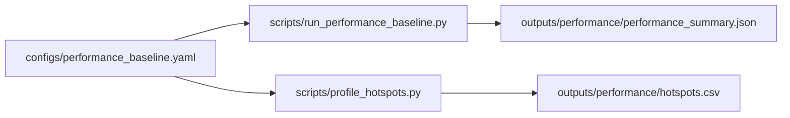

<!-- type: reference -->
# v0.4.1 — Performance Bottleneck Elimination: Ultimate Release Plan

**Plan type:** Actionable release plan — benchmark-first performance hardening for deterministic AMI/pAMI triage  
**Audience:** Maintainer, reviewer, statistician reviewer, performance implementer, Jr. developer  
**Target release:** `0.4.1` — ships after the `0.4.0` examples-repo split  
**Current released version:** `0.4.0`  
**Branch:** `feat/v0.4.1-performance-bottleneck-elimination`  
**Status:** Draft  
**Last reviewed:** 2026-05-01

> [!IMPORTANT]
> **Scope (binding).** This release ships a measured performance baseline, a code-evidenced bottleneck inventory, correctness gates for significance services, Python-level bottleneck elimination, and an optional-native-acceleration design document.
> It does **not** ship downstream forecasting integrations, framework-specific fit helpers, or a Rust extension inside the core package.
> Driver document: [aux_documents/developer_instruction_repo_scope.md](../plan/aux_documents/developer_instruction_repo_scope.md).

> [!NOTE]
> **Cross-release ordering.** This plan follows `v0.4.0` because the core repository must stay library-first after notebooks and heavy examples move to the sibling examples repository. Performance work should land only after that split, so benchmark results are not distorted by notebook churn or example-repository migration.

**Companion refs:**

- [v0.4.0 — Examples Repo Split: Ultimate Release Plan](implemented/v0_4_0_examples_repo_split_ultimate_plan.md) — predecessor
- [acceptance_criteria.md](acceptance_criteria.md) — shared scientific and verification gates
- [aux_documents/developer_instruction_repo_scope.md](../plan/aux_documents/developer_instruction_repo_scope.md) — scope directive
- [Python Packaging User Guide — Entry points specification](https://packaging.python.org/en/latest/specifications/entry-points/) — optional plugin discovery reference
- [maturin project](https://github.com/PyO3/maturin) — optional Rust/PyO3 packaging reference

**Builds on:**

- `run_triage` and `TriageRequest` from `src/forecastability/use_cases/run_triage.py` and `src/forecastability/triage/models.py`
- legacy AMI/pAMI kernels in `src/forecastability/metrics/metrics.py`
- generic raw/partial curve services in `src/forecastability/services/raw_curve_service.py` and `src/forecastability/services/partial_curve_service.py`
- surrogate-band services in `src/forecastability/services/significance_service.py`
- KSG-II fingerprint geometry in `src/forecastability/services/ami_information_geometry_service.py`
- covariant bundle orchestration in `src/forecastability/use_cases/run_covariant_analysis.py`
- batch workbench orchestration in `src/forecastability/use_cases/run_batch_forecastability_workbench.py`

---

## 1. Why this plan exists

The package is now broad enough that performance cost is no longer concentrated in one function. The high-cost paths are split across legacy AMI/pAMI, generic raw/partial curves, phase-surrogate significance, KSG-II fingerprint geometry, covariant method fan-out, and rolling-origin loops. Without a measured plan, isolated optimizations will move one benchmark while leaving the user-visible workflows slow.

This release makes performance a deterministic, reviewable surface. The Phase 1 profiling surface now exists; optimization work must use it to remove measured avoidable work without changing AMI/pAMI semantics. Native acceleration remains a later optional plugin path, not a core-package rewrite.

The planning research read the current hot paths under `src/forecastability/metrics/`, `src/forecastability/services/`, `src/forecastability/diagnostics/`, `src/forecastability/use_cases/`, and the rolling-origin helpers. The plan therefore separates bottleneck elimination into four categories: work we can avoid, Python kernels we can tighten, alternate estimators we can expose only under honest names, and native kernels that may justify an out-of-tree Rust plugin after parity gates exist.

The release should let a downstream consumer answer two crisp questions:

1. Which forecastability workflows are slow, by how much, and on which inputs?
2. Which bottlenecks can be eliminated without weakening horizon-specific AMI/pAMI, surrogate significance, or rolling-origin leakage controls?

### Measured elimination thesis

The May 1, 2026 profiling run changes the optimization order from broad kernel speculation to a measured path:

- The immediate user-visible bottleneck in the current synthetic callable profile is surrogate significance orchestration and repeated curve setup, not scalar AMI/pAMI curve calls. Medium `run_triage` with significance spent about `4.043s / 4.087s` in legacy `compute_significance_bands`; medium `run_batch_triage` spent about `8.057s / 8.151s` in the same path over two series; medium `run_covariant_analysis(methods=["cross_ami"])` spent about `0.626s / 0.640s` in generic significance with 99 surrogate evaluations and 100 raw-curve calls.
- PBE-F03 remains first because it removes unrequested covariant work without touching estimator semantics. PBE-F05 is the first measured kernel-level optimization after F03 and must target legacy and generic significance functions before pAMI residualization rewrites, KSG-II geometry, or native plugin design.
- F05 acceptance budget: after F03, the before/after artifacts must show medium `run_triage` with significance at least `20%` faster than the refreshed Phase 1 timing median (`3.862s`) or no worse than `3.09s`, medium `run_batch_triage` at least `20%` faster than the profiled wall (`8.151s`) or no worse than `6.52s`, and medium `cross_ami` at least `20%` faster than `0.640s` or no worse than `0.51s`, with semantic parity gates passing. If these budgets are not met, the PR must include serial or child-process profiles proving where the remaining cost lives before any broader rewrite is approved.
- Scalar AMI/pAMI kernel changes are stop/go gated. Do not proceed to native plugin design, approximate estimators, or broad kernel rewrites unless refreshed profiles after PBE-F03, PBE-F05, and capped PBE-F04 panels still show kernel-level work as a material bottleneck.
- PCMCI/KNN claims need their own profile evidence. A capped local profile (`T=220`, four variables, `max_lag=2`, `knn_cmi`) took `4.38s`; 18 shuffle-significance calls produced 3,632 `mutual_info_regression` calls. A direct `T=800`, `B=199` shuffle-significance micro-profile took about `0.34-0.44s` per CI test. F14 therefore targets full-PCMCI call volume and repeated sklearn MI setup around the existing fast path, not a silent estimator swap.

> [!IMPORTANT]
> The largest semantic risk is replacing a scientifically meaningful estimator with a faster but different estimand while keeping the same name. GCMI, Pearson, rank correlation, distance correlation, approximate nearest neighbors, or RF residualization may be useful explicit alternatives, but they must not silently replace AMI or linear-residual pAMI.

### Planning principles

| Principle | Implication |
| --- | --- |
| Benchmark before rewrite | Add repeatable timing and profiling artifacts before changing algorithms. Every claimed improvement needs a before/after baseline. |
| Correctness before speed | Fix significance-service surrogate-count validation before optimizing those services. Faster invalid bands are a regression. |
| Semantics-preserving first | Prefer work avoidance, caching, validation hoisting, preallocation, and deterministic parallelism before estimator replacement. |
| Additive public surface | Any public control, such as explicit significance mode or performance config, must default to current behavior. |
| Train-window discipline | Rolling-origin diagnostics must keep AMI/pAMI, scaling, residualization, and covariate diagnostics inside each train window only. |
| Optional native only | Rust acceleration belongs behind kernel ports or entry-point plugins, not as a mandatory core dependency. |
| Deterministic ordering | Parallel implementations must preserve fixed seeds, result order, and stable fixture outputs. |
| Framework boundary | No Darts, MLForecast, StatsForecast, Nixtla, or framework-fitting helpers are introduced. |

### Optimization PR evidence rule

Every optimization PR after PBE-F02 must include these review artifacts:

- Before/after `outputs/performance/performance_summary.json`, `outputs/performance/hotspots.csv`, and relevant `.prof` / `.pstats` files generated from the same `configs/performance_baseline.yaml` hash.
- A short PR note naming the changed file targets, the affected deterministic forecastability triage surface, the median/p95/runtime-memory delta, and whether the change is additive, semantic-preserving, or an explicit contract change.
- Parity or semantic guardrails for readiness, leakage risk, informative horizons, primary lags, seasonality structure, covariate informativeness, surrogate bands, and downstream hand-off surfaces touched by the PR.
- For any ProcessPoolExecutor path, either serial profiling (`n_jobs=1`) or child-process profiling artifacts. Parent-process lock waiting is not sufficient evidence for estimator or kernel wins.
- No accepted optimization PR may introduce downstream forecasting framework integrations, notebooks, mandatory native dependencies, or native Rust code in the core package.

### Architecture rules

- The core package remains **framework-agnostic**: no `darts`, `mlforecast`, `statsforecast`, or `nixtla` imports at any tier.
- AMI/pAMI remain **horizon-specific**: lag `h` is still computed from exactly `[:-h]` and `[h:]` aligned pairs unless an existing documented lag-0 diagnostic path is explicitly requested.
- Surrogate significance must enforce `n_surrogates >= 99` at every public and service-level entry point that returns significance bands.
- Rolling-origin diagnostics compute on train windows only; no pre-split scaling, residualization, rank-normalization, or surrogate fitting may use holdout values.
- New performance scripts write to `outputs/performance/**`; regression fixtures remain under `docs/fixtures/**`.
- Native acceleration, if prototyped, is out-of-tree as a separate distribution discovered by entry points such as `forecastability.kernels`.
- The pure-Python path remains authoritative and installed by default.
- No new notebooks are added to this repository.

### Compatibility classification

All planned `0.4.1` implementation work is additive or semantic-preserving unless a feature item explicitly says otherwise.

- **Additive surfaces:** `configs/performance_baseline.yaml` budgets, `scripts/run_performance_baseline.py`, `scripts/profile_hotspots.py`, private helper functions, deterministic `n_jobs` pass-through parameters that default to current serial behavior, and future `forecastability.ports.kernels` Protocol definitions.
- **Semantic-preserving internal changes:** covariant method-subset work avoidance, surrogate result preallocation, per-call prevalidated/pre-scaled helper use, single-horizon helpers that exactly match full-curve outputs, lag-design scaffolding, and exact chunked scorer implementations.
- **Explicit design-only surfaces:** optional native plugin design and provider Protocols. No native Rust code, framework integration, or downstream fitting helper ships in the core package.
- **Contract changes:** none planned for `0.4.1`. Any proposal that changes estimator defaults, surrogate nulls, public result fields, or downstream hand-off semantics must be split from this additive plan and reviewed separately.

### Feature inventory

Ordered by execution sequence (matches the PR plan in §7). The numeric ID suffix is a stable identifier, not an ordering hint. `Follow-up needed` means code exists, but the repo review found acceptance gaps that must close before later optimization work relies on that feature.

| Order | ID | Feature | Phase | Priority | Status |
| ---: | --- | --- | --- | --- | --- |
| 1 | PBE-F00 | Significance-service correctness gate (`n_surrogates >= 99`, `knn_cmi` `n_permutations >= 99`, legacy band pin) | 0 | P0 | Follow-up needed |
| 2 | PBE-F01 | Performance baseline config and timing script | 1 | P0 | Done |
| 3 | PBE-F02 | Hotspot profiling script, target registry, and coverage-gap closure | 1 | P0 | Follow-up needed |
| 4 | PBE-F03 | Covariant method-subset work avoidance | 2 | P0 | Done |
| 5 | PBE-F05 | Surrogate generation/evaluation reuse and preallocation | 3 | P1 | Done (hygiene only — wall-time budget unmet; see [aux_documents/pbe_f05_serial_microbench.md](aux_documents/pbe_f05_serial_microbench.md)) |
| 6 | PBE-F16 | Generic curve validation/scaling hoist for raw, partial, TE, and GCMI loops | 3 | P1 | Done |
| 7 | PBE-F13 | Shared lag-design scaffolding utility (prerequisite for F04, F06, and F14) | 3 | P1 | Not started |
| 8 | PBE-F04 | Single-horizon rolling-origin compute path | 2 | P0 | Done |
| 9 | PBE-F06 | pAMI lag-design/residualization optimization | 3 | P1 | Not started |
| 10 | PBE-F14 | PCMCI-AMI hybrid `knn_cmi` profiling and fast-path hardening | 3 | P0 | Not started |
| 11 | PBE-F08 | Lagged-exog surrogate parallelism and distance-scorer guardrails | 3 | P1 | Not started |
| 12 | PBE-F07 | Fingerprint geometry parallel/preset optimization | 3 | P1 | Not started |
| 13 | PBE-F12 | Batch workbench per-series parallelism with deterministic ordering | 3 | P1 | Not started |
| 14 | PBE-F10 | Performance decision matrix, refreshed profiles, and stop/go backlog | 4 | P0 | Not started |
| 15 | PBE-F15 | Typed kernel-provider Protocols in `forecastability.ports.kernels` | 4 | P1 | Stop/go gated |
| 16 | PBE-F09 | Optional native-kernel plugin design | 4 | P2 | Stop/go gated |
| 17 | PBE-F11 | Performance docs, budgets, and release report | 5 | P0 | Not started |

---

### Reviewer acceptance block

`0.4.1` is successful only if all of the following are visible together:

1. **Correct significance guards**
   - `compute_significance_bands_generic(..., n_surrogates=98)` raises before surrogate generation.
   - `compute_significance_bands_transfer_entropy(..., n_surrogates=98)` raises before surrogate generation.
   - Legacy `compute_significance_bands()` behavior remains unchanged.
   - `phase_surrogates()` in [src/forecastability/diagnostics/surrogates.py](../../src/forecastability/diagnostics/surrogates.py) either rejects `n_surrogates < 99` directly, or its docstring marks it as a private generator and a regression test asserts every public/use-case caller (`compute_significance_bands`, `compute_significance_bands_generic`, `compute_significance_bands_transfer_entropy`, `compute_ami_information_geometry` shuffle path, lagged-exog and exogenous-screening callers) validates the floor before calling it.
   - A fixed-seed regression test pins `compute_significance_bands` (legacy) lower/upper band arrays so PBE-F04..F08 cannot drift it accidentally.

2. **Benchmark baseline**
   - `configs/performance_baseline.yaml` defines small, medium, and large deterministic cases.
   - `scripts/run_performance_baseline.py` writes `outputs/performance/performance_summary.json`.
   - The JSON includes command metadata, Python/platform metadata, git SHA when available, config hash, wall time, CPU time, peak memory, BLAS/LAPACK build tag (`numpy.show_config()` digest), CPU model and core count, OS and kernel string, `threadpoolctl` snapshot, `OMP_NUM_THREADS` and `MKL_NUM_THREADS`, installed `forecastability` version, and `uv.lock` hash. Without this, the summary JSON is not portable across CI and developer laptops.

3. **Hotspot report**
   - `scripts/profile_hotspots.py` writes `outputs/performance/hotspots.csv` and `.prof` artifacts.
   - The profiling targets include every supported import/use-case surface, packaged command, and live repo script listed in the profiling coverage matrix.
   - The report separates estimator time from orchestration/reporting time.
   - The report records skipped targets with explicit reasons, for example optional dependency unavailable, network/data unavailable, archived script, or generated fixture path.

4. **Covariant work avoidance**
   - Requesting only `cross_ami` does not compute pCrossAMI.
   - Requesting only `cross_pami` does not compute CrossAMI significance bands.
   - Summary-row semantics and ranking remain unchanged for method sets that previously computed both.

5. **Rolling-origin single-horizon path**
   - Rolling-origin code no longer computes a full curve when only one horizon is consumed.
   - Tests prove lag `h` still maps to `curve[h - 1]` in the full-curve path, including `random_state + h` seed behavior.
   - Holdout-perturbation tests: mutating future target values and, for exogenous rolling-origin, mutating future exogenous values independently between otherwise identical rolling-origin runs yields bit-identical `ami_curve[h-1]`, `pami_curve[h-1]`, `directness_ratio`, and surrogate bands per origin (`np.array_equal`). These tests run on every PR under PBE-F03..F08, not only F04.
   - Single-horizon parity is parametrized over `(lag_start ∈ {0, 1, k>1}, lag_end)`. The new helpers must satisfy `helper(train, h, R) == compute_ami(train, max_lag=H, random_state=R)[h-1]` for every `h ∈ [1..H]` and any `H ≥ h`, and the analogous identity for `compute_raw_curve` / `compute_partial_curve` indexed by `curve[h - lag_start]`.

6. **Surrogate discipline**
   - Reusing target phase surrogates across drivers is treated as an explicit Monte Carlo design change, not a bitwise optimization. The null ("phase-randomized target, fixed driver/source") is unchanged; per-driver realizations and downstream fixtures will change. Reuse PRs MUST rebuild affected fixtures, add a band-shape tolerance test (not a bit-equality test), and document the change in metadata.
   - When common target surrogates are reused across drivers, metadata must mark `common_target_surrogate_stream=true`. Per-driver bands remain marginal; cross-driver significant-count, ranking, or FDR-style interpretations must either use independent-stream mode or explicitly account for induced Monte Carlo dependence.
   - Raw, partial, TE, exogenous, and geometry surrogate nulls are not pooled together.
   - CrossAMI bands are never reused for pCrossAMI or TE, and geometry shuffle-surrogate `tau` is never replaced by phase-surrogate bands.
   - For optimizations that do NOT change the seed stream (preallocation, validation hoist, `n_jobs` pass-through), `n_jobs=1` and `n_jobs>1` outputs are bit-identical for fixed seeds (`np.array_equal`). No shared mutable RNG across workers; each task derives its seed deterministically from `(random_state, h, surrogate_index)`. No new `joblib` use is introduced in significance services; existing geometry `joblib` parallelism is either left untouched or moved behind a private parallel-map adapter under PBE-F07.

7. **pAMI optimization safety**
   - Lag-design or residualization caches are per-series and per-train-window, not global.
   - Any closed-form least-squares path includes the intercept and matches current `LinearRegression()` residuals within tolerance.
   - Linear residual pAMI remains the default pAMI estimand.
   - RF/ExtraTrees residualization remains explicit and is not used as a performance replacement.

8. **Fingerprint geometry safety**
   - KSG-II keeps exact Chebyshev-neighbor semantics, one-shot jitter, median over `k_list`, shuffle-surrogate bias, 90th percentile `tau`, corrected clamp, and strict acceptance threshold.
   - A fitted neighbor structure is not reused across horizons because the paired sample matrix changes with `h`.
   - `AmiInformationGeometryConfig.n_jobs` is used consistently in scripts that opt into parallel geometry.
   - Smoke-mode configs reduce workload only when artifact plumbing is under test.

9. **Native acceleration boundary**
   - No Rust/maturin dependency is added to core runtime, optional extras, dev dependencies, or CI gates in this release.
   - The design specifies an out-of-tree `dependence-forecastability-accel` package discovered through Python package entry points.
   - Native plugin contracts are curve-level kernels, not scalar `DependenceScorer` callbacks.
   - The pure-Python implementation remains the default and parity oracle.

10. **Verification gates**
    - `uv run pytest -q -ra`
    - `uv run ruff check .`
    - `uv run ty check`
    - Relevant fixture rebuild scripts run when result surfaces or examples change.

---

## 2. Theory-to-code map

> [!IMPORTANT]
> Every junior developer MUST read this section before writing code.
> This release is low in public API ambition but high in semantic risk: most performance shortcuts are wrong if they change the statistical null, lag alignment, or train-window boundary.

### 2.1. Notation

- $y_t$ — target series value at time $t$; maps to `TriageRequest.series`.
- $x^{(j)}_t$ — exogenous driver `j`; maps to `drivers[driver_name]` or `TriageRequest.exog`.
- $h$ — forecast horizon or lag, with predictive horizons in $\{1, \ldots, H\}$.
- $I_h$ — AMI at horizon $h$; maps to `AnalyzeResult.raw[h - 1]`.
- $\tilde{I}_h$ — pAMI at horizon $h$ after residualization on intermediate target lags; maps to `AnalyzeResult.partial[h - 1]`.
- $S_b$ — phase-randomized surrogate series for surrogate index $b$.
- $B$ — number of surrogate draws; must satisfy $B \ge 99$ for significance claims.
- $G_h$ — KSG-II geometry AMI at horizon $h$; maps to `AmiInformationGeometry.curve[*].ami_raw`.
- $\tau_h$ — geometry surrogate threshold; maps to `AmiGeometryCurvePoint.tau`.

### 2.2. Core algorithm

The performance release preserves the current triage algorithm:

1. Validate the target and optional exogenous series.
2. Build a readiness report before expensive compute.
3. Route to univariate or exogenous analysis.
4. Compute raw AMI/CrossAMI curves by aligning `past = predictor[:-h]` and `future = target[h:]`.
5. Compute pAMI/pCrossAMI by residualizing against intermediate target lags `1..h-1`.
6. Compute surrogate significance bands only when the route requests them and `n_surrogates >= 99`.
7. Interpret curves into deterministic forecastability, directness, seasonality, and recommendation surfaces.
8. For fingerprint routing, compute KSG-II AMI geometry, shuffle-surrogate bias, corrected profile, and routing features.

Performance work changes *how much unnecessary work is performed*, not what the evidence means.

### 2.3. Mathematical invariants

> [!IMPORTANT]
> Invariant A — horizon alignment:
> $I_h = I(y_{t-h}; y_t)$ for $h \ge 1$.
> Enforced by: `compute_ami`, `compute_raw_curve`, curve-alignment tests, and single-horizon parity tests.

> [!IMPORTANT]
> Invariant B — pAMI conditioning set:
> $\tilde{I}_h$ conditions only on intermediate target lags $\{y_{t-1}, \ldots, y_{t-h+1}\}$ in the linear-residual approximation.
> Enforced by: `compute_pami_linear_residual`, `compute_partial_curve`, pCrossAMI tests, and residualization parity tests.

> [!IMPORTANT]
> Invariant C — surrogate-count floor:
> $B \ge 99$ for every significance-band surface.
> Enforced by: legacy, generic, and TE significance tests.

> [!IMPORTANT]
> Invariant D — rolling-origin train-only diagnostics:
> diagnostics at origin $o$ may depend on $\{y_t : t < o\}$ and matching train-window exog only.
> Enforced by: holdout-perturbation tests.

> [!IMPORTANT]
> Invariant E — estimator naming honesty:
> GCMI, Pearson, rank correlation, distance correlation, TE, RF-residual CMI, and approximate NN are distinct methods unless explicitly documented as approximations.
> Enforced by: public docs, scorer names, and result metadata.

> [!IMPORTANT]
> Invariant F — scaling scope:
> The `StandardScaler` is fit on the full input series passed to the kernel (which under rolling-origin discipline is the train window) and the result is then sliced into past and future. Scaling is never reapplied per horizon and never fit on the post-slice aligned pair.
> Enforced by: `compute_ami` in [src/forecastability/metrics/metrics.py](../../src/forecastability/metrics/metrics.py), `compute_raw_curve` in [src/forecastability/services/raw_curve_service.py](../../src/forecastability/services/raw_curve_service.py), `compute_partial_curve` in [src/forecastability/services/partial_curve_service.py](../../src/forecastability/services/partial_curve_service.py), and the new single-horizon helpers in PBE-F04.

> [!IMPORTANT]
> Invariant G — fallback semantics on insufficient samples:
> When `arr.size - h < min_pairs`, or pAMI is underdetermined on the legacy path (`z.shape[0] <= z.shape[1]`), the value at horizon `h` is `0.0` and the curve loop terminates. Single-horizon helpers and any future native kernels must replicate this contract instead of raising.
> Enforced by: `compute_ami`, `compute_pami_linear_residual` (legacy break), generic raw/partial curve services, and PBE-F04 helpers.

> [!IMPORTANT]
> Invariant H — null vs realization separation:
> The null distribution is determined by `(target series, surrogate generator family, n_surrogates)`. The bitwise realization is additionally determined by the seed stream. Optimizations may preserve the null without preserving the realization, but only with explicit fixture rebuild, band-shape tolerance test, and metadata flag. PBE-F05 surrogate-reuse falls under this clause.
> Enforced by: surrogate-reuse parity tests in PBE-F05 and the surrogate guardrail ledger §3.9.

---

## 3. Bottleneck inventory

### 3.1. Confirmed or likely hot paths

| Area | Path | Why it is hot | Elimination plan |
| --- | --- | --- | --- |
| Legacy AMI | `src/forecastability/metrics/metrics.py::compute_ami` | Loops over horizons and calls sklearn `mutual_info_regression` per lag. | Add single-horizon helpers, benchmark estimator calls separately, avoid full curves in rolling-origin single-horizon use. |
| Legacy pAMI | `src/forecastability/metrics/metrics.py::compute_pami_linear_residual` | Rebuilds conditioning matrices and fits two regressions per horizon. | Cache lag design matrices within a curve call; benchmark closed-form least squares parity before replacing `LinearRegression`. |
| Generic raw curves | `src/forecastability/services/raw_curve_service.py::compute_raw_curve` | Scales target and optional exog on every curve call; called inside surrogate and rolling-origin loops. | Accept prevalidated/pre-scaled arrays only through private helpers; keep public helper behavior unchanged. |
| Generic partial curves | `src/forecastability/services/partial_curve_service.py::_residualize` | Rebuilds `np.column_stack` lag matrices and fits `LinearRegression` per horizon. | Share lag-design scaffolding and reduce repeated scaling/validation. |
| Significance bands | `src/forecastability/services/significance_service.py` | Cost is `n_surrogates * curve_cost`; the **evaluation** path uses `values: list[np.ndarray] = [...]; np.vstack(values)`. Phase-surrogate generation already preallocates (`np.empty((n_surrogates, arr.size))` in `phase_surrogates`), so do not re-flag generation as a preallocation gap. | Preserve the existing surrogate floor, validate `which`, `max_lag`, `min_pairs`, `n_jobs`, and target/exog shape before allocation, preallocate result matrices, expose deterministic `n_jobs`, reuse target surrogates only where null permits. |
| Legacy significance bands | `src/forecastability/diagnostics/surrogates.py::compute_significance_bands` | Generates all surrogates, maps each to full AMI/pAMI curve, then stacks arrays. | Keep process-pool option, add matrix preallocation in serial path, and profile memory on large cases. |
| PCMCI-AMI hybrid CMI null | `src/forecastability/adapters/pcmci_ami_adapter.py` + tigramite `KnnCMI.get_shuffle_significance` | Full PCMCI-AMI runtime is dominated by repeated shuffle-significance calls. The existing `linear_residual` path already residualizes `Y` once and builds the `Z` projector once per CI test; the capped local profile still made 18 shuffle tests and 3,632 sklearn MI calls in `4.38s`. | Benchmark and harden the existing fast path, validate `n_permutations >= 99`, reduce repeated validation/scaling/MI setup where parity permits, preserve seeds and shuffle scheme, and do not introduce Tigramite-global RNG parallelism. Tracked under PBE-F14. |
| Fingerprint geometry | `src/forecastability/services/ami_information_geometry_service.py` | KSG-II nearest-neighbor fit per horizon and per shuffle surrogate. | Use existing `n_jobs` in script presets, skip impossible horizons early, keep exact KSG-II parity. |
| Covariant analysis | `src/forecastability/use_cases/run_covariant_analysis.py` | Fan-out over drivers, lags, methods, surrogates; computes CrossAMI and pCrossAMI together when either is requested. | Split method-specific curve computation; expose cross-band parallelism; reuse target surrogates safely. |
| Exogenous screening workbench | `src/forecastability/use_cases/run_exogenous_screening_workbench.py` | Per-driver evaluations call generic significance bands; nested loops over horizons; driver count typically large; rescales target series twice per driver. | Hoist target scaling once per workbench call; reuse target phase surrogates across drivers under the explicit Monte Carlo design clause (PBE-F05); deterministic `n_jobs` at the driver level. |
| TE/GCMI curves | `src/forecastability/diagnostics/transfer_entropy.py`, `src/forecastability/diagnostics/gcmi.py` | Per-driver, per-lag validation and estimator work. | Validate once per curve; preserve per-lag rank-normalization semantics for GCMI. |
| Lagged exogenous triage | `src/forecastability/use_cases/run_lagged_exogenous_triage.py` | Hard-codes `n_jobs=1` literal at `run_lagged_exogenous_triage.py` line ~282 when calling `compute_significance_bands_generic`; not configurable from the use-case signature. Computes raw `cross_ami_profile` and surrogate `upper_band` in two passes that each rescale the target series. | Add deterministic `n_jobs` pass-through and separate profile computation from significance when public defaults stay unchanged. |
| Distance correlation scorer | `src/forecastability/metrics/scorers.py` | `_dcov_centred` allocates `n×n` distance matrices via `squareform(pdist(...))` **twice per scorer call** (past and future), repeated per lag; centring matrices could share scaffolding with hoisted scaling. | Add budget guard or chunked exact implementation; do not use approximate scorer silently. |
| Batch workbench | `src/forecastability/use_cases/run_batch_forecastability_workbench.py` | Iterates per-series sequentially with no `n_jobs` and no executor; each iteration runs triage then geometry-backed fingerprint. | Add `n_jobs` kwarg with deterministic ordering and seed mapping; tracked under PBE-F12. |
| Rolling origin | `src/forecastability/use_cases/run_rolling_origin_evaluation.py`, `src/forecastability/use_cases/run_exogenous_rolling_origin_evaluation.py`, `src/forecastability/extensions.py::compute_target_baseline_by_horizon` | Computes full curves when only one horizon value is consumed. | Add single-horizon diagnostics under train-window-only tests. |

### 3.2. Code-evidence notes

These are the concrete observations a reviewer should verify before approving optimization work:

- `compute_ami()` scales once, then loops over `1..max_lag` and calls `mutual_info_regression` once per horizon. This is correct, but rolling-origin callers often discard every value except `curve[h - 1]`.
- `compute_pami_linear_residual()` and generic `_residualize()` build the intermediate-lag design from slices on every horizon, then fit separate regressions. This is a good Python-level target because the pAMI estimand can stay unchanged.
- F00 is closed for generic significance: `compute_significance_bands_generic()` and `compute_significance_bands_transfer_entropy()` validate `n_surrogates >= 99` before calling `phase_surrogates()`. PBE-F05 must preserve that ordering while replacing list/`vstack` evaluation with preallocated result matrices.
- `compute_significance_bands_generic()` still accepts `which: str` and treats any non-`"raw"` value as partial. F00/F05 should add runtime validation for `which in {"raw", "partial"}`, `max_lag`, `min_pairs`, `n_jobs`, and target/exog shape before surrogate allocation while keeping the public signature backward-compatible.
- `phase_surrogates(arr, *, n_surrogates: int, random_state: int) -> np.ndarray` in [src/forecastability/diagnostics/surrogates.py](../../src/forecastability/diagnostics/surrogates.py) uses keyword-only arguments. Native plugin contract in §3.7 must reflect this.
- `run_covariant_analysis()` calls `_compute_cross_curves()` when either `cross_ami` or `cross_pami` is requested, so method-subset requests still pay for both curves.
- `run_rolling_origin_evaluation()` and `run_exogenous_rolling_origin_evaluation()` call full-curve analyzers with `max_lag=horizon`, then read only `curve[horizon - 1]`.
- `compute_gcmi_curve()` validates and rank-normalizes inside `compute_gcmi_at_lag()` for every lag. Hoisting validation is safe; hoisting rank normalization across lags is not automatically safe because each lag has a different aligned sample.
- `compute_transfer_entropy_curve()` revalidates the same source/target pair for every lag. Validation and shared alignment metadata can be hoisted if sample-size checks remain lag-specific.
- `compute_ami_information_geometry()` already has `AmiInformationGeometryConfig.n_jobs`, but the high-cost KSG-II kernel remains exact Python/scikit-learn nearest-neighbor work for every raw and shuffle profile.
- `compute_ami_information_geometry()` cannot safely reuse fitted nearest-neighbor structures across horizons because each horizon has a different paired sample matrix.
- Lagged-exogenous triage and the distance-correlation scorer are secondary hotspots: the first is surrogate fan-out over drivers, and the second is exact quadratic pairwise-distance work.

### 3.3. Phase 1 measured profile snapshot

These numbers were generated by the Phase 1 artifacts on 2026-05-01 with:

- `MPLBACKEND=Agg uv run python scripts/run_performance_baseline.py`
- `MPLBACKEND=Agg uv run python scripts/profile_hotspots.py`

The machine snapshot recorded in `outputs/performance/performance_summary.json` was
Python 3.11 on the local macOS development machine. The fresh artifacts are
`outputs/performance/performance_summary.json`, `outputs/performance/hotspots.csv`,
`outputs/performance/hotspots_manifest.json`, and 18 `.prof` / `.pstats` target artifacts.
The artifacts report `forecastability_version: 0.4.0` because they are plan-time
measurements for the `0.4.1` work, not a packaged `0.4.1` release run.

Baseline cases:

| Case | Input | Significance route | Median wall | p95 wall | Peak RSS |
| --- | --- | ---: | ---: | ---: | ---: |
| small univariate triage | synthetic AR(1), `max_lag=8` | no | 0.010s | recorded in artifact | recorded in artifact |
| medium univariate triage | synthetic seasonal AR(1), `max_lag=16` | yes | 3.862s | 3.884s | 205.6 MiB |
| large univariate triage | synthetic seasonal AR(1), `max_lag=24` | yes | 4.272s | 4.293s | 207.6 MiB |

Profiled callable targets:

| Rank | Target | Size | Wall | Dominant measured cost |
| ---: | --- | --- | ---: | --- |
| 1 | `run_batch_triage` | medium | 8.151s | Two medium `run_triage` calls; about 8.057s is legacy surrogate significance. |
| 2 | `run_triage` | medium | 4.087s | `diagnostics/surrogates.py::compute_significance_bands` consumed about 4.043s through legacy AMI/pAMI surrogate bands. |
| 3 | `run_covariant_analysis(methods=["cross_ami"])` | medium | 0.640s | `significance_service.compute_significance_bands_generic` consumed about 0.626s through 99 surrogate evaluations and 100 `compute_raw_curve` calls. |
| 4 | `run_rolling_origin_evaluation` | smoke | 0.189s | ETS/autoregressive evaluation dominated this smoke profile; it does not prove AMI/pAMI curve waste is the top rolling-origin bottleneck. |
| 5 | Standalone AMI/pAMI/raw/partial curves | medium | cheap at this scale | Single curve calls are cheap; repeated significance and orchestration loops make them expensive. |
| 6 | `build_forecast_prep_contract` | small/medium | <0.001s | Handoff export is not a performance bottleneck after triage is already computed. |

Coverage caveat:

- `profile_hotspots.py` emitted 45 manifest rows but executed only configured callable targets.
- Live scripts, packaged commands, optional adapters, fixture rebuilders, real-data workflows, geometry/fingerprint/batch workbench, lagged-exog, exogenous screening, and PCMCI-AMI are mostly skipped or shallow in the fresh profile.
- PBE-F02 follow-up must add smoke execution targets and budgets in `configs/performance_baseline.yaml` for live script paths, geometry/fingerprint/batch workbench, lagged-exog, exogenous screening, and PCMCI-AMI before release reporting claims coverage beyond synthetic callable triage.
- Before F11 release reporting, run a longer script-profile pass for the highest-value live scripts (`scripts/run_canonical_triage.py --no-bands`, `scripts/run_showcase_covariant.py --smoke`, `scripts/run_showcase_lagged_exogenous.py --smoke`, `scripts/run_showcase_fingerprint.py --smoke`, `scripts/run_routing_validation_report.py --smoke --no-real-panel`, and `scripts/run_ami_information_geometry_csv.py` on a capped fixture) so public-demo and maintainer-workflow budgets are measured directly.

Planning conclusions:

- The highest measured cost is not the scalar AMI or pAMI kernel by itself; it is repeated surrogate significance evaluation.
- Legacy-significance `cpu_time_s` undercounts child-process work when triage uses `n_jobs=-1`; use wall time plus serial or child-process profiles when judging estimator improvements.
- The strongest immediate Python target after work-avoidance is PBE-F05: preallocate surrogate result matrices, reduce repeated generic-curve setup, and profile legacy child-process work before claiming scalar estimator wins.
- PBE-F03 remains the next implementation PR because it is pure covariant work avoidance and low risk.
- PBE-F04 remains required for rolling-origin benchmark panels, but the refreshed smoke profile is ETS-dominated and does not prove AMI/pAMI curve waste is currently the top bottleneck; its value must be proven on capped rolling-origin panels with before/after artifacts.
- Forecast-prep export should not receive optimization work in `0.4.1` beyond keeping it covered in the profiler.
- A future additive `significance_mode` field may be useful because current triage routing computes surrogate significance automatically for series long enough to pass feasibility. It should not be added in this release unless the default preserves current behavior.

### 3.4. Algorithm replacement decision table

| Candidate | Classification | Decision |
| --- | --- | --- |
| Work avoidance for unrequested covariant methods | Semantics-preserving | Implement in this release. |
| Single-horizon AMI/pAMI helpers | Semantics-preserving if parity-tested | Implement in this release for rolling-origin consumers. |
| Preallocated surrogate result matrices | Semantics-preserving | Implement in this release. |
| Reusing target phase surrogates across drivers | Null-preserving only for fixed-target-surrogate, fixed-driver nulls; not bitwise semantics-preserving if current per-driver seed streams change | Different bitwise realization, same null. Implement only as an explicit Monte Carlo design change (Invariant H), with fixture rebuild and band-shape tolerance test. Do NOT advertise as a "no-op" optimization. |
| GCMI instead of kNN AMI | Different estimator | Keep as explicit method, not replacement. |
| Pearson/Spearman/Kendall instead of AMI | Different estimator | Keep as explicit scorer family, not replacement. |
| Distance correlation instead of AMI | Different estimator | Keep as explicit scorer, not replacement. |
| Approximate nearest neighbors for KSG-II | Approximation | Do not use as default; consider only as an explicitly labeled approximate mode later. |
| RF/ExtraTrees residualization instead of linear pAMI | Different estimand | Keep explicit backend, not a performance swap. |
| Reducing surrogates below 99 | Invalid significance | Forbidden. |
| Rust phase-surrogate generation | Native implementation of same kernel | Good plugin candidate after Python baseline. |
| Rust lagged matrix/residualization kernel | Native implementation of same kernel | Good plugin candidate after parity tests. |
| Rust exact KSG-II Chebyshev kernel | Native implementation of same estimator | Possible plugin candidate; high parity burden. |

### 3.5. What should be optimized in Python first

| Work item | Why Python first | Acceptance gate |
| --- | --- | --- |
| Covariant method split | Pure orchestration waste; no estimator change. | Method-subset tests prove unrequested curve functions are not called. |
| Service-level surrogate guards | Correctness fix, not a performance gamble. | Invalid direct calls raise before surrogate generation. |
| Preallocated surrogate matrices | Same values with lower Python/list overhead and clearer memory profile. | Fixed-seed output parity with current implementation. |
| Hoisted validation/scaling private helpers | Reduces repeated public-boundary checks inside loops. | Public functions keep the same exceptions and result arrays. |
| Single-horizon AMI/pAMI helpers | Small API-internal change; largest effect is expected in rolling-origin loops and benchmark panels, not in the Phase 1 small smoke target. | Single-horizon equals full curve at `h - 1` for AMI, pAMI, raw exog, and partial exog. |
| Closed-form linear residualization experiment | `LinearRegression` defaults to ordinary least squares with intercept; a local `np.linalg.lstsq` helper may be faster. | Residuals match current `LinearRegression` path within tight tolerance on representative windows. |
| Lagged-exog significance `n_jobs` pass-through | Existing code pays serial surrogate cost per driver. | Fixed-seed outputs match `n_jobs=1`, and result ordering remains deterministic. |
| Distance-correlation budget guard | Exact scorer can allocate `n x n` matrices per lag; a guard is lower risk than an approximate rewrite. | Existing small-array scorer tests pass; oversized use produces an explicit warning or documented error. |
| Hoisted scaling inside surrogate loops | Public `compute_raw_curve` / `compute_partial_curve` rescale on every call; significance loops therefore call `_scale_series` (`StandardScaler.fit`) `n_surrogates` times per band. | Add a private helper that accepts pre-scaled arrays for the inner surrogate loop; public boundary scaling stays unchanged so exception semantics are preserved. |

#### PBE-F03 concrete work package

PBE-F03 is pure covariant work avoidance. It should not change scorer behavior, interpretation labels, summary-row ordering, or public result fields.

- [src/forecastability/use_cases/run_covariant_analysis.py](../../src/forecastability/use_cases/run_covariant_analysis.py): split `_compute_cross_curves()` into method-specific helpers such as `_compute_cross_ami_curves()` and `_compute_cross_pami_curves()`. `methods=["cross_ami"]` must not call partial-curve residualization; `methods=["cross_pami"]` must not compute CrossAMI significance bands unless a summary row explicitly needs CrossAMI.
- Preserve existing ranking and summary-row semantics for method sets that request both CrossAMI and pCrossAMI.
- Add monkeypatch/call-count tests proving unrequested raw, partial, and significance helpers are not called.
- Keep covariant significance `n_jobs` default behavior unchanged in F03; expose new parallel controls only in F05/F08 where deterministic ordering is tested.

#### PBE-F05 concrete work package

PBE-F05 is the first measured kernel-level optimization after PBE-F03. It targets these files and no public contract changes:

- [src/forecastability/diagnostics/surrogates.py](../../src/forecastability/diagnostics/surrogates.py): keep `ProcessPoolExecutor` support, add a serial-profileable path, preallocate legacy AMI/pAMI surrogate result matrices, and record child-process or serial profiles before attributing time to scalar kernels.
- [src/forecastability/services/significance_service.py](../../src/forecastability/services/significance_service.py): preallocate generic raw/partial/TE surrogate result matrices, add or reuse private prevalidated/pre-scaled raw/partial curve helpers, and preserve `n_surrogates >= 99` validation before allocation.
- [src/forecastability/services/raw_curve_service.py](../../src/forecastability/services/raw_curve_service.py) and [src/forecastability/services/partial_curve_service.py](../../src/forecastability/services/partial_curve_service.py): expose private inner-loop helpers through a small service-internal boundary such as `CurveInputs` / `LagRange` so validated/scaled arrays do not leak across public modules; public functions keep current exceptions, scaling scope, return shape, and downstream hand-off behavior.
- [configs/performance_baseline.yaml](../../configs/performance_baseline.yaml): add explicit F05 budgets for medium `run_triage`, medium `run_batch_triage`, and medium `cross_ami`, keyed to the May 1 artifacts.

Acceptance criteria:

- Before/after artifacts show medium `run_triage` with significance at least `20%` faster than `3.862s` timing median or no worse than `3.09s`, medium `run_batch_triage` at least `20%` faster than the profiled `8.151s` or no worse than `6.52s`, and medium `cross_ami` at least `20%` faster than `0.640s` or no worse than `0.51s`.
- Fixed-seed legacy and generic significance bands are bit-identical for preallocation and helper-hoist changes. If a target-surrogate reuse change is proposed, it is separated under Invariant H with fixture rebuild, metadata note, and band-shape tolerance tests.
- `n_jobs=1` and `n_jobs>1` preserve deterministic result order and seed mapping; no shared mutable RNG is introduced.
- The PR includes serial or child-process profiles for legacy significance because parent cProfile mostly reports process-pool lock waiting.
- Readiness, leakage risk, informative horizons, primary lags, seasonality structure, covariate informativeness, and downstream hand-off result semantics remain unchanged.

> [!NOTE]
> **Measured outcome (2026-05-01).** PBE-F05 landed as hygiene only. Serial micro-benchmarks of `compute_significance_bands` (legacy AMI) and `compute_significance_bands_generic` (raw, raw+exog, partial) are within run-to-run noise (Δ medians +0.2% to +1.5%). Parent-process hotspot wall on `n_jobs=-1` defaults moved by +2.55% on `run_triage`, +1.31% on `run_batch_triage`, and −5.41% on `cross_ami` — within process-pool wait noise. The wall-time budget (≥20% faster than the May 1 medians) was not met. Per the F05 acceptance clause, the PR documents serial evidence in [aux_documents/pbe_f05_serial_microbench.md](aux_documents/pbe_f05_serial_microbench.md): the dominant serial cost is `sklearn.feature_selection.mutual_info_regression` invoked `n_surrogates × max_lag` times per band (~1.05 ms each). A real >20% reduction on the legacy AMI/pAMI surrogate path requires a batched kNN MI kernel that reuses Chebyshev neighbor structures across surrogates and/or horizons; that is deferred behind a parity-test harness and is **not** part of this F05 PR. The F05 hygiene changes ship because they (1) close the soft validation gap for `which`, `n_jobs`, `min_pairs`, and exog shape on the generic services before any allocation, (2) preallocate result matrices for cleaner memory profiles, (3) factor `_compute_raw_curve_prescaled` and `_compute_partial_curve_prescaled` boundaries that PBE-F08/F12 deterministic-parallel work can build on, and (4) remain bit-identical under fixed seeds (legacy + new generic regressions).

#### PBE-F14 concrete work package

PBE-F14 is a benchmark-and-harden item for PCMCI-AMI, not a replacement of the CI estimator. The current `linear_residual` implementation already residualizes `Y` once and reuses a QR projector for `Z`; the remaining bottleneck is repeated shuffle-significance call volume and repeated sklearn MI setup.

- Add profiling targets for direct `build_knn_cmi_test(...).get_shuffle_significance(...)` micro-profiles (`iid` and `block`), direct `PcmciAmiAdapter(ci_test="knn_cmi").discover_full(...)` capped synthetic profiles, `run_covariant_analysis(methods=["pcmci_ami"])`, and real-panel routing validation when local fixtures exist.
- Do not start alternate KNN, approximate-neighbor, or native-neighbor work until these profiles separate CI-test call count, sklearn MI setup, and Tigramite orchestration time.
- Add a configurable but guarded `n_permutations` path for adapter construction only if the public default remains `199` and `build_knn_cmi_test(n_permutations < 99)` raises before any shuffle test is run.
- Preserve p-values and `return_null_dist=True` sorted null arrays for fixed seeds in both `iid` and `block` shuffle schemes.
- Any approximate nearest-neighbor, lower-`k`, lower-permutation, or alternate residual backend mode must be explicit in metadata and must not be labeled as the default `knn_cmi` fast path.
- Acceptance: capped synthetic PCMCI-AMI and routing-validation real-panel profiles show at least `50%` runtime reduction versus the recorded baseline, or the PR includes call-count profiles proving the remaining bottleneck is inside Tigramite orchestration or sklearn MI internals outside the F14 scope.

### 3.6. What should stay as explicit alternative algorithms

| Alternative | Why not a replacement | Valid product role |
| --- | --- | --- |
| GCMI | Assumes Gaussian-copula dependence after rank normalization; not the same estimator as kNN AMI. | Fast deterministic scorer for covariant screening and comparison rows. |
| Pearson/Spearman/Kendall | Measures linear or monotone association, not general mutual information. | Lightweight screening and sanity checks with scorer-family-specific interpretation. |
| Distance correlation | Captures dependence differently from MI and has different scale. | Bounded nonlinear scorer when users want a non-MI dependence view. |
| RF/ExtraTrees residual CMI | Changes the residualization model and therefore the pAMI-like estimand. | Explicit nonlinear residual backend, never a speed replacement for linear pAMI. |
| Approximate nearest neighbors | Changes KSG-II neighbor sets and can bias geometry thresholds. | Future opt-in approximate mode only if labeled and validated separately. |
| Histogram/binning MI | Faster but bin-sensitive and not comparable to current curves. | Possible educational recipe, not a core replacement. |

### 3.7. Native/Rust plugin candidate matrix

Native acceleration is useful only where Python overhead remains material after work avoidance and pure-Python kernel tightening. The core package should expose a small protocol and keep pure Python as the parity oracle.

The native boundary must be **curve-level**, not the existing scalar `DependenceScorer` callback. Scalar callbacks cross Python too often and erase most native benefit. `ScorerRegistry` remains the Python extension point for user-defined scorers; native providers should implement whole curve or matrix kernels.

| Candidate kernel | Rust fit | Minimal boundary | Parity burden | Decision |
| --- | --- | --- | --- | --- |
| Phase-surrogate generation | Good: FFT-heavy loop and matrix fill can be deterministic. | `phase_surrogates(arr, *, n_surrogates, random_state) -> ndarray` (keyword-only, matching today). | Exact shape, spectrum-preservation checks, fixed-seed distribution checks. | Design as first plugin prototype. |
| Lagged design matrix builder | Good: repeated slicing/column assembly is simple and deterministic. | `lag_design(series, lag) -> 2D array` or batched design views/copies. | Exact alignment and dtype parity across horizons. | Good plugin candidate after Python cache design lands. |
| Linear residualization | Good: ordinary least squares can run in Rust/BLAS, but numerical parity matters. | `linear_residualize(z, y, fit_intercept=True) -> residuals`. | Residual parity against scikit-learn `LinearRegression`; degenerate matrix behavior. | Candidate only after `np.linalg.lstsq` experiment. |
| Exact KSG-II Chebyshev MI | Possible but high risk: must reproduce exact neighbor and tie semantics. | `ksg2_profile(series, k_list, max_horizon, jitter_seed) -> curve`. | Neighbor indices, one-shot jitter, digamma formula, median over k, NaN/invalid horizon semantics. | Later plugin candidate, not first. |
| Surrogate percentile reduction | Moderate: percentile and matrix reductions are already NumPy-optimized. | `percentile_bands(matrix, alpha) -> lower, upper`. | Quantile method parity with NumPy. | Low priority. |
| Parallel batch orchestration | Poor fit: scheduling and Pydantic assembly are Python-level concerns. | None. | Stable ordering and exception semantics. | Keep in Python. |

The optional distribution name should be separate, for example `dependence-forecastability-accel`, and register entry points under `forecastability.kernels`. The core package should not add `maturin`, `pyo3`, or `setuptools-rust` to runtime, optional extras, dev dependencies, or CI in `0.4.1`.

Minimum parity gates for any future plugin:

- Python fallback is always available and selected by default.
- Native and Python outputs match for fixed seeds, `n_jobs=1`, and `n_jobs>1`.
- Single-horizon native output equals full-curve Python `curve[h - 1]`.
- Native surrogate paths reject `n_surrogates < 99` before allocation.
- Rolling-origin holdout perturbation does not change diagnostics.
- KSG-II plugin parity covers jitter, Chebyshev metric, `k_list` median, shuffle bias, 90th percentile `tau`, corrected clamp, and strict acceptance threshold.
- Core ships `forecastability.ports.kernels` with `@runtime_checkable` Protocols (`PhaseSurrogateKernel`, `LagDesignKernel`, `LinearResidualizeKernel`, `Ksg2ProfileKernel`). Plugins implement these Protocols; the loader rejects providers failing `isinstance(impl, Protocol)`. Tracked under PBE-F15.
- A plugin is rejected at load time if its self-reported determinism flag is `False` or if the parity oracle suite ([tests/plugin_parity/**](../../tests/plugin_parity), opt-in) reports any byte-level divergence under fixed seeds.
- Native kernels declare peak working-set bytes as a function of `(n_surrogates, max_lag, n_drivers, n_workers)`; the loader refuses to enable a kernel whose declared envelope exceeds a configured budget.
- KSG-II parity oracle covers: ε via `searchsorted(side='right', x+ε) - searchsorted(side='left', x-ε) - 1` with self-exclusion at slice `[1:k+1]`; KSG-II algorithm-2 digamma identity `ψ(k) - 1/k + ψ(N) - mean(ψ(nx)+ψ(ny))`; one-shot jitter; median over `k_list`; `SeedSequence(random_state).spawn(n_surrogates)` for shuffle seeds with `seed+1` jitter offset; `nanmean` shuffle bias; `nanpercentile(90)` for `tau`; corrected = `max(raw - bias, 0)` only on `valid_mask`; strict acceptance threshold.

### 3.8. Bottleneck elimination backlog

| Rank | Item | Expected impact | Risk | First tests |
| --- | --- | --- | --- | --- |
| 1 | Split covariant CrossAMI / pCrossAMI computation (PBE-F03) | High for method-subset covariant runs; low-risk first optimization before touching kernels | Low | `tests/test_covariant_facade.py`, new monkeypatch call-count tests |
| 2 | Surrogate matrix preallocation and significance-loop setup reduction (PBE-F05) | Highest measured Phase 1 bottleneck: medium `run_triage` spent 4.043s/4.087s in legacy surrogate bands; covariant `cross_ami` spent 0.626s/0.640s in generic surrogate bands | Medium because seed stream and null isolation must not drift unless explicitly documented | Significance fixed-seed parity tests, generic raw/partial band parity, `n_jobs` determinism tests |
| 3 | Validation/scaling hoist in generic curves (PBE-F16) | Medium in surrogate loops; covariant profile showed 100 `compute_raw_curve` calls and 202 scaling calls in one medium `cross_ami` profile | Medium because public exceptions must stay stable | Raw/partial curve service tests |
| 4 | Shared lag-design scaffolding utility (PBE-F13) | Medium across legacy pAMI, generic partial, and PCMCI-AMI; prerequisite for F04, F06, and F14 | Low (no estimator change) | Lag-design parity tests, cache-invalidation fuzz test |
| 5 | Single-horizon rolling-origin diagnostics (PBE-F04) | High for benchmark panels and causal-rivers workflows; not dominant in the small Phase 1 rolling-origin smoke profile | Medium because of lag indexing and train-window leakage risk | `tests/test_pipeline.py`, `tests/test_extensions.py`, holdout-perturbation tests |
| 6 | pAMI residualization cache or `lstsq` helper (PBE-F06) | Medium for pAMI-heavy loops; standalone pAMI was cheap in Phase 1, but repeated pAMI significance can amplify it | Medium because residuals affect MI estimates | Metrics and partial-curve parity tests |
| 7 | PCMCI-AMI hybrid `knn_cmi` profiling and fast-path hardening (PBE-F14) | High for causal-rivers / routing validation based on prior ~134.6s real-panel evidence plus capped local evidence (`4.38s`, 18 shuffle tests, 3,632 sklearn MI calls) | Medium (must preserve Tigramite seed contract and permutation null) | PCMCI-AMI parity fixtures, shuffle-null tests, routing-validation regression |
| 8 | Lagged-exog surrogate `n_jobs` pass-through (PBE-F08) | Medium to high for multi-driver screening; script smoke pass still needs direct timing | Medium due fixture output ordering | Lagged-exog regression and role-invariant tests |
| 9 | Geometry `n_jobs` presets and profile pruning (PBE-F07) | Medium to high for fingerprint batch; not exercised deeply by the Phase 1 callable smoke profile | Medium due deterministic ordering | Geometry regression and fingerprint tests |
| 10 | GCMI/TE scorer-specific loop cleanup after PBE-F16 | Medium in covariant runs if refreshed profiles still show scorer-specific overhead | Medium because lag-specific min-pair checks differ | GCMI and TE service tests |
| 11 | Distance-scorer guard or chunked exact implementation | Medium for users selecting distance correlation; not implicated in default MI profile | Medium due scorer semantics | Scorer parity tests |
| 12 | Batch workbench per-series parallelism (PBE-F12) | High for fingerprint batch / routing workbench; needs dedicated batch profile | Medium (output ordering, seed mapping) | Batch workbench parity tests under fixed seeds |
| 13 | Typed kernel-provider Protocols (PBE-F15) | None directly; enables F09 plugins | Low | Loader smoke test rejects non-conforming dummy plugin |
| 14 | Optional Rust phase-surrogate plugin prototype | Defer until after Python surrogate-loop fixes establish remaining native-worthy cost | High packaging/parity risk | Separate plugin parity suite |

### 3.9. Statistical guardrail ledger

Performance work must preserve these statistical boundaries:

- **Single-horizon parity:** AMI and pAMI helpers must exactly match the full-curve value at `h - 1`, including scaling, minimum-pair zero behavior, underdetermined pAMI break behavior, and `random_state + h` seed mapping.
- **Train-only rolling origin:** every scaling, residualization, rank-normalization, surrogate generation, and dependence score inside rolling-origin diagnostics uses the train prefix only. Tests perturb future target values and future exogenous values independently and assert diagnostics are unchanged.
- **pAMI residualization:** linear pAMI uses `LinearRegression()`-equivalent OLS with an intercept for both past and future residuals; pCrossAMI residualizes only the future target when the predictor is exogenous.
- **Surrogate null isolation:** raw, partial, TE, exogenous, and geometry surrogate matrices are not pooled. CrossAMI bands do not stand in for pCrossAMI or TE bands. Geometry shuffle-surrogate bias and `tau` remain separate from phase-surrogate bands.
- **Common random numbers across drivers:** target-surrogate reuse across drivers is allowed only as an explicit common-random-number Monte Carlo design. Metadata must expose `common_target_surrogate_stream=true`; per-driver marginal bands remain valid, but cross-driver counts, rankings, and FDR-style summaries must either use independent streams or account for induced dependence.
- **Ratio reporting:** raw `pAMI/AMI` and `pCrossAMI/CrossAMI` ratios are not clamped before reporting. Values above `1.0` remain warning evidence, not “high directness.”
- **Estimator honesty:** changing `n_neighbors`, scaling scope, `min_pairs`, residualization backend, nearest-neighbor exactness, or surrogate count is a method/configuration change, not a performance-only optimization.
- **PCMCI permutation floor:** `knn_cmi` shuffle significance must validate `n_permutations >= 99` before constructing or running a shuffle test. The adapter default remains `199`.
- **Scaling scope (Invariant F):** Single-horizon helpers must call `_scale_series(train)` once on the full train series and then slice. Never scale the post-slice aligned pair. Parity tests must include a series with non-zero mean and non-unit std to falsify the wrong implementation.
- **Underdetermined-pAMI asymmetry:** The legacy `compute_pami_linear_residual` breaks early on `z.shape[0] <= z.shape[1]` and leaves zeros for higher horizons. Generic `_residualize` does NOT break. Univariate rolling-origin uses legacy; exogenous rolling-origin and `compute_target_baseline_by_horizon` use generic. PBE-F04 ships **two** single-horizon helpers — one mirroring legacy break-then-zero, one mirroring generic compute-anyway. Each is parity-tested against its own caller. Do not unify them as a "speed" fix.
- **Per-horizon seed convention:** `random_state + h` is used by legacy AMI/pAMI and by generic raw/partial curves; rolling-origin pre-adds `idx` (`run_rolling_origin_evaluation.py`) and the exogenous variant pre-adds `1000*horizon + idx` (`run_exogenous_rolling_origin_evaluation.py`). The PBE-F04 helper contract is `helper(train, h, random_state=R)` ≡ `compute_ami(train, max_lag=H, random_state=R)[h-1]` for every `h ∈ [1..H]` and any `H ≥ h`; the two callers pre-compose differently and the helper takes whatever `random_state` legacy would have received.
- **Lag-design cache invalidation key:** Per-call/per-train-window caching is safe only if the cache key includes `(id(train_array), train_array.shape, train_array.dtype, max_lag)` AND the cache is dropped at the end of the curve call. Module-level `lru_cache` keyed on object identity is forbidden (NumPy reuses buffers; rolling-origin reuses sliced views).
- **Closed-form residualization tolerance:** Use `np.linalg.lstsq(np.column_stack([z, np.ones(n)]), y, rcond=None)`; do NOT use `solve` on `Z.T @ Z`. Parity tolerance: `atol=1e-10, rtol=1e-8` on residuals; `atol=1e-6, rtol=1e-4` on the resulting MI value. Fuzz test must include AR(1) `ρ=0.99` and a deliberately collinear lag-design case.
- **GCMI/TE validation hoisting scope:** Hoist into the curve function: dtype check, finiteness check, length-equality check, `validate_time_series` length floor against `lag + min_pairs`. Keep per-lag: `_validate_conditional_te_sample_size(n_rows = N - lag, history, min_pairs)` in `transfer_entropy.py` and `_rank_normalise(src[:N-h])` / `_rank_normalise(tgt[h:])` in `gcmi.py` because they depend on the aligned pair, not on the full series.
- **Distance correlation:** Prefer chunked exact (Huo–Székely O(n log n) or row-block accumulator over A·B without materializing centred matrices) over a budget guard. Keep the V-statistic centring convention (divisor `n²`); do NOT swap to the U-statistic version. Parity vs current implementation at `n ∈ {200, 1000, 5000}` to `atol=1e-12`.

### 3.10. Profiling target coverage matrix

PBE-F02 is not complete if it profiles only the obvious estimator functions. The profiling script must first build a coverage manifest from the surfaces we ship:

- `forecastability.__all__` and `forecastability.triage` public exports documented in `docs/public_api.md`
- `src/forecastability/use_cases/__init__.py::__all__`
- `[project.scripts]` in `pyproject.toml`
- live non-archive `scripts/run_*.py`, `scripts/rebuild_*.py`, and report-building scripts
- archived scripts only as optional historical probes, not release-budget gates

| Coverage group | Required targets | Representative command or callable | PBE-F02 expectation |
| --- | --- | --- | --- |
| Core triage | `run_triage`, `run_batch_triage`, `run_batch_triage_with_details` | Python callable on deterministic synthetic panels | Profile readiness, routing, compute, interpretation, and batch ranking separately. |
| Analyzer kernels | `ForecastabilityAnalyzer`, `ForecastabilityAnalyzerExog`, legacy `compute_ami`, `compute_pami_linear_residual`, generic raw/partial curves | Python callable with small/medium/large synthetic arrays | Separate estimator time, scaling/validation time, residualization time, and significance-band time. |
| Covariant tools | `run_covariant_analysis`, `run_lagged_exogenous_triage`, `run_exogenous_screening_workbench` | Python callable and `scripts/run_showcase_covariant.py --smoke`, `scripts/run_showcase_lagged_exogenous.py --smoke` | Cover method subset runs, all-method smoke runs, driver fan-out, and surrogate-band paths. |
| Fingerprint/routing tools | `run_forecastability_fingerprint`, `run_batch_forecastability_workbench`, `run_routing_validation`, `run_ami_geometry_csv_batch` | Python callable plus `scripts/run_showcase_fingerprint.py --smoke`, `scripts/run_routing_validation_report.py --smoke --no-real-panel`, `scripts/run_ami_information_geometry_csv.py` | Cover KSG-II geometry, routing policy, batch workbench, CSV batch adapter, and report artifact writing. |
| Forecast-prep hand-off | `build_forecast_prep_contract`, `forecast_prep_contract_to_markdown`, `forecast_prep_contract_to_lag_table` | Python callable plus `scripts/run_showcase_forecast_prep.py --smoke` | Confirm hand-off/export surfaces are cheap and do not dominate triage workflows. |
| Rolling-origin tools | `run_rolling_origin_evaluation`, `run_exogenous_rolling_origin_evaluation`, `compute_target_baseline_by_horizon` | Python callable with capped horizons/origins | Profile full-curve waste before the single-horizon rewrite and preserve train-only diagnostics. |
| PCMCI/KNN tools | `build_knn_cmi_test`, `PcmciAmiAdapter.discover_full`, `run_covariant_analysis(methods=["pcmci_ami"])`, routing-validation real panel when local fixtures exist | Direct micro-profile for `get_shuffle_significance` (`iid` and `block`) plus capped full-adapter profile | Separate CI-test call count, permutation loop cost, sklearn MI cost, and Tigramite orchestration before PBE-F14 claims. |
| Canonical/showcase scripts | `scripts/run_canonical_triage.py`, `scripts/run_showcase.py`, `scripts/run_triage_handoff_demo.py`, `scripts/run_exog_analysis.py`, `scripts/run_benchmark_panel.py` | Smoke/no-bands/no-rolling modes where available | Measure public demo cost separately from estimator cost; full-band modes may be long-running benchmark cases. |
| Fixture rebuild scripts | `scripts/rebuild_diagnostic_regression_fixtures.py`, `scripts/rebuild_covariant_regression_fixtures.py`, `scripts/rebuild_fingerprint_regression_fixtures.py`, `scripts/rebuild_lagged_exog_regression_fixtures.py`, `scripts/rebuild_forecast_prep_regression_fixtures.py`, `scripts/rebuild_routing_validation_fixtures.py`, `scripts/rebuild_causal_rivers_fixtures.py`, `scripts/rebuild_benchmark_fixture_artifacts.py` | Script commands with default fixture configs | Track maintainer cost; do not confuse fixture-rebuild runtime with user-facing runtime. |
| Packaged commands/adapters | `forecastability`, `forecastability-dashboard`, `forecastability.adapters.api:app`, `forecastability.adapters.cli` (CLI surface), `forecastability.adapters.mcp_server` (MCP), `forecastability.adapters.pydantic_ai_agent` (skip with `optional_dependency_gate=ai-extra`), `forecastability.adapters.dashboard` (startup-only timing) | CLI smoke commands; dashboard/API startup-only timing | Verify adapter startup/import cost and command plumbing without requiring browser or network access. |
| Maintenance scripts | `scripts/build_report_artifacts.py`, contract/link/readme checks, release checks, data download, `scripts/sync_repo_contract.py` | Script commands where local-only | Classify as maintenance overhead; exclude network download timings from release budgets unless fixture data is already local. |
| Real-data scripts | `scripts/run_causal_rivers_analysis.py` (gated on local fixture availability with `optional_dependency_gate=causal-rivers-data`) | Script commands when local fixture data is present | Skip with `causal-rivers-data` reason when data is unavailable; otherwise profile alongside packaged commands. |
| Archived scripts | `scripts/archive/run_*.py` | Optional probes only | Record as skipped by default with `archived_script` reason unless a release explicitly revives the workflow. |

The profiling manifest should emit at least these fields per target: `target_id`, `surface_group`, `entry_type`, `command_or_callable`, `input_size_label`, `optional_dependency_gate`, `network_required`, `writes_artifacts`, `profiled`, `skip_reason`, `wall_time_s`, `cpu_time_s`, `peak_memory_mb`, `hotspot_artifact`, `n_jobs_used`, `thread_backend`, `process_pool_workers`, `random_state_base`, `numpy_show_config_digest`, `omp_num_threads`, `mkl_num_threads`, `threadpoolctl_snapshot`, `forecastability_version`, and `uv_lock_hash`.

Profiling coverage gap closure for PBE-F02/F11:

- Before expanding target coverage, split target definitions/runners into a small `scripts/performance_targets.py` registry and keep [scripts/profile_hotspots.py](../../scripts/profile_hotspots.py) focused on profiling and artifact writing.
- [scripts/profile_hotspots.py](../../scripts/profile_hotspots.py) must execute smoke paths, not only list manifest rows, for live scripts and packaged commands that can run without network or optional forecasting frameworks.
- [configs/performance_baseline.yaml](../../configs/performance_baseline.yaml) must define budget thresholds for `run_triage`, `run_batch_triage`, `run_covariant_analysis(cross_ami)`, capped rolling-origin panels, geometry/fingerprint/batch workbench, lagged-exog, exogenous screening, and PCMCI-AMI smoke/fixture workflows.
- Geometry/fingerprint/batch workbench coverage must include `run_forecastability_fingerprint`, `run_batch_forecastability_workbench`, and `run_ami_information_geometry_csv.py` on capped synthetic or fixture inputs.
- Rolling-origin coverage must include diagnostic-only or separated timings so ETS/autoregressive forecast scoring does not mask AMI/pAMI diagnostic waste.
- Lagged-exog and exogenous screening coverage must include surrogate-enabled and no-band modes so readiness/routing time can be separated from significance time.
- PCMCI-AMI coverage must include capped synthetic micro/full profiles and, when local real-panel fixtures exist, a routing-validation real-panel profile with explicit skip reasons when data is unavailable.
- Hotspot metadata must report the actual backend used. For legacy triage significance, `n_jobs_used=1` is misleading when analyzer defaults trigger process-pool `n_jobs=-1`; rows must distinguish parent-process profiling from child-process or serial profiling.
- Acceptance requires `outputs/performance/hotspots_manifest.json` to mark each required target as profiled or skipped with one of the controlled reasons: `optional_dependency_unavailable`, `network_or_data_unavailable`, `archived_script`, `generated_fixture_path`, `manual_only`, or `out_of_scope_for_release_budget`.

---

## 4. Phased delivery

### Phase 0 — Correctness gates before speed

**Scope.** Close the generic significance validation gap and add regression tests.

**Acceptance criteria:**

- `compute_significance_bands_generic` rejects `n_surrogates < 99`.
- `compute_significance_bands_transfer_entropy` rejects `n_surrogates < 99`.
- `compute_significance_bands_generic` rejects invalid `which`, `max_lag`, `min_pairs`, `n_jobs`, and target/exog shape before surrogate allocation.
- `build_knn_cmi_test(n_permutations < 99)` rejects invalid shuffle-significance requests before constructing a CI test.
- Tests cover the direct service calls, not only analyzer-mediated calls.
- No public result field changes.

### Phase 1 — Measurement surface

**Scope.** Add deterministic performance baselines and profiling artifacts.

**Acceptance criteria:**

- Baseline script runs on synthetic data without network or optional forecasting frameworks.
- Profile script uses `cProfile`/`pstats` to avoid new runtime dependencies.
- Target definitions and runners live in a small registry module; `profile_hotspots.py` remains the artifact-writing adapter.
- Profile script writes a target-coverage manifest proving which public tools, scripts, rebuilders, and adapters were profiled or intentionally skipped.
- Follow-up coverage closes the May 1 gap by executing smoke paths for live scripts, geometry/fingerprint/batch workbench, lagged-exog, exogenous screening, and PCMCI-AMI where local inputs exist.
- `configs/performance_baseline.yaml` carries explicit median/p95/RSS budgets for the measured triage targets and capped smoke budgets for uncovered workflow groups before F11 release reporting.
- Performance outputs are deterministic enough for trend comparison but are not treated as scientific fixtures.
- `uv run pytest --durations=25` is documented as a supporting diagnostic command.

### Phase 2 — Work avoidance

**Scope.** Remove known avoidable computation before touching numerical kernels.

**Acceptance criteria:**

- `run_covariant_analysis(methods=["cross_ami"])` computes CrossAMI only.
- `run_covariant_analysis(methods=["cross_pami"])` computes pCrossAMI only.
- PBE-F03 introduces method-specific CrossAMI/pCrossAMI helpers and call-count tests for unrequested raw, partial, and significance paths.
- Rolling-origin consumers can compute a single requested horizon instead of a full curve.
- PBE-F04 proves benefit on capped rolling-origin panels before being credited as a bottleneck elimination. The May 1 smoke profile is ETS-dominated and is not enough evidence by itself.
- Existing full-curve results remain unchanged.

### Phase 3 — Kernel-level Python optimization

**Scope.** Improve the pure-Python/numpy/scikit-learn path while preserving estimator semantics.

**Acceptance criteria:**

- PBE-F05 lands before residualization, geometry, distance-correlation, or native work and targets legacy `compute_significance_bands`, generic `compute_significance_bands_generic`, repeated curve setup, preallocation, and serial/child-process profiling.
- Surrogate services preallocate result matrices and expose deterministic `n_jobs` where safe; medium `run_triage`, medium `run_batch_triage`, and medium `cross_ami` meet the F05 budget or include profiles proving why the remaining bottleneck moved elsewhere.
- pAMI residualization reuses per-call lag scaffolding or equivalent validated caches.
- GCMI and TE curve implementations validate arrays once per curve where possible.
- Fingerprint scripts and batch workbench can opt into `AmiInformationGeometryConfig.n_jobs` without changing default API behavior.
- Lagged-exogenous triage exposes safe surrogate `n_jobs` pass-through without changing defaults.
- Distance-correlation scorer work is bounded by an explicit budget guard or an exact chunked implementation with parity tests.
- Single-horizon helpers ship in two flavors (legacy-parity and generic-parity); each is parity-tested against its own rolling-origin caller (Invariant G asymmetry).
- PCMCI-AMI hybrid `knn_cmi` hardening preserves the existing linear-residual fast path, validates `n_permutations >= 99`, preserves `iid` and `block` shuffle null arrays under fixed seeds, and completes in <= 50% of the v0.4.0 baseline on the routing-validation real panel or explains the remaining Tigramite/sklearn bottleneck with call-count profiles (PBE-F14).
- Batch forecastability workbench accepts a `n_jobs` kwarg with deterministic ordering and seed mapping; serial vs parallel outputs are bit-identical under fixed seeds (PBE-F12).
- Shared lag-design scaffolding utility (`forecastability.metrics._lag_design.build_intermediate_design`) is consumed by legacy `compute_pami_linear_residual`, generic `_residualize`, and the PCMCI-AMI residualization helper; cache is per-curve-call only (PBE-F13).

### Phase 4 — Optional native acceleration design

**Scope.** Design, but do not ship, an out-of-tree native acceleration path.

**Stop/go checkpoint.** Do not start PBE-F09 native plugin design or broad scalar kernel rewrites until refreshed profiles after PBE-F03, PBE-F05, and PBE-F04 show that remaining kernel-level work is still material for deterministic forecastability triage. If surrogate orchestration, script/report I/O, ETS/autoregressive evaluation, optional adapters, or workflow fan-out still dominate, keep optimizing those Python orchestration surfaces first.

**Acceptance criteria:**

- A design note defines a `forecastability.kernels` entry-point group and the minimal kernel protocol.
- The proposed package name is separate, for example `dependence-forecastability-accel`.
- The plan keeps the current Hatchling pure-Python build for the core package.
- The provider interface is curve-level and does not route high-volume work through scalar scorer callbacks.
- The native path requires Python-vs-native parity fixtures before any user-facing opt-in.
- Core package ships `forecastability.ports.kernels` with `@runtime_checkable` Protocols (`PhaseSurrogateKernel`, `LagDesignKernel`, `LinearResidualizeKernel`, `Ksg2ProfileKernel`). Loader rejects non-conforming providers (PBE-F15).

### Phase 5 — Documentation, budgets, and release report

**Scope.** Document measured improvements and remaining bottlenecks.

**Acceptance criteria:**

- Add a performance report under `outputs/reports/performance/`.
- Add a docs page or plan appendix explaining which optimizations are semantics-preserving and which are not.
- Runtime budgets compare median and p95 times against the Phase 1 baseline.
- Memory budgets compare peak RSS against the Phase 1 baseline.

---

## 5. Verification plan

### Required commands

- `uv run pytest -q -ra`
- `uv run ruff check .`
- `uv run ty check`
- `uv run pytest --durations=25`
- `uv run python scripts/run_performance_baseline.py`
- `uv run python scripts/profile_hotspots.py`

### Fixture rebuild commands

Run only when the relevant result surface changes:

- `uv run python scripts/rebuild_diagnostic_regression_fixtures.py`
- `uv run python scripts/rebuild_covariant_regression_fixtures.py`
- `uv run python scripts/rebuild_fingerprint_regression_fixtures.py`
- `uv run python scripts/rebuild_lagged_exog_regression_fixtures.py`

### Performance budgets

- Median wall time over 3 clean runs must be no worse than `+20%` versus the Phase 1 baseline unless justified in the release report.
- p95 per-case/per-series time must be no worse than `+25%`.
- Peak RSS must be no worse than `+15%` for small/medium/large synthetic cases.
- `configs/performance_baseline.yaml` must include named budgets for the May 1 measured targets: small no-band triage `0.010s`, medium significance triage timing median `3.862s`, large significance triage timing median `4.272s`, medium batch triage profile `8.151s`, medium `cross_ami` profile `0.640s`, and rolling-origin smoke `0.189s`.
- F05-specific improvement budgets are stricter than regression budgets: medium significance triage `<= 3.09s`, medium batch triage `<= 6.52s`, and medium `cross_ami` `<= 0.51s`, or the PR must show profiles proving why the remaining bottleneck is outside F05 scope.
- No benchmark-panel series may hit the existing 120s timeout.
- `run_canonical_triage.py --no-bands --max-workers 4` should be at least `1.5x` faster than `--max-workers 1`, or the report must explain why parallelism does not help.

---

## 6. Out of scope

- Framework-specific adapters such as `to_darts_spec()`, `fit_mlforecast()`, or `fit_nixtla()` — belong in docs recipes or the sibling examples repository.
- New notebooks — notebooks belong in the sibling examples repository.
- Core Rust extension module — this release designs an optional plugin path but does not ship native code in the core package.
- Reducing `n_surrogates` below 99 — invalid for significance claims.
- Approximate estimator defaults — approximate NN, histogram MI, or alternative dependence measures must be explicit methods, not silent AMI replacements.
- Expanding optional model-training integrations — legacy rolling-origin helpers may be frozen or migrated later, but not expanded here.

---

## 7. Implementation notes

F01 and F03 are implemented in the working tree. F00 and F02 have code in place, but repo review found blocking acceptance gaps: `knn_cmi` still needs the `n_permutations >= 99` floor, legacy significance bands still need a fixed-seed pin, and the Phase 1 profiler still needs a target registry plus expanded live workflow coverage before later optimization claims rely on it.

Recommended PR order:

1. `PBE-F00`: close correctness preflight gaps: preserve completed significance guard tests, add generic-significance interface validation if absent, add the `knn_cmi` permutation-count floor, and pin legacy `compute_significance_bands` regression.
2. `PBE-F01/F02`: keep the baseline script stable, then split a performance target registry from the profiling adapter and expand script/geometry/fingerprint/batch/lagged-exog/exogenous-screening/PCMCI coverage.
3. `PBE-F03`: covariant method-subset compute split. This is already implemented and remains the first completed optimization because it is pure orchestration work avoidance with low statistical risk.
4. `PBE-F05`: surrogate matrix preallocation and significance-loop setup reduction. Phase 1 profiling moved this ahead of F04/F06 because surrogate bands dominate measured `run_triage`, `run_batch_triage`, and covariant `cross_ami`. This PR must include serial or child-process profiles for legacy significance before claiming scalar AMI/pAMI kernel wins.
5. `PBE-F16`: generic curve validation/scaling hoist for raw, partial, TE, and GCMI loops. This belongs immediately after F05 because surrogate loops, rolling-origin loops, and covariant driver fan-out amplify repeated scaling and validation.
6. `PBE-F13`: shared lag-design scaffolding utility (prerequisite for F04, F06, and F14).
7. `PBE-F04`: single-horizon rolling-origin helpers (two flavors per Invariant G asymmetry). Keep this before residualization rewrites because it adds the parity harness needed for rolling-origin safety; credit performance impact only after capped rolling-origin panels, not the May 1 smoke profile alone.
8. `PBE-F06`: pAMI lag-design/residualization optimization.
9. `PBE-F14`: PCMCI-AMI hybrid `knn_cmi` profiling and fast-path hardening. Its prerequisites are the F00 permutation-count floor and F13 lag-design/residualization scaffolding; it does not depend on geometry work.
10. `PBE-F08`: lagged-exog surrogate parallelism and distance-scorer chunked exact. This depends on F05 because it should not add outer parallelism on top of an unoptimized surrogate service.
11. `PBE-F07`: fingerprint geometry parallel/preset optimization. Do this before batch workbench parallelism so nested parallel policies are explicit.
12. `PBE-F12`: batch forecastability workbench per-series parallelism with deterministic ordering and seed mapping.
13. `PBE-F10`: refreshed profiles, performance decision matrix, and optimization backlog stop/go decision.
14. `PBE-F15`: typed kernel-provider Protocols in `forecastability.ports.kernels`, only if F10 shows native/provider work is still warranted.
15. `PBE-F09`: optional native-kernel plugin design, only after F10/F15.
16. `PBE-F11`: performance docs, budgets, and release report.

F03 lands before kernel work intentionally: it is a pure orchestration split with no estimator change. Phase 1 profiling then justifies moving F05 immediately after F03, because surrogate significance is the dominant measured cost. F16 makes the view more generic before lag-design or rolling-origin specialization: repeated scaling and validation are shared overhead across surrogate, covariant, and rolling-origin loops. F04 remains before F06/F14 because it establishes single-horizon parity and train-window safety before deeper residualization or PCMCI changes. PBE-F10 must precede PBE-F15/F09 because provider/native design is stop/go gated by refreshed profiles after the Python bottlenecks are removed.
