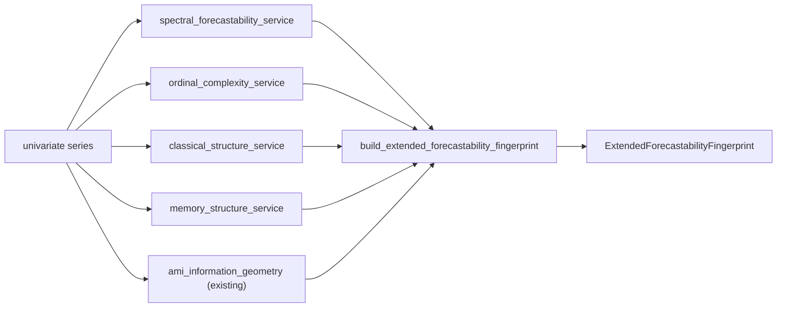

<!-- type: reference -->
# v0.4.2 — Forecastability Structure Expansion: Ultimate Release Plan

**Plan type:** Actionable release plan — method-layer expansion for deterministic forecastability triage  
**Audience:** Maintainer, reviewer, statistician reviewer, documentation writer, Jr. developer  
**Target release:** `0.4.2`  
**Current released version:** `0.4.1`  
**Branch:** `feat/v0_4_2_forecastability_structure_expansion`  
**Status:** Draft — ready for implementation  
**Last reviewed:** 2026-05-04

> [!IMPORTANT]
> **Scope (binding).** This release expands the univariate forecastability fingerprint with cheap, interpretable, evidence-backed structure diagnostics:
>
> 1. spectral forecastability,
> 2. ordinal complexity / permutation entropy,
> 3. classical trend-seasonality-autocorrelation features,
> 4. DFA / Hurst-style long-memory proxy,
> 5. an extended fingerprint and updated model-family routing.
>
> It does **not** ship PCMCI acceleration, Rust/native kernels, matrix-profile motif discovery in core, EDM/S-map forecast evaluation, full RQA, Lyapunov estimation, or downstream forecasting-library fitting helpers.
>
> Driver document: [aux_documents/developer_instruction_repo_scope.md](../plan/aux_documents/developer_instruction_repo_scope.md).

> [!NOTE]
> **Cross-release ordering.** This release intentionally lands before the next deep performance-improvement release. The goal is to create a more impressive and useful method layer first, while keeping every new diagnostic cheap enough to avoid worsening the known 0.4.1 bottleneck profile.

**Companion refs:**

- `docs/plan/v0_4_1_performance_bottleneck_elimination_ultimate_plan.md` — predecessor performance-hardening plan.
- `docs/plan/acceptance_criteria.md` — shared scientific and verification gates.
- `docs/theory/foundations.md` — mathematical baseline and invariant language.
- `docs/theory/` — target location for new theory pages.
- Rob Hyndman `tsfeatures` spectral entropy documentation:
  - https://pkg.robjhyndman.com/tsfeatures/articles/tsfeatures.html
  - https://pkg.robjhyndman.com/tsfeatures/reference/entropy.html
- Bandt & Pompe (2002), *Permutation Entropy: A Natural Complexity Measure for Time Series*:
  - https://link.aps.org/doi/10.1103/PhysRevLett.88.174102
- Garland, James & Bradley (2014), *Model-free quantification of time-series predictability*:
  - https://arxiv.org/abs/1404.6823
  - https://link.aps.org/doi/10.1103/PhysRevE.90.052910
- Kantelhardt et al. (2001), *Detecting Long-range Correlations with Detrended Fluctuation Analysis*:
  - https://arxiv.org/abs/cond-mat/0102214
- Matrix Profile background, deferred to optional extra:
  - https://www.cs.ucr.edu/~eamonn/MatrixProfile.html
  - https://www.cs.ucr.edu/~eamonn/Matrix_Profile_Tutorial_Part1.pdf
- EDM background, deferred to experimental:
  - https://sugiharalab.github.io/EDM_Documentation/
  - https://cran.r-project.org/web/packages/rEDM/rEDM.pdf
- RQA background, research-only:
  - https://www.sciencedirect.com/science/article/pii/S0370157306004066

**Builds on:**

- AMI/pAMI and surrogate-significance foundations in the current triage workflow.
- Forecastability fingerprint fields:
  - `information_mass`
  - `information_horizon`
  - `information_structure`
  - `nonlinear_share`
- Deterministic model-family routing introduced in the AMI-information-geometry layer.
- Library-first repository split from `0.4.0`.
- Benchmark and correctness discipline introduced in `0.4.1`.

---

## 1. Why this plan exists

The package is already positioned as a forecastability triage toolkit rather than a forecasting framework. The current AMI-first fingerprint is strong because it answers a valuable pre-model question:

> Does the series contain exploitable lagged information?

That is necessary but not sufficient. A time series can be forecastable for different reasons:

1. lag dependence,
2. frequency concentration / periodicity,
3. trend or seasonality,
4. ordinal redundancy,
5. long-memory persistence,
6. repeated motifs or regime patterns.

The existing AMI/pAMI layer is best at item 1 and partially item 4. The `0.4.2` method expansion makes the fingerprint more complete without turning the project into a generic feature-extraction zoo.

This release should let a downstream consumer answer five crisp questions before model search:

1. Is there lagged information?
2. Is there spectral / periodic structure?
3. Is the signal mostly classical trend/seasonality/autocorrelation?
4. Is there ordinal redundancy or nonlinear complexity?
5. Does memory persist across scale?

The release therefore extends the fingerprint around **structure source detection**, not around causal discovery or downstream forecast fitting.

### Release thesis

`0.4.2` makes the package visibly broader while remaining scientifically honest:

- AMI tells whether lagged information exists.
- Spectral entropy tells whether frequency structure exists.
- Permutation entropy tells whether ordinal nonlinear structure exists.
- Classical features tell whether standard forecasting assumptions are enough.
- DFA tells whether memory persists across scale.
- Routing converts those diagnostics into transparent model-family recommendations.

### Planning principles

| Principle | Implication |
| --- | --- |
| AMI-first identity | New diagnostics surround the AMI/pAMI fingerprint and never replace it. The triage namespace remains the authoritative entry point. |
| Hexagonal + SOLID | Each new diagnostic ships as a service under `src/forecastability/services/` consumed by a single use case under `src/forecastability/use_cases/`; no cross-service imports. |
| Additive only | Existing public symbols and frozen Pydantic field shapes are preserved. New result models are added; existing ones are not mutated. |
| Honest semantics | Every diagnostic distinguishes evidence from forecast accuracy; degenerate and short-series inputs return explicit notes, not silent zeros. |
| Determinism | Every new metric is deterministic for the same inputs; no surrogate significance is triggered by default. |
| Cheap by default | Each diagnostic must run within the F12 timing budgets on `n=1_000`; heavy methods stay deferred. |
| Framework-agnostic | No `darts`, `mlforecast`, `statsforecast`, or `nixtla` imports at runtime, optional extras, dev, or CI. |
| Documentation as code | Every new method ships with a theory page, API reference, interpretation table, and acceptance tests in the same release. |

### Architecture rules

- The core package remains **framework-agnostic**: no downstream forecasting-library imports at any tier.
- All new result models are **frozen Pydantic models** with closed `Literal` label fields and explicit `Field(...)` descriptions.
- New public symbols are **additively re-exported** from `forecastability` and/or `forecastability.triage`; existing re-exports are not removed.
- New services belong in `src/forecastability/services/`; new use cases in `src/forecastability/use_cases/`; the extended fingerprint lives under `src/forecastability/fingerprint/`.
- No new notebook is committed in this release; narrative examples ship in the sibling repository `https://github.com/AdamKrysztopa/forecastability-examples`.
- No PCMCI acceleration, causal-discovery expansion, Matrix Profile, EDM/S-map, RQA, Lyapunov estimation, or Rust/native kernels in this release.

### Feature inventory

| ID | Feature | Phase | Priority | Status |
| --- | --- | --- | --- | --- |
| FSE-F00 | Typed result models (`SpectralForecastabilityResult`, `OrdinalComplexityResult`, `ClassicalStructureResult`, `MemoryStructureResult`, `ExtendedForecastabilityFingerprint`, `ForecastabilityProfile`, `ExtendedForecastabilityAnalysisResult`) | 0 | P0 | Not started |
| FSE-F01 | Spectral forecastability service (F01) | 1 | P0 | Not started |
| FSE-F02 | Ordinal complexity service (F02) | 1 | P0 | Not started |
| FSE-F03 | Classical structure service (F03) | 1 | P0 | Not started |
| FSE-F04 | DFA / Hurst memory service (F04) | 1 | P1 | Not started |
| FSE-F05 | Extended fingerprint composition service (F05) | 1 | P0 | Not started |
| FSE-F06 | Forecastability profile router (F06) | 2 | P0 | Not started |
| FSE-F07 | `run_extended_forecastability_analysis` use case (F07) | 2 | P0 | Not started |
| FSE-F08 | Opt-in `run_triage` integration (F08) | 2 | P1 | Not started |
| FSE-F09 | CLI / brief output (F09) | 2 | P1 | Not started |
| FSE-F10 | Documentation pack (F10) | 6 | P0 | Not started |
| FSE-F11 | Synthetic showcase panel + sibling-repo examples (F11) | 3 | P1 | Not started |
| FSE-F12 | Performance guardrails (F12) | 4 | P1 | Not started |

### Reviewer acceptance block

`0.4.2` is successful only if all of the following are visible together:

1. **Typed surface**
   - All seven result models exist as frozen Pydantic models with closed `Literal` label fields and explicit `Field(...)` descriptions.
   - `from forecastability import run_extended_forecastability_analysis, ExtendedForecastabilityAnalysisResult` resolves; the same symbols also resolve from `forecastability.triage`.
   - Field validators reject invalid embedding dimensions, non-positive periods, and out-of-range scale bounds.

2. **Builder / use case**
   - `run_extended_forecastability_analysis(...)` returns `ExtendedForecastabilityAnalysisResult` and accepts the documented signature.
   - Constant, too-short, and degenerate inputs return result objects with explicit notes rather than raising silently.
   - The use case never imports any forecasting framework and never triggers surrogate significance by default.

3. **Regression discipline**
   - Synthetic showcase results for the F11 panel are stored under `docs/fixtures/extended_fingerprint/` with a rebuild script in `scripts/`.
   - A fixture diff appears whenever any new diagnostic changes; output flips without diffs are treated as a regression.
   - All rebuild scripts run clean before tagging.

4. **Showcase script**
   - `scripts/run_extended_fingerprint_showcase.py` (or equivalent) runs clean in `--smoke` mode on a fresh install with no optional extras required.
   - Output artifacts are written to `outputs/reports/extended_fingerprint/` as JSON and Markdown.
   - The brief Markdown is suitable for a README snippet.

5. **Documentation**
   - Theory pages exist under `docs/theory/` for spectral, ordinal, classical, and memory diagnostics.
   - `docs/how-to/extended_forecastability_fingerprint.md` and `docs/explanation/extended_forecastability_profile.md` exist.
   - README and `docs/quickstart.md` mention the extended fingerprint with the AMI-first framing preserved.
   - The CHANGELOG entry is honest about what the release does not do (no model fitting, no causal discovery).

6. **Release engineering**
   - Version bumped in `pyproject.toml`, `__version__`, `CHANGELOG.md`, `CITATION.cff`, and `docs/releases/v0.4.2.md`.
   - Plan files under `docs/plan/*.md` keep `**Current released version:** ` in sync with the released version.
   - All fixture rebuild scripts re-run and committed.
   - Git tag `v0.4.2` created and pushed after PR merge.

7. **Repository scope**
   - No `darts`, `mlforecast`, `statsforecast`, or `nixtla` import appears anywhere under `src/`.
   - No notebook is added to this repository.
   - Narrative examples and walkthroughs are planned in `https://github.com/AdamKrysztopa/forecastability-examples`.

8. **Performance**
   - Each new diagnostic respects the F12 timing budget on `n=1_000`.
   - Top-level import latency does not materially regress relative to `0.4.1`.
   - No new heavy default dependency is introduced.

9. **Backward compatibility**
   - Existing `run_triage` default behavior is unchanged.
   - Existing serialized result outputs are unchanged unless `include_extended_fingerprint=True` is set.
   - Existing public re-exports are not removed or renamed.

10. **PCMCI defocus preserved**
    - PCMCI / PCMCI-AMI remain documented as confirmatory tools, not as routine triage.
    - No new diagnostic is wired into PCMCI by default.

---

## 1.bis Theory-to-code map

> [!IMPORTANT]
> Every junior developer MUST read this section before writing any code. This release is broad in surface area but each new diagnostic has a narrow semantic claim: it explains *one* possible source of forecastability and never claims forecast accuracy.

### 1.bis.1 Notation

- $H_s$ — Shannon entropy of the normalized spectral density $P(f)$; maps to `SpectralForecastabilityResult.spectral_entropy` after normalization by $\log K$.
- $S_p \equiv 1 - H_s / \log K$ — spectral predictability; maps to `SpectralForecastabilityResult.spectral_predictability`.
- $H_\pi(m, \tau)$ — normalized permutation entropy at embedding dimension $m$ and delay $\tau$; maps to `OrdinalComplexityResult.permutation_entropy`.
- $H_\pi^{w}$ — weighted permutation entropy; maps to `OrdinalComplexityResult.weighted_permutation_entropy`.
- $R_\pi \equiv 1 - H_\pi$ — ordinal redundancy; maps to `OrdinalComplexityResult.ordinal_redundancy`.
- $\rho_1$ — first-order autocorrelation; maps to `ClassicalStructureResult.acf1`.
- $T_s, S_s$ — trend strength and seasonality strength from a deterministic decomposition; map to `ClassicalStructureResult.trend_strength` and `seasonal_strength`.
- $\alpha$ — DFA scaling exponent; maps to `MemoryStructureResult.dfa_alpha`. Anti-persistent: $\alpha < 0.5$; short memory: $\alpha \approx 0.5$; persistent: $0.5 < \alpha < 1.0$; nonstationary warning: $\alpha > 1.0$.

### 1.bis.2 Core algorithm

For each enabled diagnostic, the use case runs the corresponding service on the input series and packages the result into `ExtendedForecastabilityFingerprint`. The router then maps the fingerprint to a `ForecastabilityProfile` via deterministic, documented heuristics:

1. Validate inputs (`max_lag`, `period`, ordinal `m, τ`, memory scale bounds).
2. Run AMI information geometry (existing) when enabled.
3. Run spectral, ordinal, classical, memory services in any order; each is independent and side-effect-free.
4. Compose results into `ExtendedForecastabilityFingerprint`.
5. Apply routing rules (F06) to derive `ForecastabilityProfile.predictability_sources`, `recommended_model_families`, `avoid_model_families`, and `explanation`.
6. Return `ExtendedForecastabilityAnalysisResult`.

### 1.bis.3 Mathematical invariants

> [!IMPORTANT]
> Invariant 1 — Spectral entropy is normalized: $0 \le H_s / \log K \le 1$ and $S_p = 1 - H_s / \log K$. Enforced by service-level field validator and acceptance test on white noise vs sine wave.

> [!IMPORTANT]
> Invariant 2 — Ordinal redundancy is bounded: $R_\pi \in [0, 1]$. Constant series produce `complexity_class="degenerate"` rather than $R_\pi = 1$.

> [!IMPORTANT]
> Invariant 3 — DFA exponents above $1.0$ trigger a nonstationarity note; values are not silently clipped.

> [!IMPORTANT]
> Invariant 4 — `seasonal_strength` is `None` when no `period` is supplied; never `0.0`.

> [!IMPORTANT]
> Invariant 5 — Disabled diagnostics serialize as `None`, not as missing fields. The fingerprint is shape-stable across all enable flags.

---

## 2. Non-negotiable invariants

### Invariant A — AMI-first identity remains intact

The existing AMI/pAMI workflow is not replaced or weakened. New diagnostics are supporting evidence around the AMI-first fingerprint.

Required language:

> “The extended fingerprint is AMI-first. Spectral, ordinal, classical, and memory diagnostics explain *why* forecastability may exist; they do not replace lagged-information analysis.”

### Invariant B — No method zoo

A method is allowed into core only if it satisfies all conditions:

- interpretable,
- cheap enough for default univariate triage,
- useful before model fitting,
- documented with theory and caveats,
- deterministic,
- covered by synthetic acceptance cases,
- does not introduce heavy optional dependencies.

### Invariant C — No silent forecast-model evaluation

The release must not silently fit forecasting models, tune forecasting hyperparameters, or report model accuracy. Any method that becomes forecast-skill evaluation must be experimental and out of core.

### Invariant D — No causal-discovery expansion

No PCMCI, CCM, Granger, or causal graph claims are added in this release.

### Invariant E — Optional-heavy methods remain out of core

Matrix Profile, EDM/S-map, RQA, and Lyapunov estimation are not part of the core `0.4.2` release.

### Invariant F — Documentation is implementation-critical

Every new method must ship with:

- theory page,
- API reference,
- example,
- acceptance tests,
- interpretation caveats,
- routing implications.

---

## 3. Method shortlist and release decision

| Priority | Method family | `0.4.2` decision | Reason |
|---:|---|---|---|
| 1 | Spectral entropy / spectral forecastability | Core | Direct forecastability proxy; cheap; strong fit to current package identity. |
| 2 | Permutation entropy / weighted permutation entropy | Core | Strong nonlinear complexity and redundancy signal; complements AMI. |
| 3 | Trend / seasonality / autocorrelation feature block | Core | Makes routing understandable to forecasters and coding agents. |
| 4 | DFA / Hurst-style memory diagnostics | Core, small scope | Useful for process/industrial signals; route long-memory candidates. |
| 5 | Matrix Profile repetition / motif score | Deferred optional extra | Valuable but requires window policy and may add heavier dependencies. |
| 6 | Simplex / S-map EDM | Deferred experimental | Powerful but too close to model-based forecast evaluation. |
| 7 | Lyapunov / FNN / RQA | Research-only | Fragile on short/noisy data; too many knobs for core triage. |

---

## 4. Theory pack for documentation writers

This section is intentionally explicit. Each method section should be reused in `docs/theory/`.

### 4.1 Spectral forecastability

#### Concept

Spectral entropy measures how spread out the power of a time series is across frequencies. If most power is concentrated in a few frequencies, the signal has periodic or quasi-periodic structure. If power is diffuse, the signal is closer to broadband noise.

The `tsfeatures` ecosystem defines spectral entropy from a normalized spectral density estimate and describes it as a forecastability measure: low entropy indicates high signal-to-noise ratio; high entropy indicates a series that is difficult to forecast.

#### Forecastability interpretation

Let `P(f)` be a normalized spectral density such that the spectral mass sums to one. The Shannon entropy of that spectral distribution is:

```text
H_s = -sum_f P(f) * log(P(f))
```

A normalized form divides by `log(K)`, where `K` is the number of frequency bins:

```text
normalized_spectral_entropy = H_s / log(K)
spectral_predictability = 1 - normalized_spectral_entropy
```

Expected behavior:

| Series | Spectral entropy | Spectral predictability |
|---|---:|---:|
| white noise | high | low |
| sine wave | low | high |
| seasonal + noise | medium | medium/high |
| trend-dominated | may require detrending note | context-dependent |

#### Caveats

- A low spectral entropy does not guarantee good forecast accuracy.
- A strong trend can distort low-frequency power concentration.
- Irregular sampling is out of scope unless the input is resampled upstream.
- Spectral predictability should be interpreted together with AMI and classical seasonality.

---

### 4.2 Permutation entropy and weighted permutation entropy

#### Concept

Permutation entropy converts a time series into ordinal patterns. Instead of measuring raw values, it asks which local orderings occur and how evenly they are distributed.

Bandt & Pompe introduced permutation entropy as a natural complexity measure for time series based on neighboring-value comparisons. It is attractive because it is simple, fast, and robust to monotonic transformations.

Weighted permutation entropy extends this idea by weighting ordinal patterns, often making the measure more sensitive to meaningful amplitude variation. Garland, James & Bradley argue that redundancy is an effective way to measure predictive structure and that weighted permutation entropy can estimate this redundancy.

#### Forecastability interpretation

Permutation entropy answers:

> Is the local ordering of the series highly variable and noise-like, or does it contain repeated ordinal structure?

Define:

```text
ordinal_redundancy = 1 - normalized_permutation_entropy
```

Expected behavior:

| Series | Permutation entropy | Ordinal redundancy |
|---|---:|---:|
| constant / nearly constant | low or degenerate | high but flagged as degenerate |
| clean periodic | low/medium | high |
| white noise | high | low |
| chaotic deterministic | medium/high | medium |
| noisy nonlinear system | medium/high | context-dependent |

#### Caveats

- Constant or near-constant signals need explicit degeneracy handling.
- Embedding dimension `m` and delay `tau` affect results.
- Very short series cannot support large `m`.
- Entropy is a triage signal, not a forecasting guarantee.

Recommended default:

```text
embedding_dimension = 3
delay = 1
```

Allow advanced override, but keep defaults stable.

---

### 4.3 Classical trend / seasonality / autocorrelation block

#### Concept

Not all useful forecastability is nonlinear or information-theoretic. Many practical series are forecastable because they have:

- trend,
- seasonality,
- autocorrelation,
- slowly decaying persistence,
- residual variance reduction after simple decomposition.

This block gives interpretable features that forecasters, coding agents, and model-family routers can understand.

#### Forecastability interpretation

Examples:

| Feature | Meaning | Routing implication |
|---|---|---|
| `acf1` | one-step linear persistence | AR/ETS/simple lag models |
| `acf_decay_rate` | memory decay speed | window-size guidance |
| `trend_strength` | trend contribution | trend models, differencing checks |
| `seasonality_strength` | seasonal component contribution | seasonal ARIMA/ETS/TBATS/Fourier |
| `residual_variance_ratio` | unexplained variance after simple structure removal | complexity/noise warning |

#### Caveats

- Trend/seasonality estimation requires a frequency/period hint for non-obvious data.
- For non-seasonal data, `seasonality_strength` should be `None`, not zero.
- This block must avoid becoming a full decomposition framework.
- Keep it simple, documented, and conservative.

---

### 4.4 DFA / Hurst-style memory diagnostics

#### Concept

Detrended Fluctuation Analysis estimates scaling behavior across time scales. It is used for detecting long-range correlations in time series, especially when trends or nonstationarities can distort simpler autocorrelation-based estimates.

Kantelhardt et al. discuss DFA as a method for detecting long-range correlations and emphasize issues such as short records, nonstationarity, and scale-dependent deviations.

#### Forecastability interpretation

DFA gives an exponent-like memory indicator:

| `dfa_alpha` region | Interpretation |
|---:|---|
| `< 0.5` | anti-persistent / mean-reverting candidate |
| around `0.5` | short-memory / noise-like candidate |
| `0.5–1.0` | persistent memory candidate |
| `> 1.0` | nonstationary / strong trend warning; do not overinterpret |

#### Caveats

- DFA is sensitive to series length and scale selection.
- It is not a magic stationarity test.
- Do not implement multifractal DFA in `0.4.2`.
- Treat output as a memory hint, not a definitive physical law.

---

### 4.5 Matrix Profile — deferred optional extra

#### Concept

Matrix Profile finds motif and discord structure by computing nearest-neighbor distances between subsequences. It is highly valuable for repeated motifs, anomalies, repeated operating cycles, and regime changes.

#### Why deferred

It needs a window-length policy. That creates API complexity and can become expensive. It is valuable for predictive maintenance, but not required for every forecastability user.

Decision:

```text
Do not implement in 0.4.2 core.
Create a design stub for 0.4.4 optional extra: dependence-forecastability[motifs].
```

---

### 4.6 EDM / Simplex / S-map — deferred experimental

#### Concept

Empirical Dynamic Modeling reconstructs state space from time series and performs nearest-neighbor or locally weighted projection. Simplex and S-map can reveal nonlinear dynamic forecast skill.

#### Why deferred

It is close to actual forecast-model evaluation. That risks weakening the package identity as pre-model triage.

Decision:

```text
Do not implement in 0.4.2.
Create an experimental note only.
```

---

### 4.7 RQA / Lyapunov / FNN — research-only

#### Concept

Recurrence plots, recurrence quantification analysis, Lyapunov exponents, and false-nearest-neighbor diagnostics can characterize nonlinear dynamical systems.

#### Why research-only

They are fragile on short, noisy, nonstationary industrial series, and they require many knobs. They are scientifically interesting but too risky for a stable public triage API.

Decision:

```text
No public implementation in 0.4.2.
Mention as future research only.
```

---

## 5. Public API target

### 5.1 New top-level function

Add:

```python
from forecastability import run_extended_forecastability_analysis
```

Suggested signature:

```python
def run_extended_forecastability_analysis(
    series: ArrayLike,
    *,
    name: str | None = None,
    max_lag: int = 40,
    period: int | None = None,
    include_ami_geometry: bool = True,
    include_spectral: bool = True,
    include_ordinal: bool = True,
    include_classical: bool = True,
    include_memory: bool = True,
    ordinal_embedding_dimension: int = 3,
    ordinal_delay: int = 1,
    memory_min_scale: int | None = None,
    memory_max_scale: int | None = None,
    random_state: int | None = None,
) -> ExtendedForecastabilityAnalysisResult:
    ...
```

### 5.2 Existing API extension

Extend `run_triage()` only if this can be done without breaking the current result model.

Preferred:

```python
run_triage(..., include_extended_fingerprint: bool = False)
```

Default stays `False` in `0.4.2` if backward-compatibility risk exists.

Alternative:

```python
run_triage(..., fingerprint_mode: Literal["ami", "extended"] = "ami")
```

Do not silently change default outputs if downstream users may parse the result.

### 5.3 CLI target

Add:

```bash
forecastability extended path/to/series.csv --value-col y --period 24
```

Output options:

```bash
--format json
--format markdown
--format brief
```

---

## 6. Data model target

### 6.1 SpectralForecastabilityResult

```python
class SpectralForecastabilityResult(BaseModel):
    spectral_entropy: float
    spectral_predictability: float
    dominant_periods: list[int]
    spectral_concentration: float
    periodicity_hint: Literal[
        "none",
        "weak",
        "moderate",
        "strong",
    ]
    notes: list[str] = Field(default_factory=list)
```

Acceptance behavior:

- `spectral_entropy` is normalized to `[0, 1]`.
- `spectral_predictability = 1 - spectral_entropy`.
- `dominant_periods` are sorted by spectral power.
- low-data or degenerate cases return notes, not silent nonsense.

---

### 6.2 OrdinalComplexityResult

```python
class OrdinalComplexityResult(BaseModel):
    permutation_entropy: float
    weighted_permutation_entropy: float | None
    ordinal_redundancy: float
    embedding_dimension: int
    delay: int
    complexity_class: Literal[
        "degenerate",
        "regular",
        "structured_nonlinear",
        "complex_but_redundant",
        "noise_like",
        "unclear",
    ]
    notes: list[str] = Field(default_factory=list)
```

Acceptance behavior:

- normalized permutation entropy is in `[0, 1]`.
- `ordinal_redundancy = 1 - permutation_entropy`.
- constant series are classified as `degenerate`.
- too-short series fail with a clear validation error or return `unclear` with notes, depending on existing project conventions.

---

### 6.3 ClassicalStructureResult

```python
class ClassicalStructureResult(BaseModel):
    acf1: float | None
    acf_decay_rate: float | None
    seasonal_strength: float | None
    trend_strength: float | None
    residual_variance_ratio: float | None
    stationarity_hint: Literal[
        "likely_stationary",
        "trend_nonstationary",
        "seasonal",
        "unclear",
    ]
    notes: list[str] = Field(default_factory=list)
```

Acceptance behavior:

- `seasonal_strength` is `None` when no period is provided.
- `trend_strength` uses a simple deterministic decomposition method.
- `acf1` handles short and constant series safely.
- feature calculations do not depend on heavyweight forecasting libraries.

---

### 6.4 MemoryStructureResult

```python
class MemoryStructureResult(BaseModel):
    dfa_alpha: float | None
    hurst_proxy: float | None
    memory_type: Literal[
        "anti_persistent",
        "short_memory",
        "persistent",
        "long_memory_candidate",
        "unclear",
    ]
    scale_range: tuple[int, int] | None
    notes: list[str] = Field(default_factory=list)
```

Acceptance behavior:

- short series return `unclear` with notes.
- scale bounds are included in output.
- values above `1.0` are flagged as trend/nonstationarity candidates.

---

### 6.5 ExtendedForecastabilityFingerprint

```python
class ExtendedForecastabilityFingerprint(BaseModel):
    information_geometry: AmiInformationGeometryResult | None
    spectral: SpectralForecastabilityResult | None
    ordinal: OrdinalComplexityResult | None
    classical: ClassicalStructureResult | None
    memory: MemoryStructureResult | None
```

---

### 6.6 ForecastabilityProfile

```python
class ForecastabilityProfile(BaseModel):
    signal_strength: Literal["low", "medium", "high", "unclear"]
    predictability_sources: set[
        Literal[
            "lag_dependence",
            "seasonality",
            "trend",
            "spectral_concentration",
            "ordinal_redundancy",
            "long_memory",
        ]
    ]
    noise_risk: Literal["low", "medium", "high", "unclear"]
    recommended_model_families: list[str]
    avoid_model_families: list[str]
    explanation: list[str]
```

---

### 6.7 ExtendedForecastabilityAnalysisResult

```python
class ExtendedForecastabilityAnalysisResult(BaseModel):
    series_name: str | None
    n_observations: int
    max_lag: int
    period: int | None
    fingerprint: ExtendedForecastabilityFingerprint
    profile: ForecastabilityProfile
    routing_metadata: dict[str, Any]
```

---

## 7. Proposed files

### Core models

```text
src/forecastability/fingerprint/extended_models.py
```

or, if the current package prefers service-local models:

```text
src/forecastability/services/extended_forecastability_models.py
```

Preferred final layout:

```text
src/forecastability/fingerprint/
    __init__.py
    extended_models.py
    extended_profile_router.py
```

### Services

```text
src/forecastability/services/spectral_forecastability_service.py
src/forecastability/services/ordinal_complexity_service.py
src/forecastability/services/classical_structure_service.py
src/forecastability/services/memory_structure_service.py
```

### Use case

```text
src/forecastability/use_cases/run_extended_forecastability_analysis.py
```

### CLI

```text
src/forecastability/cli/extended.py
```

or extend the existing CLI command surface if one exists.

### Docs

```text
docs/theory/spectral_forecastability.md
docs/theory/ordinal_complexity.md
docs/theory/classical_structure_features.md
docs/theory/memory_diagnostics.md
docs/how-to/extended_forecastability_fingerprint.md
docs/explanation/extended_forecastability_profile.md
```

### Tests

```text
tests/services/test_spectral_forecastability_service.py
tests/services/test_ordinal_complexity_service.py
tests/services/test_classical_structure_service.py
tests/services/test_memory_structure_service.py
tests/use_cases/test_run_extended_forecastability_analysis.py
tests/fingerprint/test_extended_profile_router.py
```


### Examples

**Core repo target:**
- Only minimal smoke/example scripts in `examples/extended_fingerprint/` if needed for public API sanity (e.g., `white_noise_vs_sine.py`, `seasonal_vs_nonlinear.py`, `industrial_like_persistent_signal.py`).
- No notebooks, no narrative walkthroughs, no downstream forecasting-library fitting helpers.

**Sibling repo target:**
- All narrative examples, notebooks, walkthroughs, and richer showcase scripts belong in the sibling repository: https://github.com/AdamKrysztopa/forecastability-examples
- README-ready demonstrations and workflow showcases using the expanded fingerprint must be planned and implemented in the sibling repo.

**Acceptance criteria:**
- Sibling examples are planned and tracked in https://github.com/AdamKrysztopa/forecastability-examples.
- No notebooks are added to the core repo.
- No downstream forecasting-library fitting helpers are introduced in the core repo.

---

## 7.bis Phased delivery overview

This overview maps the FSE feature inventory to the template's phased-delivery model. Detailed per-feature acceptance criteria live in section 8 (F01–F12).

### Phase 0 — Domain contracts

**Scope.** Land the seven typed result models (FSE-F00) and their re-exports.

**Acceptance criteria:**

- All result models exist as frozen Pydantic models with closed `Literal` label fields.
- `from forecastability import ExtendedForecastabilityAnalysisResult` and `ExtendedForecastabilityFingerprint` resolve from both the facade and the `forecastability.triage` namespace.
- The docs-contract `--imports` check passes.
- No framework runtime import is introduced anywhere under `src/`.

### Phase 1 — Build logic

**Scope.** Land the spectral, ordinal, classical, memory, and composition services (FSE-F01..F05).



**Acceptance criteria:**

- Each service exposes the documented signature and returns its frozen result model.
- Constant, too-short, and degenerate inputs are handled with explicit notes.
- No service imports any forecasting framework.
- Unit tests cover the happy path and the degenerate path for each service.

### Phase 2 — Exporters and adapters

**Scope.** Land the forecastability profile router (FSE-F06), the `run_extended_forecastability_analysis` use case (FSE-F07), the opt-in `run_triage` integration (FSE-F08), and the CLI brief output (FSE-F09).

**Acceptance criteria:**

- `run_extended_forecastability_analysis` and the CLI command are re-exported from the facade.
- The router emits deterministic explanations for every fired rule.
- `run_triage` default behavior is unchanged; the extended fingerprint is opt-in only.
- No exporter or CLI command imports any forecasting framework.

### Phase 3 — Examples and showcase

**Scope.** Land the synthetic showcase panel and route narrative examples to the sibling repository (FSE-F11).

**Acceptance criteria:**

- Showcase script runs clean in `--smoke` mode on a fresh install.
- Output artifacts are written to `outputs/reports/extended_fingerprint/`.
- Narrative examples, notebooks, and walkthroughs are planned in `https://github.com/AdamKrysztopa/forecastability-examples`; no notebooks are added to this repo.

### Phase 4 — Tests, fixtures, and performance guardrails

**Scope.** Land the regression fixture rebuild script and the F12 timing guardrails.

**Acceptance criteria:**

- Fixtures live under `docs/fixtures/extended_fingerprint/` with a `scripts/rebuild_*` script.
- Each new diagnostic respects the F12 timing budget on `n=1_000`.
- Top-level import latency does not materially regress relative to `0.4.1`.

### Phase 5 — CI

**Scope.** Wire the new fixture rebuild script and any new doctest paths into existing CI without adding heavy dependencies.

**Acceptance criteria:**

- CI runs the new tests on Python 3.11 and 3.12.
- No new optional extras are added to default CI installs.
- Repo contract check still passes.

### Phase 6 — Documentation and release

**Scope.** Ship the documentation pack (FSE-F10) and the release artifacts.

**Acceptance criteria:**

- Theory pages, how-to, and explanation pages exist and are linked from the docs index.
- README and `docs/quickstart.md` mention the extended fingerprint with AMI-first framing preserved.
- Version bumped in `pyproject.toml`, `__version__`, `CHANGELOG.md`, `CITATION.cff`, and `docs/releases/v0.4.2.md`.
- Plan files under `docs/plan/*.md` keep `**Current released version:**` in sync.
- Git tag `v0.4.2` created and pushed after merge.

---

## 8. Feature implementation groups

## F01 — Spectral forecastability engine

### Goal

Implement normalized spectral entropy and spectral predictability as a first-class forecastability diagnostic.

### Theory to document

Spectral entropy treats the normalized spectral density as a probability distribution over frequencies. Concentrated power means low entropy and higher spectral predictability; diffuse power means high entropy and lower spectral predictability.

### Implementation tasks

- [ ] Add `SpectralForecastabilityResult`.
- [ ] Add `compute_spectral_forecastability()`.
- [ ] Estimate spectral power using a deterministic NumPy/SciPy path.
- [ ] Normalize spectral density safely.
- [ ] Compute normalized entropy in `[0, 1]`.
- [ ] Compute `spectral_predictability = 1 - spectral_entropy`.
- [ ] Extract top dominant periods.
- [ ] Add notes for:
  - too-short series,
  - constant series,
  - trend-dominated low-frequency concentration,
  - missing/unknown sampling period.

### Suggested function

```python
def compute_spectral_forecastability(
    values: ArrayLike,
    *,
    max_periods: int = 5,
    detrend: Literal["none", "linear"] = "linear",
    eps: float = 1e-12,
) -> SpectralForecastabilityResult:
    ...
```

### Acceptance criteria

- [ ] White noise has high spectral entropy and low spectral predictability.
- [ ] Clean sine wave has low spectral entropy and high spectral predictability.
- [ ] Seasonal plus noise lands between sine and white noise.
- [ ] Constant series returns a clear degenerate note.
- [ ] Output is deterministic.
- [ ] No dependency heavier than current numeric stack.

### Documentation acceptance

- [ ] Theory page explains spectral entropy.
- [ ] Docs explicitly warn that high spectral predictability does not guarantee forecast accuracy.
- [ ] Docs explain relation to AMI information geometry.

---

## F02 — Ordinal complexity engine

### Goal

Implement permutation entropy, weighted permutation entropy, and ordinal redundancy.

### Theory to document

Permutation entropy estimates complexity through ordinal patterns. It ignores absolute values and focuses on local order. Weighted permutation entropy adds amplitude-aware weighting and is useful for estimating redundancy / predictive structure.

### Implementation tasks

- [ ] Add `OrdinalComplexityResult`.
- [ ] Implement ordinal pattern extraction.
- [ ] Implement normalized permutation entropy.
- [ ] Implement weighted permutation entropy.
- [ ] Add degeneracy handling for constant and too-short series.
- [ ] Add configurable `embedding_dimension` and `delay`.
- [ ] Add interpretation classes.

### Suggested function

```python
def compute_ordinal_complexity(
    values: ArrayLike,
    *,
    embedding_dimension: int = 3,
    delay: int = 1,
    include_weighted: bool = True,
    eps: float = 1e-12,
) -> OrdinalComplexityResult:
    ...
```

### Acceptance criteria

- [ ] Constant series is classified as `degenerate`.
- [ ] White noise has high normalized permutation entropy.
- [ ] Clean periodic series has lower permutation entropy than white noise.
- [ ] Logistic-map synthetic signal lands in a plausible structured nonlinear region.
- [ ] Invalid embedding dimension fails clearly.
- [ ] Short series does not produce silent nonsense.

### Documentation acceptance

- [ ] Theory page explains ordinal patterns.
- [ ] Docs explain default `embedding_dimension=3`.
- [ ] Docs warn against treating entropy as a forecast-accuracy oracle.
- [ ] Docs explain why ordinal redundancy complements AMI.

---

## F03 — Classical structure feature block

### Goal

Add a small deterministic classical-feature block that makes the extended fingerprint readable to forecasters and coding agents.

### Theory to document

Many time series are forecastable because of classical structures: trend, seasonality, autocorrelation, and residual variance reduction. These features are not “less scientific” than nonlinear metrics; they are essential for routing.

### Implementation tasks

- [ ] Add `ClassicalStructureResult`.
- [ ] Implement `acf1`.
- [ ] Implement simple ACF decay summary.
- [ ] Implement trend strength using deterministic decomposition/regression.
- [ ] Implement seasonality strength when `period` is provided.
- [ ] Implement residual variance ratio.
- [ ] Add `stationarity_hint`.

### Suggested function

```python
def compute_classical_structure(
    values: ArrayLike,
    *,
    period: int | None = None,
    max_lag: int = 40,
) -> ClassicalStructureResult:
    ...
```

### Acceptance criteria

- [ ] AR(1) synthetic signal has positive `acf1`.
- [ ] White noise has low `acf1` and low trend/seasonality strength.
- [ ] Linear trend synthetic signal has high trend strength.
- [ ] Seasonal synthetic signal with known period has high seasonality strength.
- [ ] No period returns `seasonality_strength=None`.
- [ ] Constant series is handled safely.

### Documentation acceptance

- [ ] Docs explain trend and seasonality strength as routing features.
- [ ] Docs state that this is not full STL/forecast decomposition unless implemented as such.
- [ ] Docs show model-routing examples.

---

## F04 — DFA / Hurst-style memory diagnostics

### Goal

Add a conservative memory diagnostic that helps identify persistent, anti-persistent, and long-memory-candidate signals.

### Theory to document

DFA estimates how fluctuations scale with window size after local detrending. It is useful when ordinary autocorrelation is hard to interpret because of trends or nonstationary-looking behavior.

### Implementation tasks

- [ ] Add `MemoryStructureResult`.
- [ ] Implement deterministic DFA with linear detrending.
- [ ] Choose safe default scale range.
- [ ] Compute slope of log fluctuation vs log scale.
- [ ] Map slope to memory class.
- [ ] Add notes for short series, unstable fit, and trend warnings.

### Suggested function

```python
def compute_memory_structure(
    values: ArrayLike,
    *,
    min_scale: int | None = None,
    max_scale: int | None = None,
    n_scales: int = 12,
) -> MemoryStructureResult:
    ...
```

### Acceptance criteria

- [ ] White noise returns `short_memory` or `unclear` near alpha ≈ 0.5.
- [ ] Persistent synthetic signal returns `persistent`.
- [ ] Anti-persistent synthetic signal returns `anti_persistent` if synthetic generator is available.
- [ ] Too-short series returns `unclear` with notes.
- [ ] Strong trend produces a warning note when alpha is suspiciously high.

### Documentation acceptance

- [ ] Docs explain alpha interpretation.
- [ ] Docs warn against overinterpreting short series.
- [ ] Docs state that multifractal DFA is out of scope.

---

## F05 — Extended fingerprint composition service

### Goal

Compose AMI geometry, spectral, ordinal, classical, and memory diagnostics into one result object.

### Implementation tasks

- [ ] Add `ExtendedForecastabilityFingerprint`.
- [ ] Add composition service.
- [ ] Ensure each diagnostic can be disabled independently.
- [ ] Preserve deterministic order in serialized output.
- [ ] Add graceful partial result behavior if one optional diagnostic is disabled.

### Suggested function

```python
def build_extended_forecastability_fingerprint(
    values: ArrayLike,
    *,
    max_lag: int = 40,
    period: int | None = None,
    include_ami_geometry: bool = True,
    include_spectral: bool = True,
    include_ordinal: bool = True,
    include_classical: bool = True,
    include_memory: bool = True,
) -> ExtendedForecastabilityFingerprint:
    ...
```

### Acceptance criteria

- [ ] All enabled services are represented in output.
- [ ] Disabled services are `None`, not missing.
- [ ] Serialization is stable.
- [ ] Result object is easy to convert to JSON.

---

## F06 — Forecastability profile router

### Goal

Convert low-level diagnostics into a compact human-facing forecastability profile and model-family routing suggestions.

### Theory to document

The router is deterministic and heuristic. It does not learn from data and does not claim optimal model selection. It maps interpretable structure signals to candidate model families.

### Implementation tasks

- [ ] Add `ForecastabilityProfile`.
- [ ] Add deterministic routing rules.
- [ ] Add explanation strings for every fired rule.
- [ ] Add avoid-list for low-value model families where applicable.
- [ ] Keep routing conservative.

### Suggested routing rules

| Diagnostic pattern | Predictability source | Recommended route |
|---|---|---|
| high AMI information mass | `lag_dependence` | autoregressive ML, lagged regression, AR-family |
| high spectral predictability | `spectral_concentration` | Fourier, seasonal, harmonic, TBATS-like |
| high seasonality strength | `seasonality` | seasonal ARIMA/ETS/Fourier |
| high trend strength | `trend` | trend models, differencing candidates |
| high ordinal redundancy + nonlinear share | `ordinal_redundancy` | tree/boosting/NN nonlinear lag models |
| persistent memory | `long_memory` | long-window models, fractional differencing candidate |
| low all signals | none | naive/simple baseline; avoid expensive search |

### Acceptance criteria

- [ ] Sine wave routes to spectral/seasonal candidates.
- [ ] AR(1) routes to lag/autoregressive candidates.
- [ ] trend signal routes to trend/differencing candidates.
- [ ] white noise routes to simple/naive and warns against expensive search.
- [ ] mixed signal produces multiple predictability sources.
- [ ] Explanation strings are deterministic and user-readable.

---

## F07 — Public use case: `run_extended_forecastability_analysis`

### Goal

Provide one stable public entrypoint that developers and coding agents can call.

### Implementation tasks

- [ ] Add use-case function.
- [ ] Add docstring with Google style.
- [ ] Add typed inputs/outputs.
- [ ] Validate `period`, `max_lag`, ordinal parameters, and memory scales.
- [ ] Return `ExtendedForecastabilityAnalysisResult`.
- [ ] Ensure function does not run heavy surrogate significance by default.

### Acceptance criteria

- [ ] Works on NumPy arrays, pandas Series, and list-like input if current conventions support them.
- [ ] Does not mutate input.
- [ ] Produces JSON-serializable output.
- [ ] Runs quickly on small/medium series.
- [ ] Does not import optional heavy dependencies at top level.

---

## F08 — `run_triage` integration

### Goal

Allow existing users to opt into the extended fingerprint without breaking the current triage workflow.

### Implementation tasks

- [ ] Add an opt-in parameter only.
- [ ] Preserve current default behavior.
- [ ] Attach extended fingerprint under a clearly named result field.
- [ ] Add migration note.

### Preferred API

```python
run_triage(
    request,
    *,
    include_extended_fingerprint: bool = False,
)
```

### Acceptance criteria

- [ ] Current tests pass without output drift.
- [ ] Existing serialized outputs are unchanged unless opt-in is enabled.
- [ ] Extended output includes all enabled diagnostics.

---

## F09 — CLI and brief output

### Goal

Make the method expansion visible and easy to show off.

### Implementation tasks

- [ ] Add CLI command or subcommand.
- [ ] Add JSON output.
- [ ] Add Markdown brief output.
- [ ] Add one human-readable “executive brief” formatter.

### Example brief

```text
Forecastability profile: medium/high

Detected sources:
- lag dependence
- spectral concentration
- seasonality

Suggested families:
- seasonal / Fourier terms
- autoregressive lag models
- nonlinear lagged regression if residual structure remains

Avoid:
- expensive black-box model search before validating seasonal baseline
```

### Acceptance criteria

- [ ] CLI returns non-zero exit for invalid input.
- [ ] CLI output is deterministic.
- [ ] Markdown brief is suitable for README snippet.

---

## F10 — Documentation pack

### Goal

Ship theory and practical docs with the implementation, not after it.

### Required pages

- [ ] `docs/theory/spectral_forecastability.md`
- [ ] `docs/theory/ordinal_complexity.md`
- [ ] `docs/theory/classical_structure_features.md`
- [ ] `docs/theory/memory_diagnostics.md`
- [ ] `docs/how-to/extended_forecastability_fingerprint.md`
- [ ] `docs/explanation/extended_forecastability_profile.md`

### Each theory page must include

- [ ] What the method measures.
- [ ] Why it matters for forecastability.
- [ ] What it does not prove.
- [ ] Input assumptions.
- [ ] Failure modes.
- [ ] Interpretation table.
- [ ] References.

### Acceptance criteria

- [ ] Docs do not oversell metrics as forecast accuracy.
- [ ] Every public result field is explained.
- [ ] Every method has at least one synthetic example.
- [ ] README links to the extended fingerprint guide.

---


## F11 — Synthetic benchmark / showcase panel

### Goal

Create a small deterministic panel that demonstrates the new method layer.

**Core repo target:**
- Only minimal smoke/example scripts for API sanity, if justified.
- No notebooks or narrative walkthroughs.

**Sibling repo target:**
- All narrative, notebook, and workflow showcase examples must be implemented in https://github.com/AdamKrysztopa/forecastability-examples.
- README-ready demonstrations and richer synthetic panels are planned and maintained in the sibling repo.

### Required synthetic series

- [ ] white noise,
- [ ] clean sine wave,
- [ ] seasonal plus noise,
- [ ] AR(1),
- [ ] linear trend plus noise,
- [ ] persistent long-memory candidate or ARFIMA-like proxy,
- [ ] logistic-map or nonlinear structured signal if already available.

### Acceptance criteria

- [ ] Each synthetic series has expected dominant diagnostics.
- [ ] Showcase table is deterministic.
- [ ] The core repo may keep only a minimal deterministic smoke/showcase table if needed for API sanity.
- [ ] Richer README-ready demonstrations, notebooks, narrative walkthroughs, and workflow showcases belong in https://github.com/AdamKrysztopa/forecastability-examples.
- [ ] No notebooks and no downstream forecasting-library fitting helpers are added to the core repo.
- [ ] No heavy notebook dependency is needed in core.
- [ ] Sibling repo contains narrative and notebook-based showcases, not the core repo.

---

## F12 — Performance guardrails for new diagnostics

### Goal

Ensure method expansion does not worsen the 0.4.1 performance story.

### Implementation tasks

- [ ] Add timing smoke tests or benchmark script entries.
- [ ] Add import-latency check if existing performance scripts support it.
- [ ] Avoid top-level eager imports.
- [ ] Avoid dependencies not already present unless explicitly approved.

### Acceptance budgets

Suggested local budgets, to be calibrated by current benchmarks:

| Workflow | Budget |
|---|---:|
| `compute_spectral_forecastability` on `n=1_000` | `< 50 ms` |
| `compute_ordinal_complexity` on `n=1_000` | `< 50 ms` |
| `compute_classical_structure` on `n=1_000` | `< 100 ms` |
| `compute_memory_structure` on `n=1_000` | `< 150 ms` |
| full `run_extended_forecastability_analysis` without AMI geometry | `< 400 ms` |
| top-level import delta | no material regression |

Do not fail CI on exact wall-clock values unless the project already has a stable benchmark policy. Store results as release evidence.

---

## 9. Validation matrix

| Synthetic signal | AMI | Spectral | Ordinal | Classical | Memory | Expected profile |
|---|---|---|---|---|---|---|
| white noise | low | low predictability | high entropy | weak | short/unclear | low signal, avoid expensive search |
| sine wave | periodic | high predictability | low/medium entropy | seasonal if period provided | not primary | spectral/seasonal |
| seasonal + noise | medium/high | medium/high | medium | seasonal | not primary | seasonal + lag |
| AR(1) | high short-lag | low/medium | medium | high acf1 | short/persistent | autoregressive |
| linear trend + noise | may be high | low-frequency warning | variable | high trend | possible high alpha warning | trend/differencing |
| nonlinear logistic | medium/high | variable | structured nonlinear | variable | unclear | nonlinear candidate |
| persistent process | medium/high | variable | medium | slow ACF decay | persistent | long-window candidate |

---

## 10. Release acceptance checklist

### Scientific correctness

- [ ] New metrics are deterministic.
- [ ] New metrics are normalized where documented.
- [ ] Degenerate/short-series behavior is explicit.
- [ ] All interpretation labels are tested.
- [ ] No method claims forecast accuracy directly.

### API stability

- [ ] Existing public APIs remain backward compatible.
- [ ] New API has typed signatures.
- [ ] New result models are serializable.
- [ ] CLI does not require optional-heavy dependencies.

### Documentation

- [ ] Theory docs complete.
- [ ] How-to guide complete.
- [ ] README updated.
- [ ] Release notes include caveats.
- [ ] References included.

### Performance

- [ ] New diagnostics have local timing evidence.
- [ ] Top-level import does not materially regress.
- [ ] No new known heavy default dependency.
- [ ] No surrogate significance path is triggered by default.

### Release hygiene

- [ ] Version updated in `pyproject.toml`.
- [ ] `__version__` updated if present.
- [ ] Changelog updated.
- [ ] Docs plan README updated.
- [ ] Git tag prepared.
- [ ] PyPI release notes prepared.

---

## 11. Non-goals and explicit deferrals

### Matrix Profile

Deferred to `0.4.4` as optional extra:

```text
dependence-forecastability[motifs]
```

Reason:

- window-length policy,
- runtime concerns,
- optional dependency concerns,
- less central to generic forecastability than spectral/ordinal/classical/memory diagnostics.

### EDM / Simplex / S-map

Deferred to experimental branch.

Reason:

- too close to model-based forecast skill evaluation,
- requires embedding-dimension policy,
- could confuse pre-model triage identity.

### RQA / Lyapunov / FNN

Research-only.

Reason:

- fragile on short/noisy/nonstationary industrial series,
- many knobs,
- too easy to misuse.


### Rust/native acceleration

Out of scope.

Reason:

- this release is method-layer expansion.
- native acceleration belongs to the later performance release once bottlenecks are measured against the expanded surface.

---

## 12. Suggested implementation order

### Phase 0 — Scaffolding

- [ ] Add models.
- [ ] Add empty service modules.
- [ ] Add test files with skipped placeholders or failing acceptance-first tests.
- [ ] Add docs stubs.

### Phase 1 — Spectral engine

- [ ] Implement F01.
- [ ] Add tests.
- [ ] Add theory page.
- [ ] Add simple example.

### Phase 2 — Ordinal engine

- [ ] Implement F02.
- [ ] Add tests.
- [ ] Add theory page.
- [ ] Add interpretation examples.

### Phase 3 — Classical block

- [ ] Implement F03.
- [ ] Add tests.
- [ ] Add routing examples.

### Phase 4 — Memory block

- [ ] Implement F04.
- [ ] Add tests.
- [ ] Add caveat-heavy docs.

### Phase 5 — Extended fingerprint and router

- [ ] Implement F05.
- [ ] Implement F06.
- [ ] Add integration tests.
- [ ] Add synthetic validation table.

### Phase 6 — Public use case and CLI

- [ ] Implement F07.
- [ ] Implement F09.
- [ ] Add README-ready examples.

### Phase 7 — `run_triage` opt-in

- [ ] Implement F08 only after standalone use case is stable.
- [ ] Add backward-compatibility tests.

### Phase 8 — Release hardening

- [ ] Run test suite.
- [ ] Run lint/type checks.
- [ ] Run timing evidence script.
- [ ] Update changelog and docs plan README.
- [ ] Prepare release notes.

---

## 13. PR slicing

### PR 1 — Models and spectral engine

Contains:

- `SpectralForecastabilityResult`
- spectral service
- tests
- theory page

### PR 2 — Ordinal complexity engine

Contains:

- `OrdinalComplexityResult`
- permutation entropy
- weighted permutation entropy
- tests
- theory page

### PR 3 — Classical and memory services

Contains:

- `ClassicalStructureResult`
- `MemoryStructureResult`
- service tests
- theory docs

### PR 4 — Extended fingerprint and router

Contains:

- extended fingerprint composition
- forecastability profile router
- integration tests
- validation matrix

### PR 5 — Public use case, CLI, docs

Contains:

- `run_extended_forecastability_analysis`
- CLI command
- README update
- how-to guide
- release notes

### PR 6 — Optional `run_triage` integration

Contains:

- opt-in extension only
- backward compatibility tests

---

## 14. README positioning

Suggested headline:

```text
AMI-first forecastability triage, now with spectral, ordinal, classical, and memory structure diagnostics.
```

Suggested compact explanation:

```text
The extended fingerprint helps identify why a time series may be forecastable:
lagged information, seasonality/frequency concentration, trend, ordinal redundancy,
or persistent memory. It does not fit a forecasting model; it routes you toward
reasonable model families before expensive search.
```

Suggested example:

```python
from forecastability import run_extended_forecastability_analysis

result = run_extended_forecastability_analysis(
    series,
    name="compressor_temperature",
    max_lag=48,
    period=24,
)

print(result.profile.predictability_sources)
print(result.profile.recommended_model_families)
```

Suggested output:

```text
Predictability sources:
- lag_dependence
- seasonality
- spectral_concentration

Recommended families:
- seasonal / Fourier models
- autoregressive lag models
- nonlinear lagged regression if residual structure remains
```

---

## 15. Release notes draft

```text
v0.4.2 expands the AMI-first forecastability fingerprint with cheap, interpretable
structure diagnostics:

- spectral forecastability from normalized spectral entropy,
- permutation and weighted permutation entropy for ordinal complexity,
- classical trend/seasonality/autocorrelation features,
- DFA/Hurst-style memory diagnostics,
- an extended fingerprint and deterministic model-family routing.

This release does not fit forecasting models and does not add causal discovery.
The goal is to explain why a series may be forecastable before expensive model
search begins.
```

---

## 16. Definition of done

`0.4.2` is done when the following statement is true:

> A user can run one public function on a univariate time series and receive a deterministic, documented, JSON-serializable extended fingerprint explaining whether forecastability appears to come from lagged information, spectral concentration, seasonality, trend, ordinal redundancy, or long-memory behavior — with conservative model-family routing and no heavy default dependencies.

---

## 17. Open questions

1. Should `run_triage(..., include_extended_fingerprint=True)` ever flip its default to `True` in a future release, or stay opt-in indefinitely to protect downstream serialized outputs? Decision needed before Phase 2.
2. What is the correct fallback for `period` in `run_extended_forecastability_analysis` when the user does not supply one — always `None` (no seasonality computed) or run a cheap spectral peak-pick to suggest a candidate period without committing to it? Decision needed before Phase 1 (Classical block).
3. What memory-scale defaults are safe across short and long industrial series? The current plan defers to F04 service defaults; we need empirical evidence from the F11 synthetic panel before locking the values.
4. Where should the `ForecastabilityProfile.recommended_model_families` vocabulary live — as a closed `Literal`, an open `str` list with documented canonical values, or a separate registry? Decision affects router stability across releases.
5. Should the showcase script produce a deterministic regression fixture (under `docs/fixtures/extended_fingerprint/`) or only human-readable artifacts? Decision affects what counts as a "silent output flip" in section 1's Reviewer acceptance block, item 3.

