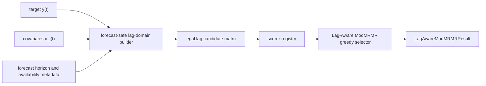

# v0.4.3 — Lag-Aware Catt-Scored ModMRMR: Ultimate Release Plan

Plan type: Actionable release plan — method pivot  
Audience: Maintainer, reviewer, statistician reviewer, Jr. developer  
Target release: `0.4.3` — Current released version: `0.4.1`  
Branch: `feat/v0.4.3-lag-aware-mod-mrmr`  
Status: Draft — template-aligned revision after correctness review  
Last reviewed: 2026-05-04

> [!IMPORTANT]
> **Scope (binding).** This release ships **Lag-Aware ModMRMR** as a forecast-safe sparse covariate-lag selector, with **Catt-style AMI / kNN mutual-information scoring as the scientific native mode** and method-agnostic scorer backends as the extension mechanism.  
> It does **not** ship a generic sklearn-first feature-selection package, downstream framework adapters, Darts/Nixtla imports, model-training benchmarks, broad causal-discovery expansion, or a notebook-first implementation.

> [!NOTE]
> **Cross-release ordering.**
>
> **Companion refs:**
> - `docs/plan/planning_template.md` — required planning style and section ordering.
> - `docs/plan/implemented/*` — implementation-level detail reference.
> - `forecastability-examples` — sibling repository for walkthrough notebooks and executed outputs.
>
> **Builds on:**
> - implemented lagged-exogenous triage surface and sparse selected-lag outputs;
> - implemented covariant/exogenous diagnostics: `cross_ami`, `cross_pami`, `te`, `gcmi`, optional `pcmci`, optional `pcmci_ami`;
> - existing `ForecastPrepContract` hand-off philosophy;
> - AMI-first forecastability fingerprint and Catt-style kNN mutual-information lineage.

---

## 1. Why this plan exists

> The release should let a downstream consumer answer two crisp questions:
>
> 1. Which lagged covariates are informative for `y(t)` and not near-duplicates of already-selected covariate lags?
> 2. Which selected covariate lags are actually available at forecast creation time for the requested forecast horizon?

The pivot is intentional:

```text
Previous v0.4.3 direction:
    generic covariant-informative extension with several new method families

Revised v0.4.3 direction:
    Lag-Aware ModMRMR as the central sparse selector,
    with Catt-style AMI / kNN MI as the native nonlinear scoring mode,
    while preserving interchangeable relevance and redundancy scorer backends.
```

The method is not generic sklearn-first mRMR. It is a forecastability-domain method:

```text
raw y(t), raw x_j(t)
→ forecast-safe lag-domain construction
→ Catt-style AMI or configured relevance scoring
→ max-redundancy suppression against already-selected lags
→ optional target-history novelty suppression
→ typed selected-lag result
→ ForecastPrepContract export
```

> [!IMPORTANT]
> ### Planning principles
>
> | Principle | Implication |
> | --- | --- |
> | Forecast-safe first | A covariate lag is eligible only if it can exist at forecast creation time for the requested horizon. |
> | Hexagonal + SOLID | Lag-domain construction, scorer adapters, greedy selection, export helpers, and rendering adapters are separate modules with no cross-cutting imports. |
> | Catt-native, method-agnostic scoring | Catt-style AMI / kNN MI is the scientific/native scoring mode; relevance and redundancy still use scorer protocols. |
> | Modified mRMR semantics | The default score uses multiplicative maximum-redundancy suppression, not mean-redundancy division. |
> | Honest contribution boundary | Documentation states that mRMR and lag-aware mRMR-style methods are established, while ModMRMR is Adam Krysztopa's project-defined variant. |
> | Honest result semantics | Outputs distinguish evidence, selected candidates, rejected candidates, blocked candidates, legality, and recommendation. |
> | Additive only | Existing public symbols and frozen result shapes are preserved. No field rename or removal without a version bump and migration entry. |
> | Regression visibility | Every behavioral change appears as a fixture diff, not as a silent output flip. |
> | Framework-agnostic core | No `darts`, `mlforecast`, `statsforecast`, `nixtla`, or notebook-only dependency enters the core package. |
> | Examples outside core | Notebooks and integration walkthroughs belong in `forecastability-examples`. |

### Architecture rules

- The core package remains framework-agnostic: no `darts`, `mlforecast`, `statsforecast`, `nixtla`, or downstream forecasting framework imports at runtime, optional-extra, dev, or CI tier.
- All new result models are frozen Pydantic models with closed `Literal` label fields and explicit `Field(...)` descriptions.
- New public symbols are additively re-exported from `forecastability` and/or the existing public triage surface; existing re-exports are not removed.
- New services belong in `src/forecastability/services/`.
- New use cases belong in `src/forecastability/use_cases/`.
- No new top-level package is introduced without an explicit follow-up plan.
- The core method is callable without sklearn estimator semantics.
- A sklearn-compatible wrapper is allowed only as a secondary adapter, not as the canonical public API.
- Relevance, redundancy, and target-history scorers are injected via protocols or small callable objects, not hardwired into the selector.
- Forecast-safety rules are implemented before scoring; illegal lags never enter the greedy selection pool.
- The examples repository receives matching notebooks and executed outputs for the new method.

### Feature inventory

| ID | Feature | Phase | Priority | Status |
| --- | --- | --- | --- | --- |
| LAM-F00 | Frozen Pydantic domain contracts | 0 | P0 | Not started |
| LAM-F01 | Forecast-safe lag-domain builder | 1 | P0 | Not started |
| LAM-F02 | Pairwise scorer protocol, scorer registry, and built-in scorers | 1 | P0 | Not started |
| LAM-F03 | Catt-style AMI / kNN MI relevance and similarity scorer adapters | 1 | P0 | Not started |
| LAM-F04 | AMI/MI normalization strategies for penalty terms | 1 | P0 | Not started |
| LAM-F05 | Lag-Aware ModMRMR greedy selector | 1 | P0 | Not started |
| LAM-F06 | Target-history novelty penalty | 1 | P0 | Not started |
| LAM-F07 | ForecastPrepContract export adapter | 2 | P0 | Not started |
| LAM-F08 | Regression fixtures and deterministic synthetic panels | 2 | P0 | Not started |
| LAM-F09 | Core showcase scripts | 3 | P0 | Not started |
| LAM-F10 | Sibling repo walkthrough notebooks, including synthetic + CausalRivers notebook 09 | 3 | P0 | Not started |
| LAM-F11 | Documentation and theory page | 3 | P1 | Not started |
| LAM-F12 | Optional sklearn wrapper | 4 | P2 | Not started |

### Reviewer acceptance block

`0.4.3` is successful only if all of the following are visible together:

1. Typed surface

   - `LagAwareModMRMRConfig`
   - `ForecastSafeLagCandidate`
   - `SelectedLagAwareFeature`
   - `LagAwareModMRMRResult`
   - `PairwiseScorerSpec`
   - `ScorerDiagnostics`
   - scorer protocol and scorer registry

2. Builder / use case

   - `build_forecast_safe_lag_domain()`
   - `run_lag_aware_mod_mrmr()`
   - no illegal lag enters the scoring pool
   - known-future bypass is explicit and labelled

3. Method-agnostic scorer support

   - relevance scorer is injectable
   - redundancy scorer is injectable
   - target-history scorer is injectable
   - the same nonlinear scorer can be used for relevance and redundancy
   - scorer normalization and clipping are explicit
   - Catt-style AMI / kNN MI scorer mode is available and documented

4. Contribution boundary

   - documentation states that mRMR is established
   - documentation states that lag-aware / temporal mRMR-style feature selection is established
   - documentation states that **ModMRMR is a project-defined mRMR variant proposed by Adam Krysztopa**
   - documentation states that ModMRMR uses multiplicative maximum-redundancy suppression
   - implementation computes maximum redundancy only against already-selected features
   - implementation never computes the ModMRMR penalty against the full candidate pool

5. Regression discipline

   - fixture for known synthetic lag driver
   - fixture for duplicate sensor suppression
   - fixture for lag-neighbour duplicate suppression
   - fixture for target-history proxy suppression
   - fixture for forecast-horizon legality
   - fixture for known-future bypass
   - fixture comparing aggregate redundancy versus maximum-redundancy ModMRMR behavior

6. Ablation discipline

   - relevance-only baseline is shown
   - aggregate classic-style redundancy baseline is shown
   - mean-similarity multiplicative suppression baseline is shown
   - maximum-similarity ModMRMR suppression is shown
   - full Lag-Aware ModMRMR with target-history novelty is shown

7. Showcase scripts

   - `scripts/run_showcase_lag_aware_mod_mrmr.py`
   - `scripts/run_showcase_lag_aware_catt_mod_mrmr.py`
   - smoke mode
   - JSON and Markdown outputs

8. Documentation

   - theory page
   - public API page update
   - examples index update
   - ForecastPrepContract recipe update
   - near-verbatim ModMRMR attribution wording included

9. Sibling repo

   - new notebook: `walkthroughs/08_lag_aware_mod_mrmr_showcase.ipynb`
   - new notebook: `walkthroughs/09_lag_aware_catt_scored_mod_mrmr.ipynb`
   - notebook 09 contains both a controlled synthetic benchmark and a CausalRivers applied walkthrough
   - new notebook or recipe: `recipes/lag_aware_mod_mrmr_to_forecast_prep_contract.ipynb`
   - README notebook index updated
   - notebook CI includes the new notebooks

10. Release engineering

   - additive re-exports only
   - no downstream framework imports
   - no sklearn estimator as canonical API
   - changelog entry included
   - release notes mention ModMRMR attribution and contribution boundary

---

## 2. Theory-to-code map

> [!IMPORTANT]
> Every junior developer MUST read this section before writing any code. This release is a forecast-safe sparse lag-selection release, not a generic feature-selection package.

### 2.1. Notation

Let:

```text
y(t)      = target value at time t
x_j(t)    = j-th candidate covariate at time t
h         = forecast horizon
m         = availability margin
k         = candidate historical lag
S         = already-selected lagged features
Y_hist    = target-history lag set
```

Candidate lagged covariate:

```text
z_j,k(t) = x_j(t - k)
```

Forecast-safe eligibility for ordinary measured covariates:

```text
k >= h + m
```

Known-future exception:

```text
x_j may bypass the ordinary lag cutoff only when declared known_future=True
```

Examples of known-future covariates:

- calendar flags;
- planned production;
- scheduled maintenance;
- contractual setpoints;
- exogenous forecasts, when explicitly treated as forecasted inputs.

### 2.2. Core algorithm

#### 2.2.1. Contribution boundary

This release must be explicit about the novelty boundary.

```text
mRMR is an established feature-selection family.
Lag-aware / temporal mRMR-style feature selection is also established.
This release does not claim novelty for mRMR itself or for the general idea
of applying feature selection to lagged or temporal candidates.
```

The project-specific contribution introduced and named here is **ModMRMR**:

```text
ModMRMR = Adam Krysztopa's modified mRMR-style greedy selection rule
          with multiplicative maximum-redundancy suppression.
```

Public documentation must explicitly attribute the idea as follows:

```text
ModMRMR is a project-defined mRMR variant proposed by Adam Krysztopa.
It modifies the redundancy part of mRMR-style greedy selection by using
multiplicative maximum-similarity suppression against already-selected features.
```

Classic mRMR is treated as the reference family, not as the claimed contribution. Classic mRMR variants select features with high relevance to the target and low aggregate redundancy against the selected subset. Common objective forms include:

```text
MID-style criterion: relevance - aggregate_redundancy
MIQ-style criterion: relevance / aggregate_redundancy
```

Project-defined ModMRMR replaces aggregate redundancy handling with:

```text
score(candidate) =
    relevance(candidate, y)
    × [1 - max_similarity(candidate, selected)]
```

Binding constraint:

```text
max_similarity(candidate, selected) is computed only against already-selected features,
not against the full candidate pool.
```

The max operator implements a nearest-selected-neighbour redundancy veto: a candidate is penalized by its closest already-selected analogue, not by its average similarity to the selected set.

#### 2.2.2. Forecast-safe Lag-Aware ModMRMR score

The simplified score is:

```text
score(z) = relevance(z, y) × [1 - max_redundancy(z, S)]
```

Where:

```text
max_redundancy(z, S) = max similarity(z, s), for s in already-selected features only
```

If `S` is empty:

```text
max_redundancy(z, S) = 0
score(z) = relevance(z, y)
```

Default time-aware score:

```text
score(z) =
    relevance(z, y)
    × [1 - max_redundancy(z, S)]
    × [1 - target_history_redundancy(z, Y_hist)]
```

Where:

```text
target_history_redundancy(z, Y_hist) = max similarity(z, y(t-l)), l in target_lags
```

Purpose:

- prevent the selector from choosing covariates that are only proxies for target autoregression;
- preserve covariates that add genuinely external information;
- keep the method cheap enough for wide industrial sensor panels.

#### 2.2.3. Catt-style AMI fusion

Separation of responsibilities:

```text
ModMRMR = sparse greedy selection logic
Catt-style AMI / kNN MI = nonlinear dependence scoring backend
```

Native scientific score:

```text
score(z_j,k) =
    R_CattAMI(z_j,k, y)
    × [1 - max S_CattAMI(z_j,k, s), s in selected_lags]
    × [1 - max S_CattAMI(z_j,k, y_l), y_l in target_history_lags]
```

Where:

```text
z_j,k(t)       = x_j(t-k)
R_CattAMI      = normalized/significance-aware Catt-style relevance score
S_CattAMI      = normalized Catt-style nonlinear similarity score
selected_lags  = already-selected lagged candidates only
y_l            = target-history lag y(t-l)
```

Design rule:

```text
Catt-style AMI is a scorer backend, not a replacement for the selector.
```

#### 2.2.4. Normalization requirement

Because MI / AMI values are not naturally bounded to `[0, 1]`, every scorer used inside a penalty term must expose a normalized similarity value.

Required invariant:

```text
0 <= similarity(z, s) <= 1
0 <= target_history_redundancy(z, Y_hist) <= 1
relevance(z, y) >= 0
```

Supported normalization strategies:

| Strategy | Use | Comment |
| --- | --- | --- |
| `rank_percentile` | Default practical normalization | Robust across different scorer scales and data units. |
| `surrogate_effect_clip` | Scientific mode | Converts observed-vs-surrogate effect to clipped `[0, 1]` score. |
| `nmi_min_entropy` | Optional | `MI / min(Hx, Hy)` when entropy estimates are available. |
| `nmi_mean_entropy` | Optional | `2MI / (Hx + Hy)` when entropy estimates are available. |

Recommended modes:

```text
fast mode:
    relevance_scorer = mutual_info_sklearn
    redundancy_scorer = spearman_abs
    target_history_scorer = spearman_abs

scientific mode:
    relevance_scorer = catt_ami_effect
    redundancy_scorer = catt_ami_similarity
    target_history_scorer = catt_ami_similarity
    normalization = surrogate_effect_clip or rank_percentile
```

Significance handling:

```text
if relevance_p_value > alpha:
    relevance = 0
else:
    relevance = normalized_effect_size
```

Redundancy remains a similarity penalty and does not need a hard significance gate by default.

#### 2.2.5. Scorer protocol

Recommended scorer protocol:

```python
class PairwiseDependenceScorer(Protocol):
    name: str

    def score_pair(
        self,
        x: np.ndarray,
        y: np.ndarray,
    ) -> float:
        ...
```

The same scorer can be used for relevance and redundancy, but the API must allow different scorers when scale/calibration differs.

Required config support:

```text
relevance_scorer="catt_knn_mi"
redundancy_scorer="catt_knn_mi"
target_history_scorer="catt_knn_mi"
```

and:

```text
relevance_scorer="mutual_info_sklearn"
redundancy_scorer="spearman_abs"
target_history_scorer="spearman_abs"
```

Supported scorer backends for v0.4.3:

| Backend | Relevance | Redundancy | Default? | Notes |
| --- | --- | --- | --- | --- |
| `pearson_abs` | Yes | Yes | No | Cheap linear baseline. |
| `spearman_abs` | Yes | Yes | Yes for fast redundancy | Monotonic nonparametric baseline. |
| `mutual_info_sklearn` | Yes | Optional | Yes for fast relevance | Cheap practical baseline. |
| `catt_knn_mi` / `ksg_mi` | Yes | Yes | Scientific mode | Aligned with AMI/Catt/KSG lineage. |
| `cross_ami_score` | Yes | Optional | Experimental | Useful for lag relevance; requires normalization for redundancy. |
| `gcmi` | Yes | Yes | Experimental | Gaussian-copula nonlinear proxy. |

### 2.3. Mathematical invariants

- Illegal lags never reach the scoring matrix.
- `max_redundancy` is computed only against already-selected features.
- The first selected feature is relevance-only.
- Scores are finite.
- Similarity-like redundancy scores are normalized and clipped to `[0, 1]`.
- Relevance scores are non-negative.
- If `relevance <= relevance_floor`, final score is `0`.
- Final score is clipped at `0` if numerical noise creates a negative value.
- A covariate marked `known_future=True` is labelled as known-future in the result.
- Known-future bypass is explicit; no implicit lag-0 allowance exists.
- Result rows preserve `(covariate, lag, feature_name, legality_reason)`.
- ModMRMR documentation attribution to Adam Krysztopa appears in theory docs, API docs, README release note snippet, and changelog.

---

## 3. Phased delivery

### Phase 0 — Domain contracts

Scope. Land the typed result models, their re-exports, and the schema-evolution policy for Lag-Aware ModMRMR outputs.

Proposed models:

```text
LagAwareModMRMRConfig
ForecastSafeLagCandidate
SelectedLagAwareFeature
RejectedLagAwareFeature
BlockedLagAwareFeature
LagAwareModMRMRResult
PairwiseScorerSpec
ScorerDiagnostics
```

Acceptance criteria:

- Models are frozen Pydantic models.
- Config distinguishes `forecast_horizon`, `availability_margin`, `candidate_lags`, `known_future_covariates`, `target_lags`, `max_selected_features`, `relevance_floor`, and scorer settings.
- Selected rows include relevance, maximum redundancy, target-history redundancy, final score, scorer names, normalization strategy, and legality reason.
- Rejected and blocked candidates are traceable.
- Public exports are additive only.
- Documentation contains the required ModMRMR attribution sentence.

### Phase 1 — Build logic



Acceptance criteria:

- `lag >= forecast_horizon + availability_margin` is enforced before scoring.
- `known_future_covariates` bypass is explicit and labelled.
- `max_redundancy` uses selected features only.
- `score = relevance * (1 - max_redundancy)` works.
- `score = relevance * (1 - max_redundancy) * (1 - target_history_redundancy)` works.
- The same scorer can be used for relevance and redundancy.
- Catt-style AMI scoring can be used for relevance, selected-lag redundancy, and target-history redundancy after normalization.
- All similarity penalties are clipped to `[0, 1]`.
- All selected and rejected candidates preserve diagnostics.

### Phase 2 — Exporters and adapters

Acceptance criteria:

- ForecastPrepContract can consume selected lag candidates.
- Output includes lagged feature names suitable for external modeling libraries.
- Exported structure distinguishes ordinary measured covariates from known-future covariates.
- Markdown exporter prints a compact selected-lag table.
- JSON exporter preserves diagnostics needed for regression tests.
- No external forecasting framework dependency enters the core package.

### Phase 3 — Examples and showcase

Core repo deliverables:

- `scripts/run_showcase_lag_aware_mod_mrmr.py`
- `scripts/run_showcase_lag_aware_catt_mod_mrmr.py`
- `docs/theory/lag_aware_mod_mrmr.md`
- `docs/code/lag_aware_mod_mrmr.md`
- `docs/examples_index.md` update
- changelog entry

Sibling repo deliverables:

- `walkthroughs/08_lag_aware_mod_mrmr_showcase.ipynb`
- `walkthroughs/09_lag_aware_catt_scored_mod_mrmr.ipynb`
- `recipes/lag_aware_mod_mrmr_to_forecast_prep_contract.ipynb`
- optional update to `walkthroughs/07_causal_rivers_lag_and_feature_selection.ipynb`
- README notebook index update
- notebook CI smoke execution

Notebook `09_lag_aware_catt_scored_mod_mrmr.ipynb` is binding and must be two-part:

```text
Part A — Synthetic controlled benchmark
Part B — CausalRivers applied walkthrough
```

Part A proves the method on a known-answer panel:

- generate `y(t)` from known nonlinear lagged drivers, for example `x_driver_1(t-forecast_horizon)` and `x_driver_2(t-2*forecast_horizon)`;
- include near-duplicate sensors, smoothed duplicates, lag-neighbour duplicates, and pure noise covariates;
- show that illegal lags below `forecast_horizon + availability_margin` are blocked;
- show that the selected set recovers the true drivers or nearby legal lags;
- show that duplicate covariates are suppressed after one representative is selected.

Part B demonstrates realistic interpretation on the existing CausalRivers storyline:

- treat one downstream river/node as `y(t)`;
- treat upstream rivers/drivers as covariates;
- run fast mode and Catt-scored scientific mode;
- compare selected covariate-lag sets;
- explicitly state that CausalRivers is used as an applied plausibility walkthrough, not as a hard recovery benchmark;
- export selected lags to the ForecastPrepContract-oriented format.

Acceptance criteria:

- Showcase demonstrates duplicate suppression.
- Showcase demonstrates horizon legality.
- Showcase demonstrates target-history novelty penalty.
- Showcase demonstrates same nonlinear scorer for relevance and redundancy.
- Showcase demonstrates Catt-style AMI scoring mode and compares it with fast MI/Spearman mode.
- Showcase includes the required ablation: relevance-only, aggregate classic-style redundancy, mean-similarity multiplicative suppression, maximum-similarity ModMRMR suppression, and full Lag-Aware ModMRMR.
- Notebook 09 includes both synthetic known-answer recovery and CausalRivers applied interpretation.
- ForecastPrepContract hand-off is demonstrated.

### Phase 4 — Optional sklearn wrapper

Scope. Add only if useful after the domain method is stable.

Acceptance criteria:

- Wrapper delegates to `run_lag_aware_mod_mrmr()`.
- Wrapper is not the canonical public API.
- Wrapper does not introduce sklearn as a hard new architectural dependency if not already acceptable.
- Wrapper documentation states that the domain use case is the recommended API.

---

## 4. Out of scope

- Generic sklearn-first feature-selection framework.
- Claiming novelty for mRMR itself.
- Claiming novelty for the general concept of temporal, time-series, or lag-aware mRMR-style feature selection.
- Darts, MLForecast, StatsForecast, Nixtla, or downstream forecasting framework adapters in the core package.
- Model-training benchmarks as release blockers.
- Broad causal-discovery expansion.
- PCMCI performance work.
- Rust acceleration.
- Notebook-only implementation.
- Rewriting existing covariant-informative diagnostics.
- Breaking public API changes.

---

## 5. Open questions

1. Should `rank_percentile` or `surrogate_effect_clip` be the default normalization for scientific Catt-style AMI mode?
2. Should target-history novelty be enabled by default or remain opt-in for the first release?
3. Should the optional sklearn wrapper ship in `0.4.3`, or be deferred until the canonical use case has stabilized?
4. Should the first public examples prefer Spearman/MI fast mode for speed, or Catt-style AMI mode for scientific alignment?
5. Should `known_future_covariates` support per-horizon availability metadata in `0.4.3`, or only a boolean bypass with explicit labels?

