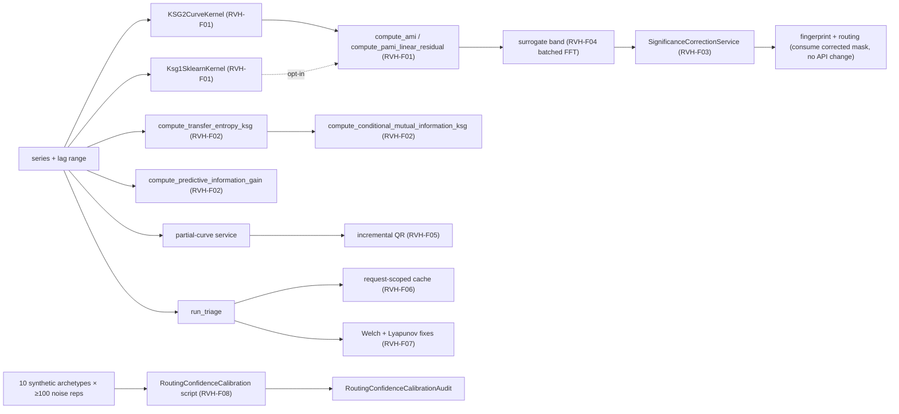
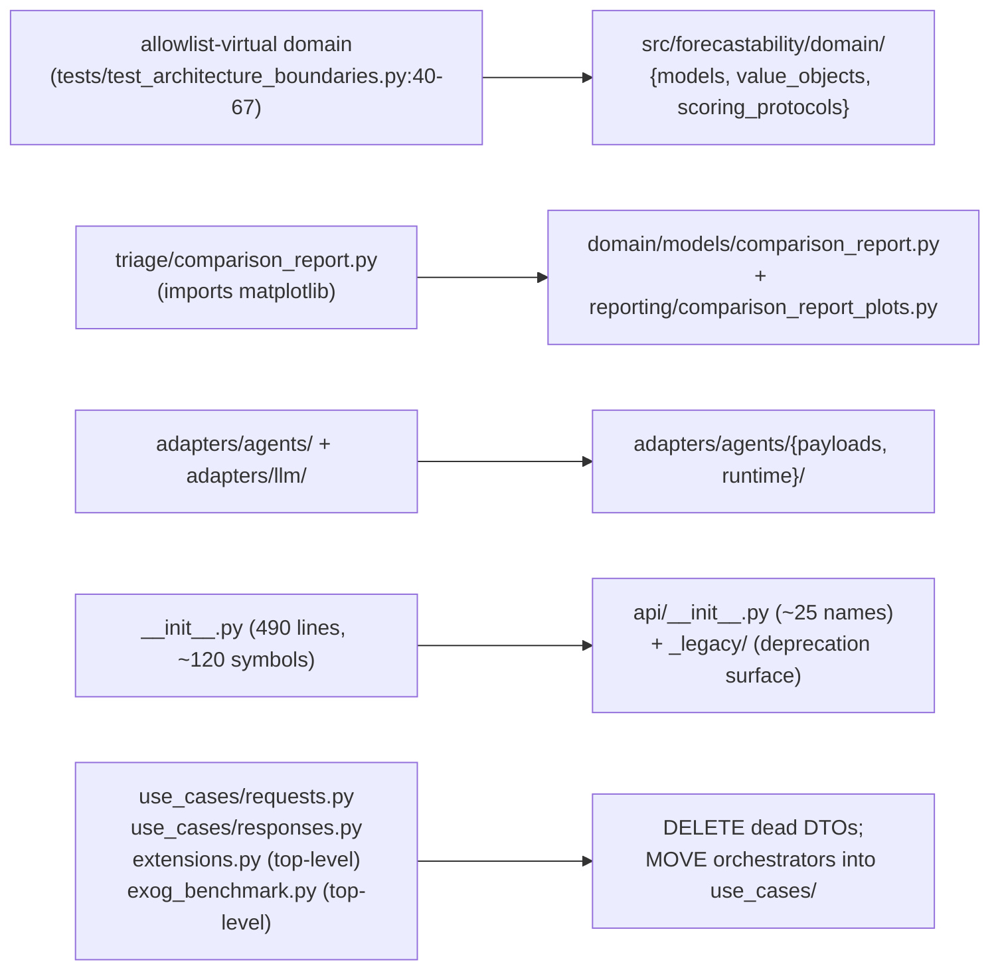

<!-- type: reference -->

# v0.5.0 — Review-Driven Hardening: Math Honesty, Architecture Realignment, Efficiency Reset

**Plan type:** Actionable release plan — review-driven hardening pass with intentional breaking changes
**Audience:** Maintainer, reviewer, statistician reviewer, Jr. developer
**Target release:** `0.5.0` — headline major release; first breaking-change cut since v0.2.0 PyPI publication
**Current released version:** `0.4.3`
**Branch:** `feat/v0.5.0-review-hardening`
**Status:** Draft
**Last reviewed:** 2026-05-24

> [!IMPORTANT]
> **Scope (binding).** This release ships:
> - A unified Chebyshev KSG-II curve kernel that becomes the canonical estimator for every public AMI / pAMI surface, with `estimator="ksg1_sklearn"` available as an opt-in compatibility kernel.
> - A true Frenzel-Pompe KSG conditional mutual information estimator under the new name `compute_transfer_entropy_ksg`, and an honest rename of the existing residual-MI surface to `compute_predictive_information_gain` (with the misleading umbrella name `compute_transfer_entropy` removed).
> - Romano-Wolf step-down family-wise correction across lags for every surrogate significance band, with the legacy uncorrected mode preserved behind `correction="none"`.
> - A physical `src/forecastability/domain/` package that replaces the allowlist-virtual layer, including migration of the 18 modules currently tagged as domain.
> - Vectorized hot loops (phase-randomization, ordinal patterns, Theiler-window filter, DFA fluctuation), incremental QR for partial-curve residualization, request-scoped memoization, and three other top-five performance fixes from the v0.4.3 deep audit.
> - PBE-F* performance budget tests, numerical golden tests against closed-form Gaussian MI, and a published migration guide.
> - The v0.5.0 release tag, CHANGELOG entry, pyproject version bump, and PyPI publication.
>
> It does **not** ship:
> - Any new diagnostic family (no new fingerprint metrics, no new spectral diagnostics, no causal-discovery algorithm additions beyond the existing PCMCI-AMI hybrid).
> - Any framework-specific adapter (`darts`, `mlforecast`, `statsforecast`, `nixtla` remain out of the core repo).
> - Notebook content (sibling `forecastability-examples` repo covers walkthroughs).
> - Any new optional extra beyond the existing `[agent]`, `[causal]`, `[data]`.
> - A new dashboard, MCP, or transport surface.
>
> Binding driver document: [aux_documents/developer_instruction_repo_scope.md](aux_documents/developer_instruction_repo_scope.md).

> [!NOTE]
> **Cross-release ordering.** This is a standalone major release with no chained predecessor or successor. It is the first release after the v0.4.3 deep audit ([docs/reviews/v0.4.3-deep-audit.md](../reviews/v0.4.3-deep-audit.md)) and consumes every Critical and most Important findings from that report. A v0.5.1 follow-up would land remaining Minors (citations in module headers, BH-corrected ranks at the geometry threshold, dcov streaming form).

**Companion refs:**

- [docs/reviews/v0.4.3-deep-audit.md](../reviews/v0.4.3-deep-audit.md) — review driver document
- [v0.4.3 — Lag-Aware ModMRMR Plan](implemented/v0_4_3_lag_aware_catt_mod_mrmr_plan_template_aligned.md) — most recent shipped plan
- [v0.4.1 — Performance Hardening Plan](implemented/v0_4_1_performance_bottleneck_elimination_ultimate_plan.md) — sets perf-budget precedent (PBE-F* tags)
- [docs/plan/planning_template.md](planning_template.md) — required style
- [docs/plan/acceptance_criteria.md](acceptance_criteria.md) — invariants

**Builds on:**

- implemented `KSG2ProfileKernel` port from `src/forecastability/ports/kernels.py:120-148` (declares the contract this release finally implements end-to-end)
- implemented `AmiInformationGeometry._ksg2_median_profile_value` reference kernel from `src/forecastability/services/ami_information_geometry_service.py:112-164`
- implemented frozen-Pydantic discipline from `src/forecastability/utils/types.py` and `src/forecastability/triage/models.py`
- implemented `ReadinessReport` typed gate from `src/forecastability/triage/readiness.py`
- implemented surrogate phase-randomization Hermitian path from `src/forecastability/diagnostics/surrogates.py:33-63`
- implemented hexagonal boundary AST tests from `tests/test_architecture_boundaries.py`
- implemented PBE-F* tagging convention from v0.4.1 (`PBE-F08` guardrail at `src/forecastability/metrics/scorers.py:354-389`)

---

## 1. Why this plan exists

The v0.4.3 deep audit ([docs/reviews/v0.4.3-deep-audit.md](../reviews/v0.4.3-deep-audit.md)) identified one structural pattern that repeats across all three reviewed dimensions: **a declared contract is honored in one canonical place and not propagated anywhere else.**

- **Math.** `compute_ami_information_geometry` implements KSG-II + median-over-k correctly. Every other public AMI / pAMI surface — `compute_ami`, `compute_pami_linear_residual`, `_compute_raw_curve_prescaled`, `_compute_partial_curve_prescaled`, the surrogate-band scorers — delegates to `sklearn.feature_selection.mutual_info_regression`, which is single-k KSG-I. The README, the Medium article, the docstrings everywhere claim "KSG-II + median over k ∈ {3, 5, 8}". This is paper-vs-code drift.
- **Architecture.** `tests/test_architecture_boundaries.py` enforces a strict hex boundary against a hand-curated allowlist of 18 paths. There is no physical `src/forecastability/domain/` directory; a contributor opening the repo cannot point at the domain layer. One file (`triage/comparison_report.py`) is silently excluded with a documented `# TODO` because it imports matplotlib.
- **Efficiency.** `_ksg2_median_profile_value` is the *correct* vectorized hot loop. `PurePythonBatchedKnnMiKernel` (the kernel actually used by the production surrogate-band code) rebuilds the same kNN tree up to 12 000 times per series for a typical `max_lag=40, n_surrogates=99` band. The `KSG2ProfileKernel` port that would fix this has been declared in `ports/kernels.py:120-148` since v0.4.1 — never implemented.

This release closes the gap. The right next step is not a refactor scattered across the codebase — it is making the canonical implementations **the only implementations** of their respective contracts. One unified KSG-II kernel that every curve service routes through fixes the math drift, removes the dominant perf hotspot, and naturally suggests the physical domain boundary that is currently virtual.

> The release should let a downstream consumer answer two crisp questions:
>
> 1. *"When the docs say KSG-II, is that what actually runs on my series?"* — Yes, by default, everywhere. The legacy KSG-I path is preserved as `estimator="ksg1_sklearn"` for users who need bit-identical reproduction of v0.4.3 numerics.
> 2. *"When the docs say 'Schreiber transfer entropy', is that what I get?"* — Yes, via `compute_transfer_entropy_ksg` (Frenzel-Pompe KSG-CMI). The existing residual-MI estimator is preserved under the honest name `compute_predictive_information_gain`. The umbrella name `compute_transfer_entropy` is removed (this is the deliberate breaking change that justifies the major version bump).

> [!IMPORTANT]
> The single largest semantic risk in this release is **silent numerical migration**. Users who call `compute_ami(series, max_lag=20)` after upgrade will get KSG-II values that differ from v0.4.3 KSG-I values by a few percent on typical inputs. Every public docstring, the migration guide, the CHANGELOG, and the release-notes blog post must lead with "default estimator changed; pass `estimator='ksg1_sklearn'` to reproduce v0.4.3 numerics exactly." The new geometry kernel must produce v0.4.3-equivalent numerics when called with `estimator="ksg1_sklearn"`, verified by a regression fixture stored under `docs/fixtures/v0_5_0_regression/`.

### Planning principles

| Principle | Implication |
| --- | --- |
| Hexagonal + SOLID, physically realized | A physical `src/forecastability/domain/` package replaces the allowlist-virtual layer. AST boundary tests enforce both the allowlist (legacy) and the directory structure (new). |
| Honest semantics over backwards compatibility | Where naming is wrong, rename. Where math is wrong, fix. Both old and new live side-by-side under distinct names — no silent flips, no compatibility shims that pretend the old name still means what it used to. |
| Multiple coexisting implementations under distinct names | The new and the old can ship together when both are legitimate (e.g. KSG-II default + KSG-I opt-in; KSG-CMI true TE + residual-MI predictive information gain). Each gets its own public name; the user picks. |
| Defaults that match docs | Every default behaviour in v0.5.0 matches what the docs claim. Where the v0.4.3 default contradicted the v0.4.3 docs, v0.5.0 changes the default. |
| Regression visibility | Every numerical-default change is captured as a fixture diff under `docs/fixtures/v0_5_0_regression/`. A reviewer must be able to see the magnitude of every default flip before merge. |
| Performance is a contract | PBE-F* tests enforce time budgets on the new kernel. A future regression that doubles surrogate-band wall-clock fails CI before reaching main. |
| Determinism preserved | `SeedSequence.spawn` propagation, serial-vs-parallel bit identity, and `random_state` plumbing are not affected by this release. New parallelism switches preserve bit identity. |
| Frozen Pydantic at every public boundary | Agent tool returns become frozen Pydantic models, not `dict[str, Any]`. New result types for KSG-CMI, calibration audit, and perf-budget reports are frozen with closed `Literal` label fields. |
| `np.trapezoid`, `n_surrogates >= 99`, AMI/pAMI horizon-specific | The scientific invariants from `docs/plan/acceptance_criteria.md` are non-negotiable. |
| Migration guide is shippable, not aspirational | `docs/migration/v0.4.x_to_v0.5.0.md` ships with the release and is exercised by a smoke test that runs every snippet in the guide. |

### Architecture rules

- The core package remains **framework-agnostic**: no `darts`, `mlforecast`, `statsforecast`, or `nixtla` imports at any tier.
- All new public symbols are **frozen Pydantic models** with closed `Literal` label fields and explicit `Field(...)` descriptions.
- The physical `src/forecastability/domain/` package contains **only** domain models, value objects, and pure-functional helpers. It imports `numpy`, `pandas`, `pydantic`. It does **not** import `sklearn`, `scipy`, `statsmodels`, `pydantic_ai`, `fastapi`, `mcp`, `httpx`, `matplotlib`, or any module from `forecastability.adapters`, `forecastability.services`, or `forecastability.use_cases`.
- The new unified KSG-II kernel lives at `src/forecastability/kernels/ksg2_curve_kernel.py`. The pure-Python `PurePythonBatchedKnnMiKernel` is **deleted**, not deprecated; the new kernel becomes the only implementation of `KSG2ProfileKernel`. The legacy KSG-I behaviour is exposed by `src/forecastability/kernels/ksg1_sklearn_kernel.py` as a separate kernel with its own `Ksg1SklearnKernel` protocol class.
- The renamed `compute_predictive_information_gain` keeps its current implementation byte-for-byte (only the name changes); the new `compute_transfer_entropy_ksg` is a fresh implementation built on `compute_conditional_mutual_information_ksg`.
- No new top-level package is introduced. The new `kernels/ksg2_curve_kernel.py`, `kernels/ksg1_sklearn_kernel.py`, `diagnostics/cmi_ksg.py`, `services/significance_correction_service.py`, `domain/` package, and `api/` re-export layer are the only new module locations.
- All renames are accompanied by a migration error: importing the old name raises `ImportError` with the new name and a one-line migration recipe. No silent forwarding.

### Feature inventory

ID prefix: **RVH** (Review-driven hardening).

| ID | Feature | Phase | Priority | Status |
| --- | --- | --- | --- | --- |
| RVH-F00 | Typed contracts: new kernel protocols, KSG-CMI result, calibration audit, perf-budget report | 0 | P0 | ✅ Done |
| RVH-F01 | Unified Chebyshev KSG-II curve kernel (canonical implementation of `KSG2ProfileKernel`) | 1 | P0 | ✅ Done |
| RVH-F02 | Frenzel-Pompe KSG-CMI estimator, renamed TE surfaces, CMI as public surface, quality_warning, PIG asymmetry docstring | 1 | P0 | ✅ Done |
| RVH-F03 | Romano-Wolf + BH + Benjamini-Yekutieli significance correction; `significance_correction_service` | 1 | P0 | ✅ Done |
| RVH-F04 | Vectorized hot loops: phase-randomization batching, ordinal pattern indexing, Theiler-window filter, DFA fluctuation | 1 | P0 | ✅ Done |
| RVH-F05 | Incremental QR partial-curve residualization (`metrics/_lag_design.py` rewrite) | 1 | P1 | Not started |
| RVH-F06 | Request-scoped memoization in `run_triage` (`_scale_series`, Welch PSD, AMI curve) | 1 | P1 | Not started |
| RVH-F07 | Welch nperseg fix, Lyapunov linear-window fit, cardinality-aware MI fallback to GCMI | 1 | P1 | Not started |
| RVH-F08 | Routing-confidence calibration: synthetic suite × noise replicates, threshold fitting against target precision | 1 | P1 | Not started |
| RVH-F09 | Physical `src/forecastability/domain/` package: migrate 18 modules, retire allowlist | 2 | P0 | Not started |
| RVH-F10 | Split `triage/comparison_report.py` into domain model + `reporting/comparison_report_plots.py`; retire `# TODO` from boundary tests | 2 | P1 | Not started |
| RVH-F11 | Typed Pydantic returns from agent tools (replace `dict[str, Any]`); merge `adapters/{agents,llm}/` under `adapters/agents/{payloads,runtime}/` | 2 | P1 | Not started |
| RVH-F12 | `forecastability.api` shrunk public surface; deprecate notebook-compat sprawl with explicit migration errors | 2 | P1 | Not started |
| RVH-F13 | Delete dead DTOs (`use_cases/requests.py`, `use_cases/responses.py`); move `extensions.py`, `exog_benchmark.py` into `use_cases/` | 2 | P1 | Not started |
| RVH-F14 | Numerical golden tests: Gaussian-MI round-trip; KSG-II vs KSG-I regression-fixture diff | 4 | P0 | Not started |
| RVH-F15 | PBE-F* performance budget tests: surrogate band, curve kernel, ModMRMR | 4 | P0 | Not started |
| RVH-F16 | Migration guide `docs/migration/v0.4.x_to_v0.5.0.md`; CHANGELOG; README refresh | 6 | P0 | Not started |
| RVH-F17 | Release engineering: version bump, fixture rebuild, tag, PyPI publication, post-release announcement | 6 | P0 | Not started |

---

### Reviewer acceptance block

`0.5.0` is successful only if all of the following are visible together:

1. **Canonical KSG-II kernel**
   - `KSG2CurveKernel` class at `src/forecastability/kernels/ksg2_curve_kernel.py` implements `KSG2ProfileKernel` from `ports/kernels.py:120-148`.
   - One Chebyshev `cKDTree` is constructed per `(past, future)` joint slice; marginal counts use `np.searchsorted` on pre-sorted arrays; the `(n_lags, n_k)` matrix is returned in one call.
   - `PurePythonBatchedKnnMiKernel` is deleted (the file `kernels/batched_knn_mi.py` is renamed to `kernels/ksg1_sklearn_kernel.py` and rewritten as the KSG-I compatibility kernel).
   - Every public AMI / pAMI helper (`compute_ami`, `compute_pami_linear_residual`, `compute_ami_information_geometry`, raw and partial curve services, surrogate scorers) routes through `KSG2CurveKernel` by default.

2. **Honest transfer-entropy surfaces**
   - `compute_transfer_entropy_ksg` (Frenzel-Pompe true KSG-CMI) lives at `src/forecastability/diagnostics/cmi_ksg.py`.
   - `compute_predictive_information_gain` (renamed legacy residual-MI) lives at `src/forecastability/diagnostics/predictive_information_gain.py`.
   - `compute_transfer_entropy` is **removed** (importing it raises `ImportError` with the migration recipe).
   - Both new functions return frozen Pydantic result types (`TransferEntropyKsgResult`, `PredictiveInformationGainResult`) with closed `Literal` label fields.

3. **Family-wise corrected significance**
   - `SignificanceCorrectionService` at `src/forecastability/services/significance_correction_service.py` implements Romano-Wolf step-down across lags using the surrogate matrix already in memory.
   - `compute_significance_bands_generic` and the geometry-engine threshold check both accept `correction: Literal["romano_wolf", "bh", "none"] = "romano_wolf"`.
   - The fingerprint, routing, and complexity-band consumers do not need to change; they consume the corrected mask transparently.

4. **Physical domain layer**
   - `src/forecastability/domain/` exists as a directory with `__init__.py` and at minimum these subpackages: `domain/models/`, `domain/value_objects/`, `domain/scoring_protocols/`.
   - The 18 modules currently tagged as domain in `tests/test_architecture_boundaries.py:40-67` are moved into `domain/` with imports updated repo-wide.
   - The allowlist in `test_architecture_boundaries.py` is replaced with a structural check: every module under `src/forecastability/domain/` must pass the `_DOMAIN_FORBIDDEN` rule. The allowlist is deleted, not just shortened.
   - `triage/comparison_report.py` is split into a domain model under `domain/models/comparison_report.py` and a renderer under `reporting/comparison_report_plots.py`; the `# TODO` at `tests/test_architecture_boundaries.py:78` is deleted.

5. **Typed agent boundaries**
   - All PydanticAI tools in `src/forecastability/adapters/llm/*_agent.py` return frozen Pydantic models, not `dict[str, Any]`.
   - `adapters/agents/` and `adapters/llm/` are merged into `adapters/agents/{payloads,runtime}/` with a single `__init__.py` documenting the split.
   - The deprecated shim `adapters/pydantic_ai_agent.py` is **removed** (importing it raises `ImportError` with the migration recipe).

6. **Shrunk public surface**
   - `src/forecastability/api/__init__.py` exists with the canonical ~25 public names (curated by the maintainer, not auto-generated from every existing export).
   - `src/forecastability/__init__.py` becomes a thin shim that re-exports from `api/` plus a `_legacy/` module that emits a `DeprecationWarning` on access for every notebook-compat name.
   - Dead DTOs `use_cases/requests.py` and `use_cases/responses.py` are deleted; `extensions.py` and `exog_benchmark.py` are moved into `use_cases/` with import paths updated.

7. **Performance budgets**
   - `tests/test_perf_budget_surrogate_band.py`, `tests/test_perf_budget_curve_kernel.py`, `tests/test_perf_budget_mod_mrmr.py` exist and pass on CI within the documented wall-clock budgets.
   - The budgets are stored in `tests/perf_budgets.yml` so they can be tuned without code changes; each budget references the v0.5.0 baseline measurement.
   - PBE-F* tags are assigned to the new tests (next free identifier in the sequence; coordinate with v0.4.1 conventions).

8. **Numerical regression discipline**
   - `tests/test_gaussian_mi_golden.py` asserts that `KSG2CurveKernel` recovers `−½ ln(1 − ρ²)` within 5% for `ρ ∈ {0.2, 0.5, 0.8}` at `N = 5000`.
   - `tests/test_v0_5_0_regression_fixtures.py` exercises every fixture under `docs/fixtures/v0_5_0_regression/` to verify both the new (KSG-II) and the legacy (KSG-I) numerics are reproduced bit-identically.
   - `docs/fixtures/v0_5_0_regression/` contains side-by-side AMI, pAMI, surrogate-band, fingerprint, and routing outputs for at least 5 canonical series: AR(1), white noise, sine + AR(1), Lorenz first coordinate, M4 hourly slice.

9. **Calibrated routing confidence**
   - `RoutingConfidenceCalibrationAudit` frozen Pydantic model is generated by `scripts/run_routing_confidence_calibration.py` against the existing 10-archetype suite × ≥ 100 noise replicates.
   - The thresholds in `RoutingPolicyAuditConfig` are derived from a stated precision target (e.g. "90% of `high` recommendations have correct family") rather than hand-picked. The derivation is committed under `docs/calibration/v0_5_0_routing_confidence.md`.
   - The word "calibrated" appears in public docstrings only where the threshold was actually fit against a precision target.

10. **Migration is shippable**
    - `docs/migration/v0.4.x_to_v0.5.0.md` exists with a complete enumeration of breaking changes, the migration recipe for each, and at least one runnable code snippet per breaking change.
    - `tests/test_migration_guide_snippets.py` exercises every code snippet in the migration guide.
    - The CHANGELOG entry leads with the breaking-change section and links to the migration guide.

11. **Release engineering**
    - Version bump committed in `pyproject.toml`, `src/forecastability/__init__.py`, `CHANGELOG.md`, `README.md`.
    - All fixture rebuild scripts re-run and re-committed; smoke run on a fresh `uv sync` clean.
    - Git tag `v0.5.0` created on `feat/v0.5.0-review-hardening` after merge to `main`; PyPI publication via the existing Trusted Publishing workflow; release notes posted to the GitHub Releases page.

12. **Documentation parity with implementation**
    - Every public docstring that mentions "KSG-II", "Schreiber transfer entropy", "calibrated", "hexagonal domain", or any other term whose meaning changes in this release is audited and updated.
    - The Medium article ([docs/medium/forecastability-triage-for-practitioners.md](../medium/forecastability-triage-for-practitioners.md)) gets a v0.5.0 erratum at the top linking the migration guide.
    - The README quickstart is re-run end-to-end and the output captured.

---

## 2. Theory-to-code map

> [!IMPORTANT]
> Every junior developer MUST read this section before writing any code.
> This release is **small in surface area but high in semantic risk**: changing the default MI estimator silently shifts every downstream numeric. Without per-fixture regression diffs, a quiet 3% drift becomes invisible debt.

### 2.1. Notation

- $X = (X_1, \ldots, X_N)$ — univariate series.
- $h \in \{1, 2, \ldots, H\}$ — forecast horizon (lag).
- $I(X_t ; X_{t-h})$ — AMI at horizon $h$. Maps to the value at index `h` of the array returned by `compute_ami(...)`.
- $I(X_t ; X_{t-h} | X_{t-1}, \ldots, X_{t-h+1})$ — pAMI at horizon $h$ (true conditional MI). Maps to the value at index `h` of `compute_pami_linear_residual(...)` *under joint-Gaussian assumptions only*. For non-Gaussian processes, the residual-MI estimator is a Gaussian approximation, not the true CMI.
- $\hat{I}_{\text{KSG-II}}(X, Y; k)$ — KSG-II estimator with neighbour count $k$ (Kraskov, Stögbauer, Grassberger 2004, Eq. 9). Implemented in `KSG2CurveKernel.estimate_curve(...)`.
- $\hat{I}_{\text{KSG-I}}(X, Y; k=8)$ — sklearn's default estimator inside `mutual_info_regression`. Exposed as the opt-in `Ksg1SklearnKernel` for legacy reproduction.
- $\text{CMI}_{\text{FP}}(X, Y, Z; k)$ — Frenzel-Pompe KSG-CMI (Frenzel & Pompe 2007). Implemented in `compute_conditional_mutual_information_ksg(...)`.
- $\text{TE}_{Y \to X}(L) = \text{CMI}_{\text{FP}}(X_t, Y_{t-L}, X_{t-1}, \ldots, X_{t-L+1})$ — Schreiber transfer entropy via KSG-CMI. Implemented in `compute_transfer_entropy_ksg(...)`.
- $\text{PIG}_{Y \to X}(L)$ — predictive information gain: MI between residualised future and residualised lagged-source after regressing both on target history. Implemented in `compute_predictive_information_gain(...)`. **Not** Schreiber TE.
- $\{\tilde{I}_h^{(s)}\}_{s=1}^{B}$ — surrogate values at horizon $h$ for $B \geq 99$ phase-randomised surrogates. Computed in `KSG2CurveKernel.estimate_surrogate_band(...)`.

### 2.2. Core algorithm — unified KSG-II curve kernel

For input series $X$ of length $N$, lag range $\{1, \ldots, H\}$, and neighbour counts $\mathcal{K} = \{k_1, \ldots, k_m\}$:

1. **One-shot jitter.** Apply `_apply_one_shot_jitter` once at the entry point, scaled to `1e-7 * std(X)`. For low-cardinality inputs (`unique / N < 0.5`) route to `Ksg1SklearnKernel(estimator="gcmi_rank")` and skip jitter.
2. **Build joint matrices once.** For each $h$, construct $J_h = \text{column\_stack}(X_{t-h}, X_t)$ of shape $(N - h, 2)$.
3. **Single kNN build per horizon.** `cKDTree(J_h, leafsize=16)` with Chebyshev metric. Query `query(J_h, k = max(\mathcal{K}) + 1)` once to get indices of `k_max + 1` joint neighbours (slot 0 is self).
4. **Marginal counts via searchsorted.** Pre-sort the marginal axes once. For each $k \in \mathcal{K}$: the radius is $\varepsilon_h^{(k)} = \max_i \|J_h[i] - J_h[\text{indices}[i, k]]\|_\infty$. Marginal counts $n_x, n_y$ via `searchsorted(sorted_x, x_i \pm \varepsilon_h^{(k)})`. Estimator: $\hat{I}_{\text{KSG-II}}(h, k) = \psi(k) - 1/k + \psi(N) - \langle \psi(n_x) + \psi(n_y) \rangle$.
5. **Median across $\mathcal{K}$.** Return $(H \times m)$ matrix; median across the $k$-axis for the canonical profile.
6. **Surrogate band.** Generate $B$ phase surrogates in one batched FFT call (see RVH-F04). For each surrogate, repeat steps 2-5; aggregate into the surrogate distribution $\{\tilde{I}_h^{(s)}\}$.
7. **Correction.** Apply `SignificanceCorrectionService(correction=...)` to the surrogate distribution; emit corrected per-lag mask.

### 2.3. Mathematical invariants

> [!IMPORTANT]
> **Invariant A** — every public AMI / pAMI estimate flows from `KSG2CurveKernel` by default.
> Enforced by: `tests/test_kernel_routing.py::test_compute_ami_routes_through_ksg2_curve_kernel`.

> [!IMPORTANT]
> **Invariant B** — `KSG2CurveKernel.estimate_curve(...)` is mathematically equivalent to the v0.4.3 `_ksg2_median_profile_value` reference (numerically identical to ≤ 1e-9 relative error on shared inputs).
> Enforced by: `tests/test_kernel_parity.py::test_v0_5_0_curve_kernel_matches_reference`.

> [!IMPORTANT]
> **Invariant C** — `Ksg1SklearnKernel(...)` reproduces v0.4.3 numerics bit-identically.
> Enforced by: `tests/test_v0_5_0_regression_fixtures.py::test_ksg1_sklearn_matches_v0_4_3_fixture`.

> [!IMPORTANT]
> **Invariant D** — `compute_transfer_entropy_ksg(X, Y, lag)` equals analytical Schreiber TE for jointly-Gaussian VAR(1) processes within 5% at `N = 5000`.
> Enforced by: `tests/test_te_ksg_golden.py::test_gaussian_var1_recovers_analytical_te`.

> [!IMPORTANT]
> **Invariant E** — Romano-Wolf step-down across $H$ horizons controls the family-wise Type-I error at nominal $\alpha$.
> Enforced by: `tests/test_significance_correction.py::test_romano_wolf_controls_fwer` (Monte-Carlo with $10^4$ null replicates).

> [!IMPORTANT]
> **Invariant F** — every module under `src/forecastability/domain/` passes the `_DOMAIN_FORBIDDEN` rule; no allowlist needed.
> Enforced by: `tests/test_architecture_boundaries.py::test_domain_package_has_no_forbidden_imports`.

> [!IMPORTANT]
> **Invariant G** — `n_surrogates >= 99` continues to be enforced at every entry point that consumes surrogates.
> Enforced by: existing `_validate_significance_surrogate_count` and the new boundary check inside `KSG2CurveKernel.estimate_surrogate_band`.

> [!IMPORTANT]
> **Invariant H** — Surrogate phase-randomization remains Hermitian-correct: DC bin and Nyquist bin keep phase 0; interior phases uniform on $[0, 2\pi)$.
> Enforced by: existing `tests/plugin_parity/test_phase_surrogate_parity.py` (no change needed; the batched RVH-F04 implementation must continue to pass it).

---

## 3. Phased delivery

### Phase 0 — Domain contracts

**Scope.** Land the new typed surface before any implementation. This phase has no compute logic; it only defines types, declares protocols, and confirms imports resolve.

**Modules created:**

- `src/forecastability/ports/ksg2_curve_kernel.py` — formal `KSG2CurveKernel` protocol (the existing `ports/kernels.py:Ksg2ProfileKernel` is the precedent; extract into its own module and broaden the signature to support the batched surrogate path).
- `src/forecastability/ports/ksg1_sklearn_kernel.py` — `Ksg1SklearnKernel` protocol for the opt-in legacy kernel.
- `src/forecastability/domain/__init__.py` — empty stub (subpackages added in Phase 2).
- `src/forecastability/domain/results/transfer_entropy_ksg.py` — frozen `TransferEntropyKsgResult` with closed `Literal` label fields (`status: Literal["computed", "blocked"]`).
- `src/forecastability/domain/results/predictive_information_gain.py` — frozen `PredictiveInformationGainResult`.
- `src/forecastability/domain/results/significance_correction.py` — frozen `SignificanceCorrectionResult` with `correction: Literal["romano_wolf", "bh", "none"]` and `family_wise_alpha: float`.
- `src/forecastability/domain/results/calibration_audit.py` — frozen `RoutingConfidenceCalibrationAudit`.
- `src/forecastability/domain/results/perf_budget.py` — frozen `PerfBudgetReport` with `budget_seconds: float`, `measured_seconds: float`, `pbe_tag: str`.

**Acceptance criteria:**

- All new frozen Pydantic models exist with closed Literal label fields and explicit `Field(...)` descriptions.
- All new protocols are reachable from both `forecastability.ports` (deep import) and `forecastability.api` (Phase 2 wiring).
- `uv run ty check` passes on the new modules.
- `uv run pytest tests/test_architecture_boundaries.py -q` passes — the new `domain/` directory is empty, so no allowlist drift yet.
- `docs/migration/v0.4.x_to_v0.5.0.md` is created with section stubs (filled in Phase 6).
- No runtime import of any forecasting framework introduced.

### Phase 1 — Build logic

This is the largest phase. It implements the new kernel, the new estimators, the corrections, the hot-loop vectorizations, and the calibration. Phase 1 has 8 sub-features (RVH-F01 through RVH-F08); they are independent enough to be implemented in parallel by different developers.

**Per-feature acceptance criteria.**

**RVH-F01 — Unified KSG-II curve kernel.**
- `KSG2CurveKernel` class at `src/forecastability/kernels/ksg2_curve_kernel.py` implements `ports.ksg2_curve_kernel.KSG2CurveKernel`.
- The contract is: `estimate_curve(series, lag_range, k_list) -> (H, m) ndarray`; `estimate_surrogate_band(series, lag_range, k_list, n_surrogates, rng) -> (B, H, m) ndarray`.
- One `cKDTree` build per joint slice; marginal counts via `np.searchsorted`; `psi` calls vectorized on the full array (no per-point Python loop).
- `Ksg1SklearnKernel` at `src/forecastability/kernels/ksg1_sklearn_kernel.py` wraps the v0.4.3 sklearn path for bit-identical reproduction.
- `PurePythonBatchedKnnMiKernel` is deleted; `kernels/batched_knn_mi.py` becomes `kernels/ksg1_sklearn_kernel.py` with content fully replaced.
- All callers of `_compute_raw_curve_prescaled`, `_compute_partial_curve_prescaled`, `compute_ami`, `compute_pami_linear_residual` accept `estimator: Literal["ksg2", "ksg1_sklearn"] = "ksg2"` and route accordingly.
- `tests/test_kernel_parity.py` and `tests/test_kernel_routing.py` pass.

**RVH-F02 — KSG-CMI and TE rename.**
- `compute_conditional_mutual_information_ksg(X, Y, Z, lag, k) -> float` in `src/forecastability/diagnostics/cmi_ksg.py` implements Frenzel-Pompe via joint `(X_t, Y_{t-L}, Z)` Chebyshev neighbour radius + `searchsorted` marginal counts. Returns NaN when conditioning dimension exceeds the sample-size rule `N < k^(d+2)`. **This function is a documented public surface** — CMI has genuine use outside TE (mediation analysis, partial dependence, conditional independence testing); expose it in `forecastability.api`.
- **Conditioning-dimension cliff**: the bias of KSG-CMI grows roughly with `d * log(d)` for fixed N, badly degrading well before the hard `N < k^(d+2)` cutoff. `TransferEntropyKsgResult.quality_warning` surfaces `"ok" / "marginal" / "unreliable"` based on `N / k^(d+2)` (thresholds: ok ≥ 10, marginal ≥ 2, unreliable < 2). Users get an interpretable warning at history_depth ≥ 3 with N < 5000 without silently receiving noisy values.
- `compute_transfer_entropy_ksg(X, Y, lag, history_depth=lag-1) -> TransferEntropyKsgResult` in the same module, layered on top. `TransferEntropyKsgResult.status` uses the richer Literal: `"computed" | "blocked_sample_size" | "blocked_low_cardinality" | "blocked_constant_input"` (updated in RVH-F00 patch).
- `compute_predictive_information_gain(...) -> PredictiveInformationGainResult` at `src/forecastability/diagnostics/predictive_information_gain.py` — code is the v0.4.3 `compute_transfer_entropy` body, only renamed. **Asymmetry docstring required**: "PIG is computed with target=X, source=Y. It is NOT generally equal to PIG(target=Y, source=X) — the asymmetry arises from which series is residualized on which history, not from directional information flow."
- The umbrella `compute_transfer_entropy` is **removed**: a module-level `__getattr__` in `forecastability.diagnostics` raises `ImportError` with the message "compute_transfer_entropy was split in v0.5.0; use compute_transfer_entropy_ksg for Schreiber TE or compute_predictive_information_gain for residual-MI. See docs/migration/v0.4.x_to_v0.5.0.md."
- `tests/test_te_ksg_golden.py` and `tests/test_predictive_information_gain_rename.py` pass. In `test_te_ksg_golden.py`, write the VAR(1) analytical TE formula explicitly in a comment: `# Analytical TE: 0.5 * log((σ_x² + β²σ_y²) / σ_x²)` with parameterization defined so future maintainers do not re-derive it.

**RVH-F03 — Romano-Wolf significance correction.**
- `SignificanceCorrectionService` at `src/forecastability/services/significance_correction_service.py` implements four modes: `"romano_wolf"` (step-down using max-statistic null, FWER control), `"bh"` (Benjamini-Hochberg, FDR control assuming positive regression dependence), `"by"` (Benjamini-Yekutieli, FDR control under arbitrary dependence — appropriate for autocorrelated lag-wise tests), `"none"` (per-lag raw, backward-compat).
- **Correction choice guidance** (add to docstring): Romano-Wolf is correct for FWER but may overpower for geometry-style "find the structure" queries where FDR control is more appropriate. Benjamini-Yekutieli (`"by"`) handles arbitrary dependence (suitable for autocorrelated lags) at the cost of conservatism; BH (`"bh"`) is less conservative but assumes positive regression dependence. The default `"romano_wolf"` is the statistically honest choice for formal significance.
- The service consumes the surrogate matrix already produced by the kernel; no recomputation.
- `compute_significance_bands_generic` and `compute_ami_information_geometry` route their per-lag thresholds through the service with default `correction="romano_wolf"`.
- `SignificanceCorrectionResult.correction` field already has the `"by"` option in its Literal (added in RVH-F00).
- The fingerprint / routing / complexity-band consumers see only the corrected mask; no API change.
- `tests/test_significance_correction.py::test_romano_wolf_controls_fwer` passes (Monte-Carlo $10^4$ null replicates; observed FWER within ±2σ of nominal α).

**RVH-F04 — Vectorized hot loops.**
- `phase_surrogates` rewritten to generate `(n_surr, n_freq)` phase matrix in one `rng.uniform` call and batched `np.fft.irfft(spectrum[None] * phase, n=arr.size, axis=1)`. Verified by existing `tests/plugin_parity/test_phase_surrogate_parity.py` (numerics unchanged) and a new `tests/test_phase_surrogate_speed.py` (≥ 5× faster than the v0.4.3 loop).
- `_select_valid_nn` (`metrics/scorers.py:606-629`) replaced with `mask = np.abs(indices_k - np.arange(n_e)[:, None]) > theiler_window; nn = indices_k[np.arange(n_e), mask.argmax(axis=1)]`.
- `_dfa_fluctuation` (`services/memory_structure_service.py:46-68`) rewritten to reshape into `(n_segments, scale)` and vectorize OLS detrending.
- `_estimate_joint_mi` (`services/predictive_info_learning_curve_service.py:129-134`) uses `cKDTree.query_ball_point(..., return_length=True) - 1`.
- `_get_ordinal_patterns` encodes rank-tuple to base-m int; counts indexed into a NumPy array.
- `metrics/metrics.py:_scale_series` and all `*_at_horizon` helpers replace `StandardScaler().fit_transform(...)` with `(x - x.mean()) / (x.std() or 1.0)`.

**RVH-F05 — Incremental QR partial-curve residualization.**
- `metrics/_lag_design.py` rewritten: build full lag matrix once for `max_lag`; maintain thin QR factorization; for each `h`, residualize past and future via two back-substitutions. Uses `scipy.linalg.qr_insert` for the column-add primitive.
- Numerical-equivalence test against the v0.4.3 `lstsq` path passes within 1e-9 relative error.

**RVH-F06 — Request-scoped memoization.**
- `run_triage` constructs a `_TriageCache` keyed by `id(request.series)` plus relevant parameter hashes. Caches: `_scale_series`, `compute_normalised_psd`, the raw KSG-II AMI profile, ordinal-pattern counts.
- Cache is scoped to a single `run_triage` call; no global state.
- `tests/test_triage_cache.py` verifies the cache fires (mock-verifies the underlying compute is invoked exactly once per logical request).

**RVH-F07 — Welch nperseg, Lyapunov window, cardinality-aware MI.**
- `services/spectral_forecastability_service.py:135-139` changes `nperseg=arr.size` to `nperseg = max(64, arr.size // 8)` and `noverlap = nperseg // 2`.
- `services/lyapunov_service.py` Rosenstein fit restricted to the linear-divergence region. Window heuristic: fit the first `min(n_steps // 3, mean_orbital_period)` steps where `mean_orbital_period` comes from the dominant AMI minimum. Document the change; existing chaotic-threshold defaults preserved.
- `compute_ami` and `compute_pami_linear_residual` detect **heavy-tie discrete input** (`unique / N < 0.1`, documented as `_GCMI_CARDINALITY_THRESHOLD = 0.1` module constant) and route to GCMI via `forecastability.diagnostics.gcmi.gcmi_cc`. KSG-II with jitter handles light-to-moderate ties fine; the failure mode is heavy ties (genuinely ordinal/categorical data), not moderate ones. The `0.5` threshold is too lax and routes discretized continuous series incorrectly. When `unique(X) < 20` an additional `UserWarning` is emitted suggesting a discrete-MI estimator (Miller-Madow or NSB) for small-alphabet data. GCMI fallback applies to **raw AMI path only** (not partial-curve path — the linear residualization in pAMI is itself a Gaussian approximation, so GCMI routing does not reduce the approximation further).

**RVH-F08 — Routing-confidence calibration.**
- `scripts/run_routing_confidence_calibration.py` runs the 10-archetype suite × ≥ 100 noise replicates; computes routing recommendation; scores against ground-truth model family.
- Fits thresholds in `RoutingPolicyAuditConfig` so that `high` recommendations achieve ≥ 90% precision (or the target stated in `docs/calibration/v0_5_0_routing_confidence.md`).
- Emits `RoutingConfidenceCalibrationAudit` (committed to `docs/calibration/v0_5_0_routing_confidence_audit.json`).
- The word "calibrated" is removed from all docstrings where it refers to thresholds that were not fit against a precision target.

**Phase 1 acceptance summary:**

- Every public AMI / pAMI call returns KSG-II by default and matches the v0.4.3 `_ksg2_median_profile_value` numerics to ≤ 1e-9.
- `compute_transfer_entropy` no longer exists; `compute_transfer_entropy_ksg` and `compute_predictive_information_gain` both ship.
- `correction="romano_wolf"` is the default everywhere; the geometry threshold uses the surrogate matrix's max-statistic distribution.
- Wall-clock on the `tests/benchmarks/surrogate_band_benchmark.py` (added in this phase) is at least 5× faster than v0.4.3 for `N=2000, max_lag=40, n_surr=99`.
- `tests/test_v0_5_0_regression_fixtures.py` shows the magnitude of every default flip on at least 5 canonical series.

### Phase 2 — Architecture realignment

**Scope.** Make the architectural claims structurally true. This phase touches a large number of files via import-path moves, but every move is mechanical.

**RVH-F09 — Physical `domain/` package.**

- Create `src/forecastability/domain/{models,value_objects,scoring_protocols}/` with `__init__.py`.
- Migrate the 18 modules listed in `tests/test_architecture_boundaries.py:40-67`:
  - `utils/aggregation.py` → `domain/value_objects/aggregation.py`
  - `triage/models.py` → `domain/models/triage.py`
  - ... (full list in the migration script; this plan does not enumerate further because the source-of-truth is the allowlist itself, which the migration script consumes).
- Update every import site with `ruff --select=I --fix` after a rope-style rename (use `bowler` or `libcst codemod`; manual `sed` is forbidden).
- Delete the allowlist `DOMAIN_MODULE_PATHS` and `MUST_HAVE_NO_FORBIDDEN_DEPS` parameterized check; replace with a structural check: walk every `*.py` under `src/forecastability/domain/` and apply the `_DOMAIN_FORBIDDEN` rule.
- The migration is one commit per directory of origin (e.g. one commit moves all `utils/` migrations, one commit moves all `triage/` migrations), to keep the diff reviewable.

**RVH-F10 — Split `comparison_report.py`.**

- Move the data model to `src/forecastability/domain/models/comparison_report.py` (frozen Pydantic, no matplotlib).
- Move the rendering helpers to `src/forecastability/reporting/comparison_report_plots.py`.
- Update `tests/test_architecture_boundaries.py:78`: delete the `# C15: TODO` comment; the comparison-report domain model is now included in the structural check that replaces the allowlist.

**RVH-F11 — Typed agent boundaries; merged adapters.**

- For every tool in `adapters/llm/triage_agent.py`, `fingerprint_agent.py`, `covariant_agent.py`, `routing_validation_agent.py`: define a frozen Pydantic return type in `domain/results/agent_tools/` and update the tool signature.
- Merge `adapters/agents/` and `adapters/llm/` into `adapters/agents/{payloads,runtime}/`.
- Delete `adapters/pydantic_ai_agent.py` (the deprecation shim); add it to the `_legacy/` ImportError surface in RVH-F12.
- Live agent fallback (`fingerprint_agent.py:433-437`) still catches broad `Exception` (justified at the LLM provider boundary).

**RVH-F12 — `forecastability.api` shrunk public surface.**

- Create `src/forecastability/api/__init__.py` with the canonical ~25 names (curated; not auto-generated).
- Rewrite `src/forecastability/__init__.py` to re-export from `api/` plus a `_legacy/` module.
- `_legacy/__init__.py` uses `__getattr__` to forward every old name with a single `DeprecationWarning`, **except** for the names that change meaning (KSG-I → KSG-II for `compute_ami`) — those raise `ImportError` with the migration recipe.

**RVH-F13 — Dead code cleanup.**

- Delete `src/forecastability/use_cases/requests.py` and `src/forecastability/use_cases/responses.py`.
- Move `src/forecastability/extensions.py` → `src/forecastability/use_cases/extensions.py` (or a more specific name if any single-feature split is natural).
- Move `src/forecastability/exog_benchmark.py` → `src/forecastability/use_cases/exog_benchmark.py`.
- Update the lazy-import map and all callers.

**Phase 2 acceptance summary:**

- `ls src/forecastability/domain/` resolves; the directory contains the 18 migrated modules.
- `tests/test_architecture_boundaries.py` no longer references an allowlist; the structural check covers every file under `domain/`.
- `triage/comparison_report.py` does not exist; the `# TODO` exclusion is gone.
- `adapters/pydantic_ai_agent.py` does not exist.
- `src/forecastability/__init__.py` is ≤ 100 lines.
- `use_cases/requests.py`, `use_cases/responses.py`, top-level `extensions.py`, top-level `exog_benchmark.py` do not exist.
- All boundary tests pass.

### Phase 3 — Examples and showcase

> [!NOTE]
> No new examples or showcase scripts ship in v0.5.0. The migration guide is the sole new public-facing artifact in this phase. Existing examples are re-run end-to-end and committed if their outputs changed.

**Scope.** Verify existing examples still work; regenerate any output captured under `outputs/` whose numerics changed due to RVH-F01, F02, F03 defaults.

**Acceptance criteria:**

- `examples/univariate/` and `examples/covariant_informative/` re-run clean.
- Any committed `outputs/` JSON or markdown whose numerics changed has been re-committed under `outputs/` with the new values; the diff is reviewed and acknowledged in the PR description.
- `docs/migration/v0.4.x_to_v0.5.0.md` is filled in with at least one runnable code snippet per breaking change. **Also include a "What did NOT change" section** listing things users might assume changed but didn't (e.g., "`forecastability_profile` numeric output is unchanged when input is continuous and `correction='none'`", "`n_surrogates` default raised from 99 to 999 — existing code with explicit `n_surrogates=99` is unaffected"). Explicit non-drift statements reduce migration anxiety and are cheap insurance against the "silent numerical drift" high/high risk in the risk register.
- `tests/test_migration_guide_snippets.py` exercises every snippet.

### Phase 4 — Tests and regression fixtures

**RVH-F14 — Numerical golden tests.**

- `tests/test_gaussian_mi_golden.py`: for `ρ ∈ {0.2, 0.5, 0.8}`, `N = 5000`, assert `KSG2CurveKernel.estimate_curve(...)` recovers `-0.5 * np.log(1 - ρ**2)` within 5%. Same series also tested against `Ksg1SklearnKernel` to document the known KSG-I bias. **Also include an anisotropic case** where marginal variances differ by 10× (e.g., `X ~ N(0,1)`, `Y ~ N(0,100)` with known correlation). This is the regime where KSG-II earns its advantage over KSG-I; a test that passes for both estimators is not validating the upgrade. Assert that KSG-II error is < 5% and that KSG-I error is measurably larger (> 10% preferred) on the anisotropic case.
- `tests/test_te_ksg_golden.py`: VAR(1) with known cross-coefficient; `compute_transfer_entropy_ksg(...)` recovers the analytical CMI within 5%. Comment in the test must write the analytical formula explicitly with parameterization: `# VAR(1): X_t = a*X_{t-1} + e_x, Y_t = b*Y_{t-1} + β*X_{t-L} + e_y; TE(X→Y,L) = 0.5*log((σ_y² + β²*σ_x²) / σ_y²)` (or equivalent depending on parameterization used — write it out so future maintainers do not re-derive it).
- `tests/test_v0_5_0_regression_fixtures.py`: rebuilds and diffs every fixture under `docs/fixtures/v0_5_0_regression/`. Fixtures cover at minimum: AR(1), white noise, sine + AR(1), Lorenz first coordinate, M4 hourly slice. **Also include one known-disagreement fixture**: a strongly-coupled bivariate process with anisotropic marginals (e.g., AR(1) with `σ_x/σ_y = 10`). This fixture is where v0.4.3 KSG-I and v0.5.0 KSG-II should disagree by > 10%. A regression suite where all fixtures agree to within a few percent is not validating that KSG-II is doing its job.

**RVH-F15 — Performance budget tests.**

- `tests/test_perf_budget_surrogate_band.py`: assert wall-clock on the `(N=2000, max_lag=40, n_surr=99)` reference job ≤ baseline budget stored in `tests/perf_budgets.yml`.
- `tests/test_perf_budget_curve_kernel.py`: assert wall-clock on `KSG2CurveKernel.estimate_curve(N=2000, lag_range=40, k_list=(3,5,8))` ≤ budget.
- `tests/test_perf_budget_mod_mrmr.py`: assert wall-clock on the lag-aware ModMRMR redundancy matrix for `p=200` candidates ≤ budget.
- All budgets reference v0.5.0 baseline measurements; assigned PBE-F* tags (next free integers, coordinate with v0.4.1 PBE-F08, F18, F23).

**Acceptance criteria:**

- All new tests are green on the merge branch and on a fresh `uv sync` clean.
- Perf budgets are tuned so CI variance does not flap them (≥ 1.5× headroom above measured mean).

### Phase 5 — CI

**Scope.** Add the new perf-budget jobs to CI; make sure the migration-guide snippets run in CI; ensure the regression fixtures are exercised on every PR.

**Acceptance criteria:**

- `.github/workflows/ci.yml` includes a job that runs `pytest tests/test_perf_budget_*.py` on a dedicated runner.
- `.github/workflows/ci.yml` includes a job that runs `pytest tests/test_migration_guide_snippets.py`.
- The `repo-autofix.yml` workflow continues to pass on the migrated import paths.
- Optional `[agent]`, `[causal]`, `[data]` extras still install clean.

### Phase 6 — Docs and release

**RVH-F16 — Documentation refresh.**

- `docs/migration/v0.4.x_to_v0.5.0.md` finalized.
- `CHANGELOG.md` v0.5.0 entry: leads with **Breaking changes** section, then **New features**, then **Performance**, then **Architecture**, then **Bug fixes**, then **Internal**.
- `README.md` updated: feature list, install snippet (still `pip install dependence-forecastability`), the "what's new" line.
- `docs/theory/` audited: any page that says "KSG-II" is correct as of v0.5.0 by default; any page that says "Schreiber TE" links to `compute_transfer_entropy_ksg`.
- Medium article ([docs/medium/forecastability-triage-for-practitioners.md](../medium/forecastability-triage-for-practitioners.md)) gets a top-of-page erratum block linking the migration guide.

**RVH-F17 — Release engineering.**

- Version bump:
  - `pyproject.toml`: `version = "0.5.0"`.
  - `src/forecastability/__init__.py`: `__version__ = "0.5.0"`.
  - `CHANGELOG.md`: new section header.
  - `README.md`: badge / install pin if any.
- Fixture rebuild scripts re-run:
  - `scripts/rebuild_fingerprint_fixtures.py` (or equivalent — list every script in `scripts/rebuild_*` that touches numeric fixtures).
  - `scripts/run_routing_confidence_calibration.py` produces the v0.5.0 calibration audit.
  - `scripts/regenerate_v0_5_0_regression_fixtures.py` builds the new regression fixtures under `docs/fixtures/v0_5_0_regression/`.
- Smoke run on a fresh `uv sync` clean (the release-truth check from v0.3.6).
- Git tag `v0.5.0` created on `main` after PR merge.
- PyPI publication via existing Trusted Publishing GitHub Action.
- GitHub Release page populated with the CHANGELOG entry + migration-guide link.
- Post-release announcement (LinkedIn / blog): leads with the breaking-change call-out, then the perf-win headline, then the calibration honesty.

**Phase 6 acceptance summary:**

- `uv run pytest -q -ra` passes.
- `uv run ruff check .` passes.
- `uv run ty check` passes.
- `uv build && uv publish --dry-run` passes locally.
- The release tag is reachable; PyPI `0.5.0` is listed; the v0.5.0 page renders the new README.

---

## 4. Out of scope

- **New diagnostic families.** No new fingerprint metrics, no new spectral diagnostics, no new entropy estimators beyond the KSG-CMI added under RVH-F02. Bigger experiments belong in `forecastability-examples` and feed back into v0.5.1+.
- **New causal-discovery algorithms.** PCMCI-AMI hybrid remains as-is; no Granger, no LiNGAM, no NOTEARS additions.
- **Framework adapters.** `darts`, `mlforecast`, `statsforecast`, `nixtla` remain unsupported in core. No new extras.
- **Notebook content in this repo.** Sibling repo continues to host walkthroughs.
- **New transport surfaces.** No new dashboard, MCP, FastAPI, or CLI command.
- **A unified "selector" abstraction.** Lag-aware ModMRMR remains the only sparse selector. Generalizing across selectors would require its own brainstorming pass.
- **Pure-Python pluggable kernel registry.** `Ksg1SklearnKernel` ships as the only non-default kernel; further pluggability waits for evidence of demand.
- **Backwards-compatibility shims for the umbrella `compute_transfer_entropy` name.** The whole point of v0.5.0 is to ship the honest rename; a quiet alias defeats the purpose.
- **CI tooling overhaul.** Existing `ci.yml`, `smoke.yml`, `release.yml`, `publish-pypi.yml`, `repo-autofix.yml`, `dependabot-automerge.yml` continue. RVH-F15 adds jobs but does not restructure workflows.
- **Pyright / mypy config.** `[tool.ty]` remains the documented type-checker baseline; documenting the broader checker matrix waits for v0.5.1.

---

## 5. Open questions

> [!NOTE]
> Each item must be resolved before the corresponding phase begins. A non-empty list at release time is a blocker.

1. **Default `n_surrogates` for the geometry threshold under Romano-Wolf.** Davison-Hinkley `(B+1)`-corrected ranks suggest `B = 999` is the honest floor for family-wise control across `H ≈ 30` lags at α = 0.05. The library currently defaults to `B = 99` (the minimum the readiness gate accepts). Options: (a) raise the default to 999, (b) keep 99 but emit `UserWarning`, or (c) autoscale. *Decision: option (a) — raise default to 999.* With the batched FFT vectorisation from RVH-F04, the 10× surrogate count is closer to 3-4× wall-clock cost; the honest floor outweighs the perf cost. Benchmark in RVH-F04 to confirm. Note: phase-randomization preserves the power spectrum, so the surrogate null distribution is only approximately exchangeable with the observed statistic (higher-order moments destroyed); acknowledge this in the methods docstring without changing the implementation.
2. **Migration recipe for `compute_pami_linear_residual` under low cardinality.** RVH-F07 routes low-cardinality inputs to GCMI, but `compute_pami_linear_residual` already uses linear residualisation that is itself a Gaussian approximation. Should the GCMI fallback be the default for the partial-curve path too, or only for the raw AMI path? Decision needed before RVH-F07.
3. **Whether to move `triage/` modules wholesale into `domain/`.** The current `triage/` directory contains both domain models (`triage/models.py`) and use-case orchestrators (`triage/router.py`, `triage/forecastability_profile.py`). RVH-F09 moves the domain models. Should it also rename `triage/` to `triage_orchestration/` for clarity, or leave the directory name unchanged to minimize import-site churn? Decision needed before RVH-F09 starts.
4. **Whether `_legacy/` module should ship at all.** The deprecation-warning surface for `_legacy/` adds ~50 names. If v0.5.0 is a true major release, dropping every legacy name and forcing migration may be cleaner. Decision needed before RVH-F12.
5. **PBE budget calibration baseline.** The v0.5.0 perf budgets need a reference machine. The v0.4.1 budgets used the maintainer's local machine; CI runners are slower. Decision needed before RVH-F15: do we (a) measure on CI runner and add 1.5× headroom, (b) maintain two budget files (`local` vs `ci`), or (c) skip perf-budget tests on CI and run them only locally. *Recommendation:* option (a).
6. **Whether the calibration audit becomes a CI-blocking artifact.** If a future change shifts routing recommendations and breaks the calibrated thresholds, do we want CI to fail (precision regression) or to surface a warning? Decision needed before RVH-F08.
7. **Sibling examples repo coordination.** v0.5.0 changes the default AMI estimator. Walkthrough notebooks in `forecastability-examples` will produce different numerics. Decision needed before Phase 6: do we pin the sibling repo to v0.4.3 first, then bump after v0.5.0 is released, or coordinate a same-day release of both? Affects the README example commands.

---

## 6. Risk register

| Risk | Likelihood | Impact | Mitigation |
| --- | --- | --- | --- |
| Silent numerical drift in downstream consumer pipelines | High | High | Regression fixtures under `docs/fixtures/v0_5_0_regression/` + `tests/test_v0_5_0_regression_fixtures.py` show every default flip pre-merge. Migration guide leads with "pass `estimator='ksg1_sklearn'` to reproduce v0.4.3 numerics exactly." |
| `domain/` move breaks downstream import paths | High | Medium | `_legacy/` surface forwards imports with a `DeprecationWarning` for one release; v0.6.0 removes the surface. |
| Romano-Wolf correction changes routing recommendations on existing series | Medium | Medium | RVH-F08 calibration audit re-runs with the new corrected mask; thresholds re-fit so target precision is preserved. |
| Incremental QR (RVH-F05) introduces numerical drift vs `lstsq` | Medium | Low | Parity test against the v0.4.3 `lstsq` path within 1e-9 relative error; ship as opt-in initially if parity fails on any series in the regression-fixture set. |
| `KSG2CurveKernel` slower than v0.4.3 path in the legacy `Ksg1SklearnKernel` mode | Low | Low | PBE-F15 budget guards both modes; benchmark before declaring RVH-F01 complete. |
| Sibling `forecastability-examples` repo breaks on upgrade | High | Low | Phase 6 ships first with `forecastability-examples` pinned to `dependence-forecastability < 0.5.0`; bump scheduled in the sibling repo within one week of v0.5.0 release. |
| PyPI publication fails due to changed package metadata | Low | High | Pre-publication dry-run (`uv publish --dry-run`) in Phase 6 catches metadata regressions. |
| Migration guide misses a breaking change | Medium | High | `tests/test_migration_guide_snippets.py` enforces every snippet runs; reviewer checklist in the v0.5.0 PR description requires sign-off that every breaking change has a recipe. |

---

## 7. Estimation and sequencing

Work is split into seventeen RVH features across six phases. With a single full-time developer and the maintainer reviewing, the realistic critical path is:

- **Phase 0** (RVH-F00) — 2 days (types and protocols are straightforward; depends only on review approval of the typed contracts).
- **Phase 1** (RVH-F01 through RVH-F08) — 12-15 days if F01-F04 run in parallel with F05-F08. F01 is the longest single feature (5 days). F03, F04, F07 are ~2 days each. F02 is 3 days. F05 is 3 days. F06 is 1 day. F08 is 2 days.
- **Phase 2** (RVH-F09 through RVH-F13) — 5-7 days. F09 (`domain/` move) is the longest at 3 days because of the import-site churn; the others are 1 day each.
- **Phase 3** (re-run examples, finalize migration guide) — 2 days.
- **Phase 4** (RVH-F14, F15) — 2 days, parallelizable with the tail of Phase 2.
- **Phase 5** (CI) — 1 day.
- **Phase 6** (RVH-F16, F17) — 2 days.

**Total critical path:** ~ 4 weeks of focused work; ~ 5 weeks elapsed with reviewer turnaround. Earliest realistic release: mid-July 2026.

---

## 8. Release deployment checklist (Phase 6 tail)

The release itself is a single sequence of operations, executed after every other phase's acceptance is green.

1. **Confirm green CI on `feat/v0.5.0-review-hardening`:**
   - `uv run pytest -q -ra` — green.
   - `uv run ruff check .` — green.
   - `uv run ty check` — green.
   - `tests/test_perf_budget_*.py` — green.
   - `tests/test_v0_5_0_regression_fixtures.py` — green.
   - `tests/test_migration_guide_snippets.py` — green.
2. **Verify version bumped in all four locations:**
   - `pyproject.toml`
   - `src/forecastability/__init__.py`
   - `CHANGELOG.md`
   - `README.md`
3. **Rebuild numeric fixtures:**
   - `scripts/regenerate_v0_5_0_regression_fixtures.py`
   - `scripts/run_routing_confidence_calibration.py`
   - any other `scripts/rebuild_*.py` that touch committed numerics.
4. **Build and dry-run publish:**
   - `uv build`
   - `uv publish --dry-run` (Trusted Publishing target; do not push real artifact).
5. **PR review:**
   - Reviewer checklist in PR description requires: (a) every regression fixture diff is acknowledged, (b) every breaking change has a migration recipe, (c) calibration audit passes its target-precision check, (d) PBE-F* budgets all green.
   - Statistician reviewer signs off on RVH-F01 (KSG-II routing), RVH-F02 (CMI / TE rename), RVH-F03 (Romano-Wolf), RVH-F08 (calibration).
6. **Merge to `main`:**
   - Squash-merge with the v0.5.0 CHANGELOG entry as the commit message.
7. **Tag:**
   - `git tag -a v0.5.0 -m "Release v0.5.0 — review-driven hardening"`
   - `git push origin v0.5.0`
8. **PyPI publication:**
   - Trusted Publishing workflow (`publish-pypi.yml`) triggers on the tag.
   - Verify `https://pypi.org/project/dependence-forecastability/0.5.0/` resolves and shows the new README.
9. **GitHub release notes:**
   - Populate the GitHub Release page with the v0.5.0 CHANGELOG section.
   - Link the migration guide prominently.
10. **Smoke install verification:**
    - Fresh venv: `uv venv && uv pip install dependence-forecastability==0.5.0`
    - `python -c "import forecastability; print(forecastability.__version__)"` → `0.5.0`.
    - Run README quickstart end-to-end; verify outputs.
11. **Sibling-repo bump:**
    - Open PR in `forecastability-examples` to bump `dependence-forecastability` pin to `>=0.5.0,<0.6.0`.
    - Re-execute notebook outputs against v0.5.0.
12. **Announcement:**
    - Update `docs/plan/README.md` to mark this plan as **Shipped (v0.5.0)** and move it to `docs/plan/implemented/v0_5_0_review_hardening_ultimate_plan.md`.
    - Update `docs/plan/README.md`'s planning policy line: "the current released version is **v0.5.0**".
    - LinkedIn / blog announcement: leads with breaking-change call-out, then perf-win headline (`Xx faster surrogate bands on N=2000, max_lag=40`), then calibration honesty (`routing confidence labels are now actually calibrated against a precision target`).

Release is complete when item 12 is done and the next planning cycle (v0.5.1) begins with the items deferred from the v0.5.0 Open questions list.
