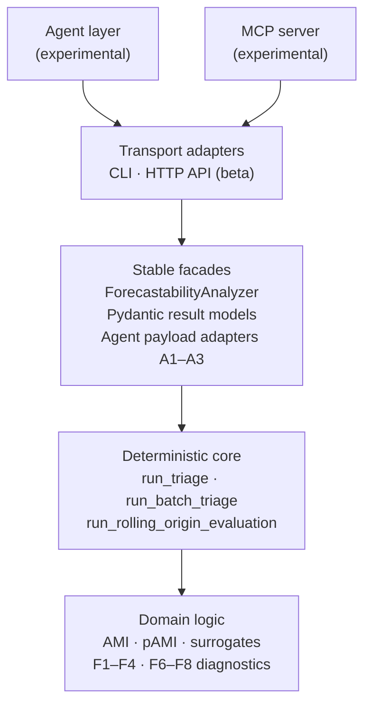

<!-- type: explanation -->
# Surface Guide

CLI, API, notebooks, MCP, and agents are optional access or narration layers around
the same deterministic outputs.

This page explains the four-layer surface model so you can decide which layers
you need — and which you can safely ignore until your deterministic analysis is
fully understood.

---

## The layered surface model



---

## Layer 1 — Deterministic core

**What it is.** The authoritative numeric computation path in
`src/forecastability/use_cases/`. The entry points are:

- `run_triage(series, config)` — single-series full diagnostic pass
- `run_batch_triage(panel, config)` — multi-series ranked diagnostic pass
- `run_rolling_origin_evaluation(series, model, config)` — leakage-safe evaluation
  against a forecast model

Every output — AMI curve, pAMI curve, complexity band, spectral score, triage
decision — originates here and is identical regardless of which surface you use to
access it.

**Why it is the authority.** Transport adapters (CLI, HTTP, MCP) and agent adapters
produce the same numbers because they call the same use-case functions. No surface
layer recomputes or reinterprets the science.

**Stability: stable.** Interfaces are compatibility-sensitive across minor and patch
releases. See [versioning.md](versioning.md).

> [!IMPORTANT]
> Always validate numeric outputs against this layer directly, not through the CLI
> or agent narration, when precision matters for a downstream decision.

---

## Layer 2 — Stable facades

The stable facades sit immediately above the domain and provide the public API
contract.

### `ForecastabilityAnalyzer`

A convenience class in `src/forecastability/analyzer.py` that wraps
`run_triage()` and exposes a single `.analyze(series)` method returning a
`TriageResult`. Prefer this for one-off use in notebooks and scripts.

### Pydantic result models

All outputs are Pydantic models. The primary result hierarchy is:

| Model | Contents |
|---|---|
| `TriageResult` | Full single-series result including F1–F4, F6 diagnostics and triage decision |
| `BatchTriageResult` | Panel of `TriageResult` objects with ranked summary |
| `ForecastabilityProfile` | Horizon-wise AMI/pAMI curve, informative horizon set, structural flags |
| `ComplexityBandResult` | Permutation entropy, spectral entropy, complexity tier |
| `SpectralPredictabilityResult` | Ω score and spectral metadata |

Pydantic models are serialisable to JSON and can be passed between pipeline stages
without schema loss.

### Agent payload adapters (A1–A3)

Three frozen adapter models bridge the deterministic result to agent-consumable
payloads:

- **A1** — `TriagePayload`: flattened triage result suitable for language-model
  context injection
- **A2** — `BatchTriagePayload`: ranked panel summary for multi-series agent tasks
- **A3** — `ExogenousPayload`: exogenous screening result for driver-selection agent
  tasks

**Stability: stable.** The adapter schemas are frozen and compatibility-sensitive.

---

## Layer 3 — Transport adapters

Transport adapters translate between the deterministic core and external callers.
Both are **beta** — usable for real work, but interface details (command flags,
SSE payload keys) may still evolve.

### CLI (beta)

```bash
forecastability triage --config configs/canonical_examples.yaml
forecastability list-scorers
```

The CLI reads YAML config, calls `run_triage()` or `run_batch_triage()`, and writes
structured output to stdout or a nominated path. No numeric logic lives in the CLI
itself.

### HTTP API (beta)

FastAPI + Server-Sent Events. Start with:

```bash
uv run uvicorn forecastability.api:app --reload
```

Endpoints accept JSON config payloads and stream `TriageResult` JSON over SSE.
Payload format follows the same Pydantic schemas as the Python API.

> [!NOTE]
> Stability label **beta** means the transport options and payload keys may still
> change before the first stable release. Pin to a specific version if you have an
> integration that depends on exact key names.

---

## Layer 4 — Optional experimental surfaces

These surfaces are experimental. They have no stability guarantee and may change
substantially between releases.

### MCP server (experimental)

A Model Context Protocol server that exposes triage tools for LLM integration. The
MCP layer calls the same deterministic core; it does not add or change any
computation. Tool names and request/response payloads are subject to change during
integration hardening.

### Agent layer (experimental)

PydanticAI adapters that provide structured narration, interpretation, and
decision-summary functionality on top of the deterministic payload adapters (A1–A3).
The agent layer does not recompute the science — it reads the frozen adapter
payloads and generates natural-language summaries.

> [!WARNING]
> Agents and MCP do not compute or validate the science. They narrate and route
> deterministic results. Never rely on agent-generated text as the source of numeric
> truth — always trace back to the `TriageResult` from `run_triage()`.

---

## What most users can safely ignore

If you are a first-time user, a researcher, or integrating this library into a
forecasting pipeline, you do not need the MCP server or the agent layer.

A useful mental model of priority:

1. **Understand the deterministic core first.** Run `run_triage()` directly, read
   the `TriageResult`, understand which horizons are informative and why.
2. **Use the stable facades** (`ForecastabilityAnalyzer`, Pydantic models) for clean
   integration in notebooks and scripts.
3. **Add the CLI or HTTP API** when you need a transport boundary (e.g., calling
   from a non-Python system or serving results over a network).
4. **Consider MCP and agents** only once your deterministic analysis is fully
   understood and you have a specific need for LLM-driven narration or task
   automation.

See [diagnostics_matrix.md](diagnostics_matrix.md) for a full index of what each
F1–F8 diagnostic measures and when to use it.
