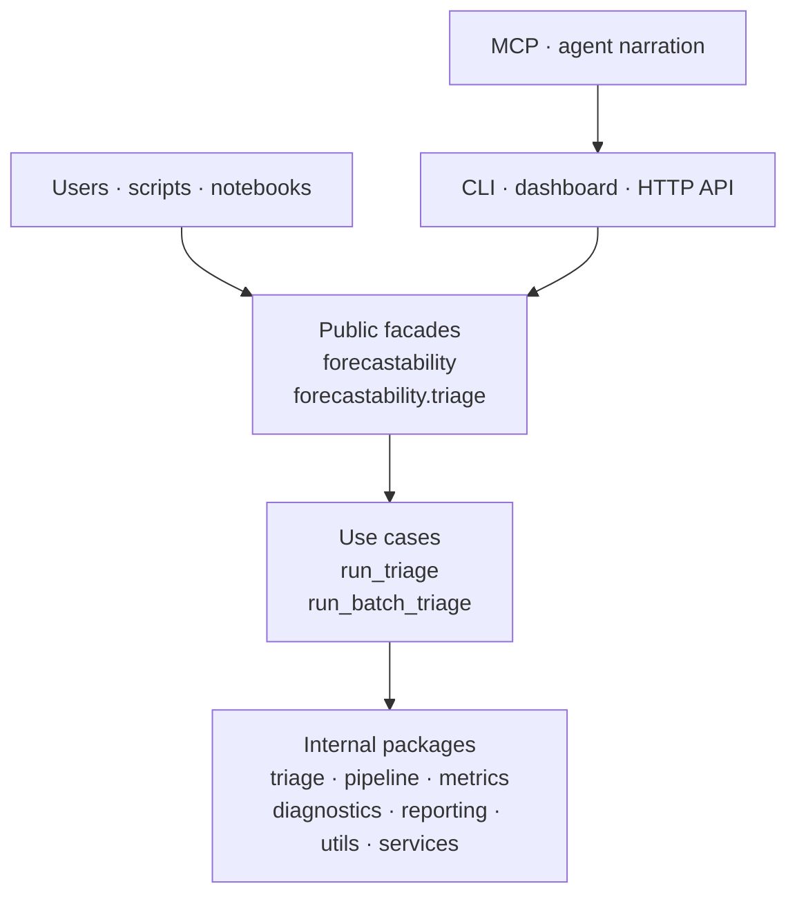

<!-- type: explanation -->
# Surface Guide

CLI, API, notebooks, MCP, and agents are optional access or narration layers around the same deterministic outputs.

_Last verified for release 0.2.0 consolidation on 2026-04-14._

This page explains the maintained user-facing surfaces in the live repository and which ones most users should rely on first.

## Surface Model

## 1. Stable Package Surface

The supported import surface is the package facade, not the internal tree.

| Surface | What to use | Stability |
| --- | --- | --- |
| Python package facade | `forecastability` | Stable |
| Advanced triage namespace | `forecastability.triage` | Stable |

Use these facades when you need deterministic triage, analyzers, typed results, config models, scorer registry access, or batch triage types. See [public_api.md](public_api.md) for the exact export set.

## 2. Maintained Repository Workflows

These are the repo-following workflows that contributors and maintainers should treat as canonical.

| Workflow | Entry point | What it does |
| --- | --- | --- |
| Canonical single-series workflow | `scripts/run_canonical_triage.py` | Builds canonical outputs for exemplar series |
| Benchmark panel workflow | `scripts/run_benchmark_panel.py` | Runs the benchmark panel and writes summary artifacts |
| Report-building workflow | `scripts/build_report_artifacts.py` | Builds report-facing artifacts from generated outputs |
| Exogenous workflow | `scripts/run_exog_analysis.py` | Runs exogenous screening and related artifacts |
| Notebook learning path | `docs/notebooks/README.md`, `notebooks/walkthroughs/00_air_passengers_showcase.ipynb`, and `notebooks/walkthroughs/01_covariant_informative_showcase.ipynb` | First-stop walkthrough plus the covariant benchmark walkthrough before deeper notebooks |

> [!NOTE]
> Checked-in files under `outputs/json/`, `outputs/tables/`, and `outputs/reports/` are reference artifacts. They are useful examples of the artifact surface, but they are not guaranteed to be freshly regenerated for every commit.

## 3. Beta Transport Surfaces

These surfaces are maintained and usable, but they remain transport layers over the same deterministic core.

| Surface | Entry point | Stability |
| --- | --- | --- |
| CLI | `forecastability` | Beta |
| Dashboard | `forecastability-dashboard` | Beta |
| HTTP API | `forecastability.adapters.api:app` | Beta |

Key points:

- The CLI supports `triage`, `triage-batch`, and `list-scorers`.
- The dashboard is a thin browser UI over the deterministic adapters.
- The HTTP API exposes `GET /health`, `GET /scorers`, `POST /triage`, and `GET /triage/stream`.

## 4. Experimental Automation Surfaces

These surfaces are intentionally outside the main trust path.

| Surface | Role | Stability |
| --- | --- | --- |
| MCP server | Tool exposure for assistant workflows | Experimental |
| Agent and narration adapters | Structured payload and narration helpers | Experimental |

> [!WARNING]
> Agents and MCP do not compute or validate the science. They route or narrate deterministic outputs. When numeric correctness matters, trace back to `TriageResult` and the stable package facade.

## 5. What Most Users Should Ignore At First

Most users only need three things in order:

1. The package facade in [public_api.md](public_api.md).
2. The notebook path in [notebooks/README.md](notebooks/README.md).
3. The maintainer scripts documented in [maintenance/developer_guide.md](maintenance/developer_guide.md) when they need repo workflows.

The internal packages, the MCP surface, and the agent layer are useful only after the deterministic workflow is already understood.
