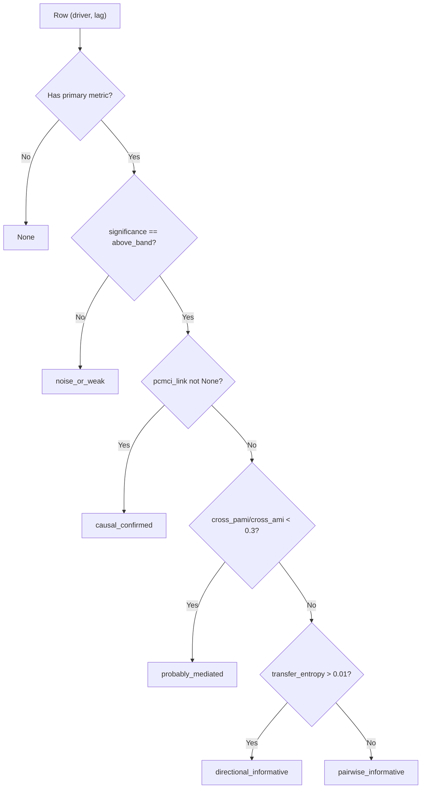

<!-- type: reference -->
# Covariant Summary Table — V3-F07 Reference

The covariant summary table is the unified, per-`(target, driver, lag)` output of
`run_covariant_analysis()`.  It merges six dependency-measurement methods into a
single flat list of `CovariantSummaryRow` objects, annotated with significance,
global rank, and an interpretation tag.

## Overview

`run_covariant_analysis()` returns a `CovariantAnalysisBundle`.  The
`bundle.summary_table` attribute is a `list[CovariantSummaryRow]` — one row per
combination of driver variable and lag horizon.

```python
from forecastability.use_cases.run_covariant_analysis import run_covariant_analysis

bundle = run_covariant_analysis(
    target,
    drivers,
    methods=["cross_ami", "cross_pami", "te", "gcmi"],
    max_lag=20,
    n_surrogates=99,
)
# Access the unified table
for row in bundle.summary_table:
    print(row.driver, row.lag, row.significance, row.rank, row.interpretation_tag)
```

The table is sorted by global rank (rank 1 = strongest signal) after construction.
All rows are frozen Pydantic models; do not mutate them in-place.

---

## Field reference

| Field | Type | Description |
|---|---|---|
| `target` | `str` | Name of the target time series passed via `target_name`. |
| `driver` | `str` | Key from the `drivers` dict for this row's driver series. |
| `lag` | `int` | Lag horizon $h \in [1, \text{max\_lag}]$ (1-indexed). |
| `cross_ami` | `float \| None` | $I(X_t^{\text{driver}}; X_{t+h}^{\text{target}})$ — unconditioned cross-MI at lag $h$. `None` when `"cross_ami"` is not requested. |
| `cross_pami` | `float \| None` | $\tilde{I}_h$ — cross-pAMI (conditions on target's own past). `None` when `"cross_pami"` is not requested. |
| `transfer_entropy` | `float \| None` | Transfer entropy from driver to target at lag $h$ (nats). `None` when `"te"` is not requested. |
| `gcmi` | `float \| None` | Gaussian-copula MI at lag $h$ (bits). `None` when `"gcmi"` is not requested. |
| `pcmci_link` | `str \| None` | PCMCI+ link string (e.g. `"-->"`, `"o->"`) for the `(driver→target, lag)` pair. `None` when PCMCI+ is not requested or the link is absent. |
| `pcmci_ami_parent` | `bool \| None` | `True` when PCMCI-AMI-Hybrid selected this driver as a causal parent at lag $h$. `None` when `"pcmci_ami"` is not requested. |
| `significance` | `str \| None` | `"above_band"` or `"below_band"` based on phase-surrogate bands for `cross_ami`. `None` when `cross_ami` is not requested. |
| `rank` | `int \| None` | Global rank across all `(driver, lag)` pairs, 1-indexed (1 = strongest). `None` before ranking step. |
| `interpretation_tag` | `str \| None` | One of five evidence tags assigned by multi-method logic (see below). `None` when no primary metric is available. |
| `lagged_exog_conditioning` | `CovariantMethodConditioning` | Per-method conditioning scope metadata. |

---

## Significance computation

Significance is evaluated via a **phase-surrogate null distribution** for `cross_ami`.

**Null hypothesis:** $I(X_t^{\text{driver}}; X_{t+h}^{\text{target}}) = 0$ — the driver
contains no temporal information about the target at lag $h$.

**Procedure:**

1. Fix the driver series. Phase-randomise the **target** using FFT amplitude-preserving
   surrogates, producing $S \geq 99$ shuffled targets that preserve spectral structure
   but break lagged cross-dependence.
2. Compute cross-AMI for each surrogate against the real driver: $\{I^{(s)}_h\}_{s=1}^{S}$.
3. Build 2.5th/97.5th percentile bands (two-sided $\alpha = 5\%$) over the surrogate
   distribution at each lag.

**Tags:**

| Value | Condition |
|---|---|
| `"above_band"` | `cross_ami[h] > 97.5th percentile of surrogates at lag h` |
| `"below_band"` | `cross_ami[h] ≤ 97.5th percentile of surrogates at lag h` |

Phase-randomisation is implemented in `_compute_cross_ami_bands()` via
`compute_significance_bands_generic()` from
`forecastability.services.significance_service`.

> [!NOTE]
> Significance is only populated when `"cross_ami"` is in the requested methods.
> TE and GCMI significance bands are not computed in V3-F07.

---

## Rank assignment

`_assign_ranks()` assigns a **global integer rank** across all `(driver, lag)` pairs
for a given analysis run.

**Primary score priority** (first non-`None` value is used):

$$\text{score}(r) = \begin{cases}
r.\text{cross\_ami} & \text{if present} \\
r.\text{gcmi} & \text{else if present} \\
r.\text{transfer\_entropy} & \text{else if present} \\
0 & \text{otherwise}
\end{cases}$$

Rows are sorted **descending** by primary score.  Ties within the same score are broken
lexicographically by `driver` name, then by ascending `lag`.  Rank 1 is the strongest
signal.

---

## Interpretation tags

`_interpretation_tag()` assigns one label per row using a **priority waterfall** — the
first matching condition wins.

| Tag | Condition |
|---|---|
| `"causal_confirmed"` | PCMCI+ confirms a `-->` link for `(driver, lag)` **AND** `significance == "above_band"` |
| `"probably_mediated"` | `significance == "above_band"` AND `cross_pami / cross_ami < 0.3` (pAMI collapses) |
| `"directional_informative"` | `significance == "above_band"` AND `transfer_entropy > 0.01` nats |
| `"pairwise_informative"` | `significance == "above_band"` only |
| `"noise_or_weak"` | No significant dependence found |

The tag is `None` when none of `cross_ami`, `transfer_entropy`, or `gcmi` is available.

> [!IMPORTANT]
> `causal_confirmed` requires PCMCI+ (`"pcmci"` or `"pcmci_ami"` in the requested
> methods list).  When running without PCMCI+, `pcmci_link` is always `None` and this
> tag will never be assigned.

### Waterfall diagram



---

## Conditioning scope

Each method conditions on a different information set.  The `lagged_exog_conditioning`
field on a row encodes this per-method:

| Method | Scope tag | Meaning |
|---|---|---|
| `cross_ami`, `gcmi` | `"none"` | Unconditioned pairwise signal — no history removed |
| `cross_pami`, `te` | `"target_only"` | Conditions on target's own lagged values; removes target autocorrelation |
| `pcmci`, `pcmci_ami` | `"full_mci"` | Full MCI conditioning on both target and driver histories; strongest causal filter |

Mixing rows with different conditioning scopes when computing AUC or ranking is
intentional: the table is designed for **screening** across evidence types, not for
direct numerical comparison between methods.

---

## Limitations

> [!WARNING]
> - **Partial significance**: Surrogate bands are only derived for `cross_ami`.  TE and
>   GCMI are included as raw scores without a null distribution in V3-F07.
> - **Rank ≠ causal rank**: A mediated or redundant driver may achieve a higher
>   `cross_ami` than a direct driver.  Always check `interpretation_tag` alongside rank.
> - **`causal_confirmed` requires tigramite**: PCMCI+ and PCMCI-AMI-Hybrid depend on
>   the optional `tigramite` package.  If it is not installed, both methods are silently
>   skipped and `skipped_optional_methods` in `bundle.metadata` is populated.
> - **Fixed target phase-randomisation**: Surrogates randomise the target, not the
>   driver.  This tests whether the driver adds information about the target, but does
>   not control for driver autocorrelation artefacts.

---

## Cross-references

- [`forecastability.use_cases.run_covariant_analysis`](../../src/forecastability/use_cases/run_covariant_analysis.py) — source implementation
- [`forecastability.utils.types.CovariantSummaryRow`](../../src/forecastability/utils/types.py) — Pydantic model definition
- [docs/theory/gcmi.md](gcmi.md) — GCMI method background
- [docs/theory/pcmci_plus.md](pcmci_plus.md) — PCMCI+ method background
- [docs/theory/pami_residual_backends.md](pami_residual_backends.md) — pAMI residualisation
