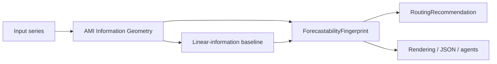

<!-- type: explanation -->
# Forecastability Fingerprint

`ForecastabilityFingerprint` is the compact public summary layer used by the
v0.3.1 fingerprint workflow. It sits *above* the AMI Information Geometry
engine and *below* routing, reporting, and agent adapters.

> [!IMPORTANT]
> The fingerprint is not a replacement for the AMI curve. It is a deterministic
> summary of geometry-backed horizon-wise AMI behavior.

## Position in the Stack



The authoritative implementation lives in:

- `forecastability.services.ami_information_geometry_service`
- `forecastability.services.fingerprint_service`
- `forecastability.services.routing_policy_service`

## Public Fields

The fingerprint keeps the original four public fields and now mirrors
`signal_to_noise` from the geometry layer.

### `information_mass`

`information_mass` is computed on the **corrected** AMI profile and only over
the geometry-accepted horizons:

$$
M = \frac{1}{\max(1, H_{valid})} \sum_{h=1}^{H} I_c(h)\,\mathbf{1}[I_c(h) > 3\tau(h)]
$$

Interpretation:

- low mass: little usable predictive information survives correction/thresholding
- high mass: stronger and/or broader usable signal across the evaluated horizon grid

### `information_horizon`

`information_horizon` is the latest accepted horizon:

$$
H_{info} = \max \{ h : I_c(h) > 3\tau(h) \}
$$

with `0` when no horizons satisfy the geometry rule.

### `information_structure`

The public structure taxonomy remains:

- `none`
- `monotonic`
- `periodic`
- `mixed`

The label is sourced from the corrected profile, not from raw AMI. The
deterministic precedence is:

`none` > `periodic` > `monotonic` > `mixed`

### `nonlinear_share`

`nonlinear_share` measures how much accepted corrected AMI exceeds a linear
Gaussian-information baseline:

$$
I_G(h) = -\frac{1}{2}\log(1-\rho(h)^2)
$$

$$
E(h) = \max(I_c(h) - I_G(h), 0)
$$

$$
N = \frac{\sum_{h \in \mathcal{H}_{geom}} E(h)}
         {\sum_{h \in \mathcal{H}_{geom}} I_c(h) + \epsilon}
$$

Horizons with invalid `I_G(h)` are excluded conservatively from both numerator
and denominator.

### `signal_to_noise`

`signal_to_noise` is mirrored into the fingerprint object, but it remains a
geometry-quality metric:

$$
S = \frac{\sum_h \max(I_c(h)-\tau(h), 0)}{\sum_h I_c(h) + \epsilon}
$$

Interpretation:

- low value: corrected AMI exists, but little clears the surrogate threshold margin
- high value: corrected AMI rises clearly above the surrogate background

## What the Fingerprint Does Not Mean

The fingerprint does **not** identify the one true best model.

- `information_mass` is not `signal_to_noise`
- `signal_to_noise` is not `nonlinear_share`
- `nonlinear_share` is not `1 - directness_ratio`
- routing is heuristic model-family guidance, not an empirical winner guarantee

## Geometry Coupling

The v0.3.1 fingerprint no longer rebuilds threshold semantics locally.

- accepted horizons come from `AmiInformationGeometry.curve[*].accepted`
- `information_horizon` and `information_mass` use the same acceptance mask
- structure comes from the geometry classifier
- `signal_to_noise` is copied from geometry without reinterpretation

That keeps the deterministic core aligned across Python objects, markdown
reports, JSON output, and agent payloads.

## Batch Operationalization

The batch forecastability workbench introduced on top of the fingerprint stack
does not add new mathematics. It operationalizes the same deterministic
geometry, fingerprint, and routing outputs in a portfolio workflow.

- batch triage still ranks readiness and signal quality separately
- per-series next-step plans are derived from the same routed families and caution flags
- executive reports are communication surfaces only and must stay downstream of the deterministic bundle

## Canonical showcase surface

The v0.3.1 showcase script and notebook operationalize the same mathematics on
the prepared archetype panel from `forecastability.utils.synthetic`.

- Script: `scripts/run_showcase_fingerprint.py`
- Notebook: `notebooks/walkthroughs/02_forecastability_fingerprint_showcase.ipynb`
- Reporting helpers: `forecastability.reporting.fingerprint_showcase`

Those surfaces are designed to make the math legible without moving any
scientific logic into notebook code, markdown glue, or the optional agent
layer. The final plain-language explanation is downstream of the deterministic
bundle and must remain verifiable against it.

> [!IMPORTANT]
> The v0.3.1 fingerprint release is intentionally univariate-first and
> AMI-first. It does not claim multivariate or conditional-MI routing semantics,
> and it does not identify one true optimal model.

## Curated Routing-Quality Sanity Panel (v0.3.1)

This lightweight panel is the v0.3.1 closure check for routing quality. It is a
sanity check of broad family direction, not a benchmark calibration study.

| Case ID | Curated panel series | Expected broad family tags | Mismatch note semantics |
|---|---|---|---|
| RQP-01 | `white_noise` archetype | `naive`, `baseline` | Record only if a structured family is ranked above baseline; mark as over-ambitious routing. |
| RQP-02 | `ar1_monotonic` archetype | `ar`, `compact-linear` | Record if primary route excludes compact linear families; mark as under-sensitive to monotonic decay. |
| RQP-03 | `seasonal_periodic` archetype | `seasonal_naive`, `seasonal_linear` | Record if periodic routes are absent; mark as seasonal-structure miss. |
| RQP-04 | `nonlinear_mixed` archetype | `nonlinear`, `tree-or-kernel` | Record if nonlinear families are absent from primary or secondary routes; mark as nonlinear under-routing. |
| RQP-05 | `mediated_directness_drop` archetype | `compact`, `regularized` | Record if routes over-prioritize high-capacity nonlinear families without caution flags; mark as mediation misread. |

Panel rules:

- Keep expectations at broad family level only; do not require one exact model.
- Capture mismatches explicitly in docs or release notes as `expected_tag`,
    `observed_primary`, `observed_secondary`, and `mismatch_note`.
- Do not smooth away disagreement: a mismatch is a release-note input, not a
    post-hoc relabel.
- Treat this as a v0.3.1 guardrail. Calibration depth and empirical hardening
    remain deferred to v0.3.4.

## Regression Guardrails (v0.3.1 Phase 3)

The fingerprint stack now ships with frozen regression fixtures so policy and
estimation drift are intentional and reviewable.

- Frozen expected artifacts: `docs/fixtures/fingerprint_regression/expected/*.json`
- Rebuild script: `scripts/rebuild_fingerprint_regression_fixtures.py`
- Verification tests: `tests/test_fingerprint_regression.py`

Rebuild + verify command:

```bash
uv run python scripts/rebuild_fingerprint_regression_fixtures.py --verify
```

Each fixture captures the deterministic surfaces required by v0.3.1 release
semantics:

- geometry: corrected AMI curve (`ami_corrected`), `tau`, accepted mask,
  `signal_to_noise`, `information_horizon`, `information_structure`
- fingerprint: `information_mass`, `information_horizon`,
  `information_structure`, `nonlinear_share`, mirrored `signal_to_noise`
- routing: primary and secondary families, confidence label, caution flags
