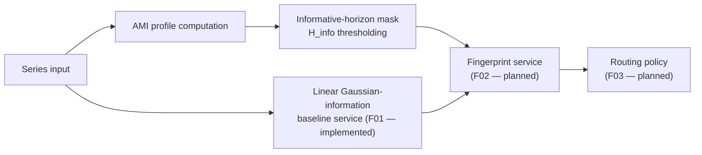

<!-- type: explanation -->
# Forecastability Fingerprint: Theory and Mathematical Foundations

This document explains the conceptual and mathematical foundations of the
**Forecastability Fingerprint** — a compact, decision-ready summary of the
forecastability profile that drives model-family routing. It covers all of
Phase 1 theory and marks which sections are **implemented** versus **planned**.

**Full implementation plan:** [v0.3.1 plan](../plan/v0_3_1_forecastability_fingerprint_model_routing_plan.md)

---

## Overview

The forecastability profile already captures horizon-wise AMI behaviour:

$$AMI(h) = I(X_t;\, X_{t+h})$$

The fingerprint is a **summary layer over that profile** — not an additional
metric family. It answers the question:

> Given this AMI profile, what compact fingerprint best describes it,
> and what model classes should that fingerprint recommend?

The fingerprint is built from four fields and one existing ratio:

| Field | Status | Meaning |
|---|---|---|
| `information_mass` $M$ | Planned (F02) | Normalized masked area under the informative AMI profile |
| `information_horizon` $H_{info}$ | Planned (F02) | Latest lag at which AMI remains statistically informative |
| `information_structure` | Planned (F02) | Shape label: `none`, `monotonic`, `periodic`, or `mixed` |
| `nonlinear_share` $N$ | Planned (F02) | Fraction of informative AMI exceeding the linear Gaussian baseline |
| `directness_ratio` | Already implemented | Direct vs mediated lag structure (separate from nonlinear share) |

> [!IMPORTANT]
> The fingerprint is heuristic product guidance for model-family routing.
> It is not empirical model selection, not a ranking guarantee, and not a
> promise that a recommended family will outperform all alternatives on a
> given series.

The diagram below shows where each component sits in the fingerprint pipeline.



---

## The Linear Gaussian-information Baseline (F01 — Implemented)

### Motivation

AMI measures all statistical dependence between $X_t$ and $X_{t+h}$, including
nonlinear structure. Before asserting that a series has *nonlinear* forecastability,
we need a reference point for how much information a purely linear, Gaussian model
would have recovered at the same lag. That reference is the **Gaussian-information
proxy** $I_G(h)$.

Concretely: if a series has high AMI but its autocorrelation at the same lag
already explains most of that AMI, then the excess nonlinearity is small. If
AMI far exceeds $I_G(h)$, significant nonlinear structure is present.

### Definition

For a Gaussian process with Pearson autocorrelation $\rho(h)$ at lag $h$, the
mutual information between $X_t$ and $X_{t+h}$ is exactly:

$$I_G(h) = -\frac{1}{2}\log\bigl(1 - \rho(h)^2\bigr)$$

This is the **closed-form MI for the bivariate Gaussian case**. Because Pearson
autocorrelation fully characterises a Gaussian linear dependence, $I_G(h)$ is
precisely the amount of information a linear model captures.

> [!NOTE]
> $I_G(h)$ is measured in nats (natural logarithm). It equals zero when
> $\rho(h) = 0$ and grows without bound as $|\rho(h)| \to 1$.

### Safe clipping near $|\rho| = 1$

When $|\rho(h)|$ is very close to 1, the argument of the logarithm approaches
zero and floating-point precision becomes unreliable. The implementation clips:

$$\rho_{\text{safe}} = \min\bigl(|\rho(h)|,\; 1 - \varepsilon\bigr), \quad \varepsilon = 10^{-12}$$

and computes $I_G(h) = -\tfrac{1}{2}\log(1 - \rho_{\text{safe}}^2)$. This keeps
all values finite and numerically stable while introducing no practically
detectable bias at real-world correlation levels.

### Why Pearson autocorrelation?

Pearson autocorrelation is the natural choice because:

1. It exactly captures linear pairwise dependence — nothing more, nothing less.
2. For a Gaussian series, it is the sufficient statistic for MI.
3. It is computationally cheap and well-understood, making the baseline
   interpretable and reproducible.

Using a kernel-based or rank-based measure for the baseline would conflate
linear and nonlinear structure, defeating the purpose of the comparison.

### Validity flags and cautions

Horizons where autocorrelation is undefined are marked `valid=False` with a
`caution` string rather than imputed. This conservative approach avoids
falsely inflating $I_G(h)$ for long-horizon or short-series situations.

Caution values:

| `caution` | Meaning |
|---|---|
| `undefined_autocorrelation` | Insufficient data pairs or zero variance |
| `non_finite_autocorrelation` | Non-finite correlation value encountered |

### Limitations

$I_G(h)$ is a linear-only baseline. It does not capture:

- nonlinear dependence (e.g., ARCH effects, threshold dynamics)
- conditional dependence structure beyond the bivariate marginal
- lagged multivariate interactions

It should be read alongside AMI, not as a replacement. Its purpose is precisely
to measure how much AMI *exceeds* what a linear model would predict.

---

## The Informative Horizon Set $\mathcal{H}_{info}$ (Planned — F02)

> [!NOTE]
> This section defines the concept used by F02 (Fingerprint service).
> The mask computation is not yet implemented as a service;
> $I_G(h)$ from F01 feeds into it once F02 is built.

All four fingerprint fields share a single informative-horizon mask. Define:

$$\mathcal{H}_{info} = \bigl\{h \in \{1, \ldots, H\} : AMI(h) \ge \tau_{AMI} \;\land\; p_{\text{sur}}(h) \le \alpha \bigr\}$$

where:

- $p_{\text{sur}}(h)$ is the per-horizon surrogate-significance p-value from the
  package's existing AMI significance machinery
- $\alpha$ is the configured significance level used by the profile computation
- $\tau_{AMI}$ is a minimum AMI floor applied after significance to reject
  numerically tiny but formally significant values

Key semantics:

- Horizons lacking a valid AMI estimate or surrogate test result are **excluded**
  from $\mathcal{H}_{info}$ rather than imputed as informative.
- Inclusion is **inclusive at the boundary**: $AMI(h) = \tau_{AMI}$ and
  $p_{\text{sur}}(h) = \alpha$ both count as informative.
- $\mathcal{H}_{info}$ is an operational screening mask, not a claim of
  simultaneous family-wise significance across all tested horizons.
- If $\mathcal{H}_{info} = \varnothing$, then `information_mass = 0.0`,
  `information_horizon = 0`, and `nonlinear_share = 0.0`.

---

## `nonlinear_share` $N$ (Planned — F02)

> [!NOTE]
> This section provides the full mathematical specification.
> Implementation depends on F02 (Fingerprint service) which builds on
> the F01 linear baseline implemented in this release.

For each informative horizon, the nonlinear excess is:

$$E(h) = \max\!\bigl(AMI(h) - I_G(h),\; 0\bigr)$$

Aggregated over the informative horizon set:

$$N = \frac{\displaystyle\sum_{h \in \mathcal{H}_{info}} E(h)}{\displaystyle\sum_{h \in \mathcal{H}_{info}} AMI(h) + \varepsilon}$$

Edge behaviour:

- If $\mathcal{H}_{info} = \varnothing$: return $N = 0.0$
- If the informative-horizon AMI denominator $\le \varepsilon$: return $N = 0.0$
  rather than a noisy tiny ratio
- If $\rho(h)$ is invalid for some $h \in \mathcal{H}_{info}$: exclude that
  horizon from both numerator and denominator and emit a caution

Interpretation:

- $N \approx 0$: dependence is mostly linear; ARIMA/ETS-family models are likely
  to capture the available information
- $N \approx 1$: substantial dependence beyond linear autocorrelation; nonlinear
  or tree-based models may provide meaningful gains

> [!WARNING]
> `nonlinear_share` $N$ is **NOT** `1 - directness_ratio`.
>
> `directness_ratio` measures **direct vs mediated lag structure** — whether
> the AMI at a given horizon is driven by the direct $X_t \to X_{t+h}$ link or
> by chains of shorter-lag dependencies.
>
> `nonlinear_share` measures **nonlinear excess over a linear baseline** — whether
> the total information at informative horizons exceeds what Gaussian autocorrelation
> alone would predict.
>
> These are orthogonal quantities. A series can have high directness and high
> nonlinear share (direct ARCH process), low directness and low nonlinear share
> (ARMA with many lags), or any other combination.

---

## Model-Family Routing (Planned — F03)

> [!IMPORTANT]
> Routing in `0.3.1` is heuristic product guidance. It is not empirical model
> selection, not a ranking guarantee, and not a promise that a recommended family
> will outperform all alternatives on a given series.

The routing service (F03) maps fingerprint patterns to model families using a
**versioned, deterministic rule table**. Initial mapping policy (from the plan):

| Fingerprint pattern | Recommended families |
|---|---|
| low mass, `none` | naïve, seasonal naïve, stop / downscope effort |
| high mass, monotonic, low $N$, high directness | ARIMA / ETS / linear state-space |
| high mass, periodic | seasonal naïve / harmonic regression / TBATS |
| mixed structure or high $N$ | tree-on-lags / TCN / N-BEATS / NHITS |
| high mass, low directness | increase lookback, inspect mediated structure |

Routing rules are explicit and versioned. They are a product policy, not implicit
interpretation hidden in notebooks or narrative text.

---

## API Reference: Linear Baseline (F01 — Implemented)

### `compute_linear_information_curve`

**Module:** `forecastability.services.linear_information_service`

Computes the Gaussian-information baseline $I_G(h)$ over a provided list of
horizons. Returns a `LinearInformationCurve` containing one
`LinearInformationPoint` per horizon.

```python
import numpy as np
from forecastability.services.linear_information_service import compute_linear_information_curve

# Compare linear baseline for AR(1) vs white noise
rng = np.random.default_rng(42)
white_noise = rng.normal(0, 1, 500)

ar1 = np.zeros(500)
for i in range(1, 500):
    ar1[i] = 0.85 * ar1[i - 1] + rng.normal()

horizons = list(range(1, 13))
wn_curve = compute_linear_information_curve(white_noise, horizons=horizons)
ar1_curve = compute_linear_information_curve(ar1, horizons=horizons)

# Valid I_G values for the AR(1) series
for pt in ar1_curve.points[:3]:
    print(f"h={pt.horizon}: I_G={pt.gaussian_information:.4f}")
```

### Return types

**`LinearInformationPoint`** (frozen Pydantic model)

| Field | Type | Meaning |
|---|---|---|
| `horizon` | `int` | Lag index |
| `rho` | `float \| None` | Pearson autocorrelation at this lag |
| `gaussian_information` | `float \| None` | $I_G(h)$ in nats |
| `valid` | `bool` | `False` when autocorrelation could not be computed |
| `caution` | `str \| None` | Reason string for known limitations |

**`LinearInformationCurve`** (frozen Pydantic model)

| Field | Type | Meaning |
|---|---|---|
| `points` | `list[LinearInformationPoint]` | Horizon-ordered baseline values |

Helper method `valid_gaussian_values()` returns `list[tuple[int, float]]` with
only valid `(horizon, gaussian_information)` pairs.

---

## Expected Behaviour by Archetype

The table below summarises expected $I_G(h=1)$ values for the four canonical
synthetic archetypes used in the test suite.

| Archetype | Expected $I_G$ at $h=1$ | Interpretation |
|---|---|---|
| White noise | near 0 | No linear autocorrelation; baseline is essentially flat |
| AR(1) $\varphi = 0.85$ | > 0.5 nats | Strong linear autocorrelation captured by baseline |
| Seasonal (period 12) | varies by lag | Low at non-seasonal lags; peak near multiples of 12 |
| Nonlinear mixed | low-to-moderate | Linear baseline misses nonlinear excess; $N$ will be elevated |

> [!NOTE]
> For white noise and other near-zero-autocorrelation series, $I_G(h)$ may be
> very close to zero at all horizons. This is the intended behaviour: if the
> linear baseline captures nothing, then any AMI signal is nonlinear excess.

---

## Summary: Implementation Status

| Component | Plan ID | Status |
|---|---|---|
| Linear Gaussian-information baseline | V3_1-F01 | **Implemented** |
| Informative-horizon mask / fingerprint service | V3_1-F02 | Planned |
| Routing policy service | V3_1-F03 | Planned |
| Facade: `run_forecastability_fingerprint()` | V3_1-F04 | Planned |
| Showcase script and walkthrough notebook | V3_1-F05–F08 | Planned |

See the [v0.3.1 plan](../plan/v0_3_1_forecastability_fingerprint_model_routing_plan.md)
for the full implementation schedule and acceptance criteria.
