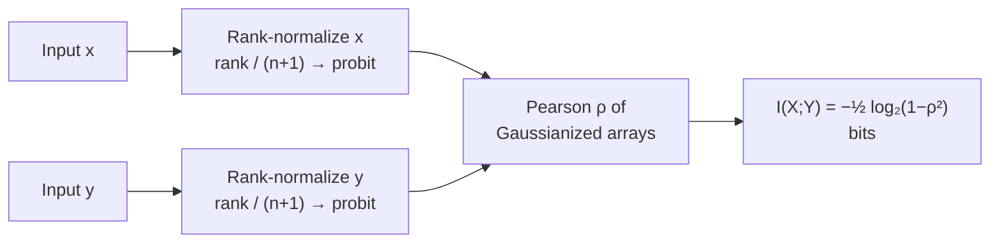
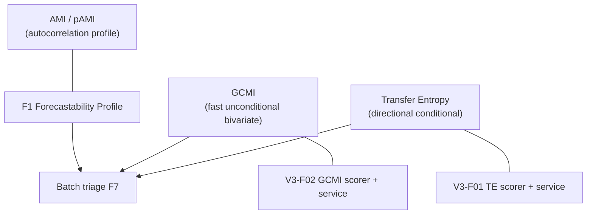

<!-- type: explanation -->
# Gaussian Copula Mutual Information (GCMI)

## What GCMI is and why it exists

Gaussian Copula Mutual Information (GCMI) is a deterministic, monotonic-transform invariant
estimator of mutual information introduced by Ince et al. (2017) for neuroimaging data
analysis. The central insight: if both marginals are Gaussianized via a rank-copula transform,
MI reduces to a closed-form expression involving only the Pearson correlation of the Gaussianized
values.

This makes GCMI:

- **Faster** than kNN MI — $O(n \log n)$ sort dominates; no nearest-neighbour search
- **Fully deterministic** — no random state, no seed management
- **Monotonic-transform invariant** — any monotone bijection applied to $x$ or $y$
  does not change their ranks, so it does not change the GCMI estimate

In this repository, GCMI serves as a fast, unconditional dependence screening metric —
a complement to Transfer Entropy (TE), which conditions on target history.

> [!NOTE]
> This implementation provides the **bivariate** GCMI form only: one source variable
> versus one target variable at a given lag. For the full copula MI framework covering
> multivariate and higher-order terms, see Ince et al. (2017).

## The three-step algorithm

### Step 1 — Rank-normalize each marginal

Map every observation to a uniform probability using its rank, then apply the probit
(inverse normal CDF):

$$u_i = \frac{\text{rank}(x_i)}{n+1}, \qquad z_i = \Phi^{-1}(u_i)$$

The denominator $n+1$ (not $n$) ensures $u_i \in (0, 1)$, keeping the probit finite at
both extremes. After this step, both marginals are approximately standard-normal regardless
of the original distribution.

### Step 2 — Pearson correlation of the Gaussianized arrays

$$\rho = \text{corr}(z^x,\, z^y)$$

Because the marginals are now Gaussianized, $\rho$ captures nonlinear monotone dependence in
the original variables. A strictly monotone transform of $x$ does not change its ranks, so it
does not change $\rho$.

### Step 3 — Bivariate Gaussian MI formula

$$I(X;\, Y) = -\frac{1}{2}\log_2(1 - \rho^2)$$

This is the exact mutual information of a bivariate Gaussian with Pearson correlation $\rho$.
It is always non-negative (since $|\rho| \le 1$), symmetric in $X$ and $Y$ at zero lag, and
exactly zero only when $\rho = 0$.

### Computation pipeline

> [!TIP]
> The `_RHO_CLIP = 1 − 10^{-9}` guard in the implementation prevents $\log(0)$ when
> two arrays are perfectly correlated in finite samples.

## Key properties

| Property | Detail |
|---|---|
| Monotonic-transform invariant | Yes — rank transform absorbs any monotone bijection |
| Random state | None — fully deterministic across all call sites |
| Symmetry | $I(X;Y) = I(Y;X)$ at zero lag |
| Conditioning on target history | No — unconditional bivariate dependence |
| Sample size floor | `min_pairs=30` default; error raised if too few pairs |
| Output units | bits |
| Minimum value | 0 (when $\rho = 0$) |
| Maximum value | Unbounded in theory; finite-sample values typically $< 3$ bits |

## When to use GCMI versus Transfer Entropy

Both GCMI and TE measure dependence between a source series at lag $h$ and a target
series at time $t$, but they answer different questions.

| Criterion | GCMI | Transfer Entropy |
|---|---|---|
| Speed | Fast — $O(n \log n)$ | Slower — kNN with conditioning vectors |
| Symmetry | Symmetric: $I(X;Y) = I(Y;X)$ at lag 0 | Asymmetric: $TE(X \to Y) \ne TE(Y \to X)$ |
| Conditioning on target history | No | Yes: conditions on $Y_{t-1}, \ldots, Y_{t-h+1}$ |
| Autocorrelation control | None | Built-in (conditioning absorbs target autocorrelation) |
| Relationship type | Monotone nonlinear | General nonlinear |
| Causal claim strength | Association only | Stronger (conditional on target) |
| Minimum pairs requirement | `min_pairs=30` | `min_pairs=50` (larger due to conditioning) |

In a synthetic lag-3 driver experiment ($n=1000$, noise $\sigma=0.5$), GCMI at the true lag
was 1.15 bits vs TE of 0.82 bits. GCMI is higher because it does not subtract out the target's
own autocorrelation.

**Use GCMI** for fast initial screening of many candidate lags or drivers, or when symmetric
association is the right framing (e.g. looking for shared dynamics regardless of direction).

**Use TE** when the research question requires a directional, autocorrelation-controlled
dependence measure, or when preparing results for a causal argument.

> [!IMPORTANT]
> A high GCMI value at lag $h$ is not evidence of causal direction. It is evidence of
> monotone association between the lagged source and the target. Use TE or PCMCI+ for
> causal screening.

## Relationship to the rest of the framework

GCMI is one of three pairwise dependence measures in the v0.3.0 covariant extension:

All three share the `DependenceScorer` protocol and the `"gcmi"` / `"te"` registry keys,
so they compose cleanly with the scorer registry, the analyzer, and the covariant screening
façade.

## Implementation entry points

| Symbol | Location |
|---|---|
| `compute_gcmi()` | `src/forecastability/diagnostics/gcmi.py` |
| `compute_gcmi_at_lag()` | `src/forecastability/diagnostics/gcmi.py` |
| `compute_gcmi_curve()` | `src/forecastability/diagnostics/gcmi.py` |
| `gcmi_scorer()` | `src/forecastability/metrics/scorers.py` |
| `GcmiResult` | `src/forecastability/utils/types.py` |
| Service façade | `src/forecastability/services/gcmi_service.py` |
| Tests | `tests/test_gcmi.py` (25 tests) |
| Example | `examples/triage/gcmi_example.py` |

## Example output

From [examples/triage/gcmi_example.py](../../examples/triage/gcmi_example.py) with
$n=1000$, noise $\sigma=0.5$, `rng.default_rng(42)`:

| Pair | GCMI (bits) | \|Pearson\| | Note |
|---|---|---|---|
| Linear ($y = 0.8x + \varepsilon$) | 0.8813 | 0.8406 | Reference baseline |
| Cubic ($y = x^3 + \varepsilon$) | 1.0670 | 0.7712 | GCMI catches nonlinear monotone dependence Pearson misses |
| Independent | 0.0000 | — | Correctly zero |
| Lagged ($y_t = x_{t-3} + \varepsilon$, peak lag) | 1.1479 | — | Curve peaks at true lag 3 |
| TE vs GCMI at true lag | TE = 0.8167, GCMI = 1.1479 | — | GCMI higher — no conditioning on target history |

## Reference

Ince, R. A. A., Giordano, B. L., Kayser, C., Rousselet, G. A., Gross, J., & Schyns, P. G. (2017).
A statistical framework for neuroimaging data analysis based on mutual information estimated
with Gaussian copula. *Human Brain Mapping*, 38(3), 1541–1573.
<https://doi.org/10.1002/hbm.23471>
